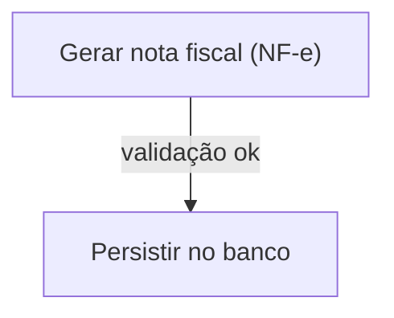
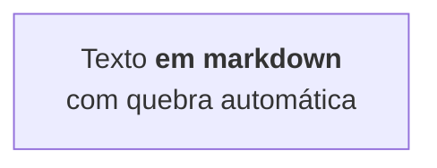
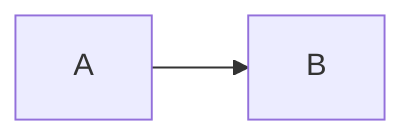
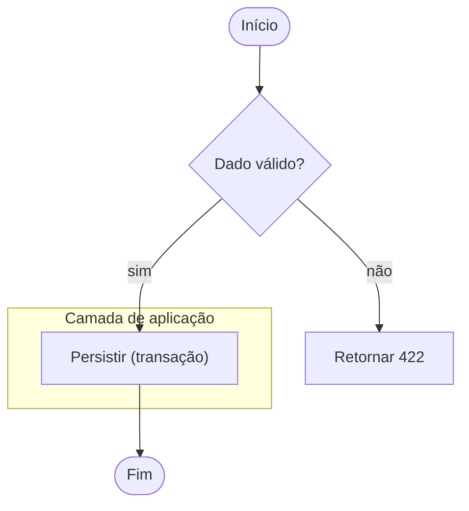
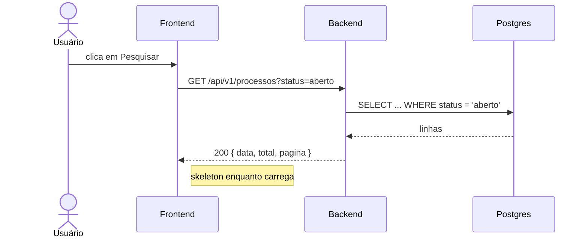
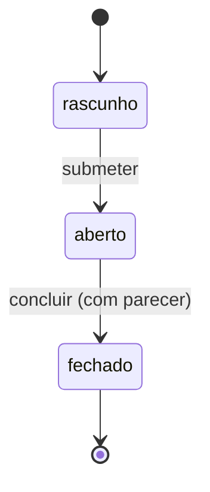
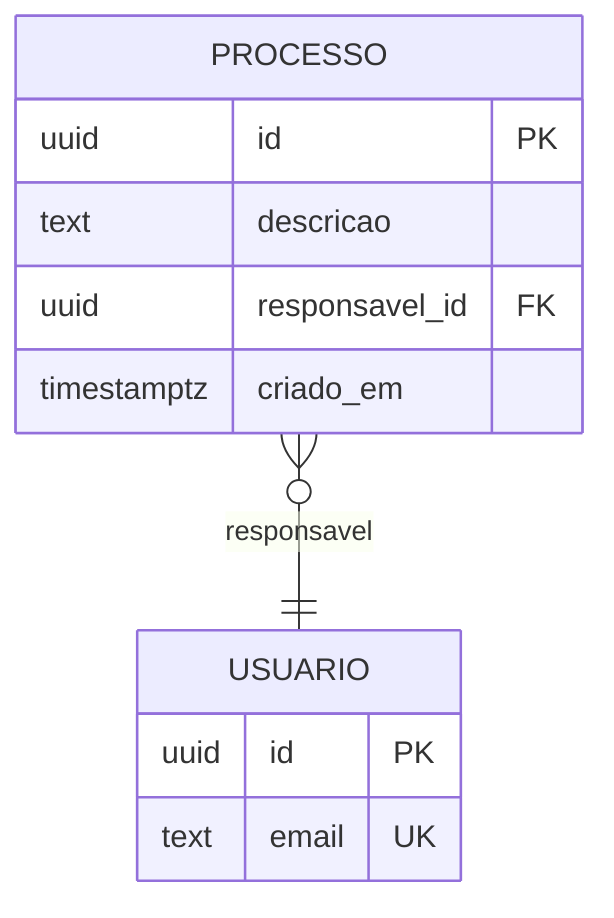

# Mermaid — sintaxe segura e validação obrigatória

Diagrama que não renderiza é pior que diagrama nenhum: ocupa espaço no
documento, quebra a leitura no GitHub/GitLab e ninguém percebe até alguém
abrir o arquivo. Este documento é o conjunto de regras que evita isso.

Todas as regras abaixo foram verificadas contra o parser oficial do Mermaid
— cada "quebra" listada é um `Parse error` reproduzível, não suposição.

Referência: https://mermaid.js.org/syntax/flowchart.html

---

## Regra nº 1 — aspas duplas em todo rótulo

**Envolva em `"` o texto de todo nó, toda aresta e todo título de subgraph.**
Não avalie caso a caso se aquele rótulo específico precisa: sempre aspas.
Custa dois caracteres e elimina a classe inteira de erro.



Sem as aspas, o mesmo diagrama é um `Parse error`.

### O que quebra sem aspas (verificado no parser)

| Construção | Sem aspas | Com aspas |
|---|---|---|
| `A[Gerar NF (fiscal)]` | ❌ Parse error | ✅ `A["Gerar NF (fiscal)"]` |
| `A[payload {id}]` | ❌ Parse error | ✅ `A["payload {id}"]` |
| `A -->\|valida (x)\| B` | ❌ Parse error | ✅ `A -->\|"valida (x)"\| B` |
| `A[API: /processos]` | ✅ passa | ✅ use aspas assim mesmo |
| `A[POST /api/v1]` | ✅ passa | ✅ use aspas assim mesmo |

As duas últimas passam hoje, mas dependem do contexto da linha e mudam
entre versões do Mermaid. A regra continua sendo: sempre aspas.

## Regra nº 2 — nunca aspas duplas dentro de rótulo

Aspas duplas dentro de um rótulo já delimitado por aspas **não geram erro de
parse** — o diagrama renderiza com o texto truncado ou deformado, o que é
pior, porque passa despercebido.

```
❌  A["usuário clica "Salvar" e aguarda"]     ← trunca no render
✅  A["usuário clica #quot;Salvar#quot; e aguarda"]
✅  A["usuário clica 'Salvar' e aguarda"]      ← apóstrofo é seguro
✅  A["usuário clica em Salvar e aguarda"]     ← preferível: reescrever
```

**Ordem de preferência:** reescrever sem aspas → apóstrofo simples →
entidade `#quot;`. Aspas duplas cruas nunca.

Apóstrofo (`'`) dentro de rótulo entre aspas duplas é seguro e renderiza
normal — `A["status = 'aberto'"]` funciona.

## Regra nº 3 — quebra de linha é `<br/>`, nunca `\n`

`\n` dentro de um rótulo **passa no parser** e depois aparece literalmente
como os caracteres `\n` no diagrama renderizado. É a causa mais comum de
diagrama feio deste projeto.

```
❌  ANALISTA[analista-requisitos\nVisão + spec.md]
✅  ANALISTA["analista-requisitos<br/>Visão + spec.md"]
```

Alternativa para texto longo: markdown string com crase, que quebra sozinho.



## Regra nº 4 — escape por entidade

Caractere problemático dentro de rótulo vira entidade HTML numérica ou
nomeada, sempre terminada em `;`:

| Caractere | Escape |
|---|---|
| `"` | `#quot;` |
| `#` | `#35;` |
| `;` (em sequenceDiagram) | `#59;` |
| `<` `>` | `#lt;` `#gt;` |
| `&` | `#amp;` |

Os números são base 10. Nomes HTML também funcionam.

## Regra nº 5 — palavras e caracteres reservados

- **`end` em minúsculo quebra o flowchart.** Use `End`, `END`, ou envolva:
  `["end"]`, `(end)`, `{end}`. Vale para id de nó e para texto.
  Em `sequenceDiagram`, `end` dentro do texto da mensagem é seguro.
- **`o` ou `x` como primeira letra de um nó de destino** vira aresta de
  círculo/cruz: `A---oB` não liga A a `oB`, cria uma aresta circular.
  Escreva `A --- oB` com espaço, ou capitalize: `A---Ops`.
- **`;` em texto de mensagem de sequenceDiagram quebra** — o parser trata
  como fim de instrução. Use `#59;` ou reescreva. Foi por isso que este
  projeto adotou `Note right of X:` em vez de embutir ponto e vírgula.

## Regra nº 6 — ids de nó são ASCII simples

O id é o identificador, não o texto. Mantenha `[A-Za-z0-9_]` e coloque o
texto de verdade no rótulo:

```
❌  Análise-Requisitos[texto]
✅  ANALISE_REQ["Análise de requisitos"]
```

Acento, espaço e pontuação vão no rótulo — nunca no id.

## Regra nº 7 — comentário é `%%` em linha própria



Comentário no meio de uma linha de sintaxe não existe em Mermaid.

---

## Sintaxe por tipo de diagrama

### flowchart



Direções: `TD`/`TB`, `BT`, `LR`, `RL`. Título de subgraph com espaço ou
emoji: use a forma com id e colchetes — `subgraph ID["Título"]`.

### sequenceDiagram



O texto da mensagem vai do `:` até o fim da linha e aceita chaves, aspas e
barras sem escape. As duas exceções: `;` (usar `#59;`) e `<br/>` para quebrar
linha. Nome de participante com espaço ou acento: use `participant ID as Nome`.

### stateDiagram-v2



### erDiagram



Nome de entidade em MAIÚSCULA sem espaço. Rótulo de relacionamento entre
aspas. Cardinalidade: `||--||` um-para-um, `||--o{` um-para-muitos,
`}o--||` muitos-para-um, `}o--o{` muitos-para-muitos.

---

## Validação obrigatória antes de salvar

Nenhum diagrama entra em arquivo do projeto sem passar pelo validador.
Ele usa o parser oficial do Mermaid — o mesmo que o GitHub usa.

```bash
# uma vez por máquina
npm install --no-save mermaid jsdom

# validar todos os .md do projeto
node examples/quality/validar-mermaid.mjs $(find . -name "*.md" -not -path "./node_modules/*")

# validar um arquivo específico
node examples/quality/validar-mermaid.mjs specs/processos/design.md
```

Saída esperada: `N/N blocos válidos`. Qualquer bloco reprovado sai com
arquivo, linha e a mensagem do parser.

**O validador não detecta a Regra 2 nem a Regra 3** — aspas duplas cruas e
`\n` passam no parse e quebram só no render. Essas duas você confere lendo
o diagrama antes de salvar.

## Checklist antes de salvar qualquer diagrama

- [ ] Todo rótulo de nó, aresta e subgraph entre aspas duplas
- [ ] Nenhuma aspa dupla crua dentro de rótulo (`#quot;`, apóstrofo ou reescrever)
- [ ] Quebra de linha com `<br/>`, nunca `\n`
- [ ] Nenhum `end` minúsculo em flowchart
- [ ] Ids de nó em ASCII simples, sem acento nem espaço
- [ ] Validador rodou e retornou 100% dos blocos válidos
- [ ] Diagrama está no lugar certo (ver `CLAUDE.md`, "Diagramas Mermaid — localização obrigatória")
