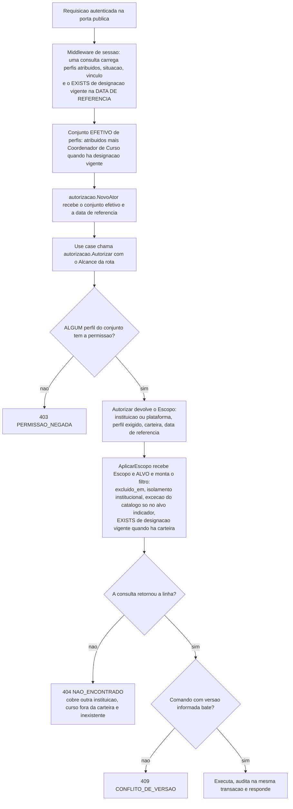

# Fundação comum das features de metas

**Data:** 28/09/2026 (revisão 2) · **Autor:** `arquiteto`
**Status:** proposto — aguarda aprovação do dono do produto
**Entradas:** `specs/00-visao-produto.md` · `project.config.md` · `CLAUDE.md` ·
`specs/autenticacao-usuarios/design.md` (revisão 6) · `specs/_status.md`
(reconciliação) · as quatro `spec.md` e `ux.md` de `indicadores`, `cursos`,
`plano-acao` e `metas-coordenacao`

> **Por que este arquivo existe.** As quatro features compartilham **um único
> mecanismo de autorização** e três decisões que, se fossem repetidas em quatro
> `design.md`, divergiriam na primeira correção. Aqui ficam **só** as partes
> comuns; cada `design.md` de feature instancia o que está aqui e **não
> redefine nada**.
>
> **O que este arquivo não faz:** não redesenha nada de
> `autenticacao-usuarios`. `Escopo`, `Autorizar`, `AplicarEscopo`, as duas
> portas estreitas, campos base, deleção lógica, concorrência otimista com 409,
> paginação com envelope e allowlist, auditoria de dois canais,
> `UnidadeDeTrabalho`, middleware de sessão, a borda HTTP (§4.5) e a porta
> administrativa são **herdados e reutilizados**, nunca reinventados.
>
> **Revisão 2:** o item de catálogo do menu passa a chamar-se **"Catálogo de
> metas"** (§8) — "Metas → Metas" confundia. Nenhuma outra alteração.

---

## 1. Sumário das decisões

| # | Decisão | Motivo curto |
|---|---|---|
| **F-01** | **`AplicarEscopo` passa a receber um `Alvo` enumerado** e continua sendo o único lugar que monta filtro de isolamento | Uma função para N tabelas, com a lista de tabelas fechada e testável — §3 |
| **F-02** | **A exceção do catálogo comum é atributo do `Alvo`, não do `Escopo`** — exatamente um `Alvo` a admite | Reproduzi-la em outra entidade exige editar a lista, e um teste falha — §3.3 |
| **F-03** | **A cláusula da exceção emite `instituicao_id IS NULL` E `escopo = 'plataforma'`**, entre parênteses | O `IS NULL` é o que torna o vazamento impossível **sem depender do `CHECK`**; o parêntese evita a precedência errada de `OR` — §3.3 |
| **F-04** | **`Escopo` ganha uma terceira dimensão: a carteira de cursos do ator** | O recorte por curso é isolamento, não filtro de tela; fora de `AplicarEscopo` ele seria repetido em nove adapters — §3.4 |
| **F-05** | **Toda entidade abaixo de `curso` carrega `curso_id` e `instituicao_id` denormalizados, com FK composta** | Mesmo mecanismo de `usuario_perfil` (D-17/§5.3): a redundância não pode divergir, e o filtro vira predicado de linha, sem junção — §3.5 |
| **F-06** | **`Escopo` inválido para o `Alvo` é erro, nunca predicado ausente** | É exatamente a classe de falha de M-3: ramo faltando que silenciosamente alarga — §3.6 |
| **F-07** | **O perfil de Coordenador é derivado na leitura, dentro da consulta única de sessão** | Alternativas em §4.1; a rotina diária cria 24 h de divergência e exige agendador inexistente |
| **F-08** | **`ConjuntoDePerfis` não ganha origem.** A distinção atribuído/derivado é propriedade da **leitura**, não do valor | Honra a decisão registrada ("não criar a coluna de origem"); §4.2 |
| **F-09** | **`coordenador_curso` é `Perfil` válido e linha inválida de `usuario_perfil`**, proibido por `CHECK` | Estado inválido irrepresentável, não três `if` — §4.3 |
| **F-10** | **`DataLocal` — Value Object de data pura no fuso de exibição** | `DG-06`, `PE-04`, `SI-11` e `AV-03` são a mesma regra; ela mora em um lugar — §5 |
| **F-11** | **A data de referência é fixada uma vez por requisição**, no middleware de sessão | Perfil derivado e carteira precisam concordar; duas leituras do relógio podem cair em dias diferentes — §5.2 |
| **F-12** | **Um único relê em segundo plano**, com `FOR UPDATE SKIP LOCKED` | O sistema é stateless com N réplicas; lock em memória não serve — §7 |
| **F-13** | **Indicadores entra no grupo Metas**; item de menu declara **lista de permissões (qualquer uma)** | Decisão 1 do dono; a lista-qualquer-uma é o que evita item duplicado para quem acumula perfis — §8 |
| **F-14** | **MinIO e Mailpit entram no ambiente**, com portas em `/port` sem identificador de negócio | Nenhuma terceira porta estreita é criada — §9 |

---

## 2. Onde estas features entram no mecanismo existente



**Três coisas que a figura fixa e o texto sozinho deixaria ambíguas:**

1. **O conjunto efetivo é montado antes do `Ator`**, e o `Ator` é a única entrada
   de `Autorizar`. Por construção, **o motor de autorização nunca vê o conjunto
   atribuído** — que é a restrição 16 de `cursos` garantida por desenho, não por
   disciplina.
2. **`404` cobre três causas distintas pelo mesmo caminho:** outra instituição,
   curso fora da carteira e registro inexistente. Nenhuma delas confirma
   existência. É o mesmo recorte, em três dimensões.
3. **A data de referência atravessa a figura inteira**, do middleware ao SQL. É
   a mesma em todos os pontos porque é lida uma vez.

---

## 3. O mecanismo de isolamento generalizado

### 3.1 O que muda em `AplicarEscopo`, e o que não muda

Hoje a função é exclusiva de `usuario_repository.go` e tem o alias `usuario`
embutido. Com nove entidades novas, há três saídas, e duas são ruins:

| Saída | Por que não |
|---|---|
| Uma função por tabela | Nove cópias da mesma regra. A décima é escrita por quem não leu as outras nove — é literalmente como M-3 aconteceu |
| Parâmetro `alias string` livre | O chamador escolhe a tabela, e nada impede passar uma tabela que o desenho não cobre. Pior: a exceção do catálogo passaria a depender de o chamador escrever a string certa |
| **Parâmetro `Alvo` enumerado** ✅ | A lista de tabelas é **fechada, declarada em um arquivo e percorrível por teste**. A exceção do catálogo vira um campo de um registro, não uma string comparada |

**O que não muda:** continua sendo a **única** função do sistema que monta
filtro de isolamento; continua proibido escrever `instituicao_id` em `WHERE`
fora dela; a exceção sancionada de `ContarDetentoresDoPerfil` (§4.3 do design
de autenticação) continua sendo a única, e o comentário continua tendo de
nomeá-la.

> **Ordem obrigatória:** esta generalização é **rebase sobre T-101**, nunca
> substituição. T-101 corrige o ramo de plataforma a emitir
> `instituicao_id IS NULL`; a generalização carrega essa correção para todos os
> alvos. Se a generalização entrar antes, T-101 some dentro dela e o teste que
> a fixa (`TestAplicarEscopo_PlataformaExigeInstituicaoNula`) perde o objeto.

### 3.2 A assinatura

```go
// Alvo é a lista FECHADA de tabelas que passam pelo filtro de isolamento.
// Acrescentar um Alvo é decisão do arquiteto e exige alterar §3 deste
// documento no mesmo commit — o teste de §3.7 percorre esta lista.
type Alvo struct {
    alias               string
    temColunaCurso      bool // entidades abaixo de curso na cadeia (F-05)
    admiteCatalogoComum bool // VERDADEIRO EM EXATAMENTE UM (F-02)
    admiteExigePerfil   bool // só usuario: o EXISTS de posse não existe fora dele
}

var (
    AlvoUsuario     = Alvo{alias: "usuario", admiteExigePerfil: true}
    AlvoIndicador   = Alvo{alias: "indicador", admiteCatalogoComum: true}
    AlvoMeta        = Alvo{alias: "meta"}
    AlvoCurso       = Alvo{alias: "curso", temColunaCurso: true}
    AlvoDesignacao  = Alvo{alias: "designacao", temColunaCurso: true}
    AlvoPeriodo     = Alvo{alias: "periodo"}
    AlvoPlano       = Alvo{alias: "plano", temColunaCurso: true}
    AlvoItemPlano   = Alvo{alias: "item_plano", temColunaCurso: true}
    AlvoEntrega     = Alvo{alias: "entrega", temColunaCurso: true}
    AlvoAnexo       = Alvo{alias: "anexo", temColunaCurso: true}
    AlvoDocumento   = Alvo{alias: "documento", temColunaCurso: true}
)

func AplicarEscopo(escopo autorizacao.Escopo, alvo Alvo, proximoPlaceholder int) (string, []any, error)
```

`AlvoCurso` tem `temColunaCurso: true` porque a coluna é a própria `id` — o
fragmento de carteira usa `curso.id`; nas demais, `<alias>.curso_id`. A
diferença fica dentro da função, não no chamador.

### 3.3 O corpo, e a exceção nomeada

```
excluido_em IS NULL                                        sempre

se escopo.Plataforma():
    <alias>.instituicao_id IS NULL                         ← T-101, todos os alvos

senão, se alvo.admiteCatalogoComum:                        ← exceção, um alvo só
    ( <alias>.instituicao_id = $n
      OR ( <alias>.instituicao_id IS NULL
           AND <alias>.escopo = 'plataforma' ) )

senão:
    <alias>.instituicao_id = $n

se escopo.ExigePerfil() != nil:                            ← só AlvoUsuario
    EXISTS (SELECT 1 FROM usuario_perfil ...)

se escopo.RestritoACarteiraDe() != nil:                    ← §3.4
    EXISTS (SELECT 1 FROM designacao ... vigente em $data)
```

**Três detalhes que carregam a segurança inteira, e nenhum é cosmético:**

1. **O parêntese externo do `OR` não é estilo.** `a AND b OR c` em SQL é
   `(a AND b) OR c`. Sem o parêntese, a disjunção escapa do `AND
   excluido_em IS NULL` e a consulta passa a devolver **linha excluída
   logicamente de qualquer instituição**. É um erro de uma tecla que não quebra
   teste nenhum de caminho feliz.
2. **`instituicao_id IS NULL` é a cláusula que carrega a garantia; `escopo =
   'plataforma'` é a que carrega a intenção.** As duas juntas, e nessa ordem de
   importância. Se sobrasse só a segunda, a segurança passaria a depender do
   `CHECK` de coerência continuar existindo numa migration futura — proteção em
   outro arquivo, que é a forma educada de dizer proteção por coincidência
   (M-3). A primeira é **incapaz por construção** de retornar linha de outra
   instituição, sem depender de nada.
3. **A exceção é a conjunção de duas condições independentes:** o escopo ser
   institucional **e** o alvo declarar `admiteCatalogoComum`. Nenhuma das duas
   sozinha abre a porta. Reproduzir a exceção em `meta`, `plano`, `item_plano`,
   `entrega` ou `anexo` exige **editar a lista de alvos**, o que quebra o teste
   de §3.7 e exige decisão registrada.

**Por que não deixar a exceção no `Escopo`.** Seria um `bool` que `Autorizar`
liga por alcance — e aí todo alcance institucional que um dia tocasse
`indicador` precisaria lembrar de ligá-lo, e todo alcance que não devesse
precisaria lembrar de não ligar. Duas listas para manter em concordância. No
`Alvo`, a decisão é tomada **uma vez, pela tabela**, que é onde a propriedade
de fato mora: linhas de `indicador` podem não ter instituição; linhas de `meta`
não podem. Registrado como alternativa rejeitada em §11.

**Consequência que o `code-reviewer` precisa conhecer:** a junção de
`meta_indicador` para `indicador`, dentro das consultas de meta, de item e do
relatório, **também passa por `AplicarEscopo` com `AlvoIndicador`** — nunca é
junção nua com `excluido_em IS NULL`. Alcançabilidade através de `meta_indicador`
*parece* autorização suficiente (a meta já está recortada), mas é a mesma
frase que justificaria qualquer outra junção nua, e é assim que a próxima
exceção entra.

### 3.4 A carteira de cursos, terceira dimensão do `Escopo`

O recorte do coordenador — "os cursos que ele coordena hoje" — é **regra de
autorização**, não filtro de tela: é o que produz `404` para plano, entrega e
anexo de curso alheio dentro da própria instituição (`VI-02`, `EN-07`,
`AN-06`, `CV-01`). Fora de `AplicarEscopo`, ele seria repetido em nove adapters,
e o nono é onde alguém esquece.

```go
type Escopo struct {
    valido             bool
    plataforma         bool
    instituicaoID      *uuid.UUID
    exigePerfil        *valueobject.Perfil
    restritoACarteiraDe *uuid.UUID          // NOVO: id do coordenador
    dataDeReferencia   valueobject.DataLocal // NOVO: o "hoje" da requisição
}
```

Campos não exportados, sem construtor exportado: **continua impossível obter um
`Escopo` fora de `Autorizar`**, que é a propriedade central do desenho herdado.
`Autorizar` liga `restritoACarteiraDe` **apenas** nos alcances de carteira
(§6.2), e para eles liga **sempre**.

Fragmento emitido:

```sql
EXISTS (SELECT 1 FROM designacao d
         WHERE d.curso_id = <curso do alvo>
           AND d.coordenador_id = $n
           AND d.excluido_em IS NULL
           AND d.data_inicio <= $d
           AND (d.data_fim IS NULL OR d.data_fim >= $d))
```

**O predicado de vigência não é escrito à mão aqui.** Ele vem de
`postgres.FragmentoDesignacaoVigente(alias string, n int)`, a mesma função que
o `EXISTS` da consulta de sessão usa (§4.1) e que o relatório usa para a marca
de coincidência. Três usos, uma definição — ver §5.3 para o porquê e para o
teste que prende os três à mesma resposta.

### 3.5 Por que `curso_id` e `instituicao_id` denormalizados na cadeia inteira

Sem eles, o fragmento de carteira sobre `anexo` precisaria de três junções
(`anexo → entrega → item_plano → plano`) dentro de uma função que hoje monta
um pedaço de `WHERE`. Uma função que monta junção deixa de ser um filtro e
passa a ser um construtor de consulta — e o chamador tem de saber onde encaixar
o `FROM`, o que devolve a decisão para o chamador exatamente onde o desenho a
tirou dele.

**A redundância é o mecanismo, não uma cópia mantida à mão** — exatamente o
argumento de §5.3 do design de autenticação, e é deliberado reusá-lo em vez de
inventar outro:

```sql
CREATE UNIQUE INDEX uq_curso_id_instituicao ON curso (id, instituicao_id);
CREATE UNIQUE INDEX uq_plano_id_curso       ON plano (id, curso_id);
CREATE UNIQUE INDEX uq_item_id_curso        ON item_plano (id, curso_id);
CREATE UNIQUE INDEX uq_entrega_id_curso     ON entrega (id, curso_id);

-- e as FKs compostas que tornam a divergência irrepresentável:
plano       (curso_id, instituicao_id) → curso (id, instituicao_id)
item_plano  (plano_id, curso_id)       → plano (id, curso_id)
entrega     (item_plano_id, curso_id)  → item_plano (id, curso_id)
anexo       (entrega_id, curso_id)     → entrega (id, curso_id)
```

`instituicao_id` desce pela mesma técnica, a partir de `curso`. Deriva: zero —
`curso.instituicao_id` é imutável, e `plano.curso_id` também (um plano nunca
troca de curso; a operação equivalente é criar outro plano).

Custo: duas colunas `UUID` por tabela. Benefício: os dois filtros de isolamento
são **predicados da própria linha**, indexáveis, sem junção, e iguais em todas
as tabelas — o que é o que permite `AplicarEscopo` continuar sendo uma função
de vinte linhas.

### 3.6 Escopo incompatível com o alvo é **erro**

| Situação | Comportamento |
|---|---|
| `ExigePerfil != nil` e `!alvo.admiteExigePerfil` | `ErrEscopoInvalido` |
| `RestritoACarteiraDe != nil` e `!alvo.temColunaCurso` | `ErrEscopoInvalido` |
| `!escopo.Valido()` | `ErrEscopoInvalido` (já existe) |

**Nunca ignorar em silêncio.** Um `Escopo` restrito à carteira aplicado a um
alvo sem coluna de curso, se o ramo apenas não fosse emitido, devolveria
**todas as linhas da instituição para um coordenador**. É M-3 outra vez, com
outro nome: ramo ausente que alarga o recorte, compila e passa nos guardas. O
erro transforma a falha silenciosa em `500` com log — feio, visível, e
detectado pelo smoke da rota.

### 3.7 Os testes que congelam o mecanismo

Categoria **mecanismo, não cobertura** — obrigatórios em qualquer fase, como os
três guardas de §4.4 do design de autenticação.

| Teste | O que falha se alguém mexer |
|---|---|
| `TestAlvos_ExcecaoDoCatalogoEmExatamenteUm` | Percorre **todos** os `Alvo` declarados; reprova se `admiteCatalogoComum` for verdadeiro em zero ou em mais de um, ou se o único não for `AlvoIndicador` |
| `TestAplicarEscopo_SemExcecaoForaDoIndicador` | Para cada alvo ≠ indicador, com escopo institucional: a cláusula contém `instituicao_id = $` e **não contém** ` OR ` |
| `TestAplicarEscopo_ExcecaoDoCatalogoTemIsNullEParenteses` | No indicador: a cláusula contém `instituicao_id IS NULL`, contém `escopo = 'plataforma'` e o `OR` está entre parênteses |
| `TestAplicarEscopo_PlataformaExigeInstituicaoNula` | Já previsto em T-101, agora para **todos** os alvos |
| `TestAplicarEscopo_EscopoIncompativelComAlvoFalha` | Carteira em alvo sem curso, e `exigePerfil` fora de `usuario`, devolvem erro — não cláusula sem o ramo |
| `TestAplicarEscopo_CarteiraUsaOFragmentoUnico` | A cláusula de carteira é byte-a-byte a saída de `FragmentoDesignacaoVigente` |
| `TestRepositoriosDeNegocio_TodoMetodoExigeEscopo` | **Estendido** aos nove repositórios novos |
| `TestPortasEstreitas_ListaFechada` | **Inalterado** — continua com as duas portas e as seis assinaturas |
| `TestNenhumaPortaNovaSemEscopo` | **Estendido** às portas novas de §9 |

`IV-04` e `IV-05` da spec de `indicadores` são cobertos pelos dois primeiros, e
o quarto fecha a metade que faltava: `IV-05` pede um teste que falhe se a
exceção for ampliada, e a forma mais barata de ampliá-la é por engano num alvo
novo.

---

## 4. O perfil de Coordenador derivado de designação com vigência

### 4.1 A decisão, e o que as alternativas custam

**O problema, dito sem rodeio:** o conjunto de permissões de uma pessoa passa a
depender da passagem do tempo. Uma portaria que vence à meia-noite rebaixa
alguém **sem nenhuma escrita no banco** — não existe evento ao qual reagir.

| Caminho | Custo real |
|---|---|
| **Coluna materializada**, atualizada na escrita | Estruturalmente incapaz de estar certa: não há escrita no instante do vencimento. Só funcionaria com um agendador, que é o caminho seguinte |
| **Rotina diária** que rebaixa | Janela de até 24 h em que o banco diz uma coisa e a portaria diz outra — e é nessa janela que alguém entrega para um curso que já não é dele. Exige agendador que o projeto não tem, e produz eventos de rebaixamento sem ato humano correspondente. **Recusada na spec (3.9)** |
| **Calcular sob demanda dentro de `Autorizar`** | Põe I/O na camada de domínio. `Autorizar` deixa de ser função pura e passa a precisar de `context` e de repositório — destrói a testabilidade que sustenta os testes de matriz de autorização |
| **Derivar na leitura, na consulta que a sessão já faz** ✅ | Um `EXISTS` a mais na consulta mais frequente do sistema. Zero janela. Zero infraestrutura nova |

**Decisão: derivar na leitura, dentro da consulta única de `CarregarContextoDeSessao`** —
não numa segunda consulta. Uma segunda consulta dobraria as idas ao banco do
caminho mais quente do sistema para ler um booleano.

```sql
SELECT u.id, u.nome, ..., COALESCE(array_agg(up.perfil ...), '{}') AS perfis,
       EXISTS (SELECT 1 FROM designacao d
                WHERE d.coordenador_id = u.id
                  AND d.excluido_em IS NULL
                  AND d.data_inicio <= $2
                  AND (d.data_fim IS NULL OR d.data_fim >= $2)) AS coordena_hoje,
       (SELECT count(*) FROM designacao d2
         WHERE d2.coordenador_id = u.id AND d2.excluido_em IS NULL
           AND d2.data_inicio <= $2
           AND (d2.data_fim IS NULL OR d2.data_fim >= $2)) AS cursos_coordenados
  FROM usuario u ...
```

**A armadilha que a implementação intuitiva comete:** juntar `curso` e filtrar
`situacao = 'ativo'`. **Designação vigente de curso inativo mantém o perfil**
(PC-7, `CP-06`) — inativar um curso é ato de gestão, e fazê-lo oscilar o
privilégio de uma pessoa transformaria um ciclo normal numa sequência de
mudanças de acesso. O `EXISTS` **não toca em `curso`**.

`cursos_coordenados` existe porque a tela precisa dizer *"Coordenador de Curso
(por designação vigente em 2 cursos)"* (3.9). É **um campo por fato** e
`coordena_hoje` seria o mesmo fato: por isso `coordena_hoje` **não vai para a
API** — é interno ao montador do conjunto. A resposta expõe
`cursos_coordenados`, e a tela deriva o resto disso. Condição 2 da decisão 3 do
dono, aplicada.

**Custo declarado:** `+1 EXISTS` e `+1 COUNT` na consulta de toda requisição
autenticada. Verificação como **propriedade** (D-19): ausência de varredura
sequencial em `designacao` na consulta de sessão, e a consulta inteira dentro
do orçamento de **p95 < 20 ms** de `cursos` §11. **Nunca nomeando o índice.**

### 4.2 Como perfil atribuído e perfil derivado convivem

Esta é a parte que atravessa o `ConjuntoDePerfis` da autenticação, e a resposta
é: **não atravessa — o tipo não muda.**

O design de autenticação registrou: *"A distinção atribuído/derivado não existe
hoje e não deve ser inventada agora — teria um valor só"*, e o dono repetiu em
`_status.md`: *"não criar agora a coluna de origem"*. Mantenho as duas, e a
forma de mantê-las é esta:

> **A distinção é propriedade da leitura, não do valor.** Há um único tipo
> `ConjuntoDePerfis`, sem campo de origem, sem método `Derivados()`. O que
> difere é **qual consulta produziu o conjunto**.

| Quem lê | O que lê | Que conjunto é |
|---|---|---|
| `UsuarioRepository.BuscarPorID` / `Listar` — o CRUD de usuários | só `usuario_perfil` | **atribuído**. Inalterado. É o que o `PUT` aceita de volta |
| `AutenticacaoRepository.CarregarContextoDeSessao` | `usuario_perfil` **e** o `EXISTS` de designação | **efetivo**. É o único lugar onde a união acontece |

Consequências, e cada uma resolve um cenário da spec:

- **`Ator.perfis` é sempre o conjunto efetivo**, porque o único caminho que
  constrói um `Ator` é alimentado por `CarregarContextoDeSessao`. A restrição
  16 de `cursos` — *"o motor de autorização nunca lê apenas os perfis
  atribuídos"* — passa a ser verdadeira **por construção**, não por vigilância.
  `CP-14` vira teste de mecanismo: existe **uma** função
  `montarConjuntoEfetivo(atribuidos, coordenaHoje)`, e é a única no projeto que
  acrescenta `CoordenadorCurso` a um conjunto.
- **`CP-01` sai de graça:** o conjunto atribuído no banco nunca contém
  Coordenador (§4.3); o efetivo contém.
- **`CP-02`, `CP-03`, `CP-04` saem de graça:** a união acrescenta, nunca
  substitui; o desaparecimento do derivado não toca em nenhuma linha de
  `usuario_perfil`.
- **A API carrega a origem; o domínio não.** Duas rotas, dois significados,
  cada um coerente com o seu consumidor:

| Rota | `perfis` significa | Campos de apoio |
|---|---|---|
| `GET /api/v1/auth/eu` | conjunto **efetivo**, ordem canônica | `perfis_derivados: ["coordenador_curso"]` (subconjunto de `perfis`) · `cursos_coordenados: 2` |
| `GET/POST/PUT /api/v1/usuarios[...]` | conjunto **atribuído** — exatamente o que o `PUT` aceita | **nenhum** campo derivado |

  **O risco está declarado:** `perfis` tem dois significados em rotas
  diferentes. Aceito, porque cada consumidor precisa de exatamente um deles e
  nunca do outro — o menu filtra pelo efetivo, a tela de edição edita o
  atribuído —, e porque a alternativa (um terceiro nome, `perfis_efetivos`, em
  `/auth/eu`) quebraria o contrato já implementado e testado da autenticação
  sem entregar clareza a ninguém. `perfis_derivados` responde literalmente a
  pergunta que a tela faz: *quais destas fichas eu renderizo travadas.*

### 4.3 `coordenador_curso` deixa de ser atribuível

**Três camadas, e só a terceira é garantia:**

1. `valueobject.ConjuntoInstitucional` recusa `coordenador_curso` →
   **403 `PERFIL_NAO_ATRIBUIVEL`**, o mesmo código e o mesmo caminho que já
   existem para `administrador_sistema`.
2. `Perfil.PodeAtribuir`: `CoordenadorCurso` sai da lista do PI.
3. **`CHECK` no banco**, depois da normalização:
   `CHECK (perfil IN ('administrador_sistema','pesquisador_institucional','professor','aluno'))`.

> **`coordenador_curso` é um `Perfil` válido e uma linha inválida de
> `usuario_perfil`.** O valor continua existindo — o conjunto efetivo o usa,
> `Pode()` o consulta, o menu filtra por ele. O que deixa de existir é a
> **linha**. Escrever a regra assim é o que impede alguém de "consertar" o
> `Perfil` removendo a constante e quebrando a derivação inteira.

**Ordem da migration é parte da decisão** (3.12, item 5), e inverter produz um
intervalo em que coordenador legítimo não entra em `Minhas metas`:

```
1. CREATE TABLE curso, designacao          (+ índices e restrições)
2. INSERT das designações do seed
3. DELETE FROM usuario_perfil WHERE perfil = 'coordenador_curso'
   + uma linha de auditoria por usuário afetado, motivo
     "perfil de coordenador passou a ser derivado de designação"
4. ALTER TABLE usuario_perfil ... CHECK estreitado
```

O passo 4 **depois** do 3, obrigatoriamente: a restrição não pode ser aceita
enquanto existirem linhas que a violam. E o passo 3 depois do 2, porque quem
tem designação vigente precisa já estar coberto pela derivação no instante em
que perde a linha.

**Nada de evento de rebaixamento por pessoa** (3.12, item 3): audita-se a
normalização do modelo, uma linha por usuário afetado. O que é auditado no
regime novo é **a designação**, que é o fato real, tem portaria e tem data.

### 4.4 Efeito sobre sessão em andamento — nenhum mecanismo novo

`sessoes_validas_a_partir_de` **não é tocado**. Uma portaria vencendo não pode
deslogar ninguém: a pessoa continua sendo quem é, só deixou de responder por um
curso.

O frontend já compara o conjunto recebido de `/auth/eu` com o que renderizou,
na troca de rota e no retorno de foco, nas duas direções (design de
autenticação, §11). Esse mecanismo carrega a mudança de perfil derivado **sem
uma linha de alteração** — o que `cursos` 3.9 pede é apenas o **texto** do
aviso, com o documento e a data, e a comparação passa a olhar também
`perfis_derivados` para escolher entre as duas mensagens (ganhou / perdeu).

---

## 5. Tempo: `DataLocal` e a data de referência

### 5.1 O Value Object

`DG-06`, `PE-04`, `SI-11`, `AV-03` e `VG-06` são **a mesma regra** vista de
cinco ângulos: *o dia no fuso de exibição, inteiro*. Espalhada, ela é escrita
certa em três lugares e errada no quarto — e o quarto só aparece em produção,
às 21h.

```go
// domain/valueobject/data_local.go
type DataLocal struct{ ano int; mes time.Month; dia int } // imutável, sem fuso embutido

func DataLocalDe(instante time.Time, local *time.Location) DataLocal
func DataLocalTexto(iso string) (DataLocal, error)   // "2026-03-15"
func (d DataLocal) AntesDe(o DataLocal) bool
func (d DataLocal) MaisDias(n int) DataLocal
func (d DataLocal) FimDoDia(local *time.Location) time.Time // 23:59:59.999999
func (d DataLocal) String() string                          // "2026-03-15", para SQL
```

Mapeia para `DATE` no banco (`data_inicio`, `data_fim`, `aprovacao_data`) e para
`"2026-03-15"` na API — **data pura, nunca instante**. Tratar data pura como
timestamp é o que faz vencimento aparecer um dia antes.

`FimDoDia` é o que produz o prazo de correção (`AV-03`): recusa em 29/07 às
16h40 → `DataLocal(29/07).MaisDias(7).FimDoDia(saoPaulo)` →
`2026-08-05T23:59:59.999999-03:00`, gravado como `TIMESTAMPTZ`.

### 5.2 Uma leitura do relógio por requisição

`Ator` ganha `dataDeReferencia DataLocal`, fixada **uma vez**, no middleware de
sessão, a partir de `Relogio.Agora()` e de `APP_TIMEZONE`. `Autorizar` a copia
para o `Escopo`. Motivo: o perfil derivado e o filtro de carteira precisam
concordar. Se o middleware lesse o relógio e o adapter lesse de novo, uma
requisição atravessando a meia-noite produziria um ator **com** o perfil de
coordenador e **sem** nenhum curso na carteira — um 403 que ninguém consegue
reproduzir.

**A mesma regra vale para processo de fundo, sem middleware de sessão** (achado
de revisão, T-124): o relê não tem `Ator`, mas ainda decide QUEM recebe uma
notificação via designação vigente — a data de referência que ele usa
**também** precisa vir de `DataLocalDe(Relogio.Agora(), fusoDeExibicao)`,
nunca de `time.Now().UTC()`. **Regra geral, não específica do relê: sempre
que uma data decide QUEM ou O QUÊ — não só quando exibe algo na tela — ela é
a data do fuso de exibição, nunca UTC**, independente de a chamada vir de um
handler HTTP com `Ator` ou de um processo de fundo sem nenhum.

### 5.3 Um predicado de vigência, três usos

| Uso | Onde |
|---|---|
| Rótulo (`futura` / `vigente` / `encerrada`) | `designacao.SituacaoEm(d DataLocal)`, em `/domain/designacao` |
| Filtro de carteira | `postgres.FragmentoDesignacaoVigente`, dentro de `AplicarEscopo` |
| `EXISTS` da sessão e marca do relatório | a mesma `FragmentoDesignacaoVigente` |

**Um teste prende os três à mesma resposta** nas fronteiras de `DG-06`:
31/07/2026 às 23h58 e 01/08/2026 às 00h02, horário de Brasília, mais o caso de
`data_fim` nula. O rótulo do domínio e o resultado do SQL têm de coincidir nos
três pontos.

> **Os testes de integração rodam com o container em UTC, de propósito.** Se
> rodassem em `America/Sao_Paulo`, `DG-06` e `PE-04` passariam por acidente, e
> a regressão apareceria só em produção. O `TZ` do serviço de teste **não** é
> `America/Sao_Paulo`, e isso é decisão, não esquecimento.

### 5.4 O par frontend de `DataLocal`: `formatarDataPura`

`frontend/src/lib/formato.ts` exporta `formatarDataPura(iso)`, que converte
`"AAAA-MM-DD"` (o formato de data pura da API, §5.1) para `"DD/MM/AAAA"` por
**manipulação de string** — nunca via `new Date(iso)`. `new Date("2026-09-26")`
é interpretada como meia-noite UTC; formatá-la de volta em
`America/Sao_Paulo` (UTC-3) cruza a fronteira da meia-noite e exibe
25/09, um dia antes. É a mesma armadilha do lado do servidor (§5.1), só que
no cliente ninguém tem `DataLocal` para se apoiar — daí a função existir.
**Toda data pura exibida no frontend passa por `formatarDataPura`, nunca por
`Intl.DateTimeFormat` com `timeZone` explícito** — isso é para instantes
(`formatarDataHora`), não para datas puras.

---

## 6. Permissões, alcances e a matriz

### 6.1 Permissões novas

Acrescentadas a `valueobject.Permissao` e à `matrizPermissoes`. `Administrador
do Sistema` **não ganha nenhuma permissão de conteúdo** — ele administra a
plataforma, e a negação a ele é de perfil (403), com a única exceção do
`indicador.plataforma.*`.

| Permissão | Adm. Sistema | PI | Coordenador |
|---|---|---|---|
| `indicador.plataforma.gerenciar` | ✅ | — | — |
| `indicador.listar` · `indicador.gerenciar` | — | ✅ | — |
| `meta.listar` · `meta.gerenciar` | — | ✅ | — |
| `curso.listar` · `curso.gerenciar` | — | ✅ | — |
| `designacao.gerenciar` | — | ✅ | — |
| `periodo.gerenciar` | — | ✅ | — |
| `plano.listar` · `plano.gerenciar` | — | ✅ | — |
| `plano.ler_proprio` | — | — | ✅ |
| `entrega.registrar` | — | — | ✅ |
| `entrega.listar` · `entrega.avaliar` | — | ✅ | — |
| `relatorio.ler` · `relatorio.exportar` | — | ✅ | — |
| `relatorio.ler_proprio` | — | — | ✅ |
| `curso.ler_proprio` | — | — | ✅ |

**Quem acumula soma as colunas** — é a união que `Pode()` já faz, sem uma linha
nova. E é por isso que `VI-02` de `cursos`, `VI-02` de `plano-acao` e
`VI-05` de `metas-coordenacao` — os três cenários de acúmulo — não exigem nada
além do que já existe.

### 6.2 Alcances novos

Cada alcance é uma linha em `permissaoExigida` e uma linha no `switch` que
devolve o `Escopo`. Os dois `switch` são exaustivos, e um teste percorre todos
os alcances conferindo o `Escopo` devolvido campo a campo.

| Alcance | Escopo devolvido |
|---|---|
| `IndicadoresDaPlataforma` | plataforma, sem perfil exigido |
| `CatalogoDeIndicadores` | instituição do ator (a exceção vem do **alvo**) |
| `MetasDaInstituicao` · `CursosDaInstituicao` · `DesignacoesDaInstituicao` · `PeriodosDaInstituicao` · `PlanosDaInstituicao` · `EntregasDaInstituicao` · `DesempenhoDaInstituicao` | instituição do ator |
| `CursosDaCarteira` · `PlanosDaCarteira` · `EntregasDaCarteira` · `DesempenhoDaCarteira` | instituição do ator **e** `restritoACarteiraDe = ator.usuarioID` |

**Os quatro alcances de carteira ligam a restrição sempre**, nunca
condicionalmente — a rota é que escolhe o alcance, e é a única decisão de
autorização que o handler toma (doutrina herdada, D-08).

**Quem acumula PI e Coordenador usa rotas diferentes para recortes
diferentes:** `/api/v1/planos` (alcance de instituição) e `/api/v1/meus-planos`
(alcance de carteira). Os dois recortes se somam **porque são duas rotas**, não
porque um `if` os mistura.

---

## 7. O relê em segundo plano — o único processo de fundo do projeto

Dois trabalhos, ambos de `metas-coordenacao`, ambos com marcador durável:

1. **Enviar as notificações pendentes** (§8 do design de `metas-coordenacao`).
2. **Restaurar prazo de correção após vacância** (PM-4, `VG-06`).

**Forma:** goroutine no próprio processo do backend, com *ticker*. Sem
agendador externo, sem mensageria — nenhum dos dois existe no projeto e nenhum
dos dois se justifica por isto.

**Concorrência entre réplicas resolvida no banco, nunca em memória:**
`SELECT ... FOR UPDATE SKIP LOCKED LIMIT n`. O sistema é stateless por
construção e roda com N réplicas desde o primeiro dia; um lock de processo
faria N réplicas enviarem N e-mails.

**Desligável por configuração:** `RELE_HABILITADO` (padrão `true`). É o botão
de "desligar por configuração" da seção de incidente do `CLAUDE.md` — sem ele,
conter um relê que está enviando e-mail errado exige deploy.

**Métricas obrigatórias**, por analogia direta à regra de outbox do
`CLAUDE.md`: `notificacoes_pendentes` (gauge) e
`notificacoes_enviadas_total{evento}` (counter). **Gauge crescendo é relê
parado** — e é o que transforma a exigência 2 da spec ("recusa registrada sem
e-mail enviado não pode ficar assim em silêncio") em alerta em vez de
descoberta.

---

## 8. Menu — `NAV_CONFIG` consolidado

Decisão 1 do dono, aplicada: **item de menu fica onde a tarefa acontece.**

```
Administrador do Sistema
  Sistema        · Instituições · Administradores do Sistema · Indicadores do INEP

Pesquisador Institucional
  Metas          · Indicadores · Catálogo de metas · Períodos · Planos
                 · Avaliação de entregas  [badge]  · Desempenho dos cursos
  Administração  · Usuários · Cursos

Coordenador de Curso
  Metas          · Minhas metas  [badge]  · Desempenho dos cursos
```

**O item do catálogo chama-se "Catálogo de metas", não "Metas"** — dentro do
grupo Metas, um item homônimo do grupo obriga o leitor a desambiguar duas vezes
("Metas → Metas" é uma trilha que não informa nada). A **rota `/app/metas` não
muda**: o que mudou é o rótulo, e rótulo é o que o usuário lê.

**Quem acumula vê o grupo Metas uma vez**, com os itens somados e sem
duplicata.

**A única alteração de mecanismo no frontend:** o item de `nav-config` passa a
declarar `permissoes: Permissao[]`, com semântica **qualquer uma**, e a
montagem deduplica por `path`. Motivo: "Desempenho dos cursos" é o mesmo
destino para dois perfis com permissões diferentes (`relatorio.ler` e
`relatorio.ler_proprio`) — declarar o item duas vezes o duplicaria para quem
acumula. A semântica "qualquer uma" é a mesma união que `Pode()` já faz no
backend; é coerência, não conceito novo. A montagem em si vive em
`montarNav(config, permissoes)`, função pura exportada separada de
`navParaPerfil` só para o teste de unidade poder exercitá-la com um
`NavGroup[]` de teste, sem depender do conteúdo real do menu mudando com
o tempo.

> **Divergência registrada, não contornada.** `specs/indicadores/spec.md`
> (DI-3, §3.9, wireframes 16.2 e 16.3) diz **Administração**; a reconciliação
> do dono diz **Metas**. Implemento **Metas**, e a correção do texto da spec é
> do `analista-requisitos` — inclusive as trilhas de navegação dos wireframes e
> o rótulo "Catálogo de metas".

---

## 9. Infraestrutura nova, e por que não há terceira porta estreita

| Serviço | Dev | Produção | Entra em |
|---|---|---|---|
| **MinIO** (9000 API, 9001 console) | `docker-compose.dev.yml` | MinIO self-hosted / S3 | `plano-acao` (documento) — antecipado porque o `.docx` chega antes dos anexos |
| **Mailpit** (1025 SMTP, 8025 UI) | idem | SMTP corporativo | `metas-coordenacao` |

```go
// port/armazenamento_de_objetos.go
type ArmazenamentoDeObjetos interface {
    Gravar(ctx context.Context, chave string, conteudo io.Reader, tipo string, tamanho int64) error
    Ler(ctx context.Context, chave string) (io.ReadCloser, string, error)
    Remover(ctx context.Context, chave string) error
}

// port/email_sender.go
type EmailSender interface {
    Enviar(ctx context.Context, destino valueobject.Email, assunto, corpo string) error
}

// port/gerador_de_documento.go
type GeradorDeDocumento interface {
    GerarPlanoDeMetas(ctx context.Context, dados DadosDoPlano) (io.ReadCloser, error)
}
```

**Nenhuma das três recebe `uuid.UUID`** — logo, nenhuma precisa de `Escopo`, e o
guarda 3 (`TestNenhumaPortaNovaSemEscopo`) continua verde **sem ampliar a lista
fechada das duas portas estreitas**. Isso é desenho, não sorte: a chave de
objeto é uma `string` opaca, construída no adapter a partir de identificadores
que já passaram por um repositório com `Escopo`.

> **Restrição inegociável:** *a chave de objeto nunca vem do cliente.* Ela é
> sempre lida da coluna `chave_objeto` de uma linha já recortada por `Escopo`.
> O handler de download recebe apenas o identificador do anexo ou do documento,
> busca a linha **com `Escopo`** (404 se fora do recorte) e só então entrega a
> chave ao armazenamento. Qualquer caminho do `c.Param`/`c.Query` para o
> adapter de armazenamento que não passe pelo repositório é achado **Crítico**.

**Circuit breaker** no adapter de SMTP (exigência de `project.config.md`) — no
adapter, nunca no use case, que não deve saber que existe um breaker. Falha de
e-mail **nunca** derruba a operação de negócio (§7).

**`/readyz` passa a verificar MinIO e SMTP**, sem devolver mensagem de driver —
a regra de §7 do design de autenticação vale igual para as dependências novas.

---

## 10. Decisões transversais (as nove perguntas do `CLAUDE.md`)

| Tema | Decisão |
|---|---|
| **Dual write** | **Existe em uma só feature:** recusa + e-mail, em `metas-coordenacao`. Solução: **reconciliação sobre o estado da entrega**, não Outbox — as três saídas de escape percorridas no design dela, §8. Nas outras três features não há dual write: mutação + auditoria na mesma transação, syslog é espelho cuja perda é tolerável |
| **Concorrência otimista** | `versao` + 409 em `indicador`, `meta`, `curso`, `designacao`, `periodo`, `plano`, `item_plano`, `entrega`. **Sem `versao`:** `meta_indicador` (parte do agregado meta, reescrito inteiro na transação, como `usuario_perfil`), `anexo` (escrito uma vez, removido logicamente só pelo autor), `documento` (imutável), `idempotencia` e as colunas de notificação (processo único) |
| **Mensageria** | **Não.** Nenhuma operação passa de 2 s com fan-out. A cópia em lote de 100 cursos fica abaixo de 10 s e tem retorno imediato com resumo; a geração do `.docx` fica abaixo de 2 s. **Gatilho:** exportação acima de 50.000 linhas (já declarado na spec) |
| **Cache** | **Não**, e é decisão, não omissão. O catálogo comum muda pouco mas precisa valer para todos **imediatamente** (`IE-05`), e um cache por instituição seria a forma mais rápida de duas IES lerem versões diferentes do mesmo indicador. Designação **é** o recorte de acesso: servir valor velho mostra ou esconde trabalho indevidamente. Todo número do relatório muda a cada avaliação |
| **Idempotência** | **Sim, em uma rota:** registro de entrega (`Idempotency-Key`, janela 24 h). Decisão 4 do dono, instanciada no design de `metas-coordenacao`, §7. **Não** no anexo individual — risco residual aceito e registrado lá |
| **Circuit breaker** | **Sim**, no adapter de SMTP. Não se aplica a MinIO: indisponibilidade dele já falha a operação de negócio de forma síncrona e visível |
| **Geo** | **Não.** Nenhuma feature tem localização |
| **Stateless** | **Sim, por construção.** Nenhum arquivo em disco de container; relê com `SKIP LOCKED`; nenhum estado em memória de processo |
| **IA** | **Não.** Nenhuma oportunidade aprovada |
| **Teste de carga** | **Não necessário** nas quatro. Nenhuma spec registra requisito explícito de RPS; o volume é de centenas de cursos |
| **Breaking change** | **Nenhum** em `/api/v1`. `GET /auth/eu` **acrescenta** `perfis_derivados` e `cursos_coordenados` — aditivo. `coordenador_curso` deixar de ser aceito no `PUT /usuarios/{id}` **é** mudança de comportamento, mas de `400`/`403` para um valor que a interface nunca mais envia, e nenhum consumidor além do frontend construído junto existe. Registrado, não versionado |

---

## 11. Alternativas consideradas e rejeitadas

| Alternativa | Por que foi rejeitada |
|---|---|
| **Uma função de isolamento por tabela** | Nove cópias da mesma regra; a décima é escrita por quem não leu as nove. É literalmente a origem de M-3 |
| **`alias string` livre em `AplicarEscopo`** | Devolve ao chamador a decisão que o desenho existe para tirar dele, e faz a exceção do catálogo depender de escrever a string certa |
| **Exceção do catálogo como `bool` do `Escopo`** | Duas listas para manter concordantes (alcances que ligam × alcances que não devem). No `Alvo`, a decisão é da tabela, que é onde a propriedade mora |
| **Exceção do catálogo só com `escopo = 'plataforma'`** | A segurança passaria a depender de um `CHECK` em outro arquivo continuar existindo. `instituicao_id IS NULL` não depende de nada |
| **Junção nua para `indicador` dentro das consultas de meta e do relatório** | "A meta já está recortada, logo o indicador alcançável está autorizado" é a mesma frase que justificaria a próxima exceção. Sempre por `AplicarEscopo` |
| **Recorte por curso repetido em cada adapter** | Nove lugares para acertar; o nono é onde alguém esquece. É o argumento do `CLAUDE.md` para a deleção lógica, aplicado à carteira |
| **Junções em vez de `curso_id` denormalizado** | `AplicarEscopo` deixaria de montar um filtro e passaria a montar consulta, devolvendo ao chamador a decisão de onde encaixar o `FROM` |
| **Coluna materializada de perfil de coordenador** | Não há escrita no instante do vencimento da portaria. Estruturalmente incapaz de estar certa |
| **Rotina diária de rebaixamento** | 24 h de divergência, agendador inexistente, e eventos de rebaixamento sem ato humano. Já recusada na spec |
| **Derivar o perfil dentro de `Autorizar`** | Põe I/O no domínio e destrói a testabilidade dos testes de matriz de autorização |
| **Segunda consulta para o perfil derivado** | Dobra as idas ao banco do caminho mais quente do sistema para ler um booleano |
| **Campo de origem em `ConjuntoDePerfis`** | Decisão registrada do dono; e a distinção já é obtida pela escolha da consulta, sem tipo novo |
| **`perfis_efetivos` como nome novo em `/auth/eu`** | Quebraria contrato já implementado e testado sem entregar clareza: `perfis_derivados` responde exatamente a pergunta que a tela faz |
| **Deixar `AplicarEscopo` ignorar escopo incompatível com o alvo** | Carteira em alvo sem curso devolveria a instituição inteira a um coordenador. M-3 com outro nome |
| **Item de menu chamado "Metas" dentro do grupo Metas** | "Metas → Metas" obriga a desambiguar duas vezes e não informa nada. O rótulo mudou; a rota não |

---

## 12. Restrições que atravessam as quatro features

1. `domain` e `usecase` **nunca** importam `gin`, `sqlx`, `pgx`, `prometheus`,
   `jwt`, `argon2`, cliente S3 ou cliente SMTP.
2. **Todo** método dos repositórios novos recebe `autorizacao.Escopo`. O filtro
   de isolamento é montado **só** em `AplicarEscopo`, para **todos** os alvos.
3. **A lista de `Alvo` é fechada.** Acrescentar um é decisão do arquiteto, com
   §3 deste documento alterada no mesmo commit.
4. **`admiteCatalogoComum` é verdadeiro em exatamente um alvo.** Teste congela.
5. **`AplicarEscopo` devolve erro** quando o `Escopo` é incompatível com o
   `Alvo` — nunca omite o ramo.
6. **Nenhuma resposta expõe URL de bucket**, assinada ou não, em nenhum campo,
   em nenhuma rota.
7. **A chave de objeto nunca vem do cliente** — sempre de linha já recortada.
8. **Toda comparação de dia é resolvida via `DataLocal`** no fuso de exibição,
   com o dia da data de fim inteiro. Nunca `DATE(coluna) = ...` — além do fuso
   errado, a função sobre a coluna invalida o índice.
9. **Uma leitura do relógio por requisição**, no middleware.
10. **Campo derivado é computado na resposta, nunca persistido.** Achado de
    revisão: qualquer coluna `coordenador_id` em `curso`, `total_exigido` em
    `plano`, `derivado_inep` em `indicador`, `situacao` em `periodo`, ou
    qualquer coluna de INEP em `meta` ou `plano`.
11. **Um campo por fato** na resposta. Nunca o booleano e a contagem do mesmo
    fato lado a lado.
12. **`DISTINCT` é proibido na consulta do relatório de desempenho** — §9 do
    design de `metas-coordenacao` explica por que ele mascara o defeito em vez
    de corrigi-lo.
13. Nenhum `DELETE` físico; UUIDv7 gerado no domínio; campos base em toda
    entidade.
14. `sort`/`order` só pela allowlist; valor fora dela é **400**, nunca
    clampado, nunca ignorado.
15. **Auditoria na mesma transação** do comando; syslog fire-and-forget.
16. Comandos sempre via container.
17. **Texto livre do usuário nunca contém caractere de controle** (`\r`,
    `\n` e os demais C0/DEL) — validado em duas camadas independentes: o
    Value Object recusa na criação (`ProibirCaractereDeControle`, regra de
    domínio — "nome é uma linha"), e um `CHECK` no banco recusa o mesmo
    padrão como segunda camada, para sobreviver a um caminho de escrita
    futuro que não passe pelo Go. Motivo: um `\r\n` é dado válido para o
    banco e para a tela, e vira **instrução** ao atravessar a fronteira de
    um destino que interpreta controle — cabeçalho de e-mail (SMTP), célula
    de planilha (fórmula), ou qualquer protocolo de saída futuro.
18. **Todo artefato de saída (e-mail, exportação, documento, webhook,
    integração) tem a neutralização de injeção do SEU formato específico
    desenhada ANTES da implementação, nunca adicionada depois como
    correção.** Cada formato de saída tem sua própria gramática de ataque —
    a defesa de um não cobre o outro:
    - **E-mail (cabeçalho SMTP):** `\r`/`\n` em qualquer valor de cabeçalho
      (assunto, destinatário) é RECUSADO, nunca sanitizado em silêncio —
      sanitizar mascararia um ataque bem-sucedido como envio normal. Valor
      não-ASCII é codificado em RFC 2047 (`encoded-word`), nunca escrito cru
      no cabeçalho.
    - **CSV/exportação para planilha:** aspas RFC 4180 protegem contra `;`
      e quebra de linha no campo, mas **não** contra injeção de fórmula —
      Excel e LibreOffice removem as aspas antes de avaliar o conteúdo. A
      defesa real é um apóstrofo de prefixo quando o campo começa com `=`,
      `+`, `-` ou `@`, aplicado **só em colunas textuais** — nunca em
      coluna numérica, onde um `-` inicial é sinal de número negativo
      legítimo.
    - **Documento/relatório, webhook, integração (quando existirem):** a
      neutralização específica do formato de destino entra em design.md da
      feature correspondente, seguindo o mesmo princípio — nunca herdada
      por analogia de um formato diferente sem verificar a gramática de
      ataque daquele destino específico.
