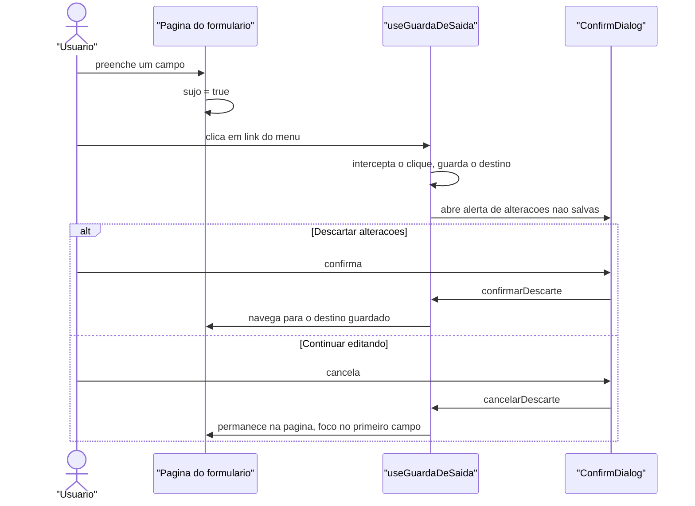

# Padrão de formulários: cadastro e edição em página

**Data:** 29/09/2026 · **Autor:** `ux-designer`
**Status:** **aprovado pelo dono do produto em 29/09/2026** — vale para
toda nova tela de cadastro/edição e para as conversões de §10.
As duas questões de §12 foram decididas: item do plano **permanece em
janela** (§1.2 acolhida) e **"Salvar e cadastrar outro" aprovado** (§7.2).
**Entradas:** decisão do dono do produto ("modal não ficou bom para
indicadores, metas e planos — colocar em página, para todos os cadastros")
· `frontend/src/app/app/planos/novo/page.tsx` e `planos/[id]/page.tsx` (base
adotada) · `CLAUDE.md` ("Modais — dimensionamento proporcional ao
conteúdo", "Padrão de CRUD: filtro + grid", "UI assíncrona por padrão")

> **O que este arquivo faz:** fixa um único padrão de página de
> cadastro/edição para todo o sistema, e lista as conversões de modal para
> página necessárias. É transversal — como `specs/_fundacao-metas.md` — e
> **não substitui** nenhum `ux.md` de feature; cada `ux.md` instancia o que
> está aqui na seção "O que muda no ux.md desta feature" (§11).
>
> **O que este arquivo não faz:** não redesenha o fluxo de negócio de
> nenhuma feature (validações, mensagens de erro específicas, regras de
> autorização) — isso continua em cada `ux.md`/`design.md`. Aqui ficam só a
> estrutura da página, a navegação e os mecanismos comuns.

---

## 1. Decisão de produto (registrar, não repetir a regra genérica)

**Decisão:** todo formulário de cadastro e edição do sistema é **página com
rota própria**, sem exceção de contagem de campos. O `CLAUDE.md` orienta
modal até ~6 campos e página acima disso — essa orientação genérica **é
substituída, para este projeto, por esta decisão explícita do dono do
produto**, pelo motivo abaixo. Nenhum revisor deve "corrigir" uma página de
2 campos de volta para modal citando a regra genérica: a regra local
(decisão de produto, registrada aqui) tem precedência.

**Motivo (nas palavras do dono):** modal não ficou bom para indicadores,
metas e planos. **Consistência** — o sistema não deve ficar "metade em cada
padrão", com o usuário nunca sabendo se uma ação abre modal ou navega.

**O que continua em janela (confirmado abaixo, não é exceção à decisão —
é categoria diferente de interação):**

| Categoria | Fica em | Por quê |
|---|---|---|
| Confirmação de exclusão | `ConfirmDialog` (window) | Decisão binária de uma ação já visível na lista — não é cadastro |
| Redefinir senha | `RedefinirSenhaModal` (window) | Ação de um passo, sem estado a preservar entre telas |
| Encerrar designação | `EncerrarDesignacaoModal` (window) | Ver §1.1 — concordo com a proposta do dono |
| Ativar/inativar, publicar/despublicar plano | `ConfirmDialog`/dialog dedicado (window) | Decisão de um campo (data ou nada) sobre um registro já aberto, não formulário de cadastro |

### 1.1 Encerrar designação — concordo em manter como janela

O modal tem um único campo editável (nova data de fim) e três alertas
informativos de contexto (curso fica sem responsável, possível perda do
perfil de Coordenador, entregas já feitas continuam valendo). É uma
decisão, não um cadastro: o usuário já está olhando a designação na lista
e está confirmando uma consequência, não preenchendo um registro novo.
Transformar isso em página adicionaria uma navegação de ida e volta sem
ganhar nada — o aviso de perda de perfil já é visível e lido no modal
antes do clique em "Encerrar". Mantido como janela.

### 1.2 Item do plano — permanece em janela (decidido)

**Decisão do dono do produto (29/09/2026): manter "item do plano"
(meta + quantidade) como modal**, acolhendo a recomendação do
`ux-designer`. Não é exceção à decisão de §1: é reconhecimento de que
este não é um cadastro autônomo, e sim uma ação repetida dentro da
montagem de um plano. **§10.1 fica como registro do que foi recusado —
não implementar.**

**Motivo da discordância:** ao contrário dos outros sete formulários, o
item do plano não é um cadastro autônomo com lista própria — é uma
**ação repetida dentro do fluxo de montagem de um único plano**. O padrão
de uso observado é "adicionar meta, ver aparecer na tabela, adicionar a
próxima, ajustar quantidade de uma terceira", tudo sem perder de vista o
plano inteiro. Um modal de 2 campos sobre a própria página do plano
preserva esse contexto; uma página cheia para `meta_id` + `quantidade`
faz o usuário sair e voltar do plano a cada meta adicionada — a página do
plano (`/app/planos/[id]`) já é, ela mesma, uma tela de trabalho com
seções, e o item é uma linha dela, não uma entidade que alguém procura
numa lista.

Se o dono do produto mantiver a conversão, a página fica descrita em
§10.1 para não haver ambiguidade — mas meu voto é manter o modal atual
(`ItemPlanoFormModal`), sem alteração.

---

## 2. Convenção de rotas

**Recurso de topo (tem lista própria em `/app/<recurso>`):**

```
/app/<recurso>            lista (já existe)
/app/<recurso>/novo       criar
/app/<recurso>/[id]       editar
```

`[id]` edita — não `[id]/editar`. É o padrão já usado por `plano`
(`/app/planos/[id]`), só que lá a página também é detalhe; nos recursos
simples (indicador, indicador-inep, período, instituição, curso, usuário,
meta) a página em `[id]` **é** o formulário em modo edição, sem seções
adicionais.

**Recurso aninhado (filho de outro recurso, sem lista própria fora do
pai):**

```
/app/<pai>/[paiId]/<recurso-filho>            lista do filho (se existir)
/app/<pai>/[paiId]/<recurso-filho>/novo       criar
/app/<pai>/[paiId]/<recurso-filho>/[filhoId]  editar
```

Aplicado aos dois casos do escopo:

| Recurso filho | Pai | Rotas |
|---|---|---|
| Designação | Curso | `/app/cursos/[id]/designacoes/novo` · `/app/cursos/[id]/designacoes/[designacaoId]` |
| Usuário Pesquisador Institucional | Instituição | `/app/instituicoes/[id]/pesquisadores/novo` · `/app/instituicoes/[id]/pesquisadores/[usuarioId]` |
| Item do plano *(se a discordância de §1.2 for rejeitada)* | Plano | `/app/planos/[id]/itens/novo` · `/app/planos/[id]/itens/[itemId]` |

`usuário` e `administrador` **não são aninhados** (têm lista própria em
`/app/usuarios` e `/app/administradores`) — usam a convenção de recurso de
topo, mesmo reaproveitando o mesmo componente de formulário que o
pesquisador institucional aninhado (ver §10).

**Parâmetro `voltar` — para fluxos de criação cruzada (§7.3):** quando uma
página de criação é aberta a partir de outra tela que não é a lista padrão
do recurso (ex.: criar meta a partir da página de um indicador), a URL
carrega `?voltar=<rota de origem>`. Ausente, usa o destino padrão da
tabela de §7.1.

---

## 3. Estrutura da página

```
┌───────────────────────────────────────────────────────────┐
│ Início › Indicadores › Novo                    (Trilha)    │
│                                                               │
│ Novo indicador                                 (h1)          │
│                                                               │
│ ┌───────────────────────────┬───────────────────────────┐  │
│ │ Código *                  │ Nome *                     │  │
│ │ [____________]            │ [____________________]     │  │
│ ├───────────────────────────┴───────────────────────────┤  │
│ │ Descrição                                              │  │
│ │ [multi-linha__________________________________]        │  │
│ └─────────────────────────────────────────────────────────┘  │
│                                                               │
│                    [Cancelar] [Salvar e cadastrar outro] [Salvar] │
└───────────────────────────────────────────────────────────┘
```

- **Trilha** (`Trilha`) sempre presente, primeiro elemento da área de
  conteúdo: `Início › <Seção> › Novo` (criar) ou
  `Início › <Seção> › <identificação do registro>` (editar) — mesmo padrão
  já usado em `planos/novo` e `planos/[id]`.
- **`<h1>`** logo abaixo da trilha: `Novo <entidade>` / `Editar <entidade>`.
  Nunca "Cadastro" genérico — o rótulo nomeia a entidade, como já é feito
  em "Novo plano de ação".
- **Formulário** abaixo do título, sem `<Card>`/moldura extra (nada de
  card dentro de página — a página já é o contêiner). Container do
  formulário com `max-w-3xl` (controle específico, não a página — ver
  CLAUDE.md "Área de conteúdo"); a página em si (`<div className="w-full
  space-y-6">`) continua alinhada à esquerda e ocupando a largura útil,
  como hoje.
- **Botões de ação: rodapé, não fixo, alinhados à direita** — mesmo local
  de `planos/novo`. Não duplicar no topo: nenhum dos oito formulários
  passa de ~9 campos, e com a grade de 2 colunas (§4) cabem numa rolagem
  curta mesmo em 360px. Um rodapé fixo (`sticky bottom-0`) seria
  justificável só se o formulário crescesse (ex.: `usuário` com editor de
  perfis expandido) — não é o caso hoje; revisitar se algum formulário
  ganhar seções novas no futuro.

---

## 4. Largura e grade de campos

- Container do formulário: `max-w-3xl` (768px) — cabe confortavelmente 2
  colunas em desktop sem esticar um campo de 4 dígitos por 1000px.
- `FieldGroup` com `md:grid md:grid-cols-2 md:gap-4` — campos curtos lado a
  lado (código/nome, grau/modalidade, nome/sigla).
- Campo de texto longo (descrição, referência do instrumento, observação):
  `md:col-span-full`.
- Grupo de checkbox (perfis do usuário) e alertas informativos:
  `md:col-span-full`.
- Mobile (< md): coluna única, sempre — `grid-cols-1` é o padrão base, o
  `md:grid-cols-2` só entra a partir de 768px.

Isso é literalmente a grade que `planos/novo` já usa — reaproveitada sem
alteração para os oito formulários.

---

## 5. Volta e cancelamento

### 5.1 Dirty state — mesma lógica de hoje, novo escopo de aplicação

`useDirtyState` (já existente) continua a fonte da verdade de "há algo não
salvo". O que muda é o **gatilho de saída**: num modal, só existia um jeito
de tentar sair (fechar o diálogo). Numa página, existem quatro:

| Gatilho | Hoje (modal) | Padrão novo (página) |
|---|---|---|
| Botão "Cancelar" | `tentarFechar()` decide entre `ConfirmDialog` e fechar | `tentarSair()` decide entre `ConfirmDialog` e `router.push(destino)` |
| Clique em link do menu/trilha/breadcrumb enquanto sujo | N/A (modal cobria a tela) | **Novo:** guarda de saída intercepta (§5.2) |
| Botão Voltar do navegador enquanto sujo | N/A | **Novo:** guarda de saída intercepta (§5.2) |
| Fechar aba / recarregar (F5) enquanto sujo | `beforeunload` nativo (já implementado em `useDirtyState`) | Inalterado — continua funcionando igual |

### 5.2 Guarda de saída — mecanismo novo, não reaproveita o da senha provisória

**Não é o mesmo mecanismo.** `useGuardaSenhaProvisoria` (existente) usa a
técnica de interceptar clique em `<a>` em fase de captura e reempilhar
`pushState` no `popstate` — mas ele **bloqueia incondicionalmente e sem
diálogo**: enquanto ativo, todo clique em link é cancelado, sem perguntar
nada, porque a única saída válida é trocar a senha. É um cadeado, não uma
confirmação.

O que os formulários em página precisam é diferente: perguntar, e deixar
sair se a pessoa confirmar. Proponho um hook novo,
`useGuardaDeSaida`, em `frontend/src/components/shared/hooks/`
(mesma pasta de `useDirtyState`), que **reaproveita a técnica** de
interceptação de clique/`popstate` do hook existente, mas com
comportamento de confirmação em vez de bloqueio:

```ts
// components/shared/hooks/use-guarda-de-saida.ts
function useGuardaDeSaida(sujo: boolean): {
  confirmando: boolean          // controla o ConfirmDialog
  confirmarDescarte: () => void // "Descartar alterações" — completa a navegação pendente
  cancelarDescarte: () => void  // "Continuar editando" — fecha o diálogo, permanece na página
}
```

Comportamento (ativo só enquanto `sujo === true`):

- Clique em `<a>` interno (capturado em fase de captura, como no guard de
  senha provisória): `preventDefault` + guarda o `href` clicado; abre
  `ConfirmDialog`. Ao confirmar, executa `router.push(href)`.
- Botão Voltar do navegador (`popstate`): mesma técnica de reempilhar
  estado usada hoje; ao confirmar, completa a navegação de volta.
- `target="_blank"` e links externos: **não interceptados** (abrem em
  nova aba, não perdem o formulário).
- `beforeunload` continua por fora deste hook — é o `useDirtyState` que já
  cobre F5/fechar aba, sem diálogo customizado (usa o nativo do browser).



Toda página de formulário usa `useGuardaDeSaida(sujo)` uma vez, monta o
`ConfirmDialog` já padronizado (mesmo texto de hoje: "Descartar
alterações?" / "Você tem alterações não salvas. Deseja descartá-las?"), e
o botão "Cancelar" chama a mesma função de confirmação em vez de duplicar
a lógica — `tentarSair()` é só um atalho que passa o destino padrão da
página para o mesmo fluxo.

### 5.3 `id="botao-novo"` — preservar para o atalho Ctrl+N continuar funcionando

`useAtalhosDeTeclado` dispara `Ctrl+N` clicando programaticamente no
elemento `id="botao-novo"`. O botão "+ Novo" das listas passa a ser um
`Link` (não mais `onClick` que abre modal) — **o `id="botao-novo"`
precisa continuar no elemento clicável** para o atalho não quebrar. Um
`Button` com `render={<Link id="botao-novo" href=".../novo" />}` resolve.

---

## 6. Botões e ações — comportamento assíncrono

Sem mudança em relação ao padrão já vigente do projeto (`CLAUDE.md` — "UI
assíncrona por padrão"): `LoadingButton`, texto no gerúndio, campos
desabilitados durante o envio. O que muda é que o botão "+ Novo" e
"Editar" da lista **deixam de acionar `onClick` com `setState`** e passam
a ser navegação:

- **"+ Novo"** (lista): `Button` renderizado como `Link` para
  `.../novo`, com `IndicadorDeNavegacao` (mesmo componente que já mostra
  spinner + aciona a barra superior via `useLinkStatus`, usado hoje em
  `SidebarNav` e `Trilha`).
- **"Editar"** (linha do grid): também vira `Link` para `.../[id]`, **mas
  continua precisando de indicador de loading por linha** (regra do
  `CLAUDE.md`: "o botão da linha também deve mostrar seu estado de
  loading até a navegação completar"). Usa `IndicadorDeNavegacao` dentro
  do botão da linha, à semelhança do menu — não precisa mais do estado
  `editingId` que hoje só existia para abrir o modal.

---

## 7. Depois de salvar

### 7.1 Regra padrão

| Ação | Destino |
|---|---|
| Criar (recurso de topo) | Volta para a lista do recurso, com toast de sucesso. A lista reexecuta a última pesquisa (filtros/ordenação/página já persistidos em `localStorage` — nada novo aqui) |
| Editar (recurso de topo) | Volta para a lista do recurso, com toast de sucesso |
| Criar (recurso aninhado) | Volta para a lista do pai (`.../designacoes`, `.../pesquisadores`) |
| Editar (recurso aninhado) | Volta para a lista do pai |
| Cancelar | Mesmo destino que "depois de salvar" para aquele contexto, sem toast |

Exceção já existente e mantida: `plano` continua com seu próprio fluxo —
criar vai para o **detalhe** (`/app/planos/[id]`), porque plano é uma
entidade de trabalho com seções, não um cadastro simples. Nenhum dos oito
formulários deste padrão se parece com plano; se um dia um deles ganhar
seções e virar "detalhe com edição inline", a exceção é avaliada
individualmente, não generalizada.

### 7.2 "Salvar e cadastrar outro" — mitigação da perda de fluxo em lote

**Esta é a perda real que eu vejo** na conversão geral: hoje, com modal,
cadastrar 5 indicadores em sequência é abrir o modal, salvar, o modal
fecha sozinho e a lista já está ali — repete. Convertendo para página,
"Salvar" leva para a lista, e cadastrar o próximo exige clicar em "+ Novo"
de novo. Para não perder essa produtividade (comum em catálogo:
indicadores, indicadores do INEP, períodos, cursos, e no cadastro de
usuários em lote), toda página de **criação** (nunca de edição) ganha um
segundo botão:

```
[Cancelar]              [Salvar e cadastrar outro]   [Salvar]
```

- **"Salvar"**: comportamento de §7.1 (volta para a lista/pai).
- **"Salvar e cadastrar outro"**: salva, mostra o toast de sucesso, **limpa
  o formulário** (mesmos valores iniciais de "novo"), devolve o foco ao
  primeiro campo, e **permanece na mesma página** — inclusive mantendo o
  contexto de recurso aninhado (ex.: continua em
  `/app/cursos/[id]/designacoes/novo`, pronto para a próxima designação do
  mesmo curso).
- Ambos os botões passam pela mesma validação e pelo mesmo `useCriarX`.
- Nenhuma página de **edição** tem este segundo botão — editar é sempre
  um registro por vez, não há "próximo" óbvio.

### 7.3 Criação cruzada — `voltar` e pré-seleção

Dois casos do escopo:

**Criar meta a partir da página de um indicador.** A página de edição de
um indicador (`/app/indicadores/[id]`) ganha uma ação secundária "+ Criar
meta com este indicador", que navega para
`/app/metas/novo?indicador_id=<id>&voltar=/app/indicadores/<id>`. A página
de meta, ao montar, lê `indicador_id` da query string e, se presente,
pré-marca esse indicador no combobox múltiplo (o campo continua editável —
o usuário pode adicionar outros ou remover o pré-selecionado, até o limite
de 5). Ao salvar ou cancelar, navega para o valor de `voltar` em vez do
padrão (`/app/metas`).

**Criar item a partir do plano (se a conversão de §1.2 for confirmada).**
Não precisa de `voltar` explícito — o aninhamento de rota já resolve
(`/app/planos/[id]/itens/novo` volta para `/app/planos/[id]`).

**Regra geral:** `voltar`, quando presente na URL, **substitui** o destino
padrão da tabela de §7.1 — para criação e para cancelamento. Ausente, usa
o padrão. Nenhuma outra lógica de "de onde eu vim" (não usar
`document.referrer` nem histórico do browser — não é confiável com
recarregamento ou link direto).

### 7.4 Caso especial — "primeiro Pesquisador Institucional" ao criar instituição

Hoje, criar uma instituição (`InstituicaoFormModal`) reabre
automaticamente `UsuarioFormModal` com `perfilFixo` e textos customizados
("Cadastrar o primeiro Pesquisador Institucional de X"). Convertido para
página:

1. `/app/instituicoes/novo` salva a instituição e navega para
   `/app/instituicoes/[id]/pesquisadores/novo?primeiro=true`.
2. A página de novo usuário PI, ao ler `primeiro=true`, troca o `<h1>` e a
   mensagem de sucesso para a variante "primeiro PI" (mesmos textos que o
   modal já usa hoje via props `titulo`/`rotuloSalvar`/`mensagemSucesso`) —
   sem `voltar` customizado: ao salvar, volta para `/app/instituicoes`
   (não para a lista de pesquisadores daquela instituição, que ainda não
   tem outros registros) — condicionar o destino padrão de §7.1 quando
   `primeiro=true` está presente.
3. Sem `primeiro=true`, a página é o formulário normal de novo
   pesquisador institucional, textos padrão, volta para
   `/app/instituicoes/[id]/pesquisadores`.

---

## 8. Estados

Os quatro estados obrigatórios (`CLAUDE.md`), aplicados à página de
formulário:

| Estado | Criar | Editar |
|---|---|---|
| **Loading** | N/A — a página monta vazia, direto no formulário | Skeleton com a mesma estrutura de campos (retângulos na posição de cada `Field`) enquanto o `GET /recurso/{id}` carrega — nunca spinner solto |
| **Error** (falha ao carregar para editar) | N/A | `ErrorState` no lugar do formulário, com "Tentar novamente"; formulário não aparece até o dado carregar |
| **Salvando** | `LoadingButton` + todos os campos desabilitados (`fieldset disabled` ou prop por campo) | idem |
| **Conflito de versão (409)** | N/A | `Alert` destrutivo no topo do formulário (mesmo texto padrão do projeto: "Este registro foi alterado por outro usuário enquanto você editava.") + botão "Recarregar dados", que refaz o `GET` e repopula o formulário **sem sair da página** — diferente do modal de hoje, que fechava e obrigava reabrir |
| **Data** | Formulário pronto, foco no primeiro campo | idem |

---

## 9. Acessibilidade

- **Foco ao abrir a página:** no primeiro campo do formulário (mesmo
  padrão já usado em `planos/novo` e em todos os modais atuais via
  `primeiroCampoRef` + `requestAnimationFrame`). Mantém o `<h1>` como
  primeiro heading da página para quem navega por landmarks/headings —
  o foco ir para o campo não retira o heading do fluxo de leitura.
- **Ordem de tabulação:** segue a ordem visual da grade (linha a linha,
  esquerda para direita) — sem `tabindex` positivo em nenhum campo.
- **Erro de validação ao submeter (novo requisito, não existia de forma
  padronizada):** ao falhar a validação no `handleSubmit`, o foco vai para
  o **primeiro campo com erro**, na ordem em que aparece no formulário —
  hoje os formulários setam `erro` mas não movem o foco; padronizar isso
  em todas as páginas convertidas.
- **`aria-describedby`** liga cada campo à sua mensagem de erro (já é o
  padrão nos modais atuais — mantido).
- **Alert de conflito de versão:** `role="alert"` (evento inesperado,
  interrompe o fluxo) — os demais alertas informativos (avisos de
  contexto, como os de designação) continuam `role="status"`.
- **Botões de ação sem texto** (nenhum neste padrão — "Salvar",
  "Cancelar", "Salvar e cadastrar outro" sempre têm texto visível, não
  precisam de `aria-label`).
- **`Ctrl+S`** continua salvando o formulário atual (já implementado via
  `onKeyDown` no `<form>`, mantido igual).
- **`Esc`**: em modal fechava o diálogo; em página, não tem ação — **não**
  disparar `tentarSair()` no `Esc` de uma página (diferente de modal,
  onde `Esc` é a tecla padrão de fechar). Documentar a diferença para não
  surpreender quem espera o `Esc` global de modal.

---

## 10. Tabela de conversões

| Feature | Modal atual | Rota nova (criar) | Rota nova (editar) | Volta para |
|---|---|---|---|---|
| Indicador | `IndicadorFormModal` | `/app/indicadores/novo` | `/app/indicadores/[id]` | `/app/indicadores` |
| Indicador do INEP | `IndicadorInepFormModal` | `/app/indicadores-inep/novo` | `/app/indicadores-inep/[id]` | `/app/indicadores-inep` |
| Meta | `MetaFormModal` | `/app/metas/novo` | `/app/metas/[id]` | `/app/metas` (ou `voltar`, §7.3) |
| Período | `PeriodoFormModal` | `/app/periodos/novo` | `/app/periodos/[id]` | `/app/periodos` |
| Instituição | `InstituicaoFormModal` | `/app/instituicoes/novo` | `/app/instituicoes/[id]` | `/app/instituicoes` |
| Curso | `CursoFormModal` | `/app/cursos/novo` | `/app/cursos/[id]` | `/app/cursos` |
| Usuário | `UsuarioFormModal` (basePath `/usuarios`) | `/app/usuarios/novo` | `/app/usuarios/[id]` | `/app/usuarios` |
| Administrador | `UsuarioFormModal` (basePath `/administradores`, `perfilFixo`) | `/app/administradores/novo` | `/app/administradores/[id]` | `/app/administradores` |
| Pesquisador Institucional | `UsuarioFormModal` (basePath aninhado, `perfilFixo`) | `/app/instituicoes/[id]/pesquisadores/novo` | `/app/instituicoes/[id]/pesquisadores/[usuarioId]` | `/app/instituicoes/[id]/pesquisadores` |
| Designação — nova/editar | `NovaDesignacaoModal` / `EditarDesignacaoModal` | `/app/cursos/[id]/designacoes/novo` | `/app/cursos/[id]/designacoes/[designacaoId]` | `/app/cursos/[id]/designacoes` |
| Designação — encerrar | `EncerrarDesignacaoModal` | **mantém-se como janela** (§1.1) | — | — |
| Item do plano | `ItemPlanoFormModal` | **discordância registrada — recomendo manter modal** (§1.2); se convertido: `/app/planos/[id]/itens/novo` | `/app/planos/[id]/itens/[itemId]` | `/app/planos/[id]` |

**Componente de formulário continua autônomo** (regra do `CLAUDE.md`,
"Formulário de criação/edição: independente de contêiner"): o miolo de
cada `XxxFormModal` (campos, validação, hooks de criar/atualizar) é
extraído para um componente `XxxForm` sem `Dialog`/`DialogContent` ao
redor, recebendo `valorInicial`, `onSalvo`, `onCancelar` — a página é só a
casca (`Trilha` + `<h1>` + `XxxForm`). `UsuarioForm` continua parametrizado
por `basePath`/`perfilFixo`/textos, exatamente como `UsuarioFormModal` é
hoje — só troca o invólucro, reaproveitado nas três rotas (usuários,
administradores, pesquisadores institucionais aninhado).

### 10.1 Item do plano em página (caso a discordância de §1.2 seja rejeitada)

```
┌───────────────────────────────────────────────────────────┐
│ Início › Planos › Curso X — Período Y › Adicionar meta     │
│                                                               │
│ Adicionar meta ao plano                        (h1)          │
│                                                               │
│ Meta *        [combobox________________]                    │
│ Indicadores da meta (somente leitura, se houver)             │
│ Quantidade *  [____]                                         │
│                                                               │
│                                    [Cancelar] [Salvar]       │
└───────────────────────────────────────────────────────────┘
```

Sem "Salvar e cadastrar outro" aqui — se o dono do produto insistir na
conversão, ao menos preservar a produtividade de adicionar várias metas
seguidas é o principal argumento para manter como modal; a versão em
página deveria, no mínimo, oferecer o mesmo botão duplo de §7.2.

---

## 11. O que muda no `ux.md` de cada feature

Lista do que **eu (ux-designer) preciso atualizar** em cada `ux.md` já
existente — não altero os arquivos agora (times trabalhando neles); o
arquiteto/orquestrador encaminha esta lista para cada `ux.md` correspondente:

- **`specs/indicadores/ux.md`** (indicador e indicador-inep): trocar
  "formulário em modal" por "formulário em página" nas duas telas; adotar
  rotas de §10; adicionar "Salvar e cadastrar outro" (§7.2); estado de
  conflito 409 vira alerta na própria página (§8), não fecha diálogo;
  adicionar ação "+ Criar meta com este indicador" na página de edição do
  indicador (§7.3).
- **`specs/metas-coordenacao/ux.md`** (ou onde `meta` estiver
  especificada): formulário de meta em página; suportar `indicador_id` e
  `voltar` na query string (§7.3); manter o combobox múltiplo de
  indicadores e o aviso de limite de 5 como estão.
- **`specs/plano-acao/ux.md`**: item do plano — **aguardar decisão do
  dono do produto sobre §1.2** antes de escrever a seção; se convertido,
  usar o wireframe de §10.1 e a rota aninhada `/app/planos/[id]/itens/...`.
  Períodos: formulário em página, rotas `/app/periodos/novo` e
  `/app/periodos/[id]`.
- **`specs/cursos/ux.md`** (ou equivalente): curso em página (rotas de
  §10); designação nova/editar em página aninhada sob
  `/app/cursos/[id]/designacoes/`; designação **encerrar continua em
  modal** (§1.1) — não alterar essa parte.
- **Instituições** (`ux.md` correspondente): instituição em página; fluxo
  de "primeiro PI" via `?primeiro=true` (§7.4), não mais modal encadeado.
- **Usuários/Administradores** (`ux.md` correspondente): formulário de
  usuário em página, reaproveitando o mesmo componente `UsuarioForm`
  parametrizado nas três rotas de §10 (usuários, administradores,
  pesquisadores institucionais aninhado); redefinir senha continua em
  modal.

Em todos os `ux.md` acima, adicionar também: a seção "Responsividade" já
exigida pelo `CLAUDE.md` deve declarar explicitamente "formulário em
coluna única `< md`, duas colunas `≥ md`" (já é o padrão de §4, só falta
declarar por escrito em cada `ux.md`), e a seção "Navegação por teclado"
deve citar `useGuardaDeSaida` como o mecanismo de proteção de dirty state
ao navegar para fora da página (§5.2).

---

## 12. Decisões do dono do produto (29/09/2026)

1. **Item do plano** (§1.2): **mantido em janela**, como o
   `ux-designer` recomendou. §10.1 não é implementado.
2. **"Salvar e cadastrar outro" (§7.2): aprovado** — obrigatório em
   toda página de criação, salvo onde §7.2 já registra a ausência.

Com estas duas respostas o padrão deixa de ter pendência: as oito
conversões de §10 podem ser implementadas na ordem que convier.
