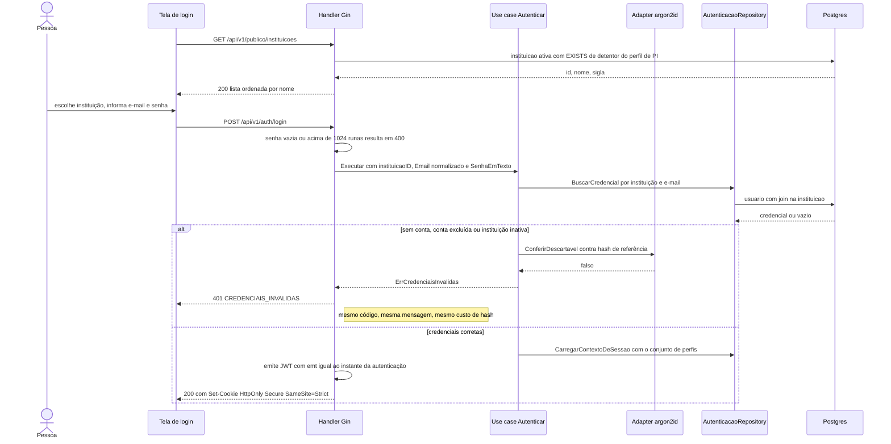
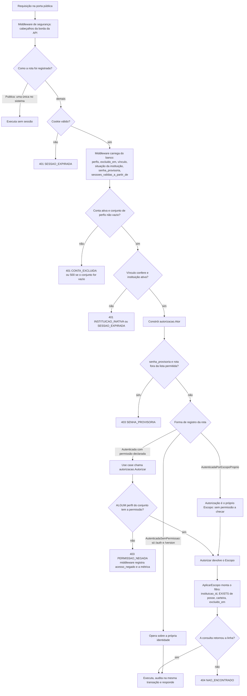
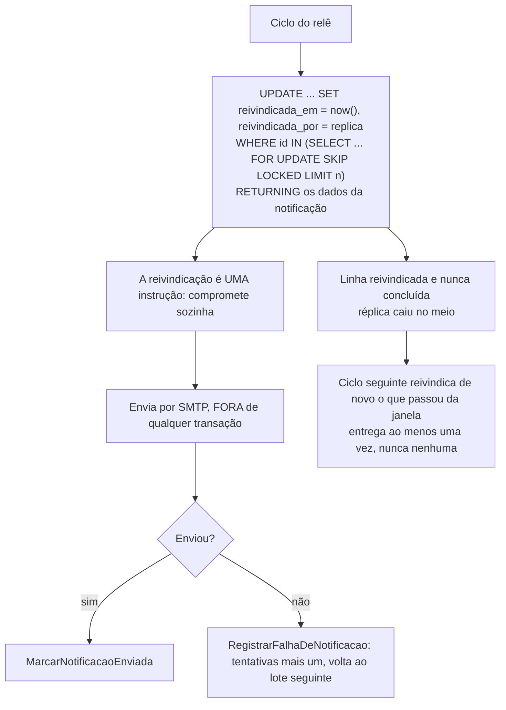

# Design: autenticacao-usuarios

**Data desta versão:** 29/09/2026 (revisão 10)
**Status:** feature implementada · guardas fail-closed · correções em §16
**Escopo deste documento:** além da própria feature, é a **fundação
transversal** do projeto — §4, §5.10, §15 e §16 valem para todas as features, e
é a isso que `fundacao-metas.md` se refere.

> **Revisão 10 — decisões sobre a revisão de segurança das quatro features.**
> **§4.7 nova:** tudo que sai do sistema é neutralizado no formato de destino
> (D-32) — fecha a injeção de cabeçalho de e-mail e a de fórmula em CSV.
> **D-31:** o relê reivindica com escrita comprometida, não com lock que
> evapora. **§6.1** ganha a terceira forma de registro de rota, com guarda.
> **§5.11:** a afirmação de F-05 passa a dizer **quais** tabelas têm a garantia
> estrutural — e as quatro que não têm, passam a ter.

---

## 1. Sumário das decisões

| # | Decisão | Motivo curto |
|---|---|---|
| D-01 | Hash **argon2id**, parâmetros em formato PHC | Sem truncamento em 72 bytes |
| D-02 | **Semáforo de 4 hashes concorrentes** | argon2 é vetor de exaustão de memória |
| D-03 | **JWT HS256** em cookie `HttpOnly; Secure; SameSite=Strict`, TTL 8 h | `emt` em microssegundos resolve a corrida de 1 s |
| D-04 | **`Escopo` obrigatório** em repositório de negócio, só de `Autorizar` | Esquecer a verificação **não compila** |
| D-05 | Índice único parcial com **`NULLS NOT DISTINCT`** | Armadilha do `NULL` do administrador |
| D-06 a D-14 | Combo por `EXISTS`; `instituicao_id` primeiro; permissão na assinatura da rota; auditoria transacional; sem Redis/mensageria; sem teste de carga; navegador chama a API direto; shadcn `base-nova` | §4, §5, §11 |
| D-15 a D-18 | Lista fechada de portas sem `Escopo`; `ConjuntoDePerfis`; U-15 no banco; resposta da entidade | §3, §4.4 |
| D-19 a D-21 | Propriedade e não plano; alcance de comentários; edição síncrona | §5, §11 |
| D-22 a D-24 | Cabeçalhos próprios da API; Swagger fora de produção; porta administrativa | §4.5 |
| D-25 a D-28 | Guardas fixam assinatura; lista à mão não é mecanismo; portas de manutenção; `Proprio` ao lado de `Escopo` | §4.4 |
| D-29 | **Direção das dependências verificada por guarda** | §4.6 |
| D-30 | **Métrica derivável do middleware global não existe em duplicata**; a que não é, atravessa port | §4.3 |
| **D-31** | **Trabalho assíncrono se reivindica com escrita comprometida, nunca com lock que evapora.** `FOR UPDATE SKIP LOCKED` só vale dentro da transação que também publica — e não se segura transação sobre I/O externo | §4.8 |
| **D-32** | **Dado que sai do sistema é neutralizado no formato de destino, não no de origem.** Validar na entrada não basta: quem injeta usa a gramática do destino | §4.7 |
| **D-33** | **Rota autenticada declara por que não exige permissão.** "Sem permissão" e "autorizada pelo escopo do próprio ator" são afirmações diferentes, e só a segunda é verificável | §6.1 |

---

## 2. Diagramas

### 2.1 Login — do combo público ao cookie, por camada



### 2.2 Onde cada resposta nasce — pipeline de uma requisição autenticada



### 2.3 O relê reivindica antes de enviar



---

## 3. Domínio

`Email` · `SenhaEmTexto` · `SenhaHash` · `Perfil` · **`ConjuntoDePerfis`** ·
`Sigla` · `CodigoEMec` · `SituacaoInstituicao` · `ProvedorIdentidade` ·
`DataLocal` · **`NomeCatalogo`** e congêneres.

**`aluno` é conteúdo, não acréscimo**; **a coerção não é silenciosa**;
**administrador não acumula**, recusado no construtor **e** irrepresentável no
banco.

**Texto de catálogo é uma linha só.** `NomeCatalogo` e todo Value Object de
rótulo recusam **caracteres de controle** — CR, LF e demais C0. Não é regra de
e-mail nem de CSV: é o que "nome" significa. Que isso também feche um vetor de
injeção (§4.7) é consequência, não motivo — e é por isso que a regra fica aqui,
e não no adapter que por acaso a descobriu.

### 3.2 Autorização — dois eixos, uma propriedade

```go
type Escopo struct {
    valido, plataforma  bool
    instituicaoID       *uuid.UUID
    exigePerfil         *valueobject.Perfil
    dataDeReferencia    valueobject.DataLocal
    restritoACarteiraDe *uuid.UUID
}
type Proprio struct { usuarioID uuid.UUID } // só nasce de Ator.Proprio()
```

Ambos **inconstruíveis fora** de `Autorizar` e `Ator.Proprio()`. `Escopo`
responde *"este recurso, desta instituição"*; `Proprio`, *"este ator, sobre si
mesmo"*. **`SemCarteira()`** nunca é usada no recurso de topo (§15.20).

---

## 4. Camadas

### 4.1 Use cases · 4.2 Ports

`Autorizar` antes de qualquer consulta; mutação e auditoria na mesma
transação. Três naturezas de porta: **repositório de negócio** (`Escopo`, ou
`Proprio` no eixo do ator), **porta estreita** (§4.4, lista fechada de três) e
**infraestrutura**.

### 4.3 Métrica de negócio (D-30)

Métrica cuja informação o middleware global já produz — ação com rota 1:1 —
**não existe em duplicata**. Métrica própria existe para o que **não passa por
rota** ou **não é contável por requisição**: fila, lote, backlog. O relê, que
não tem rota, tem `port.MetricasDoRele`.

### 4.4 Superfícies sem `Escopo` — lista fechada e guardas fail-closed

Guarda A (varredura do pacote, fail-closed, **todas as posições**, com
tripwire por nome nas posições > 1 — **tripwire, não prova**, com gatilho
nomeado em caso de escape); guarda B (lista fechada com assinatura); guarda C
(arquitetural).

> Método sem `Escopo`/`Proprio` só existe pelas proveniências **(a)** credencial
> de autenticação, **(b)** `Proprio` de token validado, **(c)** identificador
> produzido pela consulta anterior do próprio processo, sem requisição e sem
> ator. **Se vem do cliente, exige `Escopo`.**

`AutenticacaoRepository` (a, b) · `InstituicaoPublicaQuery` (sem identificador)
· `EntregaReleRepository` (c, **não referenciável por `adapter/http`**).
**Dispensas individuais de método: zero.**

### 4.5 A borda HTTP da API

Porta **pública** (`/api/v1/*`, `/version`) e **administrativa** (`/metrics`,
`/healthz`, `/readyz`, não publicada). Cabeçalhos em
`middleware_seguranca.go`, **HSTS só em `production`**. **Swagger não existe em
produção.**

### 4.6 A direção das dependências é verificada, não combinada (D-29)

Guarda por `go/packages`, fail-closed: `domain` não importa `usecase` nem
`adapter`; `usecase` não importa `adapter`; nenhum dos dois importa `gin`,
`sqlx`, `pgx`, `prometheus`, `jwt`, `argon2`.

### 4.7 A saída do sistema — neutralizar no formato de destino (D-32)

A revisão encontrou **duas injeções da mesma família**, em dois artefatos que
saem do sistema:

- **Cabeçalho e corpo de e-mail.** A mensagem é montada por concatenação, e o
  assunto carrega o nome do curso. Um PI renomeia um curso com `\r\n` e passa
  a controlar cabeçalhos e corpo do e-mail que sai **do relay da instituição**.
- **Fórmula em CSV.** Nome de curso, de meta e de responsável vão para o
  relatório com escape RFC 4180 e nada mais. Uma célula iniciada por `=`, `+`,
  `-` ou `@` é avaliada como fórmula ao abrir na planilha — e o relatório é
  justamente o artefato que sai para avaliação externa.

**A lição comum, e é por isso que viram uma regra só:**

> **Validar na entrada não basta, porque quem injeta usa a gramática do
> destino.** Um nome de curso é dado perfeitamente válido para o banco e para a
> tela, e vira instrução ao atravessar a fronteira do SMTP ou da planilha. **A
> neutralização é responsabilidade de quem escreve no formato de destino**, e
> acontece no adapter que conhece esse formato — nunca no domínio, que não
> deve saber que e-mail e planilha existem.

**Isso não dispensa a validação de entrada, e as duas têm papéis distintos:**
o Value Object recusa caractere de controle porque **nome é uma linha** (§3) —
regra de domínio, que vale mesmo que nunca houvesse e-mail. O adapter
neutraliza porque **conhece a gramática do destino**. Uma protege o dado; a
outra, o artefato.

**E-mail.** Cabeçalho é montado por função única que **recusa CR/LF** e aplica
codificação RFC 2047 — que, de quebra, é o que faz o travessão do assunto
aparecer corretamente hoje, então a correção também conserta exibição. Valor
de cabeçalho que ainda contenha CR/LF ao montar é **erro**, não é sanitizado
em silêncio: o relê registra falha e a notificação volta ao lote.

**CSV.** Célula de **coluna textual** iniciada por `=`, `+`, `-`, `@`, tabulação
ou CR recebe prefixo `'`. **Só em coluna textual** — coluna numérica ou de data
é gerada pelo sistema, e prefixar ali estragaria número negativo legítimo. A
regra vale para toda exportação do projeto, presente e futura (§15.29).

**Terceiro ponto de saída, registrado antes de existir:** qualquer artefato
novo que o sistema produza — documento, webhook, integração — entra nesta
seção com a neutralização do seu formato **antes** de ser implementado.

### 4.8 Trabalho assíncrono: reivindicar, não travar (D-31)

`ListarPendentesDeNotificacao` usa `FOR UPDATE ... SKIP LOCKED` sobre
`r.db` — **pool em autocommit**. Cada instrução é sua própria transação, e
**os locks caem no fim do `SELECT`**. Entre a seleção e a marcação de enviada,
outra réplica seleciona as mesmas linhas.

O comentário do método declara: *"SKIP LOCKED é obrigatório, não otimização —
o sistema roda com N réplicas, e sem ele N réplicas enviariam N e-mails para a
mesma recusa."* **A garantia está declarada em três lugares e não é
entregue** — e o efeito é e-mail duplicado para o coordenador, em produção.

**Por que a receita usual não serve aqui.** `SKIP LOCKED` dentro de uma
transação funciona quando a publicação é **rápida e local** — um `INSERT` num
broker, por exemplo. Aqui a publicação é **SMTP**, chamada externa de latência
imprevisível. Segurar uma transação de banco aberta sobre I/O externo é trocar
um defeito por outro: um servidor de e-mail lento passa a prender conexões e
locks do banco.

**Decisão: reivindicação comprometida.** Uma instrução única, atômica mesmo em
autocommit:

```sql
UPDATE entrega SET notificacao_reivindicada_em = now(), notificacao_reivindicada_por = $1
 WHERE id IN (SELECT e.id FROM entrega e ... WHERE <pendente ou reivindicação vencida>
              ORDER BY e.notificacao_gerada_em FOR UPDATE SKIP LOCKED LIMIT $2)
RETURNING <os campos da notificação>;
```

A reivindicação **sobrevive** à chamada SMTP porque é escrita comprometida, não
lock. O envio acontece **fora de qualquer transação**. Uma réplica que caia no
meio deixa a linha reivindicada e não concluída; o ciclo seguinte a recupera
quando a reivindicação passa da janela, que é **maior que o tempo limite do
SMTP**.

**Semântica honesta: ao menos uma vez.** Queda entre enviar e marcar produz
duplicata na recuperação. É a mesma entrega ao-menos-uma-vez que o CLAUDE.md
aceita no relay de outbox, e é preferível ao contrário — marcar antes de
enviar perderia a notificação em silêncio, que é o defeito pior para um aviso
que a pessoa espera.

**A coluna de reivindicação também fecha uma simplificação já registrada:** o
`backoff` exponencial estava adiado por falta de uma coluna de última
tentativa. Ela passa a existir.

---

## 5. Banco de dados

Postgres **17**; migrations consolidadas em `000002_autenticacao_usuarios`.

```sql
CREATE UNIQUE INDEX uq_usuario_id_instituicao ON usuario (id, instituicao_id);
CREATE UNIQUE INDEX uq_usuario_instituicao_email_ativo      -- ARMADILHA 1
    ON usuario (instituicao_id, email) NULLS NOT DISTINCT WHERE excluido_em IS NULL;
CREATE INDEX idx_usuario_instituicao_nome                    -- ARMADILHA 3
    ON usuario (instituicao_id, nome COLLATE "pt-BR-x-icu") WHERE excluido_em IS NULL;

CREATE TABLE usuario_perfil (
    usuario_id UUID NOT NULL, perfil TEXT NOT NULL,
    instituicao_id UUID, criado_em TIMESTAMPTZ NOT NULL DEFAULT now(),
    PRIMARY KEY (usuario_id, perfil),
    CONSTRAINT ck_usuario_perfil_estrutura                   -- D-17
        CHECK ((perfil = 'administrador_sistema') = (instituicao_id IS NULL)),
    CONSTRAINT fk_usuario_perfil_usuario
        FOREIGN KEY (usuario_id, instituicao_id) REFERENCES usuario (id, instituicao_id)
        ON DELETE CASCADE ON UPDATE CASCADE
);
```

**Por que a coluna denormalizada:** a FK **composta** impede divergência — não
é cópia mantida à mão, é a mesma linha referenciada como par. **Trigger
rejeitado**; **"só no domínio" rejeitado**.

**Rótulo de catálogo recusa caractere de controle também no banco** — um
`CHECK` de uma linha, pela mesma razão de `ck_usuario_perfil_estrutura`: é a
camada que sobrevive a um caminho de escrita futuro que não passe pelo Value
Object.

**Validações do `dba`** (D-19 — afirma-se a **propriedade**, nunca o índice):
V-1 collation · V-2 `NULLS NOT DISTINCT` · V-3 combo sem `Seq Scan` < 10 ms ·
**V-9** o banco recusa as duas metades de U-15 · **V-10** contagens por índice.

### 5.10 `DISTINCT` em agregado

**Sancionado quando converte grão** (contar entidade sobre conjunto de grão
mais fino) e **proibido quando esconde cardinalidade de junção**. Nos dois
casos a chave é **o identificador da entidade contada**, nunca um atributo
textual. A exceção sancionada é registrada, e **o teste cobre as duas
consultas**.

### 5.11 O que é irrepresentável, e o que depende da aplicação (F-05)

F-05 afirmava que a divergência de instituição é irrepresentável. **É verdade
em `plano`, `designacao`, `item_plano`, `documento`, `entrega` e `anexo` — as
seis têm FK composta ancorando `instituicao_id`.** Não existe hoje nenhuma
tabela de negócio deste projeto em que a divergência de instituição entre uma
linha e seu curso seja representável.

**Por que isso importava mais do que parecia:** `AplicarEscopo` é
guarda-verificado e cobre **leitura**. Nada cobria **escrita** nas quatro
últimas — uma inserção que copie a instituição da origem errada gravaria uma
linha cuja instituição diverge do pai, e ela sumiria da leitura correta e
apareceria na errada. Era exatamente o furo que a FK composta já fechava em
`usuario_perfil`.

**Decisão implementada (T-129, `dba`, 29/09/2026):** `item_plano`, `documento`,
`entrega` e `anexo` ganharam `FOREIGN KEY (curso_id, instituicao_id)
REFERENCES curso (id, instituicao_id)` — mesmo padrão de `usuario_perfil`,
ancorando direto em `curso` (que já expõe `uq_curso_id_instituicao`, criado em
`000003_cursos`) pela coluna `curso_id` que as quatro já carregavam. Nenhuma
das quatro precisou de índice novo. A instituição de curso é imutável, como a
de usuário, então a redundância não deriva. Migration
`000007_isolamento_instituicao`, testada `up`→`down`→`up` contra Postgres 17
real, schema sem divergência prévia em `basisavalia_dev` (aplicada sem
recriar o banco), e com comprovação negativa nas quatro tabelas: inserir
linha com instituição divergente da do curso é recusada pelo banco
(`violates foreign key constraint`).

**A saída nomeada não foi usada.** Nenhuma das quatro tem volume ou padrão de
escrita que justifique exceção neste projeto pré-release — maior tabela das
quatro em `basisavalia_dev` tem 9 linhas, e o custo da checagem é o mesmo
lookup por índice único que `plano`/`designacao` já pagam contra `curso` desde
que existem.

---

## 6. Contrato de API

### 6.1 Registro de rota — três formas, e todas declaram por quê (D-33)

```go
func (r *Registro) Publica(metodo, caminho string, h gin.HandlerFunc)
func (r *Registro) Autenticada(metodo, caminho string, p autorizacao.Permissao, h gin.HandlerFunc)
func (r *Registro) AutenticadaSemPermissao(metodo, caminho string, h gin.HandlerFunc)
func (r *Registro) AutenticadaPorEscopoProprio(metodo, caminho string, h gin.HandlerFunc) // nova
```

A revisão encontrou **10 ocorrências de `AutenticadaSemPermissao`, sendo 6 de
recurso de negócio** — contra o "no máximo 4, sobre a própria conta" que o
próprio código declara. **Não é porta aberta:** a autorização está nos use
cases. **É o mecanismo de D-08 que se perdeu**, e com ele duas coisas:
a segunda declaração de intenção que o revisor compara com o use case, e a
métrica `autorizacao_decisoes_total`, que deriva da permissão declarada — as 6
rotas não produzem decisão de autorização nenhuma.

**Decisão: uma forma nova, explícita.** Algumas rotas realmente não têm
permissão a checar porque **a autorização é o próprio escopo** — "minhas
metas" é autorizada pela carteira do ator, não por uma permissão que alguém
concede. Isso é uma afirmação legítima, e diferente de "não tem permissão".
`AutenticadaPorEscopoProprio` a torna dizível — e, por ser dizível, contável.

**Guarda, sem lista escrita à mão** (D-26): toda rota sob `/api/v1` é
registrada por **exatamente uma** das quatro formas; `Publica` tem **uma**
ocorrência; e **`AutenticadaSemPermissao` só aceita caminho sob `/auth/` ou
`/version`** — regra estrutural derivada do caminho, não lista. Rota de negócio
registrada assim **quebra o build**.

### 6.2 Resto do contrato

`perfis` em ordem canônica; **`perfil` singular não existe na API**;
`POST /usuarios` devolve o conjunto gravado; `perfil=X` significa posse;
`sort` fora da allowlist ou `page_size > 100` → **400 `PARAMETRO_INVALIDO`**.

---

## 7. Sessão · 8. Auditoria · 9. Seed

**Perfis fora do token** — é o que faz SE-03 e SE-09 funcionarem sem encerrar a
sessão. **`/readyz` nunca devolve mensagem de driver.** Auditoria registra **os
dois conjuntos completos, nunca a diferença**; canal local na mesma transação;
**nenhum contador de falha de autenticação**. Seed com `SEED_ADMIN_*`
obrigatórias.

**Fuso: o sistema tem um só "hoje", e ele é o de exibição.** `time.Now().UTC()`
como data de referência é defeito sempre que a data decide **quem** ou **o
quê** — e no relê decide o destinatário (§16, T-124). A data de referência vem
de `APP_TIMEZONE`, nunca de UTC, e nunca do relógio do banco sem fuso.

---

## 10. Decisões e divergências · 11. Frontend

`coordenador_curso` continua marcável nesta entrega. E2E existentes **excedem**
o pedido. `nav-config.ts` chaveado por **permissão**. `proxy.ts` **não decide
autenticação**.

### 11.6 Zero comentários no frontend (D-20) — e a verificação que faltava

**Coberto — remover**, dando nome ao que o comentário explicava **ou**
realocando para o documento; **remover sem realocar não é opção**.
**Fora da regra:** dispositivo dirigido a ferramenta (**a justificativa em
prosa anexada a ele não é**) e **código vendorizado** (isenção **por origem,
não por pasta**).

**A regra está aberta há dois ciclos e cresceu de 4 para 5 arquivos e 21
comentários.** É a demonstração do próprio §15.25: **regra sem verificação
cresce**. Entra a verificação (T-126): passo de build que **falha** com prosa
em arquivo autoral de frontend, excluindo diretivas e o caminho vendorizado.
Contar comentários a cada ciclo não é revisão, é sintoma.

---

## 12. Decisões transversais

**Dual write:** não existe nesta feature. **Mensageria, cache, idempotência,
circuit breaker, geo, IA:** não. **Concorrência otimista:** `versao` → 409.
**Stateless:** sim. **Teste de carga: NÃO NECESSÁRIO.**

---

## 13. Testes

**Regra de custo:** só fronteira de segurança, isolamento ou integridade.
**Exceção obrigatória:** os guardas (§4.4, §4.6, §6.1) e os testes de
invariante com corrida — **mecanismo, não cobertura**.

**Teste cujo nome afirma mais do que ele mede é defeito** (§15.27).

---

## 14. Alternativas consideradas e rejeitadas

| Alternativa | Por que foi rejeitada |
|---|---|
| **`bcrypt`** · **`perfis TEXT[]`** · **trigger para U-15** | Truncamento silencioso / sem FK por elemento / lógica silenciosa |
| **Guardas com lista escrita à mão** | Fail-open: omissão produz silêncio — D-26 |
| **`Proprio` como substituto de `Escopo`** em método que alcança recurso | Escaparia do isolamento — D-28 |
| **Port de métrica para `indicador_plataforma`** | A métrica é duplicata do middleware global — D-30 |
| **Sanitizar CR/LF só no adapter de e-mail** | Deixaria o dado inválido no banco e em toda tela. Nome com quebra de linha é inválido **como nome** — a validação de domínio e a neutralização de saída têm papéis distintos, e são as duas — §4.7 |
| **Validar só no Value Object, sem neutralizar na saída** | Quem injeta usa a gramática do destino. O CSV é o exemplo: `=SOMA(...)` é nome perfeitamente válido — §4.7 |
| **Escape RFC 4180 como defesa contra fórmula** | A planilha remove as aspas e avalia assim mesmo. Só o prefixo neutraliza — §4.7 |
| **Prefixar todas as colunas do CSV** | Estragaria número negativo legítimo. Só coluna textual — §4.7 |
| **Segurar a transação com `SKIP LOCKED` durante o envio SMTP** | Prende conexão e lock do banco sobre I/O externo de latência imprevisível — troca um defeito por outro — D-31 |
| **Marcar como enviada antes de enviar** | Perderia a notificação em silêncio. Ao-menos-uma-vez é preferível a nenhuma — D-31 |
| **Rodar o relê em réplica única** | Restrição operacional que ninguém verifica, no lugar de um mecanismo — D-31 |
| **Manter `AutenticadaSemPermissao` nas 6 rotas de negócio** | "Sem permissão" e "autorizada pelo escopo" são afirmações diferentes; só a segunda é verificável, e só ela produz métrica — D-33 |
| **Corrigir só o texto de F-05** | A imprecisão é sintoma; o furo é a escrita, que nada cobre — §5.11 |

---

## 15. Restrições que atravessam a implementação

1. `domain` e `usecase` **nunca** importam `adapter` nem biblioteca de
   infraestrutura — **verificado por guarda** (§4.6).
2. **Todo** método de repositório de negócio recebe `Escopo` — ou `Proprio`,
   quando o resultado inteiro é sobre o próprio ator.
3. **`Proprio` não substitui `Escopo` quando o método alcança um recurso.**
4. **A identidade do ator nunca viaja como `uuid.UUID` cru** em porta de
   negócio, em nenhuma posição.
5. Superfície sem `Escopo`/`Proprio`: **lista fechada de três; dispensas de
   método: zero**.
6. **Antes de propor proveniência nova, leia os pontos de chamada.**
7. **Toda regra de conjunto de perfis mora em `ConjuntoDePerfis`.**
8. **Resposta serializada da entidade persistida, nunca ecoada do request.**
9. **Auditoria de perfis registra os dois conjuntos completos.**
10. `sort`/`order` só pela allowlist; nenhum `DELETE` físico; UUIDv7 no domínio.
11. **Zero comentários em arquivo autoral de frontend** — **verificado no
    build** (§11.6).
12. **Nenhuma resposta a anônimo revela detalhe de infraestrutura.**
13. **A borda HTTP da API emite os cabeçalhos de §4.5**; **superfície de
    diagnóstico não existe em produção**.
14. **Anotação de OpenAPI é escrita para quem consome a API.**
15. **Verificação de desempenho afirma a propriedade, nunca o plano.**
16. **Script que encadeia etapas verifica o código de saída de cada uma.**
17. **Comentário que afirma uma garantia enumera a exceção sancionada — e
    comentário que ficou falso é corrigido, nunca apagado.**
18. **Texto de produto voltado ao usuário tem uma fonte:** a visão.
19. **Container não roda como `root`**; dependência com correção é atualizada
    em PR próprio.
20. **`Escopo.SemCarteira()` nunca é usada no recurso de topo.**
21. **Verificação cuja cobertura depende de lista escrita à mão não conta como
    mecanismo** (D-26).
22. **Consulta de listagem não atravessa a fronteira de uma feature mais alta**
    para enriquecer o resultado: compõe-se no use case, em 1 + 1 consultas.
23. **Métrica de negócio derivável do middleware global não existe** (D-30).
24. **`DISTINCT` em agregado converte grão ou não existe**, e a chave é sempre
    o identificador da entidade contada.
25. **Toda regra estrutural deste documento tem um guarda que a verifica, ou
    está declarada como não verificada.**
26. **Revisão que verifica mecanismo precisa executá-lo**, e **os guardas rodam
    no pipeline**, para que a garantia não dependa de quem revisa ter terminal.
27. **Teste cujo nome afirma mais do que ele mede é defeito.**
28. **Trabalho assíncrono se reivindica com escrita comprometida** (D-31).
    Nunca se segura transação de banco sobre chamada externa.
29. **Todo artefato que sai do sistema é neutralizado no formato de destino**
    (D-32) — e-mail, CSV, e o que vier. A validação de entrada **não**
    substitui isso; as duas existem, com papéis distintos.
30. **A data de referência do sistema é a do fuso de exibição**, nunca UTC,
    sempre que a data decide **quem** ou **o quê**.
31. **Rota autenticada declara por que não exige permissão** (D-33), e
    `AutenticadaSemPermissao` só existe sob `/auth/` e `/version`.
32. Comandos sempre via container.

---

## 16. Correções decididas

**Concluídas:** T-110 a T-116 (guardas, `Proprio`, CU-12).
**Bloco 1 (revisão 6):** T-096 a T-109. **Bloco 4 (revisão 9):** T-117 a T-122.

**Bloco 5 — desta revisão. T-123 a T-125 bloqueiam a entrega.**

| # | O quê | Verificação |
|---|---|---|
| **T-123** | **Injeção de e-mail.** `NomeCatalogo` e congêneres recusam caractere de controle; `CHECK` no banco; adapter SMTP monta cabeçalho por função única que **recusa CR/LF** e aplica **RFC 2047** | Curso com `\r\n` no nome é **recusado no cadastro**; um registro já contaminado faz o envio **falhar e registrar falha**, nunca sair com cabeçalho forjado; o travessão do assunto aparece correto no cliente de e-mail |
| **T-124** | **Fuso do relê.** A data de referência vem de `APP_TIMEZONE`, como o cálculo de prazo já faz na mesma função | Teste com relógio fixo às **22h de Brasília** na virada de designação: notifica **quem ainda responde**, não quem assume amanhã; nenhuma entrega é marcada como notificada para o destinatário errado |
| **T-125** | **Fórmula em CSV.** Coluna **textual** iniciada por `=`, `+`, `-`, `@`, tabulação ou CR recebe prefixo `'` | Curso chamado `=SOMA(A1:A9)` sai neutralizado; **coluna numérica com valor negativo continua numérica**; BOM e separador seguem como estão |
| **T-126** | **Comentários no frontend — a verificação.** Passo de build que **falha** com prosa em arquivo autoral, excluindo diretivas e `components/ui/**`. Cobre os **5** arquivos (a lista de T-121 tinha 4) | Acrescentar um comentário em arquivo autoral **quebra o build**; desfazer. Os 21 comentários saem **realocados**, não apagados |
| **T-127** | **Reivindicação do relê** (§4.8): coluna de reivindicação, `UPDATE ... RETURNING` atômico, envio fora de transação, recuperação por janela vencida | **Duas réplicas simultâneas enviam a notificação uma única vez** — teste de integração com duas goroutines concorrentes; réplica interrompida no meio tem a linha recuperada no ciclo seguinte; o comentário do método passa a descrever o que o código faz |
| **T-128** | **Terceira forma de registro de rota** (§6.1) + guarda: uma forma por rota, `Publica` == 1, `AutenticadaSemPermissao` só sob `/auth/` e `/version` | As 6 rotas de negócio migram; **registrar rota de negócio como `SemPermissao` quebra o build**; `autorizacao_decisoes_total` volta a contar as 6 |
| **T-129** ✅ | **F-05 (§5.11):** FK composta em `item_plano`, `documento`, `entrega` e `anexo` — ou, por decisão do `dba`, a tabela específica fica de fora **e o documento passa a dizê-lo** | ✅ As quatro ganharam a FK (nenhuma exclusão — sem custo desproporcional). Inserir linha cuja instituição diverge do pai **é recusada pelo banco** nas quatro, testado por comprovação negativa. Migration `000007_isolamento_instituicao`, `up`→`down`→`up` limpo, aplicada em `basisavalia_dev` sem recriar o banco |

**Escalado, e agora com um segundo motivo:** **não existe `.golangci.yml` nem
pipeline de CI.** Três guardas novos deste ciclo (T-126, T-127, T-128) dependem
de execução automática para valer alguma coisa. Enquanto não houver pipeline,
**todo guarda deste documento depende de alguém lembrar de rodar** — e foi isso
que produziu duas revisões de qualidade sem execução. **Precede o próximo
ciclo.**

**Encaminhamento:** T-123 e T-125 juntas (mesma família, §4.7). T-124 e T-127
juntas (ambas no relê). T-126 com o agente de frontend, **substituindo e
ampliando T-121**. T-128 no backend/arquitetura. T-129 com o `dba`.
