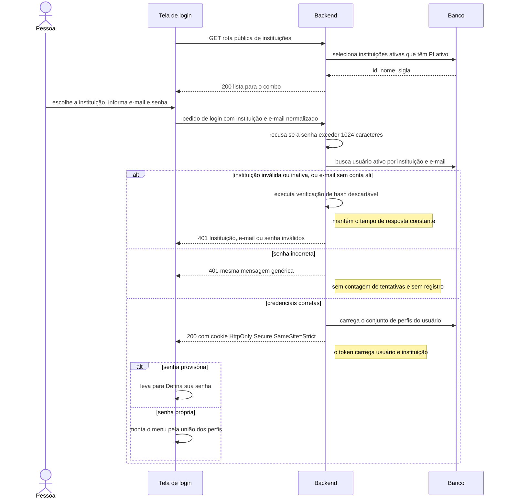
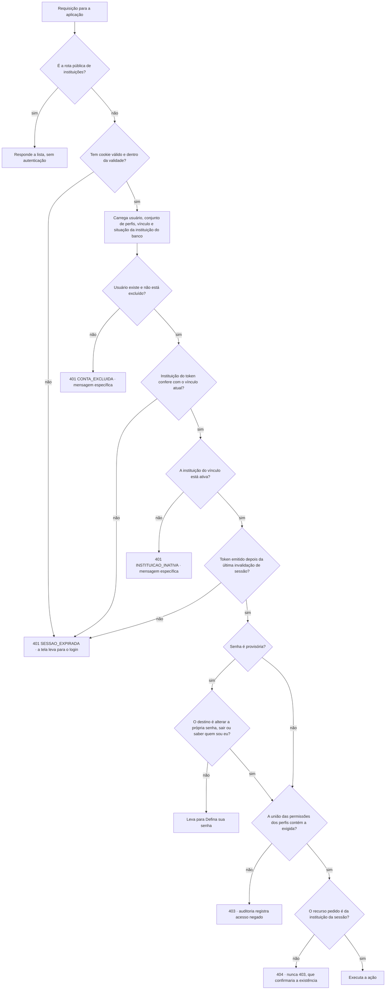
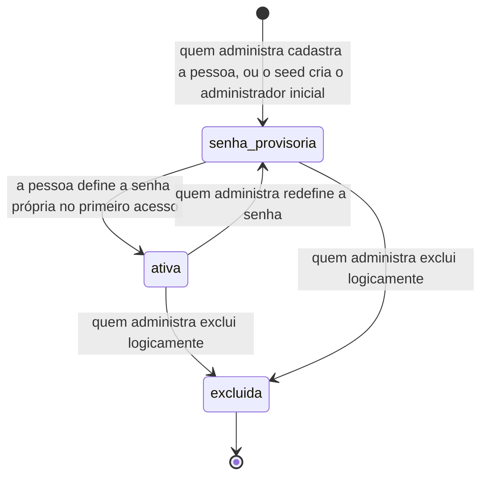
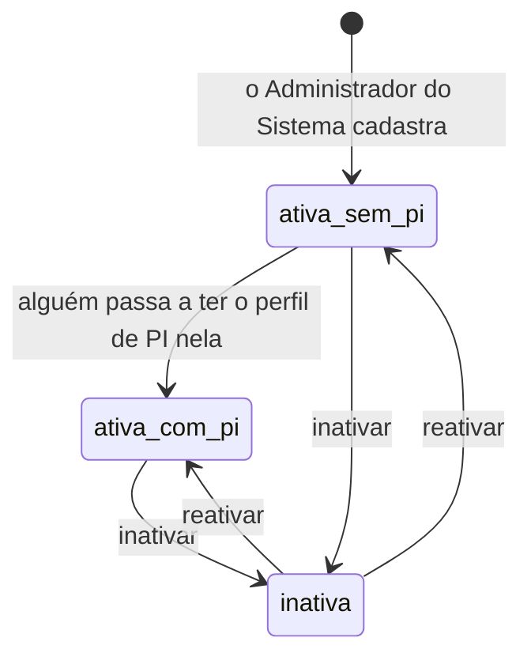

# Spec: autenticacao-usuarios

**Data desta versão:** 28/09/2026
**Status:** em construção — `arquiteto` e `dev-fullstack` trabalhando a partir desta spec
**Contexto:** `specs/00-visao-produto.md` · Stack: `project.config.md`
**Nível de rigor:** completo (`ux.md`, `design.md`, `tasks.md`, `evidence.md`)

> Cobre: entidade **Instituição** e seu CRUD, perfil **Administrador do
> Sistema** e seu CRUD, login com combo de instituição, logout, AppShell, CRUD
> de usuários por instituição **com múltiplos perfis**, alterar a própria senha,
> redefinir senha de outro, e o seed.

---

## 1. Premissas declaradas

| # | Premissa | Se for rejeitada |
|---|---|---|
| **P7** | **Volume:** dezenas de instituições e até ~2.000 usuários por instituição em dois anos; até ~30 pessoas simultâneas | Revisar paginação e índices com o `arquiteto` |
| **P9** | **Retenção:** dados do cadastro e auditoria administrativa ficam enquanto a conta existir + **5 anos** após a exclusão lógica, depois anonimizados | Substituir os prazos. Não muda código na v1 |
| **P10** | **E-mail sem restrição de domínio** | Adicionar validação de domínio, configurável por instituição |
| **P11** | **Não existe base de usuários a importar** (confirmado pelo dono) | — |
| **P12** | **Limite técnico de 1024 caracteres no campo de senha.** Não é política de senha (3.3): é proteção de fronteira de confiança — sem limite, um pedido com megabytes força o servidor a calcular o hash daquilo, operação deliberadamente custosa | Ajustar o valor. O limite não é dispensável |
| **P13** | **Entrada do Administrador do Sistema no combo de login.** Como ele não pertence a instituição, o combo tem uma entrada própria, "Administração do sistema", separada da lista. Alternativa rejeitada: rota de login separada, mais fácil de esquecer de proteger | Rever a tela e o payload de login |
| **P14** | **Não há troca de instituição na sessão.** A instituição é fixada no login; quem atua em duas IES tem duas contas | Entra seletor de contexto no shell — mudança grande |
| **P15** | **Campos da instituição:** nome, sigla, código e-MEC (opcional) e situação ativa/inativa, mais os campos base do CLAUDE.md | Retirar as unicidades de 3.21 |
| **P16** | **Inativar instituição não apaga nada** nem exclui os usuários dela: retira-a do combo e encerra as sessões em andamento (3.18) | Manter sessões vivas até expirarem (8 h) |

Premissa **P1** da visão (senha definida por quem administra; troca obrigatória
no primeiro acesso; sem recuperação por e-mail) está **confirmada**.

---

## 2. Objetivo

Estabelecer as instituições atendidas pela instalação, a identidade das pessoas
dentro de cada uma, e o shell de aplicação padronizado. É pré-requisito das
demais features: sem instituição e sem perfil não há como decidir quem cadastra
curso, quem define meta e quem responde por ela.

### Não-objetivos

- **Auto-registro**; **recuperação de senha por e-mail**; **MFA**; **login por
  link mágico**.
- **Login com Google e qualquer login federado** — desejado, em entrega
  posterior. Nesta entrega o modelo de identidade apenas o **acomoda** (3.11).
- **Política de senha** — decisão do dono; ver 3.3 e o risco em 4.1.
- **Limite de tentativas de login, bloqueio de conta e registro de tentativas
  de login** — decisão do dono; ver 3.2 e o risco em 4.1.
- **Conta única vinculada a várias instituições com troca de contexto na
  sessão** — considerado e recusado (P14). Roadmap.
- **Subdomínio por instituição** — considerado e recusado. Roadmap.
- **Exclusão de instituição, lógica ou física.** Ver 3.19.
- **Alterar a instituição de um usuário.** Decorre de P14: a conta é da
  instituição. Quem muda de IES é excluído em uma e cadastrado na outra.
- **Estado "inativo/suspenso" de usuário.** A conta é ativa ou excluída
  logicamente. Quem inativa é a instituição, não a pessoa.
- **Perfis configuráveis.** Os cinco são fixos, e as permissões de cada um são
  definidas nesta spec, não editáveis em runtime.
- **Qualquer vínculo com curso.** A entidade Curso é de `specs/cursos/`. Esta
  spec não cria, não lê e não exibe vínculo de coordenação — ver 3.22.
- **Gestão de sessões ativas**; **importação em lote**; **exportação da
  listagem**; **filtro por usuários excluídos** no grid.
- **Rotina automática de expurgo/anonimização** por retenção — roadmap.
- **Campo pessoal além de nome, e-mail, senha e perfis.** Sem CPF, telefone,
  data de nascimento, matrícula ou foto.

---

## 3. Decisões de comportamento

### 3.1 Mensagem de erro de login não distingue causa

Instituição inexistente, inativa ou manipulada no payload; e-mail inexistente
naquela instituição; senha errada; conta excluída — **todas produzem a mesma
resposta**: 401, mesmo código de erro, mesma mensagem, mesmo tempo.

> **Mensagem única:** "Instituição, e-mail ou senha inválidos."

Motivo: distinguir é enumeração (OWASP A07). **Vale mais sem limite de
tentativas (3.2):** uma ferramenta automatizada pode varrer e-mails à vontade,
e uma resposta que distinguisse produziria a lista completa de pessoas de cada
instituição em minutos.

**Tempo constante:** quando a instituição ou o e-mail não resolvem para uma
conta, o sistema executa uma verificação de hash descartável antes de responder.
Sem isso, o caso inexistente responde em ~5 ms e o de senha errada em ~250 ms, e
a diferença entrega o que a mensagem esconde.

**Esta regra vale apenas no login, onde quem pede é anônimo.** Encerramento de
sessão de quem já está autenticado tem tratamento próprio — ver 3.18.

### 3.2 Sem limite de tentativas de login e sem registro de tentativas

Decisão do dono do produto. Não existe: contador de tentativas; bloqueio de
conta; resposta 429 nem `Retry-After`; registro em auditoria de tentativa de
login, de login bem-sucedido ou de logout; registro do endereço de origem de
quem tenta entrar; qualquer tela ou estado de "conta bloqueada".

A rota de login responde 200 ou 401 (ou 400 para pedido malformado), quantas
vezes for chamada.

**A auditoria das ações administrativas continua obrigatória** (seção 11). Como
não há registro de entrada, o de saída também não existe.

Excepciona regra do CLAUDE.md — risco aceito em 4.1.

### 3.3 Sem política de senha

**A única validação é: a senha não pode estar vazia.**

Não existe, em nenhuma das rotas que recebem senha: tamanho mínimo; exigência
de maiúscula, número ou símbolo; proibição de senha comum, igual ao e-mail ou
igual à atual; expiração; histórico. Qualquer caractere é aceito. **A tela não
exibe dica de requisito**, porque não há requisito a informar.

O limite de 1024 caracteres (P12) não contradiz isto: não julga a qualidade da
senha nem recusa nenhuma senha que uma pessoa fosse digitar.

Excepciona expectativa do CLAUDE.md — risco aceito em 4.1.

### 3.4 Troca de senha obrigatória no primeiro acesso (requisito)

Todo usuário criado por quem administra — e o Administrador do Sistema do
seed — entra com a senha marcada como provisória e é levado **obrigatoriamente**
para "Defina sua senha". Enquanto provisória, os únicos destinos permitidos são:
alterar a própria senha, sair, e consultar os próprios dados de sessão.

**Por que isto é requisito, e não conveniência:** o produto existe para produzir
um relatório de desempenho das metas da coordenação, e esse relatório só vale se
cada registro nele for atribuível à pessoa certa. Se quem administra define a
senha e ela nunca muda, o Pesquisador Institucional pode entrar como qualquer
coordenador e **enviar ou avaliar entregas em nome dele** — exatamente a pessoa
que o relatório mede passa a poder ser personificada por quem o avalia. A troca
obrigatória é o que separa "quem criou a conta" de "quem usa a conta", e sem
essa separação o relatório não comprova nada.

Redefinir a senha de alguém devolve a conta ao estado provisório.

### 3.5 O token identifica; ele não autoriza

O token carrega o identificador do usuário, **o identificador da instituição da
sessão** e o instante de emissão. **O conjunto de perfis, a situação da conta, a
situação da instituição e o vínculo institucional são lidos do banco a cada
requisição** — nunca confiados aos claims.

A instituição do token é **conferida contra o vínculo atual do usuário no
banco**. Divergência significa token obsoleto ou forjado → 401.

| Evento | Efeito na sessão em andamento do afetado |
|---|---|
| Acrescentam ou retiram um perfil de alguém logado | Vale na **requisição seguinte** — a sessão continua (3.23) |
| Excluem alguém logado | Sessão encerrada, com motivo informado (3.18) |
| **Inativam a instituição** de alguém logado | Sessão encerrada, com motivo informado (3.18) |
| Redefinem a senha de alguém logado | Sessão encerrada, sem motivo específico (3.18) |
| A pessoa altera a própria senha | Continua autenticada, **com cookie novo** |
| Logout | A sessão para de funcionar |

Sugestão não vinculante: um campo `sessoes_validas_a_partir_de` no usuário,
comparado com o instante de emissão do token, resolve logout, troca e
redefinição de senha com uma peça só, sem lista de revogação e sem estado em
memória.

**TTL do token: 8 horas.** Sem refresh token na v1 — a mitigação é `HttpOnly` +
`Secure` + `SameSite=Strict`, que tira o token do alcance do JavaScript.

### 3.6 Um usuário tem vários perfis

**O modelo é de conjunto, não de valor único.** Um usuário possui um **conjunto
de perfis**, e as permissões dele são a **união** das permissões de cada perfil
do conjunto.

**Exemplo concreto, que é o caso comum em instituição pequena:** uma pessoa com
`{professor, pesquisador_institucional}` pode fazer tudo o que um Professor faz
**e** tudo o que um PI faz. O menu lateral mostra a **união** dos itens dos dois
perfis, sem duplicar grupo; o grid de usuários é acessível a ela porque um dos
perfis dela tem `usuario.listar`.

**Combinações permitidas:** qualquer uma entre `aluno`, `professor`,
`coordenador_curso` e `pesquisador_institucional`.

**`administrador_sistema` não acumula com nenhum outro.** O motivo é estrutural,
não preferência: ele é definido por **não pertencer a instituição alguma**,
enquanto os outros quatro só existem **dentro de uma**. Um usuário com
`administrador_sistema` e `professor` precisaria ter e não ter instituição ao
mesmo tempo — e todo o isolamento (3.12) se apoia na instituição do ator, de
modo que esse usuário não teria fronteira definida. Quem administra a plataforma
e também leciona tem **duas contas, com e-mails distintos**.

**Mínimo de um perfil.** Um usuário sem nenhum perfil não pode existir: ele
passaria por todas as verificações de autenticação e falharia em todas as de
autorização, o que é um estado sem uso e difícil de diagnosticar.
**Decisão: desmarcar o último perfil recai para `aluno`**, em vez de recusar a
operação — é coerente com "todo usuário nasce Aluno" e evita uma mensagem de
erro para algo que tem padrão óbvio. Para que a coerção não seja silenciosa:
- na **tela**, ao desmarcar o último, "Aluno" é remarcado na hora, com texto de
  apoio explicando por quê — a pessoa vê acontecer;
- na **API**, conjunto vazio é aceito e coagido para `{aluno}`, e **a resposta
  devolve o conjunto resultante**, de modo que o cliente saiba o que ficou
  gravado.

**Todo usuário nasce Aluno — como padrão, não como acréscimo.** Se o PI não
marcar nada no cadastro, o conjunto é `{aluno}`. Se ele marcar `professor`, o
conjunto é `{professor}` — **`aluno` não é acrescentado aos demais**. Marcar
ambos é possível e deliberado, e é assim que se registra o aluno de pós-graduação
que também leciona. Ver a análise em 4.4.

### 3.7 Invariantes de administração

1. **Ninguém exclui a si mesmo** — qualquer perfil.
2. **Ninguém altera o próprio conjunto de perfis.**
3. **Instituição não pode ficar sem PI:** não é possível excluir um usuário nem
   retirar-lhe o perfil `pesquisador_institucional` se ele for o **último usuário
   ativo daquela instituição que possui esse perfil**. A invariante conta **quem
   possui o perfil entre os seus**, não quem "é" PI, e é **por instituição** —
   usuário de outra instituição não a satisfaz.
4. **Sempre existe pelo menos um Administrador do Sistema ativo**, pela mesma
   contagem.

> **Consequência para o `arquiteto`:** as invariantes 3 e 4 passam a contar
> linhas de uma **tabela de vínculo usuário–perfil**, não valores de uma coluna.
> A verificação e a escrita precisam estar na **mesma transação**, com bloqueio
> adequado: duas operações concorrentes que, isoladas, deixariam um PI cada uma,
> não podem ambas ter sucesso e zerar a instituição. É o cenário E-17.

**Quem pode atribuir qual perfil:**

| Quem cria | Perfis que pode atribuir | Onde |
|---|---|---|
| Administrador do Sistema | `pesquisador_institucional` | tela de PIs de uma instituição (18.6) |
| Administrador do Sistema | `administrador_sistema` | tela de Administradores do Sistema (18.7) |
| Pesquisador Institucional | `aluno`, `professor`, `coordenador_curso`, `pesquisador_institucional`, em qualquer combinação — **sempre na própria instituição** | tela de Usuários (18.3) |

O PI **nunca** atribui `administrador_sistema`: o valor não aparece na tela dele,
e a API recusa qualquer conjunto que o contenha.

> `coordenador_curso` deixa de ser marcável **na entrega da feature `cursos`** —
> ver 3.22. Nesta entrega ele continua marcável.

Um PI pode retirar o perfil de PI, excluir ou redefinir a senha de **outro
usuário da própria instituição**, respeitadas as invariantes. "Redefinir senha"
**não se aplica a si mesmo**; o caminho para a própria senha é "Alterar minha
senha", que exige a atual.

### 3.8 Unicidade de e-mail: por instituição, não global

- E-mail **normalizado** antes de persistir e de comparar: `trim` + minúsculas.
- Unicidade **composta e parcial**: única por **(instituição, e-mail)**
  `WHERE excluido_em IS NULL`. A mesma pessoa pode ter conta em duas
  instituições com o mesmo e-mail, e o e-mail de um usuário excluído volta a
  ficar livre naquela instituição.
- **Armadilha que precisa de tratamento explícito:** o Administrador do Sistema
  tem vínculo institucional **nulo**, e em Postgres um índice `UNIQUE` trata
  `NULL` como distinto — dois administradores com o mesmo e-mail passariam.
  Exige `NULLS NOT DISTINCT` (Postgres 15+) **ou** um segundo índice único
  parcial sobre o e-mail `WHERE instituicao_id IS NULL AND excluido_em IS NULL`.
  Decisão do `dba`; o que não se aceita é deixar como está.
- E-mail já usado por usuário **ativo da mesma instituição** → erro explícito
  "Já existe um usuário ativo com este e-mail nesta instituição." Revela
  existência, e é aceitável: a tela é administrativa e autenticada. É o oposto
  do caso do login.

### 3.9 A exclusão lógica apaga a credencial

Ao excluir um usuário, além de marcar `excluido_em`, o sistema **anula o hash
da senha**. Nome, e-mail e perfis **são preservados**: os registros de entrega e
de avaliação de metas apontam para a pessoa, e apagá-los tornaria o relatório de
desempenho ilegível. O direito de eliminação é tratado em `metas-coordenacao`.

### 3.10 Permissões desta feature

Sem restrição de ambiente (horário, dia, localidade/IP) em nenhuma delas. A
permissão efetiva do usuário é a **união** das linhas dos perfis que ele possui
(3.6).

| Permissão | Adm. Sistema | PI | Coord. | Prof. | Aluno |
|---|---|---|---|---|---|
| `instituicao.listar` / `.criar` / `.editar` / `.inativar` | ✅ | ❌ | ❌ | ❌ | ❌ |
| `pi.gerenciar` (PIs de uma instituição) | ✅ | ❌ | ❌ | ❌ | ❌ |
| `administrador.gerenciar` (outros administradores) | ✅ | ❌ | ❌ | ❌ | ❌ |
| `usuario.listar` / `.criar` / `.editar` / `.excluir` / `.redefinir_senha` | ❌ | ✅ | ❌ | ❌ | ❌ |
| alterar a **própria** senha | ✅ | ✅ | ✅ | ✅ | ✅ |

Quem possui o perfil de PI vê **todos os usuários da própria instituição**. O
Administrador do Sistema **não tem** nenhuma permissão de `usuario.*`.

### 3.11 Modelo de identidade preparado para provedor externo

Todo usuário tem **provedor de identidade** (nesta entrega, um único valor:
credencial local; nunca nulo) e **identificador externo** (nulo para todos).
Nenhuma tela mostra ou escolhe provedor, nenhum endpoint o recebe, nenhuma
lógica ramifica por ele — o comportamento observável da v1 é idêntico ao de um
sistema que só conhece credencial local, que é exatamente o que ele é.

### 3.12 Isolamento por instituição

**Isolamento por coluna, banco único.** Toda tabela de entidade que pertence a
uma instituição carrega o identificador dela.

**O filtro por instituição é obrigatório em toda consulta e centralizado no
adapter de persistência**, junto com o `excluido_em IS NULL` que já existe.
Nunca repetido à mão em cada query — pelo mesmo motivo que o CLAUDE.md dá para a
deleção lógica: **a query onde alguém esquecer é a que vaza dado de outra
instituição.**

**Isolamento é regra de autorização, não filtro de tela** — avaliado no use case.

**Recurso de outra instituição responde 404, não 403.** Um 403 confirmaria que o
registro existe em outra instituição, que é justamente o que o isolamento deve
esconder.

**Ordem de avaliação:** primeiro a **permissão** (nenhum perfil do usuário tem a
permissão → 403), depois o **isolamento** (recurso de outra instituição → 404).

### 3.13 Seed

- Cria **um Administrador do Sistema**, e **apenas se não existir nenhum ativo**
  (idempotente). **O seed não cria PI nem instituição.**
- **A senha não fica no arquivo versionado:** vem de `SEED_ADMIN_EMAIL` e
  `SEED_ADMIN_SENHA`, com as chaves no `.env.example` sem valores.
- Nasce com a senha **provisória** (3.4).
- O seed de desenvolvimento cria também instituições e pessoas **fictícias
  plausíveis** (seção 8), nunca dado real.

### 3.14 Idempotência na criação

`Idempotency-Key` **não é necessário**: as unicidades (3.8, 3.21) tornam a
duplicação impossível — duplo clique produz 201 e depois 409. A UI também o
bloqueia com `LoadingButton`.

### 3.15 O Redis não é usado nesta feature

A sessão vive no cookie e no banco (3.5), não há contador de tentativas (3.2), e
nem a listagem de usuários nem a lista pública de instituições justificam cache.
Registrado para o `arquiteto` não inventar uso.

### 3.16 O Administrador do Sistema é administrador de plataforma

- **Não pertence a nenhuma instituição** — é o único usuário com vínculo
  institucional **nulo**, e por isso **não acumula perfis** (3.6).
- Cadastra, edita e inativa instituições; cria o **primeiro PI** de cada uma;
  gerencia **outros administradores**, em tela própria (18.7).
- **Não vê cursos, metas nem os usuários comuns** das instituições: alcança
  apenas os PIs, no contexto de uma instituição. **Isso é decisão de
  privacidade, não limitação técnica** — ele administra a plataforma, não lê o
  conteúdo dela. Registrado para que ninguém "conserte" isso depois achando que
  é lacuna.
- Não vê o grupo Metas nem o grupo Administração no menu; as rotas
  correspondentes lhe respondem 403.

### 3.17 Rota pública das instituições, e o que entra no combo

O combo do login é carregado de **rota pública** — a **única rota pública de
leitura do sistema**, explicitamente excluída do middleware de autenticação.

- Devolve **somente** identificador, nome e sigla. Nunca usuários, contagens ou
  código e-MEC.
- Ordenada por nome, crescente.
- **Só entra no combo a instituição ativa E com pelo menos um usuário ativo que
  possua o perfil de PI** — ver 3.20.

Risco aceito em 4.2.

### 3.18 Motivo do encerramento da sessão é informado quando a identidade já foi provada

A regra de mensagem genérica (3.1) protege contra **enumeração**, e enumeração
só existe para quem ainda não provou quem é. **Quem já está autenticado tem um
token válido**: informar por que a sessão terminou não entrega nada a um
atacante, que precisaria já ter uma sessão válida daquela instituição para ver a
mensagem.

Do outro lado, responder "sua sessão expirou" a quem teve a instituição
desativada produz o pior resultado: a pessoa tenta entrar de novo, **não
encontra mais a instituição dela no combo** (3.17), e abre chamado de suporte
sem entender nada.

| Situação | Código | Mensagem de tela |
|---|---|---|
| Instituição da sessão foi inativada | `INSTITUICAO_INATIVA` | "Sua instituição foi desativada. Entre em contato com o Administrador do Sistema." |
| A conta foi excluída | `CONTA_EXCLUIDA` | "Sua conta foi removida. Entre em contato com quem administra o sistema." |
| Todo o resto (token expirado, logout, senha redefinida, sessão invalidada, token divergente) | `SESSAO_EXPIRADA` | "Sua sessão expirou. Entre novamente." |

Todos respondem **401**. O que muda é o `code` e a mensagem.

**Por que a lista para aqui:** situação da instituição e `excluido_em` **já são
lidos** pelo middleware a cada requisição, então distingui-los custa zero.
Distinguir "senha redefinida" de "logout em outro dispositivo" exigiria
**armazenar o motivo da invalidação** — campo novo para melhorar uma frase, e a
escada de simplicidade para no degrau anterior.

**Fronteira que não se cruza:** no **login** a mensagem continua genérica (3.1),
mesmo para instituição inativa ou conta excluída, porque ali quem pede é anônimo.

### 3.19 A instituição tem situação, não exclusão

| Conceito | Na instituição | No usuário |
|---|---|---|
| Situação de negócio, reversível | **ativa / inativa** — aparece no grid, é filtrável | não existe |
| Exclusão lógica (`excluido_em`) | **existe na tabela, nunca é preenchida na v1** | é o único mecanismo de remoção |

- **Instituição inativa continua aparecendo no grid**, e o filtro "Situação"
  permite ver ativas, inativas ou todas. Inativação é estado de gestão, não
  ocultação. É o oposto do usuário excluído, que desaparece da listagem.
- `excluido_em` existe por exigência dos campos base do CLAUDE.md, mas **nenhuma
  rota, use case ou botão o preenche**. A listagem aplica `excluido_em IS NULL`
  de todo modo, pelo adapter centralizado — precaução inócua hoje.
- **Se a exclusão for pedida um dia:** **bloqueada enquanto existir qualquer
  usuário — inclusive excluído — curso ou meta vinculada.** O identificador da
  instituição é chave estrangeira em toda entidade; deixá-lo órfão quebra o
  filtro de isolamento. Roadmap (seção 13).

### 3.20 Instituição ativa sem PI é permitida, mas não aparece no login

Entre cadastrar a instituição e criar o PI dela existe o estado **ativa sem
ninguém que possua o perfil de PI** — e ele persiste se o administrador
abandonar o fluxo.

1. **É permitido.** A instituição nasce **ativa**. Nascer inativa até ter PI só
   trocaria um esquecimento por outro e adicionaria um passo a toda criação.
2. **Não entra no combo do login** enquanto não houver um PI ativo (3.17). Sem
   isso, a lista pública anunciaria uma instituição em que **ninguém consegue
   entrar**, e o visitante receberia falha de credencial sem explicação possível.
3. **É sinalizado de forma persistente no grid** ("Nenhum" destacado na coluna
   de PIs), com texto de apoio informando que ela não aparece no login. O mesmo
   aviso aparece no modal de cadastro **antes** de salvar.
4. A invariante 3 de 3.7 **não exige** um PI na criação — impede **remover o
   último**. Uma vez com PI, a instituição nunca volta a ficar sem.

### 3.21 Unicidade de sigla e de código e-MEC

**Sigla e código e-MEC são únicos entre todas as instituições não excluídas —
ativas ou inativas.**

- **Sigla:** aparece no cabeçalho e no rodapé de toda tela; duas siglas iguais
  tornam a identificação da instituição ambígua (SH-13).
- **Código e-MEC:** identifica a IES no MEC. Duas instituições com o mesmo código
  é **erro de dado, mesmo que uma esteja inativa**. Restringir a unicidade às
  ativas criaria um caminho sem saída: inativar uma, outra assumir o código dela,
  e a primeira não poder mais ser reativada.
- **Consequência:** o conflito é barrado **no cadastro e na edição**. A
  reativação **nunca** reverifica sigla nem código.
- O código e-MEC continua **opcional**; a unicidade só se aplica quando informado.

### 3.22 O perfil Coordenador passará a derivar do vínculo com curso

**Decisão do dono do produto, com efeito a partir da entrega da feature
`cursos`.** Registrada aqui porque o CRUD de usuários pertence a esta spec.

**O que passa a valer quando `cursos` entregar:**

- Vincular um usuário a um curso como coordenador **acrescenta** o perfil
  `coordenador_curso` ao conjunto dele.
- Retirá-lo do **último** curso **remove** esse perfil do conjunto. Os demais
  perfis dele **permanecem intactos** — com o modelo de conjunto, isso deixa de
  ser "rebaixar para Professor" e passa a ser simplesmente remover um item.
- **`coordenador_curso` sai da lista de perfis marcáveis** na tela de usuários.
  Passa a existir **uma única forma** de obtê-lo: o vínculo com curso.
- **Só quem possui `professor`** pode ser vinculado a um curso.
- Se o usuário ficasse sem nenhum perfil ao perder `coordenador_curso`, aplica-se
  a regra de 3.6: recai para `{aluno}`.

**O que NÃO muda nesta entrega:** a tela continua com os quatro perfis marcáveis,
incluindo `coordenador_curso` (3.7, U-10, 18.8). Enquanto a feature de cursos não
existir não há vínculo, e remover a opção agora deixaria o sistema **sem nenhuma
forma de criar um coordenador**. Nada é antecipado.

**Exigência de auditoria.** A mudança automática de perfil é **alteração de
privilégio**, e esta spec trata o conjunto de perfis como a informação mais
importante da trilha (seção 11 e E-02). Uma mudança **automática** não pode ser
justamente a que não deixa rastro: a promoção e a remoção automáticas geram
registro próprio com **o conjunto anterior, o novo, e o vínculo de curso que
causou a mudança**. O formato do evento fica na spec de `cursos`.

### 3.23 Efeito de uma mudança de perfis na sessão em andamento

O middleware relê o **conjunto de perfis** do banco a cada requisição (3.5), de
modo que acrescentar ou retirar um perfil **vale na requisição seguinte, sem
encerrar a sessão**. Isso vale tanto para a mudança manual pelo PI quanto para a
mudança automática por vínculo de curso (3.22).

**Não há código de erro novo**, e a razão é a mesma que sustentou 3.18:

1. **A sessão não termina.** Quem perdeu um perfil continua autenticado e apenas
   perde permissões — o caminho é o 403 `PERMISSAO_NEGADA` que já existe.
2. **O backend não sabe que houve mudança.** Ele lê o conjunto atual; não sabe
   qual era antes nem por quê. Distinguir exigiria armazenar o motivo da
   alteração para consumo do middleware — a mesma complexidade recusada em 3.18
   para `SENHA_REDEFINIDA`. Abrir exceção aqui tornaria a regra imprevisível.

**Mas o modelo de conjunto acrescenta um caso que não existia, e este precisa de
tratamento:** quando um perfil é **acrescentado**, a pessoa ganha permissões que
o shell já renderizado não conhece. Os itens de menu novos não aparecem até ela
recarregar, e a tela fica dizendo que ela não tem acesso a algo que ela agora
tem. Isso se parece com defeito e gera chamado de suporte tanto quanto o 403
inesperado da remoção.

**Solução, sem estado novo no servidor:** o frontend conhece o conjunto de
perfis com que renderizou o shell e recebe o conjunto atual em
`GET /api/v1/auth/eu`. Quando os dois divergirem — **em qualquer direção** —
ele informa que os perfis mudaram e recarrega a navegação. É comparação no
cliente. Requisito desta entrega, porque o PI já pode alterar perfis aqui.

---

## 4. Riscos aceitos e análises

### 4.1 Ausência de política de senha e de limite de tentativas

| Origem | O que a regra pede | O que esta feature faz |
|---|---|---|
| CLAUDE.md, "Sistema de auditoria" | "sempre auditar: tentativa de login (sucesso e falha)" | Não audita tentativa de login (3.2) |
| CLAUDE.md, observabilidade de auditoria | métrica "contador de falhas de autenticação" | Não existe |
| OWASP A07 | proteção contra ataque automatizado de credencial e contra credencial fraca | Sem limite (3.2) e sem requisito de senha (3.3) |

**Consequência concreta:** uma senha fraca pode ser descoberta por tentativa
automatizada e **não haverá rastro da tentativa**. Sem limite, o único freio é o
custo do hash (~250 ms por tentativa); sem requisito de tamanho, nada impede que
a senha esteja entre as primeiras de qualquer lista comum. Depois do fato não
existe registro de que houve tentativa, de quantas foram, de onde vieram nem se
alguma teve êxito. **Em instalação multi-institucional o alcance é maior:** a
lista pública de instituições dá ao atacante o conjunto de alvos.

**O que permanece mitigando:** resposta de login genérica e de tempo constante
(3.1); senha apenas como hash de algoritmo lento; token em cookie inacessível ao
JavaScript; isolamento verificado no use case (3.12); e **toda ação
administrativa auditada** (seção 11) — o uso indevido de uma conta comprometida
deixa rastro, mesmo que a obtenção dela não deixe.

**Autoridade:** decisão do **dono do produto**, autoridade máxima na cadeia do
CLAUDE.md, tomada com o alerta à vista. Não é lacuna de levantamento nem
pendência de implementação.

**Encaminhamento:** o `security-reviewer` registra em `evidence.md` como **risco
aceito**, com referência a esta seção — não como pendência, não como bloqueio, e
sem propor novamente o controle recusado.

### 4.2 Lista de instituições visível a qualquer visitante

A rota que alimenta o combo é pública (3.17). Qualquer visitante descobre quais
instituições usam o sistema. **Decisão do dono do produto**, que é o que torna o
combo possível sem pedir a instituição por outro meio.

**Consequência:** a relação de clientes da instalação é informação pública, e
serve de mapa de alvos para o cenário de 4.1. **Limite do dano:** a rota devolve
apenas identificador, nome e sigla — nenhum dado pessoal, nenhuma contagem.

### 4.3 Construção de testes reduzida ao mínimo nas fases iniciais

**Decisão do dono do produto, por custo:** nas fases iniciais constrói-se apenas
o conjunto mínimo de testes automatizados; o restante é **anotado** para a fase
de Release (seção 15).

**Consequência:** até a Release, **uma regressão nos caminhos adiados não é
detectada automaticamente** — ela aparece quando alguém usar a tela. Os caminhos
adiados são os de CRUD, apresentação e validação de formato; as fronteiras de
segurança e integridade continuam cobertas desde agora.

**Encaminhamento:** `qa-tester` e `code-reviewer` avaliam pelo critério de 15.3,
não por cobertura de linha. Ausência de teste para um cenário **listado em
`testes-pendentes.md`** não é achado; para um cenário **fora das duas listas**, é.

### 4.4 Análise: o perfil Aluno corre o risco de não significar nada?

**Análise pedida pelo coordenador. Não altera decisão do dono — traz o
diagnóstico e a recomendação.**

**O risco existe, mas a própria decisão do dono já o neutraliza.** A formulação
foi "todo usuário nasce Aluno — **é o padrão quando nada é marcado**". A segunda
metade é o que importa: `aluno` é o **conteúdo** do conjunto quando nenhum outro
perfil é marcado, e **não um item acrescentado a todos**. Um docente cadastrado
com `professor` marcado fica com `{professor}`, não `{professor, aluno}`.

**Onde isso teria dado errado se a primeira metade fosse lida sozinha:** se a
implementação sempre acrescentasse `aluno`, o filtro "Perfil = Aluno" do grid
passaria a devolver **todo mundo da instituição**, ficando inútil exatamente na
tela em que serve para alguma coisa. E qualquer funcionalidade futura que
precise listar alunos — escolher representante discente é o exemplo óbvio —
ofereceria a lista inteira de professores junto. O custo de corrigir depois é
alto, porque o dado já estaria gravado em todos os registros e não haveria como
distinguir quem é aluno de verdade de quem recebeu o perfil por default.

**Recomendação: manter exatamente como o dono definiu, e escrever a regra de
forma que não possa ser mal interpretada.** Foi o que fiz em 3.6, com a frase
"`aluno` não é acrescentado aos demais" e o cenário **U-13**, que existe
especificamente para falhar se alguém implementar o acréscimo automático.

**Um resíduo que continua valendo a pena observar:** quem é cadastrado sem
marcação nenhuma — por engano ou por pressa — fica `{aluno}` sem ser aluno.
Isso é indistinguível, no dado, de um aluno real. Não recomendo mecanismo para
impedir (seria validação sobre intenção, que não se verifica), mas **recomendo
que a tela deixe o padrão visível em vez de implícito**: "Aluno" aparece marcado
desde o início no formulário de cadastro, não como resultado silencioso de não
marcar nada. Está em 18.8.

**Se o dono quiser reduzir esse resíduo**, a mudança barata é tornar a marcação
de ao menos um perfil obrigatória no cadastro — sem padrão algum —, o que
obrigaria a uma escolha consciente. Isso **contraria** a decisão 1 e por isso
não foi adotado; fica registrado como a alternativa, caso ele mude de ideia.

---

## 5. Atores e fluxos principais

| Ator | O que faz nesta feature |
|---|---|
| **Administrador do Sistema** | Entra pela entrada própria do combo, administra instituições, cria o primeiro PI de cada uma, gerencia outros administradores, altera a própria senha, sai |
| **Quem possui o perfil de PI** | Entra escolhendo a instituição, administra os usuários **da própria instituição** e os perfis de cada um, altera a própria senha, sai |
| **Demais perfis** | Entram escolhendo a instituição, alteram a própria senha, saem |
| **Visitante** | Só existe a tela de login, que lista as instituições disponíveis |

### Fluxo 1 — Entrar
1. Abre a raiz (`/`) e vê a tela de login com o combo já carregado.
2. Escolhe a instituição (ou "Administração do sistema", P13), informa e-mail e
   senha, aciona "Entrar".
3. O botão fica desabilitado com spinner e "Entrando...".
4. O sistema autentica **a conta daquela instituição**, grava o cookie e leva
   para `/app`, com o menu montado pela **união** dos perfis dela.
5. Se a senha é provisória (3.4), vai obrigatoriamente para "Defina sua senha".

### Fluxo 2 — Sair
Menu da área do usuário → "Sair" → sessão encerrada, cookie apagado, volta para
`/` com o toast "Sessão encerrada.". Voltar no histórico não devolve o acesso.

### Fluxo 3 — Administrar instituições (só Administrador do Sistema)
1. Menu "Sistema → Instituições". Filtro preenchido com a última pesquisa,
   **sem grid**. "Pesquisar" popula.
2. "Nova" abre o formulário. Ao salvar, o sistema oferece seguir direto para o
   cadastro do primeiro PI dela.
3. Na linha: "Editar", "Inativar"/"Reativar", "Pesq. Institucionais".

### Fluxo 4 — Criar o primeiro PI de uma instituição
1. Direto após salvar a instituição, ou pela ação "Pesq. Institucionais".
2. A tela lista **apenas quem possui o perfil de PI naquela instituição**.
3. "Novo" abre o formulário (nome, e-mail, senha inicial) — o perfil
   `pesquisador_institucional` e a instituição vêm do contexto.
4. Salva → a instituição passa a aparecer no combo (3.20).

### Fluxo 5 — Administrar usuários da instituição (quem possui o perfil de PI)
1. Menu "Administração → Usuários". Filtro preenchido, **sem grid**.
   "Pesquisar" popula, só com usuários **da instituição da sessão**.
2. "Novo" abre o formulário: nome, e-mail, **perfis (Aluno marcado por
   padrão)**, senha e confirmação. A instituição **não é campo**.
3. Na linha: "Editar" (inclusive os perfis), "Redefinir senha", "Excluir".

### Fluxo 6 — Gerenciar Administradores do Sistema
1. Menu "Sistema → Administradores do Sistema". "Pesquisar" popula, só com
   administradores.
2. "Novo": nome, e-mail, senha inicial. **Não há escolha de perfis nem campo de
   instituição** — o papel é único e não acumula (3.6, 3.16).
3. Na linha: "Editar", "Redefinir senha", "Excluir", respeitando 3.7.

### Fluxo 7 — Alterar minha senha
Menu do usuário → "Alterar minha senha" (ou levado até lá no primeiro acesso) →
senha atual, nova, confirmação → toast, cookie renovado, segue para `/app`.

### Fluxo 8 — Redefinir a senha de outra pessoa
Quem administra aciona "Redefinir senha" na linha, informa a nova senha e a
confirmação. A senha volta a ser **provisória**, a sessão da pessoa deixa de
funcionar, e a nova senha é comunicada por fora do sistema (P1).

---

## 6. Fluxos alternativos e de erro

| Condição | Comportamento |
|---|---|
| Instituição não escolhida no login | Validação na própria tela, sem chamada ao servidor |
| Instituição inexistente, inativa ou manipulada; e-mail inexistente ali; senha errada; conta excluída | 401 · mensagem genérica única (3.1) |
| Muitas tentativas seguidas | **Nada de diferente** — 401 quantas vezes for chamada (3.2) |
| Rota `/app/*` sem sessão | Redireciona para `/` · toast "Faça login para continuar." |
| Sessão expirada, logout, senha redefinida, token divergente | 401 `SESSAO_EXPIRADA` (3.18) |
| **Instituição da sessão foi inativada** | 401 `INSTITUICAO_INATIVA` · mensagem específica (3.18) |
| **Conta excluída durante a sessão** | 401 `CONTA_EXCLUIDA` · mensagem específica (3.18) |
| **Perfil acrescentado ou retirado durante a sessão** | Vale na requisição seguinte, sem encerrar a sessão. O frontend detecta a divergência e recarrega a navegação (3.23) |
| Senha provisória e tenta ir para outra tela | Redireciona para "Defina sua senha" |
| Nenhum perfil do usuário tem a permissão, pela tela | Redireciona para `/app` · toast de aviso. A **API responde 403** independentemente |
| Nenhum perfil do usuário tem a permissão, pela API | 403 `PERMISSAO_NEGADA` · auditoria registra `acesso_negado` |
| **Recurso de outra instituição** | **404 `NAO_ENCONTRADO`** — nunca 403 (3.12) |
| PI tenta atribuir `administrador_sistema` | 403 `PERFIL_NAO_ATRIBUIVEL` (3.7) |
| Conjunto de perfis que mistura `administrador_sistema` com qualquer outro | 400 `COMBINACAO_DE_PERFIS_INVALIDA` (3.6) |
| Conjunto de perfis vazio | **Aceito e coagido para `{aluno}`**; a resposta devolve o conjunto resultante (3.6) |
| Valor de perfil inexistente no conjunto | 400 `PERFIL_INVALIDO` · nada é criado nem alterado |
| E-mail já usado por usuário ativo da mesma instituição | 409 `EMAIL_DUPLICADO` · mensagem junto ao campo |
| Sigla ou código e-MEC já usados por qualquer instituição, ativa ou inativa | 409 `SIGLA_DUPLICADA` / `CODIGO_EMEC_DUPLICADO` (3.21) |
| Senha vazia | 400 `SENHA_OBRIGATORIA` · **única** validação de senha |
| Senha acima de 1024 caracteres | 400 `SENHA_ACIMA_DO_LIMITE` · recusado antes de qualquer hash |
| Confirmação de senha divergente | Validação na tela · "As senhas não coincidem." |
| Senha atual incorreta | 401 `SENHA_ATUAL_INCORRETA` |
| Dois administradores editam o mesmo registro | 409 `CONFLITO_DE_VERSAO` · ação "Recarregar dados". **Nunca** salvar por cima |
| Excluir a si mesmo | 403 `AUTO_EXCLUSAO_NEGADA` · o botão nem aparece na própria linha |
| Alterar o próprio conjunto de perfis | 403 `ALTERACAO_DOS_PROPRIOS_PERFIS_NEGADA` · controle desabilitado |
| Deixaria a instituição sem nenhum usuário ativo com o perfil de PI | 409 `ULTIMO_PESQUISADOR_INSTITUCIONAL` |
| Deixaria o sistema sem administrador ativo | 409 `ULTIMO_ADMINISTRADOR_SISTEMA` |
| Tentativa de excluir uma instituição | Não existe a operação (3.19) |
| Registro não encontrado / já excluído | 404 `NAO_ENCONTRADO` |
| Falha de rede ou 500 no login | Toast "Não foi possível entrar agora. Tente novamente." · **nunca** stack trace |
| Query string de listagem fora da allowlist (`sort`, `situacao`, filtros) | 400 `PARAMETRO_INVALIDO` |
| Senha provisória e a rota chamada não é uma das liberadas (`/auth/eu`, `/auth/senha`, `/auth/logout`, `/version`) | 403 `SENHA_PROVISORIA` · "Defina uma senha própria para continuar." |
| Qualquer erro não mapeado nas linhas acima | 500 `ERRO_INTERNO` · mensagem genérica, **nunca** detalhe de implementação |

> `PARAMETRO_INVALIDO`, `SENHA_PROVISORIA` e `ERRO_INTERNO` são códigos
> fixados pelo `arquiteto` durante a implementação (`design.md` §10.2) —
> consequência direta de comportamento já descrito nesta spec (allowlist de
> ordenação, porta de senha provisória, erro genérico de servidor), nunca
> escopo novo.
>
> **Rotas complementares confirmadas na implementação:** buscar, editar,
> excluir e redefinir a senha de um Pesquisador Institucional no contexto de
> uma instituição (seção 7.7, wireframe 18.6 do `ux.md`), e o mesmo
> conjunto de ações para Administradores do Sistema (seção 7.10) — mesmo
> contrato de erro desta tabela, mesmo formato de resposta de
> `/usuarios/{id}`, só o caminho da URL muda
> (`/instituicoes/{id}/pesquisadores/{usuario_id}` e
> `/administradores/{usuario_id}`). Detalhe de rota em `design.md` §10.1.

---

## 7. Critérios de aceite (Given/When/Then)

> A numeração tem lacunas deliberadas: identificador sobrevivente mantém o
> número original e número retirado **nunca** é reaproveitado.

### 7.1 Login

```gherkin
Cenário L-01: login bem-sucedido
  Dado a instituição ativa "Faculdade Serra Azul" (FSA), com PI ativo
    E um usuário ativo nela com e-mail "maria.souza@fsa.edu.br", senha
      "reuniao-nde-2026", perfis {pesquisador_institucional}, senha não
      provisória
  Quando ela escolhe a FSA no combo, informa esse e-mail e essa senha e
        aciona "Entrar"
  Então responde 200 e grava o cookie com HttpOnly, Secure e SameSite=Strict
    E o token carrega o identificador dela e o da FSA
    E o cabeçalho exibe "Maria Souza" e a sigla "FSA"

Cenário L-02: e-mail não cadastrado
  Quando alguém tenta entrar na FSA com "ninguem@fsa.edu.br" e "qualquercoisa"
  Então responde 401 "Instituição, e-mail ou senha inválidos."
    E a resposta é idêntica à de L-03, incluindo o código de erro

Cenário L-03: senha incorreta
  Quando Maria tenta entrar na FSA com a senha "senha-errada"
  Então responde 401 com a mesma mensagem genérica

Cenário L-04: usuário excluído logicamente não entra
  Dado que "carlos.pereira@fsa.edu.br" foi excluído pelo PI da FSA
  Quando ele tenta entrar na FSA com a senha que usava antes
  Então responde 401 com a mesma mensagem genérica
    E NÃO usa o código CONTA_EXCLUIDA, porque no login quem pede é anônimo

Cenário L-05: tentativas repetidas não bloqueiam a conta
  Quando são feitas 20 tentativas seguidas para Maria com senha errada
  Então todas respondem 401 com a mesma mensagem
    E a seguinte, com a senha correta, entra normalmente
    E em nenhum momento o sistema responde 429
    E nenhum registro de auditoria de tentativa de login é criado

Cenário L-08: tempo de resposta não distingue os casos de falha
  Dado pedidos com instituição inexistente, e-mail inexistente e senha errada
  Então a diferença de tempo entre eles não permite distinguir os casos
    E o sistema executa verificação de hash descartável quando não há conta

Cenário L-09: raiz do sistema é a tela de login
  Quando um visitante sem sessão abre a raiz
  Então vê a tela de login, com o combo já carregado

Cenário L-10: visitante sem sessão não acessa a aplicação
  Quando tenta abrir a listagem de usuários pela URL
  Então é levado ao login com o toast "Faça login para continuar."

Cenário L-11: o combo lista somente instituições ativas e com PI
  Dado a FSA e o Instituto Vale Verde (IVV) ativos e com PI ativo
    E o Centro de Ensino Aurora (CEA) inativo
    E a Faculdade Nova Aurora (FNA) ativa e sem ninguém com o perfil de PI
  Quando um visitante abre a tela de login
  Então o combo lista FSA e IVV, em ordem crescente de nome
    E NÃO lista CEA nem FNA
    E a rota devolve apenas identificador, nome e sigla, sem autenticação

Cenário L-12: o mesmo e-mail em duas instituições autentica a conta escolhida
  Dado "joao.ribeiro@ies.edu.br" com conta na FSA (senha "senha-fsa-2026",
        perfis {professor}) e no IVV (senha "senha-ivv-2026", perfis
        {coordenador_curso})
  Quando escolhe a FSA e informa "senha-fsa-2026"
  Então entra com os perfis da conta da FSA
  Quando escolhe o IVV e informa "senha-ivv-2026"
  Então entra com os perfis da conta do IVV
    E as duas contas são independentes: perfis, senha e ciclo próprios

Cenário L-13: senha da outra instituição não serve
  Quando João escolhe a FSA e informa "senha-ivv-2026"
  Então responde 401 com a mensagem genérica

Cenário L-14: e-mail que existe em outra instituição, não na escolhida
  Dado que "renata.coimbra@ivv.edu.br" só tem conta no IVV
  Quando ela escolhe a FSA e informa a senha correta dela
  Então responde 401 com a mesma mensagem genérica

Cenário L-15: login em instituição inativada
  Dado que o Administrador do Sistema inativou a FSA
  Quando Maria tenta entrar na FSA com as credenciais corretas
  Então responde 401 com a mensagem genérica
    E NÃO usa o código INSTITUICAO_INATIVA
    E a FSA já não aparece no combo

Cenário L-16: identificador de instituição manipulado
  Quando o pedido traz um identificador de instituição inexistente
  Então responde 401 com a mesma mensagem e o mesmo tempo de resposta

Cenário L-17: login do Administrador do Sistema
  Quando Rafael escolhe "Administração do sistema" e informa as credenciais
  Então entra com os perfis {administrador_sistema}
    E o token não carrega nenhum identificador de instituição
    E o cabeçalho e o rodapé indicam "Administração do sistema", sem sigla
```

### 7.2 Primeiro acesso e alteração da própria senha

```gherkin
Cenário S-01: primeiro acesso exige troca de senha
  Dado que o PI da FSA cadastrou João com a senha provisória
        "primeiro-acesso-2026"
  Quando ele entra na FSA com essa senha
  Então é levado obrigatoriamente para "Defina sua senha"
    E tentar navegar para qualquer outra tela o devolve para lá
    E as únicas ações disponíveis são definir a senha e sair

Cenário S-02: troca da própria senha com sucesso
  Quando João informa a senha atual, a nova "colegiado" e a confirmação igual
  Então responde 200, emite cookie novo, e a senha deixa de ser provisória
    E ele é levado à tela inicial com o toast "Senha alterada com sucesso."
    E a auditoria registra acao="alterar_senha_propria", resultado="sucesso"

Cenário S-03: senha atual incorreta
  Quando João informa senha atual "errada"
  Então responde 401 "A senha atual está incorreta." e nada é alterado
    E a auditoria registra acao="alterar_senha_propria", resultado="falha"

Cenário S-04: confirmação divergente
  Quando a nova senha é "colegiado" e a confirmação é "colegiada"
  Então a validação ocorre na tela, sem chamada ao servidor
    E "As senhas não coincidem." aparece junto ao campo de confirmação

Cenário S-09: senha longa com acento e espaço é aceita sem truncamento
  Quando a nova senha tem 100 caracteres, com espaços e letras acentuadas
  Então o sistema aceita e o login com essa senha exata funciona
    E digitar apenas os primeiros 72 caracteres dela NÃO autentica

Cenário S-10: senha vazia é recusada
  Quando a nova senha está vazia
  Então responde 400 "Informe a senha."
    E esta é a única validação de conteúdo de senha existente no sistema

Cenário S-11: senha curta é aceita
  Quando a nova senha é "ata"
  Então o sistema aceita e a senha passa a valer
    E nenhuma mensagem sobre tamanho, força ou complexidade é exibida

Cenário S-12: senha acima do limite técnico é recusada
  Quando o campo recebe 2000 caracteres
  Então responde 400 "SENHA_ACIMA_DO_LIMITE", antes de qualquer hash
    E uma senha de exatamente 1024 caracteres é aceita
```

### 7.3 Sessão e efeito das mudanças administrativas

```gherkin
Cenário SE-01: logout encerra a sessão
  Quando Maria aciona "Sair"
  Então vai ao login com o toast "Sessão encerrada.", o cookie é apagado, e
        voltar no histórico não devolve o acesso

Cenário SE-02: exclusão informa o motivo a quem está logado
  Dado Ana autenticada e navegando
  Quando o PI da FSA exclui a conta dela
  Então a requisição seguinte responde 401 CONTA_EXCLUIDA
    E ela vê "Sua conta foi removida. Entre em contato com quem administra o
      sistema."
    E NÃO vê "Sua sessão expirou.", que a levaria a tentar entrar em laço

Cenário SE-03: retirar um perfil vale imediatamente, sem encerrar a sessão
  Dado Ana autenticada com perfis {professor, pesquisador_institucional}
  Quando o PI retira dela o perfil pesquisador_institucional
  Então ela continua autenticada
    E na requisição seguinte perde o acesso às telas de PI, com 403
    E mantém tudo o que o perfil professor permite
    E o frontend detecta a divergência de conjunto e recarrega a navegação
      (3.23)

Cenário SE-04: redefinição de senha encerra a sessão do afetado
  Quando o PI redefine a senha de João, autenticado
  Então a requisição seguinte responde 401 SESSAO_EXPIRADA
    E no próximo login ele cai na troca obrigatória de senha

Cenário SE-05: token expirado
  Dado um cookie emitido há mais de 8 horas
  Então responde 401 SESSAO_EXPIRADA e a tela leva ao login

Cenário SE-06: inativar a instituição encerra as sessões dela, com motivo
  Dado Maria e Ana autenticadas na FSA
  Quando o Administrador do Sistema inativa a FSA
  Então a requisição seguinte de cada uma responde 401 INSTITUICAO_INATIVA
    E a FSA desaparece do combo
    E nenhum registro de usuário da FSA é alterado ou excluído

Cenário SE-07: instituição do token divergente do vínculo no banco
  Dado um cookie cuja instituição não corresponde ao vínculo atual no banco
  Então responde 401 SESSAO_EXPIRADA
    E a instituição do token nunca é fonte de verdade para autorizar

Cenário SE-08: o motivo específico exige identidade provada
  Dado uma requisição sem cookie, ou com cookie inválido, para um usuário
        excluído ou de instituição inativa
  Então responde 401 SESSAO_EXPIRADA, nunca CONTA_EXCLUIDA nem
        INSTITUICAO_INATIVA

Cenário SE-09: acrescentar um perfil durante a sessão
  Dado Ana autenticada com perfis {professor}
  Quando o PI acrescenta a ela o perfil pesquisador_institucional
  Então ela continua autenticada
    E na requisição seguinte já alcança as telas de PI
    E o frontend detecta a divergência de conjunto e recarrega a navegação,
      para que os itens de menu novos apareçam sem ela precisar sair e
      entrar de novo (3.23)
```

### 7.4 Autorização por perfis

```gherkin
Cenário A-01: menu de quem possui o perfil de PI
  Então Maria vê o grupo "Administração" com "Usuários", e NÃO vê "Sistema"

Cenário A-02: menu de quem não possui nenhum perfil com telas
  Dado Ana com perfis {professor}
  Então o grupo "Administração" não existe para ela
    E, como nenhuma outra funcionalidade está disponível nesta entrega, o
      menu lateral não é renderizado e o botão de alternar menu fica oculto

Cenário A-03: quem não tem a permissão digita a URL da administração
  Quando Ana abre a URL da listagem de usuários
  Então é levada à tela inicial com o toast "Você não tem permissão para
        acessar esta área."

Cenário A-04: API de usuários recusa quem não tem a permissão
  Quando um usuário com perfis {professor} chama a API de listagem
  Então responde 403 "PERMISSAO_NEGADA"
    E a auditoria registra acao="acesso_negado" com a permissão exigida

Cenário A-05: API de usuários recusa quem não está autenticado
  Então responde 401

Cenário A-06: aluno também é recusado
  Quando um usuário com perfis {aluno} tenta criar um usuário pela API
  Então responde 403 e nenhum registro é criado

Cenário A-07: as permissões são a união dos perfis
  Dado Beatriz com perfis {professor, pesquisador_institucional}
  Quando ela entra na FSA
  Então alcança tudo o que o perfil professor permite
    E alcança tudo o que o perfil pesquisador_institucional permite,
      incluindo a listagem de usuários
    E o menu lateral mostra a união dos itens dos dois perfis, sem repetir
      grupo nem item
  Quando o PI retira dela o perfil pesquisador_institucional
  Então ela perde apenas o que vinha dele, e continua com o de professor
```

### 7.5 Isolamento entre instituições

```gherkin
Cenário T-01: a listagem só traz usuários da instituição da sessão
  Dado usuários na FSA e no IVV
  Quando Maria pesquisa sem filtro
  Então o grid mostra apenas usuários da FSA
    E o total de resultados conta apenas os da FSA

Cenário T-02: pedir usuário de outra instituição responde 404
  Quando Maria pede o identificador de Renata, do IVV
  Então responde 404 "NAO_ENCONTRADO"
    E NÃO responde 403, que confirmaria a existência em outra instituição

Cenário T-03: editar usuário de outra instituição responde 404
  Quando Maria tenta atualizar o registro de Renata
  Então responde 404 e nada é alterado no IVV

Cenário T-04: excluir usuário de outra instituição responde 404
  Quando Maria tenta excluir o registro de Renata
  Então responde 404 e Renata continua ativa

Cenário T-05: permissão é avaliada antes do isolamento
  Quando um usuário da FSA com perfis {professor} pede o usuário Renata,
        do IVV
  Então responde 403 "PERMISSAO_NEGADA", não 404 (3.12)

Cenário T-06: redefinir senha de usuário de outra instituição responde 404
  Quando Maria tenta redefinir a senha de Renata
  Então responde 404 e a senha de Renata não é alterada
```

### 7.6 Cadastro de usuário (quem possui o perfil de PI, na própria instituição)

```gherkin
Cenário U-01: cadastro bem-sucedido
  Quando Maria cadastra "João Ribeiro", "joao.ribeiro@ies.edu.br", marca
        apenas "Professor", e senha "primeiro-acesso-2026" com confirmação
        igual
  Então responde 201 e o conjunto de perfis gravado é {professor}
    E o registro nasce com UUIDv7, criado_em preenchido, excluido_em nulo,
      versao = 1 e senha provisória
    E o vínculo institucional é a FSA, tomado da sessão — nunca do formulário
    E a senha é armazenada apenas como hash
    E a auditoria registra acao="criar_usuario" com o conjunto de perfis

Cenário U-02: e-mail duplicado na mesma instituição
  Dado um usuário ativo na FSA com "joao.ribeiro@ies.edu.br"
  Quando Maria tenta cadastrar outro na FSA com o mesmo e-mail
  Então responde 409 "EMAIL_DUPLICADO", com a mensagem junto ao campo
    E nenhum registro é criado

Cenário U-03: e-mail de usuário excluído volta a ficar livre na instituição
  Dado "carlos.pereira@fsa.edu.br" excluído logicamente na FSA
  Quando Maria cadastra um novo usuário na FSA com esse e-mail
  Então responde 201 e o registro antigo permanece marcado como excluído

Cenário U-04: e-mail é normalizado
  Quando Maria cadastra "  Joao.Ribeiro@IES.edu.BR  "
  Então o valor persistido é "joao.ribeiro@ies.edu.br"
    E cadastrar "joao.ribeiro@ies.edu.br" depois é recusado como duplicado

Cenário U-05: campos obrigatórios
  Quando Maria tenta salvar com nome vazio
  Então recusa com "O nome é obrigatório." E o mesmo vale para e-mail e senha
    E perfis NÃO está entre os obrigatórios, porque tem padrão (U-12)

Cenário U-06: e-mail com formato inválido
  Quando o e-mail é "joao.ribeiro.ies.edu.br"
  Então recusa com "Informe um e-mail válido."

Cenário U-07: valor de perfil inexistente é recusado
  Quando a API recebe o conjunto {professor, superusuario}
  Então responde 400 "PERFIL_INVALIDO" e nenhum registro é criado

Cenário U-08: duplo clique não cria dois usuários
  Quando Maria clica em "Salvar" duas vezes rapidamente
  Então o botão fica desabilitado com "Salvando..." após o primeiro clique
    E apenas um usuário é criado

Cenário U-09: o mesmo e-mail pode existir em duas instituições
  Dado "joao.ribeiro@ies.edu.br" com conta ativa na FSA
  Quando Renata, PI do IVV, cadastra esse mesmo e-mail na instituição dela
  Então responde 201 e passam a existir duas contas independentes
    E alterar os perfis de uma não afeta a outra

Cenário U-10: o PI não pode atribuir Administrador do Sistema
  Quando Maria abre o controle de perfis
  Então as opções são Aluno, Professor, Coordenador de Curso e Pesquisador
        Institucional
    E "Administrador do Sistema" não é uma delas
    E, se a API receber esse perfil vindo dela, responde 403
      "PERFIL_NAO_ATRIBUIVEL" e nada é criado

Cenário U-11: o PI não escolhe a instituição
  Quando Maria abre o formulário de novo usuário
  Então não existe campo de instituição na tela
    E, se a API receber uma instituição diferente da sessão, ela é ignorada

Cenário U-12: sem marcar nada, o usuário nasce Aluno
  Quando Maria cadastra alguém sem marcar nenhum perfil
  Então responde 201 e o conjunto gravado é {aluno}
    E no formulário "Aluno" já aparecia marcado desde o início, de modo que
      o padrão é visível e não silencioso

Cenário U-13: marcar outro perfil NÃO acrescenta Aluno
  Quando Maria marca apenas "Professor" e desmarca "Aluno"
  Então o conjunto gravado é {professor}
    E "aluno" NÃO é acrescentado automaticamente
    E este cenário existe para falhar se alguém implementar o acréscimo
      automático, que tornaria o filtro por Aluno inútil (4.4)

Cenário U-14: qualquer combinação entre os quatro perfis é permitida
  Quando Maria marca "Aluno" e "Professor"
  Então o conjunto gravado é {aluno, professor}
    E o mesmo vale para {professor, pesquisador_institucional} e para
      {aluno, professor, coordenador_curso, pesquisador_institucional}

Cenário U-15: Administrador do Sistema não acumula com nenhum outro
  Quando a API recebe o conjunto {administrador_sistema, professor}
  Então responde 400 "COMBINACAO_DE_PERFIS_INVALIDA" e nada é criado
    E o motivo é estrutural: o administrador é definido por não pertencer a
      instituição alguma, e os demais só existem dentro de uma (3.6)
```

### 7.7 Grid de usuários

```gherkin
Cenário G-01: a tela abre sem executar consulta
  Então Maria vê a área de filtro e o botão "Novo", o grid não aparece, e
        nenhuma consulta é executada

Cenário G-02: pesquisa por nome ou e-mail
  Quando Maria digita "ri" e aciona "Pesquisar"
  Então o grid mostra "João Ribeiro"
    E a busca é parcial, ignora caixa e acentos ("joao" encontra "João")
    E considera nome e e-mail, restrita à instituição da sessão

Cenário G-03: o filtro por perfil significa "possui este perfil"
  Dado Beatriz com perfis {professor, pesquisador_institucional}
  Quando Maria seleciona "Professor" e pesquisa
  Então Beatriz aparece no resultado, embora tenha outros perfis além dele
    E o combo do filtro não oferece "Administrador do Sistema"
    E o filtro seleciona um perfil por vez, não uma combinação

Cenário G-04: ordenação padrão
  Quando Maria pesquisa sem escolher ordenação
  Então os resultados vêm por Nome, crescente, com o indicador no cabeçalho
    E nomes com acento são ordenados corretamente em português
      ("Ávila" antes de "Bueno", nunca depois de "Zebra")

Cenário G-05: alternância de ordenação
  Quando Maria clica no cabeçalho "Nome", ordenado crescente
  Então passa a decrescente, e clicando de novo volta a crescente
    E nunca existe um terceiro estado sem ordenação

Cenário G-06: trocar a coluna de ordenação
  Quando Maria clica em "Cadastrado em"
  Então a ordenação passa a ser por essa coluna, crescente

Cenário G-07: coluna não ordenável
  Quando Maria clica em "Perfis", "Situação" ou "Ações"
  Então nada acontece e esses cabeçalhos não parecem clicáveis
    E "Perfis" deixou de ser ordenável porque um conjunto não tem ordem
      natural — ordenar por ele produziria um critério arbitrário

Cenário G-08: campo de ordenação inválido é recusado
  Quando a API recebe ordenação fora da lista permitida
  Então responde 400 e a consulta não é executada

Cenário G-09: paginação
  Dado 45 usuários ativos na FSA correspondentes ao filtro
  Então o grid mostra 20, indica 3 páginas e o total de 45

Cenário G-10: limite de tamanho de página
  Quando a API recebe tamanho de página 10000
  Então responde 400, ou aplica o máximo de 100 — nunca consulta sem limite

Cenário G-11: mudar filtro volta à página 1 e mantém a ordenação
  Dado Maria na página 3, ordenando por "Cadastrado em" decrescente
  Quando altera o filtro e pesquisa
  Então o grid volta à página 1 e a ordenação é mantida

Cenário G-12: estado da tela é restaurado ao voltar
  Dado filtro "ri", perfil "Professor", ordenação "Cadastrado em"
        decrescente, 50 por página, página 2
  Quando navega para outra tela e volta
  Então tudo está como ela deixou
    E a consulta é refeita ao acionar "Pesquisar", garantindo dado atualizado

Cenário G-13: página salva maior que o total
  Dado a página 5 salva e um filtro que retorna 2 páginas
  Então mostra a última página válida, sem erro e sem grid vazio

Cenário G-14: nenhum resultado
  Então o grid é substituído por "Nenhum usuário encontrado." com ícone,
        visualmente distinto do estado de carregamento

Cenário G-15: estado de carregamento
  Quando Maria aciona "Pesquisar"
  Então o botão exibe spinner e "Pesquisando..." e fica desabilitado
    E a área do grid mostra esqueleto de linhas com a mesma estrutura do
      resultado real, nunca um spinner solto no centro

Cenário G-16: falha na pesquisa
  Então a área do grid mostra erro com "Tentar novamente", um toast de erro
        é exibido, e nenhum detalhe técnico aparece

Cenário G-17: usuários excluídos não aparecem
  Então Carlos não aparece no grid nem é contado no total

Cenário G-18: situação de primeiro acesso pendente
  Dado que João nunca alterou a senha provisória
  Então a coluna "Situação" dele mostra "Primeiro acesso pendente", e quem
        já definiu a própria senha mostra "Ativo"

Cenário G-19: a coluna Perfis mostra todos os perfis do usuário
  Dado Beatriz com perfis {professor, pesquisador_institucional}
  Então a coluna "Perfis" da linha dela mostra os dois
    E quando não couberem, mostra os dois primeiros em ordem alfabética e
      um indicador "+N" com os demais acessíveis por dica e por texto
      acessível — nunca truncando sem avisar que há mais
```

### 7.8 Edição, exclusão e redefinição de senha

```gherkin
Cenário E-01: edição bem-sucedida
  Dado "João Ribeiro", perfis {professor}, versao = 1, na FSA
  Quando Maria altera o nome para "João Ribeiro Neto" e salva
  Então responde 200, versao passa a 2 e atualizado_em é preenchido
    E a auditoria registra acao="atualizar_usuario" com a lista dos campos
      alterados

Cenário E-02: mudança de perfis é auditada com os dois conjuntos
  Dado João com perfis {professor}
  Quando Maria passa os perfis dele para {professor,
        pesquisador_institucional}
  Então a auditoria registra o conjunto ANTERIOR e o conjunto NOVO, ambos
        completos
    E não registra apenas a diferença: perder o que saiu é perder metade da
      prova de uma escalada de privilégio
    E este é o único campo do usuário cujo valor é registrado

Cenário E-03: conflito de concorrência
  Dado dois PIs da FSA com o registro de João aberto na versao 2
  Quando o primeiro salva (vai à versao 3) e o segundo tenta salvar ainda
        enviando versao 2
  Então o segundo recebe 409 "CONFLITO_DE_VERSAO"
    E vê "Este registro foi alterado por outro usuário enquanto você
      editava." com a ação "Recarregar dados"
    E os dados dele NÃO sobrescrevem o que o primeiro salvou

Cenário E-04: ninguém altera os próprios perfis
  Quando Maria abre a edição do próprio registro
  Então o controle de perfis está desabilitado, com a explicação visível
    E, se a API receber a alteração, responde 403
      "ALTERACAO_DOS_PROPRIOS_PERFIS_NEGADA"

Cenário E-05: exclusão lógica
  Quando Maria exclui Carlos e confirma
  Então responde 204 e o registro recebe excluido_em preenchido
    E nenhuma linha é removida fisicamente do banco
    E o hash da senha é anulado
    E Carlos deixa de aparecer nas pesquisas
    E a auditoria registra acao="excluir_usuario", resultado="sucesso"

Cenário E-06: exclusão pede confirmação
  Então aparece confirmação nomeando quem será excluído, e "Cancelar" não
        altera nada

Cenário E-07: loading por linha no grid
  Quando Maria confirma a exclusão do segundo de três usuários
  Então apenas o botão daquela linha mostra spinner e "Excluindo..."

Cenário E-08: ninguém exclui a si mesmo
  Então "Excluir" não está disponível na própria linha
    E, se a API receber, responde 403 "AUTO_EXCLUSAO_NEGADA"

Cenário E-09: a instituição não fica sem ninguém que possua o perfil de PI
  Dado Maria como única usuária ativa da FSA que possui esse perfil
  Quando outro usuário com o perfil de PI tenta excluí-la, ou retirar-lhe o
        perfil pesquisador_institucional
  Então responde 409 "ULTIMO_PESQUISADOR_INSTITUCIONAL" e nada é alterado
    E a contagem considera quem POSSUI o perfil entre os seus, não quem o
      tem como único
    E a existência de alguém com esse perfil em OUTRA instituição não
      satisfaz a invariante

Cenário E-10: com dois detentores do perfil, um pode perdê-lo
  Dado Maria e Beatriz, ambas ativas na FSA e com o perfil de PI
  Quando Maria retira o perfil pesquisador_institucional de Beatriz
  Então a operação é aceita
    E Beatriz mantém os demais perfis dela, intactos
    E a FSA continua com uma detentora ativa do perfil

Cenário E-11: redefinição de senha
  Quando Maria redefine a senha de João
  Então responde 204 e a senha dele passa a ser provisória
    E a sessão em andamento dele deixa de funcionar
    E a auditoria registra acao="redefinir_senha_usuario" sem qualquer parte
      da senha

Cenário E-12: a redefinição não vale para si mesmo
  Então "Redefinir senha" não está disponível na própria linha

Cenário E-13: dirty state protege contra perda de dados
  Dado um formulário com campos preenchidos e não salvos
  Quando Maria clica fora, pressiona Esc ou aciona "Cancelar"
  Então aparece "Você tem alterações não salvas. Deseja descartá-las?" com
        "Descartar alterações" e "Continuar editando"
    E marcar ou desmarcar um perfil conta como alteração

Cenário E-14: promover mantém o que já existia
  Dado Letícia com perfis {aluno}
  Quando Maria marca também "Professor" e salva
  Então o conjunto passa a {aluno, professor}
    E "aluno" NÃO é removido — é o caso do aluno de pós-graduação que
      também leciona

Cenário E-15: retirar um perfil não retira os outros
  Dado Letícia com perfis {aluno, professor}
  Quando Maria desmarca "Professor" e salva
  Então o conjunto passa a {aluno}, e nada mais muda

Cenário E-16: desmarcar o último perfil recai para Aluno
  Dado João com perfis {professor}
  Quando Maria desmarca "Professor"
  Então a tela remarca "Aluno" na hora, com texto de apoio explicando por quê
  Quando a API recebe um conjunto vazio, por qualquer caminho
  Então aceita, grava {aluno}, e devolve o conjunto resultante na resposta,
        de modo que o cliente saiba o que ficou gravado (3.6)

Cenário E-17: a invariante de PI resiste a duas remoções concorrentes
  Dado Maria e Beatriz como as duas únicas detentoras ativas do perfil de PI
        na FSA
  Quando duas requisições concorrentes tentam, cada uma, retirar o perfil de
        uma delas
  Então exatamente uma tem sucesso e a outra recebe 409
        "ULTIMO_PESQUISADOR_INSTITUCIONAL"
    E ao final a FSA continua com ao menos uma detentora ativa
    E este cenário é obrigatoriamente exercitado contra o banco real, porque
      a contagem atravessa a tabela de vínculo usuário–perfil e o defeito só
      aparece sob concorrência (3.7)
```

### 7.9 Instituições (Administrador do Sistema)

```gherkin
Cenário I-01: cadastro de instituição
  Quando Rafael cadastra nome "Faculdade Serra Azul", sigla "FSA", código
        e-MEC "12345" e situação "Ativa"
  Então responde 201, com UUIDv7, criado_em preenchido e versao = 1
    E a instituição nasce ATIVA, mesmo sem nenhum PI ainda (3.20)
    E o sistema oferece seguir direto para o cadastro do primeiro PI dela
    E a auditoria registra acao="criar_instituicao", resultado="sucesso"

Cenário I-02: código e-MEC é opcional
  Quando Rafael cadastra "Instituto Vale Verde" / "IVV" sem código e-MEC
  Então o cadastro é aceito e a coluna "Código e-MEC" do grid mostra vazio
    E isso atende à IES em credenciamento, que ainda não tem o código

Cenário I-03: nome e sigla são obrigatórios
  Quando Rafael tenta salvar sem nome
  Então recusa com "O nome é obrigatório." E o mesmo vale para a sigla

Cenário I-04: sigla duplicada é recusada, inclusive contra instituição inativa
  Dado a FSA ativa com sigla "FSA" e o CEA inativo com sigla "CEA"
  Quando Rafael tenta cadastrar outra instituição com a sigla "FSA"
  Então responde 409 "SIGLA_DUPLICADA", com a mensagem junto ao campo
  Quando tenta cadastrar outra com a sigla "CEA"
  Então responde 409 igualmente — a unicidade não depende da situação (3.21)

Cenário I-05: código e-MEC duplicado é recusado, inclusive contra inativa
  Dado a FSA ativa com código "12345" e o CEA inativo com código "67890"
  Quando Rafael tenta cadastrar outra instituição com o código "12345"
  Então responde 409 "CODIGO_EMEC_DUPLICADO"
  Quando tenta cadastrar outra com o código "67890"
  Então responde 409 igualmente
    E é isto que garante que o CEA possa ser reativado a qualquer momento
      sem que outra instituição tenha tomado o código dele (3.21)

Cenário I-06: inativar instituição não apaga nada
  Dado a FSA ativa, com 8 usuários e cursos cadastrados
  Quando Rafael a inativa
  Então responde 200 e a situação passa a "Inativa"
    E a FSA desaparece do combo do login
    E nenhum usuário, curso ou meta da FSA é excluído ou alterado
    E as sessões em andamento são encerradas com INSTITUICAO_INATIVA (SE-06)
    E a FSA continua aparecendo no grid de instituições (3.19)
    E a auditoria registra acao="inativar_instituicao", resultado="sucesso"

Cenário I-07: reativar instituição devolve o acesso, sem reverificar unicidade
  Dado a FSA inativa
  Quando Rafael a reativa
  Então responde 200 e ela volta ao combo, desde que tenha PI ativo
    E os usuários dela entram novamente com as senhas que tinham
    E a operação NÃO verifica sigla nem código e-MEC (3.21)
    E a resposta nunca é 409 SIGLA_DUPLICADA nem 409 CODIGO_EMEC_DUPLICADO

Cenário I-08: instituição sem PI é destacada no grid e fica fora do combo
  Dado que Rafael cadastrou a FNA e abandonou o fluxo sem criar o PI dela
  Quando pesquisa no grid de instituições
  Então a coluna "Pesq. Inst." da linha mostra "Nenhum", destacado
    E o texto de apoio informa que ela não aparece no login até ter um PI
    E o combo público NÃO lista a FNA
    E a situação dela continua "Ativa"

Cenário I-09: não existe exclusão de instituição
  Então não há ação de excluir no grid
    E nenhuma rota da API exclui instituição, nem física nem logicamente

Cenário I-10: grid de instituições segue o padrão de CRUD
  Então a tela abre com o filtro preenchido pela última pesquisa e sem grid
    E "Pesquisar" popula o grid
    E a ordenação padrão é Nome, crescente, e o tamanho de página é 20
    E filtro, ordenação, tamanho de página e página são restaurados ao voltar
    E os cabeçalhos ordenáveis são Sigla, Nome, Código e-MEC e Cadastrado em

Cenário I-11: filtro por situação
  Quando Rafael seleciona "Inativas" e pesquisa
  Então o grid mostra apenas instituições inativas
    E, com "Todas", mostra ativas e inativas
    E este filtro existe porque inativação é estado normal de gestão, ao
      contrário da exclusão lógica de usuário, que não tem filtro (3.19)

Cenário I-12: conflito de concorrência na edição
  Dado dois administradores com a mesma instituição aberta na versao 2
  Quando o segundo salva enviando versao 2 após o primeiro ter salvo
  Então recebe 409 "CONFLITO_DE_VERSAO"
```

### 7.10 Administrador do Sistema

```gherkin
Cenário AS-01: criar o primeiro PI de uma instituição
  Dado Rafael no grid de instituições, ou recém tendo salvo o IVV
  Quando aciona "Pesq. Institucionais" na linha do IVV
  Então vê a lista daquela instituição, vazia, com o convite a criar
  Quando cadastra "Renata Coimbra", "renata.coimbra@ivv.edu.br" e uma senha
  Então responde 201 e o conjunto de perfis dela é
        {pesquisador_institucional}
    E a instituição é o IVV, ambos do contexto, sem serem escolhidos no
      formulário
    E a senha nasce provisória
    E o IVV passa a aparecer no combo do login (3.20)

Cenário AS-02: a lista só mostra quem possui o perfil de PI naquela instituição
  Dado que o IVV tem 1 PI, 3 professores e 2 alunos
  Quando Rafael abre a lista de PIs do IVV
  Então vê apenas Renata
    E não vê nenhum professor ou aluno, nem o PI da FSA
    E alguém com perfis {professor, pesquisador_institucional} apareceria
      nesta lista, porque possui o perfil

Cenário AS-03: o administrador não alcança os usuários comuns
  Quando Rafael chama a API de listagem de usuários de uma instituição
  Então responde 403 "PERMISSAO_NEGADA" e a auditoria registra
        acao="acesso_negado"
    E isso é decisão de privacidade: ele administra a plataforma, não lê o
      conteúdo dela

Cenário AS-04: o menu do administrador tem só o grupo Sistema
  Então Rafael vê "Instituições" e "Administradores do Sistema"
    E não vê o grupo "Metas" nem o grupo "Administração"

Cenário AS-05: o administrador não pertence a instituição
  Então o vínculo institucional dele é nulo
    E o cabeçalho e o rodapé indicam "Administração do sistema", sem sigla
    E ele não aparece em nenhum grid de usuários de nenhuma instituição

Cenário AS-06: o sistema não fica sem administrador ativo
  Dado Rafael como único usuário ativo com o perfil administrador_sistema
  Quando outro administrador tenta excluí-lo
  Então responde 409 "ULTIMO_ADMINISTRADOR_SISTEMA" e nada é alterado
    E a contagem segue a mesma forma da invariante de PI (3.7)

Cenário AS-07: o administrador cria outro administrador pela tela própria
  Dado Rafael em "Sistema → Administradores do Sistema"
  Quando cadastra "Helena Prado", "helena.prado@basis-avalia.local" e uma
        senha inicial
  Então responde 201 e o conjunto dela é {administrador_sistema}, apenas
    E não existe controle de perfis nem campo de instituição no formulário
    E o vínculo institucional dela nasce nulo e a senha nasce provisória
    E é isto que permite recuperar o acesso sem rodar o seed em produção

Cenário AS-08: quem não é administrador não alcança a tela de instituições
  Quando Maria abre a URL da listagem de instituições
  Então é levada à tela inicial com o toast de falta de permissão
    E a API de instituições responde 403 "PERMISSAO_NEGADA" para ela

Cenário AS-09: o grid de administradores só lista administradores
  Quando Rafael pesquisa em "Administradores do Sistema"
  Então vê apenas Rafael e Helena
    E nenhum usuário de nenhuma instituição
    E não existe coluna de instituição nem de perfis, porque o papel não tem
      vínculo e não acumula (3.6, 3.16)

Cenário AS-10: quem não é administrador não alcança a tela de administradores
  Quando Maria abre a URL da listagem de Administradores do Sistema
  Então é levada à tela inicial com o toast de falta de permissão
    E a API responde 403 "PERMISSAO_NEGADA" para ela, e o mesmo vale para
      qualquer conjunto de perfis que não contenha administrador_sistema
```

### 7.11 Shell autenticado (AppShell)

```gherkin
Cenário SH-01: regiões do shell
  Então toda tela exibe cabeçalho com logo, título, botão de alternar o menu
        e a área do usuário logado
    E o menu lateral hierárquico de dois níveis, com a união dos itens dos
      perfis do usuário
    E o rodapé fixo
    E o breadcrumb como primeiro elemento da área de conteúdo

Cenário SH-02: área do usuário no cabeçalho
  Dado Beatriz com perfis {professor, pesquisador_institucional}
  Então ela vê o nome, **os dois rótulos de perfil**, o nome da instituição
        da sessão, e "Alterar minha senha" e "Sair"

Cenário SH-03: breadcrumb
  Então na listagem de usuários mostra "Início → Usuários"
    E na de instituições, "Início → Instituições"
    E na de administradores, "Início → Administradores do Sistema"
    E na lista de PIs, "Início → Instituições → Instituto Vale Verde →
      Pesquisadores Institucionais"
    E "Início" é clicável e o item atual não é
    E em 360px os itens intermediários são reduzidos a elipses

Cenário SH-04: grupo do menu é expansível e destaca o item ativo
  Então o grupo do item atual aparece expandido, com o item destacado

Cenário SH-05: menu recolhido
  Quando Maria aciona o botão de alternar o menu
  Então o menu exibe apenas os ícones dos grupos, com dica ao passar o
        ponteiro

Cenário SH-06: barra de progresso na navegação
  Quando Maria clica em um item do menu
  Então a barra aparece no topo imediatamente, o item mostra indicação de
        carregamento, e a barra desaparece ao concluir

Cenário SH-07: barra de progresso em chamada ao servidor
  Então aparece no topo a cada chamada e desaparece na resposta

Cenário SH-08: sistema de notificações
  Então sucesso, erro, aviso e informação são comunicados por notificação
        temporária no canto superior direito, com ícone e cor próprios
    E podem ser fechadas antes do tempo, e simultâneas se empilham
    E a de erro permanece mais tempo em tela que a de sucesso

Cenário SH-09: conteúdo alinhado à esquerda ocupando a largura útil
  Dado a janela em 1440px
  Então a área de conteúdo começa junto ao menu e vai até a margem direita,
        sem coluna estreita centralizada, e o grid ocupa a largura disponível

Cenário SH-10: responsividade
  Quando a tela é verificada em 360px, 768px e 1440px
  Então em nenhuma há rolagem horizontal, texto cortado ou faixa vazia acima
        de aproximadamente 15% da largura à direita do conteúdo
    E em 360px o menu fica recolhido e os grids viram cartões

Cenário SH-11: navegação por teclado
  Então a ordem de tabulação corresponde à ordem visual
    E o elemento com foco é visivelmente destacado
    E o grupo de perfis é percorrido por Tab e marcado por Espaço
    E Esc fecha o formulário aberto, respeitando a proteção de dados não
      salvos

Cenário SH-12: rodapé identifica a instituição da sessão
  Dado Maria logada na Faculdade Serra Azul
  Então o rodapé exibe nome do sistema, versão, ano e "Faculdade Serra Azul",
        lido do banco, nunca de variável de ambiente
  Dado Rafael logado como Administrador do Sistema
  Então o rodapé exibe "Administração do sistema" no lugar da instituição

Cenário SH-13: identificação da instituição no cabeçalho
  Então o cabeçalho exibe a sigla da instituição da sessão ao lado do título,
        e "Administração do sistema" para o administrador
    E isso existe para que ninguém trabalhe na instituição errada acreditando
      estar em outra
```

---

## 8. Exemplos concretos com dados reais

Instituições e pessoas **fictícias plausíveis** — não inventar outras.

**Instituições**

| Nome | Sigla | Código e-MEC | Situação | Tem PI? | Papel |
|---|---|---|---|---|---|
| Faculdade Serra Azul | FSA | 12345 | Ativa | sim (2) | instituição principal |
| Instituto Vale Verde | IVV | *(vazio)* | Ativa | sim (1) | isolamento, e-mail repetido, código opcional |
| Centro de Ensino Aurora | CEA | 67890 | **Inativa** | sim (1) | fora do combo, dentro do grid; unicidade contra inativa (I-04, I-05) |
| Faculdade Nova Aurora | FNA | *(vazio)* | Ativa | **não (0)** | ativa sem PI: fora do combo, marcada no grid (3.20) |

**Pessoas**

| Nome | E-mail | Instituição | Perfis | Senha | Papel |
|---|---|---|---|---|---|
| Rafael Toledo | `rafael.toledo@basis-avalia.local` | **nenhuma** | `{administrador_sistema}` | `plataforma-2026` | administrador do seed |
| Helena Prado | `helena.prado@basis-avalia.local` | **nenhuma** | `{administrador_sistema}` | `plataforma-helena-26` | segundo administrador — torna AS-06 e AS-07 testáveis |
| Maria Souza | `maria.souza@fsa.edu.br` | FSA | `{pesquisador_institucional}` | `reuniao-nde-2026` | PI principal |
| Beatriz Andrade | `beatriz.andrade@fsa.edu.br` | FSA | **`{professor, pesquisador_institucional}`** | `avaliacao-inep-2026` | **o caso de perfis acumulados**: prova a união de permissões (A-07), o filtro "possui o perfil" (G-03), a coluna com vários (G-19) e a invariante com dois detentores (E-10, E-17) |
| Ana Lima | `ana.lima@fsa.edu.br` | FSA | `{professor}` | `colegiado-terca-14h` | alvo de SE-02, SE-03 e SE-09 |
| Paulo Tavares | `paulo.tavares@fsa.edu.br` | FSA | `{coordenador_curso}` | `coordenacao-paulo-26` | coordenador para a linha de cursos e metas |
| Diego Nunes | `diego.nunes@fsa.edu.br` | FSA | `{coordenador_curso}` | `coordenacao-diego-26` | coordenador **admitido no meio do período**: `criado_em` = 15/06/2026 no seed |
| João Ribeiro | `joao.ribeiro@ies.edu.br` | **FSA** | `{professor}` | `senha-fsa-2026` | mesmo e-mail em duas instituições; senha provisória em S-01 |
| João Ribeiro | `joao.ribeiro@ies.edu.br` | **IVV** | `{coordenador_curso}` | `senha-ivv-2026` | a outra conta dele, independente |
| Carlos Pereira | `carlos.pereira@fsa.edu.br` | FSA | `{professor}` | *(anulada)* | excluído logicamente |
| Letícia Moraes | `leticia.moraes@fsa.edu.br` | FSA | **`{aluno, professor}`** | `representacao-discente-26` | **o aluno de pós-graduação que também leciona** — o caso que motivou o acúmulo (E-14, E-15) |
| Ávila Gomes | `avila.gomes@fsa.edu.br` | FSA | `{professor}` | `ata` | ordenação com acento (G-04) e senha de 3 caracteres (S-11) |
| Renata Coimbra | `renata.coimbra@ivv.edu.br` | IVV | `{pesquisador_institucional}` | `nde-vale-verde-26` | alvo do isolamento (T-02 a T-06) |

> **Sobre Paulo Tavares e Diego Nunes.** Existem no seed por causa de `cursos` e
> `metas-coordenacao`. **São dois** porque uma meta que vale para vários cursos
> produz uma única linha de relatório com um só coordenador, e o 404 entre
> recursos da mesma instituição deixa de ser observável sem duas pessoas
> distintas. **Diego é o admitido no meio do período:** não existe campo "data de
> admissão" nesta spec e nenhum foi criado — o seed grava o `criado_em` dele como
> **15/06/2026**. Se a apuração de metas precisar de uma data de admissão própria,
> isso é decisão de `cursos` ou de `metas-coordenacao`; **não invente o campo
> aqui.** Nenhum vínculo de curso é criado nesta entrega.

| Cenário | Entrada | Resultado |
|---|---|---|
| L-01 | FSA / `maria.souza@fsa.edu.br` / `reuniao-nde-2026` | 200, cookie, cabeçalho "Maria Souza" e "FSA" |
| L-02 / L-03 | e-mail inexistente / senha errada | 401 idêntico nos dois casos |
| L-11 | visitante abre o login | combo lista FSA e IVV. **Não** lista CEA (inativa) nem FNA (sem PI) |
| L-12 | IVV / `joao.ribeiro@ies.edu.br` / `senha-ivv-2026` | entra com os perfis da conta do IVV |
| L-17 | "Administração do sistema" / Rafael | entra sem instituição no token |
| SE-03 | PI retira `pesquisador_institucional` de Beatriz | ela mantém `{professor}` e perde só o que vinha do PI |
| SE-09 | PI acrescenta `pesquisador_institucional` a Ana | ela ganha as telas de PI na requisição seguinte |
| A-07 | Beatriz, `{professor, pesquisador_institucional}` | alcança as duas coisas; menu com a união |
| T-02 | Maria (FSA) pede o identificador de Renata (IVV) | **404**, não 403 |
| T-05 | Ávila (`{professor}`, FSA) pede Renata | **403**, não 404 |
| U-12 | cadastro sem marcar nada | conjunto `{aluno}` |
| U-13 | marca só "Professor" | conjunto `{professor}` — `aluno` **não** entra |
| U-14 | marca "Aluno" e "Professor" | conjunto `{aluno, professor}` |
| U-15 | API recebe `{administrador_sistema, professor}` | 400 `COMBINACAO_DE_PERFIS_INVALIDA` |
| E-14 | Letícia `{aluno}` + marcar "Professor" | `{aluno, professor}` |
| E-16 | desmarcar o último perfil | tela remarca "Aluno"; API coage e devolve `{aluno}` |
| E-09 | Maria é a única detentora do perfil de PI na FSA; retirar-lhe o perfil | 409 `ULTIMO_PESQUISADOR_INSTITUCIONAL`. Renata (IVV) não satisfaz |
| E-17 | duas remoções concorrentes com Maria e Beatriz | exatamente uma tem sucesso |
| G-03 | filtro "Professor" | Beatriz aparece, apesar de ter também o perfil de PI |
| G-19 | linha de Beatriz | coluna "Perfis" mostra os dois |
| G-04 | Ávila Gomes, Beatriz Andrade, Letícia Moraes | ordem: Ávila, Beatriz, Letícia |
| AS-06 | Helena tenta excluir Rafael, único administrador ativo | 409 `ULTIMO_ADMINISTRADOR_SISTEMA` |

---

## 9. Ações e respostas esperadas

> Caminhos são **expectativa**. A forma final do contrato é do `arquiteto`.
> **Códigos de status e de erro não são negociáveis** — a tela trata cada um de
> forma distinta.

| Ação | Caminho esperado | Sucesso | Erros |
|---|---|---|---|
| **Instituições do combo (público)** | `GET /api/v1/publico/instituicoes` | 200 `[{ id, nome, sigla }]` — ativas **e com PI ativo** | — (sem autenticação; única rota pública) |
| Entrar | `POST /api/v1/auth/login` (`instituicao_id` nulo = administração do sistema) | 200 + `Set-Cookie` | 400 `PAYLOAD_INVALIDO` / `SENHA_ACIMA_DO_LIMITE` · 401 `CREDENCIAIS_INVALIDAS`. **Nunca 429** |
| Sair | `POST /api/v1/auth/logout` | 204 + cookie apagado | — (idempotente) |
| Quem sou eu | `GET /api/v1/auth/eu` | 200 `{ id, nome, email, perfis: [...], senha_provisoria, instituicao | null }` | 401 `SESSAO_EXPIRADA` / `INSTITUICAO_INATIVA` / `CONTA_EXCLUIDA` |
| Alterar minha senha | `POST /api/v1/auth/senha` | 200 + `Set-Cookie` novo | 400 `SENHA_OBRIGATORIA` / `SENHA_ACIMA_DO_LIMITE` · 401 `SENHA_ATUAL_INCORRETA` |
| Listar instituições | `GET /api/v1/instituicoes?busca=&situacao=&page=&page_size=&sort=&order=` | 200 `{ data, meta }` — com a contagem de detentores ativos do perfil de PI por linha | 400 · 401 · 403 |
| Buscar / criar / atualizar instituição | `GET` · `POST` · `PUT /api/v1/instituicoes[/{id}]` | 200 / 201 / 200 | 400 · 401 · 403 · 404 · 409 `CONFLITO_DE_VERSAO` / `SIGLA_DUPLICADA` / `CODIGO_EMEC_DUPLICADO` |
| Inativar / reativar | `PATCH /api/v1/instituicoes/{id}/situacao` (`versao` no corpo) | 200 | 400 · 401 · 403 · 404 · 409 `CONFLITO_DE_VERSAO`. **Nunca** duplicidade (3.21) |
| Listar / criar PI de uma instituição | `GET` · `POST /api/v1/instituicoes/{id}/pesquisadores` | 200 / 201 | 400 · 401 · 403 · 404 · 409 `EMAIL_DUPLICADO` |
| Listar administradores | `GET /api/v1/administradores?busca=&page=&page_size=&sort=&order=` | 200 `{ data, meta }` | 400 · 401 · 403 |
| Criar / atualizar / excluir administrador | `POST` · `PUT` · `DELETE /api/v1/administradores[/{id}]` | 201 / 200 / 204 | 400 · 401 · 403 `AUTO_EXCLUSAO_NEGADA` · 404 · 409 `EMAIL_DUPLICADO` / `CONFLITO_DE_VERSAO` / `ULTIMO_ADMINISTRADOR_SISTEMA` |
| Redefinir senha de administrador | `POST /api/v1/administradores/{id}/senha` | 204 | 400 · 401 · 403 · 404 |
| Listar usuários | `GET /api/v1/usuarios?busca=&perfil=&page=&page_size=&sort=&order=` (instituição da sessão, nunca parâmetro; `perfil` significa **possui este perfil**) | 200 `{ data, meta }` — cada item com `perfis: [...]` | 400 · 401 · 403 |
| Buscar usuário | `GET /api/v1/usuarios/{id}` | 200 (inclui `versao` e `perfis`) | 401 · 403 · **404 para outra instituição** |
| Criar usuário | `POST /api/v1/usuarios` (`perfis` opcional; ausente ou vazio → `{aluno}`) | 201 — **a resposta devolve o conjunto gravado** | 400 `PERFIL_INVALIDO` / `COMBINACAO_DE_PERFIS_INVALIDA` / `SENHA_OBRIGATORIA` · 401 · 403 `PERFIL_NAO_ATRIBUIVEL` · 409 `EMAIL_DUPLICADO` |
| Atualizar usuário | `PUT /api/v1/usuarios/{id}` (`versao` e `perfis` no corpo) | 200 — **devolve o conjunto gravado** | 400 · 401 · 403 `ALTERACAO_DOS_PROPRIOS_PERFIS_NEGADA` / `PERFIL_NAO_ATRIBUIVEL` · **404** · 409 `CONFLITO_DE_VERSAO` / `EMAIL_DUPLICADO` / `ULTIMO_PESQUISADOR_INSTITUCIONAL` |
| Excluir usuário | `DELETE /api/v1/usuarios/{id}` | 204 | 401 · 403 `AUTO_EXCLUSAO_NEGADA` · **404** · 409 `ULTIMO_PESQUISADOR_INSTITUCIONAL` |
| Redefinir senha de outro | `POST /api/v1/usuarios/{id}/senha` | 204 | 400 · 401 · 403 · **404** |

**Não existe rota de exclusão de instituição** (3.19).

**Códigos de 401 e a fronteira entre eles** (3.18): `CREDENCIAIS_INVALIDAS` é o
único usado no **login**. `INSTITUICAO_INATIVA`, `CONTA_EXCLUIDA` e
`SESSAO_EXPIRADA` só aparecem em rota **autenticada**, quando o token era válido.

**Nenhum código novo entra por causa de mudança de perfis** — quem perdeu uma
permissão recebe o 403 `PERMISSAO_NEGADA` que já existe (3.23).

**Paginação:** `page` (padrão 1), `page_size` (padrão **20**, máximo **100**).
**Lista fechada de `sort`** — usuários: `nome`, `email`, `criado_em`.
Instituições: `sigla`, `nome`, `codigo_emec`, `criado_em`. Administradores:
`nome`, `email`, `criado_em`. Padrão em todas: `nome asc`. **`perfil` saiu da
lista de campos ordenáveis de usuários** — um conjunto não tem ordem natural
(G-07). Valor fora da lista é 400, nunca ignorado.

---

## 10. LGPD

**A instituição é a fronteira do tratamento.** Dado pessoal de uma instituição
nunca é acessível a usuário de outra. A mesma pessoa com conta em duas
instituições tem **dois conjuntos de dados independentes**: um pedido de titular
é respondido **por instituição**, e a eliminação em uma não afeta a outra.

| Campo | Faixa | Finalidade | Retenção |
|---|---|---|---|
| `nome` | comum | identificar a pessoa nas telas e nos registros de entrega e avaliação de metas | conta + 5 anos após exclusão lógica, depois anonimizado (**P9**) |
| `email` | comum | credencial de acesso, identificação e destino da notificação de recusa | idem |
| `senha` (hash) | credencial — nunca exposta, nunca em log, nunca reversível | autenticar | **anulada na exclusão lógica** (3.9) |
| `perfis` (conjunto) | comum | autorização | idem `nome` |
| vínculo com a instituição | comum | **delimitar a fronteira de acesso ao dado** | idem `nome` |
| `senha_provisoria` | técnico | forçar a troca no primeiro acesso | idem `nome` |
| `provedor_identidade`, `identificador_externo` | técnico (fixo e nulo na v1) | preparar o modelo para provedor externo | idem `nome` |
| Auditoria administrativa | comum — o endereço de origem é dado pessoal **indireto** | prestar contas sobre quem concedeu qual permissão e quem alterou o quê | idem `nome` |

- **Dados da instituição** (nome, sigla, código e-MEC) **não são dado pessoal**.
- **Não há registro de tentativa de login** (3.2): o sistema **não guarda** o
  e-mail tentado nem o endereço de origem de quem falha.
- **A rota pública não expõe dado pessoal algum.**
- **Única travessia da fronteira institucional, por desenho:** o Administrador do
  Sistema trata nome e e-mail dos **PIs** que cria. Não alcança nenhum outro
  usuário, curso ou meta (3.16, AS-03).
- **Base legal:** depende de cada instituição, e **públicas e privadas podem
  coexistir na mesma instalação** — o sistema não declara base única.
- **Dado sensível: não. Identificador forte: não** — não há mascaramento a
  implementar.
- **Minimização:** quatro campos pessoais mais o vínculo institucional e o
  conjunto de perfis. A pergunta "é necessário ou é bom ter?" reprovou telefone,
  matrícula, CPF, foto e data de nascimento.
- **Dado de criança e adolescente:** quem tem o perfil `aluno` pode ser **menor
  de 18 anos**. O sistema não coleta data de nascimento — minimização por um
  lado, impossibilidade de tratamento diferenciado por outro. **Recomendação:**
  manter a não coleta e tratar consentimento/assistência dos responsáveis como
  responsabilidade da IES. Ver **QA-6**.
- **Nunca em log nem auditoria:** senha em texto plano, hash, qualquer parte
  dele, o token, o valor do cookie, a senha provisória, e o corpo completo das
  requisições de login e de troca de senha.
- **Auditoria de alteração registra quais campos mudaram, não os valores** —
  com **uma exceção deliberada:** a mudança de `perfis` registra o **conjunto
  anterior e o novo, ambos completos**, porque é a única informação que comprova
  ou desmente escalada de privilégio.
- **Ambiente não-produtivo nunca recebe dado real:** o seed usa as instituições e
  pessoas fictícias da seção 8.
- **Direito de eliminação:** a exclusão lógica **não** o atende. O tratamento é
  decidido em `metas-coordenacao`. A exclusão lógica preserva nome e e-mail
  exatamente porque os registros de entrega e avaliação dependem deles.
- **Transferência para terceiro:** nenhuma nesta entrega.

---

## 11. Auditoria e registro de eventos

**Não há registro de tentativa de login, de login bem-sucedido nem de logout**
(3.2), com o risco em 4.1. A auditoria das ações administrativas é obrigatória.

| Ação | Resultados | Quem | Sobre quem | Syslog |
|---|---|---|---|---|
| `alterar_senha_propria` | `sucesso` · `falha` | o autenticado | ele mesmo | ✅ |
| `redefinir_senha_usuario` | `sucesso` · `negado` | quem administra | o alvo | ✅ |
| `criar_usuario` | `sucesso` · `negado` · `erro` | quem administra | o criado | — |
| `atualizar_usuario` | `sucesso` · `negado` · `erro` | quem administra | o alterado | ✅ quando `perfis` mudou |
| `excluir_usuario` | `sucesso` · `negado` | quem administra | o excluído | ✅ |
| `criar_administrador` / `atualizar_administrador` / `excluir_administrador` | `sucesso` · `negado` · `erro` | o administrador | o alvo | ✅ |
| `criar_instituicao` / `atualizar_instituicao` | `sucesso` · `negado` · `erro` | o administrador | a instituição | ✅ / — |
| `inativar_instituicao` / `reativar_instituicao` | `sucesso` · `negado` | o administrador | a instituição | ✅ |
| `acesso_negado` | `negado` | o autenticado | o recurso pretendido | ✅ |

**Todo registro traz o identificador da instituição do contexto** (nulo para
ações do Administrador do Sistema que não sejam sobre uma instituição
específica), além do endereço de origem e do instante.

**Mudança de perfis registra os dois conjuntos completos** — o anterior e o
novo —, nunca apenas a diferença. Registrar só o que entrou perde a metade da
prova que importa: o que **saiu** é o que distingue uma correção legítima de uma
retirada indevida de controle. É a única exceção à regra de "registrar o campo,
não o valor" (E-02, seção 10).

**A entrega de `cursos` acrescenta o evento de mudança automática de perfil**,
com os dois conjuntos e o vínculo de curso que a causou — ver 3.22.

**Métrica Prometheus:** decisões de autorização (permitido/negado) por permissão
continuam contadas. **Não existe** contador de falhas de autenticação (3.2).

---

## 12. Dependências de outras features

| # | Dependência | Como esta feature lida |
|---|---|---|
| **D1** | O menu terá o grupo "Metas", com badges por perfil | O menu é montado de uma **configuração de navegação** declarativa, com visibilidade por perfil, **resolvida pela união dos perfis do usuário**, e ponto de extensão para os badges. **Nenhum item para tela que não existe** |
| **D2** | A tela inicial mostrará atalhos para as demais funcionalidades | Existe com saudação e atalhos, porque o breadcrumb "Início" e o destino pós-login precisam de rota |
| **D3** | Direito de eliminação de titular que já enviou ou avaliou comprovante | Não resolvido aqui. A exclusão lógica preserva nome e e-mail para não corromper o relatório de desempenho |
| **D5** | Retenção (Q2 da visão) atravessa cadastro e comprovantes | P9 declarada aqui; precisa ser coerente com `metas-coordenacao` |
| **D7** | **Toda entidade de negócio carrega o identificador da instituição** e passa pelo filtro centralizado (3.12) | Regra estabelecida aqui |
| **D8** | **O Administrador do Sistema precisa ser negado nas rotas e telas de curso e meta** (3.16) | Não testável agora. AS-03, AS-04 e AS-09 cobrem o que existe. Requisito a herdar |
| **D9** | **Inativar instituição não pode apagar nada** (P16), e a eventual exclusão fica bloqueada enquanto houver usuário, curso ou meta vinculada (3.19) | Regra estabelecida aqui |
| **D10** | **A entrega de `cursos` altera o CRUD de usuários desta spec:** `coordenador_curso` deixa de ser marcável e passa a derivar do vínculo (3.22) | Registrado em 3.22. **Nada é antecipado nesta entrega** |
| **D11** | **`cursos` e `metas-coordenacao` precisam consultar "quem possui o perfil X"**, não "quem é X" | O modelo de conjunto (3.6) e a forma das invariantes (3.7) já são assim. Registrado para que as specs novas não presumam perfil único |

**Limitação conhecida e esperada:** enquanto só esta feature estiver no ar, quem
não possui o perfil de PI entra e **não tem nenhuma funcionalidade** além de
alterar a própria senha e sair. Consequência da ordem de construção, não defeito.

---

## 13. Roadmap da feature (não implementar agora)

| Item | O que é | Gatilho |
|---|---|---|
| **Conta única multi-institucional com troca de contexto** | Uma credencial para várias instituições, com seletor na sessão. **Considerado e recusado agora** (P14) | demanda real de quem atua em duas IES |
| **Subdomínio por instituição** | `fsa.basis-avalia.br` em vez de combo. **Considerado e recusado agora** | decisão de DNS e certificado |
| **Exclusão de instituição** | Bloqueada enquanto houver usuário, curso ou meta vinculada (3.19) | pedido concreto; hoje inativar resolve |
| **Login com Google (OAuth)** e **sincronização do Google Workspace** | Dois itens distintos. O modelo de identidade (3.11) já os acomoda | decisão do dono; registro da transferência ao Google |
| **Política de senha e limite de tentativas** | Os controles recusados em 3.2 e 3.3 | pedido do dono. Nenhum altera o modelo de dados |
| **Rotina de expurgo e anonimização** | Executar os prazos de P9 | confirmação de QA-5 |
| **Suíte E2E e os testes adiados** | Todo o conteúdo de `testes-pendentes.md` (15.2) vira suíte | fase de Release |

---

## 14. Volume e requisitos não-funcionais

**Volume (P7):** dezenas de instituições; até ~2.000 usuários por instituição em
dois anos; até ~30 pessoas simultâneas.

- Paginação por página/deslocamento é adequada. **Não** migrar para cursor.
- Índices: **único composto e parcial** em (instituição, e-mail) para ativos,
  mais o tratamento da unicidade do administrador sem vínculo (3.8); únicos de
  sigla e de código e-MEC entre não excluídas (3.21); índice em `nome` para a
  ordenação padrão; **o identificador da instituição como primeira coluna dos
  índices de listagem**; e, na **tabela de vínculo usuário–perfil**, índice que
  atenda tanto "os perfis deste usuário" (lido a cada requisição, 3.5) quanto
  "quem possui este perfil nesta instituição" (filtro do grid e invariantes).
  Esta última é a consulta nova mais sensível do modelo de conjunto.
- Sem exportação assíncrona, sem virtualização, sem cache de listagem.

**Performance**
- O hash é **deliberadamente lento** — calibrar para ~**250 ms**; login abaixo de
  **1 s no p95**. Como não há limite de tentativas (3.2), esse custo é o único
  freio a tentativas automatizadas.
- Demais operações: **p95 abaixo de 300 ms**. A leitura dos perfis acontece a
  cada requisição autenticada — é a consulta mais frequente do sistema.
- A rota pública do combo: **p95 abaixo de 100 ms**.
- **Teste de carga: não necessário.** Volume baixo, uso interno, nenhum gatilho
  do CLAUDE.md.

**Acessibilidade (WCAG 2.2 AA — o `ux-designer` detalha)**
- Login: rótulos associados, **foco inicial no combo de instituição**, erro
  anunciado por leitor de tela, `autocomplete` correto, botão de mostrar/ocultar
  senha operável por teclado.
- O combo de instituição segue o padrão WAI-ARIA de `combobox`/`listbox`, com a
  entrada "Administração do sistema" (P13) anunciada como item separado.
- **O controle de perfis é um grupo de caixas de seleção** com rótulo de grupo
  associado, percorrido por Tab e marcado por Espaço. Opção desabilitada mantém
  o texto de explicação acessível, não só visual.
- **A coluna "Perfis" do grid** expõe a lista completa em texto acessível,
  mesmo quando visualmente resumida em "+N".
- Contraste mínimo de 4.5:1 em texto e 3:1 em elementos de interface.
- Carregamento com `aria-busy`; notificações com papel adequado.

**Locale:** datas em `dd/MM/aaaa HH:mm`, fuso `America/Sao_Paulo`; na API, ISO
com deslocamento. Ordenação com collation do português.

---

## 15. Estratégia de testes e critério de aceitação

**Decisão do dono do produto, por custo (4.3):** nas fases iniciais constrói-se
apenas o mínimo necessário de testes automatizados; o restante é **anotado** e
vira suíte na fase de Release. **E2E antecipado: não.**

### 15.1 O que é coberto agora (obrigatório)

Critério do recorte: cobre-se o que é **fronteira de segurança, de isolamento ou
de integridade de dado** — falhas silenciosas, caras de descobrir tarde e
impossíveis de perceber olhando a tela.

| Bloco | Cenários | Por quê |
|---|---|---|
| **Isolamento entre instituições** | `T-01` a `T-06` | Regressão aqui vaza dado entre clientes. Inclui um teste que **falhe se o filtro de instituição for removido do adapter** (3.12) |
| **Invariantes com condição de corrida** | `E-09`, **`E-17`**, `AS-06` | Último detentor do perfil de PI e último administrador. **`E-17` é novo e obrigatório contra o banco real:** a contagem passou a atravessar a tabela de vínculo, e o defeito só aparece sob concorrência (3.7) |
| **União de permissões** | `A-07`, `U-14`, `U-15` | O modelo de conjunto é novo e é a base de toda a autorização. `U-15` protege a regra estrutural de que o administrador não acumula |
| **Matriz de autorização, incluindo o 404** | `A-01` a `A-06`, `AS-03`, `AS-08`, `AS-10`, `U-10`, `T-05` | Cada perfil contra cada permissão de 3.10; o 403; o 404 de outra instituição; a ordem permissão→isolamento; e o PI que não pode atribuir administrador |
| **Concorrência otimista** | `E-03`, `I-12` | Duas escritas concorrentes reais |
| **Unicidade** | `U-02`, `U-03`, `U-09`, `I-04`, `I-05` | Só existe no banco. Inclui duplicado recusado **e** repetição legítima aceita |
| **Padrão de perfis** | **`U-13`**, `E-16` | `U-13` falha se alguém acrescentar `aluno` automaticamente — o defeito que tornaria o filtro por Aluno inútil (4.4). `E-16` garante que ninguém fique sem perfil |
| **Fronteira de divulgação** | `L-08`, `SE-08` | Sustentam as mitigações declaradas em 4.1 |
| **Smoke dos endpoints** | — | Cada rota da seção 9 responde: login válido e inválido, marcas do cookie, 401 sem sessão, 403 sem permissão, 404 de outra instituição, e o banco conecta |

**Regra condicional:** `S-09` é adiado **salvo se o `arquiteto` escolher
`bcrypt`** em vez de `argon2id` — nesse caso passa a obrigatório, porque o
truncamento em 72 bytes é silencioso.

### 15.2 O que é adiado

Caminho feliz de CRUD; paginação, ordenação e persistência de filtro; validação
de formato; estados de tela, microcópia e testes de componente.

**Onde fica registrado:** `specs/autenticacao-usuarios/testes-pendentes.md`, uma
linha por cenário, com prioridade, mantido pelo `dev-fullstack`.

Encabeçam a lista, por serem **fronteira de acesso e não estética**: `SE-06`,
`SE-02`, `SE-04`, **`SE-03` e `SE-09`** (efeito imediato de retirar e de
acrescentar perfil), `S-01` (troca obrigatória no primeiro acesso, que é o que
sustenta a atribuição correta no relatório de metas — 3.4), `E-05`, `U-11` e
`I-09`.

### 15.3 Critério de aceitação da feature

**Para cada identificador de cenário da seção 7, exatamente uma das duas
condições é verdadeira:** (a) existe teste automatizado que o verifica e passa;
**ou** (b) existe linha correspondente em `testes-pendentes.md` **e** o
comportamento foi validado no smoke do dono, registrado em `evidence.md`.

```
C = identificadores de cenário da seção 7
A = cobertos por teste automatizado
B = listados em testes-pendentes.md

aceita ⟺  A ∪ B = C   e   A ∩ B = ∅   e   todo teste de A passa
           e todo cenário de 15.1 está em A, nunca em B
```

O `qa-tester` extrai os três conjuntos e compara — é aritmética, não julgamento.
Registra em `evidence.md` `C \ (A ∪ B)` (esquecidos) e `A ∩ B` (duplicados).
**Ambas vazias, aceita.** Um cenário novo entra automaticamente em `C` e reprova
a aceitação enquanto não estiver em `A` nem em `B`.

### 15.4 Pirâmide, quando o teste existe

| Nível | O que verifica |
|---|---|
| **Unitário** | Use case isolado, com os ports simulados. Escrito **antes** do código |
| **Integração** | Handler + banco real. **Obrigatório** para isolamento, unicidade, concorrência e **as invariantes de perfil**, que só existem no banco |
| **Componente** | Adiado integralmente (15.2) |
| **E2E** | Fase de Release. Login e isolamento são os **dois primeiros** fluxos |

---

## 16. Restrições conhecidas

- **Isolamento por instituição centralizado no adapter de persistência**, junto
  com `excluido_em IS NULL`. Nunca repetido à mão por query.
- **Recurso de outra instituição responde 404, nunca 403** (3.12).
- **Perfis são um conjunto, em tabela de vínculo** — não uma coluna. Toda
  consulta de autorização, o filtro do grid e as invariantes 3 e 4 passam por
  ela (3.6, 3.7).
- **As invariantes de último detentor exigem verificação e escrita na mesma
  transação, com bloqueio adequado** (3.7, E-17).
- **`administrador_sistema` nunca coexiste com outro perfil** (3.6, U-15).
- **Conjunto vazio é coagido para `{aluno}`, e a resposta devolve o conjunto
  gravado** — a coerção nunca é silenciosa (3.6, E-16).
- **`aluno` é o padrão quando nada é marcado, não um acréscimo aos demais**
  (3.6, U-13, 4.4).
- **Índice único composto e parcial** em (instituição, e-mail) para ativos, mais
  tratamento da unicidade do administrador sem vínculo — `NULLS NOT DISTINCT` ou
  segundo índice parcial (3.8).
- **Sigla e código e-MEC únicos entre instituições não excluídas**, ativas ou
  inativas (3.21). Não reverificados na mudança de situação.
- **A instituição de um usuário é imutável** após a criação (decorre de P14).
- **A instituição não tem exclusão, lógica nem física** (3.19).
- **`coordenador_curso` continua marcável nesta entrega** e deixa de ser na
  entrega de `cursos` (3.22). **Não antecipar.**
- **Token em cookie `HttpOnly` + `Secure` + `SameSite=Strict`.**
  `localStorage`/`sessionStorage` para token é achado crítico.
- **A instituição do token é conferida contra o vínculo no banco** a cada
  requisição, e nunca é fonte de verdade para autorizar (3.5).
- **Os códigos específicos de 401 nunca aparecem em rota não autenticada** (3.18).
- **Senha sempre com hash. Recomendação: `argon2id`** — `bcrypt` trunca
  silenciosamente em 72 bytes. Se ficar `bcrypt`, `S-09` vira obrigatório e a
  decisão volta ao analista.
- **Limite de 1024 caracteres no campo de senha**, aplicado **antes** de qualquer
  cálculo de hash (P12).
- **Campos base obrigatórios** em `usuario` e `instituicao`: `id` (UUIDv7 gerado
  no domínio), `criado_em`, `atualizado_em`, `excluido_em`, `versao`.
- **Nenhum identificador numérico sequencial** exposto em API ou URL.
- **Concorrência otimista com `versao`** → 409, nunca 400 nem 500.
- **Deleção lógica sem exceção** para usuário. Nenhum `DELETE` físico.
- **Lista fechada de campos ordenáveis**, sem `perfil` (seção 9).
- **A rota pública precisa ser explicitamente excluída** do middleware de
  autenticação, e é a **única** com essa característica (3.17).
- **Sem estado de sessão em memória do processo** — múltiplas réplicas.
- **O bypass de `APP_ENV=development` não se aplica** (3.10... ver 3.13 do
  CLAUDE.md): esta é a autenticação, e um bypass a tornaria impossível de
  validar. Em `development` o login funciona normalmente.
- **Respostas de erro nunca expõem** stack trace, nome de tabela, SQL ou caminho
  de arquivo. As mensagens de 3.18 são a exceção deliberada.
- **Zero comentários no código do frontend.**
- **Segredos só por variável de ambiente** (`SEED_ADMIN_EMAIL`,
  `SEED_ADMIN_SENHA`), chaves no `.env.example` sem valores.
- **O nome da instituição no rodapé e a sigla no cabeçalho vêm do banco.**

---

## 17. Questões abertas

Nenhuma bloqueia a construção.

| # | Questão | O que vale enquanto não há resposta |
|---|---|---|
| **QA-5** | Confirma os prazos de retenção (conta + 5 anos após a exclusão lógica)? | P9 |
| **QA-6** | Quem tem o perfil `aluno` pode ser menor de 18 anos: manter a não coleta de data de nascimento e tratar consentimento/assistência fora do sistema? | seção 10 |
| **QA-9** | Confirma **P13**, **P14**, **P15** e **P16**? | as próprias premissas |
| **QA-12** | **Análise em 4.4, para ciência:** a leitura de "todo usuário nasce Aluno" como acréscimo automático tornaria o perfil sem significado. Implementei como **padrão quando nada é marcado**, que é o que o dono definiu. Confirma a leitura? | 3.6 e U-13 |

---

## 18. Wireframes

> Esboço de validação. O design completo está em `ux.md`.

**Decisão modal vs. página nova:** login e "alterar minha senha" são páginas;
novo/editar usuário, instituição, PI e administrador são **modais**; redefinir
senha, confirmar exclusão e confirmar inativação são **modais pequenos**;
listagens são páginas.

### 18.1 Login — `/`

> Única exceção à regra de conteúdo alinhado à esquerda.

```
┌──────────────────────────────────────────────────────────┐
│         ╭──────────────────────────────────────╮         │
│         │        [logo]  basis-avalia          │         │
│         │  Entrar                              │         │
│         │  ──────────────────────────────────   │         │
│         │  Instituição *                       │         │
│         │  [▼ Selecione a instituição       ]  │         │
│         │    ├ Faculdade Serra Azul (FSA)      │         │
│         │    ├ Instituto Vale Verde (IVV)      │         │
│         │    ├──────────────────────────────   │         │
│         │    └ Administração do sistema        │         │
│         │                                      │         │
│         │  E-mail *                            │         │
│         │  [maria.souza@fsa.edu.br          ]  │         │
│         │  Senha *                             │         │
│         │  [••••••••••••••         ]    [👁]   │         │
│         │                                      │         │
│         │  [            Entrar             ]   │         │
│         │  ──────────────────────────────────   │         │
│         │  Esqueceu a senha? Procure o         │         │
│         │  Pesquisador Institucional da sua    │         │
│         │  instituição para redefini-la.       │         │
│         ╰──────────────────────────────────────╯         │
│            basis-avalia · v1.0.0 · © 2026                │
└──────────────────────────────────────────────────────────┘
```

O separador antes de "Administração do sistema" atende à P13. Nenhuma dica de
requisito de senha (3.3). **Inativas e sem PI nunca aparecem** (3.17, 3.20).

```
Carregando o combo:   [⌛ Carregando instituições...    ]
Enviando:             [      ⟳  Entrando...         ]   ← desabilitado
Falha (única msg):    ⚠ Instituição, e-mail ou senha inválidos.
Instituição vazia:    ⚠ Selecione a instituição.        ← validado na tela
```

Não existe estado de "conta bloqueada" (3.2). As mensagens específicas de
encerramento (3.18) aparecem **acima do formulário**, com papel de alerta:

```
         │  ⚠ Sua instituição foi desativada.   │   ← INSTITUICAO_INATIVA
         │    Entre em contato com o             │
         │    Administrador do Sistema.          │
         │  ⚠ Sua conta foi removida. Entre em   │   ← CONTA_EXCLUIDA
         │    contato com quem administra o      │
         │    sistema.                           │
```

### 18.2 Shell + tela inicial — `/app`

```
┌──────────────────────────────────────────────────────────────┐
│ ▓▓▓▓▓▓▓▓▓▓▓▓▓░░░░░░░░░░░░░░░░░░░░░░░░░░░░░░░░░░░░░░░░░░░░░ │ ← progresso
├──────────────────────────────────────────────────────────────┤
│ [logo] basis-avalia · FSA   [☰]   (BA) Beatriz Andrade [▾]  │
├──────────────────────┬───────────────────────────────────────┤
│                      │ Início                                │
│ ▾ Administração      │ ───────────────────────────────────── │
│    · Usuários        │ Bem-vinda, Beatriz.                   │
│                      │ Professora e Pesquisadora             │
│                      │ Institucional na Faculdade Serra Azul.│
│                      │ ┌─────────────────────────┐           │
│                      │ │ 👥 Usuários             │           │
│                      │ │ Cadastrar pessoas e     │           │
│                      │ │ definir perfis          │           │
│                      │ │              [Abrir →]  │           │
│                      │ └─────────────────────────┘           │
├──────────────────────┴───────────────────────────────────────┤
│ basis-avalia · v1.0.0 · © 2026 · Faculdade Serra Azul        │
└──────────────────────────────────────────────────────────────┘
```

O menu mostra a **união** dos itens dos perfis dela (A-07). A saudação nomeia
os dois papéis.

**Área do usuário aberta** — lista todos os perfis (SH-02):

```
                   ╭───────────────────────────────╮
                   │ Beatriz Andrade               │
                   │ Professor · Pesquisador       │
                   │ Institucional                 │
                   │ Faculdade Serra Azul          │
                   │ ───────────────────────────── │
                   │ 🔑 Alterar minha senha        │
                   │ ⏏  Sair                       │
                   ╰───────────────────────────────╯
```

**Quem não possui perfil com telas** (A-02): sem menu lateral e sem botão de
alternar menu nesta entrega, com estado vazio explicando que as demais telas
serão liberadas depois.

**Administrador do Sistema** (AS-04) — dois itens, e nada além deles:

```
│ ▾ Sistema                │ Bem-vindo, Rafael.                │
│    · Instituições        │ Administrador do Sistema.         │
│    · Administradores do  │ [🏛 Instituições]  [🛡 Admins]     │
│      Sistema             │                                   │
```

### 18.3 Usuários — `/app/usuarios`

**Estado inicial: filtro visível, sem grid** (G-01)

```
│ Início → Usuários                                            │
│ ──────────────────────────────────────────────────────────── │
│ Usuários                                        [ + Novo ]   │
│ Nome ou e-mail: [                    ]                       │
│ Perfil:         [▼ Todos             ]  ← "possui este perfil"│
│                                        [ 🔍 Pesquisar ]      │
│ ──────────────────────────────────────────────────────────── │
│   Use os filtros acima e clique em Pesquisar para ver os     │
│   usuários.                                                  │
```

O combo do filtro oferece os quatro perfis institucionais, um por vez, e
significa **"possui este perfil"** (G-03).

**Após "Pesquisar"** — ordenação padrão Nome ▲, só da FSA (T-01)

```
│ ┌────────────────┬──────────────────────┬─────────────────────────┬──────────────┬─────────┬─────────────┐ │
│ │ Nome        ▲  │ E-mail            ⇅  │ Perfis                  │ Situação     │ Cad. ⇅  │ Ações       │ │
│ ├────────────────┼──────────────────────┼─────────────────────────┼──────────────┼─────────┼─────────────┤ │
│ │ Ana Lima       │ ana.lima@fsa.edu.br  │ Professor               │ Ativo        │ 12/03/26│ [✎][🔑][✗] │ │
│ │ Ávila Gomes    │ avila.gomes@fsa...   │ Professor               │ Ativo        │ 14/03/26│ [✎][🔑][✗] │ │
│ │ Beatriz Andrade│ beatriz.andrade@...  │ Pesq. Inst. · Professor │ Ativo        │ 02/03/26│ [✎][🔑][✗] │ │
│ │ Diego Nunes    │ diego.nunes@fsa...   │ Coordenador             │ Ativo        │ 15/06/26│ [✎][🔑][✗] │ │
│ │ João Ribeiro   │ joao.ribeiro@ies...  │ Professor               │ 1º acesso    │ 20/03/26│ [✎][🔑][✗] │ │
│ │                │                      │                         │ pendente     │         │             │ │
│ │ Letícia Moraes │ leticia.moraes@...   │ Aluno · Professor       │ Ativo        │ 22/03/26│ [✎][🔑][✗] │ │
│ │ Maria Souza    │ maria.souza@fsa...   │ Pesq. Institucional     │ Ativo        │ 01/03/26│ [✎]         │ │
│ │ Paulo Tavares  │ paulo.tavares@fsa... │ Coordenador             │ Ativo        │ 10/03/26│ [✎][🔑][✗] │ │
│ └────────────────┴──────────────────────┴─────────────────────────┴──────────────┴─────────┴─────────────┘ │
│ Exibindo 1-8 de 8      Por página: [▼ 20 ]   ← Ant.  Página 1 de 1  Próx. →                               │
```

**Coluna "Perfis"** (G-19): todos os perfis, em ordem alfabética, separados por
`·`. Quando não couberem, os dois primeiros e `+N`, com a lista completa em dica
e em texto acessível — **nunca truncar sem avisar que há mais**. A coluna **não
é ordenável**: um conjunto não tem ordem natural (G-07).

`[✎]` editar · `[🔑]` redefinir senha · `[✗]` excluir. A própria linha não tem
`[🔑]` nem `[✗]` (E-08, E-12).

```
Carregando:  [⟳ Pesquisando...] + esqueleto de linhas com a mesma estrutura
Vazio:       🔍  Nenhum usuário encontrado. Revise os filtros.
Erro:        ⚠  Não foi possível carregar os usuários agora.
                                              [ Tentar novamente ]
Excluindo:   somente a linha acionada mostra  [✎][🔑][⟳ Excluindo]
```

Em 360px o grid vira cartões; os perfis aparecem como etiquetas sob o nome.

### 18.4 Instituições — `/app/instituicoes`

```
│ Início → Instituições                                        │
│ ──────────────────────────────────────────────────────────── │
│ Instituições                                    [ + Nova ]   │
│ Nome ou sigla: [              ]  Situação: [▼ Todas       ]  │
│                                        [ 🔍 Pesquisar ]      │
│ ──────────────────────────────────────────────────────────── │
│ ┌────────┬──────────────────────┬──────────┬──────────┬──────────────┬─────────┬───────────────┐ │
│ │Sigla ⇅ │ Nome              ▲  │ Cód.     │ Situação │ Pesq. Inst.  │ Cad. ⇅  │ Ações         │ │
│ │        │                      │ e-MEC ⇅  │          │              │         │               │ │
│ ├────────┼──────────────────────┼──────────┼──────────┼──────────────┼─────────┼───────────────┤ │
│ │ CEA    │ Centro de Ensino ... │ 67890    │ Inativa  │ 1            │ 03/02/26│ [✎] [↻] [👤] │ │
│ │ FSA    │ Faculdade Serra Azul │ 12345    │ Ativa    │ 2            │ 01/02/26│ [✎] [⊘] [👤] │ │
│ │ FNA    │ Faculdade Nova Auro..│ —        │ Ativa    │ Nenhum ⚠     │ 20/03/26│ [✎] [⊘] [👤] │ │
│ │ IVV    │ Instituto Vale Verde │ —        │ Ativa    │ 1            │ 15/03/26│ [✎] [⊘] [👤] │ │
│ └────────┴──────────────────────┴──────────┴──────────┴──────────────┴─────────┴───────────────┘ │
│ ⚠ Instituição sem Pesquisador Institucional não aparece na tela de login.                        │
```

A coluna "Pesq. Inst." conta **quem possui o perfil**, não quem o tem como único
(3.7). `[✎]` editar · `[⊘]` inativar · `[↻]` reativar · `[👤]` Pesquisadores
Institucionais. **Não há ação de excluir** (I-09).

**Confirmação de inativação:**

```
      ╔═══════════════════════════════════════════════╗
      ║ Inativar a Faculdade Serra Azul (FSA)?  [✗]  ║
      ╠═══════════════════════════════════════════════╣
      ║ Ela sai da tela de login e ninguém dela        ║
      ║ consegue entrar. Quem está usando o sistema   ║
      ║ agora será desconectado e verá o motivo.      ║
      ║ Nenhum usuário, curso ou meta é excluído. Ela ║
      ║ continua nesta lista e pode ser reativada.    ║
      ║          [Cancelar]  [    Inativar    ]      ║
      ╚═══════════════════════════════════════════════╝
```

### 18.5 Modal: nova / editar instituição

```
╔════════════════════════════════════════════════════════╗
║ Nova instituição                                 [✗]  ║
╠════════════════════════════════════════════════════════╣
║ Nome *   [Faculdade Serra Azul                      ]  ║
║ Sigla *  [FSA          ]                               ║
║ Código e-MEC  [12345        ]                          ║
║ Opcional — IES em credenciamento ainda não tem código. ║
║ Situação *   (•) Ativa    ( ) Inativa                  ║
║ ℹ Ao salvar, você será levado a cadastrar o            ║
║   Pesquisador Institucional dela. Enquanto ela não     ║
║   tiver um, não aparece na tela de login.              ║
║                          [Cancelar]  [   Salvar   ]   ║
╚════════════════════════════════════════════════════════╝

Sigla duplicada (I-04):   ⚠ Já existe uma instituição com esta sigla,
                            ativa ou inativa.
Código duplicado (I-05):  ⚠ Já existe uma instituição com este código
                            e-MEC, ativa ou inativa.
Conflito (I-12):          ⚠ Este registro foi alterado por outro usuário
                            enquanto você editava.  [ Recarregar dados ]
```

As mensagens dizem "ativa ou inativa" porque a unicidade não depende da situação
(3.21) — sem isso, quem está com o filtro em "Ativas" não entende o conflito.

### 18.6 Pesquisadores Institucionais de uma instituição

Alcançada ao salvar uma instituição nova, ou pela ação `[👤]`.

```
│ Início → Instituições → Instituto Vale Verde → Pesquisadores │
│ ──────────────────────────────────────────────────────────── │
│ Pesquisadores Institucionais · Instituto Vale Verde (IVV)    │
│                                                 [ + Novo ]   │
│ ┌──────────────────┬───────────────────────────┬────────────────┬─────────┬─────────────┐ │
│ │ Nome          ▲  │ E-mail                 ⇅  │ Situação       │ Cad. ⇅  │ Ações       │ │
│ ├──────────────────┼───────────────────────────┼────────────────┼─────────┼─────────────┤ │
│ │ Renata Coimbra   │ renata.coimbra@ivv.edu.br │ 1º acesso pend.│ 15/03/26│ [✎][🔑][✗] │ │
│ └──────────────────┴───────────────────────────┴────────────────┴─────────┴─────────────┘ │
```

Lista **quem possui o perfil de PI** naquela instituição (AS-02) — inclusive
quem tem outros perfis além dele.

**Estado vazio** (3.20):

```
│ ┌──────────────────────────────────────────────────────────┐ │
│ │                          👤                              │ │
│ │  Esta instituição ainda não tem Pesquisador              │ │
│ │  Institucional, e por isso não aparece na tela de login. │ │
│ │  Crie o primeiro para que alguém possa administrá-la.    │ │
│ │                                          [ + Novo ]      │ │
│ └──────────────────────────────────────────────────────────┘ │
```

### 18.7 Administradores do Sistema — `/app/administradores`

```
│ Início → Administradores do Sistema             [ + Novo ]   │
│ Nome ou e-mail: [                    ]  [ 🔍 Pesquisar ]     │
│ ┌──────────────────┬───────────────────────────────┬────────────────┬─────────┬─────────────┐ │
│ │ Nome          ▲  │ E-mail                     ⇅  │ Situação       │ Cad. ⇅  │ Ações       │ │
│ ├──────────────────┼───────────────────────────────┼────────────────┼─────────┼─────────────┤ │
│ │ Helena Prado     │ helena.prado@basis-avalia...  │ 1º acesso pend.│ 28/09/26│ [✎][🔑][✗] │ │
│ │ Rafael Toledo    │ rafael.toledo@basis-avalia... │ Ativo          │ 01/02/26│ [✎]         │ │
│ └──────────────────┴───────────────────────────────┴────────────────┴─────────┴─────────────┘ │
```

- **Sem coluna de instituição e sem coluna de perfis** — o papel não tem vínculo
  e não acumula (3.6, 3.16, AS-09).
- Único filtro: "Nome ou e-mail". Ordenáveis: Nome, E-mail, Cadastrado em.
- A própria linha não tem `[🔑]` nem `[✗]` (3.7).
- Excluir o último ativo → `⚠ É necessário manter pelo menos um Administrador
  do Sistema ativo.` (AS-06).

### 18.8 Modal: novo / editar usuário — **o controle de perfis**

```
╔════════════════════════════════════════════════════════╗
║ Novo usuário · Faculdade Serra Azul              [✗]  ║
╠════════════════════════════════════════════════════════╣
║ Nome *    [Letícia Moraes                           ]  ║
║ E-mail *  [leticia.moraes@fsa.edu.br                ]  ║
║                                                        ║
║ Perfis *                                               ║
║  [x] Aluno                                             ║
║  [ ] Professor                                         ║
║  [ ] Coordenador de Curso                              ║
║  [ ] Pesquisador Institucional                         ║
║  Pode marcar mais de um. Uma pessoa pode ser aluno e   ║
║  professor ao mesmo tempo.                             ║
║                                                        ║
║ Senha inicial * [••••••••••••••••          ]   [👁]    ║
║ Confirmar *     [••••••••••••••••                 ]    ║
║ ℹ A pessoa precisará definir uma senha própria no     ║
║   primeiro acesso.                                     ║
║                          [Cancelar]  [   Salvar   ]   ║
╚════════════════════════════════════════════════════════╝
```

**É um grupo de caixas de seleção, não uma lista de opção única.** Pontos que o
`ux-designer` precisa preservar:

- **"Aluno" vem marcado no formulário de "Novo"**, para que o padrão seja
  **visível e não resultado silencioso** de não marcar nada (4.4, U-12).
- Marcar "Professor" **não desmarca "Aluno"** — quem quiser só professor
  desmarca Aluno explicitamente (U-13, E-14).
- **Ao desmarcar o último**, "Aluno" é remarcado na hora, com o texto:
  *"Todo usuário precisa de ao menos um perfil. Aluno foi marcado
  automaticamente."* (E-16).
- **"Administrador do Sistema" não aparece na lista** — é de outra tela e não
  acumula (U-10, U-15).
- **Em "Editar", o controle vem com os perfis atuais marcados.** Editando a si
  mesma, o grupo inteiro fica **desabilitado com a explicação visível** —
  *"Você não pode alterar os seus próprios perfis."* — e não escondido (E-04).
- **Quando `cursos` entregar**, "Coordenador de Curso" passa a aparecer
  **desabilitado**, com *"Definido pelo vínculo com curso."* — desabilitado com
  explicação, nunca oculto (3.22).

```
E-mail duplicado (U-02): ⚠ Já existe um usuário ativo com este e-mail nesta
                           instituição.
Senha vazia (S-10):      ⚠ Informe a senha.
Salvando (U-08):         [Cancelar]  [ ⟳ Salvando...]  + campos desabilitados
Conflito (E-03):         ⚠ Este registro foi alterado por outro usuário
                           enquanto você editava.   [ Recarregar dados ]
Último PI (E-09):        ⚠ É necessário manter pelo menos um Pesquisador
                           Institucional ativo nesta instituição.
Dados não salvos (E-13): ╔═══════════════════════════════════════════╗
                         ║ Você tem alterações não salvas. Deseja    ║
                         ║ descartá-las?                             ║
                         ║ [Continuar editando] [Descartar alterações]║
                         ╚═══════════════════════════════════════════╝
```

**Novo PI** (18.6) e **novo administrador** (18.7) seguem a mesma estrutura, mas
**sem controle de perfis e sem campo de instituição** — ambos vêm do contexto e
são únicos (AS-01, AS-07).

### 18.9 Modal: redefinir senha · confirmar exclusão

```
╔════════════════════════════════════════════════════════╗
║ Redefinir senha de João Ribeiro                  [✗]  ║
╠════════════════════════════════════════════════════════╣
║ Nova senha *           [•••••••••••••••••     ] [👁]   ║
║ Confirmar nova senha * [•••••••••••••••••           ]  ║
║ ⚠ João será desconectado e precisará definir uma       ║
║   senha própria no próximo acesso. Não há envio de     ║
║   e-mail — comunique a nova senha diretamente a ele.   ║
║                     [Cancelar]  [ Redefinir senha ]   ║
╚════════════════════════════════════════════════════════╝

      ╔═══════════════════════════════════════════════╗
      ║ Excluir o usuário Carlos Pereira?       [✗]  ║
      ╠═══════════════════════════════════════════════╣
      ║ (carlos.pereira@fsa.edu.br)                    ║
      ║ Ele perde o acesso imediatamente. O nome dele  ║
      ║ permanece nos registros de entrega e avaliação ║
      ║ de metas.                                      ║
      ║          [Cancelar]  [    Excluir    ]        ║
      ╚═══════════════════════════════════════════════╝
```

### 18.10 Página: alterar minha senha — `/app/alterar-senha`

```
│ Início → Alterar minha senha                                 │
│ Senha atual *          [••••••••••••••••••  ]      [👁]      │
│ Nova senha *           [••••••••••••••••••  ]      [👁]      │
│ Confirmar nova senha * [••••••••••••••••••  ]                │
│ [Cancelar]  [  Alterar senha  ]                              │
```

**Primeiro acesso obrigatório** (S-01) — sem "Cancelar" e sem menu lateral:

```
┌──────────────────────────────────────────────────────────────┐
│ [logo] basis-avalia · FSA          (JR) João Ribeiro   [▾]  │
├──────────────────────────────────────────────────────────────┤
│ Defina sua senha                                             │
│ ℹ Sua senha atual foi definida por quem administra. Para     │
│   continuar, defina uma senha que somente você conheça.      │
│ Senha atual (a que você recebeu) * [•••••••••••••  ]  [👁]   │
│ Nova senha *                       [•••••••••••••  ]  [👁]   │
│ Confirmar nova senha *             [•••••••••••••  ]         │
│ [  Definir senha e continuar  ]                              │
└──────────────────────────────────────────────────────────────┘
```

**Estados de erro** — são apenas estes três:

```
Senha atual *            ⚠ A senha atual está incorreta.        ← S-03
Nova senha *             ⚠ Informe a senha.                     ← S-10
Confirmar nova senha *   ⚠ As senhas não coincidem.             ← S-04
```

### 18.11 Notificações (toast)

Canto superior direito, empilháveis, fecháveis antes do tempo; a de erro
permanece mais tempo que a de sucesso.

```
✅ Usuário cadastrado com sucesso.   ✅ Instituição inativada.
❌ Não foi possível entrar agora.    ⚠️ Você não tem permissão para
   Tente novamente.                     acessar esta área.
ℹ️ Sessão encerrada.                 ℹ️ Seus perfis foram alterados.
                                         Atualizando a navegação.  ← 3.23
```

**As mensagens de encerramento por motivo conhecido (3.18) não são toast:**
aparecem na tela de login, acima do formulário, com papel de alerta.

---

## 19. Diagramas

### 19.1 Login — da tela ao cookie



### 19.2 Decisão de acesso a cada requisição



Os códigos específicos só são alcançáveis **depois** de o cookie ser validado —
a estrutura do diagrama é a garantia da regra de 3.18.

O Administrador do Sistema tem vínculo nulo: para ele, os passos de vínculo e de
situação da instituição são satisfeitos por ausência, e o isolamento é
substituído pelas permissões próprias dele (3.10, 3.16).

**Acrescentar ou retirar um perfil entra por este mesmo caminho:** o conjunto é
relido no nó `CARREGA`, e a decisão muda em `PERM`. Nenhum ramo novo (3.23).

### 19.3 Ciclo de vida da conta



`excluida` é terminal: não há reativação de conta. A pessoa volta por cadastro
novo, possível porque a unicidade de e-mail é restrita aos ativos **daquela
instituição** (3.8). **O conjunto de perfis muda livremente enquanto a conta
está ativa** — não é estado do ciclo de vida, e por isso não aparece aqui.

### 19.4 Ciclo de vida da instituição



**Não há estado terminal:** instituição nunca é excluída (3.19).
**Só `ativa_com_pi` aparece no combo do login** (3.20). Uma vez em
`ativa_com_pi`, a invariante 3 de 3.7 impede voltar a `ativa_sem_pi`.

---

## 20. Decisões já tomadas (não re-discutir)

- **Um usuário tem vários perfis**, e as permissões são a **união** deles (3.6).
  Qualquer combinação entre `aluno`, `professor`, `coordenador_curso` e
  `pesquisador_institucional`.
- **`administrador_sistema` não acumula com nada**, por razão estrutural: ele é
  definido por não pertencer a instituição alguma, e os demais só existem dentro
  de uma (3.6).
- **Todo usuário nasce Aluno como padrão quando nada é marcado** — `aluno` não é
  acrescentado aos demais (3.6, U-13, análise em 4.4).
- **Desmarcar o último perfil recai para `{aluno}`**, com a coerção visível na
  tela e devolvida na resposta da API (3.6, E-16).
- **As invariantes de "último PI" e "último administrador" contam quem POSSUI o
  perfil**, e exigem verificação e escrita na mesma transação (3.7, E-17).
- **A auditoria registra o conjunto anterior e o novo, completos** (seção 11).
- **Mudança de perfis não encerra a sessão e não cria código de erro novo**; o
  frontend detecta a divergência e recarrega a navegação, nas duas direções
  (3.23).
- **O sistema é multi-institucional**, com isolamento por coluna e banco único,
  filtro centralizado no adapter (3.12).
- **Recurso de outra instituição responde 404, nunca 403.** Ordem: permissão,
  depois isolamento.
- **O Administrador do Sistema não pertence a instituição, não vê cursos, metas
  nem usuários comuns** — por decisão de privacidade (3.16).
- **E-mail é único por instituição**, com índice composto e parcial, mais
  tratamento próprio para o administrador sem vínculo (3.8).
- **Sigla e código e-MEC são únicos entre instituições não excluídas** (3.21).
- **A instituição é escolhida no combo do login**, de rota pública — a única do
  sistema (3.17). Risco aceito em 4.2.
- **Instituição ativa sem PI é estado legítimo**, sinalizado e fora do combo
  (3.20). **A instituição tem situação, não exclusão** (3.19).
- **A instituição é fixada no login e não muda na sessão** (P14).
- **O motivo do encerramento da sessão é informado quando a identidade já foi
  provada** (3.18); no login, sempre a mensagem genérica.
- **O perfil Coordenador passará a derivar do vínculo com curso** (3.22). Nesta
  entrega nada muda e nada é antecipado.
- Sem auto-registro. **O seed cria o Administrador do Sistema**, não um PI.
- Token em cookie `HttpOnly` + `Secure` + `SameSite=Strict`; **não autoriza**.
- Senha sempre com hash; **`argon2id` recomendado**.
- **Troca de senha obrigatória no primeiro acesso** (3.4).
- **Sem política de senha** — única validação: senha não vazia (3.3).
- **Sem limite de tentativas de login e sem registro de tentativas** (3.2).
- **Construção de testes reduzida ao mínimo nas fases iniciais** (4.3), com o
  critério de aceitação verificável em 15.3.
- A raiz do sistema é a tela de login. Os grids só aparecem após "Pesquisar".
  Ordenação padrão **Nome crescente** e página **20** nos três grids.
- Nenhum item de menu para tela que ainda não existe.
- O Redis não é usado nesta feature (3.15).
