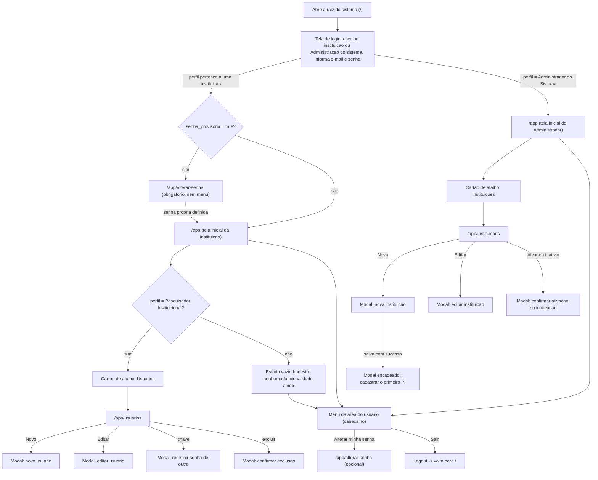

# UX: autenticacao-usuarios

> Este documento **não repete** o que já está resolvido em `spec.md`: os
> cenários Given/When/Then, os personagens fixos, os wireframes ASCII e os
> diagramas Mermaid são a referência visual e comportamental oficial —
> releia-os junto com este arquivo. **O `analista-requisitos` está
> reescrevendo `spec.md` e `00-visao-produto.md` para o escopo
> multi-institucional em paralelo** — por isso este documento evita citar
> números exatos de cenários/wireframes (eles vão mudar) e evita reinventar
> campos de entidade, que continuam sendo decisão da spec. Aqui ficam as
> decisões que a spec deliberadamente deixa em aberto: componente shadcn/ui
> exato, mapa de navegação entre telas, estrutura `shared/` vs `features/`,
> foco de teclado, `aria-live`, responsividade tela a tela e microcópia.
>
> Sistema **não** é DSGOV/portal público federal (`project.config.md`) —
> eMAG não se aplica. WCAG 2.2 AA se aplica integralmente.

---

## Fluxo de telas

1. **Login** (`/`) — propósito: escolher a instituição (ou "Administração
   do sistema") e autenticar por e-mail e senha; única porta de entrada.
2. **Shell autenticado** (AppShell) — propósito: moldura fixa (cabeçalho
   com indicador de instituição, menu, rodapé, breadcrumb, toasts, barra de
   progresso) em toda tela após o login.
3. **Tela inicial** (`/app`) — propósito: destino pós-login e âncora do
   breadcrumb "Início"; ponto de partida diferente por perfil, incluindo
   agora o Administrador do Sistema.
4. **Grid de usuários** (`/app/usuarios`) — propósito: o PI pesquisa,
   cadastra, edita, exclui e redefine senha de pessoas **da própria
   instituição**. Único acesso: PI.
5. **Formulário de usuário** (modal, dentro de `/app/usuarios`) — propósito:
   criar ou editar nome/e-mail/perfil/senha de uma pessoa.
6. **Alterar minha senha** (`/app/alterar-senha`) — propósito: qualquer
   pessoa autenticada troca a própria senha; também é o destino obrigatório
   do primeiro acesso com senha provisória.
7. **Grid de instituições** (`/app/instituicoes`) — propósito: o
   Administrador do Sistema pesquisa, cadastra, edita e ativa/inativa
   instituições. Único acesso: Administrador do Sistema.
8. **Formulário de instituição** (modal, dentro de `/app/instituicoes`) —
   propósito: criar/editar nome, sigla e código e-MEC; e, ao criar uma
   instituição nova, conduzir o Administrador a cadastrar o primeiro
   Pesquisador Institucional dela.

Modais auxiliares: redefinir senha de outro, confirmar exclusão de
usuário, confirmar descarte de alterações não salvas, ativar/inativar
instituição, cadastrar o primeiro PI de uma instituição.

---

## Mapa de navegação

### Para onde cada perfil vai depois do login

| Perfil | Destino pós-login (senha própria) | O que vê em `/app` |
|---|---|---|
| Pesquisador Institucional | `/app` | Saudação + cartão de atalho "Usuários" |
| Coordenador de Curso / Professor / Aluno | `/app` | Saudação + estado vazio honesto (sem cartões) |
| **Administrador do Sistema** | `/app` | Saudação + cartão de atalho "Instituições" — nunca vê os grupos de Atas nem de Usuários, porque não pertence a nenhuma instituição |
| Qualquer perfil, `senha_provisoria = true` | `/app/alterar-senha` (forçado, sem opção de sair dessa rota exceto "Sair") | — |

**Menu lateral por perfil (regra estendida com o quinto perfil):**

| Grupo do menu | PI | Coordenador/Professor/Aluno | Administrador do Sistema |
|---|---|---|---|
| Administração → Usuários | ✅ | ❌ | ❌ |
| Instituições | ❌ | ❌ | ✅ |

Continua valendo a regra já registrada: quando o `NAV_CONFIG` não resolve
nenhum grupo para o perfil corrente, **o menu lateral inteiro não é
renderizado e o botão de alternar menu fica oculto** — vale igualmente para
Coordenador/Professor/Aluno (sem grupo nenhum) e, por construção, o
Administrador do Sistema sempre tem exatamente um grupo ("Instituições"),
nunca zero.

---

## Regra de "ação sem permissão": escondida vs. desabilitada

Regra já formalizada, agora explicitamente estendida ao quinto perfil e à
nova entidade — nenhuma variante nova, só mais exemplos da mesma regra:

| Situação | Tratamento | Motivo |
|---|---|---|
| Ação que **nunca** se aplica ao ator (excluir a si mesmo, redefinir a própria senha pelo caminho do PI, itens de menu de área que o perfil não acessa, **Administrador do Sistema tentando abrir `/app/usuarios` ou `/app/atas`**) | **Escondida** | Estruturalmente impossível — mostrar desabilitado não ensina nada útil |
| Restrição pontual dentro de um formulário que o usuário **tem** permissão de abrir (campo "Perfil" ao editar o próprio registro) | **Desabilitada com explicação visível abaixo do campo** | O usuário está autorizado a estar ali; a explicação ensina a regra sem exigir tentativa e erro |
| Grupo/item de menu que o perfil não acessa (Administração/Usuários para não-PI; Instituições para quem não é Administrador do Sistema) | **Escondido** | Mesma lógica — nível de tela inteira |

Esta é a regra a aplicar em toda extensão futura do produto: **estrutural →
some; pontual dentro de algo que o usuário pode fazer → desabilita e
explica.**

---

## Componentes shadcn/ui — mapeamento e organização de pastas

Estrutura conforme `.claude/skills/frontend-nextjs-shadcn/SKILL.md`.

### `shared/ui/` (reutilizável em qualquer feature futura — nasce aqui)

| Componente | Usa por baixo | Onde é usado nesta feature |
|---|---|---|
| `LoadingButton` | `Button` (shadcn) + `Loader2` (spinner) | Todo botão que dispara chamada assíncrona em todas as telas — **obrigatório**, nunca implementar loading de botão ad-hoc |
| `SkeletonTable` | `Skeleton` (shadcn) dentro de `Table` | Grid de usuários e grid de instituições, estado carregando |
| `EmptyState` | ícone `lucide-react` + texto | Grid sem resultado (usuários e instituições); tela inicial de perfis sem funcionalidade |
| `ErrorState` | ícone + texto + `LoadingButton` "Tentar novamente" | Falha de pesquisa (usuários e instituições) |
| `ConfirmDialog` | `AlertDialog` (shadcn) | Confirmar exclusão de usuário; confirmar descarte de alterações não salvas; confirmar inativação de instituição — genérico, recebe título/corpo/rótulos por prop |
| `TopProgressBar` | barra fina fixa no topo, `aria-hidden="true"` | Navegação de rota e toda chamada HTTP |
| `StatusBadge` **(promovido nesta rodada)** | `Badge` (shadcn), props `label` + `variant` | **Antes era `features/usuario/situacao-badge.tsx`, específico de usuário.** Com a entidade Instituição precisando do mesmo padrão visual (Ativa/Inativa), a lógica de cor+texto é extraída para `shared/ui/` — exatamente o gatilho que o CLAUDE.md descreve ("código copiado entre features → extrair para shared"). `usuario-table` e `instituicao-table` passam a consumir o mesmo componente com props diferentes |

### `shared/forms/` (reutilizável entre formulários)

| Componente | Usa por baixo | Onde é usado |
|---|---|---|
| `PasswordInput` | `Input` (shadcn) + `Button` ghost ícone `Eye`/`EyeOff` | Login, Novo usuário, Redefinir senha de outro, Alterar minha senha, cadastro do primeiro PI — 6 ocorrências, compartilhado de imediato |
| `Combobox` **(novo)** | `Popover` + `Command`/`CommandInput`/`CommandList`/`CommandItem`/`CommandGroup`/`CommandSeparator` (recipe "Combobox" do shadcn, biblioteca `cmdk` por baixo) | Campo "Instituição" no login. Genérico o bastante (rótulo, itens `{id, label, sublabel}`, item fixo opcional, callback de seleção) para ser reaproveitado por qualquer campo futuro de entidade com código+descrição — nasce em `shared/` já na primeira vez, não em `features/auth/` |

**Sem indicador de força de senha e sem checklist de requisitos** — a única
validação de senha nesta versão é campo não vazio; `PasswordInput` cuida
apenas de mostrar/ocultar o valor digitado.

> **Sem `AutocompleteCreate` e sem `RichTextEditor` nesta feature.** O
> `Combobox` do login é a exceção deliberada ao padrão de autocomplete com
> criação inline do CLAUDE.md — ver a seção da tela de Login para a
> justificativa completa.

### `components/layout/` (AppShell, não é `shared/` porque não é reusável fora do shell)

`app-shell.tsx`, `app-header.tsx` (agora inclui o indicador de instituição),
`app-sidebar.tsx`, `app-footer.tsx`, `sidebar-nav.tsx`, `sidebar-group.tsx`.
Componentes shadcn envolvidos: `DropdownMenu`, `Avatar`, `Tooltip` (dica do
grupo com menu recolhido **e** tooltip do nome completo da instituição
quando truncado), `Collapsible`/`Accordion`, `Breadcrumb`, `Sheet`,
`Badge` (indicador de instituição no cabeçalho).

### `features/usuario/` (específico desta entidade — inalterado)

| Componente | Usa por baixo |
|---|---|
| `usuario-filtro.tsx` | `Input`, `Select` (perfil), `LoadingButton` |
| `usuario-table.tsx` | `Table` family — **sem `@tanstack/react-table`**; passa a consumir `StatusBadge` de `shared/ui` em vez do badge próprio |
| `usuario-card-mobile.tsx` | `Card` |
| `usuario-form-modal.tsx` | `Dialog`, `Form`, `Input`, `Select`, `PasswordInput`, `Alert` — **reaproveitado também pelo fluxo de criar o primeiro PI** (ver tela 8), com uma prop nova `perfilFixo?: "pesquisador_institucional"` que, quando presente, oculta o `Select` de Perfil e mostra o rótulo fixo em texto |
| `redefinir-senha-modal.tsx` | `Dialog`, `PasswordInput` ×2, `Alert` |

### `features/instituicao/` (nova)

| Componente | Usa por baixo |
|---|---|
| `instituicao-filtro.tsx` | `Input` (nome/sigla), `Select` (situação: Todas/Ativa/Inativa), `LoadingButton` |
| `instituicao-table.tsx` | `Table` family, mesma decisão de não usar `@tanstack/react-table`, `StatusBadge` de `shared/ui` para a coluna Situação |
| `instituicao-card-mobile.tsx` | `Card` |
| `instituicao-form-modal.tsx` | `Dialog`, `Form`, `Input` (nome, sigla, código e-MEC) — **sem campo Situação** (ver "Tela: Formulário de instituição" para o motivo) |
| `ativar-inativar-instituicao-dialog.tsx` | `ConfirmDialog` (`shared/ui`) com corpo condicional conforme a direção da mudança |
| `cadastrar-primeiro-pi-modal.tsx` | reexporta `usuario-form-modal.tsx` com `perfilFixo` e `instituicaoId` explícitos — não é um componente novo de fato, é uma composição fina |

### `features/auth/`

| Componente | Usa por baixo |
|---|---|
| `login-form.tsx` | `Card`, `Form`, `Combobox` (`shared/forms`), `Input`, `PasswordInput`, `LoadingButton`, `Alert` (erro genérico) |
| `instituicao-login-combo.tsx` | usa o `Combobox` genérico de `shared/forms`, mas conhece a regra específica do login: item fixo "Administração do sistema" sempre presente, busca das instituições ativas via rota pública, persistência em `localStorage` |
| `alterar-senha-form.tsx` | `Form`, `PasswordInput` ×3, `LoadingButton`, `Alert` (variante obrigatória) |

### Hooks (`features/*/hooks/`)

`useLogin`, `useLogout`, `useEu` (agora retorna também `instituicao: {id,
nome, sigla} | null`, nulo para Administrador do Sistema), `useAlterarSenha`
(auth); `useInstituicoesAtivas` (rota pública, sem autenticação, alimenta o
`Combobox` do login); `useUsuarios`, `useUsuario`, `useCriarUsuario`,
`useAtualizarUsuario`, `useExcluirUsuario`, `useRedefinirSenha` (usuario);
`useInstituicoes`, `useInstituicao`, `useCriarInstituicao`,
`useAtualizarInstituicao`, `useAtivarInativarInstituicao` (instituicao).
Todos expõem `{ data, isLoading, error }` ou equivalente.

---

## Tela: Login (`/`)

- **Ação primária:** Entrar
- **Ações secundárias:** escolher instituição, mostrar/ocultar senha
- **Loading:** botão vira `LoadingButton` com "Entrando...", campos
  desabilitados, `aria-busy="true"` no `<form>`; **e**, independentemente
  disso, o combo de instituição tem seu próprio estado de carregamento (ver
  abaixo) que não bloqueia o restante do formulário
- **Error:** `Alert` (variante destrutiva) acima do formulário — mensagem
  genérica única (401) ou mensagem de falha de rede/500; **e** erro de
  campo quando nenhuma instituição foi escolhida
- **Empty:** não se aplica ao formulário em si; o combo tem seu próprio
  estado vazio (ver abaixo)
- **Data:** formulário pronto para novo preenchimento

### Componentes shadcn/ui

`Card`, `Form` + `FormField`/`FormMessage`, `Combobox` (instituição —
`Popover` + `Command`), `Input` (e-mail, `autoComplete="username"`),
`PasswordInput` (`autoComplete="current-password"`), `LoadingButton`,
`Alert`.

### Estados de erro — detalhe

| Situação | Componente | Texto |
|---|---|---|
| 401 (qualquer causa, **inclusive e-mail que existe em outra instituição mas não na escolhida**) | `Alert` destrutivo, `role="alert"` | "E-mail ou senha inválidos." |
| Falha de rede/500 | `Alert` destrutivo, `role="alert"` + toast | "Não foi possível entrar agora. Tente novamente." |
| Campo vazio (client-side) | `FormMessage` associado via `aria-describedby` | "O e-mail é obrigatório." / "A senha é obrigatória." |
| Instituição não selecionada (client-side) | `FormMessage` associado via `aria-describedby` no `Combobox` | "Selecione sua instituição." |

A mensagem genérica de login (401) **não muda com a instituição**: e-mail
inexistente naquela instituição, e-mail que existe mas em outra
instituição, senha errada e conta excluída produzem exatamente a mesma
resposta — é a mesma decisão de não distinguir causa, agora também
cobrindo a dimensão "instituição errada". Não há bloqueio por tentativas
nem registro de tentativas falhas nesta versão.

### Campo "Instituição" — componente, comportamento e justificativa

**Por que `Combobox` (Popover + Command) e não `Select`:** instituição é
uma entidade com código (sigla) e descrição (nome) — exatamente o padrão
que o CLAUDE.md classifica como obrigatoriamente autocomplete/combobox,
nunca `<select>` simples. Avaliei honestamente a alternativa mais simples
(`Select` nativo do shadcn, que já suporta type-ahead por letra via Radix)
porque a lista é pequena hoje e pública — mas decidi pelo `Combobox` porque
ele **atende os dois cenários com uma única implementação**: com poucas
instituições, o popover abre já mostrando a lista inteira e a pessoa só
rola/olha, sem precisar digitar nada (comportamento equivalente a um
`Select`); a partir de **~8 a 10 instituições ativas**, digitar para
filtrar passa a ser mais rápido que rolar e ler, e o mesmo componente já
oferece isso sem mudança de código. **Não recomendo construir duas
variantes** (uma simples para agora, trocada depois por uma com busca) —
seria complexidade duplicada sem benefício, e o produto é explicitamente
multi-institucional desde a v1, o que sugere crescimento real do número de
instituições ao longo do tempo.

**Filtragem client-side, não o padrão usual de autocomplete do CLAUDE.md.**
O padrão universal de autocomplete pressupõe busca no servidor (`LIKE
%texto%`, limite de 20 sugestões). Aqui a lista completa de instituições
ativas é pública, pequena e buscada uma única vez ao carregar a tela; o
`Command` filtra em memória o que já está carregado. **Gatilho de
evolução, não implementado agora:** se o número de instituições ativas
crescer para a casa de centenas, a filtragem deixa de caber
confortavelmente em memória/na resposta única, e a busca precisa migrar
para o servidor (mesma lógica do autocomplete padrão) — registrar essa
migração quando o volume justificar, não antecipar.

**Sem criação inline — exceção explícita e deliberada à regra do
CLAUDE.md.** O padrão universal de autocomplete prevê a opção "+ Criar
{texto}" quando a busca não encontra nada. Este combo **nunca** mostra essa
opção: ninguém cria instituição a partir de uma tela não autenticada, e o
cadastro de instituição é uma ação administrativa exclusiva do
Administrador do Sistema, com campos próprios (nome, sigla, código e-MEC)
que não cabem num modal de criação rápida disparado por um erro de
digitação no login.

**Entrada fixa "Administração do sistema".** Não depende da lista buscada
— é renderizada estaticamente pelo componente, sempre presente, sempre
selecionável, mesmo que a chamada à lista de instituições ainda esteja
carregando, tenha retornado vazia ou tenha falhado. Isso é deliberado: o
Administrador do Sistema **precisa conseguir entrar mesmo se o endpoint
público de instituições estiver fora do ar** — é quem resolveria o
problema, e não pode ficar bloqueado por ele. Aparece no topo da lista,
separada por um `CommandSeparator`, com um agrupamento visual (`CommandGroup
heading="Instituições"`) para as opções buscadas abaixo.

**Estados do combo:**

| Estado | Comportamento |
|---|---|
| Carregando a lista | O gatilho do combo mostra um `Skeleton` fino no lugar do texto, com `aria-busy="true"`; a entrada "Administração do sistema" já está disponível e clicável mesmo neste estado — o carregamento afeta só a lista de instituições, nunca a opção fixa |
| Lista vazia (nenhuma instituição ativa cadastrada) | Abrindo o combo, abaixo do separador aparece o texto não selecionável "Nenhuma instituição cadastrada ainda." — a pessoa ainda pode escolher "Administração do sistema" e entrar |
| Falha ao carregar a lista | Mesma estrutura da lista vazia, mas com `role="alert"` e o texto "Não foi possível carregar as instituições." seguido de um link/botão discreto "Tentar novamente" dentro do próprio `Command` — o formulário **não fica inutilizável**: quem quer entrar como Administrador do Sistema segue normalmente |
| Lista carregada com sucesso | Itens no formato "{nome} ({sigla})", buscáveis por nome ou sigla |

**Botão "Entrar" enquanto a lista não chegou:** fica habilitado desde o
início — não depende do carregamento da lista, só da validação normal dos
três campos (instituição, e-mail, senha) estarem preenchidos. Se a pessoa
tentar submeter antes de escolher instituição (porque ainda não decidiu, e
não porque a lista não carregou — a opção "Administração do sistema" já
está disponível desde o primeiro render), recebe o erro de campo "Selecione
sua instituição." descrito acima.

**Persistência: recomendo lembrar a última instituição escolhida**, em
`localStorage` (chave `auth:ultima-instituicao`, guarda o `id` e o rótulo
para exibição imediata sem esperar a lista recarregar), restaurada como
seleção pré-marcada do combo na próxima visita — a pessoa pode trocá-la
livremente, é só um valor inicial. Justificativa do trade-off que a
pergunta already antecipa:

- **A favor:** a esmagadora maioria das pessoas usa o sistema em exatamente
  uma instituição e entra nela repetidamente — refazer essa escolha em
  todo login é atrito sem propósito, e é exatamente o mesmo raciocínio que
  já justifica persistir filtro/ordenação/paginação em toda listagem do
  produto.
- **Contra (o risco levantado na pergunta):** em computador compartilhado,
  a seleção prévia revela em qual instituição a última pessoa trabalha.
- **Por que ainda assim recomendo persistir:** a lista completa de
  instituições já é pública e visível para qualquer pessoa que abra a
  tela de login e clique no combo, com ou sem persistência — a
  persistência não cria uma exposição nova, só preenche antecipadamente
  um valor que já era publicamente visível de qualquer forma. O que
  realmente seria sensível (e-mail, senha) **nunca** é persistido pela
  aplicação. Mitigação: o campo tem o "×" de limpar (padrão universal do
  combobox), então apagar o rastro em computador compartilhado é um clique.
  Não recomendo limpar automaticamente no logout — isso anularia o
  benefício para o caso comum de sessão expirada/relogin rápido, que é
  exatamente o cenário mais frequente.

### Foco e teclado

Ordem de tabulação revista: **Instituição (gatilho do combo)** → E-mail →
Senha → botão mostrar/ocultar senha (`type="button"`) → Entrar. Foco
inicial da tela: **gatilho do combo de instituição**, ao montar (antes era
o e-mail — a instituição é o primeiro campo agora e determina qual conta o
e-mail identifica, faz sentido começar por ali). Dentro do combo aberto:
`↑`/`↓` navegam a lista, `Enter` seleciona, `Esc` fecha sem selecionar e
devolve o foco ao gatilho — comportamento padrão do `Command`/`Popover`
(Radix), não sobrescrever.

### Responsividade

| Largura | Comportamento |
|---|---|
| 1440px | Cartão centralizado, largura fixa (~420px) — única tela onde centralizar é a regra |
| 768px | Mesmo cartão centralizado, mesma largura aproximada |
| 360px | Cartão a 90% da largura, 5% de margem cada lado; o gatilho do combo ocupa a largura total do campo, igual aos demais |

O `Popover` do combo, em qualquer largura, abre ancorado ao gatilho com
`max-h-[300px]` e rolagem interna — nunca cobre a tela inteira mesmo em
360px, para não parecer uma navegação de página.

### Acessibilidade

- `autoComplete="username"` no e-mail, `autoComplete="current-password"` na
  senha — nunca `autocomplete="off"`.
- Botão de mostrar/ocultar senha: `aria-label` alternando conforme o
  estado, `aria-pressed` refletindo se está visível.
- Paste permitido nos campos de senha.
- Mensagem de erro genérica em `role="alert"` + `aria-live="assertive"`.
  Foco permanece no campo Senha (limpo) para nova tentativa.
- Sem CAPTCHA nem teste cognitivo (WCAG 3.3.8).
- **Combo de instituição — ressalva honesta de acessibilidade:** o recipe
  `Popover` + `Command` do shadcn (biblioteca `cmdk`) não implementa o par
  nativo `role="combobox"` + `role="listbox"` da mesma forma que um
  combobox ARIA "de livro" — ele usa seu próprio padrão de navegação por
  teclado dentro de uma lista com roving focus, amplamente testado e usado
  no ecossistema shadcn, mas tecnicamente distinto do padrão descrito na
  seção de Autocomplete do CLAUDE.md. Registro isso para o
  `arquiteto`/`dev-fullstack` não assumirem paridade automática — a
  verificação com leitor de tela (NVDA/VoiceOver) neste campo específico
  deve ser feita manualmente antes do fechamento da feature, e a suíte
  `@axe-core/playwright` da fase de Release deve cobrir esta tela.
- Estado de carregamento da lista: `aria-live="polite"` (não é urgente,
  não precisa interromper) anunciando implicitamente via `aria-busy` no
  gatilho — sem necessidade de um anúncio textual extra, já que a pessoa
  só percebe a demora se tentar abrir o combo antes de carregar, e nesse
  caso o próprio conteúdo do popover (skeleton) já comunica o estado.
- Falha ao carregar a lista: `role="alert"` no texto de erro dentro do
  popover — é um erro real que impede uma ação (escolher a própria
  instituição), mesmo não impedindo o Administrador do Sistema de entrar.

### Microcópia

| Elemento | Texto |
|---|---|
| Título do cartão | "Entrar" |
| Rótulo do campo instituição | "Instituição" |
| Texto do gatilho vazio | "Selecione sua instituição" |
| Placeholder de busca dentro do combo | "Buscar instituição..." |
| Item fixo | "Administração do sistema" |
| Cabeçalho do grupo de instituições | "Instituições" |
| Lista vazia | "Nenhuma instituição cadastrada ainda." |
| Falha ao carregar | "Não foi possível carregar as instituições." + "Tentar novamente" |
| Erro de campo (instituição vazia) | "Selecione sua instituição." |
| Botão | "Entrar" → "Entrando..." |
| Rodapé do cartão | "Esqueceu a senha? Procure o Pesquisador Institucional da sua instituição para redefini-la." |
| Erro genérico de login | "E-mail ou senha inválidos." |
| Falha de rede | "Não foi possível entrar agora. Tente novamente." |

### Nota de evolução (fora desta entrega)

O dono do produto quer oferecer "Entrar com Google" numa versão futura.
**Nesta entrega a tela tem somente instituição, e-mail e senha** — sem
botão de provedor externo. Registrado para que o `Card` do login seja
estendido depois (separador + botão abaixo do formulário atual) sem
redesenho.

---

## Tela: Shell autenticado (AppShell)

- **Ação primária:** nenhuma própria (é moldura)
- **Ações secundárias:** alternar menu, abrir área do usuário, navegar pelo
  breadcrumb
- **Loading:** `TopProgressBar` em navegação e chamada HTTP; item de menu
  clicado mostra spinner próprio
- **Error:** delega às telas internas
- **Empty:** não se aplica
- **Data:** cabeçalho (com indicador de instituição) + menu + rodapé
  sempre visíveis

### Indicador de instituição no cabeçalho — obrigatório e permanente

Quem tem conta em mais de uma IES fixa a instituição no login (sem trocar
de contexto na sessão — não há seletor de instituição no cabeçalho, é
decisão já tomada). Sem um indicador permanente, essa pessoa não sabe em
qual instituição está atuando, com risco real de lavrar algo na
instituição errada. Local: **ao lado do título do sistema no cabeçalho**,
como um `Badge` — é o candidato óbvio porque fica no mesmo campo de visão
do título em qualquer tela, sem competir com a área do usuário (que já
tem outra função) nem com o conteúdo da página (que muda a cada tela).

| Largura | O que aparece | Perfil com instituição | Administrador do Sistema |
|---|---|---|---|
| 1440px (`xl`) | `Badge` completo ao lado do título | "{Nome da instituição} ({sigla})" | "Administração do sistema" |
| 768px (`md`) | `Badge` truncado com reticência + `Tooltip` (foco e hover) mostrando o texto completo | "{Nome da instituição} ({sigla})" truncado | "Administração do sistema" (cabe sem truncar) |
| 360px (`sm`) | `Badge` compacto — só a sigla (perfis com instituição) para caber ao lado de logo + hamburguer; nome completo disponível dentro do `DropdownMenu` da área do usuário | "{sigla}" | "Sistema" |

O `Badge` nunca é interativo (não abre nada ao clicar) — é só informação;
o foco de teclado passa por ele apenas se tiver `Tooltip` associado (o
`Tooltip` do shadcn exige um elemento focável para funcionar por teclado,
então o `Badge` recebe `tabIndex={0}` quando truncado, e nenhum `tabIndex`
quando o texto cabe inteiro e não há tooltip a mostrar).

### Rodapé — nome da instituição vem do banco, não de variável de ambiente

**Correção em relação à versão anterior deste documento:** o rodapé
mostrava um placeholder de variável de ambiente (`NEXT_PUBLIC_NOME_
INSTITUICAO`) porque o sistema era single-tenant. Isso **sai** — cada
instituição tem seu próprio nome no banco, e cada sessão já sabe qual é a
sua (`useEu()` retorna `instituicao.nome`). O rodapé passa a exibir o nome
da instituição da sessão corrente, mesma fonte do `Badge` do cabeçalho —
sem placeholder de ambiente, sem variável nova.

| Elemento | Texto |
|---|---|
| Rodapé, perfil com instituição | "basis-avalia · v{versão} · © {ano} · {nome da instituição}" |
| Rodapé, Administrador do Sistema | "basis-avalia · v{versão} · © {ano}" (sem segmento de instituição — o cabeçalho já indica "Administração do sistema", repetir no rodapé não agrega) |

### Componentes shadcn/ui

`DropdownMenu`, `Avatar`, `Tooltip`, `Collapsible`, `Breadcrumb`, `Sheet`,
`Toaster`/`Sonner`, `Separator`, `Badge` (indicador de instituição).

### Responsividade do shell

| Largura | Sidebar | Header |
|---|---|---|
| 1440px (`xl`) | Fixa, expandida por padrão | Logo + título + badge de instituição completos, nome do usuário por extenso |
| 768px (`md`) | Colapsada por padrão, abre em `Sheet` | Logo + título + badge truncado, nome do usuário por extenso se couber |
| 360px (`sm`) | Colapsada, mesmo `Sheet` overlay | Logo (ícone), badge compacto (sigla/"Sistema"), avatar sem nome |

Para perfis sem nenhum item de menu (Coordenador, Professor, Aluno): o `☰`
não é renderizado em nenhuma largura.

### Acessibilidade

- `TopProgressBar` `aria-hidden="true"`.
- Item de menu ativo: `aria-current="page"`.
- Grupo do menu expansível: `aria-expanded` (Radix já entrega).
- Foco não pode ficar coberto por cabeçalho fixo ao tabular (WCAG 2.4.11).
- Toasts: `role="status"` sucesso/info/aviso, `role="alert"` erro.
- `DropdownMenu` da área do usuário: foco gerenciado pelo Radix, não
  sobrescrever.
- Badge de instituição truncado: `tabIndex={0}` + `Tooltip` acessível por
  teclado (`Enter`/foco abre, `Esc` fecha) — o nome completo nunca fica
  disponível **só** ao passar o mouse.

### Microcópia (itens fixos do shell)

| Elemento | Texto |
|---|---|
| Item do dropdown | "Alterar minha senha" / "Sair" |
| Toast de logout | "Sessão encerrada." |
| Toast de sessão expirada | "Sua sessão expirou. Entre novamente." |
| Toast de acesso sem sessão | "Faça login para continuar." |
| Toast de acesso sem permissão | "Você não tem permissão para acessar esta área." |

---

## Tela: Tela inicial (`/app`)

- **Ação primária (PI):** abrir o cartão "Usuários"
- **Ação primária (Administrador do Sistema):** abrir o cartão
  "Instituições"
- **Ação primária (demais perfis):** nenhuma — tela informativa
- **Loading:** skeleton do cartão/estado vazio enquanto `useEu()` resolve
- **Error:** `ErrorState` com "Tentar novamente"
- **Empty:** para perfis sem funcionalidade própria, o estado vazio é o
  próprio conteúdo — não um erro
- **Data:** saudação + cartão (PI/Administrador) ou saudação + estado
  vazio (demais)

### Componentes shadcn/ui

`Card` (cartão de atalho), `EmptyState` (`shared/ui`), `Skeleton`.

### Responsividade

360/768/1440: conteúdo alinhado à esquerda, como o resto do shell. Cartão
com `max-w-sm` no próprio controle.

### Acessibilidade

- Saudação como `<h1>` ("Início").
- Cartão de atalho navegável por `Tab` inteiro (`Card` inteiro clicável via
  `<Link>`).
- Ícone do estado vazio decorativo: `aria-hidden="true"`.

### Microcópia

| Perfil | Saudação | Conteúdo |
|---|---|---|
| PI | "Bem-vindo(a), {primeiro nome}." / "Você está conectado(a) como Pesquisador(a) Institucional em {nome da instituição}." | Cartão "Usuários — Cadastrar pessoas e definir perfis" + "Abrir →" |
| Administrador do Sistema | "Bem-vindo(a), {primeiro nome}." / "Você está conectado(a) como Administrador(a) do Sistema." | Cartão "Instituições — Cadastrar instituições e o primeiro Pesquisador Institucional" + "Abrir →" |
| Demais | "Bem-vindo(a), {primeiro nome}." / "Você está conectado(a) como {rótulo do perfil} em {nome da instituição}." | "Nenhuma funcionalidade disponível para o seu perfil nesta versão. As telas de ata serão liberadas em breve." |

A saudação de quem pertence a uma instituição agora nomeia a instituição
explicitamente — reforça o mesmo objetivo do `Badge` do cabeçalho, com uma
segunda pista logo na primeira tela vista após o login.

---

## Tela: Grid de usuários (`/app/usuarios`)

**Sem mudança estrutural** em relação à versão anterior — o recorte por
instituição é transparente para o PI: a API já filtra pela instituição da
sessão, o grid não ganha filtro nem coluna de instituição (o PI só vê e só
cadastra gente da própria instituição, então mostrar a coluna seria
redundante em toda linha). Uma única mudança de microcópia:

| Elemento | Texto anterior | Texto atual |
|---|---|---|
| E-mail duplicado (409) | "Já existe um usuário ativo com este e-mail." | "Já existe um usuário ativo com este e-mail **nesta instituição**." |

Motivo: e-mail agora é único por instituição, não globalmente — a mesma
pessoa pode ter conta em duas IES com o mesmo e-mail. A mensagem precisa
deixar claro o escopo da checagem, senão parece um bug quando a mesma
pessoa já tem conta em outro lugar.

Todo o restante da tela (filtros, colunas, ordenação padrão Nome
crescente, página 20, estados, responsividade, acessibilidade,
`localStorage`) permanece exatamente como já documentado — sem repetir
aqui.

---

## Tela: Formulário de usuário (modal — Novo / Editar)

**Sem mudança estrutural.** Único ajuste: a mesma correção de microcópia
do e-mail duplicado (ver tela anterior), refletida na tabela de
microcópia do modal: "Já existe um usuário ativo com este e-mail nesta
instituição."

**Reaproveitamento novo:** este componente (`usuario-form-modal.tsx`) passa
a ser usado também pelo fluxo "cadastrar o primeiro PI de uma instituição"
(tela 8), com uma prop `perfilFixo="pesquisador_institucional"` que oculta
o `Select` de Perfil e mostra um texto fixo no lugar. Ver detalhes na tela
8 — aqui só registro que o componente ganha essa capacidade sem duplicar
formulário.

Todo o restante (autocomplete N/A, editor rico N/A, foco/teclado, dirty
state, responsividade, acessibilidade) permanece como já documentado.

---

## Tela: Alterar minha senha (`/app/alterar-senha`)

**Sem mudança.** Aplica-se igualmente ao Administrador do Sistema, que
também pode ter `senha_provisoria = true` se sua conta tiver sido criada
com senha inicial (mesma mecânica de qualquer outro perfil — o componente
não precisa saber qual é o perfil). Todo o comportamento já documentado
(duas variantes do mesmo componente, guarda de rota que cancela a
navegação na variante obrigatória, exceção de breadcrumb) permanece
inalterado.

---

## Tela: Grid de instituições (`/app/instituicoes`)

Acesso exclusivo do **Administrador do Sistema** — mesma estrutura da
tela de usuários, componentes reaproveitados de `shared/`. **Os campos da
entidade (nome, sigla, código e-MEC opcional, situação) são decisão da
spec — aqui defino só estados, acessibilidade, responsividade, dirty state
e microcópia.**

- **Ação primária:** Nova
- **Ações secundárias:** Pesquisar, Editar (por linha), Ativar/Inativar
  (por linha), ordenar por coluna, paginar
- **Loading:** `SkeletonTable`; botão "Pesquisar" vira `LoadingButton`
  "Pesquisando..."
- **Error:** `ErrorState` com `LoadingButton` "Tentar novamente"
- **Empty:** antes da 1ª pesquisa (instrutivo, sem ícone) e pesquisa sem
  resultado (`EmptyState` com ícone) — mesmo padrão do grid de usuários
- **Data:** grid com ordenação, paginação e ações por linha

### Grid

- **Filtros:** "Nome ou sigla" (`Input` texto livre) · "Situação"
  (`Select`: Todas / Ativa / Inativa)
- **Colunas:** Nome · Sigla · Código e-MEC · Situação · Cadastrado em ·
  Ações
- **Ordenáveis:** Nome, Sigla, Cadastrado em. **Não ordenáveis:** Código
  e-MEC (campo opcional, ordenação pouco útil), Situação, Ações
- **Padrão:** Nome, **crescente** — mesmo padrão universal do CLAUDE.md,
  aplicado de forma consistente com o grid de usuários
- **Página:** tamanho padrão **20**, opções 20/50/100

**Diferença importante em relação ao grid de usuários: instituições
inativas continuam aparecendo no grid** (não é o mesmo mecanismo de
exclusão lógica que oculta usuário excluído). "Situação" aqui é um campo
de negócio reversível (a instituição pode ser reativada), não uma
exclusão — o Administrador precisa conseguir encontrar e reativar uma
instituição inativa, então o filtro "Situação: Todas" é o padrão do grid
(mostra as duas), com a opção de restringir a só ativas ou só inativas.

Persistência em `localStorage` sob `grid-state:instituicoes`, mesmo padrão
universal. Sem exportação (mesma decisão do grid de usuários, sem demanda
declarada).

### Indicador "sem Pesquisador Institucional" — computado, não é campo da entidade

**Não é um campo do formulário nem da tabela `instituicao`** — é um
indicador calculado (existe pelo menos um usuário ativo com perfil PI
nesta instituição?) que o `arquiteto` precisa expor na resposta da
listagem (ex: `tem_pi: boolean` por linha), porque sem ele a interface não
tem como avisar o Administrador que uma instituição recém-criada ainda não
tem ninguém que consiga operá-la. Quando `tem_pi === false`:

- Um `Badge` de aviso (mesma variante âmbar de "Primeiro acesso pendente")
  aparece junto ao nome da instituição, texto "Sem Pesquisador
  Institucional".
- A coluna Ações mostra, além de "Editar", um botão de destaque
  (`variant="outline"`, ícone `UserPlus`) "Cadastrar PI" que abre o modal
  encadeado descrito na tela 8 — **funciona a qualquer momento**, não só
  imediatamente após a criação, cobrindo o caso de o Administrador ter
  fechado o fluxo antes de terminar.

### Componentes shadcn/ui (grid)

`Input`, `Select`, `LoadingButton` (filtro), `Table` family (sem
`@tanstack/react-table`, mesma razão do grid de usuários), `StatusBadge`
(`shared/ui`, reaproveitado — ver seção de componentes), `SkeletonTable`,
`EmptyState`, `ErrorState`, `ConfirmDialog` (ativar/inativar), botões de
ação por linha como `Button` `variant="ghost" size="icon"` (`Pencil`) e
`variant="outline" size="icon"` (`UserPlus`, só quando `tem_pi === false`)
com `aria-label` próprio.

### Autocomplete (se formulário)

**Não se aplica ao grid.** Filtro de texto livre + `Select` de enum
fechado (Situação), mesma lógica do grid de usuários.

### Editor de texto rico

**Não se aplica.** Nenhum campo de texto longo.

### Ação "Ativar" / "Inativar" — tratamento assimétrico deliberado

As duas direções da mudança de situação **não têm o mesmo peso** e por
isso não têm o mesmo tratamento de interface:

| Direção | Confirmação | Motivo |
|---|---|---|
| Ativa → Inativa | `ConfirmDialog` obrigatório, com o texto de aviso abaixo | Tira o acesso de todas as pessoas daquela instituição — impacto real em gente que pode estar com sessão aberta agora |
| Inativa → Ativa | Sem confirmação — `LoadingButton` direto na linha, com toast de sucesso | Reversível e sem efeito colateral negativo sobre ninguém; pedir confirmação aqui seria fricção sem propósito |

Texto do `ConfirmDialog` de inativação: **"Inativar {nome da
instituição}? Todas as pessoas desta instituição perderão o acesso — na
próxima ação que realizarem, serão desconectadas e não conseguirão entrar
novamente até que a instituição seja reativada."** Foco inicial no botão
"Cancelar" (ação não destrutiva primeiro, mesmo padrão já usado em
"Excluir usuário").

**Decisão deliberada de não mostrar contagem de sessões ativas** ("X
pessoas conectadas agora") nesse aviso — construir isso exigiria rastrear
presença em tempo real (heartbeat, ou equivalente), infraestrutura que não
existe hoje e que não tem gatilho justificado só para este aviso. O texto
genérico já comunica o risco sem depender de um número que pode estar
errado no instante seguinte de qualquer forma.

Este ponto tem uma implicação de requisito que **a spec ainda não
descreve** — ver a seção "O que o `arquiteto` precisa saber", item sobre
o código de erro `INSTITUICAO_INATIVA`.

### Responsividade

| Largura | Colunas visíveis | Filtro |
|---|---|---|
| 1440px | Nome, Sigla, Código e-MEC, Situação, Cadastrado em, Ações (todas) | Nome/sigla + Situação + Pesquisar na mesma linha |
| 768px | Nome, Sigla, Situação, Ações (oculta Código e-MEC e Cadastrado em — secundárias) | Mesma linha se couber, senão quebra |
| 360px | Vira cartão por instituição (Nome + Sigla, Badge de Situação, Badge "Sem PI" quando aplicável, ações só com ícone) | Filtros empilhados verticalmente |

### Acessibilidade

- Mesmo padrão de cabeçalho ordenável (`<button>` real, `aria-sort`) e
  cabeçalhos não ordenáveis sem `<button>` do grid de usuários.
- Resultado da pesquisa anunciado via `aria-live="polite"` fora da
  tabela ("6 instituições encontradas.").
- Botões de ação com `aria-label` específico: "Editar {nome}", "Inativar
  {nome}", "Ativar {nome}", "Cadastrar Pesquisador Institucional de
  {nome}".
- `aria-busy="true"` no container do grid durante `isLoading`.

### Microcópia

| Elemento | Texto |
|---|---|
| Título | "Instituições" |
| Botão nova | "+ Nova" |
| Botão pesquisar | "Pesquisar" → "Pesquisando..." |
| Rótulo filtro texto | "Nome ou sigla" |
| Rótulo filtro situação | "Situação" (opção padrão "Todas") |
| Antes da 1ª pesquisa | "Use os filtros acima e clique em Pesquisar para ver as instituições." |
| Sem resultado | "Nenhuma instituição encontrada." / "Revise os filtros e tente novamente." |
| Erro | "Não foi possível carregar as instituições agora." + "Tentar novamente" |
| Badge sem PI | "Sem Pesquisador Institucional" |
| Toast criação | "Instituição cadastrada com sucesso." |
| Toast edição | "Instituição atualizada com sucesso." |
| Toast ativação | "{Nome} foi ativada." |
| Toast inativação | "{Nome} foi inativada." |
| Confirmação de inativação | "Inativar {nome}? Todas as pessoas desta instituição perderão o acesso — na próxima ação que realizarem, serão desconectadas e não conseguirão entrar novamente até que a instituição seja reativada." |

---

## Tela: Formulário de instituição (modal — Novo / Editar) + cadastro do primeiro PI

### Formulário de instituição

- **Ação primária:** Salvar
- **Ações secundárias:** Cancelar
- **Loading:** campos desabilitados + `LoadingButton` "Salvando..."
- **Error:** erro de validação por campo; conflito de versão (editar) via
  `Alert` com "Recarregar dados", mesmo padrão do usuário
- **Empty:** não se aplica
- **Data:** campos preenchidos (edição) ou vazios (criação)

**Campos em Novo:** nome, sigla, código e-MEC (opcional) — **3 campos**,
`max-w-md`. **Situação não aparece na criação**: toda instituição nasce
ativa, e mostrar um controle para um valor que só tem uma escolha sensata
na criação seria ruído. **Campos em Editar:** os mesmos três, mais uma
linha somente leitura "Situação atual: {Ativa/Inativa}" no rodapé do
modal (mesmo lugar onde o modal de usuário mostra "Cadastrado em / Última
alteração") — **a mudança de situação não acontece por aqui**, é a ação
dedicada de linha descrita na tela anterior, com sua própria confirmação.
Column única em todas as larguras, mesma razão do formulário de usuário
(poucos campos, sequenciais).

### Componentes shadcn/ui

`Dialog` `max-w-md`, `Form`, `Input` (nome, sigla, código e-MEC),
`LoadingButton`, `Alert` (conflito de versão), `ConfirmDialog` (descarte de
alterações não salvas).

### Autocomplete / Editor de texto rico

**Não se aplicam.** Nenhum dos três campos representa entidade com
código+descrição buscável, nenhum é texto longo.

### Foco, teclado, dirty state, responsividade

Idêntico ao padrão já estabelecido no formulário de usuário: foco inicial
no primeiro campo (Nome), `Tab` não escapa do modal, `Ctrl+S` salva,
dirty state com `ConfirmDialog` de descarte (foco inicial em "Continuar
editando"), `Esc`/clique fora/"Cancelar" disparam a mesma confirmação
quando há dados sujos, `beforeunload` nativo ao recarregar a aba.

### Microcópia

| Elemento | Novo | Editar |
|---|---|---|
| Título do modal | "Nova instituição" | "Editar instituição" |
| Botão salvar | "Salvar" → "Salvando..." | "Salvar" → "Salvando..." |
| Conflito de versão | — | "Este registro foi alterado por outro usuário enquanto você editava." + "Recarregar dados" |
| Rodapé (só edição) | — | "Situação atual: {Ativa/Inativa} · Cadastrado em {data}" |

### Cadastro do primeiro Pesquisador Institucional — modal encadeado

**É onde o Administrador do Sistema mais erra se a tela não conduzir**,
porque uma instituição sem PI é um cadastro morto — ninguém consegue
entrar nela. Por isso este fluxo não é "mais uma tela solta" — é
**encadeado automaticamente** ao sucesso da criação de instituição:

1. Administrador preenche "Nova instituição" e salva com sucesso.
2. **Imediatamente**, sem fechar o contexto, abre-se um segundo modal:
   "Cadastrar o primeiro Pesquisador Institucional de {nome da
   instituição recém-criada}".
3. Campos: Nome, E-mail, Senha inicial, Confirmar senha — **sem campo
   Perfil** (mostrado como texto fixo "Perfil: Pesquisador Institucional",
   não um `Select` desabilitado com uma única opção, que seria ruído
   visual sem ganho).
4. Salvar → toast "Pesquisador Institucional cadastrado com sucesso." →
   os dois modais fecham → o grid de instituições recarrega, e a linha da
   instituição não mostra mais o `Badge`/botão "Sem Pesquisador
   Institucional".

Este segundo modal **reaproveita o `usuario-form-modal.tsx`** existente
com `mode="criar"`, `perfilFixo="pesquisador_institucional"` e um novo
parâmetro `instituicaoId` explícito (ver nota ao arquiteto abaixo) — não é
um formulário novo escrito do zero.

**Se o Administrador fechar este segundo modal sem completar** (Esc,
clique fora, "Cancelar" — mesma proteção de dirty state do formulário de
usuário): a instituição fica criada mas sem PI, e a rede de segurança é o
`Badge`/botão "Sem Pesquisador Institucional" que passa a aparecer na
linha dela no grid, permanentemente, até alguém completar o cadastro por
ali. **Nada se perde e nada obriga a pessoa a terminar naquele instante**
— só garante que ela não esqueça.

### Microcópia (modal encadeado)

| Elemento | Texto |
|---|---|
| Título | "Cadastrar o primeiro Pesquisador Institucional de {nome}" |
| Perfil (texto fixo) | "Perfil: Pesquisador Institucional" |
| Aviso senha provisória | "A pessoa precisará definir uma senha própria no primeiro acesso. Comunique esta senha a ela." |
| Botão salvar | "Cadastrar" → "Cadastrando..." |
| Toast de sucesso | "Pesquisador Institucional cadastrado com sucesso." |

---

## Atalhos de teclado desta feature

| Atalho | Ação | Escopo |
|---|---|---|
| `Enter` | Submete o formulário focado | Login, todos os formulários/modais |
| `Ctrl+N` / `Cmd+N` | Abre "Novo usuário" / "Nova instituição" | `/app/usuarios` (PI) e `/app/instituicoes` (Administrador do Sistema), conforme o botão existir para o perfil |
| `Ctrl+S` / `Cmd+S` | Salva o formulário atual | Todos os modais e a página de Alterar minha senha |
| `Ctrl+F` / `Cmd+F` | Foca o campo de busca | `/app/usuarios` (foca "Nome ou e-mail") e `/app/instituicoes` (foca "Nome ou sigla") — `preventDefault()` obrigatório |
| `Esc` | Fecha modal aberto, respeitando dirty state | Todos os modais desta feature |
| `?` | Abre o modal de atalhos de teclado | Shell autenticado inteiro |
| `↑`/`↓`/`Enter`/`Esc` | Navegar/selecionar/fechar o combo de instituição | Combo de instituição no login |

**Atenção obrigatória de implementação (mantida):** o atalho `?` não pode
disparar quando o foco está dentro de um campo de formulário — os campos
de senha aceitam qualquer caractere, incluindo `?`. O listener global
precisa checar `document.activeElement`.

---

## Acessibilidade transversal (resumo executável)

| Aspecto | Regra aplicada nesta feature |
|---|---|
| Contraste | 4.5:1 texto normal, 3:1 componentes de interface e foco |
| Foco visível | `focus-visible:ring` padrão do tema; nunca `outline: none` sem substituto |
| Foco ao abrir modal | Primeiro campo do formulário; "Cancelar" nos `ConfirmDialog` destrutivos (exclusão, inativação); "Continuar editando" no `ConfirmDialog` de descarte |
| Foco ao fechar modal | Volta ao elemento que abriu |
| `aria-live` de erro de login/senha | `role="alert"` + `aria-live="assertive"` |
| `aria-live` de resultado dos grids | `aria-live="polite"` num texto-resumo fora da tabela (usuários e instituições) |
| Toasts | `role="status"` sucesso/info/aviso · `role="alert"` erro |
| Ícone sem texto | `aria-label` descritivo sempre |
| Alvo de toque | mínimo 24×24px, espaçamento entre botões de ação |
| `aria-busy` | em `<form>` durante submit e nos containers de grid durante pesquisa |
| Combo de instituição | ver ressalva específica na tela de Login sobre o padrão `Popover`+`Command` não ser o combobox ARIA nativo |
| Badge de instituição truncado | `tabIndex={0}` + `Tooltip` acessível por teclado |
| Ordem de tabulação | Sempre corresponde à ordem visual |
| Motion | Parâmetros padrão do CLAUDE.md, `prefers-reduced-motion` respeitado globalmente |

---

## Decisões de fluxo / divergências da spec

1. **Exceção ao breadcrumb obrigatório (mantida da versão anterior).** A
   variante obrigatória de "Alterar minha senha" não tem breadcrumb nem
   menu — exceção documentada e escopada a essa única tela/estado.

2. **Mecanismo do redirecionamento forçado (mantida).** Guarda de rota que
   cancela a navegação, preservando dados digitados — não uma navegação
   real seguida de volta.

3. **Conteúdo do menu do usuário na variante obrigatória (mantida).** Só
   "Sair" aparece; "Alterar minha senha" some por ser redundante ali.

4. **Componente do combo de instituição — divergência deliberada da
   moldura usual de autocomplete do CLAUDE.md, com justificativa
   registrada na tela de Login:** filtragem client-side em vez de busca no
   servidor, e exceção explícita à criação inline. Não é uma correção de
   algo errado na direção do dono do produto — é a aplicação criteriosa da
   regra universal a um caso com particularidades reais (lista pública,
   pequena, sem necessidade de criação ali).

5. **Fluxo encadeado de "cadastrar o primeiro PI" — acréscimo de UX não
   descrito pela spec, registrado explicitamente.** A spec define os
   perfis e que o Administrador cria instituições e o primeiro PI; não
   define a mecânica de tela. Decidi encadear os dois modais e adicionar
   um indicador permanente de "sem PI" no grid como rede de segurança.
   Isso implica um campo computado (`tem_pi`) que a API precisa expor —
   ver a seção seguinte.

6. **Opinião explícita sobre inativar instituição com pessoas logadas
   (pedida diretamente):** a interface deveria tratar isso com o mesmo
   mecanismo que a spec já usa para excluir/redefinir senha de usuário —
   verificação no banco a cada requisição, efeito na **próxima ação** da
   pessoa afetada, sem necessidade de derrubar sessão em tempo real (sem
   WebSocket, sem infraestrutura nova). **Isso exige uma peça que a spec
   ainda não descreve:** um código de erro específico (proponho
   `INSTITUICAO_INATIVA`) distinto do 401 genérico de sessão expirada, para
   que o frontend possa mostrar "Sua instituição foi desativada. Entre em
   contato com o Administrador do Sistema." em vez do texto genérico "Sua
   sessão expirou. Entre novamente." — que seria enganoso aqui (a pessoa
   não fez nada de errado, não é uma expiração normal). Diferente da
   mensagem de login, informar a causa aqui não é enumeração: a pessoa já
   está autenticada e já sabe quem é e onde trabalha, então não há
   informação nova sendo vazada a um atacante. **Se o `analista-requisitos`
   decidir diferente** (ex: manter só o 401 genérico, sem código
   distinto), a única mudança necessária neste documento é trocar o texto
   da mensagem — a arquitetura da confirmação de inativação no grid não
   muda. Sinalizo essa divergência potencial explicitamente para o
   coordenador avaliar com o `analista-requisitos`.

Nenhum outro ponto foi alterado, reinterpretado ou contestado.

---

## O que o `arquiteto` precisa saber ao ler este documento

Observações já registradas anteriormente, ainda válidas:

- Contrato de API, nomes de rota e schemas continuam sendo dele em
  `design.md`.
- `usuario-table.tsx`/`instituicao-table.tsx` foram desenhados
  deliberadamente **sem** `@tanstack/react-table`.
- O guarda de rota da variante obrigatória de "Alterar minha senha" precisa
  de suporte no middleware/roteamento e no componente.
- `LoadingButton` e `PasswordInput` nascem em `shared/` já na primeira
  feature, por necessidade imediata, não especulação.
- Nenhum item de menu, rota ou componente foi criado para `modelo-ata`,
  `ata` ou `assinatura-ata`.

**Novas, desta rodada de multi-institucionalidade:**

- **Rota pública para listar instituições ativas**, sem autenticação (ex:
  `GET /api/v1/instituicoes/ativas`), alimentando o combo do login —
  precisa existir mesmo antes de qualquer login acontecer.
- **`useEu()` (`GET /auth/eu`) precisa retornar o contexto de instituição**
  da sessão (`{ id, nome, sigla } | null`, nulo para Administrador do
  Sistema) — é a fonte do `Badge` do cabeçalho, do rodapé e da saudação da
  tela inicial.
- **`tem_pi: boolean` (ou equivalente) na resposta da listagem de
  instituições** — campo computado, não persistido, necessário para o
  indicador "Sem Pesquisador Institucional" no grid.
- **Endpoint de criação de usuário precisa aceitar `instituicaoId`
  explícito quando chamado pelo Administrador do Sistema** (fluxo do
  primeiro PI), diferente do caso normal em que a instituição é implícita
  na sessão do PI que está criando. Vale a pena o `arquiteto` decidir se é
  a mesma rota com uma regra de autorização diferente por perfil, ou uma
  rota dedicada — está em aberto, não decidido aqui.
- **Código de erro `INSTITUICAO_INATIVA` (proposto, não confirmado)** —
  ver item 6 da seção de divergências acima. Precisa de alinhamento com o
  `analista-requisitos` antes de vira requisito definitivo.
- **Unicidade de e-mail agora é por instituição**, não global — já
  refletido na microcópia de "Formulário de usuário"; o índice único
  parcial em `email` (`WHERE excluido_em IS NULL`) precisa também
  incorporar `instituicao_id` na chave — decisão de schema do `dba`, só
  sinalizando o efeito na mensagem de erro que a UI mostra.
