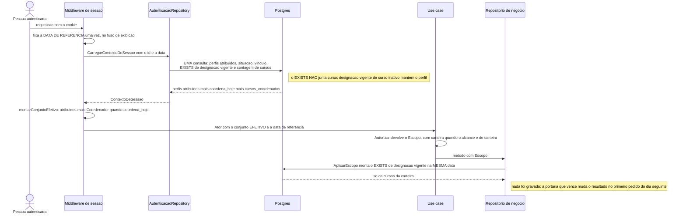
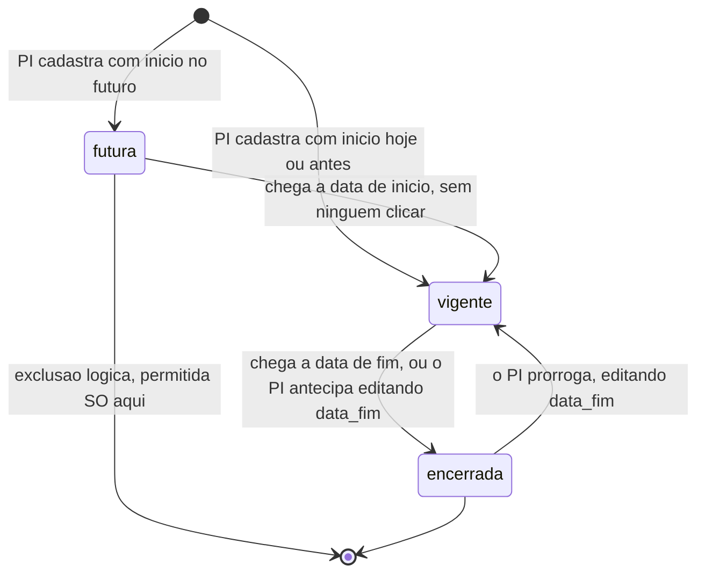

# Design: cursos

**Data:** 28/09/2026 · **Status:** proposto — aguarda aprovação do dono
**Entradas:** `spec.md` · `ux.md` · `specs/_fundacao-metas.md` ·
`specs/autenticacao-usuarios/design.md` (rev. 6) · `specs/00-visao-produto.md` ·
`project.config.md` · `CLAUDE.md`

> **Lê-se depois de `specs/_fundacao-metas.md`**, onde está a decisão completa
> sobre o **perfil derivado** (§4), a **carteira de cursos** dentro do `Escopo`
> (§3.4), a **`DataLocal`** e a data de referência (§5), as permissões e os
> alcances (§6). Este documento desenha a **entidade Designação**, as garantias
> de banco que ela exige, e a transição.

---

## 1. Sumário das decisões

| # | Decisão | Motivo curto |
|---|---|---|
| C-01 | **Sobreposição de vigência impedida por `EXCLUDE USING gist`**, com `btree_gist` | Duas telas salvando ao mesmo tempo passam por qualquer verificação anterior ao `INSERT` |
| C-02 | **Intervalo inclusivo dos dois lados (`'[]'`) e `data_fim` nula vira `infinity`** | `DG-06`: o dia da data de fim entra inteiro |
| C-03 | **A situação da designação é derivada em exatamente um lugar por propósito**: `SituacaoEm` para o rótulo, `FragmentoDesignacaoVigente` para o predicado, presos por teste | Resposta explícita à pergunta "qual é o lugar único" — §4.3 |
| C-04 | **`data_fim` é coluna armazenada e nunca derivada.** O que é derivado é a **situação** | §4.3 |
| C-05 | **Designação é imutável em coordenador e data de início a partir de `vigente`; enquanto `futura`, é corrigível** | Decisão 5 do dono, com a fronteira exata em §5.3 |
| C-06 | **`autodesignacao` é computado no ato e gravado**, nunca recalculado | Descreve o instante, como a marca de avaliação (`AV-17`) |
| C-07 | **O `EXISTS` do perfil derivado não toca em `curso`** | PC-7/`CP-06`: designação vigente de curso inativo mantém o perfil. É a armadilha da implementação intuitiva |
| C-08 | **`outras_designacoes_vigentes` substitui os dois campos que o UX propôs** | Um campo por fato; a tela deriva "é a última" disso |
| C-09 | **A normalização de `coordenador_curso` e o `CHECK` estreitado vão na mesma migration, nesta ordem** | Fundação §4.3 |
| C-10 | **Não existe `AVALIACAO_DO_PROPRIO_CURSO` em lugar nenhum do código** | A proibição foi considerada e recusada; resíduo dela é achado |

---

## 2. Diagramas

### 2.1 Como o perfil de Coordenador é decidido, e onde nada é gravado



### 2.2 Situação da designação, e o que cada transição permite



**Só `vigente` concede o perfil e permite entregas no curso.** E **só `futura`
aceita correção de coordenador ou de data de início** (§5.3) e exclusão —
porque é o único estado que ainda não produziu privilégio nenhum.

---

## 3. Domínio

### 3.1 Value Objects

| VO | Regras |
|---|---|
| **`GrauDeCurso`** | `bacharelado` \| `licenciatura` \| `tecnologo` → 400 `VALOR_INVALIDO` |
| **`ModalidadeDeCurso`** | `presencial` \| `a_distancia` → 400 `VALOR_INVALIDO` |
| **`SituacaoCurso`** | `ativo` \| `inativo` |
| **`Portaria`** | Texto livre não vazio, ≤ 100. **Sem formato e sem unicidade** (PC-6) — a tela não pode recusar o que o papel permite |
| **`Vigencia`** | Par `{inicio DataLocal, fim *DataLocal}`. Construtor recusa `fim < inicio` → 400 `DESIGNACAO_DATAS_INVALIDAS`. **É aqui que a regra do dia inteiro mora** |

`Vigencia` é o Value Object que carrega `DG-06`:

```go
func (v Vigencia) SituacaoEm(hoje valueobject.DataLocal) SituacaoDesignacao {
    if hoje.AntesDe(v.inicio)                      { return Futura }
    if v.fim == nil || !v.fim.AntesDe(hoje)        { return Vigente }  // fim >= hoje
    return Encerrada
}
```

`!fim.AntesDe(hoje)` e não `fim.DepoisDe(hoje)`: o dia da data de fim entra
**inteiro**. Escrito assim, a comparação errada não cabe — não há um `>` para
alguém trocar por `>=`.

`Periodo` (em `plano-acao`) reusa `Vigencia`. Registrado aqui porque é
onde ela nasce.

### 3.2 Entidades

```go
type Curso struct {
    ID, InstituicaoID uuid.UUID
    Nome              valueobject.NomeCatalogo
    CodigoEMec        *valueobject.CodigoEMec   // reusado de autenticacao-usuarios
    Grau              valueobject.GrauDeCurso
    Modalidade        valueobject.ModalidadeDeCurso
    Situacao          valueobject.SituacaoCurso
    // campos base
}

type Designacao struct {
    ID, CursoID, InstituicaoID, CoordenadorID uuid.UUID
    Portaria        valueobject.Portaria
    Vigencia        valueobject.Vigencia
    Autodesignacao  bool
    // campos base
}
```

**`Curso` não tem coluna de coordenador** (3.1 da spec). Quem responde hoje é
o titular da designação vigente, e o "Coordenador" do grid é resultado de
consulta. Coluna `coordenador_id` em `curso` é achado de revisão.

**`CodigoEMec` é reusado, não recriado.** Já existe como Value Object em
`autenticacao-usuarios` (instituição). O degrau 2 da escada — "já existe neste
codebase? reutilizar" — vale mesmo quando a semântica é vizinha: o código e-MEC
de curso tem o mesmo formato do de instituição, e duas cópias divergiriam na
primeira correção.

---

## 4. Banco de dados

### 4.1 Tabelas

```sql
CREATE TABLE curso (
    id             UUID        PRIMARY KEY,
    instituicao_id UUID        NOT NULL REFERENCES instituicao (id),
    nome           TEXT        NOT NULL,
    codigo_emec    TEXT,
    grau           TEXT        NOT NULL,
    modalidade     TEXT        NOT NULL,
    situacao       TEXT        NOT NULL DEFAULT 'ativo',
    criado_em      TIMESTAMPTZ NOT NULL DEFAULT now(),
    atualizado_em  TIMESTAMPTZ,
    excluido_em    TIMESTAMPTZ,
    versao         INT         NOT NULL DEFAULT 1,
    CONSTRAINT ck_curso_grau       CHECK (grau IN ('bacharelado','licenciatura','tecnologo')),
    CONSTRAINT ck_curso_modalidade CHECK (modalidade IN ('presencial','a_distancia')),
    CONSTRAINT ck_curso_situacao   CHECK (situacao IN ('ativo','inativo')),
    CONSTRAINT ck_curso_nome       CHECK (btrim(nome) <> '' AND length(nome) <= 300)
);

-- F-05: a chave que as entidades abaixo referenciam em FK composta
CREATE UNIQUE INDEX uq_curso_id_instituicao ON curso (id, instituicao_id);

CREATE UNIQUE INDEX uq_curso_instituicao_nome
    ON curso (instituicao_id, lower(btrim(nome))) WHERE excluido_em IS NULL;
CREATE UNIQUE INDEX uq_curso_instituicao_emec
    ON curso (instituicao_id, codigo_emec)
 WHERE excluido_em IS NULL AND codigo_emec IS NOT NULL;
CREATE INDEX idx_curso_listagem
    ON curso (instituicao_id, nome COLLATE "pt-BR-x-icu") WHERE excluido_em IS NULL;
```

`CU-02` exige que o conflito de nome aconteça **mesmo com o existente
inativo** — por isso o índice filtra só `excluido_em IS NULL`, nunca
`situacao`. E `CU-03` exige que "sem código" seja permitido quantas vezes for
preciso: `WHERE codigo_emec IS NOT NULL` é o que entrega isso, e é mais direto
que `NULLS DISTINCT` implícito porque diz a intenção.

```sql
CREATE EXTENSION IF NOT EXISTS btree_gist;

CREATE TABLE designacao (
    id              UUID        PRIMARY KEY,
    curso_id        UUID        NOT NULL,
    instituicao_id  UUID        NOT NULL,
    coordenador_id  UUID        NOT NULL REFERENCES usuario (id),
    portaria        TEXT        NOT NULL,
    data_inicio     DATE        NOT NULL,
    data_fim        DATE,
    autodesignacao  BOOLEAN     NOT NULL DEFAULT false,
    criado_em       TIMESTAMPTZ NOT NULL DEFAULT now(),
    atualizado_em   TIMESTAMPTZ,
    excluido_em     TIMESTAMPTZ,
    versao          INT         NOT NULL DEFAULT 1,

    CONSTRAINT ck_designacao_datas    CHECK (data_fim IS NULL OR data_fim >= data_inicio),
    CONSTRAINT ck_designacao_portaria CHECK (btrim(portaria) <> '' AND length(portaria) <= 100),
    CONSTRAINT fk_designacao_curso
        FOREIGN KEY (curso_id, instituicao_id) REFERENCES curso (id, instituicao_id),

    -- DG-03: garantia de banco, não de aplicação
    CONSTRAINT ex_designacao_sem_sobreposicao EXCLUDE USING gist (
        curso_id WITH =,
        daterange(data_inicio, COALESCE(data_fim, 'infinity'::date), '[]') WITH &&
    ) WHERE (excluido_em IS NULL)
);

CREATE UNIQUE INDEX uq_designacao_id_curso ON designacao (id, curso_id);

-- sustenta a derivação do perfil, em TODA requisição autenticada
CREATE INDEX idx_designacao_coordenador
    ON designacao (coordenador_id, data_inicio, data_fim) WHERE excluido_em IS NULL;
CREATE INDEX idx_designacao_curso
    ON designacao (curso_id, data_inicio DESC) WHERE excluido_em IS NULL;
```

**Três detalhes do `EXCLUDE` que carregam a correção inteira:**

1. **`'[]'` — intervalo fechado dos dois lados.** Com `'[)'` (o padrão de
   `daterange`), uma designação terminando em 31/07 e outra começando em 31/07
   **não** se sobreporiam, e o curso teria dois responsáveis no dia 31. É
   exatamente `DG-06` visto pelo outro lado.
2. **`COALESCE(data_fim, 'infinity')`** — prazo indeterminado (`DG-05`) tem de
   colidir com qualquer coisa depois do início, e `NULL` em `daterange` é
   "ilimitado", o que também funcionaria; `infinity` explícito é mais legível e
   não depende de conhecer o comportamento de `NULL` no tipo.
3. **`WHERE (excluido_em IS NULL)`** — designação excluída logicamente não
   ocupa o intervalo. Sem isso, excluir uma designação futura e cadastrar outra
   no mesmo intervalo (fluxo normal de correção) seria recusado.

**`btree_gist` é pré-requisito** — sem a extensão, `curso_id WITH =` sobre
`uuid` não é indexável por GiST e o `CREATE TABLE` falha. Atenção do `dba`: a
extensão entra na mesma migration, antes da tabela.

### 4.2 A consulta de sessão, alterada

Conforme a fundação §4.1. **A armadilha, repetida aqui porque é onde o código
é escrito:** o `EXISTS` **não junta `curso`** e **não filtra `situacao`**.
`CP-06` é o teste que falha quando alguém "conserta" isso.

### 4.3 `data_fim` — o exame à parte que o dono pediu

**`data_fim` não é derivada.** É coluna armazenada, opcional, preenchida pelo
PI (PC-5). O que é derivado é a **situação** da designação — e o campo que
aparece na linha do grid de cursos (`coordenador.data_fim`, para escrever "até
31/07/2026") é **projeção** da coluna de outra entidade, não derivação.

A pergunta legítima por trás do pedido é: *onde a regra de vigência mora?* A
resposta, em três linhas e um teste:

| Propósito | Lugar único | Consumidores |
|---|---|---|
| **Rótulo** (`futura` / `vigente` / `encerrada`) | `valueobject.Vigencia.SituacaoEm(hoje)` | serialização do grid de designações, texto dos modais, regra de edição (§5.3) |
| **Predicado SQL** | `postgres.FragmentoDesignacaoVigente(alias, n)` | `AplicarEscopo` (carteira), `EXISTS` da sessão, coordenador derivado do grid de cursos, marca do relatório em `metas-coordenacao` |

**`TestVigencia_RotuloEPredicadoConcordam`** exercita os dois contra o mesmo
dado, nas três fronteiras de `DG-06`: 31/07/2026 às 23h58 (-03:00) → vigente
nos dois; 01/08/2026 às 00h02 (-03:00) → encerrada nos dois; `data_fim` nula →
vigente nos dois. **Com o container em UTC** (fundação §5.3) — é o que faz o
teste ter valor.

**Proibições que decorrem disto:** nenhuma coluna `coordenador_ate` em `curso`;
nenhum `WHERE data_fim >= CURRENT_DATE` escrito à mão em adapter nenhum
(`CURRENT_DATE` é a data do servidor, em UTC — é o defeito); nenhuma derivação
de situação no cliente.

### 4.4 O que o `dba` valida

| # | Propriedade | O que reprova |
|---|---|---|
| V-1 | `btree_gist` existe e o `EXCLUDE` é aceito | erro na migration |
| V-2 | O banco recusa duas designações que **se tocam em um único dia** no mesmo curso, inclusive em transações concorrentes | qualquer um dos dois `INSERT` ser aceito |
| V-3 | O banco **aceita** o mesmo coordenador em dois cursos no mesmo intervalo | recusa (a restrição é por curso, nunca por pessoa) |
| V-4 | O banco aceita designação nova no intervalo de uma excluída logicamente | recusa |
| V-5 | **A consulta de sessão não faz varredura sequencial em `designacao`**, e a consulta inteira fica em p95 < 20 ms com o seed | `Seq Scan` em `designacao` |
| V-6 | O coordenador derivado do grid de cursos é **uma** consulta, não uma por linha | mais de uma ida ao banco por página |
| V-7 | Depois da migration de normalização, `usuario_perfil` não aceita `coordenador_curso` | `INSERT` aceito |
| V-8 | Seed idempotente e compatível com o `EXCLUDE` | reexecução falhar |

---

## 5. Use cases e regras

```
command/ curso/      criar · atualizar · alterar_situacao · excluir
         designacao/ criar · atualizar · excluir
query/   curso/      listar · buscar · listar_meus_cursos
         designacao/ listar_do_curso · buscar · listar_candidatos
```

### 5.1 Candidatos à designação

Duas exclusões, **e as duas são estruturais** (3.9 da spec): o Administrador do
Sistema não pertence a instituição nenhuma; quem só tem o perfil de Aluno não
tem vínculo docente. Tudo o mais entra — **inclusive quem tem o perfil de PI**,
inclusive quem já tem designação, inclusive quem é Professor **e** Aluno.

```sql
-- candidatos: quem possui ALGUM perfil além de aluno, na instituição da sessão
WHERE <AplicarEscopo(esc, AlvoUsuario)>
  AND EXISTS (SELECT 1 FROM usuario_perfil up
               WHERE up.usuario_id = usuario.id AND up.perfil <> 'aluno')
```

**"Possui algum perfil além de aluno"**, e não "possui professor ou PI": o
conjunto pode crescer, e enumerar os perfis aceitos obrigaria a lembrar desta
consulta a cada perfil novo. E o Administrador do Sistema já está fora pelo
filtro de instituição — não precisa de cláusula própria, porque ele não tem
vínculo. **A exclusão dele é consequência do isolamento, não uma regra extra**,
e isso é melhor do que uma regra extra.

O `POST` valida o mesmo: identificador que não passa → 400
`COORDENADOR_INVALIDO`; de outra instituição → **404**, nunca 403 nem 400
(`CP-07`).

### 5.2 Autodesignação

`autodesignacao = (in.Ator.UsuarioID() == in.CoordenadorID)`, calculado no use
case de criação e **gravado na linha**. Nunca recalculado na leitura — pela
mesma razão da marca de avaliação (`AV-17`): descreve o que era verdade no
instante do ato. Recalcular daria a resposta de hoje para uma pergunta sobre
ontem.

**Não bloqueia nada.** É permitido, é o caminho legítimo de uma instituição
pequena, e fica registrado com a portaria que o sustenta.

**A invariante "ninguém altera o próprio perfil"** de `autenticacao-usuarios`
continua valendo e **não é violada**, porque o perfil de Coordenador não é
atribuído — é derivado. O que a pessoa faz é registrar um ato administrativo
com portaria, auditado e datado. Registro isto aqui porque é a primeira coisa
que um revisor de segurança vai questionar.

### 5.3 O que é editável em cada situação (C-05)

Decisão 5 do dono: *designação é imutável em coordenador e data de início,
porque alterá-las mudaria retroativamente quem tinha privilégio quando*. O UX
propôs travar "quando não está mais futura". **Os dois concordam, e a fronteira
exata é esta:**

| Situação | `coordenador_id` | `data_inicio` | `data_fim` | `portaria` |
|---|---|---|---|---|
| `futura` | editável | editável | editável | editável |
| `vigente` | **409 `DESIGNACAO_COM_EFEITO`** | **409** | editável | editável |
| `encerrada` | **409** | **409** | editável (prorrogar) | editável |

**Por que `futura` é editável:** o motivo da imutabilidade é que a alteração
mudaria retroativamente quem tinha privilégio. Uma designação futura **não
concedeu privilégio nenhum ainda** — não há passado para reescrever. E a spec
já permite **excluí-la inteira** (`DG-08`); permitir corrigir um dígito da
portaria e proibir corrigir o coordenador obrigaria o PI a excluir e recriar
para consertar um erro de digitação, o que produz o mesmo resultado com mais
passos e um registro de auditoria a menos.

**409, não 400**, e esta é a escolha que merece o motivo: não é o formato do
campo que está errado — é o **estado do recurso** que recusa a operação.
É a mesma família de `DESIGNACAO_COM_EFEITO` que já cobre a exclusão, e reusar
o código existente diz ao cliente a mesma coisa: *esta designação já produziu
efeito*.

> **Reconciliação 2 do dono aplicada:** a interface desabilita os campos, **e o
> backend recusa**. Trava só visual é sugestão, não regra.

### 5.4 Curso: situação e exclusão

| Operação | Regra |
|---|---|
| Inativar / reativar | Não toca em designação, plano, entrega nem perfil. A confirmação **sugere** encerrar a portaria, sem fazê-lo (`CU-06`) |
| Excluir | Só sem **nenhum** plano, entrega ou designação → 409 `CURSO_COM_VINCULO` |

O bloqueio de exclusão é verificado **dentro da transação**, com `EXISTS` sobre
as três tabelas. Não há FK que o dê de graça, porque a deleção é lógica — a FK
não dispara. Registro a limitação: entre a verificação e o `UPDATE` alguém pode
criar uma designação ou um plano. A janela é fechada por `SELECT ... FOR
UPDATE` na linha do curso antes da verificação. Mesma técnica de §5.8 do
design de autenticação (invariante de último detentor), aplicada a um
agregado menor.

**Achado de revisão (T-171):** o lado da designação só fecha de verdade se
`CriarDesignacaoUseCase` também travar a mesma linha do curso antes de
inserir — a princípio pareceu que a FK `designacao.curso_id → curso.id`
bastava (Postgres trava a linha-pai referenciada, `FOR KEY SHARE`, ao
inserir uma linha-filha), mas essa trava só garante que a linha do curso
**existe**, nunca que `excluido_em` continua nulo: exclusão lógica é um
`UPDATE`, nunca dispara a FK. Sem trava própria, uma execução concorrente
podia terminar a exclusão inteira (`FOR UPDATE` → `EXISTS` → `UPDATE` →
commit) *antes* de `CriarDesignacaoUseCase` sequer tentar inserir — a FK,
satisfeita pela linha ainda existir (só soft-deletada), deixava passar. A
correção: `CursoRepository.TravarSeAtivo` (`SELECT ... FOR SHARE ... AND
excluido_em IS NULL`), chamado por `CriarDesignacaoUseCase` antes de
montar a designação, na mesma unidade de trabalho do `Inserir`. `FOR
SHARE` (não `FOR UPDATE`): duas criações de designação concorrentes no
mesmo curso não precisam se bloquear entre si — só contra a exclusão, que
é `FOR UPDATE`; a exclusividade entre designações concorrentes já é o
papel do `EXCLUDE USING gist` (DG-03). Provado por
`TestCursoRepository_T171_ExcluirSobFORUPDATENaoDeixaDesignacaoOrfa` — a
versão sem `TravarSeAtivo` falhava de forma intermitente (~2-4% em 100
execuções), confirmando que a FK sozinha não fechava a corrida.

### 5.5 Campos computados (C-08)

Condições da decisão 3 do dono: computado na resposta, nunca persistido; **um
campo por fato**; nunca derivado no cliente quando depende de regra de domínio.

| Campo | Onde | Fato | Como |
|---|---|---|---|
| `coordenador` | linha de curso | quem responde **hoje** | `LEFT JOIN LATERAL` uma designação vigente, com `nome`, `data_fim` e `tambem_pesquisador_institucional` |
| `tem_vinculo` | linha de curso | tem designação (qualquer situação) ou plano | mesmo `EXISTS` que `Excluir` usa antes de recusar (§5.4) — repetido como coluna para o botão "Excluir" já nascer escondido no grid (ux.md), sem convidar a um 409 garantido |
| `plano_do_periodo` | linha de curso | situação do plano no período aberto | lateral (entregue por `plano-acao`; até lá, ausente) |
| `outras_designacoes_vigentes` | designação | quantas **outras** a pessoa tem vigentes | lateral `count(*)` excluindo a própria |
| `situacao` | designação | `futura` / `vigente` / `encerrada` | `Vigencia.SituacaoEm`, na serialização |

**`outras_designacoes_vigentes` substitui os dois campos que o `ux.md`
propôs** (`ultima_designacao_vigente` booleano e a contagem). É **um campo, um
fato**, e serve aos dois textos: o modal de encerrar afirma *"Ana deixa de ter
o perfil, porque esta é a última designação vigente dela"* quando é `0`, e a
tela de perfis escreve *"por designação vigente em N cursos"* a partir do
`cursos_coordenados` de `/auth/eu` (fundação §4.2).

**`tambem_pesquisador_institucional` é um `EXISTS` sobre `usuario_perfil`**,
dentro da mesma lateral. Barato e indexado. É a primeira das três camadas de
visibilidade do acúmulo (3.10) — aparece **onde o PI decide a coordenação**,
não só depois no relatório.

**Nunca persistidos.** Coluna `coordenador_id` em `curso`, `situacao` em
`designacao` ou `coordenador_ate` em qualquer lugar é achado de revisão.

---

## 6. Contrato de API

As rotas da seção 9 da spec, sem acréscimo. Precisões:

```json
// GET /api/v1/cursos — linha
{ "id": "...", "nome": "Engenharia de Software", "codigo_emec": "1122334",
  "grau": "bacharelado", "modalidade": "presencial", "situacao": "ativo",
  "coordenador": { "id": "...", "nome": "Ana Lima",
                   "data_fim": "2026-07-31",
                   "tambem_pesquisador_institucional": false },
  "versao": 1 }
// curso vago: "coordenador": null
```

```json
// GET /api/v1/cursos/{id}/designacoes — linha
{ "id": "...", "coordenador": { "id": "...", "nome": "Beatriz Andrade" },
  "portaria": "70/2026", "data_inicio": "2026-03-01", "data_fim": "2026-12-31",
  "situacao": "vigente", "autodesignacao": true,
  "outras_designacoes_vigentes": 0, "versao": 1 }
```

- **`situacao` da designação é derivada e só aparece na resposta.** Não existe
  coluna, não é aceita no corpo, não é ordenável por si (a ordenação é por
  `data_inicio`).
- **`situacao` do CURSO é aceita, opcional, em `POST /api/v1/cursos`** — ux.md
  pede o campo no formulário de criação para o caso raro de cadastrar já como
  inativo (ex: migração de curso histórico). Vazio ou `"ativo"` mantém o
  comportamento padrão; só `"inativo"` desvia. `PUT` continua sem o campo — a
  transição usa sempre o `PATCH /situacao` dedicado, nunca o `PUT`.
- **Datas são data pura** (`"2026-07-31"`), nunca instante. Tratar data pura
  como timestamp é o que faz vencimento aparecer um dia antes.
- **`GET /auth/eu` passa a devolver** `perfis_derivados` e
  `cursos_coordenados` — mudança **aditiva**, sem versionar a API (fundação
  §10). A alteração é implementada em `autenticacao-usuarios`, conforme DC-4, e
  **esta entrega a inclui**.
- **`coordenador_curso` deixa de ser aceito** em `POST`/`PUT /usuarios` → 403
  `PERFIL_NAO_ATRIBUIVEL`, o código que já existe.

**Ordenação** — cursos: `nome`, `codigo_emec`, `grau`, `modalidade`,
`coordenador`, `criado_em` (padrão `nome asc`); designações: `data_inicio`,
`data_fim`, `coordenador`, `portaria` (padrão `data_inicio desc`).
**A instituição nunca é parâmetro.**

**Ordenar por `coordenador`** ordena pelo nome vindo da lateral — e exige que a
lateral participe do `ORDER BY`, o que o `dba` verifica em V-6 (uma consulta,
sem varredura sequencial).

---

## 7. Transição: a migration que mexe no privilégio de todo mundo

Roda **uma vez**, em produção, e altera acesso de pessoas reais. É por isso que
`CP-15` está no obrigatório de testes.

```
000003_cursos.up.sql
  1. CREATE EXTENSION IF NOT EXISTS btree_gist
  2. CREATE TABLE curso, designacao + índices + EXCLUDE
  3. (o seed cria as designações — fora da migration, no seed de desenvolvimento)
  4. INSERT INTO auditoria (...)   uma linha por usuário que tem
     'coordenador_curso', acao='normalizar_perfil_coordenador',
     detalhes={"motivo":"perfil de coordenador passou a ser derivado de designação"}
  5. DELETE FROM usuario_perfil WHERE perfil = 'coordenador_curso'
  6. ALTER TABLE usuario_perfil DROP CONSTRAINT ck_usuario_perfil_valor,
     ADD CONSTRAINT ck_usuario_perfil_valor CHECK (perfil IN
       ('administrador_sistema','pesquisador_institucional','professor','aluno'))
```

**A ordem 4 → 5 → 6 é parte da decisão.** Auditar antes de apagar, porque
depois do `DELETE` não há mais o que registrar; e o `CHECK` depois do `DELETE`,
porque a restrição não é aceita enquanto existirem linhas que a violam.

**O `down` recria o `CHECK` largo e a tabela**, mas **não restaura as linhas
apagadas** — e isso precisa estar dito, não descoberto: `down` de migration com
`DELETE` não é reversível na prática. Pela regra de compatibilidade para trás
do `CLAUDE.md`, a aplicação anterior continuaria funcionando com o schema novo
(ela só leria menos perfis), então **reverter a imagem não exige reverter o
banco** — que é a propriedade que importa num incidente.

**Em produção não há base ainda** (`DI-7` de `indicadores`, `CP-15`): a
migration roda sobre zero linhas e o efeito é só o `CHECK`. O teste a exercita
com linhas presentes, que é o caso que importa.

---

## 8. Auditoria

Conforme a seção 10 da spec. Os três pontos que carregam decisão:

- **Não existe evento de concessão nem de retirada de perfil.** O que se audita
  é **a designação** — o fato real, com portaria e data —, e dela se reconstrói
  quem tinha o perfil em qualquer data. Um evento de concessão seria uma
  segunda descrição do mesmo fato, que é a definição de dual write aplicada a
  auditoria.
- **`autodesignacao` vai no registro de criação.** Não bloqueia nada; existe
  para que a informação esteja no registro em vez de ser deduzida depois.
- **Alteração registra quais campos mudaram, não os valores — com exceção de
  `coordenador_id` e das datas de vigência**, que registram antes e depois,
  porque é deles que se reconstrói quem respondia quando.

**Métricas Prometheus:** gauge de **cursos sem designação vigente por
instituição** — a pendência de 3.3 virando alerta, e que **cresce sozinha
quando uma portaria vence**, sem ninguém clicar; contador de **designações com
autodesignação**, que deixa o `security-reviewer` acompanhar a frequência do
acúmulo sem ler dado de ninguém.

---

## 9. Frontend

Implementa `ux.md` como está. Três precisões:

1. **Cursos fica em Administração** (fundação §8) — inalterado em relação ao
   `ux.md` e à visão.
2. **`ComboboxEntidade` com `badge` já vem de `indicadores`** — uma única
   implementação, reutilizada aqui para o seletor de candidato. Não
   reimplementar.
3. **O aviso de mudança de perfil (3.9) não precisa de mecanismo novo.** A
   comparação do conjunto de `/auth/eu` com o renderizado já existe; o que esta
   entrega acrescenta é o **texto** das duas mensagens e a leitura de
   `perfis_derivados` para escolher entre elas. `role="status"` no ganho,
   `role="alert"` na perda com redirecionamento — nunca tela em branco, nunca
   403 seco.

---

## 10. Testes

### 10.1 Escritos agora

A família `CP` inteira entra no obrigatório: é **alteração de privilégio**, e
agora também **dependente do tempo**.

| Bloco | Cenários | Natureza |
|---|---|---|
| **Perfil derivado** | `CP-01` a `CP-04`, `CP-14` | segurança — o perfil não existe no banco |
| **Derivação no tempo** | `CP-05`, `DG-02`, `DG-06` | segurança + corrida com o relógio; **falham com o servidor em UTC se a regra estiver errada** |
| **`SituacaoEm` e o fragmento SQL concordam** | `DG-06` | mecanismo — permanente |
| **Designação vigente de curso inativo mantém o perfil** | `CP-06` | segurança — é a armadilha de C-07 |
| **Acúmulo visível** | `CP-08`, `CP-09`, `CP-11`, `CP-12` | segurança — sem a marca, a decisão do dono vira risco invisível |
| **Candidatura** | `CP-07`, `CP-10` | segurança — as duas exclusões estruturais, e a confirmação de que **não há mais bloqueio** para PI |
| **Sobreposição de vigência** | `DG-03` | corrida — permanente, escritas concorrentes reais |
| **Imutabilidade do histórico** | `DG-08` | integridade |
| **Imutabilidade de coordenador e data de início** | §5.3, os três estados | segurança — decisão 5 do dono |
| **Transição** | `CP-15` | integridade — roda uma vez e mexe em privilégio de todo mundo |
| **Isolamento e visibilidade** | `CU-11`, `DG-10`, `CV-01`, `CV-02`, `CV-04`, `CV-05`, `CV-07` | segurança — a designação **é** o recorte de acesso |
| **Inativação não destrói** | `CU-06`, `CU-07` | integridade |
| **Unicidade** | `CU-02`, `CU-03` | integridade, banco real |
| **Concorrência** | `CU-08`, `DG-11` | corrida — permanente |
| **Smoke** | cada rota: 401, 403, 404 | — |

**Unitários com o relógio injetado** para a derivação e para a marcação —
sem isso `CP-05` e `DG-06` são intestáveis. **Integração obrigatória** para
`DG-03`, isolamento, unicidade e concorrência: os quatro só existem no banco.

### 10.2 Adiados

`specs/cursos/testes-pendentes.md`: `CU-01`, `DG-01`, `DG-04`, `DG-05`
(caminho feliz); `CU-04`, `CU-09`, `CU-10`, `CU-12` (filtros, ordenação,
estado de tela); `CU-05`, `DG-07`, `DG-09`; `CV-03`, `CV-06`; microcópia.

**Encabeça a prioridade:** `CP-13` — o aviso que explica que a pessoa deixou de
coordenar. Com a portaria vencendo sozinha, a ausência desse texto produz
alguém que perdeu acesso **sem nenhuma ação que explique**.

### 10.3 E2E recomendado

**Fluxo crítico: a portaria que vence, e o acúmulo de papéis.** O E2E não
consegue mover o relógio do servidor — então **move o dado**, que é o mesmo
resultado observável:

```
e2e/designacao-e-perfil.spec.ts
  1. Coordenador com designação vigente entra e vê o grupo Metas no menu
  2. PI encerra a designação alterando data_fim para ontem
  3. O coordenador navega; a aplicação avisa que a designação encerrou,
     com a portaria e a data, e o grupo Metas some — sem novo login
  4. O curso aparece "Vago" no grid do PI, com o motivo em texto
  5. PI designa alguém que também é PI; a confirmação avisa sobre a marca,
     e a designação fica registrada como autodesignação quando for o caso
```

O passo 3 é o que prova que o perfil derivado e o aviso funcionam juntos, e é
exatamente o que nenhum teste de unidade alcança.

### 10.4 Critério de aceitação

`A ∪ B = C`, `A ∩ B = ∅`, todo cenário de 10.1 em `A`. Verificação mecânica
pelo `qa-tester`.

---

## 11. Alternativas rejeitadas

| Alternativa | Por quê |
|---|---|
| **Coluna `coordenador_id` em `curso`** | Perderia o histórico, e o histórico é escopo: o relatório responde quem respondia pelo curso em cada data |
| **Verificação de sobreposição na aplicação** | Duas telas salvando ao mesmo tempo passam por qualquer verificação anterior ao `INSERT`. Só o `EXCLUDE` garante |
| **`daterange` com `'[)'`** | Dois responsáveis no dia da virada. É `DG-06` pelo outro lado |
| **Botão "revogar" designação** | Encerrar é editar `data_fim`; um segundo caminho para o mesmo efeito produz dois registros de auditoria com formatos diferentes |
| **Permitir excluir designação vigente ou encerrada** | Apagar designação com efeito destrói a resposta a "quem respondia em março" |
| **Proibir o acúmulo de PI e Coordenador** | **Considerada e recusada pelo dono.** Quebraria a instituição pequena, que contornaria com conta de fachada — o que esconde o acúmulo em vez de revelá-lo |
| **Recalcular `autodesignacao` na leitura** | Daria a resposta de hoje para uma pergunta sobre ontem |
| **Enumerar perfis aceitos na consulta de candidatos** | Obrigaria a lembrar desta consulta a cada perfil novo. "Algum perfil além de aluno" não tem essa dívida |
| **Dois campos para "é a última designação"** (booleano + contagem) | Mesmo fato, dois campos. `outras_designacoes_vigentes` serve aos dois textos |
| **`CURRENT_DATE` no SQL de vigência** | É a data do servidor, em UTC. É o defeito, não a solução |

---

## 12. Divergências registradas

1. **Imutabilidade da designação.** A decisão 5 do dono diz "imutável em
   coordenador e data de início"; o `ux.md` diz "quando não está mais futura".
   Reconcilio em §5.3 — imutável **a partir de `vigente`** —, com o argumento
   de que designação futura não concedeu privilégio e a spec já permite
   excluí-la inteira. Se o dono quiser imutabilidade absoluta desde a criação,
   a mudança é de uma linha no use case e o cenário `DG-08` cobre o resto.
2. **`ux.md` propôs `ultima_designacao_vigente` e uma contagem.** Entrego
   **um** campo (`outras_designacoes_vigentes`), por "um campo por fato". O
   texto afirmativo do modal continua possível.
3. **A spec não fixa sensibilidade a caixa na unicidade de nome de curso.**
   Decido `lower(btrim())`, coerente com `meta` em `indicadores`.
4. **`plano_do_periodo` na linha de curso** depende de `plano-acao` e
   **só existe depois dela**. Até lá o campo **não aparece na resposta** — não
   aparece como `null`, porque `null` significaria "não há plano". `CU-12` fica
   adiado até a feature seguinte, e isso está registrado em
   `testes-pendentes.md`.
