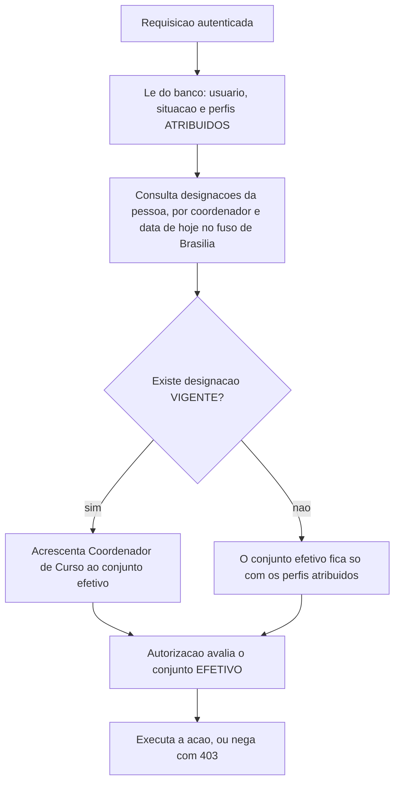
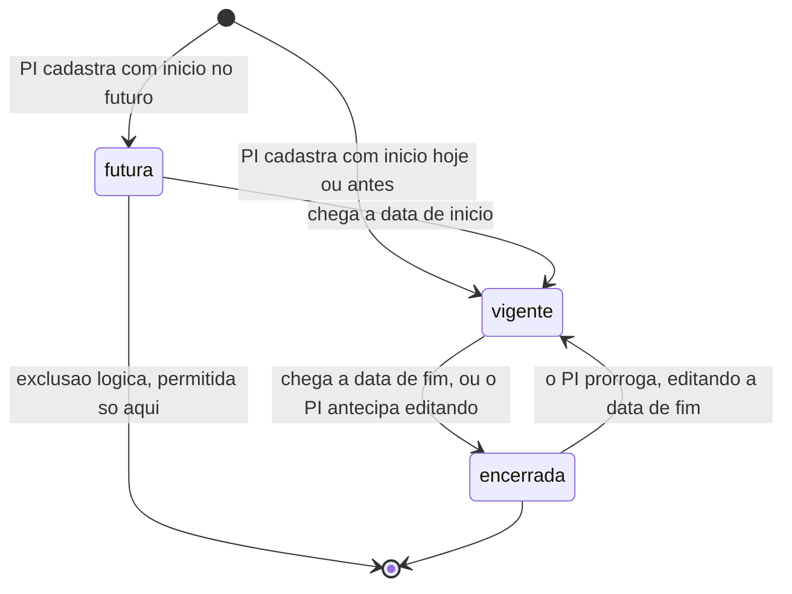
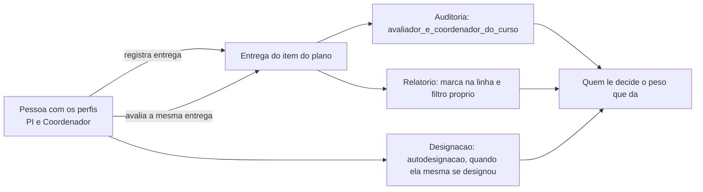

# Spec: cursos

**Data desta versão:** 28/09/2026 · **6ª versão — o acúmulo PI + Coordenador é permitido e visível**
**Status:** em validação pelo dono do produto
**Contexto:** `specs/00-visao-produto.md` · `specs/autenticacao-usuarios/spec.md` ·
`specs/plano-acao/spec.md` · Stack: `project.config.md`
**Nível de rigor:** completo. Deixou de ser CRUD simples quando o **perfil de
Coordenador de Curso passou a ser derivado de uma designação com vigência** (3.9):
é alteração de privilégio, e depende da passagem do tempo.

> Cobre a entidade **Curso**, a entidade **Designação de coordenação** (portaria,
> vigência) e o **perfil de Coordenador de Curso derivado dela**.
>
> **Não repete o contexto de `autenticacao-usuarios`** — conjunto de perfis do
> usuário, tela de Usuários, matriz de quem atribui qual perfil, isolamento por
> instituição, 404 para recurso de outra instituição, ordem permissão→isolamento,
> padrão de CRUD, campos base, concorrência otimista, deleção lógica e formato de
> erro são **de lá**. Esta spec **referencia**, nunca redefine.
>
> **O que se cobra do curso está em `specs/plano-acao/`; a execução, em
> `specs/metas-coordenacao/`.**

---

## 0. O que mudou nesta versão

**A proibição de o Pesquisador Institucional (PI) coordenar curso foi rejeitada
pelo dono** e substituída por **visibilidade** (3.10).

| Antes | Agora |
|---|---|
| Quem tem o perfil de PI não era candidato a designação | **É candidato.** Qualquer combinação de perfis é permitida |
| Não se acrescentava o perfil de PI a quem tinha designação | **Regra removida.** A tela de Usuários não tem mais esse bloqueio |
| O PI não avaliava entrega de curso que coordena (403) | **Avalia.** E o sistema **marca** que avaliador e coordenador são a mesma pessoa, na auditoria e no relatório |
| "Ninguém se autodesigna" | **Autodesignação é permitida e fica marcada** (3.10) |

O caso que decidiu: **instituição pequena, sem gente suficiente para separar os
papéis.** Proibir faria o sistema não servir a quem mais precisa dele.

---

## 1. Por que esta entidade existe

O dono definiu que **a cobrança é do curso, não da pessoa**:

> "Uma meta pode ser estabelecida para vários cursos e o curso pode ter várias
> metas. Acho melhor trabalhar com as metas associadas ao curso e aí o coordenador
> trabalha as metas dos cursos que ele está associado, já que um coordenador pode
> coordenar vários cursos e o curso pode ser coordenado por um único coordenador."

O Curso é **pré-requisito de `plano-acao`**, e o ganho é que **o plano
sobrevive à troca de coordenador**. Depois, duas respostas mudaram o vínculo:

1. **"Um usuário associado a um curso como coordenador recebe automaticamente o
   perfil de coordenador; quando retirado do curso, se ficar sem nenhum curso, o
   perfil é retirado."**
2. **A coordenação é formalizada por portaria, com número, início e fim** — o
   vínculo virou **designação com vigência**, e o perfil passou a depender **da
   passagem do tempo**. Resolvido em 3.9: **o perfil é derivado, não armazenado.**

---

## 2. Premissas declaradas

Recomendação do analista, **não decisão tomada**.

| # | Premissa | Se for rejeitada |
|---|---|---|
| **PC-1** | **Campos do curso:** nome, código e-MEC (opcional), grau, modalidade e situação, mais os campos base. **O coordenador não é campo do curso** — é derivado das designações (3.2) | Acrescentar ou retirar campo; a minimização (8) reprovou os demais |
| **PC-2** | **Grau:** `bacharelado`, `licenciatura`, `tecnologo`. **Modalidade:** `presencial`, `a_distancia` | Acrescentar valores. Lista fechada em `TEXT` com restrição, extensível por migração |
| **PC-3** | **Nome único por instituição** entre cursos não excluídos, ativos ou inativos, **comparado por forma normalizada** (sem diferenciar maiúsculas nem espaços nas pontas: `"Engenharia Civil"`, `"engenharia civil"` e `" Engenharia Civil "` são o mesmo nome). **A unicidade é garantida por índice do banco sobre a forma normalizada** — verificação só na aplicação não sobrevive a duas telas salvando ao mesmo tempo. | Permitir homônimos, e a tela precisa de outro jeito de distingui-los |
| **PC-4** | **Código e-MEC do curso é único por instituição**, quando informado | Se for único entre todas as instituições, a unicidade sobe de escopo e muda o índice |
| **PC-5** | **Campos da designação:** curso, coordenador, identificação da portaria (texto livre), início e fim — **a de fim é opcional** (3.2) | Data de fim obrigatória, e toda designação passa a exigir uma data que nem sempre existe no ato |
| **PC-6** | **Número da portaria não é único** e não tem formato validado | Entram unicidade e formato, e a tela passa a recusar o que o papel permite |
| **PC-7** | **Designação vigente de curso inativo conta para o perfil derivado** (3.5, 3.9) | O perfil oscila a cada inativar/reativar, e um ciclo normal de gestão vira uma sequência de mudanças de privilégio |
| **PC-8** | **O coordenador atual corrige entregas recusadas do antecessor, mas só exclui as que ele mesmo enviou** (3.4) | Ou não corrige nada do antecessor — e a recusa herdada fica sem saída —, ou exclui tudo, e apaga trabalho alheio |
| **PC-9** | **Curso inativo sai da cobrança a partir da inativação**, com filtro no relatório para trazê-lo de volta (3.5) | Curso inativo continua sendo cobrado, e o PI vê pendência de curso que não existe mais |
| **PC-10** | **Volume:** poucas instituições, **algumas centenas de cursos** por instalação, a maioria dos coordenadores com 1 a 3 cursos e ~2 designações por curso a cada dois anos | Rever índices, paginação do autocomplete e o dimensionamento em 11 |

---

## 3. Decisões de comportamento

### 3.1 O que é o Curso, e a quem pertence

Curso é **entidade de negócio da instituição**: carrega o identificador dela, passa
pelo filtro centralizado no adapter e responde **404** a quem é de outra
instituição.

| Campo | Regra |
|---|---|
| `nome` | obrigatório, único por instituição (PC-3) |
| `codigo_emec` | opcional, único por instituição quando informado (PC-4) |
| `grau` | obrigatório (PC-2) |
| `modalidade` | obrigatória (PC-2) |
| `situacao` | **ativo / inativo**, como a instituição (3.5) |
| campos base | `id` UUIDv7 gerado no domínio, `criado_em`, `atualizado_em`, `excluido_em`, `versao` |

**Não há coluna de coordenador no curso.** Quem responde hoje é o titular da
**designação vigente** (3.2); o "Coordenador" do grid é resultado de consulta.

**Quem administra: só o PI**, na própria instituição. Quem tem apenas Professor,
Coordenador ou Aluno não cria, não edita e não exclui. O **Administrador do Sistema
é negado com 403** em toda rota de curso — administra a plataforma, não o conteúdo
dela.

### 3.2 Designação de coordenação: portaria com vigência

**Decisão do dono.** A coordenação é formalizada por portaria, e o sistema guarda a
designação, não um apontamento solto.

| Campo | Regra |
|---|---|
| `curso_id` | obrigatório, da instituição da sessão |
| `coordenador_id` | obrigatório, candidato elegível conforme 3.9 |
| `portaria` | obrigatória — texto livre (PC-6) |
| `data_inicio` | obrigatória — **data pura** (`DATE`) |
| `data_fim` | **opcional** — nula significa prazo indeterminado (PC-5) |
| campos base | idem curso |

- **Um curso, um coordenador por vez.** Vigências que se tocam no mesmo curso → 409
  `DESIGNACAO_SOBREPOSTA`. Duas pessoas respondendo pelo mesmo curso na mesma data
  tornam indeterminável quem devia entregar, e o relatório passa a mentir. **A
  garantia tem de ser do banco** — restrição de exclusão sobre o intervalo —, porque
  duas telas salvando ao mesmo tempo passam por qualquer verificação anterior ao
  `INSERT`.
- **Um coordenador, vários cursos**, inclusive simultâneos. A restrição é por curso.
- **Situação derivada das datas**, no fuso `America/Sao_Paulo`:

| Situação | Condição |
|---|---|
| `futura` | hoje < `data_inicio` |
| **`vigente`** | `data_inicio` ≤ hoje ≤ `data_fim`, ou `data_fim` nula |
| `encerrada` | hoje > `data_fim` |

- **Portaria futura é registrada e não produz efeito ainda.** Assinar hoje uma
  portaria que começa no mês que vem é o caso normal; recusá-la obrigaria o PI a
  lembrar de cadastrar no dia. Aparece marcada como **Futura**, **não** concede o
  perfil e **não** torna a pessoa coordenadora.
- **O dia da data de fim entra inteiro**, no horário de Brasília: designação que
  termina em 31/07/2026 ainda é vigente às 23h58 do dia 31 e deixa de ser às 00h02
  do dia 1º. **O resultado tem de ser o mesmo com o servidor em UTC.**
- **Encerrar antes do previsto é editar `data_fim`**; não existe botão "revogar".
- **Designação é imutável a partir de vigente.** Enquanto **futura**, todos os campos são editáveis — portaria, titular e datas. A partir de **vigente**, só `data_fim` muda (bullet acima); os demais → 409 `DESIGNACAO_COM_EFEITO`. **Por que futura é editável:** ela ainda não concedeu perfil nem tornou ninguém coordenador, e a spec já permite excluí-la inteira — proibir corrigir um dígito da portaria obrigaria a excluir e recriar, que produz o mesmo resultado com mais passos e sem rastro melhor.
- **Excluir designação** é lógico e só enquanto ela for **futura** — designação que
  já produziu efeito é histórico. Vigente ou encerrada → 409
  `DESIGNACAO_COM_EFEITO`.
- **Designação pertence à instituição** do curso e passa pelo mesmo filtro.

**O histórico não é roadmap: é escopo.** O relatório responde **quem respondia pelo
curso em cada data do período** — que numa avaliação externa costuma ser exatamente
a pergunta feita.

### 3.3 Curso sem coordenador é estado legítimo, e é sinalizado

**Decisão do dono.** Curso sem designação vigente fica **vago**. Exigir coordenador
sempre faria alguém apontar um nome qualquer só para o cadastro salvar.

1. **É permitido**, inclusive no cadastro: o curso nasce sem designação nenhuma.
2. **É sinalizado de forma persistente no grid** — "Vago ⚠", com o motivo em texto.
3. **Ninguém registra entrega para curso vago** (`metas-coordenacao`, 3.5): não há
   a quem atribuir o ato. **Nem o PI entrega no lugar do curso** — e isso permanece
   verdadeiro mesmo depois de 3.10, porque a entrega é ato de quem **responde** pelo
   curso, e responder pelo curso é ter designação. Quem quiser entregar por um curso
   vago tem o caminho legítimo: **designar-se**, com portaria, o que fica registrado
   e marcado (3.10).
4. **Os planos vigentes do curso continuam vigentes e continuam sendo cobrados.**
5. **O curso vago continua no relatório**, com situação **"Sem responsável"** e
   aviso agregado no topo (`metas-coordenacao`, 3.10).
6. **Não há invariante de "última designação"** — ver 3.11.

**Vago por vencimento é o caso mais provável:** a portaria vence, ninguém faz nada,
e o curso amanhece vago. A sinalização não depende de alguém ter clicado — é
consequência da mesma consulta que deriva o coordenador.

### 3.4 Troca de coordenador com período em andamento

**As entregas continuam contando para o curso.** Elas pendem do **item do plano**
(`plano-acao`), que já carrega curso, meta e quantidade, e registram **quem
as enviou**. Trocar o coordenador **não zera nada** e **não redistribui nada**.

| Situação | Comportamento |
|---|---|
| Entregas já **aceitas** do antecessor | Continuam contando. O sucessor entra com o progresso existente |
| Entregas **pendentes de avaliação** | Continuam na fila do PI, com o autor original registrado |
| Entregas **recusadas** com prazo em curso | **O sucessor pode corrigir e reenviar** (PC-8) |
| Recusa cujo prazo **expirou durante a vacância** | Ganha prazo novo no início da designação seguinte, **sem consumir rodada** (`metas-coordenacao`, 3.5) |
| Exclusão de entrega do antecessor | **Não permitida** (PC-8) → 403 `EXCLUSAO_DE_ENTREGA_ALHEIA` |
| Quem aparece como responsável | O titular da **designação vigente** |
| **Quem respondia em cada data** | Reconstruível pelas designações (3.2) |

**O relatório exibe "Coordenador desde DD/MM"** quando a designação vigente começou
depois do início do período. **A quantidade exigida não é reduzida** por isso.

**O antecessor perde o acesso quando a designação dele deixa de ser vigente** — por
edição ou por vencimento.

### 3.5 Curso tem situação; exclusão é o outro mecanismo

| Conceito | No curso |
|---|---|
| Situação de negócio, reversível | **ativo / inativo** — no grid, filtrável, e o curso inativo **continua listado** |
| Exclusão lógica (`excluido_em`) | Só enquanto não houver **nenhum plano, entrega ou designação** → 409 `CURSO_COM_VINCULO` |

**Efeitos da inativação (PC-9):** não aceita novas entregas (409 `CURSO_INATIVO`);
os planos dele ficam fora do relatório por padrão, com filtro para trazê-los; não é
oferecido como destino de plano novo nem de cópia em lote; **nada é apagado**;
**avaliar entrega continua possível**; e **as designações permanecem, com a vigente
contando para o perfil derivado** (PC-7). **Inativar curso não é encerrar
portaria** — a tela sugere, sem fazer por conta própria.

### 3.6 Coordenador sem nenhum curso

Com 3.9, **ninguém tem o perfil de Coordenador sem designação vigente**. O que
existe é o **estado vazio de `Minhas metas`** para quem coordena curso sem plano
publicado: "Nenhum plano de ação vigente para os seus cursos neste período."

### 3.7 Onde o curso aparece para quem não é PI

| Quem | O que enxerga de curso |
|---|---|
| **Pesquisador Institucional** | CRUD completo de curso e de designação, na própria instituição |
| **Coordenador de Curso** | Os cursos que **ele coordena hoje**, como **contexto de leitura** |
| Quem só tem **Professor** e/ou **Aluno** | Nada — 403 |
| **Administrador do Sistema** | Nada — **403**, nunca 404 |

**Não existe listagem de cursos para o coordenador.** Ele pede um curso pelo
identificador e recebe **404** se não for um dos dele.

### 3.8 Grids

Padrão obrigatório do `CLAUDE.md`, **sem exceção**: filtro no topo, **grid só após
"Pesquisar"**, estado persistido no navegador por tela.

**Cursos:** filtros Nome ou código, Grau, Modalidade, Situação (padrão **Ativos**),
Coordenador (com a opção **"Vago"**). Colunas Nome · Código e-MEC · Grau ·
Modalidade · **Coordenador (derivado)** · Situação · **Plano do período corrente** ·
Ações. Ordenação padrão **Nome crescente**, página **20**. Ações `[✎]` `[👤]`
`[⊘]`/`[↻]` `[✗]` — a última ausente quando há plano, entrega ou designação.

**Designações de um curso** (tela própria, por `[👤]`): filtros Situação (padrão
Todas) e Coordenador; colunas Coordenador · Portaria · Início · Fim · Situação ·
Ações; ordenação padrão **Início decrescente**; `[✗]` só em designação futura.

O **autocomplete de coordenador** segue o padrão do `CLAUDE.md`, **sem criação
inline**, com os candidatos de 3.9.

### 3.9 O perfil de Coordenador de Curso é **derivado**, não armazenado

**Decisão do dono:** há uma única forma de ter o perfil — responder por um curso.
Com a portaria, isso passou a depender do tempo: **uma designação que vence à
meia-noite tira o perfil de alguém sem que ninguém tenha clicado em nada.**

> **Sobre perfis múltiplos:** o usuário tem um **conjunto** de perfis, e Coordenador
> **acrescenta-se** ao que ele já é. Quem era Professor continua Professor; quem era
> PI continua PI. Nada do que a pessoa fazia se perde ao ser designada.

#### A decisão: derivar na leitura

**O perfil de Coordenador não é gravado em lugar nenhum.** É **calculado a cada
requisição**, junto com a leitura de perfis e situação que a autenticação já faz:

```
perfis efetivos = perfis atribuídos (o que o PI marcou no cadastro)
                ∪ { Coordenador de Curso }  se existe designação VIGENTE hoje
```

**Alternativa avaliada e recusada:** rotina diária que "acorda e rebaixa gente".
Cria janela de até 24 h em que o banco diz uma coisa e a portaria diz outra — e é
nessa janela que alguém entrega para um curso que já não é dele. Exige agendador
que o projeto não tem, e produz eventos de rebaixamento sem ato humano
correspondente.

**O que isso custa, declarado:**

1. **"Perfis do usuário" passa a ser atribuídos + derivados.** Toda tela que mostra
   perfil mostra os dois, com o derivado **não editável** e o motivo em texto — ex.:
   `Coordenador de Curso (por designação vigente em 2 cursos)`.
2. **O motor de autorização nunca pode ler só os perfis atribuídos** (16).
3. **Não existe evento de auditoria de concessão/retirada de perfil** — o que se
   audita é **a designação**, que é o fato real, tem portaria e tem data.
4. **Custo de leitura:** consulta indexada por `(coordenador_id, data_inicio,
   data_fim)` a cada requisição autenticada.

#### Quem pode ser designado

| Candidato | Entra na lista? |
|---|---|
| Tem o perfil de **Professor** | ✅ é o caminho normal |
| Tem o perfil de **Pesquisador Institucional** — sozinho ou acumulado | ✅ **permitido** (3.10) |
| **Já tem designação** vigente ou futura na instituição | ✅ passa a responder por mais um |
| Tem **apenas** o perfil de Aluno | ❌ — aluno não coordena curso |
| **Administrador do Sistema** | ❌ — não pertence a instituição nenhuma |

**Só duas exclusões, e as duas são estruturais:** o Administrador não tem
instituição, e quem só é aluno não tem vínculo docente. **Ter o perfil de Aluno não
desqualifica** quem também é Professor ou PI — o professor que cursa uma pós na
própria instituição é caso comum.

#### O que muda no conjunto de perfis, e quando

| Situação | Efeito |
|---|---|
| Designação **futura** é cadastrada | **Nada** — o perfil só aparece na vigência |
| Chega a `data_inicio` | Coordenador **entra** no conjunto, sem ninguém clicar |
| Pessoa ganha **segunda** designação | Nada muda — já está no conjunto |
| Uma entre várias designações encerra | Nada muda — ainda há vigente |
| **Última** designação vigente encerra, por edição ou por **vencimento** | Coordenador **sai**; **os demais perfis permanecem** |
| Curso é **inativado** | Nada muda — a designação continua vigente (PC-7) |

#### Efeito sobre sessão em andamento

Vale **na requisição seguinte, e a sessão continua**. O que esta spec acrescenta é
o que a pessoa **vê** — quem já provou a identidade merece saber o que aconteceu:

| Evento | O que encontra na ação seguinte |
|---|---|
| Designação entrou em vigência | Menu ganha "Metas": *"Você agora coordena o curso Biomedicina, pela Portaria 63/2026."* |
| Encerrada **por edição** | *"Sua designação como coordenador de Engenharia de Software foi encerrada."* |
| Encerrada **por vencimento** | *"Sua designação como coordenador de Engenharia de Software encerrou em 31/07/2026, conforme a Portaria 47/2026."* |
| Estava dentro de `Minhas metas` | Levada à tela inicial **com a mensagem** — nunca tela em branco, nunca 403 seco |

**O texto de vencimento diz o documento e a data, e não culpa ninguém.**

**Como o aviso é disparado, sem mecanismo novo:** `GET /api/v1/auth/eu` já devolve
os perfis efetivos, e o shell já a consome. Comparar o conjunto recebido com o que
estava em memória e, na diferença, mostrar o aviso e remontar o menu.

### 3.10 Acúmulo de papéis: permitido, e **visível**

**Decisão do dono, que rejeitou a proibição.** Qualquer combinação entre Aluno,
Professor, Coordenador e PI é permitida, **inclusive PI que coordena curso** —
porque em instituição pequena não há gente suficiente para separar os papéis, e um
sistema que exige o que a instituição não tem deixa de servir a quem mais precisa
dele.

#### Os dois lados, registrados para não serem reabertos por engano

**Por que preocupa.** Coordenador **registra** entrega; PI **avalia** entrega. A
mesma pessoa nos dois papéis, no mesmo curso, **entrega e avalia a si mesma**. Numa
avaliação externa, um cumprimento de 100 % em que quem produziu a evidência é quem
a aprovou vale menos do que parece, e quem lê o relatório precisa saber disso.

**Por que não se proíbe.** Proibir resolveria o problema para as instituições
grandes e **quebraria as pequenas**, que passariam a não conseguir operar o sistema
— ou a contornar a regra criando uma conta de fachada, que é pior, porque esconde o
acúmulo em vez de revelá-lo.

**A decisão, portanto: em vez de proibir, tornar visível.** Quem lê o relatório
decide o peso que dá; o sistema garante que a informação esteja lá.

> **Para quem for mexer nisto depois:** a proibição **foi considerada e recusada
> pelo dono**, não esquecida — não a reintroduza. E a sinalização **não é ruído**:
> é a contrapartida que tornou a permissão aceitável — não a remova.

#### Como fica visível — três lugares

1. **Auditoria** (10 e `metas-coordenacao`): os registros de `avaliar_entrega` e
   `desfazer_aceitacao` carregam **`avaliador_e_coordenador_do_curso`**, verdadeiro
   quando quem avaliou tem designação vigente no curso da entrega no instante da
   avaliação. É a informação que uma auditoria procuraria, e sem o campo ela só
   sairia cruzando duas tabelas à mão.
2. **Relatório de desempenho** (`metas-coordenacao`, 3.10): a linha ganha a marca
   **"avaliação pelo próprio coordenador"** quando ao menos uma entrega daquele item
   foi avaliada por quem coordena o curso, e há **filtro** para listar só essas
   linhas. Quem lê numa avaliação vê sem cruzar dados.
3. **Designação** (10): quando **quem cria a designação é a própria pessoa
   designada**, o registro carrega **`autodesignacao`**. Autodesignação é permitida
   — é o caminho legítimo de uma instituição pequena —, e fica registrada com a
   portaria que a sustenta.

**Sobre a invariante "ninguém altera o próprio perfil"** de `autenticacao-usuarios`
(3.6 daquela spec): ela continua valendo, e a autodesignação **não a viola**,
porque o perfil de Coordenador **não é atribuído — é derivado** (3.9). O que a
pessoa faz é registrar um **ato administrativo com portaria**, auditado e datado,
cujo efeito sobre o perfil é consequência. É diferente de marcar uma caixa num
formulário, e a diferença está em haver um documento e um rastro.

**O que foi removido junto com a proibição**, para não deixar resíduo: não existe
mais recusa de candidatura por ter o perfil de PI; não existe mais bloqueio para
acrescentar o perfil de PI a quem tem designação; e **não existe mais o 403
`AVALIACAO_DO_PROPRIO_CURSO`** — a rota de avaliação aceita e marca.

### 3.11 Invariantes: o que se impede, e o que deliberadamente não se impede

**O que se impede:**

1. **Nunca há Coordenador no conjunto sem designação vigente** — consequência de
   derivar (3.9).
2. **Nunca se designa quem só é aluno, nem o Administrador do Sistema** (3.9).
3. **Nunca duas designações vigentes no mesmo curso** (3.2), garantido no banco.
4. **Designação com efeito não se apaga** (3.2).

**O que deliberadamente não se impede:**

- **O acúmulo de PI e Coordenador**, incluindo a autodesignação (3.10) — permitido
  e marcado.
- **Retirar a coordenação de um curso com período em andamento e entregas
  pendentes.** Curso vago **não é beco sem saída** — o PI continua entrando,
  enxergando e avaliando, e designa outra pessoa quando quiser. Diferente do último
  PI da instituição ou do último Administrador do Sistema, onde o bloqueio existe
  porque **ninguém mais entra**. Em vez de travar, o sistema **informa antes**,
  **sinaliza depois** e **repara** (prazo restaurado, 3.4).

### 3.12 Transição: o que acontece na entrega desta feature

1. **`coordenador_curso` deixa de ser perfil atribuível** na tela e na API de
   Usuários (**DC-4**). Passa a ser **exclusivamente derivado** (3.9).
2. **A migração de entrada remove `coordenador_curso` do conjunto atribuído de
   todos os usuários.** Quem tiver designação vigente continua coordenador **pela
   derivação**; quem não tiver deixa de ter o perfil, **mantendo os demais**.
3. **Nada de evento de "rebaixamento" na migração:** registra-se a normalização do
   modelo, uma linha por usuário afetado, com o motivo "perfil de coordenador passou
   a ser derivado de designação".
4. **No seed, ninguém perde acesso:** as pessoas são criadas **sem** o perfil de
   coordenador no conjunto atribuído, e as **designações vigentes** da seção 7 as
   tornam coordenadoras.
5. **Ordem de execução:** criar as tabelas → criar as designações do seed → rodar a
   normalização. Inverter produz um intervalo em que coordenador legítimo não
   consegue entrar em `Minhas metas`.

---

## 4. Fluxos

**Fluxo 1 — Cadastrar curso (PI).** Menu "Administração → Cursos"; filtro visível,
sem grid; "Novo" pede nome, código e-MEC, grau, modalidade e situação. **Não há
campo de coordenador.** Ao salvar, o sistema oferece seguir para a designação.

**Fluxo 2 — Designar (PI).** `[👤]` na linha do curso abre as designações; "Nova"
pede coordenador, portaria, início e fim. A confirmação informa se é **vigente** ou
**futura**, e **quando a pessoa designada é o próprio PI**, avisa que a
autodesignação ficará registrada e que as avaliações dele naquele curso serão
marcadas no relatório (3.10).

**Fluxo 3 — Trocar (PI).** Encerra a designação atual e cadastra a seguinte. A tela
impede sobreposição e informa quantos planos e entregas passam ao novo responsável,
e que **nada é zerado**.

**Fluxo 4 — Deixar vago (PI).** Encerra sem cadastrar outra; a confirmação avisa que
**ninguém poderá registrar entrega** e que os planos vigentes **continuam sendo
cobrados**.

**Fluxo 5 — Inativar (PI).** A confirmação explica que o curso sai da cobrança, não
aceita entregas, **nada é apagado**, e que **a designação permanece vigente**.

**Fluxo 6 — A portaria vence sozinha.** No dia seguinte o curso aparece **Vago ⚠**
e como **"Sem responsável"** no relatório; a pessoa vê o aviso de 3.9.

**Fluxo 7 — Consultar quem respondia em determinada data.** A tela de designações
mostra a linha do tempo completa.

---

## 5. Fluxos alternativos e de erro

| Condição | Comportamento |
|---|---|
| Nome vazio, grau ou modalidade ausentes | 400 · mensagem junto ao campo |
| Nome repetido na instituição, ativo ou inativo | 409 `NOME_CURSO_DUPLICADO` |
| Código e-MEC repetido na instituição | 409 `CODIGO_EMEC_CURSO_DUPLICADO` |
| Grau ou modalidade fora da lista | 400 `VALOR_INVALIDO` |
| Portaria, início ou coordenador ausentes | 400 · mensagem junto ao campo |
| Data de fim anterior à de início | 400 `DESIGNACAO_DATAS_INVALIDAS` |
| **Vigências sobrepostas no mesmo curso** | **409** `DESIGNACAO_SOBREPOSTA` — garantido no banco (3.2) |
| **Designar quem tem o perfil de PI** | **Permitido** (3.10) · a confirmação avisa, e a designação é marcada se for autodesignação |
| Designar quem só tem o perfil de Aluno | 400 `COORDENADOR_INVALIDO` |
| Designar o Administrador do Sistema | 400 `COORDENADOR_INVALIDO` |
| Designar usuário excluído logicamente | 400 `COORDENADOR_INVALIDO` |
| Designar usuário de outra instituição | **404** `NAO_ENCONTRADO` |
| Excluir designação vigente ou encerrada | 409 `DESIGNACAO_COM_EFEITO` (3.2) |
| **PI avaliando entrega de curso que ele coordena** | **Permitido** · auditoria e relatório marcam (3.10) |
| Excluir curso com plano, entrega ou designação | 409 `CURSO_COM_VINCULO` |
| Registrar entrega para curso vago | 409 `CURSO_SEM_COORDENADOR` (`metas-coordenacao`) |
| Registrar entrega para curso inativo | 409 `CURSO_INATIVO` (idem) |
| Dois PIs no mesmo curso ou na mesma designação | 409 `CONFLITO_DE_VERSAO` · **nunca** salvar por cima |
| Quem não é PI em rota de escrita de curso ou designação | 403 `PERMISSAO_NEGADA` |
| Administrador do Sistema em qualquer rota daqui | 403 `PERMISSAO_NEGADA` — **nunca** 404 |
| Coordenador pedindo curso que não é dele | **404** `NAO_ENCONTRADO` (3.7) |
| Curso ou designação de outra instituição | **404** `NAO_ENCONTRADO` |
| Rota de coordenador chamada por quem teve a designação vencida | 403 `PERMISSAO_NEGADA`, traduzido no aviso de 3.9 |
| `sort` fora da lista fechada | 400 — nunca ignorado em silêncio |

---

## 6. Critérios de aceite (Given/When/Then)

> Dados na seção 7. Famílias: `CU` curso, `DG` designação, `CP` perfil derivado e
> acúmulo de papéis, `CV` visibilidade. Identificador retirado nunca é
> reaproveitado.

### 6.1 Curso

```gherkin
Cenário CU-01: cadastro de curso
  Dado Maria Souza autenticada como Pesquisadora Institucional da FSA
  Quando ela cadastra "Engenharia de Software", código 1122334, grau
        bacharelado, modalidade presencial, ativo
  Então responde 201, com UUIDv7, criado_em, excluido_em nulo e versao = 1
    E a instituição vem da sessão, nunca do formulário
    E NÃO existe campo de coordenador no formulário nem na requisição

Cenário CU-02: nome repetido na instituição
  Quando Maria tenta cadastrar outro "Engenharia de Software" na FSA
  Então responde 409 "NOME_CURSO_DUPLICADO"
    E Renata pode cadastrar o mesmo nome no IVV sem conflito
    E o conflito acontece mesmo que o existente esteja inativo

Cenário CU-03: código e-MEC repetido na instituição
  Quando Maria cadastra outro curso com o código 1122334
  Então responde 409 "CODIGO_EMEC_CURSO_DUPLICADO"
    E cadastrar sem código é permitido quantas vezes for preciso

Cenário CU-04: grau ou modalidade fora da lista
  Quando a API recebe grau "mestrado" ou modalidade "hibrida"
  Então responde 400 "VALOR_INVALIDO" e nada é criado

Cenário CU-05: curso nasce sem designação e aparece vago
  Quando Maria cadastra "Pedagogia"
  Então responde 201
    E o grid mostra "Vago" destacado na coluna de coordenador
    E o texto de apoio explica que ninguém poderá registrar entrega e que os
      planos vigentes continuam sendo cobrados

Cenário CU-06: inativar não apaga nada e não encerra portaria
  Dado "Nutrição" com plano vigente, 3 entregas e designação vigente de
        Diego Nunes
  Quando Maria o inativa
  Então responde 200
    E nenhum plano, item, entrega, anexo, avaliação ou designação é alterado
    E a designação de Diego continua VIGENTE, e ele mantém o perfil derivado
    E a confirmação sugeriu encerrar a designação, sem fazê-lo
    E o curso continua no grid, com situação Inativo
    E os planos dele saem do relatório por padrão

Cenário CU-07: curso com vínculo não é excluído
  Quando Maria tenta excluir um curso que tem plano, entrega ou designação
  Então responde 409 "CURSO_COM_VINCULO"
  Quando ela exclui um curso recém-criado, sem nada disso
  Então responde 204 e a exclusão é lógica, sem remover a linha

Cenário CU-08: dois PIs editando o mesmo curso
  Quando Maria e Beatriz salvam o mesmo curso a partir da versao 1
  Então a segunda recebe 409 "CONFLITO_DE_VERSAO"

Cenário CU-09: a tela abre sem executar consulta
  Então Maria vê a área de filtro e o botão "Novo", o grid não aparece, e
        nenhuma consulta é executada
    E o filtro de Situação vem em "Ativos"

Cenário CU-10: ordenação padrão e collation
  Quando Maria pesquisa sem escolher ordenação
  Então o grid ordena por Nome crescente
    E "Ávila Tecnologia" vem antes de "Biomedicina"
    E sort fora da lista fechada responde 400

Cenário CU-11: curso de outra instituição
  Quando Maria pede, edita ou exclui um curso do IVV
  Então cada operação responde 404 "NAO_ENCONTRADO", nunca 403

Cenário CU-12: a coluna de plano do período corrente
  Então o grid mostra, por curso, a situação do plano no período aberto -
        "Vigente (3 metas)", "Rascunho" ou "—"
```

### 6.2 Designação

```gherkin
Cenário DG-01: designação vigente
  Dado hoje 15/03/2026
  Quando Maria designa Ana Lima para "Engenharia de Software" pela Portaria
        47/2026, de 01/01/2026 a 31/07/2026
  Então responde 201 e a designação aparece como Vigente
    E Ana passa a ter o perfil de Coordenador de Curso, derivado
    E o grid de cursos passa a mostrar Ana na coluna Coordenador

Cenário DG-02: designação futura não produz efeito ainda
  Dado hoje 15/03/2026
  Quando Maria designa Ávila Gomes para "Biomedicina" de 01/05/2026 a
        31/12/2026
  Então responde 201 e a designação aparece como Futura
    E Ávila NÃO passa a ter o perfil de Coordenador
    E "Biomedicina" continua aparecendo como Vago
  Quando chega 01/05/2026
  Então Ávila passa a ter o perfil, sem que ninguém execute nenhuma ação

Cenário DG-03: vigências sobrepostas no mesmo curso são impedidas
  Dado a designação de Ana em "Engenharia de Software", até 31/07/2026
  Quando Maria designa Paulo para o MESMO curso de 01/06/2026 a 31/12/2026
  Então responde 409 "DESIGNACAO_SOBREPOSTA" e nada é criado
    E o mesmo acontece se as duas forem salvas ao mesmo tempo, porque a
      garantia está no banco

Cenário DG-04: o mesmo coordenador em cursos diferentes ao mesmo tempo
  Quando Maria designa Ana também para "Sistemas de Informação", no mesmo
        intervalo
  Então responde 201 - a restrição é por curso, nunca por pessoa

Cenário DG-05: data de fim opcional
  Quando Maria designa alguém sem informar a data de fim
  Então responde 201 e a designação é Vigente por prazo indeterminado
  Quando a data de fim é anterior à de início
  Então responde 400 "DESIGNACAO_DATAS_INVALIDAS"

Cenário DG-06: o dia da data de fim entra inteiro
  Dado a designação de Ana terminando em 31/07/2026
  Então às 23h58 de 31/07/2026, no horário de Brasília, ela ainda é vigente e
        Ana ainda pode registrar entrega
    E às 00h02 de 01/08/2026 ela está encerrada e Ana já não pode
    E o resultado é o mesmo com o servidor em UTC

Cenário DG-07: encerrar antes do previsto é editar a data de fim
  Quando Maria altera a data de fim da designação de Ana para 30/04/2026
  Então responde 200
    E a partir de 01/05/2026 o curso aparece como Vago
    E a auditoria registra a alteração com o valor anterior e o novo

Cenário DG-08: designação com efeito não se apaga
  Quando Maria tenta excluir uma designação vigente ou encerrada
  Então responde 409 "DESIGNACAO_COM_EFEITO"
  Quando ela exclui uma designação futura
  Então responde 204, com exclusão lógica

Cenário DG-09: histórico de quem respondia em cada data
  Dado Ana de 01/01 a 31/07/2026 e Paulo de 01/08 a 31/12/2026, no mesmo curso
  Quando Maria abre as designações do curso
  Então vê as duas, com portaria, vigência e situação
    E é possível dizer quem respondia pelo curso em qualquer data do período

Cenário DG-10: designação de outra instituição
  Quando Maria pede ou edita uma designação de um curso do IVV
  Então responde 404 "NAO_ENCONTRADO", nunca 403

Cenário DG-11: dois PIs na mesma designação
  Quando Maria e Beatriz salvam a mesma designação a partir da versao 1
  Então a segunda recebe 409 "CONFLITO_DE_VERSAO"
```

### 6.3 Perfil derivado e acúmulo de papéis

```gherkin
Cenário CP-01: o perfil de Coordenador não é armazenado
  Dado Ana com designação vigente
  Então o conjunto de perfis ATRIBUÍDOS dela não contém Coordenador de Curso
    E o conjunto EFETIVO, devolvido por "quem sou eu", contém
    E nenhuma rota permite atribuir ou remover Coordenador diretamente

Cenário CP-02: Coordenador ACRESCENTA, não substitui
  Dado Ana com os perfis atribuídos Professor e Aluno
  Quando a designação dela entra em vigência
  Então os perfis efetivos passam a ser Professor, Aluno e Coordenador
    E ela continua podendo tudo o que fazia como Professor e como Aluno

Cenário CP-03: a última designação encerra e o perfil sai, os outros ficam
  Dado Ana com uma única designação vigente e os perfis atribuídos Professor
        e Aluno
  Quando a designação encerra, por edição ou por vencimento
  Então os perfis efetivos voltam a ser Professor e Aluno
    E NENHUM perfil atribuído é alterado no banco

Cenário CP-04: sair de uma designação entre várias não tira o perfil
  Dado Ana com designações vigentes em três cursos
  Quando uma delas encerra
  Então ela continua com o perfil de Coordenador, pelas outras duas

Cenário CP-05: vencimento tira o perfil sem ninguém clicar
  Dado a designação de Ana terminando em 31/07/2026 e nenhuma outra
  Quando o relógio passa para 01/08/2026, no fuso de Brasília
  Então na requisição seguinte ela já não tem o perfil de Coordenador
    E NENHUMA rotina precisou ser executada para isso
    E o curso aparece como Vago no grid e Sem responsável no relatório

Cenário CP-06: designação vigente de curso inativo mantém o perfil
  Dado Diego com designação vigente apenas em "Nutrição", que é inativado
  Então ele continua com o perfil de Coordenador

Cenário CP-07: quem é candidato
  Quando Maria abre o autocomplete de coordenador
  Então a lista traz quem tem o perfil de Professor, quem tem o de
        Pesquisador Institucional, e quem já tem designação - todos da FSA
    E TRAZ quem tem Professor e Aluno ao mesmo tempo
    E NÃO traz quem tem APENAS o perfil de Aluno
    E NÃO traz o Administrador do Sistema
  Quando a API recebe o identificador de Letícia Moraes, só aluna
  Então responde 400 "COORDENADOR_INVALIDO"
  Quando recebe o de João Ribeiro, de outra instituição
  Então responde 404 "NAO_ENCONTRADO", nunca 403 nem 400

Cenário CP-08: o PI pode ser designado
  Dado Beatriz Andrade com os perfis Pesquisador Institucional e Professor
  Quando Maria a designa para "Biomedicina" pela Portaria 70/2026
  Então responde 201
    E Beatriz passa a ter Pesquisador Institucional E Coordenador de Curso
    E continua podendo tudo o que fazia como PI
    E a confirmação avisou que as avaliações dela naquele curso serão
      marcadas no relatório

Cenário CP-09: autodesignação é permitida e fica marcada
  Dado Beatriz, que é PI, designando a SI MESMA para "Biomedicina"
  Então responde 201
    E o registro de auditoria da designação traz autodesignacao verdadeiro
    E a portaria informada é o que sustenta o ato
    E NÃO existe recusa por ser a própria pessoa

Cenário CP-10: acrescentar o perfil de PI a quem coordena é permitido
  Dado Ana com designação vigente
  Quando alguém acrescenta o perfil de Pesquisador Institucional a ela na
        tela de Usuários
  Então a operação é PERMITIDA
    E não existe bloqueio nem exigência de encerrar a designação antes

Cenário CP-11: o PI avalia entrega de curso que ele coordena, e fica marcado
  Dado Beatriz com designação vigente em "Biomedicina" e uma entrega
        pendente daquele curso
  Quando ela avalia essa entrega
  Então responde 200 - a avaliação é PERMITIDA
    E o registro de auditoria traz avaliador_e_coordenador_do_curso verdadeiro
    E a linha do relatório ganha a marca "avaliação pelo próprio coordenador"
    E NÃO existe o erro AVALIACAO_DO_PROPRIO_CURSO em lugar nenhum

Cenário CP-12: a marca some quando os papéis se separam
  Dado a entrega avaliada por Beatriz enquanto ela coordenava o curso
  Quando outra pessoa é designada e Beatriz deixa de coordenar
  Então o registro de auditoria daquela avaliação CONTINUA marcado, porque
        descreve o que era verdade no instante da avaliação
    E a marca da linha do relatório reflete quem coordena AGORA, e deixa de
      aparecer se nenhuma entrega aceita tiver sido avaliada pelo coordenador
      vigente

Cenário CP-13: a mudança vale na requisição seguinte, com explicação
  Dado Ávila autenticado e navegando
  Quando a designação dele entra em vigência
  Então a sessão CONTINUA
    E na ação seguinte o grupo "Metas" aparece no menu
    E ele vê "Você agora coordena o curso Biomedicina, pela Portaria 63/2026."
  Dado Ana dentro de Minhas metas, com uma única designação
  Quando a designação vence em 31/07/2026
  Então na ação seguinte ela é levada à tela inicial
    E vê "Sua designação como coordenador de Engenharia de Software encerrou
      em 31/07/2026, conforme a Portaria 47/2026."

Cenário CP-14: a autorização nunca lê só os perfis atribuídos
  Dado um teste que faça o motor de autorização ignorar o conjunto derivado
  Então coordenador legítimo passa a receber 403 em rota de coordenador
    E pelo menos um teste falha

Cenário CP-15: migração de entrada normaliza o modelo
  Dado, na entrada da feature, usuários com "coordenador_curso" no conjunto
        atribuído
  Quando a migração roda, DEPOIS de as designações do seed existirem
  Então o perfil é removido do conjunto atribuído de todos eles
    E quem tem designação vigente continua coordenador, pela derivação
    E quem não tem deixa de ter o perfil, mantendo os demais
    E a auditoria registra uma linha por usuário afetado, com o motivo da
      normalização - nunca um rebaixamento por pessoa
```

### 6.4 Visibilidade e autorização

```gherkin
Cenário CV-01: o coordenador só alcança os cursos dele
  Quando Ana pede o identificador de um curso de Paulo
  Então responde 404 "NAO_ENCONTRADO", nunca 403
  Quando ela pede um curso em que tem designação vigente
  Então responde 200, somente leitura

Cenário CV-02: não existe listagem de cursos nem de designações para o
             coordenador
  Quando Ana chama a listagem de cursos ou a de designações
  Então responde 403 "PERMISSAO_NEGADA"
    E o menu dela não tem o item Cursos
  Dado que Beatriz é PI e também coordena
  Então ela VÊ o item Cursos, pelo perfil de PI - os perfis se somam

Cenário CV-03: quem só é professor ou aluno não vê nada de curso
  Quando Ávila, antes da designação, ou Letícia chamam qualquer rota daqui
  Então responde 403 "PERMISSAO_NEGADA"

Cenário CV-04: o Administrador do Sistema é negado, com 403
  Quando Rafael Toledo chama qualquer rota de curso ou designação
  Então responde 403 "PERMISSAO_NEGADA"
    E NÃO responde 404 - a negação é de perfil, não de existência
    E o item Cursos não aparece no menu dele

Cenário CV-05: permissão antes de isolamento
  Quando Ávila, professor da FSA, pede um curso do IVV
  Então responde 403 "PERMISSAO_NEGADA", não 404

Cenário CV-06: coordenador de curso sem plano publicado
  Dado Paulo coordenando um curso cujo plano está em rascunho
  Quando ele abre Minhas metas
  Então vê "Nenhum plano de ação vigente para os seus cursos neste período."
    E o badge fica em zero, e ele NÃO recebe 403

Cenário CV-07: a listagem respeita a instituição
  Quando Maria pesquisa sem filtro
  Então vê apenas cursos da FSA, e o total conta apenas os da FSA
```

---

## 7. Exemplos concretos com dados reais

Continuam os de `autenticacao-usuarios`, seção 8 (⊕ = acréscimo ao seed).

**Cursos da FSA:** Engenharia de Software (1122334, bacharelado, presencial,
ativo), Sistemas de Informação (1122335, idem), Pedagogia (1122336, licenciatura, a
distância, ativo), Análise e Desenvolvimento de Sistemas (sem código, tecnólogo,
presencial, ativo), Nutrição (1122338, bacharelado, presencial, **inativo**),
Biomedicina (1122339, bacharelado, presencial, ativo).

**Designações da FSA** — hoje é **15/03/2026**

| Curso | Coordenador | Portaria | Início | Fim | Situação | Papel |
|---|---|---|---|---|---|---|
| Engenharia de Software | **Ana Lima** | 47/2026 | 01/01/2026 | 31/07/2026 | **Vigente** | vence no período — `CP-05`, `DG-06` |
| Sistemas de Informação | **Ana Lima** | 47/2026 | 01/01/2026 | 31/12/2026 | **Vigente** | mesma pessoa em dois cursos (`DG-04`) |
| Análise e Desenvolvimento | ⊕ **Paulo Tavares** | 12/2025 | 01/08/2025 | *(vazia)* | **Vigente** | prazo indeterminado (`DG-05`) |
| Nutrição | ⊕ **Diego Nunes** | 51/2026 | 01/02/2026 | 31/12/2026 | **Vigente** | curso inativo com designação vigente (`CP-06`) |
| **Biomedicina** | **Beatriz Andrade** | **70/2026** | 01/03/2026 | 31/12/2026 | **Vigente** | **a PI que também coordena** — `CP-08`, `CP-09`, `CP-11` |
| Engenharia de Software | **Paulo Tavares** | 88/2026 | 01/08/2026 | 31/12/2026 | **Futura** | a sucessão de Ana (`DG-09`) |
| Pedagogia | — | — | — | — | — | **sem designação: vago** (`CU-05`) |

**Pessoas e perfis atribuídos** (Coordenador **nunca** está aqui — é derivado):

| Pessoa | Perfis atribuídos | Perfis efetivos hoje | Papel |
|---|---|---|---|
| Maria Souza | Pesquisador Institucional | PI | administra |
| **Beatriz Andrade** | **PI + Professor** | **PI + Professor + Coordenador** | o caso de 3.10 |
| Ana Lima | Professor, Aluno | + Coordenador | acumula perfis; `CP-02`, `CP-03` |
| ⊕ Paulo Tavares | Professor | + Coordenador | duas designações, uma vigente e uma futura |
| ⊕ Diego Nunes | Professor | + Coordenador | designação vigente em curso inativo |
| Ávila Gomes | Professor | Professor | designação futura em Biomedicina? **não** — ver abaixo |
| Letícia Moraes | Aluno | Aluno | não é candidata (`CP-07`) |
| Rafael Toledo | Administrador do Sistema | idem | negado em tudo (`CV-04`) |

*Ávila Gomes permanece apenas Professor no seed e é o candidato usado em `DG-02` e
`CP-13`, com designação futura em um curso a ser escolhido pelo teste.*

| Cenário | Entrada | Resultado |
|---|---|---|
| `DG-03` | Paulo em Engenharia de 01/06 a 31/12/2026 | **409** `DESIGNACAO_SOBREPOSTA` |
| `DG-06` · `CP-05` | 31/07/2026 23h58 · 01/08/2026 00h02 | vigente, Ana entrega · encerrada, Ana perde o perfil |
| `CP-06` | Nutrição inativado | Diego **continua** coordenador |
| **`CP-08`** | Maria designa Beatriz (PI + Professor) | **201**; Beatriz fica PI **e** Coordenadora |
| **`CP-09`** | Beatriz designa a si mesma | **201**, com `autodesignacao` verdadeiro |
| **`CP-11`** | Beatriz avalia entrega de Biomedicina | **200**, com `avaliador_e_coordenador_do_curso` verdadeiro e marca no relatório |
| `CP-10` | Acrescentar o perfil de PI a Ana, com designação vigente | **permitido**, sem bloqueio |
| `CU-05` | Pedagogia sem designação | **Vago ⚠** no grid, "Sem responsável" no relatório |

---

## 8. LGPD

Esta feature **não acrescenta campo pessoal de cadastro**. O dado pessoal envolvido
é **quem responde por qual curso, em que período, por qual portaria** — **comum**,
com a retenção de `autenticacao-usuarios` (P9).

| Campo | Faixa | Finalidade | Retenção |
|---|---|---|---|
| `coordenador_id` da designação | comum | saber quem responde pelo curso e recortar o acesso aos planos | idem vínculo institucional (P9) |
| `portaria`, `data_inicio`, `data_fim` | comum — associam a pessoa a um ato administrativo | comprovar quem respondia pelo curso em cada data | idem |
| **`autodesignacao`** e **`avaliador_e_coordenador_do_curso`** | comum — **derivados de fatos já registrados**, não dado novo sobre a pessoa | tornar visível o acúmulo de papéis (3.10) | idem |
| Auditoria das designações | comum — inclui endereço de origem, dado pessoal **indireto** | comprovar ou desmentir quem concedeu e quando | idem |

- **Os dois campos de marcação não criam dado pessoal novo:** ambos são conclusões
  sobre informação que já existe (quem designou, quem avaliou, quem coordenava).
  Registrá-los é **minimização ao contrário do que parece** — evita que a mesma
  conclusão precise ser reconstruída cruzando tabelas toda vez que alguém perguntar.
- **Dados do curso não são dado pessoal.**
- **Minimização:** reprovou carga horária, vagas, turno, conceito no INEP, matriz
  curricular e corpo docente; na designação, o **texto integral da portaria** e o
  **anexo do documento**.
- **Sem dado sensível e sem identificador forte.**
- **A designação é histórico e não se apaga** (3.2), intencionalmente. Pedido de
  eliminação de titular tem o tratamento proposto em `metas-coordenacao` —
  anonimizar a pessoa preservando o ato e as datas.
- **Ambiente não-produtivo nunca recebe dado real.**

---

## 9. Ações e respostas esperadas

| Ação | Caminho esperado | Sucesso | Erros |
|---|---|---|---|
| Listar cursos (PI) | `GET /api/v1/cursos?busca=&grau=&modalidade=&situacao=&coordenador_id=&...` | 200 `{ data, meta }`, com **coordenador derivado** e a situação do plano do período | 400 · 401 · 403 |
| Buscar curso | `GET /api/v1/cursos/{id}` | 200 (inclui `versao` e o coordenador derivado) | 401 · 403 · **404** |
| Criar / atualizar curso | `POST /api/v1/cursos` · `PUT /api/v1/cursos/{id}` (`versao`) | 201 · 200 — **sem campo de coordenador** | 400 `VALOR_INVALIDO` · 401 · 403 · 404 · 409 `NOME_CURSO_DUPLICADO` / `CODIGO_EMEC_CURSO_DUPLICADO` / `CONFLITO_DE_VERSAO` |
| Inativar / reativar | `PATCH /api/v1/cursos/{id}/situacao` (`versao`) | 200 — **não altera designação nem perfil** | 400 · 401 · 403 · 404 · 409 `CONFLITO_DE_VERSAO` |
| Excluir curso | `DELETE /api/v1/cursos/{id}` | 204 | 401 · 403 · 404 · 409 `CURSO_COM_VINCULO` |
| **Listar designações** | `GET /api/v1/cursos/{id}/designacoes?situacao=&...` | 200, com a situação derivada e **`autodesignacao`** por linha | 400 · 401 · 403 · **404** |
| **Criar designação** | `POST /api/v1/cursos/{id}/designacoes` | 201 — marca `autodesignacao` quando o autor é o designado | 400 `DESIGNACAO_DATAS_INVALIDAS` / `COORDENADOR_INVALIDO` · 401 · 403 · **404** · 409 `DESIGNACAO_SOBREPOSTA` |
| **Atualizar designação** | `PUT /api/v1/designacoes/{id}` (`versao`) | 200 | 400 · 401 · 403 · 404 · 409 `DESIGNACAO_SOBREPOSTA` / `CONFLITO_DE_VERSAO` |
| **Excluir designação** | `DELETE /api/v1/designacoes/{id}` | 204 | 401 · 403 · 404 · 409 `DESIGNACAO_COM_EFEITO` |
| **Candidatos a designação** | `GET /api/v1/designacoes/candidatos?busca=` | 200, limitado a 20 — conforme 3.9, **incluindo quem tem o perfil de PI**, com os perfis de cada um na resposta para a tela avisar | 400 · 401 · 403 |
| **Meus cursos** (coordenador) | `GET /api/v1/meus-cursos` | 200 — cursos **ativos** com designação **vigente** dele | 401 · 403 |

**Rotas de outra spec que mudam** (`autenticacao-usuarios`, **DC-4**):
`coordenador_curso` deixa de ser atribuível; `GET /auth/eu` passa a devolver
**perfis efetivos**, distinguindo atribuídos de derivados.

**Paginação:** `page` (padrão 1), `page_size` (padrão **20**, máximo **100**).
**Listas fechadas de `sort`** — cursos: `nome`, `codigo_emec`, `grau`,
`modalidade`, `coordenador`, `criado_em` (padrão `nome asc`); designações:
`data_inicio`, `data_fim`, `coordenador`, `portaria` (padrão `data_inicio desc`).
Valor fora da lista é **400**. **A instituição nunca é parâmetro.**

---

## 10. Auditoria

| Ação | Resultados | Quem | Sobre quem | Syslog |
|---|---|---|---|---|
| `criar_curso` · `atualizar_curso` · `excluir_curso` | `sucesso` · `negado` · `erro` | o PI | o curso | ✅ em `excluir` |
| `inativar_curso` / `reativar_curso` | `sucesso` · `negado` | o PI | o curso | ✅ |
| **`criar_designacao`** | `sucesso` · `negado` · `erro` | o PI | a designação, **com coordenador, portaria, vigência e `autodesignacao`** | ✅ |
| **`atualizar_designacao`** | `sucesso` · `negado` · `erro` | o PI | a designação, **com o par antes/depois de coordenador e de vigência** | ✅ |
| **`excluir_designacao`** | `sucesso` · `negado` | o PI | a designação (só futura) | ✅ |
| `acesso_negado` | `negado` | o autenticado | o recurso pretendido | ✅ |

- **`autodesignacao`** é verdadeiro quando quem cria a designação é a pessoa
  designada (3.10). **Não bloqueia nada** — existe para que a informação esteja no
  registro, e não precise ser deduzida depois.
- **Não existe evento de concessão ou retirada de perfil** (3.9): **a designação é o
  fato auditado**, e dela se reconstrói quem tinha o perfil em qualquer data.
- **Alteração registra quais campos mudaram, não os valores — com a exceção do
  coordenador e das datas de vigência**, que registram antes e depois.
- **Métricas Prometheus:** gauge de **cursos sem designação vigente** por
  instituição — a pendência de 3.3 virando alerta, e que **cresce sozinha quando uma
  portaria vence**; e contador de **designações com autodesignação**, que permite ao
  `security-reviewer` acompanhar a frequência do acúmulo sem ler dado de ninguém.

---

## 11. Volume, desempenho e acessibilidade

**Volume (PC-10):** poucas instituições, **centenas de cursos** por instalação; ~2
designações por curso a cada dois anos.

- **Paginação por página e deslocamento** nos dois grids.
- **Índices obrigatórios:** instituição como primeira coluna dos índices de
  listagem; únicos parciais em `(instituicao_id, nome)` e `(instituicao_id,
  codigo_emec)` para não excluídos; **restrição de exclusão sobre (curso, intervalo
  de vigência)**; e **índice por `(coordenador_id, data_inicio, data_fim)`**, que
  sustenta a derivação do perfil **em toda requisição autenticada**. Decisão do
  `dba`.
- **A derivação do perfil entra no caminho quente.** Orçamento: **p95 < 20 ms**, e
  **não pode virar uma consulta por curso**.
- **Sem cache** nas duas tabelas: o vínculo **é o recorte de acesso**, e servir
  valor velho mostra ou esconde trabalho indevidamente — vale em dobro depois da
  portaria.
- Operações: **p95 < 300 ms**; `meus-cursos`: **p95 < 100 ms**.
- **Teste de carga: não necessário.**

**Acessibilidade (WCAG 2.2 AA):** autocomplete no padrão WAI-ARIA; **"Vago ⚠",
"Futura" e "Autodesignação" são texto**, nunca só ícone ou cor; as confirmações têm
a consequência **no corpo do texto** — inclusive o aviso de acúmulo de papéis, que
é informação e não alerta de erro; o aviso de mudança de perfil (3.9) é anunciado
com papel de alerta; na tela de perfis, o derivado é marcado como não editável
**com texto**.

**Locale:** datas em `dd/MM/aaaa`, fuso `America/Sao_Paulo` — **inclusive na
comparação de vigência** (3.2, `DG-06`); ordenação com collation do português.

---

## 12. Estratégia de testes e critério de aceitação

Mesma regra de custo: **mínimo necessário agora**, o resto **anotado** em
`specs/cursos/testes-pendentes.md`. **E2E antecipado: não** — mas a família `CP`
está inteira no obrigatório, porque é **alteração de privilégio** e agora também
**dependente do tempo**.

### 12.1 Coberto agora (obrigatório)

| Bloco | Cenários | Por quê |
|---|---|---|
| **Perfil derivado** | `CP-01` a `CP-04`, `CP-14` | O perfil não existe no banco. Se a derivação errar, ou a autorização ler só o conjunto atribuído, coordenador legítimo é barrado ou ex-coordenador continua entrando |
| **Derivação no tempo** | `CP-05`, `DG-02`, `DG-06` | O perfil muda **sem ação humana**. `DG-06` é a virada no fuso e **falha com o servidor em UTC** |
| **Acúmulo de papéis visível** | `CP-08`, `CP-09`, `CP-11`, `CP-12` | É a contrapartida que tornou a permissão aceitável. **Se a marca não for gravada, a decisão do dono vira um risco invisível** — e `CP-12` fixa que a auditoria descreve o instante, não o presente |
| **Candidatura** | `CP-07`, `CP-10` | As duas exclusões estruturais que restaram, e a confirmação de que **não há mais bloqueio** para PI — impede que a proibição volte por descuido |
| **Sobreposição de vigência** | `DG-03` | Duas pessoas pelo mesmo curso na mesma data tornam indeterminável quem devia entregar. **Escritas concorrentes reais** |
| **Imutabilidade do histórico** | `DG-08` | Apagar designação com efeito destrói a resposta a "quem respondia em março" |
| **Transição** | `CP-15` | Roda uma vez, em produção, e mexe em privilégio de todo mundo |
| **Isolamento e visibilidade** | `CU-11`, `DG-10`, `CV-01`, `CV-02`, `CV-04`, `CV-05`, `CV-07` | A designação **é o recorte de acesso** de toda a cobrança. `CV-02` cobre o caso novo: quem é PI **e** coordenador vê as duas coisas |
| **Inativação não destrói** | `CU-06`, `CU-07` | Inativar curso não encerra portaria nem apaga plano, entrega ou evidência |
| **Unicidade** | `CU-02`, `CU-03` | Só existe no banco, com a metade legítima em outra instituição |
| **Concorrência** | `CU-08`, `DG-11` | Duas escritas concorrentes reais |
| **Smoke dos endpoints** | — | Cada rota da seção 9: 401 sem sessão, 403 sem permissão, 404 de outra instituição |

### 12.2 Adiado

Caminho feliz de cadastro e edição (`CU-01`, `DG-01`, `DG-04`, `DG-05`); filtros,
ordenação, paginação e persistência de estado (`CU-04`, `CU-09`, `CU-10`, `CU-12`);
`CU-05`, `DG-07`, `DG-09` como caminho feliz; microcópia; estado vazio de `CV-06`.

**Encabeça a prioridade:** `CP-13` — o aviso que explica que a pessoa deixou de
coordenar. Com a portaria vencendo sozinha, a ausência desse texto produz alguém
que perdeu acesso **sem nenhuma ação que explique**.

### 12.3 Critério de aceitação

```
C = identificadores da seção 6 (famílias CU, DG, CP, CV)
A = cobertos por teste automatizado
B = listados em testes-pendentes.md

A ∪ B = C        nenhum cenário fora das duas listas
A ∩ B = ∅        nenhum cenário nas duas ao mesmo tempo
todo teste de A passa
todo cenário de 12.1 está em A, nunca em B
```

Verificação **mecânica** pelo `qa-tester`, registrada em `evidence.md` como
`C \ (A ∪ B)` e `A ∩ B`. **Ambas vazias, aceita.**

### 12.4 Pirâmide

**Unitário** para a derivação e para a marcação de acúmulo, **com o relógio
injetado** — sem isso `CP-05` e `DG-06` são intestáveis. **Integração obrigatória**
para a sobreposição de vigência (`DG-03`), isolamento, unicidade e concorrência.
**Componente** adiado. **E2E** na Release.

---

## 13. Dependências

| # | Dependência | Situação |
|---|---|---|
| **DC-1** | **`autenticacao-usuarios`** — conjunto de perfis, instituição, sessão, autorização, AppShell, menu, tela de Usuários | **Em reescrita** com perfis múltiplos |
| **DC-2** | **`plano-acao`** — o plano é de um curso | Curso é **pré-requisito** |
| **DC-3** | **Menu:** item **Cursos** no grupo **Administração**, junto de Usuários, Indicadores e Metas | Mecanismo declarativo já previsto |
| **DC-4** | **Três mudanças em `autenticacao-usuarios`**, escopo desta entrega: (a) `coordenador_curso` deixa de ser atribuível e passa a ser **derivado**; (b) `GET /auth/eu` devolve **perfis efetivos**, distinguindo atribuídos de derivados; (c) a tela que exibe perfis mostra o derivado como **não editável**, com o motivo. **O quarto item de versões anteriores — bloquear o perfil de PI para quem tem designação — foi REMOVIDO** pela decisão de 3.10 | Regras desta spec, implementadas lá |
| **DC-5** | **`metas-coordenacao`** grava `avaliador_e_coordenador_do_curso` na auditoria e exibe a marca no relatório (3.10) | Registrado nas duas specs |
| **DC-6** | **Seed:** os seis cursos e as sete designações da seção 7, com as pessoas **sem** `coordenador_curso` no conjunto atribuído, e **Beatriz Andrade como PI + Professor com designação vigente** | Sem Beatriz coordenando, `CP-08`, `CP-09` e `CP-11` não são observáveis; sem a designação futura, `DG-02` e `CP-13` não são; sem a que vence em 31/07, `CP-05` e `DG-06` não são |
| **DC-7** | **Migração de normalização** (3.12), depois das designações do seed | Roda uma vez e mexe em privilégio — obrigatório de teste (`CP-15`) |

---

## 14. Roadmap (não implementar agora)

| Item | O que é | Gatilho |
|---|---|---|
| **Coordenador substituto / vice** | Segunda pessoa autorizada a responder pelo curso | pedido concreto |
| **Anexo da portaria** | Guardar o documento, não só a identificação | pedido concreto — hoje reprovado pela minimização (8) |
| **Aviso de portaria a vencer** | "A designação de Ana vence em 15 dias" | infraestrutura de e-mail no ar |
| **Relatório de acúmulo de papéis** | Tela consolidando onde avaliador e coordenador coincidem, para a CPA ou a auditoria interna. Hoje é marca na linha e filtro (3.10) | pedido concreto, ou uso mostrar que o acúmulo é frequente |
| **Dados acadêmicos do curso** | Carga horária, vagas, turno, conceito no INEP | quando o escopo avançar |

---

## 15. Questões abertas

Nenhuma bloqueia a construção. **QC-1** bloqueia a implementação.

| # | Questão | O que vale enquanto não há resposta |
|---|---|---|
| **QC-1** | **Confirma PC-1 a PC-10**, em especial **PC-5** (data de fim opcional), **PC-6** (portaria sem unicidade nem formato) e **PC-7** (designação de curso inativo mantém o perfil)? | as próprias premissas |
| **QC-2** | **A marca de acúmulo deve aparecer também para o coordenador**, ou só para quem lê o relatório institucional? Hoje ela está no relatório e na auditoria (3.10); mostrá-la ao próprio avaliador teria efeito de lembrete, e o custo de parecer acusação | 3.10 |
| **QC-3** | **Designação com efeito não se apaga** (3.2). E o erro de digitação descoberto no dia seguinte — corrigir editando basta, ou é preciso poder anular? | 3.2 |
| **QC-4** | **O sucessor corrige recusa do antecessor mas não exclui entrega alheia** (PC-8). Confirma? | PC-8 |
| **QC-5** | **Como a coordenação é formalizada na prática** — a portaria tem sempre data de fim? Há renovação automática? Quem assina? A resposta pode transformar "anexo da portaria" de roadmap em escopo | PC-5, PC-6 |

---

## 16. Restrições conhecidas (inegociáveis)

- **O perfil de Coordenador de Curso é derivado, nunca armazenado** (3.9).
- **O motor de autorização nunca lê apenas os perfis atribuídos** — sempre o
  conjunto efetivo. `CP-14` existe para detectar a violação.
- **Coordenador acrescenta-se ao conjunto; não substitui nada.**
- **O acúmulo de PI e Coordenador é permitido e marcado** (3.10). **Não
  reintroduzir a proibição; não remover a marcação.**
- **Nunca duas designações vigentes no mesmo curso**, garantido por restrição de
  banco (3.2).
- **Designação vigente ou encerrada não se exclui** (3.2).
- **Toda comparação de vigência é resolvida no fuso `America/Sao_Paulo`**, com o dia
  da data de fim inteiro (3.2, `DG-06`).
- **Inativar curso não encerra designação** (3.5).
- **Curso alheio responde 404; negação de perfil responde 403** (3.7). O
  Administrador do Sistema recebe **403**, nunca 404.
- **Grids no padrão obrigatório do `CLAUDE.md`, sem exceção** (3.8).
- **Sem cache** em curso e designação (11).
- Campos base, deleção lógica, concorrência otimista com `versao` → 409, lista
  fechada de ordenação e auditoria obrigatória — herdados.

---

## 17. Wireframes

> Esboço de validação. Conteúdo **alinhado à esquerda**. **Modal** para curso e
> designação; **página própria** para as designações de um curso.

### 17.1 Cursos — `/app/cursos` (PI)

```
│ Início → Administração → Cursos                                          │
│ ──────────────────────────────────────────────────────────────────────── │
│ Cursos                                                       [ + Novo ]  │
│ Nome ou código: [                ]  Grau: [▼ Todos       ]               │
│ Modalidade: [▼ Todas ] Coordenador: [▼ Todos ] Situação: [▼ Ativos    ]  │
│                                                      [ 🔍 Pesquisar ]    │
│ ──────────────────────────────────────────────────────────────────────── │
│ ┌──────────────────────┬─────────┬──────────────┬────────────┬─────────────────┬──────────┬──────────────────┬──────────────┐│
│ │ Nome              ▲  │ Cód. ⇅  │ Grau      ⇅  │ Modalid. ⇅ │ Coordenador  ⇅  │ Situação │ Plano 2026.1     │ Ações        ││
│ ├──────────────────────┼─────────┼──────────────┼────────────┼─────────────────┼──────────┼──────────────────┼──────────────┤│
│ │ Análise e Desenvol...│ —       │ Tecnólogo    │ Presencial │ Paulo Tavares   │ Ativo    │ Rascunho         │[✎][👤][⊘]   ││
│ │ Biomedicina          │ 1122339 │ Bacharelado  │ Presencial │ Beatriz Andrade │ Ativo    │ Vigente (2 metas)│[✎][👤][⊘]   ││
│ │                      │         │              │            │ também é PI ⓘ   │          │                  │              ││
│ │ Engenharia de Soft...│ 1122334 │ Bacharelado  │ Presencial │ Ana Lima        │ Ativo    │ Vigente (3 metas)│[✎][👤][⊘]   ││
│ │                      │         │              │            │ até 31/07/2026  │          │                  │              ││
│ │ Nutrição             │ 1122338 │ Bacharelado  │ Presencial │ Diego Nunes     │ Inativo  │ Vigente (1 meta) │[✎][👤][↻]   ││
│ │ Pedagogia            │ 1122336 │ Licenciatura │ A distância│ Vago ⚠          │ Ativo    │ Vigente (2 metas)│[✎][👤][⊘]   ││
│ │ Sistemas de Inform...│ 1122335 │ Bacharelado  │ Presencial │ Ana Lima        │ Ativo    │ Vigente (2 metas)│[✎][👤][⊘]   ││
│ └──────────────────────┴─────────┴──────────────┴────────────┴─────────────────┴──────────┴──────────────────┴──────────────┘│
│ ⚠ Curso sem designação vigente não recebe entregas, e os planos vigentes    │
│   dele continuam sendo cobrados.                                           │
│ ⓘ "também é PI" indica que quem coordena o curso também avalia as entregas  │
│   dele. É permitido, e aparece marcado no relatório de desempenho.          │
│ Exibindo 1-6 de 6   Por página: [▼ 20 ]   ← Ant.  Página 1 de 1  Próx. →   │
```

A marca **"também é PI"** é a primeira das três camadas de visibilidade de 3.10 —
aparece onde o PI decide a coordenação, não só depois, no relatório.

### 17.2 Designações de um curso — `/app/cursos/{id}/designacoes`

```
│ Início → Administração → Cursos → Biomedicina → Designações              │
│ ──────────────────────────────────────────────────────────────────────── │
│ Designações · Biomedicina                                   [ + Nova ]   │
│ Situação: [▼ Todas    ]  Coordenador: [▼ Todos       ] [ 🔍 Pesquisar ]  │
│ ──────────────────────────────────────────────────────────────────────── │
│ ┌──────────────────┬───────────────┬────────────┬────────────┬───────────┬────────┐│
│ │ Coordenador   ⇅  │ Portaria   ⇅  │ Início  ▼  │ Fim     ⇅  │ Situação  │ Ações  ││
│ ├──────────────────┼───────────────┼────────────┼────────────┼───────────┼────────┤│
│ │ Beatriz Andrade  │ 70/2026       │ 01/03/2026 │ 31/12/2026 │ Vigente   │[✎]    ││
│ │ ⓘ autodesignação │               │            │            │           │        ││
│ │ Ávila Gomes      │ 22/2025       │ 01/01/2025 │ 28/02/2026 │ Encerrada │[✎]    ││
│ └──────────────────┴───────────────┴────────────┴────────────┴───────────┴────────┘│
│ ℹ A situação vem das datas. Só a designação Futura pode ser excluída.     │
│ ⓘ "autodesignação" indica que quem registrou a portaria é a própria       │
│   pessoa designada. É permitido e fica registrado.                        │
│ Exibindo 1-2 de 2   Por página: [▼ 20 ]   ← Ant.  Página 1 de 1  Próx. →  │
```

### 17.3 Modais

```
╔══════════════════════════════════════════════════════════╗
║ Nova designação · Biomedicina                      [✗]  ║
╠══════════════════════════════════════════════════════════╣
║ Coordenador *                                            ║
║ [Buscar candidato...                                 ▼]  ║
║   ├ Ávila Gomes — avila.gomes@fsa.edu.br  [Professor]    ║
║   ├ Beatriz Andrade — beatriz@fsa.edu.br  [PI · Prof.]   ║
║   └ Paulo Tavares — paulo.tavares@fsa.edu.br [1 curso]   ║
║                                                          ║
║ Portaria *   [Portaria 70/2026        ]                  ║
║ Início *     [01/03/2026]   Fim  [31/12/2026]            ║
║ Deixe o fim em branco para prazo indeterminado.          ║
║                                                          ║
║ ⓘ Beatriz Andrade também é Pesquisadora Institucional.   ║
║   Ela passará a coordenar este curso e continuará        ║
║   podendo avaliar as entregas dele. É permitido, e as    ║
║   avaliações feitas por ela neste curso aparecerão       ║
║   marcadas no relatório de desempenho.                   ║
║ ──────────────────────────────────────────────────────── ║
║                            [Cancelar]  [   Salvar   ]   ║
╚══════════════════════════════════════════════════════════╝

      ╔════════════════════════════════════════════════════╗
      ║ Encerrar designação                          [✗]  ║
      ╠════════════════════════════════════════════════════╣
      ║ Encerrar a designação de Ana Lima em Engenharia    ║
      ║ de Software, alterando o fim para 30/04/2026?      ║
      ║                                                    ║
      ║ ⚠ A partir de 01/05/2026 o curso fica sem          ║
      ║   responsável: ninguém poderá registrar entrega, e ║
      ║   o plano vigente, com 3 metas, continua sendo     ║
      ║   cobrado.                                         ║
      ║ ⚠ Ana deixa de ter o perfil de Coordenador de      ║
      ║   Curso, porque esta é a última designação vigente ║
      ║   dela. Os demais perfis não mudam.                ║
      ║ ℹ As entregas já feitas continuam contando para o  ║
      ║   curso, com o nome de quem as enviou.             ║
      ║          [Cancelar]  [   Encerrar   ]             ║
      ╚════════════════════════════════════════════════════╝
```

O aviso do primeiro modal é **informativo, não de erro** — não há nada a corrigir,
e o botão de salvar continua habilitado. É a diferença entre revelar e repreender.

### 17.4 Avisos de mudança de perfil (3.9)

```
      ┌────────────────────────────────────────────────────┐
      │ ℹ Você agora coordena o curso Biomedicina, pela   │
      │   Portaria 70/2026. A área Minhas metas está      │
      │   disponível no menu.                      [ OK ] │
      └────────────────────────────────────────────────────┘

      ┌────────────────────────────────────────────────────┐
      │ ℹ Sua designação como coordenador de Engenharia   │
      │   de Software encerrou em 31/07/2026, conforme a  │
      │   Portaria 47/2026. A área Minhas metas não está  │
      │   mais disponível.                         [ OK ] │
      └────────────────────────────────────────────────────┘
```

---

## 18. Diagramas

### 18.1 Como o perfil de Coordenador é decidido, a cada requisição



**Nada aqui é gravado.** Uma portaria que vence à meia-noite muda o resultado desta
consulta no primeiro pedido do dia seguinte (3.9, `CP-05`).

### 18.2 Situação da designação



**Só `vigente` concede o perfil e permite entregas no curso.**

### 18.3 Acúmulo de papéis: permitido, e marcado em três lugares



**O sistema não impede; garante que a informação esteja lá** (3.10). Proibir
quebraria a instituição pequena, e a alternativa que ela adotaria — uma conta de
fachada — esconderia o acúmulo em vez de revelá-lo.

---

## 19. Decisões já tomadas (não re-discutir)

- **Curso pertence à instituição**, com o mesmo isolamento de tudo (3.1).
- **A coordenação é formalizada por portaria, com vigência** (3.2) — decisão do
  dono. **O histórico faz parte desta entrega.**
- **Um curso, um coordenador por vez** — sobreposição impedida **no banco** (3.2).
- **Portaria futura é registrada e não produz efeito até a vigência** (3.2).
- **Designação com efeito não se exclui** (3.2).
- **O perfil de Coordenador é derivado, nunca armazenado** (3.9), e muda **com a
  passagem do tempo**.
- **Coordenador acrescenta-se ao conjunto de perfis** (3.9).
- **O acúmulo de PI e Coordenador é permitido** — decisão do dono, que **rejeitou a
  proibição** — **e é tornado visível** na auditoria, no relatório e na designação
  (3.10). **Autodesignação é permitida e marcada.**
- **Curso sem designação vigente não recebe entrega, e os planos vigentes dele
  continuam sendo cobrados** (3.3) — decisão do dono.
- **Trocar o coordenador não zera nem redistribui nada** (3.4).
- **Inativar curso não apaga nada e não encerra portaria** (3.5).
- **Não existe listagem de cursos nem de designações para o coordenador**; curso
  alheio responde **404**; o Administrador do Sistema recebe **403** (3.7).
- **Grids no padrão obrigatório do `CLAUDE.md`, sem exceção** (3.8).
- **A remoção do perfil atribuível e a migração de normalização fazem parte desta
  entrega** (3.12).
