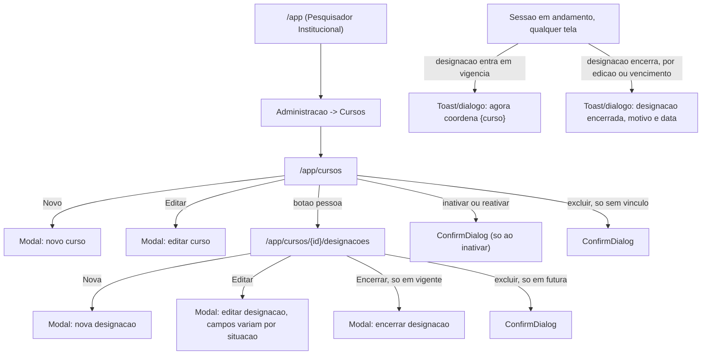

# UX: cursos

> Este documento **não repete** o que já está resolvido em `spec.md`: os
> cenários Given/When/Then, os wireframes ASCII (seção 17) e os diagramas
> Mermaid (seção 18) são a referência oficial — releia-os junto com este
> arquivo. Aqui ficam as decisões que a spec deliberadamente deixa em
> aberto (mecânica de tela) e a composição exata dos componentes.
>
> **Referência de padrões já em produção:** `specs/autenticacao-usuarios/ux.md`
> e o código já implementado em `frontend/src/features/instituicao/` e
> `frontend/src/features/usuario/`. Também leia `specs/indicadores/ux.md`
> (par desta rodada) — a extensão de `ComboboxEntidade` proposta lá é a
> mesma que esta tela precisa, para o candidato a designação.
>
> Sistema **não é** DSGOV/portal público — eMAG não se aplica. WCAG 2.2 AA
> se aplica integralmente.

---

## Fluxo de telas

1. **Cursos** (`/app/cursos`) — propósito: o PI pesquisa, cadastra,
   edita, inativa/reativa e (quando possível) exclui cursos da própria
   instituição; vê o coordenador vigente, derivado, em cada linha.
   Único acesso: PI.
2. **Formulário de curso** (modal, dentro da tela acima) — propósito:
   criar/editar nome, código e-MEC, grau, modalidade e situação.
3. **Designações de um curso** (`/app/cursos/{id}/designacoes`) —
   propósito: histórico completo de portarias de um curso — quem
   respondeu por ele, quando, e com que vigência. Página própria (não
   modal), acessada a partir da linha do curso.
4. **Modal: Nova designação** (dentro da tela 3) — propósito: registrar
   uma portaria, com coordenador, identificação, início e fim opcional.
5. **Modal: Encerrar designação** (dentro da tela 3, só em designação
   **vigente**) — propósito: editar a data de fim de uma designação em
   andamento, com o texto de consequência antes de confirmar.
6. **Modal: Editar designação** (dentro da tela 3) — propósito: corrigir
   portaria/datas; campos editáveis variam com a situação (ver seção da
   tela 3).

Modais auxiliares: confirmar inativação/reativação de curso (mesmo
padrão assimétrico já estabelecido), confirmar exclusão de curso (só
quando não há vínculo), confirmar exclusão de designação (só quando
**futura**), confirmar descarte de alterações não salvas.

Avisos de mudança de perfil (3.9 da spec) — toasts/diálogos informativos
disparados pela sincronização de perfis efetivos, **não são uma tela
desta feature**: são tratados no shell (`useSincronizacaoDePerfis`, já
existente em `frontend/src/features/auth/hooks/`), e esta spec só define
o **texto** de cada variante (seção "Avisos de mudança de perfil"
abaixo) — a mecânica de disparo já está implementada.

---

## Mapa de navegação



### Menu — onde cada tela entra

| Perfil | Grupo | Item |
|---|---|---|
| Pesquisador Institucional | Administração | Cursos |
| Coordenador de Curso | — | **Nenhum item de menu** (3.7 da spec: não existe listagem de cursos nem de designações para o coordenador) |
| Administrador do Sistema | — | **Nenhum item** — 403 em qualquer rota, nunca 404 |

Sem divergência entre `00-visao-produto.md` e `specs/cursos/spec.md`
aqui — os dois concordam que Cursos fica em "Administração", ao lado de
Usuários. (Compare com a divergência registrada em
`specs/indicadores/ux.md` para Indicadores/Metas — não se repete nesta
feature.)

---

## Regra de "ação sem permissão" — extensão desta feature

Reaproveita a regra de `autenticacao-usuarios/ux.md`, com dois casos
novos.

| Situação | Tratamento | Motivo |
|---|---|---|
| Coordenador de Curso tentando ver "Cursos" no menu | **Escondida** | Estrutural — não existe listagem para ele (3.7); ele acessa um curso individual só por link direto vindo de outra tela (ex: `Minhas metas`, fora do escopo desta spec) |
| Administrador do Sistema em qualquer rota daqui | **Escondida** (item de menu nem existe) | Estrutural — e a spec exige **403**, não 404, se a rota for chamada direto (reforça que a negação é de perfil, não de existência) |
| **Botão "Excluir" na linha do curso, quando há plano, entrega ou designação** | **Escondida** | Extensão da regra a pré-condição de dado — mesma decisão já registrada em `specs/indicadores/ux.md`. A exclusão sempre falharia com 409 |
| **Botão "Excluir" na linha da designação, quando ela é vigente ou encerrada** | **Escondida** | Só designação **futura** pode ser excluída (3.2) — mostrar o botão nas outras duas situações convida a um 409 garantido |
| **Coordenador vs. coordenador+PI vendo o item "Cursos"** | Quem **só** coordena: escondido. Quem também é PI: aparece, pelo perfil de PI — os perfis se somam (CV-02) | Não é regra nova, é a aplicação direta do modelo de conjunto de perfis já documentado em `00-visao-produto.md` |

---

## Componentes shadcn/ui — mapeamento e organização de pastas

### Reaproveitados de `shared/ui/` (sem alteração)

`LoadingButton`, `SkeletonTable`, `EmptyState`, `ErrorState`,
`ConfirmDialog`, `StatusBadge` (Situação do curso; Situação da
designação — Futura/Vigente/Encerrada, três variantes de cor),
`CabecalhoOrdenavel`, `Paginacao`, `useEstadoDeGrid`, `useLocalStorage`,
`useDirtyState` — mesmo uso e mesma composição já documentados em
`autenticacao-usuarios/ux.md` e `indicadores/ux.md`, sem repetir aqui.

### `shared/forms/` — mesma extensão de `ComboboxEntidade` proposta em `indicadores/ux.md`

**Esta é a tela que efetivamente precisa da extensão.** O seletor de
coordenador (no filtro do grid de Cursos e no formulário de Nova
designação) precisa mostrar, por candidato, **por que ele está na
lista** — perfil(is) que possui, ou quantos cursos já coordena — porque
a spec exige que a tela explique a elegibilidade, não só liste nomes
(CP-07, wireframe 17.3: "Ávila Gomes — [Professor]", "Beatriz Andrade —
[PI · Prof.]", "Paulo Tavares — [1 curso]").

Reaproveito **exatamente** a proposta de extensão descrita em
`specs/indicadores/ux.md`:

```ts
interface ItemComboboxEntidade {
  value: string
  label: string
  badge?: string                 // NOVO, opcional
  badgeVariant?: VariantProps<typeof badgeVariants>["variant"]  // NOVO, opcional
}
```

Renderizado em `ComboboxItem` com `StatusBadge` à direita do rótulo,
sem quebrar nenhum uso existente que não passa `badge`. **Só uma das
duas specs precisa implementar a extensão** — está registrada nas duas
para o `arquiteto` não deparar com duas descrições incompatíveis.

**Composição do combobox de candidato — sem criação inline (herdado da
regra universal de designação, não é exceção nova):** designar alguém é
ato administrativo com portaria, nunca "criar rapidamente" — a spec nem
prevê rota de criação de usuário aqui. `ComboboxEntidade` é usado sem
nenhuma opção de "+ Criar", mesma composição de `ComboboxEntidade` já
usada no login, só que buscando em `GET
/api/v1/designacoes/candidatos?busca=`.

**Item fixo "Vago" no filtro "Coordenador" do grid de Cursos —
composição igual ao item fixo "Administração do sistema" do combo de
login:**

```tsx
<ComboboxEntidade
  itens={candidatos}
  itemFixo={{ value: "__vago__", label: "Vago" }}
  value={filtroCoordenadorId}
  onValueChange={setFiltroCoordenadorId}
  placeholder="Todos"
  ...
/>
```

Reaproveita literalmente o mesmo padrão (`itemFixo`, sempre presente,
sempre no topo, separado por `ComboboxSeparator`) já documentado e
implementado para "Administração do sistema" no login — nenhuma
composição nova aqui, só um segundo uso do mesmo mecanismo.

### `shared/forms/` reaproveitado sem alteração

`PasswordInput` — não usado nesta feature.

### `features/curso/` (novo)

| Componente | Usa por baixo |
|---|---|
| `curso-filtro.tsx` | `Input` (nome/código), `Select` (Grau, Modalidade, Situação), `ComboboxEntidade` (Coordenador, com `itemFixo` "Vago"), `LoadingButton` |
| `curso-table.tsx` | `Table` family, `StatusBadge` (Situação); coluna Coordenador renderiza nome + "até DD/MM/AAAA" (quando há fim) + badge "também é PI" (ver abaixo); coluna "Plano do período corrente" mostra texto simples ("Vigente (N metas)" / "Rascunho" / "—"), sem link — o link para o plano é escopo de `plano-acao`, não desta feature |
| `curso-card-mobile.tsx` | `Card` |
| `curso-form-modal.tsx` | `Dialog` `max-w-lg`, `Field`/`FieldGroup`, `Input` (nome, código e-MEC), `Select` (grau, modalidade), `RadioGroup`-equivalente (situação) |
| `inativar-curso-dialog.tsx` | `ConfirmDialog`, com o texto explicando que a designação vigente **não** é encerrada |
| `excluir-curso-dialog.tsx` | `ConfirmDialog` |

### `features/designacao/` (novo)

| Componente | Usa por baixo |
|---|---|
| `designacao-filtro.tsx` | `Select` (Situação, padrão Todas), `ComboboxEntidade` (Coordenador, **sem** `itemFixo` "Vago" aqui — o filtro é sobre quem já tem alguma designação neste curso) |
| `designacao-table.tsx` | `Table` family, `StatusBadge` (Situação: Futura/Vigente/Encerrada); linha com `autodesignacao=true` ganha uma nota abaixo do nome ("ⓘ autodesignação") |
| `nova-designacao-modal.tsx` | `Dialog` `max-w-md`, `Field`/`FieldGroup`, `ComboboxEntidade` (Coordenador, com badges de perfil), `Input` (portaria), campo de data nativo (início, fim opcional), `Alert` condicional (autodesignação / também é PI) |
| `editar-designacao-modal.tsx` | Mesma composição, com campos condicionalmente somente-leitura conforme a situação (ver seção da tela 3) |
| `encerrar-designacao-modal.tsx` | `Dialog` `max-w-md`, um campo de data (novo fim), bloco de consequência computado no cliente |
| `excluir-designacao-dialog.tsx` | `ConfirmDialog` |

### Hooks (`features/*/hooks/`)

`useCursos`, `useCurso`, `useCriarCurso`, `useAtualizarCurso`,
`useAlterarSituacaoCurso`, `useExcluirCurso`; `useDesignacoes`,
`useCriarDesignacao`, `useAtualizarDesignacao`, `useExcluirDesignacao`,
`useCandidatosDesignacao` (alimenta os dois comboboxes). Todos expõem
`{ data, isLoading, error }` ou equivalente.

---

## Tela: Cursos (`/app/cursos`)

- **Ação primária:** Novo
- **Ações secundárias:** Pesquisar, Editar, abrir Designações,
  Inativar/Reativar, Excluir (só sem vínculo), ordenar, paginar
- **Loading:** `SkeletonTable`
- **Error:** `ErrorState`
- **Empty:** antes da 1ª pesquisa e sem resultado
- **Data:** grid com coordenador derivado por linha

### Grid

- **Filtros:** "Nome ou código"; "Grau" (Todos/Bacharelado/Licenciatura/
  Tecnólogo); "Modalidade" (Todas/Presencial/A distância);
  "Coordenador" (`ComboboxEntidade` com `itemFixo` "Vago"); "Situação"
  (padrão **Ativos**)
- **Colunas:** Nome · Código e-MEC · Grau · Modalidade · **Coordenador
  (derivado)** · Situação · **Plano do período corrente** · Ações
- **Ordenáveis:** Nome, Código e-MEC, Grau, Modalidade, Coordenador,
  Cadastrado em. **Padrão: Nome crescente** (collation `pt-BR`, "Ávila"
  antes de "Biomedicina" — CU-10). Página **20**
- **Ações por linha:** `[✎ Editar]` `[👤 Designações]` `[⊘/↻
  Inativar/Reativar]` `[✗ Excluir]` (ausente com vínculo)

### Coluna "Coordenador" — composição da célula

```tsx
{coordenador ? (
  <div>
    <span>{coordenador.nome}</span>
    {coordenador.data_fim && (
      <span className="block text-xs text-muted-foreground">
        até {formatarData(coordenador.data_fim)}
      </span>
    )}
    {coordenador.tambem_pi && (
      <Tooltip>
        <TooltipTrigger render={<span tabIndex={0} className="ml-1 text-xs">também é PI ⓘ</span>} />
        <TooltipContent>
          Quem coordena este curso também avalia as entregas dele. É
          permitido, e aparece marcado no relatório de desempenho.
        </TooltipContent>
      </Tooltip>
    )}
  </div>
) : (
  <span className="inline-flex items-center gap-1 text-amber-700">
    <TriangleAlertIcon className="size-4" aria-hidden="true" />
    Vago
  </span>
)}
```

**Nunca só ícone/cor** — "Vago" sempre acompanhado do texto, "também é
PI" sempre com o texto "ⓘ" clicável/focável, não só a cor do badge.

### Formulário (modal, `max-w-lg`)

Campos: Nome, Código e-MEC (opcional), Grau (`Select`), Modalidade
(`Select`), Situação (`RadioGroup`-equivalente: Ativo/Inativo, padrão
Ativo). **Layout em 2 colunas em `md+`** (Grau e Modalidade lado a
lado); Nome e Código e-MEC cada um em linha própria (`col-span-full`).

**Situação aparece no formulário (create e edit), e também tem ação
dedicada de linha (⊘/↻)** — a spec pede as duas coisas explicitamente
(Fluxo 1 lista situação como campo do "Novo"; a seção 3.8/wireframe
lista a ação de linha). Não é redundância acidental: o campo no
formulário cobre o caso raro de cadastrar já como inativo (ex:
migração de curso histórico); a ação de linha cobre o caso comum de
inativar um curso em operação, com a confirmação e o texto de
consequência que só faz sentido numa ação isolada, não escondida dentro
de "Salvar".

**Sem campo de coordenador neste formulário** — reforça CU-01: a
designação é um fluxo à parte, iniciado pelo botão `[👤]` na linha (só
depois de o curso existir).

### Estados de erro do formulário

| Situação | Tratamento |
|---|---|
| Nome, grau ou modalidade vazios | `FieldError` por campo |
| 409 `NOME_CURSO_DUPLICADO` | `FieldError` no campo Nome: "Já existe um curso com este nome nesta instituição." |
| 409 `CODIGO_EMEC_CURSO_DUPLICADO` | `FieldError` no campo Código e-MEC: "Já existe um curso com este código e-MEC nesta instituição." |
| 400 `VALOR_INVALIDO` (grau/modalidade) | Não deveria acontecer (`Select` já restringe as opções) — tratado como erro genérico se ocorrer |
| 409 `CONFLITO_DE_VERSAO` | Mesmo padrão já estabelecido |

### Ação "Inativar" / "Reativar"

| Direção | Confirmação | Texto |
|---|---|---|
| Ativo → Inativo | `ConfirmDialog` (`destrutivo`) | "Inativar {nome}? O curso sai da cobrança de novos relatórios e não aceita novas entregas. Nada é apagado, e a designação vigente **continua ativa** — inativar o curso não encerra a portaria do coordenador." |
| Inativo → Ativo | Sem confirmação | — |

O texto reforça deliberadamente "a designação **continua ativa**"
porque é o ponto onde a spec diz explicitamente que a tela "sugere, sem
fazer por conta própria" (3.5) — a confirmação **não** oferece um botão
"Encerrar também a designação" embutido: são duas ações
independentes, e misturá-las na mesma confirmação teria feito por conta
própria o que a spec proíbe.

### Ação "Excluir"

Botão presente só sem plano/entrega/designação nenhuma (CU-07).
`ConfirmDialog`: "Excluir {nome}? Esta ação não pode ser desfeita."

### Responsividade

| Largura | Colunas visíveis | Formulário |
|---|---|---|
| 1440px | todas | 2 colunas (Grau/Modalidade) |
| 768px | oculta Código e-MEC e "Plano do período corrente" (secundárias); mantém Coordenador (é a informação mais checada) | 2 colunas |
| 360px | cartão por curso: Nome, badge Situação, Coordenador (com "Vago"/"também é PI" preservados), ações só ícone | coluna única |

### Acessibilidade

- Cabeçalho ordenável, `aria-sort`, `aria-live="polite"` no resumo.
- Botões de ação: `aria-label` "Editar {nome}", "Ver designações de
  {nome}", "Inativar {nome}", "Reativar {nome}", "Excluir {nome}".
- "Vago" e "também é PI": nunca só cor/ícone, sempre com texto (WCAG
  1.4.1).
- Badge "também é PI" truncado em `Tooltip`: `tabIndex={0}`, foco abre,
  `Esc` fecha — mesmo padrão do badge de instituição em
  `autenticacao-usuarios/ux.md`.

### Microcópia

| Elemento | Texto |
|---|---|
| Título | "Cursos" |
| Botão novo | "+ Novo" |
| Rótulo filtro coordenador | "Coordenador" (opção fixa "Vago" no topo) |
| Antes da 1ª pesquisa | "Use os filtros acima e clique em Pesquisar para ver os cursos." |
| Sem resultado | "Nenhum curso encontrado." / "Revise os filtros e tente novamente." |
| Vago na coluna | "Vago" |
| Tooltip "também é PI" | "Quem coordena este curso também avalia as entregas dele. É permitido, e aparece marcado no relatório de desempenho." |
| Nota de rodapé do grid | "⚠ Curso sem designação vigente não recebe entregas, e os planos vigentes dele continuam sendo cobrados." |
| Confirmação de inativação | ver bloco acima |
| Toast criação | "Curso cadastrado com sucesso." |
| Toast inativação | "{Nome} foi inativado." |

---

## Tela: Designações de um curso (`/app/cursos/{id}/designacoes`)

Página própria, não modal — histórico pode crescer (uma linha a cada
~2 anos por curso, mas ao longo dos anos vira uma lista real), e é
exatamente o tipo de conteúdo que a regra "modal vs. página" do
`CLAUDE.md` manda tirar do modal.

- **Ação primária:** Nova (designação)
- **Ações secundárias:** Pesquisar/filtrar, Editar, Encerrar (só
  vigente), Excluir (só futura)
- **Loading / Error / Empty:** mesmo padrão dos outros grids
- **Data:** grid ordenado por início decrescente

### Breadcrumb

`Início → Administração → Cursos → {Nome do curso} → Designações` —
quatro níveis, mais profundo que o padrão de 2-3 níveis do restante do
produto. É uma exceção justificada pelo recurso aninhado (mesmo padrão
já em produção em `/app/instituicoes/{id}/pesquisadores`), não uma
invenção desta tela.

### Grid

- **Filtros:** "Situação" (padrão **Todas** — histórico é o propósito
  da tela, começar filtrado por Vigente esconderia o que a pessoa
  provavelmente veio ver); "Coordenador" (`ComboboxEntidade`, só
  pessoas que já têm designação **neste** curso — **sem** `itemFixo`
  "Vago", que não faz sentido como filtro de coordenador aqui)
- **Colunas:** Coordenador · Portaria · Início · Fim · Situação · Ações
- **Ordenáveis:** Coordenador, Portaria, Início, Fim. **Padrão: Início
  decrescente** (a mais recente primeiro — é o que alguém normalmente
  quer ver primeiro). Página **20**
- **Linha com `autodesignacao=true`:** nota "ⓘ autodesignação" abaixo
  do nome do coordenador, sempre texto, nunca só ícone

### Formulário: Nova designação (modal, `max-w-md`)

Campos: Coordenador (`ComboboxEntidade` com badges de perfil — ver
seção de componentes), Portaria (texto livre), Início (data), Fim
(data, opcional — texto de apoio "Deixe o fim em branco para prazo
indeterminado.").

**Aviso condicional, sempre visível quando aplicável, nunca escondido
atrás de confirmação separada** (mesma lógica já usada no aviso de
impacto de `specs/indicadores/ux.md`):

| Condição | Texto do `Alert` (informativo, não erro) |
|---|---|
| Candidato selecionado tem o perfil de PI | "{Nome} também é Pesquisador(a) Institucional. Ela(e) passará a coordenar este curso e continuará podendo avaliar as entregas dele. É permitido, e as avaliações feitas por ela(e) neste curso aparecerão marcadas no relatório de desempenho." |
| Candidato selecionado é a própria pessoa autenticada (autodesignação) | "Você está se designando para este curso. A autodesignação é permitida e ficará registrada, com a portaria informada." |
| As duas condições ao mesmo tempo | Os dois textos, empilhados |

### Estados de erro do formulário

| Situação | Tratamento |
|---|---|
| Coordenador, portaria ou início vazios | `FieldError` por campo |
| Fim anterior ao início | `FieldError` no campo Fim: "A data de fim não pode ser anterior à data de início." (400 `DESIGNACAO_DATAS_INVALIDAS`) — validado no cliente antes de submeter |
| 409 `DESIGNACAO_SOBREPOSTA` | `Alert` destrutivo acima do formulário: "Já existe uma designação vigente ou futura para este curso no período informado. Encerre a designação atual antes de cadastrar outra, ou ajuste as datas." — **não** é `FieldError` de um campo específico, porque a sobreposição depende da combinação de datas + curso, não de um campo isolado |
| 400 `COORDENADOR_INVALIDO` | Não deveria acontecer (a lista de candidatos já filtra) — tratado como erro genérico se ocorrer (corrida entre abas) |
| 404 (coordenador de outra instituição) | Idem — tratado como erro genérico |

### Formulário: Editar designação — campos condicionais por situação

**Decisão de UX que preenche uma lacuna da spec** (a spec define o
endpoint `PUT /api/v1/designacoes/{id}` de forma geral, sem detalhar
quais campos fazem sentido editar em cada situação — registrado também
em "Decisões de fluxo" abaixo):

| Campo | Designação **Futura** | Designação **Vigente** | Designação **Encerrada** |
|---|---|---|---|
| Coordenador | editável | somente leitura, com texto "Não editável após o início da vigência — para trocar de coordenador, encerre esta designação e cadastre uma nova." | somente leitura, mesmo texto |
| Início | editável | somente leitura | somente leitura |
| Fim | editável | editável (é o caminho de "encerrar antes do previsto" e de prorrogar — DG-07) | editável (corrige um erro de digitação em um registro histórico) |
| Portaria | editável | editável (corrige número/identificação) | editável |

Justificativa: editar o coordenador ou o início de uma designação que
já produziu efeito reescreveria quem respondia pelo curso num passado
já vivido — o caminho correto para trocar de coordenador é **encerrar +
nova designação** (Fluxo 3 da spec), não editar a existente. O campo
Fim continua sempre editável, inclusive em designação encerrada,
porque é dado factual que pode ter sido digitado errado.

### Modal: Encerrar designação (`max-w-md`)

Ação dedicada, separada de "Editar", para o caso mais comum
(interromper uma designação vigente antes do previsto). Um único campo
de data, com o bloco de consequência calculado **no cliente**, a partir
da data escolhida:

```
Encerrar a designação de {coordenador} em {curso}?

Nova data de fim: [____/____/____]  (padrão: hoje; mínimo: data de início)

⚠ A partir de {data escolhida + 1 dia} o curso fica sem responsável:
  ninguém poderá registrar entrega, e os planos vigentes, com
  {planos_vigentes} meta(s), continuam sendo cobrados.
{se ultima_designacao_vigente === true}
⚠ {Coordenador} deixa de ter o perfil de Coordenador de Curso, porque
  esta é a última designação vigente dele(a). Os demais perfis não mudam.
{senão, se o dado não estiver disponível}
⚠ Se esta for a última designação vigente de {coordenador}, ele(a)
  deixará de ter o perfil de Coordenador de Curso. Os demais perfis não
  mudam.

ℹ As entregas já feitas continuam contando para o curso, com o nome de
  quem as enviou.

           [Cancelar]  [Encerrar]
```

O aviso é **informativo** (`role="status"`), não bloqueia o botão
"Encerrar" — não há nada de errado em encerrar, só uma consequência a
saber.

### Modal: Excluir designação

`ConfirmDialog`, botão presente só em designação **futura** (DG-08).
"Excluir a designação futura de {coordenador} em {curso}? Esta ação não
pode ser desfeita."

### Responsividade

| Largura | Colunas visíveis | Formulário |
|---|---|---|
| 1440px | todas | coluna única (poucos campos sequenciais) |
| 768px | oculta Portaria (secundária, visível no card mobile) | coluna única |
| 360px | cartão por designação: Coordenador (+ nota autodesignação), Portaria, período, badge Situação, ações ícone | coluna única, 90% de largura |

### Acessibilidade

- Campos somente leitura na edição (Coordenador/Início quando não
  futura): renderizados como texto associado ao rótulo, **não** como
  `<input disabled>` — `disabled` é ambíguo para leitor de tela sobre
  "por que não editável agora"; um parágrafo com o texto explicativo é
  mais claro.
- Aviso condicional de PI/autodesignação: `role="status"`,
  `aria-live="polite"` — some/aparece conforme a seleção do candidato
  muda, sem precisar de novo submit.
- Modal de encerrar: bloco de consequência recalcula ao digitar a data,
  anunciado via `aria-live="polite"` (não `assertive` — não é erro).
- "Vigente"/"Futura"/"Encerrada"/"autodesignação": sempre texto no
  `StatusBadge`, nunca só cor.

### Microcópia

| Elemento | Texto |
|---|---|
| Título | "Designações · {Nome do curso}" |
| Botão nova | "+ Nova" |
| Rótulo campo fim (nova designação) | "Deixe o fim em branco para prazo indeterminado." |
| Texto de não editável | "Não editável após o início da vigência — para trocar de coordenador, encerre esta designação e cadastre uma nova." |
| Sobreposição | "Já existe uma designação vigente ou futura para este curso no período informado. Encerre a designação atual antes de cadastrar outra, ou ajuste as datas." |
| Nota autodesignação (grid) | "ⓘ autodesignação — quem registrou a portaria é a própria pessoa designada. É permitido e fica registrado." |
| Toast criação | "Designação registrada com sucesso." |
| Toast encerramento | "Designação de {coordenador} encerrada em {data}." |
| Toast exclusão | "Designação excluída." |

---

## Avisos de mudança de perfil (3.9 da spec) — só o texto, mecânica já existe

Disparados pelo shell (`useSincronizacaoDePerfis`), comparando o
conjunto de perfis efetivos entre requisições — esta feature só define
o conteúdo:

| Evento | Texto |
|---|---|
| Designação entrou em vigência | "Você agora coordena o curso {curso}, pela Portaria {portaria}. A área Minhas metas está disponível no menu." |
| Encerrada por edição | "Sua designação como coordenador de {curso} foi encerrada." |
| Encerrada por vencimento | "Sua designação como coordenador de {curso} encerrou em {data}, conforme a Portaria {portaria}." |
| Estava dentro de "Minhas metas" quando a última designação encerrou | Levada à tela inicial **com a mensagem** — nunca tela em branco, nunca 403 seco |

O texto de vencimento **nunca culpa ninguém** — só o documento e a
data, conforme a spec exige explicitamente (3.9).

---

## Atalhos de teclado desta feature

| Atalho | Ação | Escopo |
|---|---|---|
| `Ctrl+N` / `Cmd+N` | Abre "Novo curso" / "Nova designação" | `/app/cursos` e `/app/cursos/{id}/designacoes`, conforme o botão existir para o perfil |
| `Ctrl+S` / `Cmd+S` | Salva o formulário atual | Todos os modais desta feature |
| `Ctrl+F` / `Cmd+F` | Foca o campo de busca principal | As duas telas de grid |
| `Esc` | Fecha modal/combobox aberto, respeitando dirty state | Todos os modais e comboboxes |
| `↑`/`↓`/`Enter`/`Esc` | Navegar/selecionar/fechar no combobox de coordenador | `ComboboxEntidade` (filtro e formulários) |

---

## Acessibilidade transversal (resumo executável)

| Aspecto | Regra aplicada nesta feature |
|---|---|
| Contraste | 4.5:1 texto, 3:1 componentes de interface |
| "Vago"/"Futura"/"autodesignação"/"também é PI" nunca só por cor | Sempre texto, no badge ou ao lado do ícone |
| Foco ao abrir modal | Primeiro campo (Nome no curso; Coordenador na designação) |
| Foco ao fechar modal | Volta ao botão que abriu |
| `aria-live` de resultado do grid | `aria-live="polite"`, texto-resumo fora da tabela |
| `aria-live` do aviso condicional (PI/autodesignação) | `aria-live="polite"`, `role="status"` |
| `aria-live` do bloco de consequência (Encerrar designação) | `aria-live="polite"` |
| Campo somente leitura na edição de designação | Texto associado ao rótulo, não `<input disabled>` |
| Tooltip "também é PI" | `tabIndex={0}` + acessível por teclado |
| Toasts | `role="status"` sucesso/info/aviso · `role="alert"` erro |
| Alvo de toque | mínimo 24×24px nos botões de ação por linha |
| Motion | Parâmetros padrão do `CLAUDE.md`, sem alteração |

---

## Responsividade — confirmação geral (360 / 768 / 1440)

As três telas desta feature foram pensadas nas três larguras — ver a
tabela específica de cada tela acima. Resumo transversal: sidebar
colapsada em `sm`/`md`, aberta em `lg+` (herdado do shell); nenhuma
tela usa `max-w-*` no wrapper de página, só nos modais e nos controles
individuais que ficariam absurdos esticados (ex: campo de data).

---

## Decisões de fluxo / divergências da spec

1. **Campos editáveis da designação variam conforme a situação**
   (Futura/Vigente/Encerrada) — a spec define o endpoint de forma
   geral, sem esse detalhe. Preenchi a lacuna com uma regra que segue
   diretamente de 3.2 e 3.4 ("encerrar é editar `data_fim`", "não existe
   botão revogar", "trocar é encerrar + nova designação") — não é uma
   invenção fora do espírito da spec, mas é uma decisão de UX que o
   `arquiteto`/`analista-requisitos` deveria confirmar antes de travá-la
   no contrato de API (ex: o backend também deveria recusar mudar
   `coordenador_id` de uma designação vigente/encerrada com um 400
   próprio, para não depender só do frontend desabilitar o campo).
2. **Modal "Encerrar designação" separado de "Editar designação"** — a
   spec já sugere isso no wireframe 17.3, mas não formaliza a regra;
   registrei explicitamente que são dois modais distintos, com o
   segundo focado numa única mudança (a data de fim) e no texto de
   consequência.
3. **Campo computado `ultima_designacao_vigente` (ou equivalente) —
   proposto, não confirmado.** Sem ele, o aviso de perda de perfil no
   modal de Encerrar fica com o texto hedged ("Se esta for a última
   designação vigente..."), que é mais fraco do que a spec exemplifica
   no wireframe ("Ana deixa de ter o perfil...", afirmativo). Registrado
   também na seção seguinte, para o `arquiteto` decidir se vale o custo
   de expor esse booleano.
4. **`também é PI` e `data_fim` da designação vigente precisam vir no
   payload da listagem de cursos** — sem eles, a coluna Coordenador do
   grid principal não consegue mostrar "até DD/MM/AAAA" nem o badge
   "também é PI" sem uma chamada extra por linha. Ver seção seguinte.
5. **Extensão de `ComboboxEntidade` com `badge`/`badgeVariant`** —
   mesma proposta de `specs/indicadores/ux.md`, repetida aqui de
   propósito para as duas descrições não divergirem.
6. **Botão "Excluir" escondido (não desabilitado) quando há vínculo** —
   mesma decisão de `specs/indicadores/ux.md`, aplicada aqui a curso
   (plano/entrega/designação) e a designação (situação diferente de
   futura).

Nenhum outro ponto da spec foi contestado ou reinterpretado.

---

## O que o `arquiteto` precisa saber ao ler este documento

- **Listagem de cursos precisa expor, por linha:** `coordenador: { id,
  nome, data_fim, tambem_pi } | null` — os campos `data_fim` e
  `tambem_pi` **não estão explicitamente listados** na seção 9 da spec
  ("coordenador derivado") e são necessários para a coluna Coordenador
  do grid renderizar sem uma segunda chamada por linha.
- **Candidato a designação (`GET /api/v1/designacoes/candidatos`) já
  devolve os perfis de cada um** (a própria spec já pede isso na seção
  9: "com os perfis de cada um na resposta para a tela avisar") — a
  tela usa esse campo para montar o `badge` do combobox (ex:
  `perfis.includes("pesquisador_institucional") ? "PI · Prof." :
  "Professor"`, ou "{n} curso(s)" quando já tem designação em outro
  curso). A regra exata de qual texto de badge exibir quando a pessoa
  acumula múltiplas condições (é candidato por Professor **e** já
  coordena **e** é PI) fica a critério do `dev-fullstack`, priorizando
  o texto mais informativo — não há um caso na spec que exija uma regra
  determinística aqui.
- **Campo `ultima_designacao_vigente` (proposto) na resposta de uma
  designação vigente, ou em `GET /api/v1/designacoes/{id}`** — ver
  divergência 3 acima. Se não for viável nesta entrega, a tela usa o
  texto hedged e funciona igual, só um pouco menos afirmativo.
- **`GET /api/v1/cursos/{id}/designacoes` já devolve `autodesignacao`
  por linha** (a spec já pede isso na seção 9) — usado para a nota "ⓘ
  autodesignação" na tabela.
- A extensão de `ComboboxEntidade` (`badge`/`badgeVariant` opcionais) é
  puramente de frontend — sem impacto de contrato de API.
- **Contrato do PUT de designação** deveria, na minha leitura,
  recusar (400) tentativa de alterar `coordenador_id` ou
  `data_inicio` quando a designação não está mais `futura` — reforça no
  backend o que o frontend já impede desabilitando o campo, e evita que
  alguém contorne a regra chamando a API direto. Ver divergência 1.
