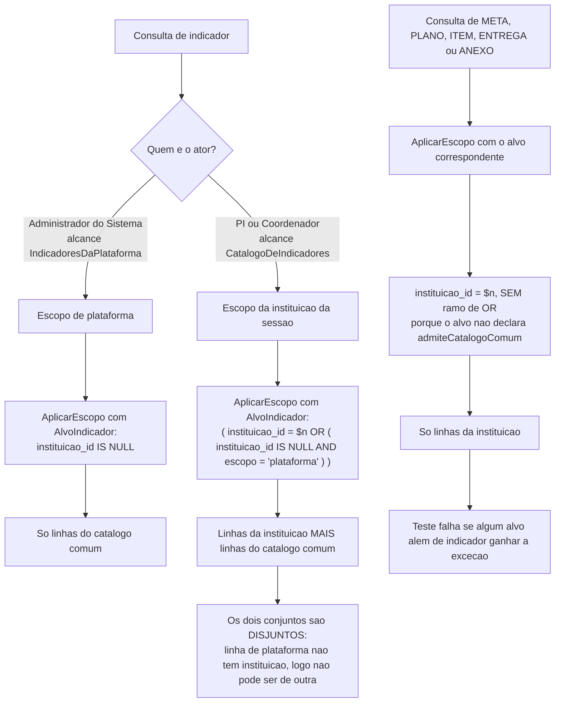

# Design: indicadores

**Data:** 28/09/2026 (revisão 2) · **Status:** proposto — aguarda aprovação do
dono
**Entradas:** `spec.md` · `ux.md` · `specs/00-visao-produto.md` ·
`specs/_fundacao-metas.md` · `specs/autenticacao-usuarios/design.md` (rev. 6) ·
`project.config.md` · `CLAUDE.md`

> **Lê-se depois de `specs/_fundacao-metas.md`.** O mecanismo de isolamento
> generalizado, a exceção do catálogo comum, `DataLocal`, as permissões, os
> alcances e o menu estão lá e **não são redefinidos aqui**. Este documento
> desenha o que é específico de Indicador e Meta.
>
> Herdado de `autenticacao-usuarios` sem repetição: campos base, deleção
> lógica, concorrência otimista com 409, paginação com envelope e allowlist,
> auditoria de dois canais, `UnidadeDeTrabalho`, formato de erro, 404 para
> recurso fora do recorte.
>
> **Revisão 2:** o item de menu do catálogo de metas passa a chamar-se
> **"Catálogo de metas"** (§9). A rota **não** muda. Nenhuma outra alteração.

---

## 1. Sumário das decisões

| # | Decisão | Motivo curto |
|---|---|---|
| I-01 | **Uma tabela `indicador`, com `escopo` e `instituicao_id` nulo na plataforma** | PI-1; o N:N já resolve o caso que motivaria duas tabelas |
| I-02 | **Um único índice único parcial com `NULLS NOT DISTINCT` resolve as três regras de unicidade de código** | §4.2 — mesmo mecanismo já provado em `usuario` (D-05) |
| I-03 | **`CHECK` de coerência torna irrepresentável o par (escopo, instituição) inválido** | `IV-06`; doutrina de D-17 |
| I-04 | **`escopo` é imutável por recusa no use case mais `UPDATE` que nunca lista a coluna** | §3.2 |
| I-05 | **`derivado_inep` não existe: nem coluna, nem campo de API** | Um campo por fato; `escopo` já é o fato |
| I-06 | **A contagem de uso é `COUNT` lateral, com filtro de instituição diferente por rota** | PI-5: o Administrador vê o total agregado; o PI vê o dele |
| I-07 | **Duas famílias de rota, e a fronteira de escrita fica no caminho** | `/plataforma/indicadores` vs. `/indicadores` — sem `if` no handler |
| I-08 | **`meta_indicador` é parte do agregado Meta**: sem `versao`, reescrito inteiro na transação | Mesma decisão de `usuario_perfil` |
| I-09 | **A junção para `indicador` dentro das consultas de meta passa por `AplicarEscopo`** | Fundação §3.3 — junção nua é como a próxima exceção entra |
| I-10 | **Inativar e excluir são operações distintas com garantias distintas**: inativar é situação; excluir é bloqueado **pelo banco** | `IE-06`, `IE-07`, `IN-05`, `MC-11` |

---

## 2. Diagrama — onde a exceção do catálogo vive e onde ela não vive



**A figura fixa o que o texto deixaria ambíguo:** a exceção não é uma
frouxidão no filtro — é um **segundo conjunto, disjunto do primeiro**, cuja
união é incapaz por construção de alcançar dado de terceiro. E ela é decidida
**pelo alvo**, não pelo ator: por isso o caminho de baixo do diagrama não tem
como ganhar o ramo de `OR` por engano de quem escreve a consulta.

---

## 3. Domínio

### 3.1 Value Objects — `internal/domain/valueobject/`

| VO | Regras |
|---|---|
| **`EscopoIndicador`** | `plataforma` \| `instituicao`. Construtor recusa outro valor → 400 `VALOR_INVALIDO`. Expõe `PertenceAInstituicao() bool` — o predicado que amarra o par (escopo, instituição) em um lugar só |
| **`CodigoIndicador`** | Não vazio depois de `btrim`, ≤ 50 caracteres, sem quebra de linha. **Não** normaliza para maiúscula: `1.4` e `GEST-01` convivem e o texto é o que as pessoas usam para se referir ao indicador |
| **`ReferenciaInstrumento`** | Texto livre, ≤ 500. **A regra de obrigatoriedade não mora aqui** — mora na entidade, porque depende do escopo (§3.2) |
| **`SituacaoCatalogo`** | `ativo` \| `inativo`. Reaproveitado por Indicador e por Meta |
| **`NomeCatalogo`** | Não vazio, ≤ 300. Reaproveitado por Indicador e por Meta |

**Por que `ReferenciaInstrumento` não valida a obrigatoriedade:** um Value
Object é válido por si; "obrigatória em plataforma e proibida em instituição"
é uma invariante **do par** (escopo, referência), e invariante de par mora na
entidade. Botá-la no VO obrigaria o construtor a receber o escopo, o que faria
o VO conhecer um conceito que não é dele.

### 3.2 Entidade `indicador.Indicador`

```go
type Indicador struct {
    ID                    uuid.UUID
    Escopo                valueobject.EscopoIndicador
    InstituicaoID         *uuid.UUID      // nil ⟺ Escopo == plataforma
    Codigo                valueobject.CodigoIndicador
    Nome                  valueobject.NomeCatalogo
    Descricao             string
    ReferenciaInstrumento *valueobject.ReferenciaInstrumento
    Situacao              valueobject.SituacaoCatalogo
    // campos base
}

func NovoDaPlataforma(codigo, nome, descricao, referencia) (*Indicador, error)
func NovoDaInstituicao(instituicaoID uuid.UUID, codigo, nome, descricao) (*Indicador, error)
```

**Dois construtores, não um com `if`.** O escopo é imutável e determina quais
campos existem; dois construtores tornam impossível construir a combinação
errada, e cada rota chama exatamente um. `NovoDaInstituicao` **não tem
parâmetro de referência do instrumento** — `IN-02` não precisa de validação,
precisa de uma assinatura que não aceite o dado.

**Invariantes, verificadas no construtor e no banco:**

| Invariante | Domínio | Banco |
|---|---|---|
| `escopo = plataforma` ⟺ `instituicao_id IS NULL` | construtor | `CHECK` (`IV-06`) |
| referência obrigatória em plataforma, proibida em instituição | construtor → 400 `REFERENCIA_INSTRUMENTO_INVALIDA` | `CHECK` |
| escopo imutável | `Atualizar` não recebe escopo | o `UPDATE` não lista a coluna |

**Sobre I-04.** Considerei coluna gerada e *trigger*. Coluna gerada não se
aplica (o escopo não deriva de nada). *Trigger* foi rejeitado pelo mesmo motivo
de D-17: lógica silenciosa, invisível na investigação de defeito. A garantia
real é que **nenhum `UPDATE` do adapter lista `escopo`**, e o use case recusa o
campo com 400 `ESCOPO_IMUTAVEL` quando ele chega no corpo — não o ignora, o que
faria o cliente achar que converteu.

### 3.3 Entidade `meta.Meta`

```go
type Meta struct {
    ID            uuid.UUID
    InstituicaoID uuid.UUID          // NÃO é ponteiro: meta é sempre da instituição
    Nome          valueobject.NomeCatalogo
    Descricao     string
    Indicadores   []uuid.UUID        // 1 a 5, ordenado, sem repetição
    Situacao      valueobject.SituacaoCatalogo
    // campos base
}

func (m *Meta) DefinirIndicadores(novos []uuid.UUID) (anteriores []uuid.UUID, err error)
```

`DefinirIndicadores` **devolve a lista anterior**, para a auditoria registrar as
duas completas (`MC-13`, item 4 das exceções da seção 10 da spec) — nunca
aplica diferença. É o mesmo formato de `Usuario.DefinirPerfis`, e é deliberado:
o que saiu é metade da prova.

Validações, todas no domínio:

| Regra | Erro |
|---|---|
| lista vazia | 400 `INDICADOR_OBRIGATORIO` |
| mais de 5 | 400 `INDICADORES_ACIMA_DO_LIMITE` |
| repetido na lista | 400 `INDICADOR_DUPLICADO_NA_META` |

**"Não existe meta sem indicador, em nenhuma rota, seed ou migração"** (`MC-03`):
a garantia de rota e de seed é o construtor; a de migração é o `dba`, e não há
restrição de banco que a dê diretamente (Postgres não tem "pelo menos uma
linha filha"). **Registro a limitação em vez de fingir que não existe:** o
domínio garante toda escrita da aplicação, e o `dba` verifica em V-4 (§4.4) que
nenhuma meta do seed ficou órfã. Uma meta órfã criada por SQL manual não é
detectada até alguém abri-la. Aceito, porque o vetor é escrita manual em
produção, que já é proibida.

**A meta não tem nenhum campo apontando para o INEP** (`MC-01`, `MC-08`,
3.4 da spec). Coluna de INEP em `meta` é achado de revisão.

---

## 4. Banco de dados

### 4.1 Tabelas

```sql
CREATE TABLE indicador (
    id                     UUID        PRIMARY KEY,
    escopo                 TEXT        NOT NULL,
    instituicao_id         UUID        REFERENCES instituicao (id),
    codigo                 TEXT        NOT NULL,
    nome                   TEXT        NOT NULL,
    descricao              TEXT        NOT NULL DEFAULT '',
    referencia_instrumento TEXT,
    situacao               TEXT        NOT NULL DEFAULT 'ativo',
    criado_em              TIMESTAMPTZ NOT NULL DEFAULT now(),
    atualizado_em          TIMESTAMPTZ,
    excluido_em            TIMESTAMPTZ,
    versao                 INT         NOT NULL DEFAULT 1,

    CONSTRAINT ck_indicador_escopo    CHECK (escopo IN ('plataforma','instituicao')),
    CONSTRAINT ck_indicador_situacao  CHECK (situacao IN ('ativo','inativo')),
    -- IV-06: o par (escopo, instituição) não pode ser incoerente
    CONSTRAINT ck_indicador_coerencia CHECK ((escopo = 'plataforma') = (instituicao_id IS NULL)),
    -- referência obrigatória na plataforma, proibida na instituição
    CONSTRAINT ck_indicador_referencia CHECK (
        (escopo = 'plataforma' AND referencia_instrumento IS NOT NULL
                               AND btrim(referencia_instrumento) <> '')
     OR (escopo = 'instituicao' AND referencia_instrumento IS NULL)),
    CONSTRAINT ck_indicador_codigo    CHECK (btrim(codigo) <> '' AND length(codigo) <= 50),
    CONSTRAINT ck_indicador_nome      CHECK (btrim(nome) <> '' AND length(nome) <= 300)
);

CREATE TABLE meta (
    id             UUID        PRIMARY KEY,
    instituicao_id UUID        NOT NULL REFERENCES instituicao (id),
    nome           TEXT        NOT NULL,
    descricao      TEXT        NOT NULL DEFAULT '',
    situacao       TEXT        NOT NULL DEFAULT 'ativo',
    criado_em      TIMESTAMPTZ NOT NULL DEFAULT now(),
    atualizado_em  TIMESTAMPTZ,
    excluido_em    TIMESTAMPTZ,
    versao         INT         NOT NULL DEFAULT 1,
    CONSTRAINT ck_meta_situacao CHECK (situacao IN ('ativo','inativo')),
    CONSTRAINT ck_meta_nome     CHECK (btrim(nome) <> '' AND length(nome) <= 300)
);

CREATE TABLE meta_indicador (
    meta_id        UUID NOT NULL REFERENCES meta (id) ON DELETE CASCADE,
    indicador_id   UUID NOT NULL REFERENCES indicador (id),
    criado_em      TIMESTAMPTZ NOT NULL DEFAULT now(),
    PRIMARY KEY (meta_id, indicador_id)
);
```

**`meta_indicador` não tem `instituicao_id`.** Ela não é alvo de
`AplicarEscopo` — só é alcançada a partir de uma `meta` já recortada, e a linha
de `indicador` que ela aponta é recortada por `AplicarEscopo` com
`AlvoIndicador` na junção (I-09). Acrescentar a coluna daria a impressão de que
a tabela é um alvo, e alguém escreveria um `WHERE instituicao_id` nela — fora
de `AplicarEscopo`, que é exatamente o que não se pode fazer.

**A PK composta dá `INDICADOR_DUPLICADO_NA_META` de graça**, sob concorrência.
O `ON DELETE CASCADE` é sobre a meta; como não há `DELETE` físico de meta, ele
nunca dispara na aplicação — existe para o caso de expurgo de retenção.

### 4.2 Unicidade de código — um índice, três regras

```sql
CREATE UNIQUE INDEX uq_indicador_instituicao_codigo
    ON indicador (instituicao_id, codigo) NULLS NOT DISTINCT
 WHERE excluido_em IS NULL;
```

Percorrendo as três regras de PI-3 contra este único índice:

| Caso | Resultado | Cenário |
|---|---|---|
| Dois `1.4` no catálogo comum | `instituicao_id` é `NULL` nos dois e `NULLS NOT DISTINCT` os trata como iguais → **colide** ✅ | `IE-03` |
| Dois `GEST-01` na FSA | mesma instituição → **colide** ✅ | `IN-03` |
| `GEST-01` na FSA e `GEST-01` no IVV | instituições diferentes → **não colide** ✅ | `IN-03` |
| `1.4` da plataforma e `1.4` próprio da FSA | `NULL` vs. uuid da FSA → **não colide** ✅ | `IE-03`, metade legítima |

A coluna `escopo` **não entra no índice** porque é funcionalmente determinada
por `instituicao_id IS NULL`, via `ck_indicador_coerencia`. Incluí-la seria
redundância que sugere uma regra que não existe.

**Alternativa rejeitada:** dois índices parciais (um `WHERE escopo =
'plataforma'`, outro `WHERE escopo = 'instituicao'`). Expressam duas regras
onde há uma, e a segunda regra é a que alguém esquece de replicar quando a
primeira muda. **E o mecanismo de `NULLS NOT DISTINCT` já está provado neste
projeto** (D-05, V-2) — reusar o provado vale mais que inventar o equivalente.

```sql
CREATE UNIQUE INDEX uq_meta_instituicao_nome
    ON meta (instituicao_id, lower(btrim(nome))) WHERE excluido_em IS NULL;
```

**`lower(btrim(nome))`, e não `nome` cru:** "Registrar reuniões de NDE em ata" e
"registrar reuniões de NDE em ata" como duas entradas de catálogo é exatamente
a duplicação que a unicidade existe para impedir. **Não** faço dobra de
acento — seria surpreendente e o `dba` teria de escolher uma `collation` para
isso, o que é decisão maior do que o problema. `NOME_META_DUPLICADO` continua
sendo 409.

### 4.3 Índices de consulta

```sql
CREATE INDEX idx_indicador_listagem
    ON indicador (instituicao_id, codigo) WHERE excluido_em IS NULL;
CREATE INDEX idx_indicador_plataforma
    ON indicador (codigo) WHERE excluido_em IS NULL AND escopo = 'plataforma';
CREATE INDEX idx_meta_listagem
    ON meta (instituicao_id, nome COLLATE "pt-BR-x-icu") WHERE excluido_em IS NULL;
CREATE INDEX idx_meta_indicador_inverso
    ON meta_indicador (indicador_id, meta_id);
```

`instituicao_id` como primeira coluna (D-07) — entra em toda consulta de
isolamento. `idx_meta_indicador_inverso` existe porque **as duas direções são
consultadas**: meta → indicadores na tela, indicador → metas na contagem de
uso. A PK cobre a primeira; este índice cobre a segunda.

`COLLATE "pt-BR-x-icu"` no índice de meta: sem ele, "Ávila" ordena depois de
"Zebra" e o índice não atende o `ORDER BY`.

### 4.4 O que o `dba` valida

> **D-19: afirma-se a propriedade — ausência de varredura sequencial e o
> orçamento de tempo. Nunca o índice escolhido.**

| # | Propriedade | O que reprova |
|---|---|---|
| V-1 | O banco recusa as quatro incoerências de escopo (plataforma com instituição; instituição sem instituição; plataforma sem referência; instituição com referência) | qualquer um dos quatro `INSERT` ser aceito |
| V-2 | O banco recusa o segundo `1.4` de plataforma **e** aceita `1.4` próprio de uma IES | qualquer um dos dois comportamentos invertido |
| V-3 | Listagem de indicadores do PI sem varredura sequencial, p95 < 300 ms com o catálogo do instrumento inteiro | `Seq Scan` em `indicador` |
| V-4 | **Nenhuma meta do seed sem indicador**, e nenhuma com mais de 5 | qualquer meta órfã ou acima do teto |
| V-5 | Contagem de uso (as duas variantes) sem varredura sequencial em `meta_indicador` | `Seq Scan` |
| V-6 | Autocomplete de indicador p95 < 100 ms | acima do orçamento |
| V-7 | Seed idempotente, fictício e compatível com o índice único | reexecução falhar ou duplicar |

---

## 5. Use cases

```
command/ indicador_plataforma/ criar · atualizar · alterar_situacao · excluir
         indicador/            criar · atualizar · alterar_situacao · excluir
         meta/                 criar · atualizar · alterar_situacao · excluir
query/   indicador/            listar_do_catalogo · buscar · sugerir
         indicador_plataforma/ listar · buscar
         meta/                 listar · buscar · sugerir
```

**Por que `indicador_plataforma` é pasta separada de `indicador`**, e não um
parâmetro: os dois conjuntos de use cases têm **alcances diferentes,
construtores diferentes e atores diferentes**. Um `if escopo == plataforma`
dentro do mesmo use case seria a ramificação que o desenho de autenticação já
recusou em §4.1 ("a diferença está no `Alcance` da entrada, não em ramificação
interna"). Aqui a diferença é maior que o alcance — é o construtor de domínio.

Forma padrão de um comando (herdada, §4.1 do design de autenticação):

```go
esc, err := autorizacao.Autorizar(in.Ator, autorizacao.CatalogoDeIndicadores, autorizacao.AcaoEditar, nil)
if err != nil { return err }                    // 403, antes de qualquer consulta
return uc.uow.Executar(ctx, func(ctx context.Context) error {
    ind, err := uc.repo.BuscarPorID(ctx, esc, in.IndicadorID)  // 404 por escopo
    if err != nil { return err }
    if ind.Escopo.PertenceAInstituicao() == false {            // IE-04
        return domain.ErrPermissaoNegada                        // 403, não 404
    }
    ...
    return uc.audit.Registrar(ctx, evento)                      // mesma transação
})
```

**`IE-04` merece atenção e é a única assimetria da feature.** O PI **enxerga** o
indicador do INEP (a exceção do catálogo o traz na consulta) e é recusado ao
**escrever** nele — com **403**, não 404, porque o recurso é legítimamente
visível para ele. É o oposto de `IE-09`, em que o Administrador pede um
indicador institucional e recebe **404**, porque ali o recurso não deveria nem
existir para ele. As duas regras juntas: **404 quando o recurso está fora do
recorte de leitura; 403 quando está dentro do recorte de leitura e fora do de
escrita.**

**Por que a verificação de `IE-04` fica no use case e não em `AplicarEscopo`:**
`AplicarEscopo` decide **o que é visível**. "Quem pode escrever nisto" é regra
de negócio sobre uma linha já visível — botá-la no filtro faria a escrita
responder 404, escondendo do PI um indicador que ele acabou de ver na listagem.

---

## 6. Contrato de API

**Duas famílias, e a fronteira de escrita fica no caminho** (I-07):

| Família | Ator | O que faz |
|---|---|---|
| `/api/v1/plataforma/indicadores` | Administrador do Sistema | CRUD do catálogo comum |
| `/api/v1/indicadores` | PI e Coordenador | **lê os dois escopos**, escreve só no próprio |
| `/api/v1/metas` | PI (Coordenador lê como contexto, embutido) | CRUD do catálogo da instituição |

Rotas, exatamente as da seção 9 da spec. Acréscimos e precisões:

```json
// GET /api/v1/indicadores — linha
{ "id": "0192e7...", "escopo": "plataforma", "codigo": "1.4",
  "nome": "Núcleo Docente Estruturante",
  "descricao": "", "referencia_instrumento": "Instrumento ... 1.4",
  "situacao": "ativo", "metas": 3,
  "criado_em": "2026-03-02T09:00:00-03:00", "atualizado_em": null, "versao": 1 }
```

- **`escopo` é o único campo de origem.** Não existe `derivado_inep` (I-05) — é
  o mesmo fato, e "um campo por fato" é condição da decisão 3 do dono. A tela
  rotula "Do INEP" / "Próprio" a partir dele.
- **`metas` significa coisas diferentes por família, e isso é deliberado:** em
  `/plataforma/indicadores` é a **contagem total na instalação** (PI-5); em
  `/indicadores` é a **contagem na instituição da sessão** (`IV-03`). Os dois
  nomes iguais com semântica diferente foram considerados; a alternativa
  (`metas_total` × `metas_da_instituicao`) foi **rejeitada** porque nenhum
  consumidor vê as duas rotas, e o nome diferente sugeriria que existe uma
  terceira contagem que ninguém pode ver. A documentação OpenAPI de cada rota
  diz qual é — escrita para quem consome a API, nunca citando este documento
  (restrição 13 herdada).
- **A resposta é serializada da entidade persistida, nunca ecoada do request**
  (D-18 herdado). `POST /api/v1/indicadores` devolve `escopo: "instituicao"`
  porque foi isso que gravou, não porque o corpo pediu.
- **`PUT` que traga `escopo`** → 400 `ESCOPO_IMUTAVEL`, nunca ignorado.
- **`PUT` de indicador próprio que traga `referencia_instrumento`** → 400
  `REFERENCIA_INSTRUMENTO_INVALIDA`. O DTO de requisição desta rota **não tem
  o campo** (doutrina D-23 herdada: campo que a rota não aceita não existe no
  DTO daquela rota) — o 400 é a defesa de quem chama a API direto.

```json
// GET /api/v1/metas — linha, com os indicadores embutidos
{ "id": "...", "nome": "Registrar reuniões de NDE em ata", "situacao": "ativo",
  "planos": 6, "versao": 1,
  "indicadores": [
    { "id": "...", "codigo": "1.4", "nome": "Núcleo Docente Estruturante",
      "escopo": "plataforma", "referencia_instrumento": "Instrumento ... 1.4",
      "situacao": "ativo" },
    { "id": "...", "codigo": "1.5", "nome": "Coordenação de curso",
      "escopo": "plataforma", "referencia_instrumento": "Instrumento ... 1.5",
      "situacao": "ativo" } ] }
```

Os indicadores vêm **embutidos na listagem**, agregados por consulta lateral —
é o que preenche a coluna do grid sem uma segunda chamada por linha (pedido
explícito do `ux.md`), e é o que `MC-14` exige que **não duplique a meta**
(§7.1).

**Códigos de erro criados por esta feature:** `ESCOPO_IMUTAVEL`,
`REFERENCIA_INSTRUMENTO_INVALIDA`, `CODIGO_INDICADOR_DUPLICADO`,
`NOME_META_DUPLICADO`, `INDICADOR_OBRIGATORIO`, `INDICADORES_ACIMA_DO_LIMITE`,
`INDICADOR_DUPLICADO_NA_META`, `INDICADOR_INATIVO`, `INDICADOR_COM_META`,
`META_EM_PLANO`, `VALOR_INVALIDO`.

**Ordenação** — listas fechadas, valor fora da lista é 400:
indicadores `codigo`, `nome`, `escopo`, `criado_em` (padrão `codigo asc`);
metas `nome`, `criado_em` (padrão `nome asc`). `indicadores` **não é
ordenável** em metas — não há escalar por onde ordenar uma lista.

---

## 7. As duas consultas que erram fácil

### 7.1 Filtrar meta por indicador sem duplicar a meta (`MC-14`)

A junção `meta → meta_indicador` multiplica: uma meta com 1.4 e 1.5, filtrada
por origem "Do INEP", aparece **duas vezes**. É o mesmo defeito que o relatório
de desempenho enfrenta, e a resposta é a mesma:

```sql
-- o filtro é SEMI-JUNÇÃO, nunca junção
AND ($k::uuid IS NULL OR EXISTS (
      SELECT 1 FROM meta_indicador mi
       WHERE mi.meta_id = meta.id AND mi.indicador_id = $k))

-- a lista exibida é AGREGADA, nunca projetada
LEFT JOIN LATERAL (
  SELECT json_agg(json_build_object('id', i.id, 'codigo', i.codigo, ...)
                  ORDER BY i.codigo) AS indicadores
    FROM meta_indicador mi
    JOIN indicador i ON i.id = mi.indicador_id
   WHERE mi.meta_id = meta.id
     AND <AplicarEscopo(esc, AlvoIndicador) com alias i>
) ind ON TRUE
```

**`EXISTS` é incapaz de multiplicar linhas**, e implementa naturalmente "casa
se **qualquer** indicador da meta atende o filtro". A deduplicação é explícita
porque **não há nada a deduplicar** — o que é mais forte que deduplicar.

> **`DISTINCT` é proibido aqui.** Ele *pareceria* resolver: a contagem de
> linhas sairia certa. Mas o `total` da paginação e qualquer agregado
> continuariam contando o produto da junção — relatório plausível e falso, que
> é pior que erro visível. A proibição vale também no relatório de
> `metas-coordenacao`, e um teste confere que a consulta gerada não contém
> `DISTINCT`.

### 7.2 A contagem de uso, e o que ela não pode vazar (`IV-03`, PI-5)

```sql
-- /api/v1/indicadores (PI): só a instituição da sessão
LEFT JOIN LATERAL (
  SELECT count(*) FROM meta_indicador mi JOIN meta m ON m.id = mi.meta_id
   WHERE mi.indicador_id = indicador.id
     AND m.excluido_em IS NULL AND m.instituicao_id = $inst) c ON TRUE

-- /api/v1/plataforma/indicadores (Administrador): o total agregado
LEFT JOIN LATERAL (
  SELECT count(*) FROM meta_indicador mi JOIN meta m ON m.id = mi.meta_id
   WHERE mi.indicador_id = indicador.id
     AND m.excluido_em IS NULL) c ON TRUE
```

**A segunda consulta atravessa a fronteira institucional de propósito, e é a
única do sistema que faz isso.** O que a torna aceitável é que o resultado é
**um número agregado sobre todas as instituições**, que não identifica
nenhuma — exatamente o desenho de privacidade da visão. O que a tornaria
inaceitável seria qualquer `GROUP BY instituicao_id`, qualquer `array_agg` de
instituição, ou qualquer filtro por instituição vindo do cliente. **Um teste
confere que a resposta da família `/plataforma/` não contém identificador nem
nome de instituição em campo nenhum**, inclusive na mensagem de 409
`INDICADOR_COM_META` (`IE-07`).

**Por que `LEFT JOIN LATERAL` e não subconsulta correlacionada no `SELECT`:**
as duas funcionam; a lateral mantém o padrão que o relatório de desempenho
precisa (várias agregações independentes por linha) e evita que alguém
transforme a subconsulta do `SELECT` numa junção quando precisar da segunda
contagem. Consistência de forma, pela mesma razão que a de nomes.

---

## 8. Auditoria

Conforme a seção 10 da spec, com a exigência que a distingue das outras
features:

> **Toda operação sobre o catálogo comum vai para o syslog, sem exceção.** É a
> única escrita do sistema que afeta todas as instituições de uma vez.

**As quatro exceções à regra "registrar o campo, não o valor"**, todas porque
sustentam dizer a um avaliador que aquele plano atende a um indicador do
instrumento: `codigo` e `referencia_instrumento` do indicador do INEP (antes e
depois), `situacao` do indicador do INEP (antes e depois, **com a contagem de
metas em uso no momento**) e **a lista de indicadores da meta** (a anterior e a
nova, completas — nunca a diferença).

A contagem de metas no registro de auditoria do catálogo comum é **o total
agregado**, pelo mesmo motivo de §7.2. **Nunca por instituição**, nem no
detalhe da auditoria.

**Métricas Prometheus:** `catalogo_plataforma_escritas_total{acao}` — a única
escrita que atravessa instituições merece um contador próprio, para o
`security-reviewer` acompanhar frequência sem ler dado de ninguém.

---

## 9. Frontend

Tudo o que `ux.md` desenhou é implementado como está, com quatro precisões:

1. **Menu: grupo Metas**, conforme a fundação §8 e a decisão 1 do dono.
2. **O item do catálogo chama-se "Catálogo de metas", não "Metas".** Dentro do
   grupo Metas, um item homônimo do grupo obriga a desambiguar duas vezes —
   `Início → Metas → Metas` é uma trilha que não informa nada. **As rotas
   `/app/indicadores`, `/app/metas` e `/app/indicadores-inep` não mudam**: o
   que mudou é o rótulo, e rótulo é o que o usuário lê. As trilhas passam a ser
   `Início → Metas → Indicadores` e `Início → Metas → Catálogo de metas`.
3. **`ComboboxEntidade` ganha `badge`/`badgeVariant` opcionais — uma única
   implementação.** A extensão está descrita de forma idêntica neste `ux.md` e
   no de `cursos`; **é implementada uma vez**, nesta feature, porque é aqui que
   o primeiro consumidor aparece. `cursos` reutiliza. Sem impacto de contrato.
4. **`ComboboxEntidadeMultipla` nasce em `shared/forms/`**, com a composição
   descrita em `ux.md` — **sem** `ComboboxChips`/`ComboboxChip`, pela razão
   registrada lá (o chip não comporta a segunda linha com a referência do
   instrumento). Registro aqui para a decisão não ser "corrigida" de volta ao
   padrão de chips por quem não leu o motivo.

**Sem criação inline em nenhum autocomplete desta feature** — é proibição da
spec (§9), não exceção de UX. O `+ Criar "texto"` do padrão universal do
`CLAUDE.md` **não existe** nestas duas telas.

**Zero comentários em arquivo autoral de frontend** — alcance de §11.6 do
design de autenticação, inalterado.

---

## 10. Testes

**Regra de custo vigente:** escreve-se agora o que é fronteira de segurança,
isolamento ou integridade. **Exceções permanentes:** guardas de arquitetura e
invariantes com condição de corrida.

### 10.1 Escritos agora

| Bloco | Cenários | Natureza |
|---|---|---|
| **Mecanismo do isolamento** (fundação §3.7) | `IV-04`, `IV-05` | guarda — permanente |
| **Fronteira de escrita do catálogo comum** | `IE-04`, `IE-07` | segurança |
| **Não divulgação de quais IES usam** | `IV-03`, `IE-07` (mensagem do 409) | segurança |
| **Assimetria 403/404** | `IE-04` (403), `IE-09` (404), `MC-07` (404) | segurança |
| **Coerência de escopo** | `IE-02`, `IE-08`, `IN-02`, `IV-06` | integridade, banco real |
| **Unicidade por escopo** | `IE-03`, `IN-03` | integridade, banco real |
| **Não existe meta sem indicador** | `MC-03`, `MC-04` | integridade |
| **Uma entrega atende todos os indicadores** | `MC-05` — a parte que cabe aqui: **o modelo não permite quantidade na meta** | integridade |
| **Filtrar por indicador não duplica** | `MC-14` | integridade, banco real |
| **Fonte única da informação de INEP** | `MC-08`, `IE-05` | integridade |
| **Inativar não afeta o que está em uso** | `IE-06`, `IN-04`, `MC-10` | integridade |
| **Bloqueio de exclusão com uso** | `IE-07`, `IN-05`, `MC-11` | integridade, banco real |
| **Concorrência** | `IE-10` | corrida — permanente |
| **Smoke** | as duas famílias de rota: 401, 403, 404 | — |

`MC-05` é cobrado inteiro em `metas-coordenacao`; aqui cobre-se a metade
estrutural: **não existe coluna de quantidade em `meta`**, verificável por
teste de schema.

### 10.2 Adiados

Vão para `specs/indicadores/testes-pendentes.md`, uma linha por cenário com
prioridade: `IE-01`, `IN-01`, `MC-01`, `MC-02`, `MC-06` (caminho feliz);
`IN-06`, `IN-07` (filtros e estado de tela); `MC-07` parte de validação,
`MC-09`, `MC-12`, `MC-13`, `IV-01`, `IV-02`, `IV-07`, `IV-08`, `IV-09`;
microcópia.

**Encabeçam a prioridade:** `MC-15` (a tela que explica o que fazer sem
indicador disponível) e `IV-03`.

### 10.3 E2E recomendado para a suíte de `e2e/`

**Fluxo crítico desta feature: o isolamento do catálogo comum.** É a primeira
informação compartilhada do sistema, e o único cenário em que um erro produz
vazamento entre clientes.

```
e2e/catalogo-comum.spec.ts
  1. PI da FSA abre /app/indicadores e vê 1.4 (Do INEP) e GEST-01 (Próprio)
  2. PI do IVV abre a mesma tela e vê 1.4 (Do INEP) e NÃO vê GEST-01 da FSA
  3. PI da FSA não tem ações na linha Do INEP, com o motivo em texto
  4. Administrador abre /app/indicadores-inep, vê a contagem total,
     e NÃO existe nenhuma menção a instituição na tela
  5. Administrador navegando direto para /app/metas recebe a tela de não
     encontrado, não a de sem permissão
```

O passo 2 é o que falha se alguém ampliar a exceção — e é a checagem que
nenhum teste de unidade pega, porque depende do dado real dos dois inquilinos.

### 10.4 Critério de aceitação

`A ∪ B = C`, `A ∩ B = ∅`, todo cenário de 10.1 em `A`. Verificação mecânica
pelo `qa-tester` em `evidence.md`, como `C \ (A ∪ B)` e `A ∩ B` — **ambas
vazias, aceita**.

---

## 11. Alternativas rejeitadas

| Alternativa | Por quê |
|---|---|
| **Duas tabelas de indicador** | Com N:N seriam duas tabelas de associação, duas contagens e dois autocompletes. Todo consumidor pagaria por uma distinção que só importa a esta spec |
| **Operação de conversão de escopo** | O caso que a motivaria ("meu indicador agora corresponde a um do INEP") é resolvido apontando a meta para os dois (`MC-06`), o que preserva o indicador institucional em vez de destruí-lo |
| **Dois índices únicos parciais por escopo** | Duas regras onde há uma; e `NULLS NOT DISTINCT` já está provado no projeto |
| **`derivado_inep` como campo de API** | Mesmo fato que `escopo`. Viola "um campo por fato" |
| **Cache do catálogo comum** | Ele muda pouco, mas quando muda precisa valer para todos **imediatamente** (`IE-05`). Cache por instituição é a forma mais rápida de duas IES lerem versões diferentes do mesmo indicador |
| **`DISTINCT` para resolver a duplicação da junção** | Corrige a contagem de linhas e deixa os agregados errados: relatório plausível e falso |
| **`trigger` para a imutabilidade do escopo** | Lógica silenciosa, invisível na investigação de defeito — mesma razão de D-17 |
| **Nomes distintos para as duas contagens de uso** | Nenhum consumidor vê as duas rotas; nomes diferentes sugeririam uma terceira contagem que ninguém pode ver |
| **Item de menu chamado "Metas" dentro do grupo Metas** | Obriga a desambiguar duas vezes e não informa nada |

---

## 12. Divergências registradas

1. **Grupo e rótulo do menu.** `spec.md` DI-3, §3.9 e os wireframes 16.2/16.3
   dizem **Administração**; a reconciliação do dono diz **Metas**, e o item do
   catálogo passa a chamar-se **"Catálogo de metas"**. Implemento as duas
   coisas. A correção do texto da spec — inclusive as trilhas de navegação dos
   wireframes e o rótulo — é do `analista-requisitos`. **As rotas não mudam.**
2. **Unicidade de nome de meta com `lower(btrim())`.** A spec diz "único por
   instituição" sem fixar sensibilidade a caixa. Decido insensível a caixa,
   sensível a acento, com a justificativa em §4.2. **Já aceito pelo dono.**
3. **Meta órfã por SQL manual não é detectável pelo banco.** Limitação
   declarada em §3.3, não contornada.
