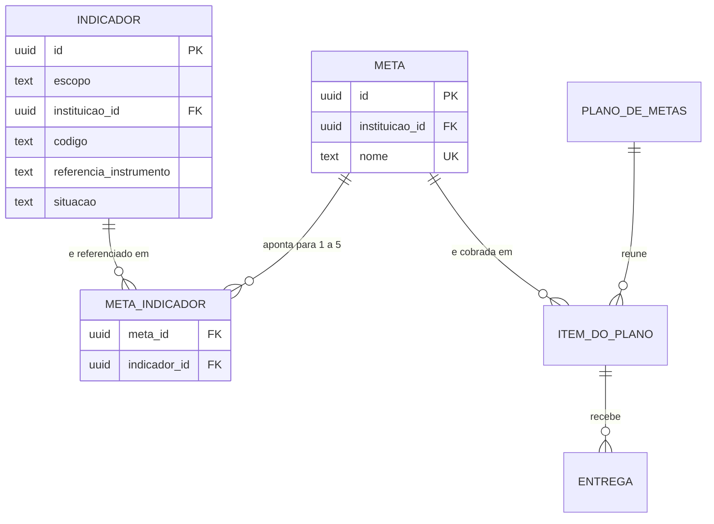

# Spec: indicadores (Indicador e Meta — os dois catálogos)

**Data desta versão:** 28/09/2026 · **3ª versão — catálogo do INEP comum à instalação e meta com vários indicadores**
**Status:** em validação pelo dono do produto
**Contexto:** `specs/00-visao-produto.md` · `specs/autenticacao-usuarios/spec.md` ·
`specs/cursos/spec.md` · Stack: `project.config.md`
**Nível de rigor:** **completo**. Deixou de ser spec leve quando o catálogo do INEP
passou a ser **compartilhado entre instituições** (3.1): é a primeira informação
que atravessa a fronteira de isolamento do sistema, e isso exige o rigor de uma
decisão de segurança, não o de um CRUD.

> Cobre o **Indicador**, em seus dois escopos — o **catálogo do INEP, comum à
> instalação**, e os **indicadores próprios de cada instituição** —, e a **Meta**,
> que aponta para **um ou mais** indicadores.
>
> **Não repete o contexto de `autenticacao-usuarios`** — conjunto de perfis,
> isolamento por instituição, 404 para recurso de outra instituição, ordem
> permissão→isolamento, padrão de CRUD, campos base, concorrência otimista,
> deleção lógica, paginação e formato de erro são herdados.
>
> **Quem usa estes catálogos é `specs/plano-acao/`.**

---

## 0. O que mudou nesta versão

| Antes | Agora |
|---|---|
| Cada instituição cadastrava os próprios indicadores do INEP | **O catálogo do INEP é único da instalação**, mantido pelo **Administrador do Sistema** (3.1) |
| Uma meta, um indicador | **Uma meta, um ou mais indicadores** — N:N, com pelo menos um (3.2) |
| Administrador do Sistema não tinha nada aqui | Ganha **tela e item de menu próprios** para o catálogo do INEP (3.1, 3.6) |

As duas decisões vieram do dono. A segunda tem um caso que a decidiu:

> A ata de reunião do NDE atende o indicador de **funcionamento do NDE** e o de
> **atuação do coordenador**. Com um indicador só, a instituição duplicaria a meta
> para contar nos dois lugares — **e passaria a exigir o dobro de entregas do
> coordenador**.

É por isso que a apuração precisa da regra de 3.3: **uma entrega atende todos os
indicadores da meta de uma vez, e nunca é contada duas vezes.**

---

## 1. Onde isto entra

```
Indicador — escopo PLATAFORMA (catálogo do INEP, do Administrador do Sistema)
Indicador — escopo INSTITUIÇÃO (próprio da IES, do Pesquisador Institucional)
        ↑ N:N, pelo menos um
      Meta (catálogo da instituição)
        ↑
Curso + Período ──> Plano de Ação Curso/Coordenador ──> Item do plano (meta + quantidade)
                                                      │
                                                      └─> Entrega ─> Anexos
```

**A cadeia de rastreabilidade:**

```
plano → item → meta → indicador(es) → (quando for do INEP) referência do instrumento
```

É por ela que se responde **"quais indicadores do instrumento este curso está
atendendo"**. A informação de INEP existe **num único lugar** — o indicador de
escopo plataforma —, e agora num único lugar **da instalação inteira**.

---

## 2. Premissas declaradas

Recomendação do analista, **não decisão tomada**.

| # | Premissa | Se for rejeitada |
|---|---|---|
| **PI-1** | **Uma entidade `indicador` com `escopo`** (plataforma / instituição), em vez de duas tabelas (3.1) | Duas entidades, e a meta passa a precisar de dois vínculos ou de referência polimórfica — com N:N, duas tabelas de associação |
| **PI-2** | **A referência do instrumento é texto livre**, obrigatória no escopo plataforma. Ex.: "Instrumento de Avaliação de Cursos de Graduação 2017 — Dimensão 1, indicador 1.4" | Entra catálogo estruturado (instrumento, versão, dimensão, número) — ver roadmap |
| **PI-3** | **Código único por escopo:** no catálogo do INEP, único na instalação; nos institucionais, único por instituição. **Nome da meta é único por instituição** (3.4), **comparado por forma normalizada** (sem diferenciar maiúsculas nem espaços nas pontas: `"Engenharia Civil"`, `"engenharia civil"` e `" Engenharia Civil "` são o mesmo nome). **A unicidade é garantida por índice do banco sobre a forma normalizada** — verificação só na aplicação não sobrevive a duas telas salvando ao mesmo tempo. | Permitir homônimos, e as telas precisam de outro jeito de distinguir |
| **PI-4** | **A meta aponta para 1 a 5 indicadores.** O limite superior existe para que "esta meta atende tudo" não vire prática (3.2) | Tirar o teto, e a cobertura passa a ter metas que dizem cobrir dez indicadores com uma entrega |
| **PI-5** | **O Administrador do Sistema vê apenas a contagem total de uso** de um indicador do INEP, nunca quais instituições o usam (3.5) | Ele passa a enxergar o uso por instituição, o que contraria o desenho de privacidade de `autenticacao-usuarios` 3.16 |
| **PI-6** | **Volume:** algumas centenas de indicadores no catálogo do INEP, algumas dezenas de próprios e algumas centenas de metas por instituição | Rever a decisão de não paginar os autocompletes |

---

## 3. Decisões de comportamento

### 3.1 Indicador tem dois escopos — e o do INEP é comum à instalação

**Decisão do dono.** O instrumento de avaliação é o mesmo para todas as IES;
cadastrá-lo uma vez por instituição faria três instituições digitarem o mesmo
indicador 1.4 com números e nomes divergentes, e a divergência só apareceria quando
alguém comparasse relatórios.

| Escopo | Quem mantém | Pertence a | Quem lê |
|---|---|---|---|
| **`plataforma`** — catálogo do INEP | **Administrador do Sistema** | ninguém; é da instalação | **todas as instituições**, somente leitura |
| **`instituicao`** — indicador próprio | **Pesquisador Institucional (PI)** | uma instituição | só ela |

#### Uma entidade, não duas (PI-1)

**Decisão:** uma tabela `indicador`, com `escopo` e com `instituicao_id` **nulo
quando o escopo é plataforma**.

Pesei as alternativas contra o caso que o coordenador levantou — **um indicador
institucional que depois passa a referenciar um do INEP**:

| Alternativa | Como se sai |
|---|---|
| **Duas entidades separadas** | A meta precisaria de dois vínculos, e com N:N (3.2) seriam **duas tabelas de associação**, duas contagens de cobertura e dois autocompletes. Todo consumidor pagaria o preço de uma distinção que só importa a esta spec |
| **Uma entidade com escopo** ✅ | Um vínculo, um autocomplete, uma contagem. O custo é uma **exceção nomeada** no filtro de instituição (3.7) |

**E o indicador institucional que depois "passa a referenciar" um do INEP não é um
problema de conversão — é um caso que o N:N já resolve.** A instituição não
transforma o indicador dela em indicador do INEP (não é dela para transformar):
ela **aponta a meta para os dois** — o próprio e o do instrumento. É mais honesto,
porque preserva a existência do indicador institucional, que tem nome e finalidade
próprios, e ainda assim credita o do INEP na cobertura. **Não existe, portanto,
operação de conversão de escopo**, e a ausência dela é decisão, não esquecimento.

#### Campos

| Campo | Regra |
|---|---|
| `escopo` | **obrigatório**, `plataforma` ou `instituicao`. **Imutável após a criação** → 400 `ESCOPO_IMUTAVEL` |
| `instituicao_id` | **nulo** no escopo plataforma; **obrigatório** no institucional, tomado da sessão |
| `codigo` | obrigatório, único por escopo (PI-3) |
| `nome` | obrigatório |
| `descricao` | opcional, texto simples multilinha |
| `derivado_inep` | **decorre do escopo**: verdadeiro em `plataforma`, falso em `instituicao`. Não é campo editável — ver abaixo |
| `referencia_instrumento` | **obrigatória** no escopo plataforma; **proibida** no institucional → 400 `REFERENCIA_INSTRUMENTO_INVALIDA` |
| `situacao` | **ativo / inativo** |
| campos base | `id` UUIDv7 gerado no domínio, `criado_em`, `atualizado_em`, `excluido_em`, `versao` |

**O sinalizador "derivado do INEP" deixou de ser caixa de marcar e virou
consequência do escopo.** Antes ele existia porque os dois tipos conviviam na mesma
tabela da mesma instituição; agora quem cadastra no catálogo comum é outro ator, em
outra tela. Manter a caixa permitiria um indicador institucional se declarar do
INEP sem estar no catálogo do instrumento — exatamente o que a centralização veio
impedir.

### 3.2 Meta aponta para um ou mais indicadores

**Decisão do dono.** Meta ↔ Indicador é **muitos para muitos**, com **pelo menos
um** → 400 `INDICADOR_OBRIGATORIO`, e **no máximo cinco** (PI-4) → 400
`INDICADORES_ACIMA_DO_LIMITE`.

| Campo da meta | Regra |
|---|---|
| `nome` | obrigatório, único por instituição (PI-3) |
| `descricao` | opcional, texto simples multilinha |
| **indicadores** | **1 a 5**, cada um **ativo** e **visível à instituição** — isto é, do catálogo do INEP ou próprio dela; de outra instituição → **404** |
| `situacao` | **ativo / inativo** |
| campos base | idem indicador |

**Não existe meta sem indicador**, em nenhuma rota, seed ou migração. Duas
consequências que valem por si: a cobrança nunca fica sem propósito declarado, e a
cobertura não tem a caixa "metas sem indicador", porque não existe o caso.

**A meta pode misturar os dois escopos** — é o caso da ata de NDE apontando para o
indicador do instrumento **e** para um indicador de gestão da instituição. Não há
restrição de combinação.

**A meta não tem quantidade, período nem curso**, e **não tem nenhum campo
apontando para o INEP**: a informação de instrumento aparece na tela derivada dos
indicadores escolhidos, e nunca é editável ali (3.4).

### 3.3 Uma entrega atende todos os indicadores da meta — e nunca conta duas vezes

É a regra que o caso do dono exige, e é a mais fácil de implementar errado.

> A meta "Registrar reuniões de NDE em ata" aponta para **1.4** (funcionamento do
> NDE) e **1.5** (atuação do coordenador). O item do plano exige **4**. O
> coordenador faz **4 entregas** — não 8.
>
> Cada entrega aceita **atende os dois indicadores de uma vez**.

**Regras de apuração, em todos os lugares que contam:**

1. **A unidade de contagem é o item do plano**, nunca o par (item, indicador). O
   cumprimento é `aceitas ÷ quantidade do item`, e o número de indicadores da meta
   **não entra na conta em nenhum ponto**.
2. **No relatório de desempenho** (`metas-coordenacao`), a linha continua sendo
   **uma por item**, e a coluna de indicador passa a ser **lista**. Filtrar por
   indicador traz a linha **uma única vez**, mesmo quando dois indicadores da meta
   casam com o filtro — deduplicação explícita, não efeito colateral de `DISTINCT`.
3. **Na cobertura de indicadores** (roadmap), um indicador é **atendido** quando
   existe ao menos um item cumprido de meta que o referencia. **Não se somam
   entregas por indicador**, porque a mesma entrega apareceria em dois lugares e o
   total superaria o esforço real.
4. **Nunca multiplicar a entrega pelo número de indicadores** — dito assim, de
   forma negativa, porque é a implementação intuitiva e errada.

### 3.4 A informação de instrumento é derivada, nunca editável na meta

Ao selecionar os indicadores, a tela de meta mostra, **em texto estático**, de qual
escopo cada um é e, quando do INEP, a referência do instrumento.

**Um campo editável ali criaria a mesma informação em dois lugares**, e o dia em que
o Administrador corrigisse a referência no catálogo comum e a meta continuasse com
a antiga produziria duas respostas para a mesma pergunta, sem forma de saber qual
vale. O `code-reviewer` deve tratar como achado qualquer coluna de INEP na tabela
de meta.

**Texto simples, sem editor rico**, nos campos de descrição dos dois catálogos.

### 3.5 O que o Administrador do Sistema faz — e o que ele continua não vendo

Até aqui ele administrava **instituições** e **outros administradores**
(`autenticacao-usuarios`, 3.16). Ganha **uma terceira responsabilidade**: o
**catálogo de indicadores do INEP**.

**O que ele faz:** cria, edita, inativa, reativa e exclui indicadores de escopo
plataforma. Nada mais.

**O que ele continua não vendo** — e isto é decisão de privacidade, não limitação
técnica, exatamente como a visão já registrou:

- **Nenhuma meta, plano, curso, entrega ou anexo de instituição nenhuma.**
- **Quais instituições usam um indicador.** Ele vê **apenas a contagem total de
  metas que o referenciam, somadas todas as instituições** (PI-5) — número
  agregado, que não identifica ninguém e serve ao único propósito para o qual ele
  precisa dele: saber que o indicador está em uso antes de mexer nele.
- **Indicadores institucionais.** O catálogo próprio de cada IES é invisível para
  ele, e pedir um responde **404**.

### 3.6 Alterar e inativar o catálogo comum

O Administrador mexe num registro usado por planos de **várias instituições ao
mesmo tempo**. Regras:

| Operação | Comportamento |
|---|---|
| **Editar nome, descrição ou referência** | **Permitido**, e vale para todas as instituições **imediatamente**. É correção de catálogo: o texto do instrumento é o mesmo para todos, e manter a versão errada em quem já usa seria pior. Auditado com valor anterior e novo, com syslog |
| **Editar o código** | **Permitido**, com a mesma regra, e é a alteração mais sensível — o código é o que as pessoas usam para se referir ao indicador. Auditado com antes e depois, e a confirmação mostra a contagem de metas afetadas |
| **Inativar** | **Permitido.** Some dos autocompletes de **todas** as instituições. **As metas que já o referenciam continuam funcionando, continuam cobrando e continuam contando na cobertura**, exibidas com "(inativo)". Inativação decide sobre o **futuro**, nunca sobre o que está em execução |
| **Excluir (lógico)** | **Só enquanto nenhuma meta, de nenhuma instituição, o referenciar** → 409 `INDICADOR_COM_META`. A mensagem informa **a contagem total**, sem identificar instituições (PI-5) |
| **Alterar o escopo** | **Não existe** (3.1) → 400 `ESCOPO_IMUTAVEL` |

**O que nunca acontece:** um plano vigente perder metas, ou uma meta perder
indicadores, porque alguém arrumou o catálogo. A falha seria **silenciosa** — o
número simplesmente diminuiria — e atravessaria instituições, que é o pior lugar
para uma falha silenciosa estar.

**A mesma regra vale para o PI sobre os indicadores próprios dele**, e para a meta:
inativar não afeta plano vigente; excluir é bloqueado quando há uso → 409
`META_EM_PLANO`.

**Trocar os indicadores de uma meta** é permitido e vale dali em diante, inclusive
para planos vigentes — a meta é a mesma, e o que mudou foi a leitura institucional
de a quais indicadores ela responde. Auditado com antes e depois (10).

### 3.7 Isolamento: a primeira informação compartilhada do sistema

Até aqui, **nenhum dado atravessava a fronteira da instituição**. O catálogo do
INEP é a primeira exceção, e ela precisa estar escrita com todas as letras para não
virar precedente nem buraco.

**Por que não fere o isolamento:**

1. **O catálogo comum não é dado de ninguém.** É o texto de um instrumento público
   do MEC — os mesmos indicadores que qualquer pessoa lê no documento oficial.
   Não há dado pessoal, não há dado de negócio de nenhuma IES, e duas instituições
   lendo o mesmo indicador não aprendem nada uma sobre a outra.
2. **A leitura é universal; a escrita é de um ator só.** Toda instituição lê;
   **nenhuma edita, inativa ou exclui** → 403 `PERMISSAO_NEGADA` para o PI em
   qualquer escrita sobre escopo plataforma.
3. **Nada sobre o uso atravessa.** Uma instituição **não descobre** que outra usa o
   indicador, nem quantas metas ela tem. A contagem de uso que aparece **para o PI**
   é a **dele**; a que aparece para o Administrador é o **total agregado** (3.5).

**Como o filtro centralizado do adapter muda — e por que a mudança é segura:**

```
antes:  instituicao_id = :instituicao_da_sessao
depois: instituicao_id = :instituicao_da_sessao  OR  escopo = 'plataforma'
```

É **uma exceção, nomeada, confinada a uma tabela**. O argumento de segurança que a
sustenta: **a cláusula `escopo = 'plataforma'` é incapaz, por construção, de
retornar linha de outra instituição**, porque linha de escopo plataforma **não tem
instituição**. Não é uma frouxidão no filtro — é um segundo conjunto, disjunto do
primeiro, cuja união não alcança dado de terceiro.

**Restrições que acompanham a exceção:**

- A exceção vale **só na tabela `indicador`**. Qualquer outra consulta que a
  reproduza é achado para o `code-reviewer`.
- **Meta, plano, item, entrega e anexo continuam com o filtro sem exceção alguma.**
- O par `(escopo, instituicao_id)` precisa ser coerente: plataforma com instituição
  preenchida, ou institucional sem instituição, é **dado corrompido** e deve ser
  impedido por restrição de banco, não só por validação de aplicação.
- **A unicidade do código tem a mesma armadilha que a autenticação já enfrentou**
  (3.7 daquela spec): `NULL` em índice único é tratado como distinto, então o
  catálogo comum precisa de tratamento próprio — `NULLS NOT DISTINCT` ou índice
  único parcial `WHERE escopo = 'plataforma'`. Decisão do `dba`; o que não se aceita
  é deixar como está e permitir dois indicadores `1.4` no catálogo comum.

### 3.8 Quem enxerga o quê

| Quem | Catálogo do INEP (plataforma) | Indicadores próprios | Meta |
|---|---|---|---|
| **Administrador do Sistema** | **CRUD completo** | **Nada — 404** | **Nada — 404** |
| **Pesquisador Institucional** | **Leitura**; escrita → 403 | CRUD completo, na própria instituição | CRUD completo |
| **Coordenador de Curso** | **Leitura, como contexto** — o indicador aparece em `Minhas metas`, na entrega e no relatório | idem | Leitura como contexto; listagem → 403 |
| Quem só tem **Professor** e/ou **Aluno** | Nada — 403 | Nada — 403 | Nada — 403 |

O coordenador **precisa** ver os indicadores da meta: é o que transforma "anexe
quatro atas" em "anexe quatro atas porque os indicadores 1.4 e 1.5 exigem evidência
de funcionamento do NDE e de atuação da coordenação".

**O Administrador recebe 404, não 403, ao pedir indicador institucional ou meta** —
diferente do resto do sistema, onde a negação a ele é de perfil. Aqui ele **tem**
permissão sobre a entidade `indicador`; o que não tem é alcance àquele registro, e
403 confirmaria que ele existe. É a mesma regra de recurso fora do recorte do ator.

### 3.9 Grids

Padrão obrigatório do `CLAUDE.md`, **sem exceção**, nos três: filtro no topo,
**grid só após "Pesquisar"**, estado persistido no navegador por tela.

**Catálogo do INEP** — `/app/indicadores-inep` (Administrador do Sistema)

| Item | Definição |
|---|---|
| **Filtros** | Código ou nome; Situação (padrão **Ativos**) |
| **Colunas** | Código · Nome · Referência do instrumento · Situação · **Metas (total na instalação)** · Ações |
| **Ordenáveis** | Código, Nome, Cadastrado em · **Padrão Código crescente**, página 20 |

**Indicadores** — `/app/indicadores` (PI)

| Item | Definição |
|---|---|
| **Filtros** | Código ou nome; **Origem** (Todos / Do INEP / Próprios); Situação (padrão **Ativos**) |
| **Colunas** | Código · Nome · **Origem** · Referência do instrumento · Situação · Metas (**da instituição**) · Ações |
| **Ações** | Só nas linhas de origem **Próprio**. As do INEP são **somente leitura**, com o motivo em texto |
| **Padrão** | **Código crescente**, página 20 |

**Metas** — `/app/metas` (PI)

| Item | Definição |
|---|---|
| **Filtros** | Nome; Indicador; Origem do indicador; Situação (padrão **Ativas**) |
| **Colunas** | Nome · **Indicadores** (lista) · Origem · Situação · Planos · Ações |
| **Padrão** | **Nome crescente**, página 20 |

Filtrar meta por indicador traz a meta **uma vez**, mesmo que mais de um indicador
dela case com o filtro (3.3, regra 2).

---

## 4. Fluxos

**Fluxo 1 — Montar o catálogo do INEP (Administrador do Sistema).** Menu "Sistema →
Indicadores do INEP"; "Novo" pede código, nome, descrição e a referência do
instrumento, obrigatória. Vale para todas as instituições assim que salvo.

**Fluxo 2 — Corrigir um indicador do INEP em uso.** Edita; a confirmação informa
**quantas metas** serão afetadas, na instalação inteira, **sem dizer de quem**.

**Fluxo 3 — Cadastrar indicador próprio (PI).** Menu "Metas →
Indicadores"; "Novo"; **não há campo de referência do instrumento** e não há caixa
de "derivado do INEP" — o escopo é institucional por ser essa a tela.

**Fluxo 4 — Cadastrar meta (PI).** Menu "Metas → Catálogo de metas"; "Nova"; nome,
descrição e **de um a cinco indicadores**, escolhidos numa lista única que mistura
os do INEP e os próprios, cada um marcado com a origem. A tela mostra, em texto
estático, a referência de instrumento dos que vierem do INEP.

**Fluxo 5 — Aposentar uma meta (PI).** Inativa. Some dos autocompletes de novos
itens de plano; **os planos vigentes que a usam continuam cobrando**, e a
confirmação diz isso.

---

## 5. Fluxos alternativos e de erro

| Condição | Comportamento |
|---|---|
| Código, nome ou escopo ausentes | 400 · mensagem junto ao campo |
| Código repetido **no catálogo do INEP** | 409 `CODIGO_INDICADOR_DUPLICADO` |
| Código repetido **entre os próprios da instituição** | 409 `CODIGO_INDICADOR_DUPLICADO` |
| Mesmo código existindo no INEP e como próprio de uma IES | **Permitido** — escopos diferentes, unicidade por escopo (PI-3) |
| Referência do instrumento vazia em indicador do INEP | 400 `REFERENCIA_INSTRUMENTO_INVALIDA` |
| Referência do instrumento preenchida em indicador próprio | 400 `REFERENCIA_INSTRUMENTO_INVALIDA` |
| Tentar alterar o escopo de um indicador | 400 `ESCOPO_IMUTAVEL` |
| **PI editando, inativando ou excluindo indicador do INEP** | **403** `PERMISSAO_NEGADA` (3.7) |
| **Administrador pedindo indicador institucional ou meta** | **404** `NAO_ENCONTRADO` (3.8) |
| Nome de meta repetido na instituição | 409 `NOME_META_DUPLICADO` |
| **Meta sem nenhum indicador** | **400 `INDICADOR_OBRIGATORIO`** |
| Meta com mais de cinco indicadores | 400 `INDICADORES_ACIMA_DO_LIMITE` |
| Indicador repetido na mesma meta | 400 `INDICADOR_DUPLICADO_NA_META` |
| Indicador **inativo** escolhido em meta nova | 400 `INDICADOR_INATIVO` |
| Indicador institucional de **outra** instituição | **404** `NAO_ENCONTRADO` |
| Campo de INEP enviado na rota de meta | 400 — a informação é derivada (3.4) |
| Excluir indicador referenciado por meta | 409 `INDICADOR_COM_META` |
| Excluir meta usada em item de plano | 409 `META_EM_PLANO` |
| Dois PIs, ou dois administradores, no mesmo registro | 409 `CONFLITO_DE_VERSAO` · **nunca** salvar por cima |
| Coordenador na listagem de catálogo | 403 `PERMISSAO_NEGADA` |
| Professor ou aluno em qualquer rota daqui | 403 `PERMISSAO_NEGADA` |
| `sort` fora da lista fechada | 400 — nunca ignorado em silêncio |

---

## 6. Critérios de aceite (Given/When/Then)

> Dados na seção 7. Famílias: `IE` catálogo do INEP, `IN` indicador próprio,
> `MC` meta, `IV` visibilidade, isolamento e autorização.
> Identificador retirado nunca é reaproveitado.

### 6.1 Catálogo do INEP (escopo plataforma)

```gherkin
Cenário IE-01: o Administrador do Sistema monta o catálogo
  Dado Rafael Toledo autenticado como Administrador do Sistema
  Quando ele cadastra "1.4", "Núcleo Docente Estruturante", com a referência
        "Instrumento de Avaliação de Cursos de Graduação 2017 - Dimensão 1,
        indicador 1.4"
  Então responde 201 com escopo "plataforma" e instituicao_id NULO
    E o indicador passa a estar disponível para TODAS as instituições

Cenário IE-02: referência é obrigatória no catálogo do INEP
  Quando Rafael salva sem a referência do instrumento
  Então responde 400 "REFERENCIA_INSTRUMENTO_INVALIDA"

Cenário IE-03: código único na instalação inteira
  Quando Rafael tenta cadastrar outro "1.4" no catálogo do INEP
  Então responde 409 "CODIGO_INDICADOR_DUPLICADO"
    E a unicidade vale sobre a instalação, não por instituição
    E um indicador PRÓPRIO de código "1.4" numa IES é permitido, porque a
      unicidade é por escopo

Cenário IE-04: nenhuma instituição escreve no catálogo comum
  Quando Maria, PI da FSA, tenta editar, inativar ou excluir "1.4"
  Então cada operação responde 403 "PERMISSAO_NEGADA"
    E ela continua podendo LER e usar em metas

Cenário IE-05: correção do catálogo vale para todas, imediatamente
  Dado "1.4" referenciado por metas da FSA e do IVV
  Quando Rafael corrige a referência do instrumento
  Então as metas das DUAS instituições passam a exibir a referência corrigida
    E nenhuma edição é feita em nenhuma meta
    E a auditoria registra o valor anterior e o novo

Cenário IE-06: inativar no catálogo comum não quebra nada
  Dado "GEST-INEP-9" do catálogo, usado por metas de duas instituições, uma
        delas em plano vigente
  Quando Rafael o inativa
  Então responde 200
    E as metas continuam apontando para ele
    E os planos vigentes continuam cobrando e contando
    E ele some do autocomplete de TODAS as instituições
    E as telas o exibem com "(inativo)"

Cenário IE-07: excluir do catálogo comum é bloqueado por uso de qualquer IES
  Dado "1.4" usado por uma meta do IVV e nenhuma da FSA
  Quando Rafael tenta excluí-lo
  Então responde 409 "INDICADOR_COM_META"
    E a mensagem informa a contagem TOTAL de metas
    E NÃO informa quais instituições, nem a contagem por instituição

Cenário IE-08: o escopo é imutável
  Quando alguém tenta transformar um indicador próprio em indicador do INEP,
        ou o contrário
  Então responde 400 "ESCOPO_IMUTAVEL"
    E o caso de "meu indicador agora corresponde a um do INEP" se resolve
      apontando a meta para os dois (MC-06)

Cenário IE-09: o Administrador não alcança o que não é dele
  Quando Rafael pede um indicador institucional da FSA, uma meta ou um plano
  Então cada um responde 404 "NAO_ENCONTRADO"
    E NÃO responde 403, que confirmaria a existência

Cenário IE-10: dois administradores no mesmo indicador
  Quando Rafael e Helena salvam o mesmo indicador a partir da versao 1
  Então a segunda recebe 409 "CONFLITO_DE_VERSAO"
```

### 6.2 Indicadores próprios da instituição

```gherkin
Cenário IN-01: indicador próprio
  Dado Maria Souza autenticada como Pesquisadora Institucional da FSA
  Quando ela cadastra "GEST-01", "Reuniões com representação discente"
  Então responde 201 com escopo "instituicao" e a instituição da sessão
    E NÃO existe campo de referência do instrumento na tela
    E NÃO existe caixa de "derivado do INEP" - o escopo vem da tela

Cenário IN-02: referência proibida em indicador próprio
  Quando a API recebe referência do instrumento numa rota de indicador
        próprio
  Então responde 400 "REFERENCIA_INSTRUMENTO_INVALIDA"

Cenário IN-03: código único por instituição
  Quando Maria tenta cadastrar outro "GEST-01" na FSA
  Então responde 409 "CODIGO_INDICADOR_DUPLICADO"
    E Renata pode cadastrar "GEST-01" no IVV sem conflito

Cenário IN-04: inativar não afeta o que já está em uso
  Dado "GEST-02" referenciado por uma meta em plano vigente
  Quando Maria o inativa
  Então a meta continua apontando para ele e o plano continua cobrando
    E ele some do autocomplete de nova meta

Cenário IN-05: indicador próprio com meta não é excluído
  Quando Maria tenta excluir "GEST-01", referenciado por meta
  Então responde 409 "INDICADOR_COM_META"
  Quando exclui um recém-criado, sem meta
  Então responde 204, com exclusão lógica

Cenário IN-06: filtro por origem
  Quando Maria filtra por "Do INEP"
  Então vê apenas os de escopo plataforma, todos somente leitura
    E "Próprios" traz exatamente o complemento, com as ações disponíveis

Cenário IN-07: a tela abre sem executar consulta
  Então Maria vê a área de filtro e o botão "Novo", o grid não aparece, e
        nenhuma consulta é executada
```

### 6.3 Meta

```gherkin
Cenário MC-01: meta com um indicador
  Quando Maria cadastra "Relatório de acompanhamento do curso" apontando
        para o indicador "1.5"
  Então responde 201
    E a meta NÃO tem quantidade, período nem curso
    E a meta NÃO tem nenhum campo apontando para o INEP

Cenário MC-02: meta com vários indicadores
  Quando Maria cadastra "Registrar reuniões de NDE em ata" apontando para
        "1.4" e "1.5"
  Então responde 201 com os DOIS vínculos
    E a tela exibe a origem e a referência de cada um, em texto estático

Cenário MC-03: meta sem indicador é recusada
  Quando Maria tenta salvar uma meta sem nenhum indicador
  Então responde 400 "INDICADOR_OBRIGATORIO" e nada é criado
    E o mesmo acontece ao editar, tentando remover o último
    E não existe rota, seed ou migração que crie meta sem indicador

Cenário MC-04: limites e duplicidade na lista
  Quando a meta recebe seis indicadores
  Então responde 400 "INDICADORES_ACIMA_DO_LIMITE"
  Quando recebe o mesmo indicador duas vezes
  Então responde 400 "INDICADOR_DUPLICADO_NA_META"

Cenário MC-05: uma entrega atende todos os indicadores da meta
  Dado a meta de MC-02, apontando para 1.4 e 1.5
    E um item de plano exigindo 4
  Quando o coordenador registra 4 entregas e todas são aceitas
  Então o item aparece como cumprido com 4 de 4
    E o coordenador NÃO precisou fazer 8 entregas
    E em nenhum lugar a quantidade exigida foi multiplicada pelo número de
      indicadores
    E os dois indicadores são considerados atendidos por essas mesmas 4

Cenário MC-06: misturar escopos na mesma meta
  Quando Maria aponta a meta para "1.4", do INEP, e "GEST-01", próprio
  Então responde 201 - não há restrição de combinação
    E é assim que um indicador institucional passa a conviver com o do
      instrumento, sem conversão de escopo (IE-08)

Cenário MC-07: indicador inativo e indicador de outra instituição
  Dado "GEST-02" inativo
  Quando Maria tenta incluí-lo em meta nova
  Então responde 400 "INDICADOR_INATIVO"
  Quando ela envia um indicador próprio do IVV
  Então responde 404 "NAO_ENCONTRADO", nunca 403 nem 400

Cenário MC-08: a informação de instrumento é derivada, nunca editável
  Quando Maria escolhe "1.4"
  Então a tela exibe "Do INEP - Instrumento de Avaliação de Cursos de
        Graduação 2017 - Dimensão 1, indicador 1.4"
    E NÃO existe campo editável de INEP no formulário de meta
    E, se a API receber um campo desses, responde 400
  Quando Rafael corrige a referência no catálogo do INEP
  Então a meta passa a exibir a corrigida, sem nenhuma edição nela

Cenário MC-09: nome repetido na instituição
  Quando Maria tenta cadastrar outra meta com o mesmo nome
  Então responde 409 "NOME_META_DUPLICADO"

Cenário MC-10: inativar meta não afeta plano vigente
  Quando Maria inativa uma meta usada em item de plano vigente
  Então o item continua cobrando, contando e aceitando entregas
    E a meta some do autocomplete de novo item de plano

Cenário MC-11: meta em plano não é excluída
  Quando Maria tenta excluir uma meta usada em item de plano
  Então responde 409 "META_EM_PLANO"

Cenário MC-12: a mesma meta em planos diferentes, com quantidades diferentes
  Quando a meta entra no plano de Engenharia exigindo 4 e no de Pedagogia
        exigindo 2
  Então o enunciado é o MESMO registro de catálogo
    E as quantidades são independentes, cada uma no seu item de plano

Cenário MC-13: trocar os indicadores da meta vale dali em diante
  Dado a meta apontando para "1.5"
  Quando Maria acrescenta "2.1" e remove "1.5"
  Então responde 200
    E os planos vigentes que a usam continuam cobrando, sem alteração
    E a rastreabilidade passa a apontar para "2.1"
    E a auditoria registra a lista anterior e a nova

Cenário MC-14: filtrar meta por indicador não duplica a meta
  Dado a meta de MC-02, com 1.4 e 1.5
  Quando Maria filtra por origem "Do INEP"
  Então a meta aparece UMA vez, não duas
    E o mesmo vale ao filtrar por um indicador específico

Cenário MC-15: primeira meta sem nenhum indicador disponível
  Dado uma instituição sem indicadores próprios e com o catálogo do INEP
        vazio
  Quando Maria abre o cadastro de meta
  Então a tela informa que é preciso haver ao menos um indicador
    E indica que o catálogo do INEP é mantido pelo Administrador do Sistema
    E oferece o caminho para cadastrar um indicador próprio
```

### 6.4 Visibilidade, isolamento e autorização

```gherkin
Cenário IV-01: o catálogo do INEP é lido por todas as instituições
  Dado o indicador "1.4" no catálogo comum
  Quando Maria (FSA) e Renata (IVV) abrem o autocomplete de indicador
  Então as duas o enxergam, com a mesma referência
    E nenhuma delas descobre nada sobre a outra ao lê-lo

Cenário IV-02: o indicador próprio não atravessa a fronteira
  Dado "GEST-01" próprio da FSA
  Quando Renata, do IVV, pesquisa, filtra ou pede esse indicador
  Então ele NÃO aparece em nenhuma listagem dela
    E pedir pelo identificador responde 404 "NAO_ENCONTRADO"

Cenário IV-03: a contagem de uso não vaza entre instituições
  Dado "1.4" usado por 3 metas da FSA e 2 do IVV
  Então a tela de Maria mostra 3 - só as dela
    E a tela de Renata mostra 2 - só as dela
    E a tela de Rafael mostra 5, o total, sem separar por instituição

Cenário IV-04: a exceção do filtro não alcança outra instituição
  Dado um teste que exercite a consulta de indicadores com a exceção de
        escopo ativa
  Então nenhuma linha de instituição diferente da sessão é retornada
    E a única linha sem instituição retornada é de escopo plataforma
    E um teste falha se a exceção for ampliada para além de escopo

Cenário IV-05: a exceção vale só na tabela de indicador
  Dado um teste que remova o filtro de instituição do adapter para meta,
        plano, item, entrega ou anexo
  Então pelo menos um teste de isolamento falha em cada uma dessas entidades

Cenário IV-06: escopo e instituição são coerentes
  Quando se tenta gravar escopo plataforma com instituição preenchida, ou
        escopo institucional sem instituição
  Então a gravação é impedida pelo banco, não apenas pela aplicação

Cenário IV-07: o coordenador lê, não administra
  Quando Ana abre uma entrega, vê o nome da meta e os indicadores dela
  Quando ela chama a listagem de indicadores ou a de metas
  Então responde 403 "PERMISSAO_NEGADA"

Cenário IV-08: professor e aluno não veem nada daqui
  Quando Ávila ou Letícia chamam qualquer rota daqui
  Então responde 403 "PERMISSAO_NEGADA"

Cenário IV-09: permissão antes de isolamento
  Quando Ávila, professor da FSA, pede um indicador próprio do IVV
  Então responde 403 "PERMISSAO_NEGADA", não 404
```

---

## 7. Exemplos concretos com dados reais

Pessoas e instituições de `autenticacao-usuarios`, seção 8.

**Catálogo do INEP — da instalação, mantido por Rafael Toledo**

| Código | Nome | Referência do instrumento | Situação |
|---|---|---|---|
| **1.4** | Núcleo Docente Estruturante | Instrumento de Avaliação de Cursos de Graduação 2017 — Dimensão 1, indicador 1.4 | Ativo |
| **1.5** | Coordenação de curso | Instrumento de Avaliação de Cursos de Graduação 2017 — Dimensão 1, indicador 1.5 | Ativo |
| **2.1** | Núcleo de apoio ao discente | Instrumento de Avaliação de Cursos de Graduação 2017 — Dimensão 2, indicador 2.1 | Ativo |
| **3.2** | Acompanhamento de egressos | Instrumento de Avaliação de Cursos de Graduação 2017 — Dimensão 3, indicador 3.2 | **Inativo** — `IE-06` |

**Indicadores próprios da FSA** (mantidos por Maria Souza)

| Código | Nome | Situação |
|---|---|---|
| **GEST-01** | Reuniões com representação discente | Ativo |
| **GEST-02** | Painel interno de acompanhamento | **Inativo** — `IN-04`, `MC-07` |
| **1.4** | Comissão própria de NDE | Ativo — **mesmo código de um do INEP, escopo diferente** (`IE-03`) |

**Indicadores próprios do IVV:** `GEST-01` — homônimo do da FSA, e invisível para
ela (`IN-03`, `IV-02`).

**Metas da FSA** — todas com pelo menos um indicador

| Nome | Indicadores | Papel |
|---|---|---|
| **Registrar reuniões de NDE em ata** | **1.4 + 1.5** (INEP) | **o caso do dono** — `MC-02`, `MC-05`, `MC-14` |
| Relatório de acompanhamento do curso | 1.5 (INEP) | `MC-01` |
| Reunião semestral com representantes discentes | 1.4 (INEP) + GEST-01 (próprio) | mistura de escopos — `MC-06` |
| Plano de ensino revisado | 1.5 → **2.1** (INEP) | troca de indicadores em `MC-13` |
| Painel de indicadores do curso | GEST-02 *(inativo)* | meta ativa com indicador inativo (`IN-04`) |

| Cenário | Entrada | Resultado |
|---|---|---|
| `IE-03` | Segundo "1.4" no catálogo do INEP | 409; mas "1.4" **próprio** da FSA é permitido |
| `IE-04` | Maria tenta editar "1.4" do INEP | **403** `PERMISSAO_NEGADA` |
| `IE-05` | Rafael corrige a referência de "1.4" | metas da FSA **e** do IVV passam a exibir a nova |
| `IE-07` | Rafael tenta excluir "1.4", usado só pelo IVV | 409, com a contagem **total**, sem dizer de quem |
| `IE-09` | Rafael pede um indicador próprio da FSA | **404**, nunca 403 |
| **`MC-05`** | Meta com 1.4 e 1.5, item exigindo 4 | **4 entregas**, não 8; os dois indicadores atendidos |
| `MC-03` | Meta sem indicador | **400 `INDICADOR_OBRIGATORIO`** |
| `MC-14` | Filtrar metas por origem "Do INEP" | a meta de 1.4+1.5 aparece **uma vez** |
| `IV-03` | "1.4" com 3 metas na FSA e 2 no IVV | Maria vê 3 · Renata vê 2 · Rafael vê 5 |

---

## 8. LGPD

**Nenhuma das duas entidades contém dado pessoal.** Indicador e meta descrevem
exigências e enunciados, não pessoas — e isso vale em dobro para o catálogo comum,
que é **texto de documento público do MEC**.

- O que há é **dado de auditoria** — quem cadastrou e quando —, comum, com a
  retenção já declarada em `autenticacao-usuarios` (P9).
- **O compartilhamento do catálogo do INEP não é transferência de dado pessoal nem
  compartilhamento de base entre controladores**: nenhuma informação de uma
  instituição alcança outra (3.7). A contagem de uso que cada PI vê é a **dele**.
- **Minimização:** reprovou, no indicador, peso, nota, conceito obtido e histórico
  de avaliações; e, na meta, responsável sugerido, prazo padrão, modelo de
  comprovante **e qualquer campo de INEP** (3.4).
- **Sem dado sensível e sem identificador forte.**
- **Ambiente não-produtivo nunca recebe dado real** — o seed usa o catálogo da
  seção 7, com referências fictícias plausíveis.

---

## 9. Ações e respostas esperadas

| Ação | Caminho esperado | Sucesso | Erros |
|---|---|---|---|
| **Listar catálogo do INEP** (Administrador) | `GET /api/v1/plataforma/indicadores?busca=&situacao=&page=&page_size=&sort=&order=` | 200 `{ data, meta }`, com a **contagem total** de metas por linha | 400 · 401 · 403 |
| **Criar / atualizar** (Administrador) | `POST` · `PUT /api/v1/plataforma/indicadores/{id}` (`versao`) | 201 · 200 | 400 `REFERENCIA_INSTRUMENTO_INVALIDA` / `ESCOPO_IMUTAVEL` · 401 · 403 · 404 · 409 `CODIGO_INDICADOR_DUPLICADO` / `CONFLITO_DE_VERSAO` |
| **Inativar / reativar** (Administrador) | `PATCH /api/v1/plataforma/indicadores/{id}/situacao` (`versao`) | 200 | 400 · 401 · 403 · 404 · 409 `CONFLITO_DE_VERSAO` |
| **Excluir** (Administrador) | `DELETE /api/v1/plataforma/indicadores/{id}` | 204 | 401 · 403 · 404 · 409 `INDICADOR_COM_META` (com a contagem total) |
| Listar indicadores (PI) | `GET /api/v1/indicadores?busca=&origem=&situacao=&...` | 200 — **os próprios da instituição e os do INEP**, com a origem por linha e a contagem **da instituição** | 400 · 401 · 403 |
| Buscar indicador (PI) | `GET /api/v1/indicadores/{id}` | 200 (inclui `versao` e `escopo`) | 401 · 403 · **404** |
| Criar / atualizar indicador próprio | `POST /api/v1/indicadores` · `PUT /api/v1/indicadores/{id}` (`versao`) | 201 · 200 — **escopo institucional, imposto pela rota** | 400 `REFERENCIA_INSTRUMENTO_INVALIDA` · 401 · **403 em indicador do INEP** · 404 · 409 |
| Inativar / excluir indicador próprio | `PATCH .../situacao` · `DELETE /api/v1/indicadores/{id}` | 200 · 204 | 401 · **403 em indicador do INEP** · 404 · 409 `INDICADOR_COM_META` |
| Listar metas | `GET /api/v1/metas?busca=&indicador_id=&origem=&situacao=&...` | 200, com a **lista de indicadores** por meta, **sem duplicar a meta** | 400 · 401 · 403 |
| Buscar meta | `GET /api/v1/metas/{id}` | 200 (inclui `versao` e os indicadores com origem e referência) | 401 · 403 · **404** |
| Criar / atualizar meta | `POST /api/v1/metas` · `PUT /api/v1/metas/{id}` (`versao`) (`indicadores[]`) | 201 · 200 | 400 `INDICADOR_OBRIGATORIO` / `INDICADORES_ACIMA_DO_LIMITE` / `INDICADOR_DUPLICADO_NA_META` / `INDICADOR_INATIVO` · 401 · 403 · **404** · 409 `NOME_META_DUPLICADO` |
| Inativar / excluir meta | `PATCH .../situacao` · `DELETE /api/v1/metas/{id}` | 200 · 204 | 401 · 403 · 404 · 409 `META_EM_PLANO` |
| **Autocomplete de indicador** | `GET /api/v1/indicadores/sugestoes?busca=` | 200, limitado a 20, **só ativos**, **misturando os dois escopos**, com origem e referência | 400 · 401 · 403 |
| **Autocomplete de meta** | `GET /api/v1/metas/sugestoes?busca=` | 200, limitado a 20, **só ativas**, com os indicadores | 400 · 401 · 403 |

**Duas famílias de rotas de propósito:** `/api/v1/plataforma/indicadores` é do
Administrador e escreve no catálogo comum; `/api/v1/indicadores` é da instituição,
**lê os dois escopos e só escreve no próprio**. Separar as rotas torna a fronteira
de escrita visível no próprio caminho, em vez de depender de um `if` no handler.

**Paginação:** `page` (padrão 1), `page_size` (padrão **20**, máximo **100**).
**Listas fechadas de `sort`** — indicadores: `codigo`, `nome`, `escopo`,
`criado_em` (padrão `codigo asc`); metas: `nome`, `criado_em` (padrão `nome asc`).
Valor fora da lista é **400**, nunca interpolado em SQL.

**Sem criação inline** em nenhum dos autocompletes: criar indicador ou meta é
decisão de catálogo, e fazê-la no meio da montagem de um plano produz catálogo
duplicado em uma semana.

---

## 10. Auditoria

| Ação | Resultados | Quem | Sobre quem | Syslog |
|---|---|---|---|---|
| **`criar_indicador_inep`** · **`atualizar_indicador_inep`** · **`excluir_indicador_inep`** | `sucesso` · `negado` · `erro` | o **Administrador do Sistema** | o indicador comum, **com a contagem de metas afetadas** | ✅ **sempre** |
| **`inativar_indicador_inep`** / `reativar_indicador_inep` | `sucesso` · `negado` | o Administrador | idem | ✅ |
| `criar_indicador` · `atualizar_indicador` · `excluir_indicador` | `sucesso` · `negado` · `erro` | o PI | o indicador próprio | ✅ em `excluir` |
| `criar_meta` · `atualizar_meta` · `excluir_meta` | `sucesso` · `negado` · `erro` | o PI | a meta | ✅ em `excluir` |
| `acesso_negado` | `negado` | o autenticado | o recurso pretendido | ✅ |

**Toda operação sobre o catálogo comum vai para o syslog, sem exceção.** É a única
escrita do sistema que **afeta todas as instituições de uma vez**, e por isso tem o
tratamento reservado ao que atravessa fronteira.

**Exceções à regra de "registrar o campo, não o valor"** — quatro, todas porque
sustentam dizer a um avaliador que aquele plano atende a um indicador do
instrumento:

1. **`codigo`** do indicador do INEP — antes e depois.
2. **`referencia_instrumento`** — antes e depois.
3. **`situacao`** do indicador do INEP — antes e depois, com a contagem de metas em
   uso no momento.
4. **A lista de indicadores da meta** (`MC-13`) — a anterior e a nova, porque muda
   a rastreabilidade inteira.

---

## 11. Volume, desempenho e acessibilidade

**Volume (PI-6):** algumas centenas de indicadores no catálogo do INEP (o
instrumento inteiro), algumas dezenas de próprios e algumas centenas de metas por
instituição. Os catálogos **não se multiplicam por curso**, e o comum **não se
multiplica por instituição** — é o ganho da centralização.

- Paginação por página e deslocamento; os autocompletes ficam nos 20 itens.
- **Índices:** `(escopo, instituicao_id)` como primeira chave dos índices de
  listagem; **único parcial em `codigo` por escopo**, com o tratamento de `NULL`
  descrito em 3.7; `(meta_id, indicador_id)` e `(indicador_id, meta_id)` na
  associação, porque as duas direções são consultadas — meta → indicadores na tela,
  indicador → metas na contagem de uso. Decisão final do `dba`.
- **Sem cache**, inclusive no catálogo comum: ele muda pouco, mas quando muda
  precisa valer para todos **imediatamente** (`IE-05`), e um cache por instituição
  seria a forma mais rápida de duas IES lerem versões diferentes do mesmo
  indicador — exatamente o que a centralização veio evitar.
- Todas as operações: **p95 < 300 ms**; autocompletes **p95 < 100 ms**.
- **Teste de carga: não necessário.**

**Acessibilidade (WCAG 2.2 AA):** autocompletes no padrão WAI-ARIA
`combobox`/`listbox`, com a **origem de cada item lida em texto** ("Do INEP",
"Próprio"), nunca só por cor ou ícone; a lista de indicadores da meta é **grupo de
itens removíveis**, cada um com rótulo acessível no botão de remover e com o total
anunciado a cada mudança; "(inativo)" e "somente leitura" são texto; o bloco
derivado de referência é lido como texto associado ao campo, não como campo
desabilitado; contraste 4,5:1 em texto e 3:1 em interface.

**Locale:** datas em `dd/MM/aaaa`, fuso `America/Sao_Paulo`; ordenação com
collation do português.

---

## 12. Estratégia de testes e critério de aceitação

Mesma regra de custo do projeto: **mínimo necessário agora**, o resto **anotado**
em `specs/indicadores/testes-pendentes.md` e transformado em suíte na Release.
**E2E antecipado: não.**

### 12.1 Coberto agora (obrigatório)

| Bloco | Cenários | Por quê |
|---|---|---|
| **Isolamento com a exceção do catálogo comum** | `IV-01` a `IV-06`, `IE-09` | **É a primeira informação compartilhada do sistema.** Se a exceção for ampliada além de `escopo = 'plataforma'`, ela vaza dado entre clientes — e `IV-04` e `IV-05` existem para falhar quando isso acontecer |
| **Fronteira de escrita do catálogo comum** | `IE-04`, `IE-07` | Uma instituição escrevendo no catálogo de todas é o pior estrago possível aqui. Inclui a não divulgação de quais IES usam (PI-5) |
| **Uma entrega atende todos os indicadores** | `MC-05`, `MC-14` | A implementação intuitiva multiplica a exigência pelo número de indicadores e **dobra a cobrança do coordenador**. Foi o caso que decidiu o N:N, e é a regra que o dono não quer ver quebrada |
| **Não existe meta sem indicador** | `MC-03`, `MC-04` | Sustenta a rastreabilidade inteira. Meta órfã produz cobrança sem propósito e buraco na cobertura |
| **Fonte única da informação de INEP** | `MC-08`, `IE-05` | Segunda cópia da referência produz duas respostas para a mesma pergunta — agora entre instituições diferentes |
| **Inativar não afeta o que está em uso** | `IE-06`, `IN-04`, `MC-10` | Plano vigente que perde metas destrói a cobrança de um período, **e agora a falha atravessaria instituições** |
| **Bloqueio de exclusão com uso** | `IE-07`, `IN-05`, `MC-11` | Só o banco garante |
| **Coerência de escopo** | `IE-02`, `IE-08`, `IN-02`, `IV-06` | Indicador próprio declarando-se do INEP é o que a centralização veio impedir |
| **Unicidade por escopo** | `IE-03`, `IN-03` | Com a metade legítima: mesmo código em escopos diferentes, e em instituições diferentes |
| **Concorrência** | `IE-10` | Duas escritas concorrentes reais |
| **Smoke dos endpoints** | — | As duas famílias de rota: 401 sem sessão, 403 sem permissão, 404 fora do alcance |

### 12.2 Adiado

Caminho feliz de cadastro e edição (`IE-01`, `IN-01`, `MC-01`, `MC-02`, `MC-06`);
filtros, ordenação, paginação e persistência de estado (`IN-06`, `IN-07`);
validações de formulário (`MC-07`, `MC-09`); `MC-12`, `MC-13` e `IV-07` a `IV-09`
como caminho conhecido; microcópia.

**Encabeçam a prioridade:** `MC-15` (a tela que explica o que fazer quando não há
indicador disponível, e que **o catálogo do INEP é de outro ator** — sem ela, o PI
fica diante de um autocomplete vazio sem saída) e `IV-03` (a contagem de uso, que é
onde um vazamento entre instituições seria mais discreto).

### 12.3 Critério de aceitação

```
C = identificadores da seção 6 (famílias IE, IN, MC, IV)
A = cobertos por teste automatizado
B = listados em testes-pendentes.md

A ∪ B = C        nenhum cenário fora das duas listas
A ∩ B = ∅        nenhum cenário nas duas ao mesmo tempo
todo teste de A passa
todo cenário de 12.1 está em A, nunca em B
```

Verificação **mecânica** pelo `qa-tester`, registrada em `evidence.md` como
`C \ (A ∪ B)` e `A ∩ B`. **Ambas vazias, aceita.**

### 12.4 Pirâmide

**Unitário** para coerência de escopo, limites da lista de indicadores e a regra de
não multiplicar a entrega. **Integração obrigatória** para o isolamento com
exceção (`IV-04`, `IV-05`), unicidade por escopo, bloqueio de exclusão e
concorrência — os quatro só existem no banco. **Componente** adiado. **E2E** na
Release.

---

## 13. Dependências

| # | Dependência | Situação |
|---|---|---|
| **DI-1** | **`autenticacao-usuarios`** — conjunto de perfis, instituição, sessão, autorização, AppShell, menu, e o **Administrador do Sistema** | **Em reescrita.** Esta spec **acrescenta uma responsabilidade a ele** — ver DI-2 |
| **DI-2** | **Menu do Administrador do Sistema** ganha **"Indicadores do INEP"** no grupo **Sistema**, ao lado de Instituições e Administradores. É a **primeira tela de conteúdo** que ele administra | **Alteração em spec de outra feature**, escopo desta entrega |
| **DI-3** | **Menu do PI:** **Indicadores** e **Catálogo de metas** no grupo **Metas**, junto dos planos — reconciliado a favor da visão. Critério: *item de menu fica onde a tarefa do usuário acontece, não onde a natureza técnica do dado sugere*. Os dois catálogos alimentam o plano, são mantidos pela mesma pessoa no mesmo momento, e separá-los obrigaria a procurar em dois lugares para uma tarefa só | Mecanismo declarativo já previsto |
| **DI-4** | **`plano-acao`** — o item do plano aponta para a meta | Os catálogos são **pré-requisito** |
| **DI-5** | **`metas-coordenacao`** — exibe meta e **indicadores** como contexto, filtra o relatório por indicador e origem, e aplica a regra de não duplicar a linha (3.3) | Consome |
| **DI-6** | **Seed:** o catálogo do INEP da seção 7 (criado pelo seed da plataforma, **sem instituição**), mais os indicadores próprios e as metas da FSA e do IVV | Sem o indicador do INEP inativo, `IE-06` não é observável; sem a meta de dois indicadores, `MC-05` e `MC-14` não são; sem o código repetido entre escopos, `IE-03` não é |
| **DI-7** | **Migração:** se a entrega desta spec vier depois de já existirem indicadores institucionais marcados como "do INEP", eles precisam ser **reclassificados** — ver **QI-4** | Hoje não existe base; registrado para o caso de a ordem de entrega mudar |

---

## 14. Roadmap (não implementar agora)

| Item | O que é | Gatilho |
|---|---|---|
| **Carga do instrumento oficial** | Catálogo estruturado (instrumento, versão, dimensão, número) importado do documento do MEC, em vez do texto livre de PI-2. **A centralização é o pré-requisito disto** — agora há um único lugar para carregar | decisão do dono e uma fonte do instrumento em formato utilizável |
| **Versões do instrumento** | O instrumento muda; hoje o catálogo é único e atemporal | revisão do instrumento pelo MEC |
| **Cobertura de indicadores** | Tela mostrando quais indicadores estão cobertos pelos planos vigentes e quais ficaram de fora, **aplicando 3.3** para não contar a mesma entrega duas vezes | `plano-acao` em uso |
| **Indicadores de outros instrumentos** | Instrumento de Avaliação Institucional, de EAD, etc. | pedido concreto |

---

## 15. Questões abertas

Nenhuma bloqueia a construção. **QI-1** bloqueia a implementação.

| # | Questão | O que vale enquanto não há resposta |
|---|---|---|
| **QI-1** | **Confirma PI-1 a PI-6**, em especial **PI-1** (uma entidade com escopo), **PI-4** (teto de cinco indicadores por meta) e **PI-5** (o Administrador vê só a contagem total)? | as próprias premissas |
| **QI-2** | **Quem alimenta o catálogo do INEP na prática?** O Administrador do Sistema digitando o instrumento inteiro é trabalho considerável. Isso reforça a carga do instrumento oficial no roadmap, e pode antecipá-la | 3.1 |
| **QI-3** | **O catálogo comum precisa de versão do instrumento?** Hoje é atemporal: corrigir um indicador vale para todos, inclusive para períodos já apurados. Se o MEC revisar o instrumento, a instituição vai querer saber sob qual versão cada plano foi feito | 3.6 |
| **QI-4** | **Reclassificação na entrada:** se houver indicadores institucionais marcados como do INEP quando esta spec entrar, quem decide para qual do catálogo comum cada um aponta? Recomendo **não converter automaticamente** — inativar os antigos e deixar o PI apontar as metas para os do catálogo | DI-7 |
| **QI-5** | **Como os indicadores são acompanhados hoje**, antes do sistema? Planilha do instrumento, checklist da CPA, relatório de autoavaliação? | — |

---

## 16. Wireframes

> Esboço de validação. Conteúdo **alinhado à esquerda**. **Modal** para os
> cadastros.

### 16.1 Indicadores do INEP — `/app/indicadores-inep` (Administrador do Sistema)

```
│ Início → Sistema → Indicadores do INEP                                   │
│ ──────────────────────────────────────────────────────────────────────── │
│ Indicadores do INEP                                          [ + Novo ]  │
│ ℹ Catálogo único da instalação. Todas as instituições leem; só você      │
│   edita.                                                                 │
│ Código ou nome: [              ]  Situação: [▼ Ativos  ]                 │
│                                                      [ 🔍 Pesquisar ]    │
│ ──────────────────────────────────────────────────────────────────────── │
│ ┌────────┬─────────────────────────────┬──────────────────────────────┬──────────┬───────┬─────────┐│
│ │Código ▲│ Nome                     ⇅  │ Referência do instrumento    │ Situação │ Metas │ Ações   ││
│ ├────────┼─────────────────────────────┼──────────────────────────────┼──────────┼───────┼─────────┤│
│ │ 1.4    │ Núcleo Docente Estruturante │ Instr. Cursos 2017 — Dim. 1  │ Ativo    │   5   │[✎][⊘]  ││
│ │ 1.5    │ Coordenação de curso        │ Instr. Cursos 2017 — Dim. 1  │ Ativo    │   4   │[✎][⊘]  ││
│ │ 2.1    │ Núcleo de apoio ao discente │ Instr. Cursos 2017 — Dim. 2  │ Ativo    │   0   │[✎][⊘][✗]││
│ │ 3.2    │ Acompanhamento de egressos  │ Instr. Cursos 2017 — Dim. 3  │ Inativo  │   2   │[✎][↻]  ││
│ └────────┴─────────────────────────────┴──────────────────────────────┴──────────┴───────┴─────────┘│
│ ℹ "Metas" é o total na instalação, somadas todas as instituições. Quais   │
│   instituições usam não é informação desta tela.                         │
│ Exibindo 1-4 de 4   Por página: [▼ 20 ]   ← Ant.  Página 1 de 1  Próx. →  │
```

```
      ╔════════════════════════════════════════════════════╗
      ║ Editar indicador do INEP                     [✗]  ║
      ╠════════════════════════════════════════════════════╣
      ║ ⚠ Este indicador é usado por 5 metas na            ║
      ║   instalação. A correção vale para todas as        ║
      ║   instituições imediatamente.                      ║
      ║                                                    ║
      ║ Código *   [1.4          ]                         ║
      ║ Nome *     [Núcleo Docente Estruturante         ]  ║
      ║ Referência do instrumento *                        ║
      ║ [Instrumento de Avaliação de Cursos de Graduação]  ║
      ║ [2017 - Dimensão 1, indicador 1.4              ]  ║
      ║          [Cancelar]  [   Salvar   ]               ║
      ╚════════════════════════════════════════════════════╝
```

### 16.2 Indicadores — `/app/indicadores` (PI)

```
│ Início → Metas → Indicadores                                             │
│ ──────────────────────────────────────────────────────────────────────── │
│ Indicadores                                                  [ + Novo ]  │
│ Código ou nome: [        ] Origem: [▼ Todos ] Situação: [▼ Ativos ]      │
│                                                      [ 🔍 Pesquisar ]    │
│ ──────────────────────────────────────────────────────────────────────── │
│ ┌────────┬─────────────────────────────┬──────────┬──────────────────────┬──────────┬───────┬─────────┐│
│ │Código ▲│ Nome                     ⇅  │ Origem ⇅ │ Referência           │ Situação │ Metas │ Ações   ││
│ ├────────┼─────────────────────────────┼──────────┼──────────────────────┼──────────┼───────┼─────────┤│
│ │ 1.4    │ Comissão própria de NDE     │ Próprio  │ —                    │ Ativo    │   0   │[✎][⊘][✗]││
│ │ 1.4    │ Núcleo Docente Estruturante │ Do INEP  │ Instr. Cursos 2017...│ Ativo    │   3   │ 🔒      ││
│ │ 1.5    │ Coordenação de curso        │ Do INEP  │ Instr. Cursos 2017...│ Ativo    │   2   │ 🔒      ││
│ │ GEST-01│ Reuniões com repres. disc.  │ Próprio  │ —                    │ Ativo    │   1   │[✎][⊘]  ││
│ │ GEST-02│ Painel interno de acompanh. │ Próprio  │ —                    │ Inativo  │   1   │[✎][↻]  ││
│ └────────┴─────────────────────────────┴──────────┴──────────────────────┴──────────┴───────┴─────────┘│
│ 🔒 Indicadores do INEP são mantidos pelo Administrador do Sistema e são   │
│    somente leitura aqui. Você pode usá-los em metas normalmente.          │
│ ℹ "Metas" conta apenas as da sua instituição.                            │
│ Exibindo 1-5 de 5   Por página: [▼ 20 ]   ← Ant.  Página 1 de 1  Próx. →  │
```

As duas linhas com código `1.4` e origens diferentes são `IE-03` na tela: a
unicidade é por escopo, e a coluna Origem é o que as distingue.

### 16.3 Metas — `/app/metas` (PI)

```
│ Início → Metas → Catálogo de metas                                       │
│ ──────────────────────────────────────────────────────────────────────── │
│ Metas                                                        [ + Nova ]  │
│ Nome: [            ] Indicador: [▼ Todos ] Origem: [▼ Todas ]            │
│ Situação: [▼ Ativas ]                                [ 🔍 Pesquisar ]    │
│ ──────────────────────────────────────────────────────────────────────── │
│ ┌────────────────────────────────────┬─────────────────────────────┬──────────┬────────┬─────────┐│
│ │ Nome                            ▲  │ Indicadores                 │ Situação │ Planos │ Ações   ││
│ ├────────────────────────────────────┼─────────────────────────────┼──────────┼────────┼─────────┤│
│ │ Painel de indicadores do curso     │ GEST-02 (inativo) · Próprio │ Ativa    │   0    │[✎][⊘][✗]││
│ │ Plano de ensino revisado           │ 2.1 · Do INEP               │ Ativa    │   2    │[✎][⊘]  ││
│ │ Registrar reuniões de NDE em ata   │ 1.4 · 1.5 · Do INEP         │ Ativa    │   6    │[✎][⊘]  ││
│ │ Relatório de acompanhamento do c...│ 1.5 · Do INEP               │ Ativa    │   4    │[✎][⊘]  ││
│ │ Reunião semestral com repres. dis..│ 1.4 (INEP) · GEST-01 (próp.)│ Ativa    │   3    │[✎][⊘]  ││
│ └────────────────────────────────────┴─────────────────────────────┴──────────┴────────┴─────────┘│
│ ℹ Uma entrega desta meta atende todos os indicadores dela — a quantidade   │
│   exigida NÃO é multiplicada pelo número de indicadores.                  │
│ ℹ A quantidade de entregas é do item do plano, não da meta.               │
│ Exibindo 1-5 de 5   Por página: [▼ 20 ]   ← Ant.  Página 1 de 1  Próx. →  │
```

```
╔══════════════════════════════════════════════════════════╗
║ Nova meta                                          [✗]  ║
╠══════════════════════════════════════════════════════════╣
║ Nome *      [Registrar reuniões de NDE em ata         ]  ║
║ Descrição   [Anexar a ata, a lista de presença e a     ] ║
║             [convocação de cada reunião.               ] ║
║                                                          ║
║ Indicadores * (1 a 5)                                    ║
║ [Buscar indicador...                                 ▼]  ║
║   ├ 1.4 — Núcleo Docente Estruturante        [Do INEP]   ║
║   ├ 1.5 — Coordenação de curso               [Do INEP]   ║
║   └ GEST-01 — Reuniões com repres. discente  [Próprio]   ║
║ ┌──────────────────────────────────────────────────────┐ ║
║ │ 1.4 — Núcleo Docente Estruturante · Do INEP     [✗] │ ║
║ │   Instr. de Avaliação de Cursos 2017 — Dim. 1, 1.4  │ ║
║ │ 1.5 — Coordenação de curso · Do INEP            [✗] │ ║
║ │   Instr. de Avaliação de Cursos 2017 — Dim. 1, 1.5  │ ║
║ └──────────────────────────────────────────────────────┘ ║
║ 2 de 5 indicadores selecionados                          ║
║ ℹ As referências acima vêm dos indicadores. Para         ║
║   corrigi-las, fale com o Administrador do Sistema —     ║
║   não existe campo de INEP aqui.                         ║
║ ℹ Uma entrega desta meta atende os dois indicadores.     ║
║   A quantidade continua sendo a do item do plano.        ║
║                                                          ║
║ Situação *  (•) Ativa    ( ) Inativa                     ║
║ ──────────────────────────────────────────────────────── ║
║                            [Cancelar]  [   Salvar   ]   ║
╚══════════════════════════════════════════════════════════╝
```

As duas linhas de rodapé são deliberadas: é onde alguém procuraria o campo de INEP
e onde alguém concluiria que dois indicadores dobram a exigência.

---

## 17. Diagrama



**`instituicao_id` do indicador é nulo no escopo plataforma** — é a única entidade
do sistema em que isso acontece, e 3.7 explica por que não fere o isolamento.
**A entrega pende do item, nunca do indicador:** é o que garante que uma entrega
atenda vários indicadores sem ser contada mais de uma vez (3.3).

---

## 18. Decisões já tomadas (não re-discutir)

- **O catálogo de indicadores do INEP é único da instalação, mantido pelo
  Administrador do Sistema** (3.1) — decisão do dono. Ele ganha tela e item de menu
  próprios (DI-2).
- **Cada instituição continua criando indicadores próprios** (3.1).
- **Uma entidade com escopo, não duas** (3.1, PI-1), e **o escopo é imutável**.
- **O catálogo comum é leitura para todas e escrita só do Administrador** (3.7);
  a exceção no filtro é **uma, nomeada, confinada à tabela de indicador**, e
  **incapaz por construção de retornar dado de outra instituição**.
- **O Administrador não vê quais instituições usam um indicador** — só a contagem
  total (3.5) — e recebe **404**, não 403, ao pedir indicador institucional ou meta.
- **A meta aponta para um ou mais indicadores, com pelo menos um** (3.2) — decisão
  do dono.
- **Uma entrega atende todos os indicadores da meta, e nunca é contada duas vezes**
  (3.3) — é a regra que impede dobrar a cobrança do coordenador.
- **Não existe conversão de escopo**; o caso do indicador próprio que passa a
  corresponder a um do INEP se resolve apontando a meta para os dois (3.1, `MC-06`).
- **A informação de instrumento é derivada, nunca editável na meta** (3.4).
- **Inativar nunca afeta plano vigente**; excluir é bloqueado quando há uso (3.6).
- **Meta é catálogo e não tem quantidade, período nem curso** (3.2).
- **Sem criação inline nos autocompletes** (9); **texto simples, sem editor rico**.
- **Grids no padrão obrigatório do `CLAUDE.md`, sem exceção** (3.9).
- Campos base, deleção lógica, concorrência otimista com `versao` → 409, lista
  fechada de ordenação e auditoria obrigatória — herdados.
