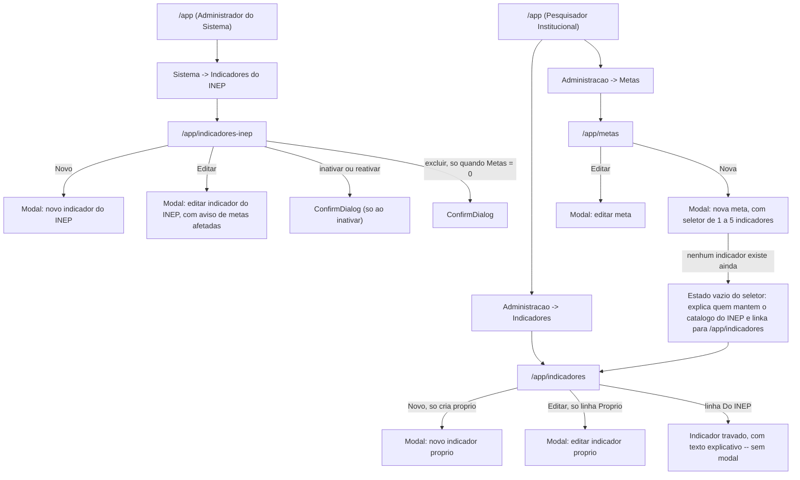

# UX: indicadores

> Este documento **não repete** o que já está resolvido em `spec.md`: os
> cenários Given/When/Then, os wireframes ASCII (seção 16) e o diagrama
> ER (seção 17) são a referência oficial — releia-os junto com este
> arquivo. Aqui ficam as decisões que a spec deliberadamente deixa em
> aberto (mecânica de tela) e a composição exata dos componentes.
>
> **Referência de padrões já em produção:** `specs/autenticacao-usuarios/ux.md`
> e o código já implementado em `frontend/src/features/instituicao/` e
> `frontend/src/features/usuario/`. Este documento **reutiliza** os
> componentes de `shared/ui` e `shared/forms` já existentes — só propõe
> componente novo onde o existente genuinamente não cobre o caso (seção
> "Componentes"), e diz exatamente qual é a composição correta de
> primitivos Base UI, porque um primitivo fora do contexto que exige já
> quebrou em produção três vezes neste projeto.
>
> Sistema **não é** DSGOV/portal público — eMAG não se aplica. WCAG 2.2 AA
> se aplica integralmente.

---

## Fluxo de telas

1. **Indicadores do INEP** (`/app/indicadores-inep`) — propósito: o
   Administrador do Sistema mantém o catálogo único da instalação.
   Único acesso: Administrador do Sistema.
2. **Formulário de indicador do INEP** (modal, dentro da tela acima) —
   propósito: criar/editar código, nome, descrição e referência do
   instrumento.
3. **Indicadores** (`/app/indicadores`) — propósito: o PI vê, num só
   grid, os indicadores do INEP (leitura) e os próprios da instituição
   (CRUD completo). Único acesso: PI.
4. **Formulário de indicador próprio** (modal, dentro da tela acima) —
   propósito: criar/editar código, nome e descrição de um indicador
   institucional. Nunca abre para uma linha de origem "Do INEP".
5. **Metas** (`/app/metas`) — propósito: o PI mantém o catálogo de metas
   da instituição, cada uma apontando para 1 a 5 indicadores. Único
   acesso: PI.
6. **Formulário de meta** (modal, dentro da tela acima) — propósito:
   criar/editar nome, descrição, o conjunto de indicadores (1 a 5,
   misturando as duas origens) e situação.

Modais auxiliares: confirmar inativação/reativação (indicador do INEP,
indicador próprio, meta — mesmo padrão assimétrico já estabelecido em
`autenticacao-usuarios`), confirmar exclusão (as três entidades, só
quando a linha permite), confirmar descarte de alterações não salvas.

---

## Mapa de navegação



### Menu — onde cada tela entra

| Perfil | Grupo | Item |
|---|---|---|
| Administrador do Sistema | Sistema | Indicadores do INEP |
| Pesquisador Institucional | Administração | Indicadores, Metas |

---

## ⚠️ Divergência a resolver: grupo de menu de Indicadores/Metas para o PI

`specs/00-visao-produto.md` ("Menu hierárquico") diz que quem possui o
perfil de PI vê os itens das **features 2, 4 e 5** (indicadores, plano de
metas do curso, entrega/avaliação) **reunidos em um grupo de metas**,
separado do grupo **Administração** (que teria só Usuários e Cursos).
`specs/indicadores/spec.md`, seção **DI-3**, diz o oposto: "Menu do PI:
Indicadores e Metas no grupo Administração, junto de Usuários e Cursos".

**Segui a spec da própria feature (DI-3)** neste documento — é o
documento mais recente e mais específico sobre esta tela, e é o que o
`arquiteto` normalmente trata como autoridade para o desenho de UI desta
entrega. Mas **isso contradiz o documento de visão**, que outro
`ux-designer` está lendo agora mesmo para desenhar `plano-acao` e
`metas-coordenacao` — se aquele documento seguir a leitura de "grupo de
metas" do `00-visao-produto.md`, o menu final vai ter uma inconsistência
real de agrupamento entre as cinco features. **Não decidi por conta
própria qual documento corrige o outro** — registro aqui para o
`arquiteto` reconciliar antes de consolidar `NAV_CONFIG`, comparando com
o que o par que desenha `plano-acao`/`metas-coordenacao` decidiu
para os mesmos dois documentos.

---

## Regra de "ação sem permissão" — extensão desta feature

Reaproveita a regra já formalizada em `autenticacao-usuarios/ux.md`, com
um caso novo que a spec introduz: **a restrição pontual dentro de uma
linha de grid**, não só dentro de um formulário.

| Situação | Tratamento | Motivo |
|---|---|---|
| Administrador do Sistema tentando abrir `/app/indicadores` ou `/app/metas` | **Escondida** (item de menu nem existe; rota responde 404 se acessada direto) | Estruturalmente impossível — é outro catálogo, de outra entidade, e a spec exige 404, não 403, para reforçar que o Administrador nunca alcança o recurso |
| PI tentando ver "Indicadores do INEP" no menu | **Escondida** | Estruturalmente impossível — tela é do Administrador do Sistema |
| **Linha de origem "Do INEP" dentro do grid "Indicadores" (PI)** — botões Editar/Inativar/Excluir | **Desabilitada com explicação visível na própria linha** (não escondida) | **Caso novo desta feature.** O PI **tem** permissão de abrir e usar a tela "Indicadores" — a restrição é pontual, por linha, não pela tela inteira. Esconder o texto faria a linha parecer incompleta; a explicação em texto ensina onde o indicador é mantido |
| Botão "Novo" na tela "Indicadores" (PI) quando não há indicador do INEP nem próprio ainda | **Nunca escondido** — cria o primeiro indicador próprio | Não é restrição de permissão, é estado vazio de dados |
| Botão "Excluir" numa linha de indicador/meta que tem uso (`Metas > 0` / `Planos > 0`) | **Escondida** | Extensão da regra a **pré-condição de dado**, não só a permissão: a exclusão sempre falharia com 409 ali, então mostrar o botão convida a um clique que nunca funciona. Mesmo tratamento que `specs/cursos/ux.md` aplica ao botão de excluir curso com vínculo — registrado aqui para o `code-reviewer` não achar inconsistência entre as duas specs |

---

## Componentes shadcn/ui — mapeamento e organização de pastas

### Reaproveitados de `shared/ui/` (sem alteração)

| Componente | Onde é usado aqui |
|---|---|
| `LoadingButton` | Botão "Pesquisar" das três telas; "Salvar"/"Salvando..." dos três modais; ações assíncronas por linha (inativar/reativar/excluir) |
| `SkeletonTable` | Estado de carregamento dos três grids |
| `EmptyState` | Antes da 1ª pesquisa e pesquisa sem resultado, nos três grids |
| `ErrorState` | Falha de pesquisa, nos três grids |
| `ConfirmDialog` | Inativar (Ativa→Inativa, sempre com confirmação); Excluir; Descartar alterações não salvas |
| `StatusBadge` | Coluna Situação (Ativo/Inativo) nos três grids; coluna/rótulo **Origem** ("Do INEP" / "Próprio") no grid de Indicadores (PI) e na lista de indicadores de cada meta — **reaproveitado com um segundo propósito**: o componente já é genérico (`label` + `variant`), então "Origem" é só mais um uso do mesmo componente, não uma cópia dele |
| `CabecalhoOrdenavel` | Cabeçalhos ordenáveis dos três grids |
| `Paginacao` | Rodapé dos três grids |
| `useEstadoDeGrid`, `useLocalStorage` | Persistência de filtro/ordenação/paginação por tela (`grid-state:indicadores-inep`, `grid-state:indicadores`, `grid-state:metas`) |
| `useDirtyState` | Dirty state dos três formulários |

### `shared/forms/` — reaproveitado com uma extensão pequena, e um componente novo

**`ComboboxEntidade` (existente) — extensão cirúrgica.** Hoje o item do
combobox é `{ value, label }`, renderizado como texto simples. Proponho
acrescentar dois campos **opcionais**: `badge?: string` e
`badgeVariant?: VariantProps<typeof badgeVariants>["variant"]`, exibidos
com `StatusBadge` à direita do rótulo dentro de `ComboboxItem`, sem
mudar nenhum uso existente (que não passa `badge` continua idêntico).
Esta feature não precisa dele diretamente — quem precisa é
`specs/cursos/ux.md` (seletor de candidato a designação, mostrando
"Professor"/"PI · Prof." por pessoa) — **registro a extensão aqui
também porque é o mesmo componente, e as duas specs devem descrever a
mesma mudança de forma idêntica para não gerar dois `renderItem`
concorrentes.** Se o `arquiteto` preferir resolver via `cursos` apenas,
está igualmente correto — o ponto é que só deve existir **uma**
implementação da extensão.

**`ComboboxEntidadeMultipla` (novo) — o controle central da tela de
Metas.** Não existe hoje um combobox de seleção múltipla em
`shared/forms/`. A tentação óbvia seria compor com `ComboboxChips` +
`ComboboxChip` (já existem em `components/ui/combobox.tsx`, prontos para
uso) — **decidi não usá-los aqui**, e explico por quê, porque é
exatamente o tipo de escolha que quebra em runtime se for copiada sem
pensar: `ComboboxChip` é feito para **etiquetas compactas dentro do
campo de entrada**, sem espaço para uma segunda linha de texto. O
wireframe da spec (16.3) exige que cada indicador selecionado mostre,
abaixo, **a referência do instrumento quando for do INEP** — informação
que não cabe num chip. A composição correta, portanto, é:

```tsx
<Combobox
  items={itens}                      // ItemComboboxMultiplo[]
  multiple
  value={selecionados}               // string[]
  onValueChange={(v) => v.length <= max && onValueChange(v)}
  itemToStringLabel={(v) => mapaPorId[v]?.label ?? ""}
  filter={filtrarItem}
>
  <ComboboxInput
    placeholder="Buscar indicador..."
    showTrigger={false}
    showClear={false}
    disabled={disabled || selecionados.length >= max}
    aria-describedby={`${idBase}-contador ${idBase}-limite`}
  />
  <ComboboxContent>
    <ComboboxStatus>{/* carregando / erro, igual ComboboxEntidade */}</ComboboxStatus>
    <ComboboxList>
      {(item: ItemComboboxMultiplo) => (
        <ComboboxItem key={item.value} value={item.value}>
          <span>{item.label}</span>
          {item.badge && (
            <StatusBadge label={item.badge} variant={item.badgeVariant} className="ml-auto" />
          )}
        </ComboboxItem>
      )}
    </ComboboxList>
  </ComboboxContent>
</Combobox>

{/* NÃO usa ComboboxChips/ComboboxChip -- lista própria, fora do combobox */}
<ul aria-label="Indicadores selecionados" className="divide-y rounded-md border">
  {selecionados.map((id) => {
    const item = mapaPorId[id]
    if (!item) return null
    return (
      <li key={id} className="flex items-start justify-between gap-2 p-2">
        <div>
          <span className="text-sm">{item.label}</span>
          {item.badge && <StatusBadge label={item.badge} variant={item.badgeVariant} className="ml-2" />}
          {item.secundario && <p className="text-xs text-muted-foreground">{item.secundario}</p>}
        </div>
        <Button
          type="button"
          variant="ghost"
          size="icon-xs"
          aria-label={`Remover ${item.label} da meta`}
          onClick={() => onValueChange(selecionados.filter((v) => v !== id))}
        >
          <XIcon aria-hidden="true" />
        </Button>
      </li>
    )
  })}
</ul>

<p id={`${idBase}-contador`} aria-live="polite" className="text-sm text-muted-foreground">
  {selecionados.length} de {max} indicadores selecionados
</p>
{selecionados.length >= max && (
  <p id={`${idBase}-limite`} className="text-sm text-muted-foreground">
    Limite de {max} indicadores atingido. Remova um para adicionar outro.
  </p>
)}
```

API proposta (`shared/forms/combobox-entidade-multipla.tsx`):

```ts
interface ItemComboboxMultiplo {
  value: string
  label: string
  badge?: string
  badgeVariant?: VariantProps<typeof badgeVariants>["variant"]
  secundario?: string        // ex: referência do instrumento
}
interface ComboboxEntidadeMultiplaProps {
  itens: ItemComboboxMultiplo[]
  value: string[]
  onValueChange: (value: string[]) => void
  max: number                 // 5 nesta feature
  min?: number                 // 1 nesta feature -- só para o texto do contador; validação real é do form pai
  carregando?: boolean
  erro?: boolean
  onTentarNovamente?: () => void
  placeholder?: string
  mensagemVazia?: string       // usada quando a busca não acha nada, mas `itens` não está vazio
  mensagemSemItens?: React.ReactNode  // usada quando `itens.length === 0` -- ver MC-15 abaixo
  disabled?: boolean
}
```

Genérico o bastante (qualquer campo futuro de "escolher N itens de um
catálogo com badge") para nascer em `shared/forms/`, mesma lógica que já
justificou `ComboboxEntidade` nascer ali em vez de em `features/auth/`.

**Sem criação inline em nenhum dos dois comboboxes desta feature** —
não é exceção de UX como a do combo de login; é a spec que proíbe
explicitamente (seção 9: "Sem criação inline em nenhum dos
autocompletes"), com a justificativa de que criar catálogo no meio da
montagem de uma meta produziria duplicata em uma semana. Registro para
o `dev-fullstack` não replicar por hábito o `+ Criar "texto"` do padrão
universal — aqui ele **não existe**, em nenhuma das duas telas.

### `shared/forms/` reaproveitado sem alteração

`PasswordInput` — não usado nesta feature.

### `features/indicador-inep/` (novo)

| Componente | Usa por baixo |
|---|---|
| `indicador-inep-filtro.tsx` | `Input` (código/nome), `Select` (situação), `LoadingButton` |
| `indicador-inep-table.tsx` | `Table` family, `StatusBadge` (situação), botões de ação `Button variant="ghost" size="icon"` com `aria-label` |
| `indicador-inep-card-mobile.tsx` | `Card` |
| `indicador-inep-form-modal.tsx` | `Dialog`, `Form`-equivalent (`Field`/`FieldGroup`/`FieldContent`/`FieldLabel`/`FieldError`), `Input`, `Textarea` (descrição, referência do instrumento), `Alert` (aviso de metas afetadas + conflito de versão) |
| `inativar-indicador-inep-dialog.tsx` | `ConfirmDialog` |

### `features/indicador/` (novo — indicadores da instituição, tela do PI)

| Componente | Usa por baixo |
|---|---|
| `indicador-filtro.tsx` | `Input`, `Select` (Origem, Situação), `LoadingButton` |
| `indicador-table.tsx` | `Table` family, `StatusBadge` (Origem e Situação); linhas "Do INEP" renderizam um indicador travado (ver seção de acessibilidade) em vez dos três botões de ação |
| `indicador-card-mobile.tsx` | `Card` |
| `indicador-form-modal.tsx` | Mesma composição do modal do INEP, **sem** o campo referência do instrumento e **sem** nenhum campo de escopo |
| `inativar-indicador-dialog.tsx` | `ConfirmDialog` |

### `features/meta/` (novo)

| Componente | Usa por baixo |
|---|---|
| `meta-filtro.tsx` | `Input` (nome), `ComboboxEntidade` (filtro por indicador, ver detalhe abaixo), `Select` (Origem, Situação), `LoadingButton` |
| `meta-table.tsx` | `Table` family; coluna "Indicadores" renderiza uma lista de `StatusBadge`/texto, nunca truncada (máximo 5 itens, cabe) |
| `meta-card-mobile.tsx` | `Card` |
| `meta-form-modal.tsx` | `Dialog` `max-w-lg`, `Field`/`FieldGroup`, `Input`, `Textarea`, **`ComboboxEntidadeMultipla`**, `RadioGroup`-equivalente (situação) |
| `inativar-meta-dialog.tsx` | `ConfirmDialog` |

**Filtro "Indicador" da tela de Metas:** usa `ComboboxEntidade` comum
(seleção única), **sem badge de origem** — a origem já vai embutida no
texto do rótulo (`"1.4 — Núcleo Docente Estruturante (Do INEP)"`),
porque é um filtro de uma linha só, não uma lista onde a origem precisa
se destacar visualmente. Decisão deliberada de **não** usar a extensão
de badge aqui, para não acoplar a extensão a um caso que não precisa
dela.

### Hooks (`features/*/hooks/`)

`useIndicadoresInep`, `useIndicadorInep`, `useCriarIndicadorInep`,
`useAtualizarIndicadorInep`, `useAlterarSituacaoIndicadorInep`,
`useExcluirIndicadorInep`; `useIndicadores`, `useIndicador`,
`useCriarIndicador`, `useAtualizarIndicador`,
`useAlterarSituacaoIndicador`, `useExcluirIndicador`,
`useIndicadoresSugestoes` (alimenta os dois comboboxes); `useMetas`,
`useMeta`, `useCriarMeta`, `useAtualizarMeta`, `useAlterarSituacaoMeta`,
`useExcluirMeta`. Todos expõem `{ data, isLoading, error }` ou
equivalente, mesmo padrão de `useInstituicoes`.

---

## Tela: Indicadores do INEP (`/app/indicadores-inep`)

- **Ação primária:** Novo
- **Ações secundárias:** Pesquisar, Editar, Inativar/Reativar, Excluir
  (só quando `metas_total === 0`), ordenar, paginar
- **Loading:** `SkeletonTable`; botão "Pesquisar" vira "Pesquisando..."
- **Error:** `ErrorState` + "Tentar novamente"
- **Empty:** antes da 1ª pesquisa (instrutivo) e sem resultado
- **Data:** grid com ordenação, paginação, ações por linha

### Grid

- **Filtros:** "Código ou nome" (texto livre); "Situação" (padrão
  **Ativos**)
- **Colunas:** Código · Nome · Referência do instrumento · Situação ·
  Metas (total na instalação) · Ações
- **Ordenáveis:** Código, Nome, Cadastrado em. **Padrão: Código
  crescente.** Página **20**
- **Coluna "Metas":** número puro, sem link — a spec proíbe explicitamente
  que o Administrador veja quais instituições usam (PI-5); um número
  clicável sugeriria que há algo para abrir por trás, e não há

### Formulário (modal, `max-w-md`)

Campos: Código, Nome, Descrição (`Textarea`), Referência do instrumento
(`Textarea`, obrigatória). **Sem campo de escopo** (implícito pela
tela) e **sem campo de situação** (nasce ativo; a mudança de situação é
a ação dedicada de linha — mesmo padrão já estabelecido para
Instituição).

**Aviso de impacto — só no modo Editar, sempre visível, nunca oculto
atrás de um clique adicional:** um `Alert` (variante neutra/informativa,
não destrutiva — não há nada de errado, só um fato a saber) no topo do
formulário:

> "Este indicador é usado por **{metas_total}** meta(s) na instalação. A
> correção vale para todas as instituições imediatamente."

Quando `metas_total === 0`, o aviso não aparece — não há nada a avisar.

### Autocomplete

Não se aplica a este formulário (nenhum campo de entidade).

### Editor de texto rico

**Não se aplica.** Descrição e referência são `Textarea` de texto
simples multilinha, conforme a spec (3.4: "texto simples, sem editor
rico").

### Estados de erro do formulário

| Situação | Tratamento |
|---|---|
| Código, nome ou referência do instrumento vazios | `FieldError` por campo, `aria-describedby` |
| 409 `CODIGO_INDICADOR_DUPLICADO` | `FieldError` no campo Código: "Já existe um indicador do INEP com este código." |
| 409 `CONFLITO_DE_VERSAO` | `Alert` destrutivo: "Este registro foi alterado por outro usuário enquanto você editava." + botão "Recarregar dados" — mesmo padrão de `usuario-form-modal.tsx` |

### Ação "Inativar" / "Reativar" — mesmo tratamento assimétrico de Instituição

| Direção | Confirmação | Texto |
|---|---|---|
| Ativo → Inativo | `ConfirmDialog` (`destrutivo`) | "Inativar {código} — {nome}? Ele some do autocomplete de todas as instituições. As metas que já o referenciam continuam funcionando e continuam contando." |
| Inativo → Ativo | Sem confirmação, `LoadingButton` direto na linha | — |

### Ação "Excluir"

Botão **presente na linha só quando `metas_total === 0`** (ver seção
"Regra de ação sem permissão"). `ConfirmDialog`: "Excluir {código} —
{nome}? Esta ação não pode ser desfeita." `rotuloConfirmar="Excluir"`,
`destrutivo`.

### Responsividade

| Largura | Colunas visíveis | Formulário |
|---|---|---|
| 1440px | todas | coluna única (poucos campos sequenciais, mesma razão do formulário de instituição) |
| 768px | oculta "Referência do instrumento" (célula truncada com `Tooltip` no foco/hover em vez de ocultar de fato — é a informação mais importante da tela para um Administrador confirmar antes de editar, então prefiro truncar a esconder) | coluna única |
| 360px | vira cartão por indicador (Código + Nome, badge Situação, contagem de metas, ações só com ícone) | coluna única, 90% de largura |

### Acessibilidade

- Cabeçalho ordenável: `<button>` real + `aria-sort`.
- Resultado da pesquisa: `aria-live="polite"` fora da tabela ("4
  indicadores encontrados.").
- Botões de ação com `aria-label`: "Editar {código}", "Inativar
  {código}", "Reativar {código}", "Excluir {código}".
- `Textarea` de referência do instrumento: `aria-required="true"`.
- Aviso de impacto: `role="status"` (é informativo, não erro).

### Microcópia

| Elemento | Texto |
|---|---|
| Título | "Indicadores do INEP" |
| Subtítulo/ajuda | "Catálogo único da instalação. Todas as instituições leem; só você edita." |
| Botão novo | "+ Novo" |
| Botão pesquisar | "Pesquisar" → "Pesquisando..." |
| Antes da 1ª pesquisa | "Use os filtros acima e clique em Pesquisar para ver os indicadores." |
| Sem resultado | "Nenhum indicador encontrado." / "Revise os filtros e tente novamente." |
| Erro | "Não foi possível carregar os indicadores agora." + "Tentar novamente" |
| Nota da coluna Metas | rodapé do grid: "\"Metas\" é o total na instalação, somadas todas as instituições. Quais instituições usam não é informação desta tela." |
| Toast criação | "Indicador do INEP cadastrado com sucesso." |
| Toast edição | "Indicador do INEP atualizado com sucesso." |
| Toast inativação | "{Código} foi inativado." |
| Toast reativação | "{Código} foi reativado." |
| Toast exclusão | "{Código} foi excluído." |

---

## Tela: Indicadores (`/app/indicadores`, PI)

- **Ação primária:** Novo (sempre cria indicador **próprio** — não há
  como criar um do INEP por aqui)
- **Ações secundárias:** Pesquisar, Editar/Inativar/Excluir (só linhas
  "Próprio"), ordenar, paginar
- **Loading / Error / Empty:** mesmo padrão da tela anterior
- **Data:** grid misturando as duas origens numa lista só

### Grid

- **Filtros:** "Código ou nome"; **Origem** (`Select`: Todos / Do INEP /
  Próprios); Situação (padrão **Ativos**)
- **Colunas:** Código · Nome · **Origem** · Referência do instrumento ·
  Situação · Metas (**da instituição**) · Ações
- **Ordenáveis:** Código, Nome, Cadastrado em. **Padrão: Código
  crescente.** Página **20**
- **Linhas "Do INEP":** coluna Ações mostra um indicador travado — ver
  próxima seção — nunca os três botões de linha "Próprio"

### Indicador travado (linha "Do INEP") — composição exata

Não é um `Button` desabilitado (não existe ação nenhuma ali para
"quase" oferecer) — é um elemento estático informativo:

```tsx
<span
  className="inline-flex items-center gap-1 text-muted-foreground"
  tabIndex={0}
>
  <LockIcon className="size-4" aria-hidden="true" />
  <span className="text-xs">Somente leitura</span>
</span>
```

Com `Tooltip` associado (mesmo padrão já usado no badge de instituição
truncado: foco por teclado abre o tooltip), texto completo: "Mantido
pelo Administrador do Sistema. Você pode usar este indicador em metas
normalmente." — `tabIndex={0}` porque o `Tooltip` do shadcn/Base UI
precisa de um elemento focável para funcionar por teclado.

### Formulário (modal, `max-w-md`)

Campos: Código, Nome, Descrição. **Sem campo de referência do
instrumento, sem campo de escopo, sem checkbox "derivado do INEP"** — a
spec é explícita (Fluxo 3): o escopo institucional é implícito pela
tela em que o formulário abre. **Este modal nunca abre a partir de uma
linha "Do INEP"** — reforça a regra acima, não depende só do botão
estar ausente.

### Estados de erro do formulário

Mesmo padrão da tela anterior, com a mensagem de duplicidade ajustada:
"Já existe um indicador com este código nesta instituição." — reforça o
escopo (mesma lição já aplicada ao e-mail duplicado em
`autenticacao-usuarios`).

### Ação "Inativar"/"Reativar"/"Excluir"

Mesmo padrão assimétrico e mesma regra de esconder "Excluir" com uso —
agora `metas_total` é **da instituição**, não da instalação.

### Responsividade

| Largura | Colunas visíveis |
|---|---|
| 1440px | todas |
| 768px | oculta "Referência do instrumento"; "Origem" permanece (é a coluna que explica por que a linha tem ou não ações) |
| 360px | cartão por indicador: Código + Nome, badge Origem, badge Situação, contagem, ações (ou indicador travado) |

### Acessibilidade

Mesmo padrão da tela anterior, mais:

- Badge de Origem lido como texto ("Do INEP" / "Próprio") — nunca só
  cor. Satisfaz diretamente o requisito de acessibilidade da spec (seção
  11).
- Indicador travado: `Tooltip` acessível por teclado, texto do tooltip
  também disponível como `title` de fallback.

### Microcópia

| Elemento | Texto |
|---|---|
| Título | "Indicadores" |
| Rótulo filtro origem | "Origem" (opções: Todos / Do INEP / Próprios) |
| Nota de rodapé | "🔒 Indicadores do INEP são mantidos pelo Administrador do Sistema e são somente leitura aqui. Você pode usá-los em metas normalmente." |
| Nota da coluna Metas | "\"Metas\" conta apenas as da sua instituição." |
| Duplicidade | "Já existe um indicador com este código nesta instituição." |
| Toast criação | "Indicador cadastrado com sucesso." |

---

## Tela: Metas (`/app/metas`, PI)

- **Ação primária:** Nova
- **Ações secundárias:** Pesquisar, Editar/Inativar/Excluir, ordenar,
  paginar
- **Loading / Error / Empty:** mesmo padrão
- **Data:** grid com a coluna "Indicadores" como lista

### Grid

- **Filtros:** Nome; **Indicador** (`ComboboxEntidade`, ver acima);
  **Origem** (`Select`: Todas / Do INEP / Próprios — filtra metas que
  têm ao menos um indicador daquela origem); Situação (padrão
  **Ativas**)
- **Colunas:** Nome · **Indicadores** (lista) · Situação · Planos ·
  Ações
- **Ordenáveis:** Nome, Cadastrado em. **Padrão: Nome crescente.**
  Página **20**
- **Coluna "Indicadores":** cada item como `"{código} · {Origem}"`
  (texto), separados por quebra de linha dentro da célula — nunca
  truncado, porque o teto é 5 (MC-14 já garante que a meta aparece uma
  vez mesmo filtrando por indicador/origem)

### Formulário (modal, `max-w-lg`)

Campos: Nome, Descrição (`Textarea`), **Indicadores (1 a 5)** via
`ComboboxEntidadeMultipla`, Situação (`RadioGroup`-equivalente: Ativa /
Inativa).

**Dados dos itens do combobox:**
```ts
{
  value: indicador.id,
  label: `${indicador.codigo} — ${indicador.nome}`,
  badge: indicador.escopo === "plataforma" ? "Do INEP" : "Próprio",
  badgeVariant: indicador.escopo === "plataforma" ? "secondary" : "outline",
  secundario: indicador.escopo === "plataforma" ? indicador.referencia_instrumento : undefined,
}
```
Só indicadores **ativos** entram na lista (a API de sugestões já filtra;
o front não precisa filtrar de novo).

**Texto fixo, sempre visível, logo abaixo do seletor** (é onde a spec
diz que alguém procuraria o campo de INEP e onde alguém concluiria,
errado, que dois indicadores dobram a exigência — 16.3):

> "As referências acima vêm dos indicadores. Para corrigi-las, fale com
> o Administrador do Sistema — não existe campo de INEP aqui."
>
> "Uma entrega desta meta atende a todos os indicadores selecionados. A
> quantidade exigida continua sendo a do item do plano, não muda com o
> número de indicadores."

### MC-15 — estado vazio do seletor, dentro do formulário

Quando a lista de indicadores disponíveis (`itens.length === 0` — nem
INEP nem próprio existe ainda) o `ComboboxEntidadeMultipla` **não mostra
o campo de busca normal** — mostra, no lugar, um bloco instrutivo:

```
┌──────────────────────────────────────────────────────────┐
│ Ainda não há nenhum indicador disponível.                │
│ O catálogo do INEP é mantido pelo Administrador do        │
│ Sistema; você pode cadastrar um indicador próprio.        │
│                                    [ Cadastrar indicador → ] │
└──────────────────────────────────────────────────────────┘
```

O botão "Cadastrar indicador" navega para `/app/indicadores` **com a
proteção de dirty state do modal de meta** (se o nome/descrição já
foram preenchidos, confirma descarte antes de sair — mesmo mecanismo já
usado para fechar/cancelar). Não abre um segundo modal encadeado (ao
contrário do fluxo "cadastrar o primeiro PI" de `autenticacao-usuarios`)
porque cadastrar um indicador não devolve a pessoa automaticamente ao
formulário de meta com o indicador pré-selecionado sem duplicar estado
entre as duas telas — mais simples e mais honesto deixar a pessoa
terminar de cadastrar o indicador e voltar a "Nova meta" por conta
própria.

### Estados de erro do formulário

| Situação | Tratamento |
|---|---|
| Nome vazio | `FieldError` |
| Nenhum indicador selecionado, ao tentar salvar | `FieldError` abaixo do seletor: "Selecione pelo menos um indicador." (400 `INDICADOR_OBRIGATORIO`) — validação **também** no cliente antes de submeter, para não depender só da resposta do servidor |
| 6º indicador (não deveria ser possível pela UI, já que `max=5` desabilita o campo, mas a validação existe como rede de segurança) | 400 `INDICADORES_ACIMA_DO_LIMITE` → `FieldError` |
| 409 `NOME_META_DUPLICADO` | `FieldError` no campo Nome: "Já existe uma meta com este nome nesta instituição." |
| 400 `INDICADOR_INATIVO` | Não deveria acontecer (a lista de sugestões só traz ativos), mas se ocorrer (corrida entre duas abas): `Alert` destrutivo genérico + "Recarregar dados" |
| 409 `CONFLITO_DE_VERSAO` | Mesmo padrão dos outros formulários |

### Ação "Inativar"

`ConfirmDialog`: "Inativar {nome}? Os planos vigentes que já a usam
continuam sendo cobrados normalmente. Ela some do autocomplete de novos
itens de plano." Sem confirmação ao reativar.

### Responsividade

| Largura | Formulário | Grid |
|---|---|---|
| 1440px | 2 colunas (Nome/Situação lado a lado, Descrição e Seletor de indicadores em `col-span-full`) | todas as colunas |
| 768px | coluna única | oculta "Planos" |
| 360px | coluna única, 90% de largura; lista de selecionados com scroll interno se passar de ~4 itens visíveis | cartão por meta (Nome, lista de indicadores como badges, badge Situação, ações) |

### Acessibilidade

- `ComboboxEntidadeMultipla`: mesmo padrão ARIA `combobox`+`listbox` do
  `ComboboxEntidade` existente (com a mesma ressalva já registrada em
  `autenticacao-usuarios/ux.md` sobre o recipe do Base UI não ser o
  combobox ARIA "de livro" — validar manualmente com leitor de tela).
- Lista de selecionados: `<ul aria-label="Indicadores selecionados">`,
  cada remoção com `aria-label` nomeando o indicador — nunca "Remover"
  sozinho.
- Contador "N de 5 indicadores selecionados": `aria-live="polite"`,
  associado ao input via `aria-describedby`.
- Aviso de limite atingido: mesmo texto some do DOM quando não se
  aplica (não fica `hidden` com `aria-hidden` incorreto).
- Texto fixo sobre a informação de INEP e sobre não multiplicar a
  quantidade: `role="note"` implícito via `<p>` simples — não é alerta,
  é contexto permanente.

### Microcópia

| Elemento | Texto |
|---|---|
| Título | "Metas" |
| Botão nova | "+ Nova" |
| Rótulo do seletor | "Indicadores (1 a 5)" |
| Placeholder do seletor | "Buscar indicador..." |
| Contador | "{n} de 5 indicadores selecionados" |
| Limite atingido | "Limite de 5 indicadores atingido. Remova um para adicionar outro." |
| Sem indicador algum | "Ainda não há nenhum indicador disponível. O catálogo do INEP é mantido pelo Administrador do Sistema; você pode cadastrar um indicador próprio." + "Cadastrar indicador →" |
| Sem indicador selecionado (erro) | "Selecione pelo menos um indicador." |
| Nome duplicado | "Já existe uma meta com este nome nesta instituição." |
| Nota de rodapé (grid) | "Uma entrega desta meta atende todos os indicadores dela — a quantidade exigida NÃO é multiplicada pelo número de indicadores." / "A quantidade de entregas é do item do plano, não da meta." |
| Texto fixo do formulário | ver bloco acima |
| Toast criação | "Meta cadastrada com sucesso." |
| Toast inativação | "{Nome} foi inativada." |

---

## Atalhos de teclado desta feature

| Atalho | Ação | Escopo |
|---|---|---|
| `Ctrl+N` / `Cmd+N` | Abre "Novo indicador do INEP" / "Novo indicador" / "Nova meta" | Conforme a tela e o botão existir para o perfil |
| `Ctrl+S` / `Cmd+S` | Salva o formulário atual | Todos os modais desta feature |
| `Ctrl+F` / `Cmd+F` | Foca o campo de busca principal | Todas as três telas |
| `Esc` | Fecha modal/combobox aberto, respeitando dirty state | Todos os modais e comboboxes |
| `↑`/`↓`/`Enter`/`Esc` | Navegar/selecionar/fechar nos dois comboboxes | `ComboboxEntidade` e `ComboboxEntidadeMultipla` |

---

## Acessibilidade transversal (resumo executável)

| Aspecto | Regra aplicada nesta feature |
|---|---|
| Contraste | 4.5:1 texto, 3:1 componentes de interface — inclusive nos `StatusBadge` de Origem |
| Origem nunca só por cor | "Do INEP" / "Próprio" sempre em texto, no badge e na lista de selecionados |
| Foco ao abrir modal | Primeiro campo (Código, nos dois indicadores; Nome, na meta) |
| Foco ao fechar modal | Volta ao botão que abriu (linha "Editar" ou "+ Novo") |
| `aria-live` de resultado do grid | `aria-live="polite"`, texto-resumo fora da tabela, nas três telas |
| `aria-live` do contador de indicadores selecionados | `aria-live="polite"` |
| Indicador travado (linha "Do INEP") | `tabIndex={0}` + `Tooltip` acessível por teclado, nunca só hover |
| Toasts | `role="status"` sucesso/info/aviso · `role="alert"` erro |
| Alvo de toque | mínimo 24×24px nos botões de ação e no botão de remover indicador selecionado |
| Motion | Parâmetros padrão do `CLAUDE.md`; abertura do popover do combobox usa a transição já definida em `components/ui/combobox.tsx`, sem alteração |

---

## Decisões de fluxo / divergências da spec

1. **Divergência de agrupamento de menu (Indicadores/Metas do PI)** —
   registrada em destaque no início do documento. Bloqueia a
   consolidação final de `NAV_CONFIG`, não bloqueia o desenho das
   telas.
2. **Extensão de `ComboboxEntidade` com `badge`/`badgeVariant`
   opcionais** — proposta aqui e também em `specs/cursos/ux.md`, para
   as duas specs não descreverem implementações concorrentes do mesmo
   componente. Se o `arquiteto` decidir implementar só uma vez, a
   referência é qualquer uma das duas descrições (são idênticas).
3. **`ComboboxEntidadeMultipla` deliberadamente não usa
   `ComboboxChips`/`ComboboxChip`** — decisão de composição registrada
   com justificativa técnica na seção de componentes, para não ser
   "corrigida" de volta ao padrão de chips por alguém que não leu o
   motivo.
4. **Indicador travado (linha "Do INEP") tratado como elemento estático
   com tooltip, não como botão desabilitado** — é uma leitura específica
   da regra "pontual → desabilita e explica" do `CLAUDE.md`, adaptada a
   uma célula de grid em vez de um campo de formulário. Registrado
   porque não é uma aplicação literal da regra, é uma extensão dela.
5. **Botão "Excluir" escondido (não desabilitado) quando há uso** — nas
   três entidades desta feature. Mesma decisão que `specs/cursos/ux.md`
   aplica ao curso com vínculo; registrada nos dois documentos para
   ficar consistente.
6. **MC-15 não encadeia um segundo modal** (diferente do fluxo
   "cadastrar o primeiro PI" de `autenticacao-usuarios`) — decisão
   deliberada, com a justificativa na própria seção da tela de Metas.

Nenhum outro ponto da spec foi contestado ou reinterpretado.

---

## O que o `arquiteto` precisa saber ao ler este documento

- **Contagem de metas por linha** (`metas_total` no grid do INEP,
  `metas_da_instituicao` no grid do PI) precisa vir **computada na
  resposta da listagem** — não é campo persistido, é `COUNT` na query,
  já anunciado na própria spec (seção 9).
- **`GET /api/v1/indicadores/sugestoes`** precisa devolver, por item, o
  suficiente para montar `{ value, label, badge, secundario }` do lado
  do cliente: `id`, `codigo`, `nome`, `escopo`, `referencia_instrumento`
  (quando aplicável) — já está descrito na spec (seção 9), só reforço
  que a tela depende literalmente desses campos para renderizar o
  seletor.
- **`GET /api/v1/metas/sugestoes`** e a listagem de metas precisam
  trazer os indicadores **com origem e referência** por meta (spec já
  exige isso) — é o que preenche a coluna "Indicadores" do grid sem uma
  segunda chamada por linha.
- A extensão de `ComboboxEntidade` (`badge`/`badgeVariant` opcionais) é
  puramente de frontend — não tem impacto de contrato de API.
- Nenhum endpoint novo além dos já listados na seção 9 da spec foi
  necessário para as telas aqui descritas.
