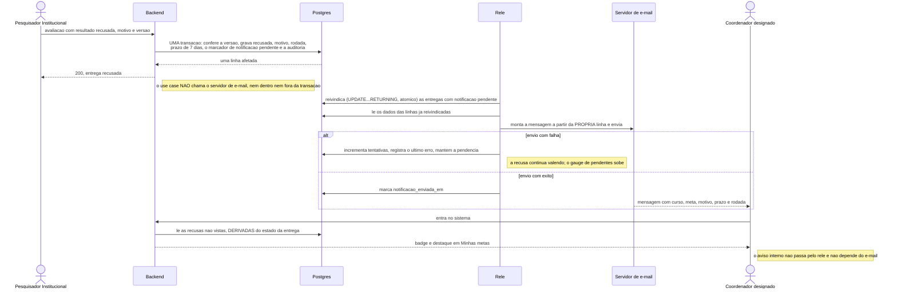
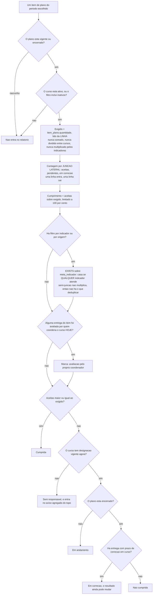

# Design: metas-coordenacao (entregas, avaliação e desempenho)

**Data:** 28/09/2026 (revisão 2 — consequência de QP-3) · **Status:** proposto
— aguarda aprovação do dono
**Entradas:** `spec.md` · `ux.md` · `specs/_fundacao-metas.md` ·
`specs/cursos/design.md` · `specs/plano-acao/design.md` ·
`specs/indicadores/design.md` · `specs/autenticacao-usuarios/design.md`
(rev. 6) · `project.config.md` · `CLAUDE.md`

> **Lê-se depois de `specs/_fundacao-metas.md`** (isolamento generalizado,
> carteira no `Escopo`, `DataLocal`, o relê de segundo plano, MinIO e SMTP,
> permissões e alcances) e dos designs de `cursos` e `plano-acao`. Nada
> disso é redefinido aqui.
>
> **Revisão 2.** A resposta do dono a **QP-3** (o coordenador gera o documento
> de plano em rascunho) atravessou para cá: **`EN-03` não pode mais responder
> 404**, porque já não há existência a esconder — ver **M-14** e **§5.1**.
> Registrado como parte de **`QP-6`** em `plano-acao/design.md` §11.1.

---

## 1. Sumário das decisões

| # | Decisão | Motivo curto |
|---|---|---|
| M-01 | **O dual write da notificação é resolvido por reconciliação sobre o estado da entrega, não por Transactional Outbox** | A segunda saída de escape do `CLAUDE.md` se aplica: a linha já é a descrição completa do evento — §8 |
| M-02 | **A notificação descreve o estado atual da entrega, não um histórico de eventos** | Propriedade deliberada, com o gatilho de revisão nomeado — §8.3 |
| M-03 | **`recusada_definitiva` não é coluna: é `recusada` com prazo vencido ou rodadas esgotadas** | Duas portas derivadas, nenhuma armazenada (17.1 da spec) |
| M-04 | **Idempotência garantida pela chave primária, dentro da mesma transação** | Duas requisições simultâneas se serializam no banco, sem lock — §7 |
| M-05 | **Janela de deduplicação: 24 horas**, declarada (condição do dono) | §7 |
| M-06 | **Sem `Idempotency-Key` no anexo individual** — risco residual aceito e registrado | §7.3 |
| M-07 | **O tipo do anexo é verificado pelo conteúdo, e `application/zip` exige inspeção do ZIP** | DOCX e ODT são ZIP; `DetectContentType` sozinho aceita um `.jar` renomeado — §6.2 |
| M-08 | **Limites aplicados com `MaxBytesReader` e `LimitReader`, nunca com `ReadAll`** | `ReadAll` de um envio de 2 GB derruba o container — §6.3 |
| M-09 | **Prefere-se objeto órfão a linha órfã** | Objeto órfão é invisível e reclamável; linha órfã é download quebrado — §6.4 |
| M-10 | **O relatório não contém `DISTINCT`, e um teste confere** | `DISTINCT` mascara a multiplicação nos agregados: relatório plausível e falso — §9.2 |
| M-11 | **Contagem por junção lateral; filtro por indicador por `EXISTS`** | As duas únicas formas que não multiplicam — §9.2 |
| M-12 | **A restauração de prazo por vacância é escrita pelo relê, não derivada** | A spec já a definiu como evento auditado por "o sistema"; derivação não tem instante para auditar — §10 |
| M-13 | **`avaliador_e_coordenador_do_curso` é gravado no instante e nunca recalculado; a marca do relatório olha o presente** | Dois comportamentos deliberadamente diferentes (`AV-17`) — §5.3 |
| **M-14** | **Entrega em plano rascunho responde 409 `PLANO_NAO_VIGENTE`, não 404** | Consequência de QP-3: o coordenador acabou de ler o plano, e 404 mentiria sobre algo que ele viu — §5.1 |

---

## 2. Diagramas

### 2.1 A recusa e a notificação — onde a escrita dupla é desfeita



### 2.2 Como o relatório apura uma linha sem contar duas vezes



**A lista de indicadores exibida não aparece na figura de propósito**: ela é
uma **terceira junção lateral agregada**, paralela à contagem, e não participa
de nenhuma decisão. Foi tentar projetá-la na junção principal que produziria a
duplicação.

**O ramo `rascunho → FORA` sobreviveu a QP-3 intacto.** O coordenador passou a
**ler** o plano em rascunho; ele continua não entrando no relatório, porque
relatório é apuração de cobrança e rascunho não cobra.

---

## 3. Domínio

### 3.1 Value Objects

| VO | Regras |
|---|---|
| **`SituacaoEntrega`** | `pendente_avaliacao` \| `aceita` \| `recusada`. **Três valores, não quatro** — `recusada_definitiva` é derivada (M-03) |
| **`RodadaDeRecusa`** | Inteiro 0..3. Construtor recusa acima de 3; `Esgotada()` é `== 3` |
| **`PrazoDeCorrecao`** | Instante, construído por `DataLocal(recusa).MaisDias(7).FimDoDia(local)`. `EmCurso(agora)` é a única comparação |
| **`TipoDeAnexo`** | `pdf` \| `jpeg` \| `png` \| `docx` \| `odt`. Construído a partir do **conteúdo**, nunca da extensão (§6.2) |
| **`ResultadoDeAvaliacao`** | `aceita` \| `recusada`; recusa exige motivo não vazio |

### 3.2 Entidade `entrega.Entrega`

```go
type Entrega struct {
    ID, ItemPlanoID, CursoID, InstituicaoID uuid.UUID
    EnviadaPor    uuid.UUID
    CorrigidaPor  *uuid.UUID
    Observacao    string
    Situacao      valueobject.SituacaoEntrega
    Rodadas       valueobject.RodadaDeRecusa
    PrazoCorrecao *time.Time
    AvaliadaPor   *uuid.UUID
    AvaliadaEm    *time.Time
    Motivo        string
    AvaliadorEraCoordenador bool
    // colunas de notificação — §8.2
    // campos base
}

// A ÚNICA função que decide se a entrega ainda aceita correção.
func (e *Entrega) PodeCorrigir(agora time.Time) error   // nil, ou o 409 exato
```

`PodeCorrigir` devolve o erro nomeado, não um booleano: `LIMITE_DE_RODADAS_ATINGIDO`
quando as rodadas esgotaram, `PRAZO_DE_CORRECAO_EXPIRADO` quando o prazo
venceu, `ENTREGA_ACEITA_NAO_EDITAVEL` quando está aceita. Um booleano
obrigaria o chamador a redescobrir qual dos três é — e o chamador seguinte
escolheria outro.

**`recusada_definitiva` como estado derivado (M-03)**, e é o que `17.1` da spec
descreve: uma entrega `recusada` está definitivamente recusada quando
`Rodadas.Esgotada()` **ou** `!PrazoCorrecao.EmCurso(agora)`. **Duas portas para
o mesmo estado terminal, nenhuma armazenada** — armazenar exigiria escrita no
instante em que o prazo vence, e não há escrita naquele instante. É a mesma
razão do perfil derivado.

**A entrega pende do item, nunca da pessoa** (3.2): daí vêm curso, meta e
quantidade, e é isso que faz a troca de coordenador não mexer em nada
(`X11`, 3.4 de `cursos`).

### 3.3 `Anexo`

```go
type Anexo struct {
    ID, EntregaID, CursoID, InstituicaoID uuid.UUID
    NomeOriginal string
    Tipo         valueobject.TipoDeAnexo
    TamanhoBytes int64
    ChaveObjeto  string
    HashSHA256   string
    // campos base (sem versao — escrito uma vez)
}
```

**`NomeOriginal` pode conter dado pessoal** (`ata-joao-silva.pdf`) e por isso
**nunca aparece em log, em e-mail nem em mensagem de erro de auditoria** (§9
da spec). Aparece só na tela de quem tem acesso à entrega.

---

## 4. Banco de dados

```sql
CREATE TABLE entrega (
    id             UUID        PRIMARY KEY,
    item_plano_id  UUID        NOT NULL,
    curso_id       UUID        NOT NULL,
    instituicao_id UUID        NOT NULL,
    enviada_por    UUID        NOT NULL REFERENCES usuario (id),
    corrigida_por  UUID        REFERENCES usuario (id),
    observacao     TEXT        NOT NULL DEFAULT '',
    situacao       TEXT        NOT NULL DEFAULT 'pendente_avaliacao',
    rodadas_de_recusa  INT     NOT NULL DEFAULT 0,
    prazo_correcao_ate TIMESTAMPTZ,
    avaliada_por   UUID        REFERENCES usuario (id),
    avaliada_em    TIMESTAMPTZ,
    motivo         TEXT        NOT NULL DEFAULT '',
    avaliador_era_coordenador BOOLEAN NOT NULL DEFAULT false,
    pendencia_vista_em TIMESTAMPTZ,

    notificacao_evento     TEXT,
    notificacao_gerada_em  TIMESTAMPTZ,
    notificacao_enviada_em TIMESTAMPTZ,
    notificacao_tentativas INT NOT NULL DEFAULT 0,
    notificacao_ultimo_erro TEXT,

    criado_em      TIMESTAMPTZ NOT NULL DEFAULT now(),
    atualizado_em  TIMESTAMPTZ,
    excluido_em    TIMESTAMPTZ,
    versao         INT         NOT NULL DEFAULT 1,

    CONSTRAINT ck_entrega_situacao CHECK (situacao IN
        ('pendente_avaliacao','aceita','recusada')),
    CONSTRAINT ck_entrega_rodadas  CHECK (rodadas_de_recusa BETWEEN 0 AND 3),
    CONSTRAINT ck_entrega_recusa   CHECK (situacao <> 'recusada' OR btrim(motivo) <> ''),
    CONSTRAINT ck_entrega_notificacao CHECK (notificacao_evento IS NULL
        OR notificacao_evento IN ('recusa','desfazimento','prazo_restaurado')),
    CONSTRAINT fk_entrega_item
        FOREIGN KEY (item_plano_id, curso_id) REFERENCES item_plano (id, curso_id)
);

CREATE UNIQUE INDEX uq_entrega_id_curso ON entrega (id, curso_id);
CREATE INDEX idx_entrega_item ON entrega (item_plano_id, situacao) WHERE excluido_em IS NULL;
CREATE INDEX idx_entrega_fila ON entrega (instituicao_id, criado_em)
 WHERE excluido_em IS NULL AND situacao = 'pendente_avaliacao';
CREATE INDEX idx_entrega_enviada_por ON entrega (enviada_por) WHERE excluido_em IS NULL;

-- o índice parcial que mantém a varredura do relê barata, mesmo com a tabela grande
CREATE INDEX idx_entrega_notificacao_pendente
    ON entrega (notificacao_gerada_em)
 WHERE notificacao_enviada_em IS NULL AND notificacao_evento IS NOT NULL;

-- o candidato à restauração de prazo é um subconjunto pequeno
CREATE INDEX idx_entrega_recusada_por_curso
    ON entrega (curso_id, prazo_correcao_ate)
 WHERE excluido_em IS NULL AND situacao = 'recusada';

CREATE TABLE anexo (
    id             UUID        PRIMARY KEY,
    entrega_id     UUID        NOT NULL,
    curso_id       UUID        NOT NULL,
    instituicao_id UUID        NOT NULL,
    nome_original  TEXT        NOT NULL,
    tipo           TEXT        NOT NULL,
    tamanho_bytes  BIGINT      NOT NULL,
    chave_objeto   TEXT        NOT NULL,
    hash_sha256    TEXT        NOT NULL,
    criado_em      TIMESTAMPTZ NOT NULL DEFAULT now(),
    excluido_em    TIMESTAMPTZ,
    CONSTRAINT ck_anexo_tipo CHECK (tipo IN ('pdf','jpeg','png','docx','odt')),
    CONSTRAINT ck_anexo_tamanho CHECK (tamanho_bytes > 0 AND tamanho_bytes <= 10485760),
    CONSTRAINT fk_anexo_entrega
        FOREIGN KEY (entrega_id, curso_id) REFERENCES entrega (id, curso_id)
);
CREATE INDEX idx_anexo_entrega ON anexo (entrega_id) WHERE excluido_em IS NULL;

CREATE TABLE idempotencia (
    usuario_id  UUID        NOT NULL REFERENCES usuario (id),
    rota        TEXT        NOT NULL,
    chave       TEXT        NOT NULL,
    recurso_id  UUID        NOT NULL,
    criado_em   TIMESTAMPTZ NOT NULL DEFAULT now(),
    PRIMARY KEY (usuario_id, rota, chave)
);
CREATE INDEX idx_idempotencia_expurgo ON idempotencia (criado_em);
```

**`anexo` não tem `versao`** — escrito uma vez, removido logicamente só pelo
autor da entrega. **`idempotencia` também não** — a chave primária *é* a
concorrência (§7).

**`idempotencia` é chaveada por `usuario_id`**, não por instituição: é o
recorte mais estreito possível, e impede que a chave de um ator colida com a
de outro ou devolva o recurso de outro. É uma tabela técnica interna sem rota
de API — o único lugar do projeto onde a chave primária não é UUID, e está
declarado.

### 4.1 O que o `dba` valida

| # | Propriedade | O que reprova |
|---|---|---|
| V-1 | O relê enxerga só as pendentes, sem varredura sequencial em `entrega`, com a tabela em volume de um período | `Seq Scan` em `entrega` |
| V-2 | A fila de avaliação não faz varredura sequencial, p95 < 300 ms | `Seq Scan` |
| V-3 | **O relatório é uma consulta**, com p95 < 800 ms em ~3.000 itens | mais de uma ida ao banco por página, ou acima do orçamento |
| V-4 | **O `total` da paginação do relatório é contado sem as junções laterais** | `total` divergir do número de linhas do conjunto filtrado |
| V-5 | A busca do candidato à restauração de prazo é barata | `Seq Scan` |
| V-6 | Duas transações com a mesma `(usuario_id, rota, chave)` produzem **uma** entrega | duas entregas |
| V-7 | Expurgo da tabela de idempotência acima de 24 h, em rotina própria | crescimento ilimitado |
| V-8 | Seed com entregas em todos os estados, **incluindo uma avaliada por Beatriz em Biomedicina** | ausência — sem ela `AV-15`, `RD-11` e a métrica de coincidência não são observáveis |

---

## 5. Use cases e regras

```
command/ entrega/  registrar · corrigir · excluir · marcar_pendencia_vista
         anexo/    adicionar · remover
         avaliacao/ avaliar · desfazer_aceitacao
query/   entrega/  listar_do_item · buscar · minhas_metas
         avaliacao/ listar_fila
         relatorio/ desempenho · exportar_desempenho
         pendencia/ contar_badges
         anexo/    baixar
```

### 5.1 As portas para registrar (3.5), e a que mudou com QP-3

Verificadas **no use case, dentro da transação**, nesta ordem — e a ordem
importa porque determina qual código o cliente vê:

```
1. permissão                       → 403 PERMISSAO_NEGADA
2. item na instituição e na carteira (AplicarEscopo) → 404 NAO_ENCONTRADO
3. plano vigente                   → 409 PLANO_NAO_VIGENTE   (rascunho E encerrado)
4. curso ativo                     → 409 CURSO_INATIVO
5. curso com designação vigente    → 409 CURSO_SEM_COORDENADOR
6. período aberto                  → 409 PERIODO_NAO_INICIADO / PERIODO_ENCERRADO
7. pelo menos um anexo, dentro dos limites → 400, ANTES de gravar byte nenhum
```

> **O passo 3 mudou na revisão 2 (M-14).** Na revisão 1, plano em rascunho
> respondia **404** — *"para ela o plano ainda não existe"* (`EN-03`). Depois
> de QP-3, o coordenador **lê** o plano em rascunho dos cursos dele e **gera o
> documento dele**. Continuar respondendo 404 na entrega significaria negar a
> existência de um plano que ele acabou de abrir: **404 deixaria de esconder e
> passaria a mentir**. O código correto é **409 `PLANO_NAO_VIGENTE`**, que é a
> verdade — o plano existe, e ainda não cobra.
>
> `EN-03` da `spec.md` desta feature ainda diz 404. Registrado em **`QP-6`**
> (`plano-acao/design.md` §11.1) para o `analista-requisitos`.

**O passo 5 parece redundante com o 2 e não é.** A carteira é satisfeita por
uma designação vigente do ator naquele curso — se ela existe, o curso não está
vago. O 409 `CURSO_SEM_COORDENADOR` existe para o caminho em que a checagem de
carteira é satisfeita por outro caminho, e é **defensivo por desenho**: uma
verificação que nunca dispara pela tela mas fecha a rota.

**O ramo da correção passa por cima do período** (`X6`, `AV-04`): uma entrega
recusada em 29/07 é corrigível em 03/08 com o período encerrado desde 30/07.
Sem isso, recusar no último dia equivale a reprovar sem direito de resposta.
Na correção, o passo 6 é substituído por `PodeCorrigir(agora)`.

**A janela de enviar fecha; a de julgar não.** Período encerrado, plano
encerrado e curso inativo **continuam aceitando avaliação** das pendentes
(`AV-08`).

**`minhas-metas` continua listando só itens de plano vigente ou encerrado.**
É a lista de **obrigações**, e item de plano em rascunho não é uma. O
`SomenteVigentes` que saiu da consulta de planos (`plano-acao` §5.4)
**mora aqui agora** — derivado do alcance, nunca de parâmetro do cliente.
Apagá-lo dos dois lugares faria a tela oferecer "Prestar contas" numa rota que
responde 409.

### 5.2 Avaliação, rodadas e desfazimento

| Operação | Regra |
|---|---|
| Aceitar | 200; `avaliada_por`, `avaliada_em` e a marca de coincidência |
| Recusar | motivo obrigatório; `rodadas += 1`; na 1ª e 2ª abre prazo de 7 dias; **na 3ª, sem novo prazo** (`AV-10`) |
| Avaliar já avaliada | 409 `ENTREGA_JA_AVALIADA` |
| Desfazer aceitação | **qualquer PI da instituição**, não só quem aceitou; motivo obrigatório; volta a `recusada`; **consome rodada**; abre prazo; notifica. Com rodadas esgotadas → 409 `LIMITE_DE_RODADAS_ATINGIDO` |

**`ENTREGA_JA_AVALIADA` e `CONFLITO_DE_VERSAO` coexistem e não são o mesmo
erro.** O 409 de versão diz *alguém alterou esta entrega enquanto você a
lia*; o `ENTREGA_JA_AVALIADA` diz *esta entrega não está mais pendente*. Duas
avaliações concorrentes na mesma versão (`AV-07`) produzem exatamente um
sucesso: o `UPDATE ... WHERE id = $1 AND versao = $2 AND situacao =
'pendente_avaliacao'` afeta zero linhas para a segunda, e o use case relê a
linha para escolher entre os dois códigos — **relê, não adivinha**.

**O desfazimento é o evento mais sensível da spec:** faz um número apurado
**diminuir**, e pode ser praticado por um PI diferente de quem aceitou. Daí o
motivo obrigatório, o syslog e a notificação.

### 5.3 A marca de acúmulo de papéis (M-13)

```go
// no ato da avaliação, gravado na linha:
entrega.AvaliadorEraCoordenador = coordenaOCursoHoje(ator, entrega.CursoID, dataDeReferencia)
```

**Dois comportamentos deliberadamente diferentes**, e confundi-los é o defeito:

| Onde | O que descreve | Consequência |
|---|---|---|
| **Auditoria e coluna** | o **instante do ato** | **Nunca recalculada.** Continua verdadeira depois que Beatriz deixa de coordenar (`AV-17`, `CP-12`) |
| **Marca da linha do relatório** | **quem coordena hoje** | Deixa de aparecer quando nenhuma entrega aceita do item foi avaliada pelo coordenador vigente |

O primeiro responde *"quem julgou o quê, e em que condição, naquele dia"* — é
a pergunta de uma auditoria. O segundo responde *"o que eu estou lendo agora
vale quanto"* — é a pergunta de quem abre o relatório. **Não existe
`AVALIACAO_DO_PROPRIO_CURSO` em lugar nenhum do código** (C-10 de `cursos`):
resíduo dele é achado de revisão.

**`coordenado_pelo_avaliador` na listagem da fila** (pedido do `ux.md`, já
previsto na spec): permite a tela avisar **antes** de abrir, não depois. É um
`EXISTS` com `FragmentoDesignacaoVigente`, por linha, na mesma consulta.

---

## 6. Anexos — a fronteira de confiança

### 6.1 Onde ela está

O arquivo é escolhido pelo coordenador e **pode conter dado pessoal de
terceiros que o sistema não classifica nem controla**. As regras que decorrem:
o sistema **nunca lê, indexa, extrai texto nem gera pré-visualização**;
**nada** de conteúdo, nome de arquivo ou observação em log; download individual
auditado; e orientação de minimização no ponto do envio, que é o único controle
possível quando o dado chega dentro de um arquivo.

### 6.2 O tipo é verificado pelo conteúdo — e `application/zip` é a armadilha

`AN-02` exige que `programa.exe` renomeado para `ata.pdf` seja recusado. A
implementação ingênua usa `http.DetectContentType` nos primeiros 512 bytes e
para aí. **Ela aceita um `.jar` renomeado para `.docx`**, porque:

> **DOCX e ODT são ambos arquivos ZIP**, e `DetectContentType` devolve
> `application/zip` para os dois — e para `.jar`, `.apk`, `.xlsx` e qualquer
> outro ZIP.

Verificação em dois níveis, e o segundo é obrigatório:

| Nível | Regra |
|---|---|
| 1 | `http.DetectContentType(512 primeiros bytes)`. PDF confirmado pela assinatura `%PDF-`; PNG e JPEG resolvidos aqui |
| 2 | **Se `application/zip`, abrir como ZIP e inspecionar:** DOCX exige `[Content_Types].xml` **e** uma entrada sob `word/`; ODT exige a entrada `mimetype` começando com `application/vnd.oasis.opendocument.text`. Qualquer outro ZIP → 400 `ANEXO_TIPO_NAO_PERMITIDO` |

A extensão do arquivo **não participa da decisão** — ela só filtra ruído óbvio
no cliente, e o `ux.md` já registra que a autoridade é o servidor.

### 6.3 Limites aplicados sem carregar o arquivo na memória (M-08)

```
http.MaxBytesReader na requisição inteira   → 50 MB mais folga do multipart
io.LimitReader por parte                    → 10 MB mais 1 byte
    se o limitado NÃO se esgotou            → 400 ANEXO_ACIMA_DO_LIMITE
contagem de partes                          → 400 ANEXOS_ACIMA_DO_LIMITE no 11º
soma corrente dos tamanhos                  → 400 ANEXOS_ACIMA_DO_LIMITE acima de 50 MB
```

**Nunca `io.ReadAll` numa parte do multipart.** Um envio de 2 GB derruba o
container antes de qualquer validação rodar — e a validação de tamanho existe
justamente para esse caso. O `+1 byte` no `LimitReader` é o que distingue "o
arquivo tem exatamente 10 MB" de "o arquivo é maior e foi cortado".

Os 512 bytes da detecção são lidos por `bufio.Peek` sobre o mesmo leitor, sem
consumi-lo — o arquivo é transmitido ao armazenamento em fluxo, e o hash
SHA-256 é calculado com `io.TeeReader` no mesmo passe. **Uma leitura, três
usos.**

### 6.4 Ordem de gravação e objetos órfãos (M-09)

```
1. valida limites e tipo         (nenhum byte no armazenamento ainda)
2. grava os objetos no MinIO     (fluxo, hash no mesmo passe)
3. abre a transação, insere entrega e anexos, audita, faz commit
4. se 3 falhar: tenta remover os objetos, best-effort
```

Se o passo 4 não conseguir, sobra **objeto órfão**: invisível, sem linha que o
alcance, reclamado pela rotina de retenção. A ordem inversa deixaria **linha
órfã**: um anexo que aparece na tela e cujo download responde erro. **Prefere-se
o defeito invisível e reclamável ao defeito visível e permanente**, e o
*best-effort* é declarado como tal, nunca tratado como garantia.

`AN-03` exige que **nenhum byte seja gravado** quando o arquivo excede o
limite — o passo 1 acontece antes do 2, e é o que entrega isso.

### 6.5 Download

`GET /api/v1/anexos/{id}/conteudo`: busca a linha **com `Escopo`** (isolamento
institucional **e** carteira, fundação §3.4) → 404 se fora do recorte; só então
a `chave_objeto` da linha vai para o armazenamento. **A chave nunca vem do
cliente** (restrição 7 da fundação). **Nenhuma resposta da API expõe a URL do
bucket, assinada ou não, em nenhum campo, em nenhuma rota** — inclusive na
listagem de anexos de uma entrega. Teste de contrato confere a ausência.

Sem sessão → **401, e nenhum byte do arquivo é enviado** (`AN-07`).

---

## 7. Idempotência no registro de entrega

**Decisão 4 do dono, instanciada.** Envio de anexo não tem unicidade natural:
dois envios do mesmo arquivo são dois anexos legítimos, então retry de rede ou
duplo clique produzem duplicata **real e indistinguível** — e ela infla
exatamente o número que a feature existe para produzir.

- **`Idempotency-Key` obrigatória** em `POST /api/v1/itens/{itemId}/entregas`.
  Ausente → 400. **Gerada por tentativa de envio, no cliente**, nunca derivada
  do conteúdo do arquivo (condição do dono).
- **Janela de deduplicação: 24 horas** (M-05). Acima disso a chave é expurgada
  e um reenvio cria entrega nova — o que é correto, porque um reenvio 25 horas
  depois é intenção nova, não retry.
- **A garantia é a chave primária, dentro da mesma transação** (M-04):

```go
uow.Executar(ctx, func(ctx) error {
    if err := repo.InserirIdempotencia(ctx, esc, chave, entrega.ID); err != nil {
        if errors.Is(err, domain.ErrChaveDuplicada) { return domain.ErrReplay }
        return err
    }
    return repo.InserirEntrega(ctx, esc, entrega)   // mesma transação
})
// ErrReplay → relê a linha de idempotência e devolve 200 com a entrega original
```

Duas requisições simultâneas com a mesma chave **se serializam no banco**: a
segunda viola a PK, faz rollback, relê e devolve `200` com a mesma entrega.
Sem lock, sem verificação prévia — a verificação prévia seria a corrida.

**O `LoadingButton` é conforto, não garantia** (3.7 da spec), e a queda de
conexão descrita no `ux.md` é atendida sem mudança de contrato: o cliente
reusa a mesma chave, e a tela trata `200` e `201` da mesma forma.

### 7.3 Sem chave no anexo individual (M-06)

O `ux.md` sugeriu estender a chave a `POST /entregas/{id}/anexos`. **Decido
não**, e o critério é: *a chave é obrigatória onde a duplicata corrompe um
número*. Aqui ela não corrompe — **nunca se contam arquivos** (3.1): três
documentos de uma reunião não são três reuniões. Um anexo duplicado é visível
na lista e removível pelo próprio coordenador.

**Risco residual formalmente aceito, não esquecido.** Gatilho para revisitar:
se alguma regra futura passar a contar anexos, a chave entra no mesmo commit.

---

## 8. O dual write da notificação

### 8.1 As três saídas de escape, percorridas

O `CLAUDE.md` exige percorrê-las antes de adotar Outbox.

| Saída | Aplica-se? |
|---|---|
| **1. Eliminar a segunda escrita** | **Não.** O e-mail é decisão do dono (3.8) e sai do sistema — não há como derivá-lo de dentro |
| **2. Derivar por reconciliação** | **Sim — é esta.** O conteúdo da mensagem (curso, meta, motivo, prazo, rodada) vem **inteiro da própria linha da entrega**, que foi gravada na transação de negócio. Não há uma única informação no evento que o fato já não carregue |
| **3. Tolerar a perda** | **Não.** `X5` proíbe: "o coordenador ser recusado e não ficar sabendo, com o prazo correndo" |

### 8.2 Por que Outbox seria a resposta errada aqui

O Transactional Outbox existe para tornar atômicos *"gravei o fato"* e
*"registrei a intenção de publicar"* **quando o evento carrega informação que
se perderia**. Aqui ele não carrega nada: **a linha da entrega já é uma
descrição completa e suficiente da mensagem**.

Uma tabela `outbox` duplicaria essa descrição e criaria **uma segunda coisa a
manter consistente com a primeira** — o problema que o Outbox existe para
resolver, reintroduzido um nível acima. E o `payload JSONB` congelado no
momento da recusa descreveria um estado que pode já ter mudado quando o relê
publicar.

A objeção honesta: reconciliação precisa de um marcador durável de "já
enviado", e **esse marcador é uma segunda escrita**. É — na **mesma linha**,
em transação separada, **depois** do envio. O modo de falha é **entrega
at-least-once** (um e-mail duplicado), que é exatamente o que o Outbox também
entrega. **Mesma garantia, zero tabela nova.**

**As colunas, e quem escreve cada uma:**

| Coluna | Escrita por |
|---|---|
| `notificacao_evento`, `notificacao_gerada_em` | **o use case, na transação de negócio** — fazem parte do fato "esta recusa está pendente de aviso" |
| `notificacao_enviada_em`, `notificacao_tentativas`, `notificacao_ultimo_erro` | **só o relê** |

**O use case nunca chama o servidor de e-mail** — nem dentro nem fora da
transação. Restrição de importação: os pacotes de `usecase` desta feature não
importam o adapter de SMTP.

### 8.3 A propriedade deliberada: a notificação descreve o estado atual (M-02)

Só **uma** notificação fica pendente por entrega. Sequência: recusa → (relê
envia) → correção → recusa de novo. Se a segunda recusa acontecer antes de a
primeira mensagem sair, os campos são sobrescritos e o primeiro e-mail **nunca
é enviado**.

**Isso é melhor, não pior.** A primeira mensagem descreveria um estado que já
não existe — um prazo que mudou, ou uma rodada diferente — e chegaria ao
coordenador contradizendo a tela. **A notificação descreve o estado atual da
entrega, não um histórico de eventos.**

> **Gatilho nomeado para revisitar:** se o produto passar a precisar de um
> **registro por evento de notificação** (um histórico do que foi avisado e
> quando), é aí que o Outbox se justifica — e só aí. Enquanto a pergunta for
> *"esta entrega está avisada?"*, a linha responde.

### 8.4 O relê

Fundação §7. Concretamente, nesta feature:

**Revisão pós code-review (T-124, T-127) — a versão abaixo substitui a
anterior.** O desenho original era `SELECT ... FOR UPDATE SKIP LOCKED` num
único statement e, no mesmo `SelectContext`, ler os dados e enviar o e-mail em
seguida. O defeito: esse `SELECT` roda em **autocommit** (nenhuma transação
explícita ao redor) — o Postgres libera o lock no instante em que o próprio
`SELECT` termina, **antes** do envio de e-mail acontecer. Como o envio de
e-mail tem latência imprevisível, a janela entre "lock liberado" e "e-mail
enviado" é exatamente onde uma segunda réplica reivindicaria e enviaria a
MESMA notificação — o `SKIP LOCKED` não protegia nada contra o próprio caso
que existe para prevenir.

A correção é **reivindicação comprometida**: dois statements, o primeiro dos
quais é uma ESCRITA atômica que sobrevive ao envio de e-mail porque é dado
persistido, não lock.

```sql
-- 1) Reivindicar: UM statement, atômico mesmo em autocommit.
UPDATE entrega
   SET notificacao_reivindicada_em = now()
 WHERE id IN (
         SELECT entrega.id FROM entrega
          WHERE entrega.notificacao_enviada_em IS NULL
            AND entrega.notificacao_evento IS NOT NULL
            AND EXISTS (SELECT 1 FROM designacao d WHERE d.curso_id = entrega.curso_id
                          AND d.excluido_em IS NULL AND <designação vigente em $hoje>)
            AND (entrega.notificacao_reivindicada_em IS NULL
                 OR entrega.notificacao_reivindicada_em < now() - (interval '1 minute' * power(2, LEAST(entrega.notificacao_tentativas, 10))))
          ORDER BY entrega.notificacao_gerada_em
          FOR UPDATE OF entrega SKIP LOCKED LIMIT 20
       )
 RETURNING id;

-- 2) Ler os dados das linhas JÁ reivindicadas — sem lock, não precisa mais.
SELECT ... FROM entrega WHERE entrega.id IN (...);

-- 3) Enviar o e-mail — fora de QUALQUER transação (rele.go).
-- 4) Marcar enviada (UPDATE simples) só depois do envio confirmar.
```

`SKIP LOCKED` continua obrigatório dentro do passo 1 (evita que duas réplicas
reivindiquem a mesma linha na corrida do próprio `UPDATE`), mas quem protege
contra o cenário completo (réplica A reivindica, demora para enviar, réplica B
tenta a mesma linha) é a ESCRITA em `notificacao_reivindicada_em`, não o lock.

**A mesma coluna fecha duas pendências.** `notificacao_reivindicada_em` é ao
mesmo tempo a marca de reivindicação (T-127) e a "última tentativa" que
faltava para o backoff exponencial de verdade (simplificação registrada e
agora fechada): uma linha só volta a ficar elegível depois de
`2^tentativas` minutos (teto em 10, ~17h) desde a última reivindicação — sem
essa expiração, uma reivindicação que nunca terminou (réplica caiu no meio)
travaria a linha para sempre.

**Semântica honesta: ao menos uma vez (at-least-once).** Se o processo cair
entre o e-mail sair com sucesso e o passo 4 (marcar enviada), a reivindicação
expira e a MESMA entrega é reivindicada de novo na volta seguinte — duplicando
o e-mail. Deliberado: preferimos duplicar a perder o alerta. Não corrigido com
transação ao redor do envio — segurar uma transação através de uma chamada
SMTP (latência imprevisível) trocaria "risco raro de e-mail duplicado" por
"conexão/lock preso enquanto o servidor de e-mail está lento".

**`hoje` é a data de referência no fuso de exibição, nunca UTC (T-124).**
Decide quem é o destinatário via designação vigente (DG-06) — o bug corrigido
usava `time.Now().UTC()` para essa data, divergindo do dia de Brasília perto
da meia-noite (a mesma classe de bug que a fundação já cobre para toda
comparação de dia, §5 da fundação; aqui ele havia escapado porque o relê é
processo de fundo, sem middleware de sessão que já calcula isso).

**Linha pendente nunca é apagada.** O destinatário é o **coordenador com
designação vigente** na data de envio — não quem era coordenador na recusa,
porque quem precisa agir é quem responde agora.

**Conteúdo:** curso, meta, motivo, data-limite, rodada e o caminho da entrega.
**Sem anexo, sem conteúdo de comprovante, sem dado de terceiro** — o e-mail é
transferência de dado para fora do sistema e diz o mínimo.

**Circuit breaker no adapter de SMTP.** Aberto, o relê falha rápido, as
tentativas crescem e o gauge sobe. **Falha de e-mail nunca desfaz a recusa e
nunca devolve erro ao PI** (`NT-03`).

**Métricas:** `notificacoes_pendentes` (gauge) e
`notificacoes_enviadas_total{evento}` (counter). **Gauge crescendo é relê
parado** — é o que transforma a exigência 2 da spec em alerta em vez de
descoberta.

**O aviso interno não passa pelo relê.** Badge e destaque em `Minhas metas`
são **derivados do estado da entrega** (`situacao = 'recusada'` e
`pendencia_vista_em IS NULL`) — logo **não são uma segunda escrita**, e
funcionam mesmo com o servidor de e-mail fora do ar. É a terceira exigência da
spec, satisfeita por desenho.

---

## 9. O relatório de desempenho

### 9.1 A forma da consulta

Uma linha por item de plano. **Consulta única**, sem `VIEW` (§14).

```sql
SELECT ip.id, c.nome AS curso, m.nome AS meta, ip.quantidade AS exigido,
       ent.aceitas, ent.pendentes, ent.em_correcao,
       ind.indicadores, resp.coordenador, resp.desde,
       marca.avaliacao_pelo_proprio_coordenador
  FROM item_plano ip
  JOIN plano  p ON p.id = ip.plano_id AND p.excluido_em IS NULL
  JOIN curso  c ON c.id = ip.curso_id AND c.excluido_em IS NULL
  JOIN meta   m ON m.id = ip.meta_id  AND m.excluido_em IS NULL

  LEFT JOIN LATERAL (                                   -- contagem: 1 entra, 1 sai
    SELECT count(*) FILTER (WHERE e.situacao = 'aceita')             AS aceitas,
           count(*) FILTER (WHERE e.situacao = 'pendente_avaliacao') AS pendentes,
           count(*) FILTER (WHERE e.situacao = 'recusada')           AS em_correcao
      FROM entrega e
     WHERE e.item_plano_id = ip.id AND e.excluido_em IS NULL) ent ON TRUE

  LEFT JOIN LATERAL (                                   -- lista exibida: agregada
    SELECT json_agg(json_build_object('codigo', i.codigo, 'nome', i.nome,
                                      'escopo', i.escopo) ORDER BY i.codigo) AS indicadores
      FROM meta_indicador mi JOIN indicador i ON i.id = mi.indicador_id
     WHERE mi.meta_id = ip.meta_id
       AND <AplicarEscopo(esc, AlvoIndicador) com alias i>) ind ON TRUE

  LEFT JOIN LATERAL ( ... designação vigente do curso ... ) resp ON TRUE
  LEFT JOIN LATERAL ( ... EXISTS da marca de coincidência ... ) marca ON TRUE

 WHERE <AplicarEscopo(esc, AlvoItemPlano)>
   AND p.situacao_publicacao = 'vigente'                 -- rascunho nunca entra
   AND p.periodo_id = $periodo
   AND ($ind::uuid   IS NULL OR EXISTS (SELECT 1 FROM meta_indicador mi
         WHERE mi.meta_id = ip.meta_id AND mi.indicador_id = $ind))
   AND ($orig::text  IS NULL OR EXISTS (SELECT 1 FROM meta_indicador mi
          JOIN indicador i2 ON i2.id = mi.indicador_id
         WHERE mi.meta_id = ip.meta_id AND i2.escopo = $orig))
 ORDER BY c.nome COLLATE "pt-BR-x-icu", m.nome COLLATE "pt-BR-x-icu"
 LIMIT $n OFFSET $o;
```

### 9.2 As quatro regras que impedem a dupla contagem (M-10, M-11)

A junção ingênua multiplica **duas vezes**: `meta_indicador` (uma meta com dois
indicadores → 2 linhas) e `entrega` (quatro entregas → 4 linhas). Combinadas,
**8 linhas onde se quer 1**, e `count(*)` de aceitas lê 8.

1. **A contagem de entregas é junção lateral, nunca junção na consulta
   principal.** Uma linha entra, uma linha sai, **por construção** — não
   condicionalmente. `GROUP BY` sobre o produto também *estaria* certo enquanto
   não houvesse a junção de indicadores; e é essa correção condicional que
   quebra no dia em que alguém acrescenta a coluna de indicadores.
2. **O filtro por indicador é `EXISTS`, nunca junção.** Semi-junção não
   multiplica, e implementa naturalmente *"casa se qualquer indicador da meta
   atende o filtro"*. **A deduplicação é explícita porque não há o que
   deduplicar** — que é mais forte do que deduplicar.
3. **A lista exibida é agregada**, em lateral própria. É também por isso que
   `indicadores` **não é ordenável**: não há escalar por onde ordenar.
4. **`exigido` é `ip.quantidade`, lido da linha.** Sem `SUM`, sem
   multiplicação por nada. `RD-01` confere que os três cursos leem 4, 2 e 2.

> **`DISTINCT` é proibido nesta consulta, e um teste confere que a SQL gerada
> não o contém.** Ele *pareceria* resolver: a contagem de linhas sairia certa.
> Mas `DISTINCT` deduplica **linhas**, não **agregados** — `aceitas` continuaria
> multiplicado, e o relatório sairia plausível e falso. É o pior resultado
> possível, porque ninguém o percebe na primeira página.

**O `total` da paginação é contado sobre o mesmo conjunto filtrado, sem as
laterais** (V-4). Contá-lo sobre a consulta completa é errado pela mesma razão,
e é o erro que sobrevive quando alguém "conserta" só a listagem.

**O `resumo` é calculado sobre o conjunto filtrado inteiro, não sobre a
página** — é o que alimenta o aviso agregado de cursos vagos (`VG-03`).

### 9.3 Situação, marcas e exportação

**Situação de cada linha** conforme o diagrama 2.2. **"Sem responsável" separa
duas coisas que uma avaliação externa lê de formas muito diferentes**: *não
cumpriu* e *não havia quem cumprisse*. A primeira é desempenho; a segunda é
gestão (`X12`).

**Exportação CSV:** UTF-8 **com BOM**, separador `;` — sem os dois, o Excel em
português abre tudo em uma coluna e quebra os acentos. **Em fluxo**, com cursor,
escrevendo linha a linha na resposta; **nunca** montando a lista em memória.
Respeita os filtros da tela, limite de 50.000 linhas, **auditada com a
quantidade de linhas e os filtros usados**, e **403 para o coordenador**.
**Gatilho declarado:** acima de 50.000 linhas vira tarefa assíncrona conforme o
`CLAUDE.md` — não antes.

**A lista de indicadores sai como texto separado por `·`, e as marcas em
colunas próprias**, para poderem ser filtradas na planilha.

### 9.4 O gráfico "Cumprimento de metas por curso" — mesma consulta base, novo agregado

Aprovado pelo dono (ux.md, "Gráfico: comprovantes entregues por curso"):
uma barra por curso, métrica = % de comprovantes entregues, top 10.

**A regra não-negociável desta seção:** o agregado por curso sai do
**MESMO** `montarRelatorioBase` que serve a tabela e a exportação — nunca
uma consulta nova com `FROM`/`WHERE` próprio. É a mesma razão de §9.1 (V-3,
V-4): se o gráfico e a tabela lessem universos calculados por caminhos
diferentes, o dia em que alguém mudar um filtro faz os dois contarem
coisas diferentes sem que o número pareça errado — os dois continuam
plausíveis, só divergentes. `DesempenhoPorCurso` chama
`montarRelatorioBase` e envolve o resultado numa CTE de agregação
(`porCursoAgregadoSQL`) — três consultas pequenas sobre essa CTE (ranking,
lista de vagos, totais), nunca uma segunda leitura do banco com condições
próprias.

**A fórmula, com o cap — e o porquê.** A decisão do dono fixa "soma dos
aceitos ÷ soma do exigido, por curso, com crédito parcial", mas isso sozinho
não resolve como um item entregue ACIMA do exigido se compõe com outro item
do mesmo curso. **Decisão: cada item entra na soma como
`min(aceitas, quantidade)` — o cap acontece ANTES de somar**, dentro da
CTE (`sum(LEAST(aceitas, exigido))`). Caso que decide isso (o mesmo do
dono, ux.md §"Nota para o arquiteto"): um curso com duas metas de 2
comprovantes cada, 4 entregues numa, 0 na outra. Somando cru: 4 de 4 =
**100%, com metade das metas zeradas** — o excesso na primeira meta paga a
dívida da segunda, e o número mente. Com o cap: 2 de 4 = **50%** — o
resultado real. **Capar o total do curso em 100% (sem capar por item) não
resolve o mesmo problema**: ainda somaria 4 (2 crus + 2 crus, um deles
capado só no fim) só quando o excesso já vazou para dentro da soma; o cap
tem de acontecer no grão do item, antes da agregação, ou o mascaramento já
aconteceu.

**Onde cada curso aparece — nunca a mesma barra:**

| Caso | Onde | Por quê |
|---|---|---|
| Curso com coordenador, zero aceitas | Barra no ranking, 0% | É desempenho real — a única situação em que 0% é a verdade sobre o curso |
| Curso sem coordenador (`coordenador_id IS NULL`) | Fora do ranking — nome na lista `cursos_sem_coordenador` | 0% aqui seria ausência de quem responda, não desempenho — misturar sugeriria "pior colocado" quando a verdade é "não havia responsável" (mesmo raciocínio de `X12`, §9.3) |
| Curso sem nenhum item batendo no filtro | Não aparece em lugar nenhum | Ausência de dado não é dado — forçar uma linha "0%" inventaria um número que ninguém pediu |

**Contrato do endpoint:**

```
GET /api/v1/relatorios/desempenho/por-curso
    ?periodo_id=...&curso_id=&meta_id=&indicador_id=&origem=&situacao=
    &responsavel_id=&autoavaliado=&incluir_inativos=

    (MESMOS filtros de GET /relatorios/desempenho — SEM page/page_size/
     sort/order: o agregado roda sempre sobre o conjunto filtrado inteiro,
     nunca sobre uma página; ordenação é fixa — decrescente por
     percentual, desempate por curso.nome COLLATE "pt-BR-x-icu")

200 {
  "data": [
    { "curso_id", "curso_nome", "responsavel_nome",
      "exigido_total", "aceitas_total", "percentual" }
  ],
  "cursos_sem_coordenador": ["Pedagogia", "Nutrição"],
  "meta": { "total_cursos_com_coordenador", "total_cursos_sem_coordenador" }
}
400 PERIODO_OBRIGATORIO · 401 · 403
```

`data` traz só o **top 10**, e só cursos **com** coordenador — um curso
vago nunca é item de `data` (por isso não há campo `curso_vago` por item:
seria sempre `false`, peso morto). `cursos_sem_coordenador` é a lista de
NOMES dos cursos vagos que bateram no filtro, para o texto "ⓘ N cursos sem
coordenador não entram no ranking: {nomes}" do `ux.md` — não uma segunda
forma de representar a mesma linha de `data`. `meta.total_cursos_com_
coordenador` é o universo inteiro (não só os 10 exibidos), para "Mostrando
os 10 melhores de N".

**Autorização:** a mesma união de `DesempenhoUseCase`
(`AutorizarRelatorio` — tenta `DesempenhoDaInstituicao`, cai para
`DesempenhoDaCarteira`) — o gráfico é passivo em relação à mesma tela, não
um recurso à parte com autorização própria.

**Sem biblioteca de gráfico** (decisão do dono, ux.md): a barra é o
`Progress` já existente, percentual e fração em texto real no DOM, mesma
cor em todas as barras — sem faixa de cor por percentual.

---

## 10. Restauração de prazo por vacância (M-12)

PM-4: entrega recusada cujo prazo expirou **enquanto o curso estava vago**
ganha 7 dias novos do início da designação seguinte, **sem consumir rodada**.
Entrega cujo prazo expirou **antes** de o curso ficar vago **não** é
restaurada.

**Não há escrita no instante em que uma designação futura passa a vigente** —
o mesmo problema do perfil derivado. Duas saídas:

| Caminho | Custo |
|---|---|
| **Derivar o prazo efetivo na leitura** | Zero janela, mas **não há instante para auditar** — e a spec define `restaurar_prazo_por_vacancia` como **ação auditada, com "quem = o sistema"**, além de exigir notificação nos dois canais, que precisa de marcador durável |
| **Escrever no relê** ✅ | Uma escrita, em um lugar, auditável e notificável. Custo: a restauração acontece em até um *tick* depois da virada do dia |

**Decisão: o relê escreve.** A spec já modelou isto como evento, não como
derivação — e um evento precisa de um instante. **Janela declarada: ≤ 1 tick**
(60 s), observável apenas por quem entra no sistema naquele minuto do dia em
que a designação começa.

Segunda tarefa do relê, na mesma volta:

```sql
SELECT e.* FROM entrega e
  JOIN LATERAL (<designação vigente do curso, com data_inicio>) d ON TRUE
 WHERE e.excluido_em IS NULL AND e.situacao = 'recusada'
   AND e.prazo_correcao_ate < d.inicio_como_instante            -- expirou antes da posse
   AND e.prazo_correcao_ate >= <início da vacância do curso>    -- e DURANTE a vacância
   AND coalesce(e.notificacao_evento,'') <> 'prazo_restaurado'
 FOR UPDATE SKIP LOCKED LIMIT 20;
```

**O segundo predicado é o que separa `VG-06` do caso que não se restaura:** o
prazo tem de ter expirado **depois** de o curso ficar vago. "Início da
vacância" é `data_fim` da última designação encerrada mais um dia — derivado,
como todo o resto.

Ao restaurar: novo `prazo_correcao_ate`, **rodada intacta**,
`notificacao_evento = 'prazo_restaurado'`, e a auditoria de
`restaurar_prazo_por_vacancia` na mesma transação.

**Pendência registrada (revisão pós code-review, T-127):** este `SELECT ...
FOR UPDATE SKIP LOCKED` tem a MESMA fragilidade corrigida em §8.4 — roda em
autocommit, o lock não sobrevive ao `SELECT`. A diferença de risco: aqui não
há chamada externa entre o `SELECT` e a escrita (é só `RestaurarPrazoPorVacancia`,
um `UPDATE` local), então uma corrida entre réplicas resulta, no pior caso, em
duas gravações idênticas e um evento de auditoria duplicado — não em e-mail
duplicado. Não corrigido nesta rodada (fora do escopo de T-124/T-127, que
tratam especificamente da notificação por e-mail); registrado para decisão do
arquiteto se o mesmo padrão de reivindicação comprometida (`UPDATE ... WHERE id
IN (SELECT ... FOR UPDATE SKIP LOCKED) RETURNING`) deve ser aplicado aqui
também.

---

## 11. Contrato de API

Rotas da seção 10 da spec, sem acréscimo. Precisões:

- **`POST /itens/{itemId}/entregas`** — `multipart`, `Idempotency-Key`
  **obrigatória**. `201` na primeira; **`200` com a mesma entrega** no reenvio
  com a mesma chave. **Plano em rascunho → 409 `PLANO_NAO_VIGENTE`** (M-14).
- **`GET /avaliacoes`** — cada linha traz **`coordenado_pelo_avaliador`**, para
  a tela avisar antes de abrir.
- **`POST /entregas/{id}/avaliacao`** — 200 **inclusive quando o avaliador
  coordena o curso**, gravando a marca.
- **`GET /metas/pendencias`** — `{ pendentes_de_avaliacao,
  pendencias_nao_vistas }`, conforme os **perfis efetivos**. O primeiro é o
  **tamanho da fila**, não um contador de não lidos; o segundo é literalmente
  "não vistas" e zera por item quando o coordenador abre a entrega (`NT-04`).
- **`GET /minhas-metas`** — **só itens de plano vigente ou encerrado**. É a
  lista de obrigações; plano em rascunho é legível em `meus-planos`
  (`plano-acao`), mas não gera obrigação.
- **`GET /relatorios/desempenho`** — `{ data, meta, resumo }`; `periodo_id`
  obrigatório → 400 `PERIODO_OBRIGATORIO`.
- **`GET /relatorios/desempenho/por-curso`** — `{ data, cursos_sem_coordenador,
  meta }` (§9.4); mesmos filtros, **sem** `page`/`page_size`/`sort`/`order`;
  `periodo_id` obrigatório → 400 `PERIODO_OBRIGATORIO`.
- **Nenhuma rota devolve URL de bucket**, em campo nenhum.

**Nome do arquivo rejeitado no erro 400** (pedido do `ux.md`): o envelope de
erro ganha `campo` com o nome do arquivo quando a validação é de uma parte
específica do multipart — reusando o campo `campo?` que o formato de erro já
tem, sem criar estrutura nova. Quando o erro é do conjunto (soma, contagem), o
campo fica ausente e a tela usa o texto genérico já desenhado.

**Ordenação:** entregas e fila `criado_em`, `curso`, `meta` (padrão na fila
`criado_em asc`); relatório `curso`, `responsavel`, `meta`, `exigido`,
`aceitas`, `cumprimento` (padrão `curso asc, meta asc`). **`indicadores` não é
ordenável** → 400. **A instituição nunca é parâmetro, e o curso é sempre
validado contra a carteira do ator** — pelo `Escopo`, não por verificação no
handler.

---

## 12. Testes

### 12.1 Escritos agora

| Bloco | Cenários | Natureza |
|---|---|---|
| **Contagem do cumprimento** | `EN-05`, `EN-09`, `RD-01` a `RD-04` | integridade — as **duas** formas de errar: dividir entre cursos e multiplicar pelos indicadores |
| **Não duplicar ao filtrar por indicador** | `RD-10` | integridade, **banco real** — só aparece com dado e junção reais |
| **Ausência de `DISTINCT` na SQL do relatório** | §9.2 | mecanismo — permanente |
| **Marca de acúmulo** | `AV-15` a `AV-18`, `RD-11` | segurança — `X14`; sem a marca, a decisão do dono vira risco invisível |
| **Rascunho não entra no relatório** | `RD-05` | integridade — **inalterado por QP-3**: ler o plano é uma coisa, apurá-lo é outra |
| **Isolamento entre instituições** | `VI-06`, `VI-07`, `VI-09`, `AN-05` | segurança |
| **Recorte por curso** | `VI-02`, `VI-03`, `VI-05`, `EN-07`, `EN-11`, `AN-06`, `RD-14` | segurança — os **dois** códigos (404 e 403) |
| **Matriz de autorização** | `VI-08`, `VI-10`, `AV-09` | segurança — com o 403 do Administrador |
| **Condições de entrega** | `EN-03` **reescrito (409)**, `EN-04`, `AV-08`, `VG-01`, `VG-07` | integridade — as portas de §5.1 |
| **`minhas-metas` não lista item de rascunho** | `VI-01` | integridade — o `SomenteVigentes` que mudou de lugar; sem ele a tela oferece "Prestar contas" numa rota que responde 409 |
| **Prazo e rodadas** | `AV-03`, `AV-04`, `AV-05`, `AV-10` | integridade — a janela vale com o período encerrado e fecha na hora certa |
| **Desfazer aceitação** | `AV-11`, `AV-13`, `AV-14` | integridade — faz um número apurado diminuir |
| **Curso vago** | `VG-02`, `VG-05`, `VG-06` | integridade — `X6` e `X12` |
| **Invariantes de estado** | `AV-06`, `EN-08` | integridade |
| **Concorrência** | `AV-07` | corrida — permanente |
| **Idempotência, inclusive concorrente** | `EN-06` | corrida — permanente, `X1` |
| **Fronteira de confiança do anexo** | `AN-02` (**com o caso ZIP**), `AN-03`, `AN-04`, `AN-07` | segurança — `X10` e `X4` |
| **Notificação que não se perde** | `NT-03` | integridade |
| **Cap por item no gráfico por curso** (§9.4) | item acima do exigido não eleva o percentual do curso além do que os outros itens permitem | integridade — o caso exato do dono (4 de 4 cru vs. 2 de 4 capado) |
| **Curso zero vs. curso vago no gráfico** (§9.4) | curso com coordenador e zero aceitas dá 0% no ranking; curso vago fica fora do ranking — os dois nunca colapsam no mesmo resultado | integridade — `X12` estendido ao gráfico |
| **Gráfico e tabela no mesmo universo** (§9.4) | o total de cursos do agregado por curso bate com a contagem de cursos distintos da tabela, sob os MESMOS filtros — inclusive com curso/meta/situação aplicados | integridade, **banco real** — é o que impede a divergência silenciosa entre as duas consultas |
| **Smoke** | cada rota | — |

`AN-02` precisa de **dois** casos, e é a diferença entre passar e proteger: o
`.exe` renomeado para `.pdf` (nível 1) **e** um ZIP qualquer renomeado para
`.docx` (nível 2, §6.2).

**Unitários com o relógio injetado** para apuração, prazo, rodadas,
desfazimento, as condições de §5.1 e a marca. **Integração obrigatória** para
isolamento, recorte por curso, **a deduplicação do relatório**, concorrência,
idempotência sob corrida e anexo.

### 12.2 Adiados

`specs/metas-coordenacao/testes-pendentes.md`: paginação, ordenação e
persistência de filtro; `EN-02`, `AV-02`; microcópia, estados de tela, badge,
esqueleto, formatação; conteúdo do e-mail; formatação do CSV; agrupamento
visual de `Minhas metas`; `AN-01`, `EN-10`, `RD-09`, `RD-15`, `NT-06`.

**Encabeçam a prioridade:** `VG-03`, `VG-04`, `AV-12`, `RD-07`, `RD-08`,
`NT-01`, `NT-02`, `RD-12`, `RD-13`.

### 12.3 E2E recomendado

**Fluxo crítico: o ciclo inteiro da entrega.** É onde o número do relatório
sobe e desce, e onde um defeito é invisível em teste de unidade porque depende
de arquivo real, de sessão real e de duas pessoas.

```
e2e/ciclo-da-entrega.spec.ts
  1. Coordenador abre Minhas metas (já preenchida, sem Pesquisar)
  2. Registra entrega com dois anexos PDF; o botão fica desabilitado
     com o texto no gerúndio durante o envio
  3. Tenta anexar um arquivo renomeado: é recusado com o texto certo
  4. PI vê a entrega na fila e a recusa com motivo
  5. O coordenador vê o motivo, a data-limite e "Recusa 1 de 3",
     e o badge do menu conta a recusa não vista
  6. Corrige e reenvia; o PI aceita
  7. O relatório mostra o item com uma aceita a mais
  8. Outro PI desfaz a aceitação com motivo; o relatório DIMINUI na hora
     e o coordenador vê "rodada 2 de 3"

e2e/anexo-autorizado.spec.ts
  1. Sem sessão, a rota de conteúdo do anexo responde não autorizado
  2. Coordenador de outro curso recebe não encontrado
  3. O coordenador do curso baixa o arquivo
  4. Nenhuma resposta da tela contém o endereço do armazenamento
```

O passo 8 do primeiro é o que prova que o número **diminui** — comportamento
que nenhum outro fluxo exercita e que é o evento mais sensível da spec.

### 12.4 Critério de aceitação

`A ∪ B = C`, `A ∩ B = ∅`, todo cenário de 12.1 em `A`. **Com `C` recalculado
depois que o `analista-requisitos` fechar `QP-6`** — `EN-03` muda de código, e
o critério é mecânico sobre a lista vigente.

---

## 13. Infraestrutura — Mailpit entra aqui

Fundação §9. O que esta feature precisa do `dev-docker-compose`:

- serviço `mailpit` no `docker-compose.dev.yml` (1025 SMTP, 8025 UI), que
  **captura a mensagem sem entregar para fora** — é o que permite exercitar a
  notificação sem risco de disparar e-mail para pessoa real;
- `SMTP_HOST`, `SMTP_PORT`, `SMTP_USER`, `SMTP_PASSWORD`, `SMTP_FROM`,
  `SMTP_TLS` e `RELE_HABILITADO` no `.env.example` **sem valores**;
- `/readyz` passa a verificar o servidor SMTP, **sem devolver mensagem de
  driver**;
- o MinIO já entrou em `plano-acao`.

---

## 14. Alternativas rejeitadas

| Alternativa | Por quê |
|---|---|
| **Transactional Outbox para a notificação** | A linha da entrega já é a descrição completa do evento. Uma tabela `outbox` duplicaria a descrição e criaria uma segunda coisa a manter consistente — o problema que ela existe para resolver, um nível acima |
| **Chamar o SMTP no use case, mesmo fora da transação** | Amarra a latência da operação de negócio ao servidor de e-mail, e a falha vira erro na tela do PI por algo que não é problema dele |
| **`DISTINCT` no relatório** | Deduplica linhas, não agregados: `aceitas` continua multiplicado e o relatório sai plausível e falso |
| **`GROUP BY` em vez de junção lateral** | Estaria certo **enquanto** não houvesse a junção de indicadores. Correção condicional quebra no dia em que a coluna entra |
| **Junção em vez de `EXISTS` no filtro por indicador** | Multiplica a linha; deduplicar depois é tratar o sintoma |
| **`VIEW` de leitura para o relatório** | A situação efetiva depende da data de referência e os filtros variam; `VIEW` não recebe parâmetro |
| **Coluna `recusada_definitiva`** | Exigiria escrita no instante em que o prazo vence, e não há escrita naquele instante |
| **Derivar o prazo restaurado na leitura** | Zero janela, mas sem instante para auditar — e a spec define a restauração como evento auditado |
| **Recalcular a marca de coincidência na leitura da auditoria** | Daria a resposta de hoje para uma pergunta sobre ontem |
| **`Idempotency-Key` no anexo individual** | A duplicata não corrompe número nenhum, porque nunca se contam arquivos. Risco residual aceito |
| **Verificação prévia de chave de idempotência** | A verificação prévia é a corrida. A chave primária é a garantia |
| **`DetectContentType` sozinho para DOCX e ODT** | Os dois são ZIP, e um `.jar` renomeado passa |
| **`io.ReadAll` na parte do multipart** | Um envio de 2 GB derruba o container antes de a validação de tamanho rodar |
| **Linha de anexo antes do objeto** | Download quebrado visível, em vez de objeto órfão invisível |
| **Lock em memória no relê** | O sistema roda com N réplicas: N e-mails |
| **Contar arquivos em vez de entregas** | Três documentos de uma reunião não são três reuniões. É a regra mais fácil de quebrar sem ninguém perceber, porque o número continua saindo |
| **Manter 404 na entrega em plano rascunho depois de QP-3** | O coordenador acabou de ler o plano e de gerar o documento dele. 404 deixaria de esconder e passaria a mentir — §5.1 |
| **Tirar o `SomenteVigentes` também de `minhas-metas`** | Item de plano em rascunho viraria obrigação, e a tela ofereceria "Prestar contas" numa rota que responde 409 |

---

## 15. Divergências registradas

1. **`EN-03` responde 404 na `spec.md` e passa a responder 409
   `PLANO_NAO_VIGENTE`** (M-14). É consequência direta de QP-3, registrada em
   **`QP-6`** (`plano-acao/design.md` §11.1) para o
   `analista-requisitos` reconciliar. **Não contornei**: implementei o código
   coerente com a decisão do dono e registrei a passagem que ficou
   contraditória.
2. **`ux.md`, item 4 — `Idempotency-Key` por anexo.** Recusada, com o critério
   e o gatilho em §7.3. O risco fica **formalmente aceito**, não esquecido.
3. **`ux.md` — nome do arquivo rejeitado no erro 400.** Atendido reusando o
   campo `campo?` do envelope de erro, sem estrutura nova (§11).
4. **`QM-2` (retenção e direito de eliminação) continua aberta** com o dono.
   Não bloqueia: **a rotina de expurgo e anonimização não é construída aqui**
   (PM-7 já o declara). **`QM-5` foi respondida** — o rótulo "Avaliação pelo
   próprio coordenador" fica como está.
5. **A exceção ao padrão de CRUD vale só para `/app/minhas-metas`** e **não é
   precedente** (3.11). O `code-reviewer` trata como achado qualquer outra
   listagem que consulte na montagem. Registrado aqui porque é a única exceção
   do projeto e some do radar com facilidade.
