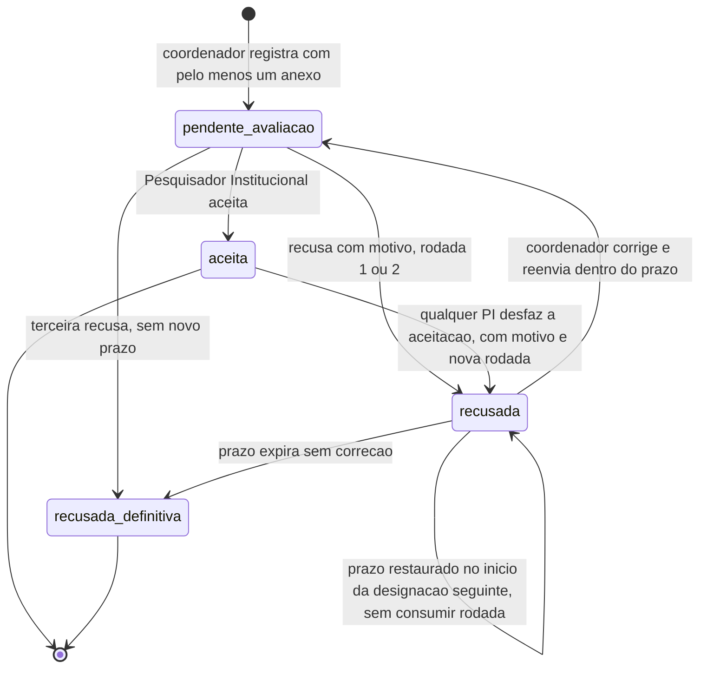
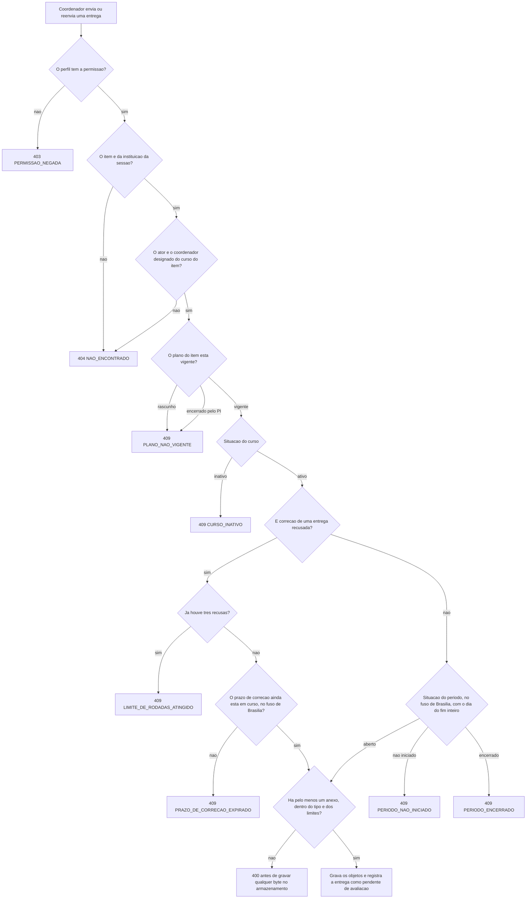
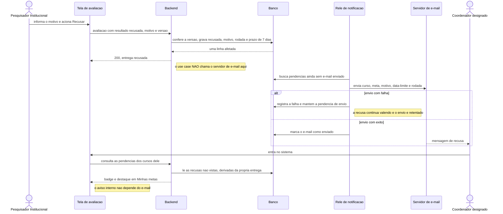
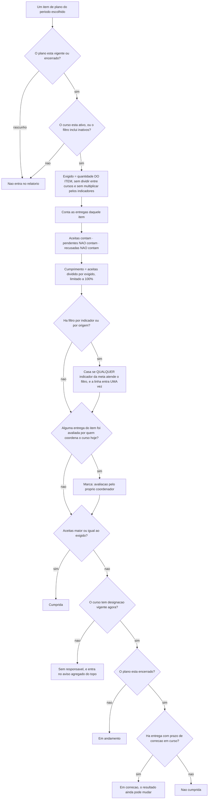

# Spec: metas-coordenacao (entregas, avaliação e desempenho)

**Data desta versão:** 28/09/2026 · **5ª versão — diagramas e wireframes restaurados**
**Status:** em validação pelo dono do produto
**Contexto:** `specs/00-visao-produto.md` · `specs/autenticacao-usuarios/spec.md` ·
`specs/cursos/spec.md` · `specs/indicadores/spec.md` ·
`specs/plano-acao/spec.md` · Stack: `project.config.md`
**Nível de rigor:** completo (`ux.md`, `design.md`, `tasks.md`, `evidence.md`)

> **O nome da pasta é histórico.** O que vive aqui é a **execução**: a **Entrega**
> do coordenador, os **Anexos**, a **avaliação** pelo Pesquisador Institucional
> (PI), a **notificação de recusa** e o **relatório de desempenho**.
>
> **Não repete** o contexto de `autenticacao-usuarios` (perfis múltiplos,
> isolamento, 404 de outra instituição, padrão de CRUD, campos base, concorrência
> otimista, deleção lógica, paginação, formato de erro), de `cursos` (curso,
> designação por portaria, coordenador derivado, curso vago e inativo, **acúmulo de
> papéis**), de `indicadores` (Meta e Indicador como catálogos, **meta com um ou
> mais indicadores**) nem de `plano-acao` (período, plano, itens,
> quantidade, situação, documento, cópia em lote). **Referencia.**

---

## 0. O que mudou nesta versão

Esta versão **não muda regra nenhuma**. Restaura os **quatro diagramas Mermaid** e
os **wireframes completos** que se perderam na reescrita anterior, atualizados ao
modelo atual — que é diferente do que eles descreviam quando foram escritos.
Nenhum deles tinha sido movido para outra spec; foram perdidos, e a perda não foi
avisada.

**As mudanças de conteúdo da versão anterior, que permanecem:**

| Antes | Agora |
|---|---|
| O PI não avaliava entrega de curso que coordena → **403** | **Avalia**, e o sistema **marca** que avaliador e coordenador são a mesma pessoa (3.9, 3.10) |
| Coluna "Indicador", um por meta | **Lista de indicadores**, e filtrar por indicador **não duplica a linha** (3.10) |
| — | **Uma entrega atende todos os indicadores da meta**, sem multiplicar a exigência (3.1) |

---

## 1. Premissas declaradas

| # | Premissa | Se for rejeitada |
|---|---|---|
| **PM-1** | **Prazo de correção: 7 dias corridos**, do instante da recusa ao fim do 7º dia no fuso de Brasília (3.3) | Trocar o número; o mecanismo não muda |
| **PM-2** | **Limite de três rodadas de recusa.** Na terceira, recusada em definitivo, **sem** novo prazo (3.3) | Trocar o número. Zero rodadas equivale a não ter correção |
| **PM-3** | **Desfazer aceitação não tem janela temporal**, só o limite de rodadas (3.4) | Entra prazo-limite, e a pergunta do que fazer com o erro descoberto depois dele |
| **PM-4** | **Prazo restaurado após vacância:** entrega recusada cujo prazo expirou **enquanto o curso estava sem coordenador** ganha 7 dias novos no início da designação seguinte, **sem consumir rodada** (3.5) | O prazo corre durante a vacância e o curso perde evidência por problema administrativo — o oposto de `X6` |
| **PM-5** | **Anexo:** PDF, JPG/JPEG, PNG, DOCX, ODT; **10 MB por arquivo**, **10 arquivos**, **50 MB por entrega** (3.6) | Ajustar valores e lista |
| **PM-6** | **Hash SHA-256 de cada anexo** | Remover o campo |
| **PM-7** | **Retenção: 5 anos após o fim do período**, depois descarte do objeto e anonimização de quem enviou (9) | Substituir os prazos |
| **PM-8** | **Exportação do relatório em CSV** (UTF-8 com BOM, separador `;`) (3.10) | Saem a exportação e `RD-12`, `RD-13` |
| **PM-9** | **Texto simples, sem editor rico**, na observação e nos motivos | Entram TipTap e sanitização com allowlist no backend |
| **PM-10** | **Volume:** centenas de cursos, ~1 plano por curso e período, ~10 itens por plano → **~3.000 itens e ~10.000 entregas por período** (11) | Rever índices, paginação e exportação síncrona |

---

## 2. Objetivo

Permitir que o **coordenador** de um curso preste contas do plano de ação dele
anexando comprovantes, que o **PI** avalie cada entrega, e que o sistema **apure o
desempenho de cada curso** — por item do plano, e portanto por meta e pelos
indicadores dela.

### Não-objetivos

- **Curso, designação, catálogos, período, plano, itens, quantidade, documento e
  cópia em lote** — estão nas outras três specs.
- **Ler, validar ou conferir o conteúdo do anexo.**
- **Aprovação em mais de um nível**, parecer intermediário, recurso formal.
- **Prazo por entrega** e **lembrete automático de prazo**.
- **Histórico visível das rodadas anteriores** da mesma entrega (16, **QM-4**).
- **XLSX, PDF e exportação assíncrona.**
- **Cobertura de indicadores** — a cadeia existe (`indicadores`), a tela é roadmap.
- **Impedir que quem coordena avalie** — decisão do dono em `cursos`, 3.10. Aqui a
  coincidência é **marcada**, nunca bloqueada.
- **Campo pessoal novo.**

---

## 3. Decisões de comportamento

### 3.1 Cada entrega aceita conta 1 — e atende todos os indicadores da meta

**Decisão do dono.** Para um item que exige 4, o coordenador registra **quatro
entregas**, e cada entrega carrega quantos comprovantes o fato produziu.

- **Nunca se contam arquivos.** Três documentos de uma reunião não são três
  reuniões. É a regra mais fácil de quebrar sem ninguém perceber, porque o número
  continua saindo.
- **Nunca se multiplica pela quantidade de indicadores.** A meta "Registrar
  reuniões de NDE em ata" aponta para **1.4** e **1.5**; o item exige **4**; o
  coordenador faz **4 entregas, não 8**, e cada uma **atende os dois indicadores de
  uma vez** (`indicadores`, 3.3).

**Cumprimento = entregas aceitas ÷ quantidade do item.** Pendente **não conta**;
recusada **não conta**. **O número de indicadores não entra na conta em ponto
nenhum.**

### 3.2 A entrega pende do item do plano

| Campo | Regra |
|---|---|
| `item_plano_id` | obrigatório — dele vêm **curso, meta e quantidade** |
| `enviada_por` · `corrigida_por` | quem registrou · quem fez a última correção |
| `observacao` | opcional, texto simples |
| `situacao` | `pendente_avaliacao` · `aceita` · `recusada` (3.3) |
| `rodadas_de_recusa` · `prazo_correcao_ate` | ver 3.3 e 3.4 |
| `avaliada_por` · `avaliada_em` · `motivo` | preenchidos na avaliação |
| campos base | `id` UUIDv7 gerado no domínio, `criado_em`, `atualizado_em`, `excluido_em`, `versao` |

**O item é o eixo.** Já sabe de qual curso se trata, qual meta está sendo
comprovada e quanto se exige. O vínculo com a pessoa é **histórico**, e é isso que
faz a troca de coordenador não mexer em nada.

### 3.3 Ciclo de vida: recusa, prazo e rodadas

- A entrega **nasce `pendente_avaliacao`**. Não há rascunho.
- **Recusar exige motivo.**
- **A recusa abre prazo de correção** de 7 dias corridos (PM-1), do instante da
  recusa ao fim do 7º dia no fuso de Brasília. **Vale mesmo com o período
  encerrado** — sem isso, recusar no último dia equivale a reprovar sem direito de
  resposta. Exemplo: recusa em **29/07/2026 às 16h40**, período terminando em
  **30/07** → correção possível até **05/08/2026 às 23h59min59s (-03:00)**.
- **Corrigir é editar a entrega recusada** e reenviar.

**Limite de rodadas (PM-2): três recusas.** Na 1ª e na 2ª abre-se prazo, com a tela
dizendo "Recusa 1 de 3" / "Recusa 2 de 3 — você tem mais uma chance de corrigir".
Na **3ª**, **recusada em definitivo, sem novo prazo**.

**Duas portas para o mesmo estado terminal:** prazo expirado sem correção, e rodadas
esgotadas. As duas estão no diagrama 17.1.

### 3.4 Desfazer aceitação — e quem pode

**`aceita` não é terminal.** O PI pode desfazer, com **motivo obrigatório**.

- **Qualquer PI da instituição pode desfazer, não apenas quem aceitou** — decisão
  do dono: travar no autor deixaria um erro insolúvel quando a pessoa estivesse de
  férias ou tivesse saído. **A trilha registra quem aceitou e quem desfez.**
- **A entrega volta a `recusada`**, com o motivo, **abre prazo de 7 dias**,
  **consome uma rodada** e **notifica nos dois canais** (3.8).
- **O número do relatório diminui na hora**, e a linha passa a "Em correção".
- **Bloqueado com as três rodadas esgotadas** → 409 `LIMITE_DE_RODADAS_ATINGIDO`.
- **O que o coordenador vê:** *"A aceitação desta entrega foi desfeita em
  12/08/2026 por Beatriz Andrade: «a ata anexada é de outra reunião». Corrija até
  19/08/2026 — rodada 2 de 3."*

**Demais regras:** entrega aceita não é editada nem excluída → 409; excluir entrega
não aceita só **quem a enviou** → 403 `EXCLUSAO_DE_ENTREGA_ALHEIA`; entregar acima
do exigido é permitido, com `5/4` e percentual limitado a 100 %.

### 3.5 Quando a entrega é possível — e o curso vago

| Condição | Falha responde |
|---|---|
| O **plano está vigente** | 409 `PLANO_NAO_VIGENTE` |
| O **período está aberto** | 409 `PERIODO_NAO_INICIADO` · `PERIODO_ENCERRADO` |
| O **curso está ativo** | 409 `CURSO_INATIVO` |
| O **curso tem designação vigente** | 409 `CURSO_SEM_COORDENADOR` |
| Quem registra **é o coordenador designado** | **404** `NAO_ENCONTRADO` |

**A janela de enviar fecha; a de julgar não.** Período encerrado, plano encerrado e
curso inativo **continuam aceitando avaliação** das pendentes.

**Curso sem coordenador:** ninguém registra entrega, o plano continua vigente e
sendo cobrado, e o curso aparece como **"Sem responsável"** (3.10). **Nem o PI
entrega no lugar do curso** — a entrega é ato de quem **responde** pelo curso, e
responder é ter designação. Quem quiser entregar tem o caminho legítimo:
**designar-se**, com portaria, o que fica registrado e marcado (`cursos`, 3.10).

**Prazo restaurado na designação seguinte (PM-4):** toda entrega recusada cujo
prazo tenha expirado **enquanto o curso estava vago** ganha **7 dias novos** do
início da designação seguinte, **sem consumir rodada**. Entrega cujo prazo expirou
**antes** de o curso ficar vago **não** é restaurada.

### 3.6 Anexos: fronteira de confiança, armazenamento e download

- **Tipos (PM-5):** PDF, JPG/JPEG, PNG, DOCX, ODT. **Limites:** 10 MB por arquivo,
  10 arquivos, 50 MB por entrega.
- **O tipo é verificado pelo conteúdo real**, não pela extensão nem pelo cabeçalho
  do navegador. Renomear `programa.exe` para `ata.pdf` tem de ser recusado — é
  fronteira de confiança, fora da escada de simplicidade. **A recusa acontece antes
  de gravar qualquer byte.**
- **O arquivo vai para o armazenamento externo (MinIO), nunca para o disco do
  container.**
- **O download passa por rota autenticada**, que verifica permissão, instituição e
  recorte por curso. **A URL do bucket nunca é exposta** — nem direta, nem assinada
  com prazo, nem em payload de listagem.
- O registro guarda nome original, tipo, tamanho, chave do objeto e hash SHA-256
  (PM-6). **O nome original pode conter dado pessoal** (9).
- **Remoção de anexo é lógica no banco;** o objeto só sai pela rotina de retenção.

### 3.7 Idempotência no registro de entrega

Nada impede duas entregas iguais, e duas aceitas contam **2**. Um duplo clique, ou
um retry de rede num envio de 40 MB, **infla exatamente o número que a feature
existe para produzir**.

**`Idempotency-Key` é obrigatório no registro de entrega.** O reenvio com a mesma
chave devolve a entrega já criada, com 200. O `LoadingButton` é conforto, não
garantia.

### 3.8 Notificação: e-mail **e** aviso dentro do sistema

**Decisão do dono: os dois, juntos.** O e-mail atrasa, cai em spam ou é lido no
celular e esquecido, e a recusa tem prazo correndo contra ela.

Dispara em **três eventos**: recusa, **desfazimento de aceitação** (3.4) e
**restauração de prazo após vacância** (3.5).

- **E-mail** para o coordenador **designado**, com curso, meta, motivo, data-limite,
  rodada e o caminho da entrega. **Sem anexo, sem conteúdo de comprovante, sem dado
  de terceiro.**
- **Aviso interno:** a entrega aparece destacada em `Minhas metas`, e o item de
  menu ganha **badge** com as pendências não vistas.
- **Infraestrutura:** **Mailpit** em dev; **SMTP real em produção** (**D2**).

**Escrita dupla identificada.** Gravar a recusa e enviar o e-mail são duas escritas
duráveis na mesma operação — o *dual write* do `CLAUDE.md`, desenhado em **17.3**.
O desenho da solução é do `arquiteto`; esta spec fixa o que não se aceita:

1. **Falha no envio nunca desfaz a recusa** nem devolve erro ao PI.
2. **Recusa registrada sem e-mail enviado não pode ficar assim em silêncio.**
3. **O aviso interno não é segunda escrita** — é derivado do estado da entrega.

O que não se aceita é o use case chamar o servidor de e-mail dentro da transação.

### 3.9 Quem enxerga o quê — e o acúmulo de papéis

O recorte interno é **o conjunto de cursos que a pessoa coordena**, dado pela
designação vigente (`cursos`).

| Quem | Entregas | Anexos | Relatório |
|---|---|---|---|
| **Pesquisador Institucional** | Todas da instituição; **avalia** e **desfaz aceitação** | Baixa todos da instituição | Completo |
| **Coordenador de Curso** | **Todas as dos cursos dele**, inclusive de antecessores; registra, corrige, exclui as que **ele** enviou | Só os das entregas dos cursos dele | **Só os cursos dele** |
| Quem só tem **Professor** e/ou **Aluno** | Nenhuma — 403 | Nenhum — 403 | Nenhum — 403 |
| **Administrador do Sistema** | Nenhuma — **403** | idem | idem |

| Situação | Código |
|---|---|
| Perfil não tem a permissão | **403** `PERMISSAO_NEGADA` |
| Recurso de **outra instituição** | **404** `NAO_ENCONTRADO` |
| Recurso de **curso que o ator não coordena** | **404** `NAO_ENCONTRADO` |
| Excluir entrega do próprio curso **enviada por outra pessoa** | **403** `EXCLUSAO_DE_ENTREGA_ALHEIA` |

**Quem acumula PI e Coordenador enxerga pelos dois recortes, somados.**

#### Acúmulo de papéis: permitido, e marcado

**O PI avalia entrega de curso que ele próprio coordena.** A proibição foi
**considerada e rejeitada pelo dono** — o raciocínio dos dois lados está em
`cursos`, 3.10. **Não existe `AVALIACAO_DO_PROPRIO_CURSO` em lugar nenhum.**

Onde a coincidência fica visível:

1. **Na auditoria** (10): `avaliar_entrega` e `desfazer_aceitacao` carregam
   **`avaliador_e_coordenador_do_curso`**, verdadeiro quando quem avaliou tinha
   designação vigente no curso da entrega **no instante da avaliação**.
2. **No relatório** (3.10): a linha ganha a marca **"avaliação pelo próprio
   coordenador"**, com **filtro** para listar só essas linhas.

**A marca da auditoria descreve o instante; a do relatório descreve o presente.**
São coisas diferentes de propósito: o registro não muda quando a coordenação muda —
conta o que era verdade quando a avaliação aconteceu —, enquanto a marca do
relatório reflete quem coordena **agora**, porque é a leitura que interessa a quem
lê hoje.

### 3.10 Relatório de desempenho

**Uma linha por item de plano**, dentro do período escolhido — *um curso, uma
meta*. A apuração de cada linha está no diagrama **17.4**.

| Coluna | Como se obtém |
|---|---|
| Curso | Do plano |
| Responsável | Coordenador da designação vigente, com "desde DD/MM" quando assumiu depois do início do período; ou **"Vago desde DD/MM"**; ou **"Vago o período inteiro"** |
| Meta | Do item |
| **Indicadores** | **Lista** — todos os da meta, com a origem de cada um |
| Exigido | **Quantidade do item — nunca dividida entre cursos, nunca multiplicada pelos indicadores** |
| Aceitas · Pendentes · Em correção | Entregas por situação; **pendentes e em correção não contam** |
| Cumprimento | `aceitas ÷ exigido`, **limitado a 100 %** |
| Situação | Cumprida · **Sem responsável** ⚠ · Em andamento · Em correção · Não cumprida |
| **Marcas** | "inclui entregas de gestão anterior" · **"avaliação pelo próprio coordenador"** |

**"Sem responsável" separa duas coisas que uma avaliação externa lê de formas muito
diferentes:** *não cumpriu* e *não havia quem cumprisse*. A primeira é desempenho;
a segunda é gestão.

**A pendência de curso vago aparece em três camadas:** aviso agregado no topo,
marca na linha e situação própria.

**Filtrar por indicador não duplica a linha.** Uma meta com dois indicadores que
casem com o filtro aparece **uma única vez** — deduplicação explícita, não efeito
colateral de `DISTINCT`.

**Demais regras:** só entram planos **vigentes e encerrados** (rascunho não cobra e
não aparece); item sem entrega aparece com 0; cursos inativos ficam fora por padrão,
com filtro; **filtros** — Período (obrigatório), Curso, Meta, Indicador, Origem do
indicador, Situação, Responsável, **Avaliação pelo próprio coordenador**, Incluir
cursos inativos; **ordenação padrão Curso ▲, depois Meta ▲**, página 20, máximo
100, **Indicadores não é ordenável**; **exportação CSV** respeitando os filtros, com
a lista de indicadores separada por `·` e **as marcas em colunas próprias**, em
fluxo, limite de 50.000 linhas, **auditada** e **indisponível ao coordenador**.

### 3.11 `Minhas metas` é a única exceção ao padrão de CRUD

**Aprovado pelo dono.** A tela `/app/minhas-metas` **abre já preenchida**, sem
exigir "Pesquisar". É a lista de obrigações da pessoa, e exigir um clique para ver
o próprio trabalho é fricção sem contrapartida — o período vem pré-selecionado e é
o único recorte.

**A exceção é limitada a essa rota e não é precedente:** vale **exclusivamente**
para `/app/minhas-metas`; **todas as demais listagens seguem o padrão obrigatório**;
**tela nova que queira o mesmo tratamento volta ao analista** — "a `Minhas metas`
faz assim" **não é justificativa**; o `code-reviewer` trata como achado qualquer
outra listagem que consulte na montagem.

### 3.12 Auditoria e deleção lógica

**Nenhuma entidade é removida fisicamente.** Registrar, corrigir, excluir, avaliar,
**desfazer aceitação**, **baixar anexo** e **exportar relatório** são auditados
(10). Toda consulta filtra `excluido_em IS NULL` e a instituição pelo adapter
centralizado.

---

## 4. O que é inaceitável acontecer

| # | O que não pode acontecer | O que impede |
|---|---|---|
| **X1** | **O número do relatório estar errado** — pendente contada como cumprida, anexo contado como entrega, entrega duplicada, quantidade dividida entre cursos **ou multiplicada pelos indicadores** | 3.1, 3.7, a quantidade no item, e testes em `EN-05`, `RD-01` a `RD-03` |
| **X2** | **Um comprovante aceito desaparecer** | Deleção lógica sem exceção; entrega aceita imutável enquanto aceita; objeto só descartado pela retenção |
| **X3** | **Alguém ver ou prestar contas por curso que não coordena** | Recorte por curso no use case, com 404 dentro da própria instituição (3.9) |
| **X4** | **Anexo de uma instituição alcançável por outra** | Download por rota autenticada, URL de bucket nunca exposta (3.6, 3.9) |
| **X5** | **O coordenador ser recusado e não ficar sabendo**, com o prazo correndo | Notificação em dois canais e prazo próprio (3.8, 3.3) |
| **X6** | **Perder o direito de corrigir por algo fora do alcance de quem entrega** | Prazo válido com período encerrado (3.3) e restaurado na designação seguinte (3.5) |
| **X7** | **Uma entrega do último dia ser recusada por causa do fuso horário** | Comparação no fuso de Brasília, com o dia da data de fim inteiro (17.2) |
| **X8** | **A regra mudar embaixo de quem já cumpriu** | Quantidade e itens congelam no encerramento (`plano-acao`) |
| **X9** | **Duas avaliações simultâneas** com resultado indeterminado | `versao` → 409, e 409 `ENTREGA_JA_AVALIADA` |
| **X10** | **Arquivo executável entrar no acervo** disfarçado de PDF | Tipo verificado pelo conteúdo real, antes de gravar |
| **X11** | **A troca de coordenador zerar, redistribuir ou travar o que o curso já comprovou** | Entrega pende do item, não da pessoa (3.2) |
| **X12** | **O relatório dizer "não cumpriu" onde a verdade é "não havia quem cumprisse"** | Situação própria "Sem responsável" e aviso agregado (3.10, 17.4) |
| **X13** | **Uma aceitação ser desfeita sem o coordenador poder reagir** | Desfazimento bloqueado com rodadas esgotadas, com prazo novo e notificação (3.4) |
| **X14** | **Quem entrega avaliar a si mesmo e isso passar despercebido.** O acúmulo é permitido; **a invisibilidade não é** — um cumprimento de 100 % em que quem produziu a evidência foi quem a aprovou vale menos do que parece | Marca na auditoria e no relatório, com filtro próprio (3.9, 3.10) |

---

## 5. Atores e fluxos principais

| Ator | O que faz |
|---|---|
| **Pesquisador Institucional** | Avalia entregas, desfaz aceitação, consulta e exporta o relatório |
| **Coordenador de Curso** | Vê os planos vigentes dos cursos que coordena, registra entregas, corrige recusas, consulta o desempenho deles |
| **Professor**, **Aluno**, **Administrador do Sistema** | Nada |

**Fluxo 1 — Ver o que me cabe (coordenador).** Menu "Metas → Minhas metas"; abre já
preenchida (3.11), **agrupada por curso**, com o progresso de cada item e **os
indicadores de cada meta**.

**Fluxo 2 — Prestar contas.** Página de entrega, com curso, meta, **indicadores** e
prazo no topo, observação opcional e área de anexos.

**Fluxo 3 — Avaliar (PI).** Menu "Metas → Avaliação de entregas", com badge; abre a
entrega e vê curso, meta, indicadores, quem enviou, data, observação e os anexos.
**Quando o curso é coordenado por quem avalia, a tela avisa que a avaliação ficará
marcada** — e permite prosseguir.

**Fluxo 4 — Corrigir.** O aviso, o badge ou o e-mail levam à entrega; lê o motivo e
a rodada, troca ou acrescenta anexos, reenvia.

**Fluxo 5 — Desfazer uma aceitação (PI).** Com motivo; a confirmação avisa que **o
cumprimento vai diminuir**, que uma rodada será consumida e que o coordenador será
notificado.

**Fluxo 6 — Consultar o desempenho (PI).** Menu "Metas → Desempenho dos cursos";
"Pesquisar" popula, com o aviso agregado de cursos vagos e as marcas nas linhas.

**Fluxo 7 — Assumir um curso (sucessor).** Na primeira visita após a posse, o curso
aparece com **todo o histórico**, incluindo as entregas com **prazo restaurado**.

---

## 6. Fluxos alternativos e de erro

| Condição | Comportamento |
|---|---|
| Entrega em plano que não está vigente | 409 `PLANO_NAO_VIGENTE` |
| Entrega em período não iniciado / encerrado fora de correção | 409 `PERIODO_NAO_INICIADO` / `PERIODO_ENCERRADO` |
| Entrega para curso inativo | 409 `CURSO_INATIVO` |
| **Entrega para curso sem coordenador** | 409 `CURSO_SEM_COORDENADOR` (3.5) |
| Entrega em item de curso que o ator não coordena | **404** `NAO_ENCONTRADO` |
| Entrega sem nenhum anexo | 400 `ENTREGA_SEM_ANEXO` |
| Anexo de tipo não permitido, inclusive renomeado | 400 `ANEXO_TIPO_NAO_PERMITIDO` |
| Anexo acima de 10 MB · mais de 10 · soma acima de 50 MB | 400 `ANEXO_ACIMA_DO_LIMITE` / `ANEXOS_ACIMA_DO_LIMITE` |
| Reenvio com a mesma `Idempotency-Key` | **200** com a entrega já criada |
| Editar ou excluir entrega aceita | 409 `ENTREGA_ACEITA_NAO_EDITAVEL` / `ENTREGA_ACEITA_NAO_EXCLUIVEL` |
| Excluir entrega enviada por outra pessoa | 403 `EXCLUSAO_DE_ENTREGA_ALHEIA` |
| Corrigir depois do prazo · depois da 3ª recusa | 409 `PRAZO_DE_CORRECAO_EXPIRADO` / `LIMITE_DE_RODADAS_ATINGIDO` |
| Recusar ou desfazer aceitação sem motivo | 400 `MOTIVO_OBRIGATORIO` |
| Desfazer aceitação com rodadas esgotadas · de entrega não aceita | 409 `LIMITE_DE_RODADAS_ATINGIDO` / `ENTREGA_NAO_ESTA_ACEITA` |
| Avaliar entrega já avaliada | 409 `ENTREGA_JA_AVALIADA` |
| **PI avaliando entrega de curso que ele coordena** | **Permitido** · a tela avisa antes, e o registro e o relatório marcam (3.9) |
| Duas avaliações concorrentes | 409 `CONFLITO_DE_VERSAO` · **nunca** salvar por cima |
| Coordenador avaliando, desfazendo aceitação ou exportando | 403 `PERMISSAO_NEGADA` |
| Professor, Aluno ou Administrador do Sistema em qualquer rota | 403 `PERMISSAO_NEGADA` |
| Qualquer recurso de outra instituição | **404** `NAO_ENCONTRADO` |
| Relatório sem período informado | 400 `PERIODO_OBRIGATORIO` |
| `sort` fora da lista fechada, ou `sort` por indicadores | 400 — nunca ignorado em silêncio |
| Falha no envio do e-mail | A recusa **permanece**, o PI não vê erro, o envio é retentado (3.8) |
| Falha ao gravar o anexo no armazenamento | 500 genérico · a entrega **não** é criada · nenhum anexo órfão |

---

## 7. Critérios de aceite (Given/When/Then)

> Dados na seção 8. Famílias: `EN` entrega, `AN` anexo, `AV` avaliação, rodadas e
> desfazimento, `VG` curso vago e inativo, `NT` notificação, `RD` relatório,
> `VI` visibilidade e autorização.

### 7.1 Entrega

```gherkin
Cenário EN-01: registro de entrega com vários comprovantes
  Dado Ana Lima coordenando Engenharia de Software pela Portaria 47/2026
    E o plano do curso em 2026.1 VIGENTE, com o item "Registrar reuniões de
      NDE em ata" exigindo 4
  Quando ela registra uma entrega para ESSE item, com a observação "Reunião
        ordinária do NDE de 12/03/2026" e anexa a ata, a lista de presença e
        a convocação
  Então responde 201 com a entrega em pendente de avaliação
    E a entrega se vincula ao ITEM DO PLANO, de onde vêm curso, meta e
      quantidade
    E registra Ana como quem enviou

Cenário EN-02: entrega sem anexo
  Quando Ana envia sem nenhum comprovante
  Então responde 400 "ENTREGA_SEM_ANEXO"

Cenário EN-03: plano não vigente não recebe entrega
  Dado o plano do curso em RASCUNHO
  Quando Ana tenta registrar entrega
  Então responde 409 "PLANO_NAO_VIGENTE"
    E NÃO responde 404: ela acabou de ler o plano e de gerar o documento
      dele, e um 404 aqui deixaria de esconder e passaria a mentir
  Dado o plano encerrado antecipadamente pelo PI
  Quando ela tenta registrar
  Então responde 409 "PLANO_NAO_VIGENTE"

Cenário EN-04: período encerrado e período não iniciado
  Dado 2026.1 encerrado e hoje 02/08/2026
  Quando Ana tenta registrar nova entrega
  Então responde 409 "PERIODO_ENCERRADO"
  Quando tenta registrar para um item de plano de 2026.2, não iniciado
  Então responde 409 "PERIODO_NAO_INICIADO"

Cenário EN-05: cada entrega conta 1, qualquer que seja o nº de anexos ou de
             indicadores
  Dado o item que exige 4, de uma meta que aponta para 1.4 e 1.5
  Quando Ana registra UMA entrega com 3 anexos e ela é aceita
  Então o cumprimento daquele item é 1 de 4, nunca 3 de 4
  Quando ela registra mais três, todas aceitas
  Então é 4 de 4 e a linha aparece como Cumprida
    E ela NÃO precisou fazer 8 entregas por causa dos dois indicadores
    E os dois indicadores são atendidos por essas mesmas 4

Cenário EN-06: duplo envio não cria duas entregas
  Quando o mesmo registro é enviado duas vezes com a mesma Idempotency-Key
  Então o primeiro responde 201 e o segundo responde 200 com a MESMA entrega
    E existe exatamente uma entrega
    E o botão fica desabilitado com "Enviando..." após o primeiro clique

Cenário EN-07: coordenador não entrega por curso que não coordena
  Quando Ana tenta registrar entrega em item do plano de Análise e
        Desenvolvimento, que é de Paulo
  Então responde 404 "NAO_ENCONTRADO", nunca 403

Cenário EN-08: entrega aceita não é editada nem excluída
  Quando Ana tenta excluir ou alterar uma entrega aceita
  Então responde 409
    E o caminho para mexer nela é o PI desfazer a aceitação

Cenário EN-09: entregar acima do exigido é permitido
  Dado o item que exige 4 e 4 entregas aceitas
  Quando Ana registra a quinta
  Então responde 201
    E o relatório mostra 5 de 4, com cumprimento limitado a 100%

Cenário EN-10: exclusão de entrega própria, não aceita, é lógica
  Quando Ana exclui uma entrega dela ainda pendente
  Então responde 204, excluido_em é preenchido, nenhuma linha é removida

Cenário EN-11: ninguém exclui entrega alheia
  Dado Paulo assumindo Engenharia de Software depois de Ana
  Quando Paulo tenta excluir uma entrega enviada por Ana
  Então responde 403 "EXCLUSAO_DE_ENTREGA_ALHEIA"
    E excluir uma que ele mesmo enviou, não aceita, responde 204
```

### 7.2 Anexos

```gherkin
Cenário AN-01: tipos aceitos
  Então PDF, JPG, JPEG, PNG, DOCX e ODT são aceitos
    E cada anexo guarda nome original, tipo, tamanho, chave do objeto e hash

Cenário AN-02: tipo não permitido, inclusive renomeado
  Quando Ana anexa "ata-nde.exe"
  Então responde 400 "ANEXO_TIPO_NAO_PERMITIDO"
  Quando ela renomeia o mesmo executável para "ata-nde.pdf" e anexa
  Então responde 400 "ANEXO_TIPO_NAO_PERMITIDO"
    E a verificação usa o conteúdo real

Cenário AN-03: limites de tamanho e de quantidade
  Quando o arquivo tem 12 MB
  Então responde 400 "ANEXO_ACIMA_DO_LIMITE"
    E nenhum byte é gravado no armazenamento
  Quando os anexos somam 58 MB, ou chegam ao 11º arquivo
  Então responde 400 "ANEXOS_ACIMA_DO_LIMITE"

Cenário AN-04: download passa por rota autenticada da aplicação
  Quando Ana baixa a ata de uma entrega de um curso dela
  Então responde 200 com o conteúdo
    E nenhuma resposta da API expõe a URL do bucket, assinada ou não
    E o download é registrado na auditoria

Cenário AN-05: anexo de outra instituição
  Quando Renata, PI do IVV, pede um anexo de uma entrega da FSA
  Então responde 404 "NAO_ENCONTRADO"

Cenário AN-06: anexo de curso que o ator não coordena
  Quando Paulo pede um anexo de uma entrega de Sistemas de Informação
  Então responde 404 "NAO_ENCONTRADO", nunca 403

Cenário AN-07: sem sessão não há download
  Quando alguém sem cookie chama a rota de conteúdo do anexo
  Então responde 401 e nenhum byte do arquivo é enviado
```

### 7.3 Avaliação, rodadas e desfazimento

```gherkin
Cenário AV-01: aceitar a entrega
  Quando Maria aceita a entrega de Ana
  Então responde 200 com a entrega em aceita
    E guarda quem avaliou e quando
    E o cumprimento daquele item sobe em 1

Cenário AV-02: recusar exige motivo
  Quando Maria recusa sem motivo
  Então responde 400 "MOTIVO_OBRIGATORIO" e a entrega continua pendente

Cenário AV-03: a recusa abre prazo próprio de correção
  Dado 2026.1, que termina em 30/07/2026
  Quando Maria recusa em 29/07/2026 as 16h40 com o motivo "A lista de
        presença não corresponde à data da ata."
  Então responde 200 com a entrega em recusada
    E o prazo vai até 05/08/2026 as 23h59min59s de Brasília
    E a tela de Ana mostra o motivo, a data-limite e "Recusa 1 de 3"

Cenário AV-04: correção dentro do prazo vale com o período encerrado
  Dado a recusa de AV-03 e hoje 03/08/2026, com 2026.1 encerrado
  Quando Ana substitui a lista de presença e reenvia
  Então responde 200 e a entrega volta a pendente de avaliação
    E NÃO responde "PERIODO_ENCERRADO"

Cenário AV-05: correção depois do prazo
  Dado a recusa de AV-03 e hoje 06/08/2026
  Quando Ana tenta reenviar
  Então responde 409 "PRAZO_DE_CORRECAO_EXPIRADO"

Cenário AV-06: entrega já avaliada não é avaliada de novo
  Quando Beatriz tenta aceitar ou recusar uma entrega já aceita
  Então responde 409 "ENTREGA_JA_AVALIADA"

Cenário AV-07: duas avaliações concorrentes
  Dado Maria e Beatriz com a mesma entrega pendente aberta, na versao 1
  Quando as duas avaliam ao mesmo tempo
  Então exatamente uma tem êxito e a outra recebe 409

Cenário AV-08: avaliar continua possível com o período encerrado
  Quando Maria avalia em 02/08/2026 entregas pendentes de 30/07/2026
  Então responde 200 normalmente
    E o mesmo vale para plano encerrado e curso inativo

Cenário AV-09: coordenador que não é PI não avalia
  Dado Ana, com os perfis Professor, Aluno e Coordenador
  Quando ela tenta aceitar, recusar ou desfazer a aceitação de qualquer
        entrega, inclusive das dela
  Então responde 403 "PERMISSAO_NEGADA"

Cenário AV-10: a terceira recusa encerra a entrega, sem novo prazo
  Dado uma entrega já recusada e corrigida duas vezes
  Quando Maria a recusa pela terceira vez
  Então responde 200 e a entrega fica recusada em definitivo
    E NENHUM prazo de correção novo é aberto
    E reenviar responde 409 "LIMITE_DE_RODADAS_ATINGIDO"

Cenário AV-11: qualquer PI desfaz a aceitação, não só quem aceitou
  Dado uma entrega aceita por Maria, na rodada 1
  Quando BEATRIZ, outra PI da FSA, desfaz a aceitação em 12/08/2026 as 10h00,
        com o motivo "a ata anexada é de outra reunião"
  Então responde 200 e a entrega volta a recusada
    E NÃO é exigido que quem desfaz seja quem aceitou
    E a trilha registra que Maria aceitou e que Beatriz desfez
    E abre prazo até 19/08/2026 as 23h59min59s
    E consome uma rodada, passando a "rodada 2 de 3"
    E o cumprimento daquele item DIMINUI em 1, imediatamente
    E o coordenador é notificado por e-mail e dentro do sistema

Cenário AV-12: o que o coordenador vê quando a aceitação é desfeita
  Então a entrega sobe destacada em Minhas metas com o texto "A aceitação
        desta entrega foi desfeita em 12/08/2026 por Beatriz Andrade: «a ata
        anexada é de outra reunião». Corrija até 19/08/2026 - rodada 2 de 3."

Cenário AV-13: desfazer exige motivo e só vale sobre entrega aceita
  Quando Maria desfaz sem informar motivo
  Então responde 400 "MOTIVO_OBRIGATORIO"
  Quando tenta desfazer a aceitação de uma entrega pendente ou recusada
  Então responde 409 "ENTREGA_NAO_ESTA_ACEITA"

Cenário AV-14: não se desfaz aceitação com as rodadas esgotadas
  Dado uma entrega aceita depois de já ter sido recusada três vezes
  Quando Maria tenta desfazer a aceitação
  Então responde 409 "LIMITE_DE_RODADAS_ATINGIDO"

Cenário AV-15: o PI avalia entrega de curso que ele coordena, e fica marcado
  Dado Beatriz Andrade com os perfis Pesquisador Institucional e Professor
    E designação VIGENTE dela em Biomedicina, pela Portaria 70/2026
    E uma entrega pendente de um item do plano de Biomedicina
  Quando Beatriz aceita essa entrega
  Então responde 200 - a avaliação é PERMITIDA
    E NÃO existe o erro AVALIACAO_DO_PROPRIO_CURSO em lugar nenhum
    E a tela avisou, ANTES de confirmar, que a avaliação ficará marcada
    E o registro de auditoria traz avaliador_e_coordenador_do_curso verdadeiro
    E a linha do relatório ganha a marca "avaliação pelo próprio coordenador"

Cenário AV-16: o mesmo vale para o desfazimento
  Quando Beatriz desfaz a aceitação de uma entrega de Biomedicina
  Então responde 200
    E o registro de desfazer_aceitacao também traz a marca

Cenário AV-17: a marca da auditoria descreve o instante, não o presente
  Dado a entrega avaliada por Beatriz enquanto ela coordenava Biomedicina
  Quando outra pessoa é designada e Beatriz deixa de coordenar
  Então o registro de auditoria daquela avaliação CONTINUA marcado
    E a marca da linha do relatório reflete quem coordena AGORA, e deixa de
      aparecer quando nenhuma entrega do item tiver sido avaliada pelo
      coordenador vigente

Cenário AV-18: sem coincidência, sem marca
  Quando Maria, que não coordena nenhum curso, avalia uma entrega
  Então o registro traz avaliador_e_coordenador_do_curso falso
    E a linha do relatório NÃO ganha marca nenhuma
```

### 7.4 Curso vago e curso inativo

```gherkin
Cenário VG-01: curso vago não recebe entrega
  Dado Pedagogia sem designação vigente e o plano dele vigente
  Quando qualquer coordenador tenta registrar entrega para um item dele
  Então responde 409 "CURSO_SEM_COORDENADOR" ou 404, conforme o ator
    E nem mesmo o PI tem rota para entregar no lugar do curso

Cenário VG-02: o plano do curso vago continua valendo
  Dado Pedagogia vago, com plano vigente exigindo 2 de uma meta
  Então o plano continua vigente e continua sendo cobrado
    E a linha aparece no relatório com Exigido 2, Aceitas 0
    E a Situação é "Sem responsável", NÃO "Não cumprida"

Cenário VG-03: a pendência aparece em três camadas
  Dado Pedagogia e outro curso vagos, somando 5 metas não cumpridas
  Quando Maria abre o relatório de 2026.1
  Então o topo mostra "2 cursos sem coordenador acumulam 5 metas não
        cumpridas neste período"
    E a coluna Responsável mostra "Vago desde 15/06/2026" em cada linha
    E a Situação de cada uma é "Sem responsável"

Cenário VG-04: vago o período inteiro é distinguido
  Dado Pedagogia vago desde 10/12/2025, antes do início de 2026.1
  Então a linha mostra "Vago o período inteiro"

Cenário VG-05: quem assume encontra o histórico e o que falta
  Dado Engenharia de Software com 2 aceitas, 1 pendente e 1 recusada, e o
        curso vago desde 20/07/2026
  Quando Maria designa Paulo Tavares a partir de 10/08/2026
  Então Minhas metas de Paulo mostra o item com 2 de 4 aceitas
    E ele vê as entregas anteriores, com o nome de quem as enviou

Cenário VG-06: prazo restaurado no início da designação seguinte
  Dado a entrega recusada em 18/07/2026, com prazo até 25/07/2026
    E o curso vago desde 20/07/2026, com o prazo expirando na vacância
  Quando a designação de Paulo entra em vigência em 10/08/2026
  Então aquela entrega ganha prazo novo até 17/08/2026 as 23h59min59s
    E a rodada NÃO é consumida
    E Paulo é notificado, e a entrega aparece destacada na primeira visita
    E uma entrega cujo prazo expirou ANTES de o curso ficar vago NÃO é
      restaurada

Cenário VG-07: curso inativo não recebe entrega, e sai da cobrança
  Dado Nutrição inativado
  Quando o coordenador dele tenta registrar entrega
  Então responde 409 "CURSO_INATIVO"
    E o curso sai do relatório por padrão
    E o filtro "Incluir cursos inativos" o traz de volta
    E avaliar uma entrega pendente dele continua possível
```

### 7.5 Notificação

```gherkin
Cenário NT-01: e-mail ao coordenador designado
  Quando Maria recusa uma entrega de Engenharia de Software
  Então um e-mail é enviado ao coordenador com designação VIGENTE do curso
    E traz curso, meta, motivo, data-limite, rodada e o caminho da entrega
    E NÃO traz anexo, conteúdo de comprovante nem dado de terceiro
    E em ambiente local é capturado pelo Mailpit

Cenário NT-02: aviso dentro do sistema, com badge
  Quando a recusa acontece
  Então a entrega aparece destacada em Minhas metas, com motivo e prazo
    E o item de menu mostra badge com as pendências não vistas

Cenário NT-03: falha no envio não desfaz a recusa
  Dado o servidor de e-mail indisponível
  Quando Maria recusa a entrega
  Então a recusa é registrada e Maria recebe 200, sem erro na tela
    E o aviso interno aparece normalmente
    E o envio é retentado até ter êxito, com a última falha registrada
    E o use case NÃO chama o servidor de e-mail dentro da transação

Cenário NT-04: o badge zera ao ver a pendência
  Quando o coordenador abre a entrega
  Então o badge deixa de contá-la
    E o prazo não é afetado por ela ter sido vista ou não

Cenário NT-05: os três eventos que notificam
  Então recusa, desfazimento de aceitação e restauração de prazo após
        vacância notificam nos dois canais
    E aceitação NÃO envia e-mail

Cenário NT-06: quem coordena e avalia notifica a si mesmo
  Dado Beatriz coordenando Biomedicina e recusando uma entrega daquele curso
  Então o e-mail e o aviso interno vão para ela mesma, porque ela é a
        coordenadora designada
    E isso NÃO é tratado como erro nem suprimido - o registro do aviso é
      parte da trilha
```

### 7.6 Relatório de desempenho

```gherkin
Cenário RD-01: o exigido vem do item, e nunca é dividido nem multiplicado
  Dado a meta "Registrar reuniões de NDE em ata", que aponta para 1.4 e 1.5,
        nos planos de Engenharia (4), Sistemas de Informação (2) e
        Pedagogia (2)
  Então o relatório mostra três linhas, com Exigido 4, 2 e 2
    E nenhuma quantidade é dividida entre cursos
    E nenhuma quantidade é multiplicada pelos dois indicadores

Cenário RD-02: cumprimento é aceitas sobre exigido, por item
  Dado Engenharia com 2 aceitas de 4 e Sistemas de Informação com 0 de 2
  Então as linhas mostram 50% e 0%

Cenário RD-03: pendentes e recusadas não contam
  Dado Engenharia com 2 aceitas, 1 pendente e 1 recusada em correção
  Então o cumprimento continua 50%
    E as colunas Pendentes e Em correção mostram 1 cada

Cenário RD-04: uma linha por item de plano
  Dado o plano de Engenharia com 3 itens
  Então o relatório produz TRÊS linhas para esse curso
    E item sem nenhuma entrega aparece com 0 - nunca ausente

Cenário RD-05: plano em rascunho não aparece
  Dado o plano de Análise e Desenvolvimento em rascunho
  Então nenhuma linha dele aparece no relatório
  Quando Maria o publica
  Então as linhas passam a aparecer

Cenário RD-06: situação de cada linha
  Dado hoje 15/03/2026, com 2026.1 aberto
  Então Engenharia, com 2 de 4 e responsável, aparece como Em andamento
    E Pedagogia, vaga, aparece como Sem responsável
  Dado hoje 02/08/2026, com 2026.1 encerrado
  Então uma linha com prazo de correção em curso aparece como Em correção
    E uma sem nada pendente aparece como Não cumprida
    E uma com 4 de 4 aparece como Cumprida

Cenário RD-07: quem entregou o quê fica claro
  Dado Engenharia com 2 entregas de Ana e 1 de Paulo, após a troca
  Então a linha traz a marca "inclui entregas de gestão anterior"
    E a lista de entregas do item mostra quem enviou e quando

Cenário RD-08: responsável que assumiu no meio do período
  Dado Paulo assumindo Engenharia em 15/06/2026, com o período iniciado em
        01/01/2026
  Então a linha mostra "Paulo Tavares - desde 15/06/2026"
    E a quantidade exigida NÃO é reduzida proporcionalmente

Cenário RD-09: a coluna de indicadores é lista
  Dado a meta que aponta para 1.4 e 1.5
  Então a linha mostra os DOIS indicadores, com a origem de cada um
    E a coluna de indicadores NÃO é ordenável

Cenário RD-10: filtrar por indicador não duplica a linha
  Dado a meta que aponta para 1.4 e 1.5, ambos do INEP
  Quando Maria filtra por Origem "Do INEP"
  Então a linha aparece UMA vez, não duas
  Quando ela filtra pelo indicador "1.4"
  Então a linha aparece uma vez
    E a deduplicação é explícita, não efeito colateral de DISTINCT

Cenário RD-11: a marca de avaliação pelo próprio coordenador
  Dado Beatriz coordenando Biomedicina e tendo avaliado entregas daquele
        curso
  Então as linhas dos itens de Biomedicina trazem "avaliação pelo próprio
        coordenador"
    E existe filtro para listar somente as linhas com essa marca
    E as linhas de cursos que ela não coordena NÃO trazem a marca

Cenário RD-12: exportação CSV respeita os filtros
  Quando Maria filtra por 2026.1 e por Engenharia e exporta
  Então o arquivo traz apenas as linhas desse curso nesse período
    E é UTF-8 com BOM, separador ";", colunas e rótulos iguais aos da tela
    E a coluna de indicadores sai como texto separado por "·"
    E as marcas saem em colunas próprias, para poderem ser filtradas na
      planilha
    E a exportação responde 403 para o coordenador

Cenário RD-13: exportação é auditada
  Quando Maria exporta o relatório
  Então a auditoria registra acao="exportar_relatorio_desempenho" com a
        quantidade de linhas e os filtros usados

Cenário RD-14: o coordenador vê apenas os cursos dele
  Quando Ana abre o relatório de 2026.1
  Então vê apenas as linhas dos cursos que ela coordena
    E não há filtro de responsável na tela dela
  Dado que Beatriz é PI e também coordena
  Então ela vê o relatório COMPLETO, pelo perfil de PI
    E as linhas dos cursos dela aparecem marcadas

Cenário RD-15: período obrigatório e ordenação padrão
  Quando o relatório é pedido sem período
  Então responde 400 "PERIODO_OBRIGATORIO"
  Quando é pedido sem ordenação
  Então ordena por Curso crescente e depois Meta crescente
    E "Análise e Desenvolvimento" vem antes de "Ávila Tecnologia", com
      collation do português
    E sort fora da lista fechada responde 400
```

### 7.7 Visibilidade e autorização

```gherkin
Cenário VI-01: Minhas metas é agrupada por curso e abre preenchida
  Dado Ana coordenando Engenharia de Software e Sistemas de Informação
  Quando ela abre Minhas metas
  Então vê dois grupos, um por curso
    E cada item do plano aparece com progresso próprio e os indicadores da
      meta
    E a tela abre preenchida, sem exigir Pesquisar
    E as demais listagens continuam exigindo Pesquisar

Cenário VI-02: item de curso que o ator não coordena
  Quando Paulo abre Minhas metas
  Então NÃO vê os itens do plano de Sistemas de Informação, que é de Ana
  Quando ele pede uma entrega ou um anexo daquele curso pela API
  Então responde 404 "NAO_ENCONTRADO", nunca 403

Cenário VI-03: o coordenador vê todas as entregas dos cursos dele
  Dado Engenharia com entregas enviadas por Ana e por Paulo
  Quando o coordenador atual lista as entregas do item
  Então vê as duas, com o nome de quem enviou cada uma
    E pode corrigir a recusada, mesmo tendo sido enviada por outra pessoa

Cenário VI-04: o PI vê tudo da instituição
  Quando Maria abre a fila de avaliação
  Então vê entregas de todos os cursos da FSA
    E NÃO vê nenhuma do IVV

Cenário VI-05: quem acumula perfis enxerga pelos dois recortes
  Dado Beatriz com os perfis PI e Coordenador
  Então ela vê a fila de avaliação completa da FSA, como PI
    E vê Biomedicina em Minhas metas, como coordenadora
    E os dois recortes se somam, sem um anular o outro

Cenário VI-06: recurso de outra instituição responde 404
  Quando Maria pede uma entrega ou um anexo do IVV
  Então responde 404 "NAO_ENCONTRADO"

Cenário VI-07: permissão é avaliada antes do isolamento
  Quando Ávila Gomes, professor da FSA, pede uma entrega do IVV
  Então responde 403 "PERMISSAO_NEGADA", não 404

Cenário VI-08: professor, aluno e Administrador do Sistema
  Quando qualquer um deles chama qualquer rota desta spec
  Então responde 403 "PERMISSAO_NEGADA"
    E o Administrador do Sistema NÃO recebe 404 - a negação é de perfil

Cenário VI-09: os filtros vivem no adapter
  Dado um teste que remove o filtro de instituição do adapter de persistência
  Então pelo menos um teste de isolamento falha

Cenário VI-10: sem sessão não há nada
  Quando qualquer rota é chamada sem cookie válido
  Então responde 401
```

---

## 8. Exemplos concretos com dados reais

Pessoas de `autenticacao-usuarios`; cursos e designações de `cursos`; catálogos de
`indicadores`; períodos, planos e itens de `plano-acao`.

**Itens do plano de Engenharia de Software em 2026.1** (plano **vigente**)

| Meta | Indicadores | Exigido |
|---|---|---|
| **Registrar reuniões de NDE em ata** | **1.4 · 1.5** (Do INEP) | **4** |
| Relatório de acompanhamento do curso | 1.5 (Do INEP) | 1 |
| Reunião semestral com representantes discentes | 1.4 (Do INEP) · GEST-01 (Próprio) | 2 |

**A mesma meta, quantidades diferentes:** 4 em Engenharia, **2** em Sistemas de
Informação e **2** em Pedagogia. **Nunca 4 ÷ 3**, e **nunca 4 × 2 indicadores**.

**A entrega do exemplo** — uma reunião de Engenharia, três comprovantes, conta
**1**. Observação: "Reunião ordinária do NDE de 12/03/2026."

| Anexo | Tipo | Tamanho |
|---|---|---|
| `ata-nde-2026-03-12.pdf` | PDF | 380 KB |
| `lista-presenca-nde-2026-03-12.pdf` | PDF | 1,2 MB |
| `convocacao-nde-2026-03-12.pdf` | PDF | 96 KB |

**O caso do acúmulo:** **Beatriz Andrade** tem os perfis **PI + Professor** e
designação **vigente em Biomedicina** pela Portaria 70/2026 (`cursos`, 7). É ela
quem torna `AV-15` a `AV-18`, `RD-11`, `VI-05` e `NT-06` observáveis.

| Cenário | Entrada | Resultado |
|---|---|---|
| `EN-05` | Entrega com 3 anexos, meta com 2 indicadores, item exigindo 4 | **1 de 4**; nunca 3 de 4, nunca 8 entregas |
| `EN-06` | Mesmo envio com a mesma `Idempotency-Key` | 201 e depois **200 com a mesma entrega** |
| `RD-01` | A meta de NDE nos três planos | Exigido **4**, **2** e **2** |
| `RD-10` | Filtrar por origem "Do INEP" | a linha da meta com 1.4 e 1.5 aparece **uma vez** |
| `AV-03` | Recusa em 29/07/2026 16h40 | prazo até **05/08/2026 23h59min59s (-03:00)**, "Recusa 1 de 3" |
| `AV-10` | Terceira recusa | recusada em definitivo, **sem** novo prazo |
| `AV-11` | Beatriz desfaz aceitação dada por Maria | 200; prazo até **19/08/2026**; rodada 2 de 3; cumprimento **cai 1** |
| **`AV-15`** | Beatriz avalia entrega de Biomedicina, que ela coordena | **200**, com a marca na auditoria e no relatório |
| **`AV-18`** | Maria, que não coordena nada, avalia | marca **falsa**, sem sinalização |
| `VG-02` · `VG-03` | Pedagogia vaga, plano vigente | **"Sem responsável"** e aviso agregado |
| `VG-06` | Prazo expira na vacância; designação começa em 10/08 | prazo novo até **17/08/2026**, **sem** consumir rodada |
| `RD-05` | Plano em rascunho | **nenhuma linha** no relatório |
| `EN-11` | Paulo excluindo entrega de Ana | **403** `EXCLUSAO_DE_ENTREGA_ALHEIA` |

---

## 9. LGPD

A fronteira do tratamento é a **instituição**. Esta spec **não acrescenta campo
pessoal ao cadastro de pessoa** — acrescenta um **acervo de documentos** que contêm
dado pessoal de terceiros.

| Campo / conteúdo | Faixa | Finalidade | Retenção |
|---|---|---|---|
| Quem enviou e quem corrigiu | comum | saber de quem é o ato e preservar o histórico através das trocas de coordenação | período + **5 anos** (PM-7) |
| Avaliador, instante e motivos | comum | prestar contas sobre quem julgou o quê e por quê | idem |
| **`avaliador_e_coordenador_do_curso`** | comum — **derivado de fatos já registrados** | tornar visível o acúmulo de papéis (3.9) | idem |
| Observação da entrega | comum — texto livre, pode conter nome de pessoa | contextualizar o comprovante | idem |
| **Conteúdo do anexo** | **comum, com acesso restrito e download auditado** | comprovar o cumprimento do plano | idem |
| **Nome original do arquivo** | comum — `ata-joao-silva.pdf` identifica pessoa | exibir o comprovante de forma reconhecível | idem |
| Hash SHA-256 · Auditoria (com endereço de origem) | técnico · comum (dado pessoal **indireto**) | integridade · rastreabilidade | idem |

**A marca de acúmulo não cria dado pessoal novo:** é conclusão sobre informação que
já existe. Registrá-la evita reconstruí-la cruzando tabelas toda vez, e é o que
torna `X14` verificável.

**O conteúdo do anexo não é classificável pelo sistema** — pode ser um documento
com lista de presença, com nomes de professores e de representante discente que
**pode ser menor de idade**. Classificação **comum, com o tratamento de sensível
nos pontos que importam**: acesso restrito ao coordenador designado e aos PIs; **todo
download auditado individualmente**; o sistema **nunca lê, indexa, extrai texto nem
gera pré-visualização**; **nada de conteúdo, nome de arquivo ou observação em log**,
em e-mail ou em mensagem de erro; e **orientação de minimização no ponto do envio**,
já que é o único controle possível quando o dado chega dentro de um arquivo.

**Demais regras:** retenção de 5 anos após o fim do período, depois descarte do
objeto e anonimização de quem enviou (**a rotina não é construída nesta entrega**);
minimização reprovou quantidade de participantes, lista de presentes estruturada e
data do fato como campo próprio; o relatório traz nome de coordenador, **dado comum
sem identificador forte**, sem mascaramento; transferência a terceiro apenas o
**servidor SMTP**; **ambiente não-produtivo nunca recebe dado real**; e o dado de
aluno menor dentro dos anexos segue a recomendação de `autenticacao-usuarios`
(QA-6) — ver **QM-2**.

---

## 10. Ações, respostas e auditoria

| Ação | Caminho esperado | Sucesso | Erros |
|---|---|---|---|
| **Minhas metas** | `GET /api/v1/minhas-metas?periodo_id=` | 200 — **agrupado por curso**, com os itens dos planos vigentes, o progresso e **os indicadores de cada meta** | 400 · 401 · 403 |
| Listar entregas de um item | `GET /api/v1/itens/{itemId}/entregas?situacao=&...` | 200 `{ data, meta }`, com quem enviou cada uma | 400 · 401 · 403 · **404** |
| Buscar entrega | `GET /api/v1/entregas/{id}` | 200 com `versao`, anexos, rodada e prazo | 401 · 403 · **404** |
| **Registrar entrega** | `POST /api/v1/itens/{itemId}/entregas` · **`Idempotency-Key` obrigatório** · multipart | 201 · **200** no reenvio com a mesma chave | 400 · 401 · 403 · **404** · 409 `PLANO_NAO_VIGENTE` / `PERIODO_ENCERRADO` / `PERIODO_NAO_INICIADO` / `CURSO_SEM_COORDENADOR` / `CURSO_INATIVO` |
| Corrigir / reenviar | `PUT /api/v1/entregas/{id}` (`versao`) | 200, volta a pendente | 400 · 401 · 403 · 404 · 409 `CONFLITO_DE_VERSAO` / `ENTREGA_ACEITA_NAO_EDITAVEL` / `PRAZO_DE_CORRECAO_EXPIRADO` / `LIMITE_DE_RODADAS_ATINGIDO` |
| Excluir entrega | `DELETE /api/v1/entregas/{id}` | 204 | 401 · **403 `EXCLUSAO_DE_ENTREGA_ALHEIA`** · 404 · 409 `ENTREGA_ACEITA_NAO_EXCLUIVEL` |
| Anexos | `POST /api/v1/entregas/{id}/anexos` · `DELETE .../anexos/{anexoId}` | 201 · 204 | 400 · 401 · 403 · 404 · 409 |
| **Baixar anexo** | `GET /api/v1/anexos/{id}/conteudo` | 200 com o conteúdo e `Content-Disposition` | 401 · 403 · **404**. **Nunca** devolve URL de bucket |
| **Fila de avaliação** | `GET /api/v1/avaliacoes?periodo_id=&curso_id=&meta_id=&situacao=&...` | 200 `{ data, meta }`, com **`coordenado_pelo_avaliador`** por linha, para a tela avisar antes | 400 · 401 · 403 |
| **Avaliar** | `POST /api/v1/entregas/{id}/avaliacao` (`resultado`, `motivo`, `versao`) | 200 — **inclusive quando o avaliador coordena o curso**, gravando a marca | 400 `MOTIVO_OBRIGATORIO` · 401 · 403 · 404 · 409 `ENTREGA_JA_AVALIADA` / `CONFLITO_DE_VERSAO` |
| **Desfazer aceitação** | `POST /api/v1/entregas/{id}/desfazer-aceitacao` (`motivo`, `versao`) | 200 — **qualquer PI da instituição** | 400 · 401 · 403 · 404 · 409 `ENTREGA_NAO_ESTA_ACEITA` / `LIMITE_DE_RODADAS_ATINGIDO` / `CONFLITO_DE_VERSAO` |
| Marcar pendência como vista | `POST /api/v1/entregas/{id}/pendencia-vista` | 204 (idempotente) | 401 · 403 · 404 |
| **Badge** | `GET /api/v1/metas/pendencias` | 200 `{ pendentes_de_avaliacao, pendencias_nao_vistas }`, conforme os perfis efetivos | 401 · 403 |
| **Relatório** | `GET /api/v1/relatorios/desempenho?periodo_id=&curso_id=&meta_id=&indicador_id=&origem=&situacao=&responsavel_id=&autoavaliado=&incluir_inativos=&...` | 200 `{ data, meta, resumo }` — cada linha com a **lista de indicadores** e as **marcas** | 400 `PERIODO_OBRIGATORIO` · 401 · 403 |
| **Exportar relatório** | `GET /api/v1/relatorios/desempenho/exportacao?<mesmos filtros>` | 200 `text/csv`, UTF-8 com BOM, separador `;`, em fluxo | 400 · 401 · **403 para coordenador** |

**Paginação:** `page` (padrão 1), `page_size` (padrão **20**, máximo **100**).
**Listas fechadas de `sort`** — entregas e fila: `criado_em`, `curso`, `meta`
(padrão na fila `criado_em asc`); relatório: `curso`, `responsavel`, `meta`,
`exigido`, `aceitas`, `cumprimento` (padrão `curso asc, meta asc`). **`indicadores`
não é ordenável.** **A instituição nunca é parâmetro**, e **o curso é sempre
validado contra a carteira do ator**.

### Auditoria

| Ação | Resultados | Quem | Sobre quem | Syslog |
|---|---|---|---|---|
| `registrar_entrega` · `corrigir_entrega` | `sucesso` · `negado` · `erro` | o coordenador | a entrega, com **item, curso e meta** | — |
| `excluir_entrega` | `sucesso` · `negado` | o coordenador | a entrega | ✅ |
| **`avaliar_entrega`** | `sucesso` · `negado` · `erro` | o PI | a entrega, com **resultado**, **rodada** e **`avaliador_e_coordenador_do_curso`** | ✅ |
| **`desfazer_aceitacao`** | `sucesso` · `negado` · `erro` | **o PI que desfez** | a entrega, com o **motivo** e a mesma marca | ✅ |
| **`restaurar_prazo_por_vacancia`** | `sucesso` | o sistema | a entrega, com o curso e o início da designação | — |
| `baixar_anexo` | `sucesso` · `negado` | quem baixou | o anexo | ✅ quando `negado` |
| `exportar_relatorio_desempenho` | `sucesso` · `negado` | quem exportou | o relatório, com **linhas e filtros** | ✅ |
| `acesso_negado` | `negado` | o autenticado | o recurso pretendido | ✅ |

- **`avaliador_e_coordenador_do_curso` é gravado no instante e nunca recalculado**
  (`AV-17`).
- **O desfazimento é o evento mais sensível da spec**: faz um número apurado
  **diminuir**, e pode ser praticado por um PI diferente de quem aceitou.
- **Nunca em log nem auditoria:** conteúdo do anexo, nome original do arquivo, texto
  da observação e qualquer parte do corpo do multipart.
- **Métricas Prometheus:** entregas registradas; avaliações por resultado;
  **avaliações com coincidência de papéis**; **desfazimentos**; **fila de pendentes
  de avaliação** (gauge); **fila de e-mails não enviados** (gauge); **cursos sem
  coordenador com plano vigente** (gauge).

---

## 11. Volume e requisitos não-funcionais

**Volume (PM-10):** centenas de cursos, ~1 plano por curso e período, ~10 itens por
plano. **Pior caso do relatório:** `300 × 10` = **~3.000 linhas por período**, e
~10.000 entregas.

- **Paginação por página e deslocamento basta.** 3.000 linhas são 150 páginas —
  inúteis de folhear, mas o relatório **é feito para ser filtrado**; o período é
  obrigatório justamente para nunca consultar tudo.
- **O `resumo` é calculado sobre o conjunto filtrado inteiro**, não sobre a página.
- **Exportação síncrona e em fluxo.** **Gatilho declarado:** acima de 50.000 linhas
  vira tarefa assíncrona conforme o `CLAUDE.md` — não antes.
- **O relatório é a consulta mais cara:** cruza planos, itens, metas, **a associação
  meta–indicador**, designações e a contagem de entregas por situação. **Consulta
  única**, e **a junção com indicadores não pode multiplicar linhas** (`RD-10`).
  Candidata a uma `VIEW` de leitura.
- **Índices:** instituição como primeira coluna; **`(item_plano_id, situacao)` em
  entrega**; `enviada_por`; `entrega_id` em anexo; os dois sentidos da associação
  meta–indicador. Decisão do `dba`.
- **Sem cache.** Todo número muda a cada avaliação e a cada desfazimento.
- **Sem mensageria**, exceto o relê do e-mail (3.8).

**Performance:** `Minhas metas` **p95 < 300 ms**; relatório **p95 < 800 ms**; a
**recusa de anexo por tipo ou tamanho** imediata, antes de gravar qualquer byte.
**Teste de carga: não necessário.**

**Acessibilidade (WCAG 2.2 AA):** área de anexos operável por teclado; progresso do
envio anunciado e `aria-busy`; barra de progresso com **texto equivalente**;
**situação e marcas em texto**, nunca só cor; a lista de indicadores lida como
enumeração, com a origem de cada um; badge com rótulo acessível; agrupamento por
curso com cabeçalhos de seção reais; contraste 4,5:1 e 3:1.

**Locale e fuso:** datas `dd/MM/aaaa`, data e hora `dd/MM/aaaa HH:mm`, fuso
`America/Sao_Paulo`; na API, instante ISO com deslocamento. **Toda comparação de
prazo é resolvida no fuso de exibição** — nunca `DATE(criado_em) = ...`. Ordenação
com collation do português. Tamanho de arquivo em pt-BR ("1,2 MB").

---

## 12. Estratégia de testes e critério de aceitação

**Mínimo necessário agora**, o resto **anotado** em
`specs/metas-coordenacao/testes-pendentes.md`. **E2E antecipado: não.**

### 12.1 Coberto agora (obrigatório)

| Bloco | Cenários | Por quê |
|---|---|---|
| **Contagem do cumprimento** | `EN-05`, `EN-09`, `RD-01` a `RD-04` | `EN-05` e `RD-01` cobrem as **duas** formas de errar: dividir entre cursos e **multiplicar pelos indicadores** |
| **Não duplicar ao filtrar por indicador** | `RD-10` | A junção duplica linhas por padrão; o relatório sairia com o dobro e ninguém notaria na primeira página |
| **Marca de acúmulo de papéis** | `AV-15` a `AV-18`, `RD-11` | `X14`. **Se a marca não for gravada, a decisão do dono vira risco invisível** |
| **Rascunho não entra no relatório** | `RD-05` | Cobrança que ninguém aprovou |
| **Isolamento entre instituições** | `VI-06`, `VI-07`, `VI-09`, `AN-05` | Vaza dado entre clientes |
| **Recorte por curso** | `VI-02`, `VI-03`, `VI-05`, `EN-07`, `EN-11`, `AN-06`, `RD-14` | Inclui os **dois códigos** (404 e 403) e quem acumula perfis |
| **Matriz de autorização** | `VI-08`, `VI-10`, `AV-09` | Com o **403 do Administrador do Sistema** |
| **Condições de entrega** | `EN-03`, `EN-04`, `AV-08`, `VG-01`, `VG-07` | As cinco portas de 3.5 |
| **Prazo e rodadas** | `AV-03`, `AV-04`, `AV-05`, `AV-10` | A janela vale com o período encerrado e fecha na hora certa |
| **Desfazer aceitação** | `AV-11`, `AV-13`, `AV-14` | Faz um número apurado **diminuir** |
| **Curso vago** | `VG-02`, `VG-05`, `VG-06` | `X6` e `X12` |
| **Invariantes de estado** | `AV-06`, `EN-08` | Entrega aceita imutável enquanto aceita |
| **Concorrência** | `AV-07` | Escritas concorrentes reais |
| **Idempotência** | `EN-06` | `X1` |
| **Fronteira de confiança do anexo** | `AN-02`, `AN-03`, `AN-04`, `AN-07` | `X10` e `X4` |
| **Notificação que não se perde** | `NT-03` | `X5` |
| **Smoke dos endpoints** | — | Cada rota da seção 10 |

### 12.2 Adiado

Paginação, ordenação e persistência de filtro; obrigatoriedade e formato (`EN-02`,
`AV-02`); microcópia, estados de tela, badge, skeleton, formatação; conteúdo do
e-mail; formatação do CSV; agrupamento visual de `Minhas metas`; `AN-01`, `EN-10`,
`RD-09`, `RD-15`, `NT-06`.

Encabeçam a prioridade: `VG-03` e `VG-04`; `AV-12`; `RD-07` e `RD-08`; `NT-01`,
`NT-02`, `RD-12` e `RD-13`.

### 12.3 Critério de aceitação

```
C = identificadores da seção 7 (EN, AN, AV, VG, NT, RD, VI)
A = cobertos por teste automatizado
B = listados em testes-pendentes.md

A ∪ B = C        nenhum cenário fora das duas listas
A ∩ B = ∅        nenhum cenário nas duas ao mesmo tempo
todo teste de A passa
todo cenário de 12.1 está em A, nunca em B
```

Verificação **mecânica** pelo `qa-tester`, registrada em `evidence.md` como
`C \ (A ∪ B)` e `A ∩ B`. **Ambas vazias, aceita.**

### 12.4 Pirâmide

**Unitário** para a apuração (o que conta e o que não conta, prazo, rodadas,
desfazimento, as cinco condições de 3.5, a marca de acúmulo) — **com o relógio
injetado**. **Integração obrigatória** para isolamento, recorte por curso, a
**deduplicação do relatório** (só aparece com dado e junção reais), concorrência e
anexo. **Componente** adiado. **E2E** na Release, com dois primeiros fluxos:
registrar entrega com anexos, e o ciclo recusa → correção → aceitação →
desfazimento.

---

## 13. Dependências e roadmap

| # | Dependência | Situação |
|---|---|---|
| **D1** | **`autenticacao-usuarios`** — perfis múltiplos, sessão, autorização, AppShell, menu, badge | **Em reescrita** |
| **D2** | **Envio de e-mail.** `project.config.md` registra "envio de e-mail: **não**" | **Precisa mudar para sim:** Mailpit em dev, SMTP em produção |
| **D3** | **MinIO** | Guarda os anexos |
| **D4** | **Escrita dupla banco + e-mail** (3.8, 17.3) | Solução do `arquiteto` |
| **D5** | **`cursos`** — designação, coordenador derivado, curso vago e inativo, e o **acúmulo de papéis**, cuja marcação de avaliação é gravada **aqui** (3.9) | **Pré-requisito** |
| **D6** | **`indicadores`** — meta com **um ou mais** indicadores, com a regra de não duplicar | **Pré-requisito** |
| **D7** | **`plano-acao`** — período, plano, item e quantidade. **A entrega pende do item** | **Pré-requisito** |
| **D8** | **Menu:** grupo **Metas**, com os quatro itens; quem acumula perfis vê os quatro | Mecanismo declarativo já previsto |
| **D9** | **Seed:** entregas em vários estados, **incluindo pelo menos uma avaliada por Beatriz em Biomedicina** | Sem ela, `AV-15`, `RD-11` e a métrica de coincidência não são observáveis |

**Roadmap:** lembrete de prazo, histórico visível das rodadas, **cobertura de
indicadores**, relatório consolidado e série histórica, XLSX e exportação
assíncrona, rotina de expurgo e anonimização (PM-7), e a suíte E2E.

---

## 14. Questões abertas

Nenhuma bloqueia o desenho. **QM-1** bloqueia a implementação.

| # | Questão | O que vale enquanto não há resposta |
|---|---|---|
| **QM-1** | **Confirma PM-1 a PM-10**, em especial **PM-2** (três rodadas), **PM-3** (desfazer sem janela temporal), **PM-4** (prazo restaurado, sem consumir rodada) e **PM-5** (tipos e limites de anexo)? | as próprias premissas |
| **QM-2** | **Retenção e direito de eliminação**, e o dado de aluno menor dentro dos anexos | PM-7 e seção 9 |
| **QM-3** | **"Sem responsável" é a palavra certa**, ou a instituição usa outro termo? | 3.10 |
| **QM-4** | **Histórico das rodadas** precisa de tela, ou basta a auditoria? | 16 |
| **QM-5** | **"Avaliação pelo próprio coordenador" é o rótulo certo?** É informação, não acusação, e precisa soar assim para quem lê o relatório — e para quem é marcado | 3.9, 3.10 |
| **QM-6** | **Como é feito hoje**, antes do sistema? É onde aparecem as regras que ninguém verbaliza | — |

---

## 15. Restrições conhecidas e decisões já tomadas

- **Cada entrega aceita conta 1; nunca se contam arquivos; nunca se multiplica pelo
  número de indicadores** (3.1) — decisão do dono.
- **A entrega pende do item do plano** (3.2).
- **Cinco condições para entregar** (3.5); **a janela de enviar fecha, a de julgar
  não**.
- **O prazo de correção vale com o período encerrado**, e é **restaurado** no início
  da designação seguinte quando expirou durante vacância (3.3, 3.5).
- **Três rodadas de recusa**; a terceira encerra sem novo prazo (3.3).
- **Qualquer PI desfaz a aceitação** (3.4) — decisão do dono.
- **O acúmulo de PI e Coordenador é permitido e marcado** (3.9) — decisão do dono.
  **Não reintroduzir o bloqueio; não remover a marcação.** O erro
  `AVALIACAO_DO_PROPRIO_CURSO` **não existe**.
- **A marca da auditoria é gravada no instante e nunca recalculada** (`AV-17`).
- **Filtrar por indicador não duplica a linha** (3.10, `RD-10`).
- **Aviso de recusa em dois canais** (3.8) — decisão do dono.
- **Curso vago não recebe entrega, e o plano continua valendo** (3.5); o relatório
  distingue "não cumpriu" de "não havia quem cumprisse" (3.10).
- **Recurso de curso que o ator não coordena responde 404; excluir entrega alheia
  responde 403** (3.9). **O Administrador do Sistema é negado com 403.**
- **`Idempotency-Key` obrigatório no registro de entrega** (3.7).
- **Tipo de anexo verificado pelo conteúdo real, limites antes de gravar, nenhum
  arquivo em disco do container, URL de bucket nunca exposta** (3.6).
- **A exceção ao padrão de CRUD vale só para `/app/minhas-metas`** e **não é
  precedente** (3.11) — decisão do dono.
- **Plano em rascunho não aparece no relatório** — mas **é visível ao
  coordenador do curso**, em somente leitura (`plano-acao`, 3.3). O que
  ele não faz é cobrar: fora de "Minhas metas", sem entrega, 409
  `PLANO_NAO_VIGENTE`.
- **Limitação declarada — sem histórico de rodadas** (**QM-4**).
- Campos base, deleção lógica, concorrência otimista com `versao` → 409, lista
  fechada de ordenação e auditoria obrigatória — herdados.

---

## 16. Wireframes

> Esboço de validação. O design completo, com estados, acessibilidade e
> comportamentos, está em `ux.md`. Conteúdo **alinhado à esquerda**, ocupando a
> largura útil. Wireframes de curso, catálogo e plano estão nas specs
> correspondentes.

**Decisão modal vs. página nova:**

| Tela | Decisão | Motivo |
|---|---|---|
| Minhas metas | **página** `/app/minhas-metas` | área de trabalho (3.11) |
| Registrar / corrigir entrega | **página** | tem **lista interna** de anexos e envio de arquivo |
| Fila de avaliação | **página** | grid |
| Avaliar entrega | **página** `/app/avaliacoes/{id}` | mostra a lista de anexos com download |
| Desfazer aceitação | **modal pequeno** | ação focada, com confirmação |
| Desempenho dos cursos | **página** | grid |

### 16.1 Minhas metas — `/app/minhas-metas` (coordenador)

```
│ Início → Metas → Minhas metas                                          │
│ ────────────────────────────────────────────────────────────────────── │
│ Minhas metas            Período: [▼ 2026.1 (até 30/07/2026)         ]  │
│ ────────────────────────────────────────────────────────────────────── │
│ ⚠ 1 entrega aguarda correção até 19/08/2026 — rodada 2 de 3            │
│                                                                        │
│ ▾ Engenharia de Software · plano vigente                               │
│ ┌────────────────────────────────────────────────────────────────────┐ │
│ │ Registrar reuniões de NDE em ata          1.4 · 1.5  (Do INEP)     │ │
│ │ ▓▓▓▓▓▓▓▓▓▓░░░░░░░░░░  2 de 4 aceitas · 1 pendente · 1 em correção  │ │
│ │ ℹ Uma entrega atende os dois indicadores.                          │ │
│ │                                  [ Ver entregas ][+ Prestar contas]│ │
│ ├────────────────────────────────────────────────────────────────────┤ │
│ │ Relatório de acompanhamento do curso      1.5  (Do INEP)           │ │
│ │ ░░░░░░░░░░░░░░░░░░░░  0 de 1 aceitas                               │ │
│ │                                  [ Ver entregas ][+ Prestar contas]│ │
│ ├────────────────────────────────────────────────────────────────────┤ │
│ │ Reunião semestral com repres. disc.  1.4 (INEP) · GEST-01 (próp.)  │ │
│ │ ▓▓▓▓▓▓▓▓▓▓▓▓▓▓▓▓▓▓▓▓  2 de 2 aceitas  ✓ Cumprida                  │ │
│ └────────────────────────────────────────────────────────────────────┘ │
│                                                                        │
│ ▾ Sistemas de Informação · plano vigente                               │
│ ┌────────────────────────────────────────────────────────────────────┐ │
│ │ Registrar reuniões de NDE em ata          1.4 · 1.5  (Do INEP)     │ │
│ │ ░░░░░░░░░░░░░░░░░░░░  0 de 2 aceitas                               │ │
│ │ ℹ Esta meta é exigida de cada curso separadamente.                 │ │
│ │                                  [ Ver entregas ][+ Prestar contas]│ │
│ └────────────────────────────────────────────────────────────────────┘ │
```

```
Carregando:  esqueleto com a mesma estrutura de cartões, por curso
Sem curso:   📚  Você ainda não responde por nenhum curso.
                 Procure o Pesquisador Institucional da sua instituição.
Sem plano:   📋  Nenhum plano de ação vigente para os seus cursos neste
                 período.
Erro:        ⚠  Não foi possível carregar suas metas agora.
                                              [ Tentar novamente ]
```

As duas linhas de apoio são deliberadas: é onde alguém concluiria que dois
indicadores dobram a exigência, e onde estranharia a meta repetida nos dois cursos.
Em 360px os cartões empilham e os botões ocupam a largura toda.

### 16.2 Registrar / corrigir entrega — página

```
│ Início → Metas → Minhas metas → Engenharia de Software → Entrega       │
│ ────────────────────────────────────────────────────────────────────── │
│ Engenharia de Software · Registrar reuniões de NDE em ata              │
│ Indicadores: 1.4 — Núcleo Docente Estruturante (Do INEP)               │
│              1.5 — Coordenação de curso (Do INEP)                      │
│ 4 exigidas neste curso · período 2026.1, até 30/07/2026                │
│ ────────────────────────────────────────────────────────────────────── │
│ ⚠ A aceitação desta entrega foi desfeita em 12/08/2026 por Beatriz     │
│   Andrade: «a ata anexada é de outra reunião».                         │
│   Corrija até 19/08/2026 — rodada 2 de 3.                              │
│ ────────────────────────────────────────────────────────────────────── │
│ Observação                                                             │
│ [Reunião ordinária do NDE de 12/03/2026.                            ]  │
│                                                                        │
│ Comprovantes *                              [ + Adicionar arquivos ]   │
│ ┌──────────────────────────────────────┬──────────┬──────────┬───────┐ │
│ │ Arquivo                              │ Tipo     │ Tamanho  │       │ │
│ ├──────────────────────────────────────┼──────────┼──────────┼───────┤ │
│ │ ata-nde-2026-03-12.pdf               │ PDF      │ 380 KB   │ [✗]  │ │
│ │ lista-presenca-nde-2026-03-12.pdf    │ PDF      │ 1,2 MB   │ [✗]  │ │
│ │ convocacao-nde-2026-03-12.pdf        │ PDF      │ 96 KB    │ [✗]  │ │
│ └──────────────────────────────────────┴──────────┴──────────┴───────┘ │
│ 3 de 10 arquivos · 1,7 MB de 50 MB · PDF, JPG, PNG, DOCX, ODT · 10 MB  │
│ cada                                                                   │
│ ℹ Uma reunião, vários comprovantes: esta entrega conta 1, e atende os  │
│   dois indicadores.                                                    │
│ ℹ Anexe apenas o necessário. Não envie documento com dado de saúde,    │
│   biometria ou origem racial.                                          │
│ ────────────────────────────────────────────────────────────────────── │
│                                      [Cancelar]  [  Reenviar  ]       │
```

```
Enviando:    [⟳ Enviando...] + barra de progresso por arquivo · form.disable()
Tipo:        ⚠ "ata-nde.exe": tipo de arquivo não permitido.
Tamanho:     ⚠ "video.pdf": 12 MB excede o limite de 10 MB por arquivo.
Sem anexo:   ⚠ Anexe pelo menos um comprovante.
Prazo:       ⚠ O prazo de correção terminou em 05/08/2026. Esta entrega não
                pode mais ser alterada.
Rodadas:     ⚠ Esta entrega já teve três recusas e não pode mais ser
                corrigida.
```

### 16.3 Fila de avaliação — `/app/avaliacoes` (PI)

Padrão obrigatório de CRUD: filtro visível, **grid só após "Pesquisar"**.

```
│ Início → Metas → Avaliação de entregas                                 │
│ ────────────────────────────────────────────────────────────────────── │
│ Avaliação de entregas                                                  │
│ Período: [▼ 2026.1 ] Curso: [▼ Todos  ] Meta: [▼ Todas  ]              │
│ Situação: [▼ Pendentes ]                           [ 🔍 Pesquisar ]    │
│ ────────────────────────────────────────────────────────────────────── │
│ ┌──────────────────────┬──────────────────┬───────────┬──────────┬────┐│
│ │ Curso             ⇅  │ Meta          ⇅  │ Enviada ▲ │ Enviou   │ Aç.││
│ ├──────────────────────┼──────────────────┼───────────┼──────────┼────┤│
│ │ Engenharia de Soft...│ Registrar reun...│ 12/03/2026│ Ana Lima │[⏵] ││
│ │ Biomedicina ⓘ        │ Registrar reun...│ 14/03/2026│Beatriz A.│[⏵] ││
│ │ Análise e Desenvol...│ Registrar reun...│ 18/06/2026│Paulo Tav.│[⏵] ││
│ └──────────────────────┴──────────────────┴───────────┴──────────┴────┘│
│ ⓘ Você coordena este curso. Avaliar é permitido, e a avaliação ficará  │
│   marcada no relatório.                                                │
│ Exibindo 1-3 de 3   Por página: [▼ 20 ]   ← Ant.  Página 1 de 1  Próx. →│
```

Ordenação padrão **Enviada ▲** — quem espera há mais tempo aparece primeiro. A
marca `ⓘ` vem de `coordenado_pelo_avaliador` na resposta da listagem (10), para o
PI saber **antes de abrir**.

```
Carregando:  [⟳ Pesquisando...] + esqueleto de linhas com a mesma estrutura
Vazio:       ✓  Nenhuma entrega aguardando avaliação.
Erro:        ⚠  Não foi possível carregar a fila agora.
                                              [ Tentar novamente ]
```

### 16.4 Avaliar entrega — `/app/avaliacoes/{id}` (PI)

```
│ Início → Metas → Avaliação de entregas → Entrega                       │
│ ────────────────────────────────────────────────────────────────────── │
│ Biomedicina · Registrar reuniões de NDE em ata                         │
│ Indicadores: 1.4 · 1.5 (Do INEP)                                       │
│ Enviada por Beatriz Andrade em 14/03/2026 às 14h07 · Rodada 1 de 3     │
│ Situação: Pendente de avaliação                                        │
│ ────────────────────────────────────────────────────────────────────── │
│ ⓘ Você coordena este curso. Sua avaliação será registrada e aparecerá  │
│   marcada no relatório de desempenho como "avaliação pelo próprio      │
│   coordenador". Isso não impede a avaliação.                           │
│ ────────────────────────────────────────────────────────────────────── │
│ Observação: Reunião ordinária do NDE de 12/03/2026.                    │
│ Comprovantes                                                           │
│ ┌──────────────────────────────────────┬──────┬──────────┬───────────┐ │
│ │ ata-nde-2026-03-12.pdf               │ PDF  │ 380 KB   │ [⤓ Baixar]│ │
│ │ lista-presenca-nde-2026-03-12.pdf    │ PDF  │ 1,2 MB   │ [⤓ Baixar]│ │
│ │ convocacao-nde-2026-03-12.pdf        │ PDF  │ 96 KB    │ [⤓ Baixar]│ │
│ └──────────────────────────────────────┴──────┴──────────┴───────────┘ │
│ ────────────────────────────────────────────────────────────────────── │
│ Motivo da recusa (obrigatório ao recusar)                              │
│ [                                                                   ]  │
│ ⚠ Ao recusar, o coordenador designado é avisado por e-mail e dentro do │
│   sistema, e tem 7 dias para corrigir — mesmo com o período encerrado. │
│   Esta seria a recusa 1 de 3.                                          │
│                                      [  Recusar  ]  [  Aceitar  ]     │
```

O aviso `ⓘ` é **informativo, não bloqueante** — não há nada a corrigir, e os dois
botões continuam habilitados. É a diferença entre revelar e repreender.

**Na entrega já aceita**, os dois botões dão lugar a `[ Desfazer aceitação ]`:

```
      ╔════════════════════════════════════════════════════╗
      ║ Desfazer aceitação                           [✗]  ║
      ╠════════════════════════════════════════════════════╣
      ║ Aceita por Maria Souza em 15/03/2026.              ║
      ║ Motivo * [a ata anexada é de outra reunião      ]  ║
      ║                                                    ║
      ║ ⚠ O cumprimento de Engenharia de Software cai de   ║
      ║   2 de 4 para 1 de 4, imediatamente.               ║
      ║ ⚠ A entrega volta para correção, com prazo até     ║
      ║   19/08/2026, e consome a rodada 2 de 3.           ║
      ║ ⚠ O coordenador será avisado por e-mail e dentro   ║
      ║   do sistema.                                      ║
      ║       [Cancelar]  [  Desfazer aceitação  ]        ║
      ╚════════════════════════════════════════════════════╝
```

A primeira linha mostra **quem aceitou**, porque quem desfaz pode ser outro PI
(3.4) e precisa saber de quem é a decisão que está revertendo.

### 16.5 Desempenho dos cursos — `/app/desempenho`

```
│ Início → Metas → Desempenho dos cursos                                 │
│ ────────────────────────────────────────────────────────────────────── │
│ Desempenho dos cursos                              [ ⤓ Exportar CSV ]  │
│ Período *: [▼ 2026.1 ] Curso: [▼ Todos ] Meta: [▼ Todas ]              │
│ Indicador: [▼ Todos ] Origem: [▼ Todas ] Situação: [▼ Todas ]          │
│ Responsável: [▼ Todos ] [ ] Só avaliação pelo próprio coordenador      │
│ [ ] Incluir cursos inativos                        [ 🔍 Pesquisar ]    │
│ ────────────────────────────────────────────────────────────────────── │
│ ⚠ 2 cursos sem coordenador acumulam 5 metas não cumpridas neste período│
│ ┌──────────────────┬──────────────────────┬──────────────┬───────────┬───┬───┬───┬───┬──────────────┐│
│ │ Curso         ▲  │ Responsável       ⇅  │ Meta      ▲  │Indicadores│Exi│Ace│Pen│Cor│ Situação     ││
│ ├──────────────────┼──────────────────────┼──────────────┼───────────┼───┼───┼───┼───┼──────────────┤│
│ │ Biomedicina      │ Beatriz Andrade      │ Registrar... │ 1.4 · 1.5 │ 2 │ 2 │ 0 │ 0 │ Cumprida     ││
│ │                  │ ⓘ avaliação pelo próprio coordenador                                          ││
│ │ Engenharia de... │ Paulo Tavares        │ Registrar... │ 1.4 · 1.5 │ 4 │ 2 │ 1 │ 1 │ Em andamento ││
│ │                  │ desde 15/06/2026     │ inclui entregas de gestão anterior                     ││
│ │ Pedagogia        │ Vago desde 15/06/2026│ Registrar... │ 1.4 · 1.5 │ 2 │ 0 │ 0 │ 0 │ Sem responsá.││
│ │ Sistemas de I... │ Ana Lima             │ Registrar... │ 1.4 · 1.5 │ 2 │ 0 │ 0 │ 0 │ Em andamento ││
│ └──────────────────┴──────────────────────┴──────────────┴───────────┴───┴───┴───┴───┴──────────────┘│
│ Exi = exigidas POR CURSO, do item do plano · Pendentes e em correção NÃO contam.        │
│ ⓘ A mesma meta atende mais de um indicador: a exigência não é multiplicada por eles.     │
│ Exibindo 1-4 de 4   Por página: [▼ 20 ]   ← Ant.  Página 1 de 1  Próx. →│
```

```
Carregando:  [⟳ Pesquisando...] + esqueleto de linhas
Vazio:       🔍  Nenhuma linha para os filtros escolhidos.
Sem período: ⚠  Escolha um período para pesquisar.
Exportando:  [⟳ Exportando...] · toast ao concluir
```

As três camadas de `X12` estão aqui — aviso agregado, "Vago desde" e "Sem
responsável" —, e a quarta marca, **"avaliação pelo próprio coordenador"**, é `X14`
na tela. O coordenador vê a mesma tela sem o filtro de responsável, sem exportação
e só com os cursos dele; **quem acumula PI e Coordenador vê o relatório completo,
com as próprias linhas marcadas**. Em 360px vira cartões, com a situação sempre em
**texto**.

---

## 17. Diagramas

### 17.1 Ciclo de vida da entrega



**Só `aceita` conta** para o cumprimento (3.1). **`recusada_definitiva` não é
coluna nova:** é `recusada` com **o prazo vencido** ou com **as três rodadas
consumidas** — as duas portas de 3.3, ambas derivadas, nenhuma armazenada.

A aresta de `aceita` para `recusada` é o desfazimento (3.4), e é por ela que **o
número do relatório pode diminuir**. A aresta de `recusada` para ela mesma é a
restauração de prazo por vacância (3.5): muda a data-limite **sem** mudar o estado
e **sem** consumir rodada — é o que impede o curso de perder evidência por um
problema administrativo (`X6`).

### 17.2 Posso registrar ou corrigir esta entrega?



**Três leituras que o texto sozinho não entrega:**

1. **O ramo da correção passa por cima do período.** Uma entrega recusada em 29/07
   é corrigível em 03/08 com o período encerrado desde 30/07 — é `X6` e `AV-04`.
2. **A virada do dia é no fuso de Brasília, com o dia da data de fim inteiro.**
   30/07 às 23h58 passa; 31/07 às 00h02 não. Com o servidor em UTC o resultado tem
   de ser o mesmo.
3. **A validação do anexo é a última porta, e acontece antes de gravar qualquer
   byte.** Nenhum objeto órfão fica no armazenamento quando a entrega é recusada.

**Curso vago** não chega a este fluxo pela tela, porque a pessoa não o tem na
carteira; a rota responde **409 `CURSO_SEM_COORDENADOR`** quando a checagem de
carteira é satisfeita por outro caminho (3.5).

### 17.3 Recusa e notificação — a escrita dupla



**É este o desenho que o `arquiteto` precisa ver para decidir** entre Outbox
transacional e relê sobre o estado da entrega (3.8). As três exigências estão
visíveis na figura: a recusa está gravada **antes** de qualquer tentativa de envio;
a falha de envio **não toca** na entrega; e o **aviso interno é derivado do estado**,
num caminho que não passa pelo relê.

O mesmo desenho vale para o **desfazimento de aceitação** e para a **restauração de
prazo na posse do sucessor** — os outros dois eventos que notificam (3.8).

### 17.4 Como o relatório apura uma linha



**Os quatro pontos que a figura fixa, e que o texto sozinho deixa ambíguos:**

- **`D`** — o exigido vem do item, e **nenhuma das duas multiplicações** acontece
  (`X1`, `RD-01`).
- **`DEDUP`** — o filtro por indicador casa se **qualquer** indicador da meta
  atender, e **a linha entra uma vez**. A junção com a associação meta–indicador
  duplicaria por padrão (`RD-10`).
- **`MARCA`** — a marca olha para **quem coordena hoje**, não para quem coordenava
  quando a avaliação aconteceu. A auditoria faz o contrário (`AV-17`), e os dois
  comportamentos são deliberados.
- **`VAGO`** — o ramo que separa **não cumpriu** de **não havia quem cumprisse**
  (`X12`), e que alimenta o aviso agregado do topo.
