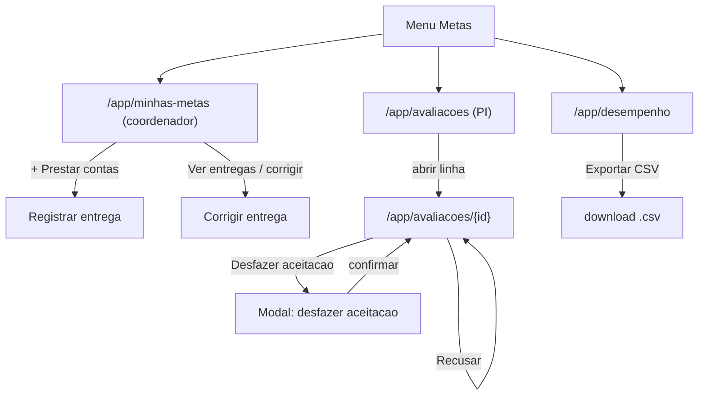
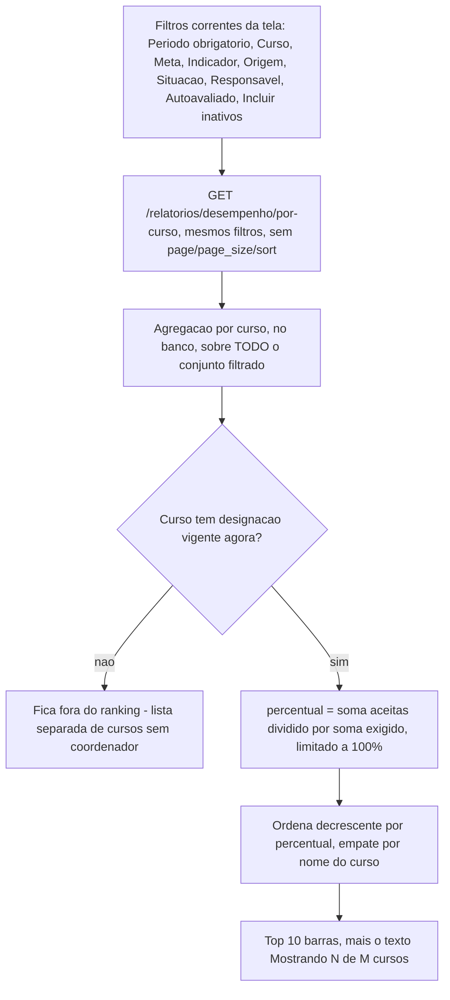

# UX: metas-coordenacao

> Este documento **não repete** o que já está resolvido em `spec.md`: os
> cenários Given/When/Then, os wireframes ASCII (seção 16) e os quatro
> diagramas Mermaid (seção 17 — ciclo de vida da entrega, "posso registrar
> ou corrigir?", recusa e notificação com a escrita dupla, e apuração do
> relatório) são a referência oficial — releia-os junto com este arquivo.
> Aqui ficam as decisões que a spec deliberadamente deixa em aberto:
> componente exato, estados de tela, foco de teclado, responsividade,
> dirty state, microcópia e — porque é o primeiro upload de arquivo do
> produto — o desenho completo de progresso, cancelamento, erro e queda de
> conexão, que hoje não existe em nenhuma outra tela.
>
> Sistema **não** é DSGOV/portal público — eMAG não se aplica. WCAG 2.2 AA
> se aplica integralmente.
>
> **Nota de implementação (Base UI, não Radix):** mesma ressalva de
> `plano-acao/ux.md` — o `shadcn` deste projeto usa `@base-ui/react`
> por baixo, não Radix/`cmdk`. `Combobox`, `Dialog`, `AlertDialog` etc. são
> as composições de `components/ui/*` já existentes, reutilizadas via
> `ComboboxEntidade`, `ConfirmDialog`, `LoadingButton` — nunca recompostas
> do zero neste documento nem na implementação.

---

## Fluxo de telas

1. **Minhas metas** (`/app/minhas-metas`) — propósito: área de trabalho do
   Coordenador. **Única exceção do produto ao padrão obrigatório de
   filtro+Pesquisar** — abre já preenchida (ver seção própria).
2. **Registrar / Corrigir entrega** (página, dentro do fluxo de Minhas
   metas) — propósito: anexar comprovantes a um item do plano.
3. **Fila de avaliação de entregas** (`/app/avaliacoes`) — propósito: o PI
   pesquisa entregas pendentes e as abre para avaliar.
4. **Avaliar entrega** (`/app/avaliacoes/{id}`, página) — propósito:
   aceitar, recusar (com motivo) ou desfazer uma aceitação anterior.
5. **Modal: Desfazer aceitação** — dentro da tela de avaliar.
6. **Desempenho dos cursos** (`/app/desempenho`) — propósito: o relatório
   de apuração, filtrável e exportável em CSV (PI); leitura restrita aos
   próprios cursos, sem exportação, para o Coordenador. Inclui um
   **ranking visual por curso** ("qual curso está indo melhor?") — ver
   seção própria.

---

## Mapa de navegação



---

## Regra de "ação sem permissão": escondida vs. desabilitada

Aplicação da mesma regra já formalizada em `autenticacao-usuarios/ux.md` e
`plano-acao/ux.md`:

| Situação | Tratamento | Motivo |
|---|---|---|
| Itens de menu "Minhas metas" para quem não coordena nada; "Avaliação de entregas" e "Desempenho dos cursos" para quem não é PI | **Escondidos** | Estruturalmente impossível para o perfil |
| Botões `[Aceitar]`/`[Recusar]`/`[Desfazer aceitação]` na tela de avaliar para o Coordenador que abrir a URL diretamente | **A rota inteira responde 403** — a tela mostra o mesmo `ErrorState` de acesso negado, não os botões desabilitados | Não é uma condição pontual do dado, é ausência total de permissão |
| `[+ Prestar contas]` num item já com 100% de cumprimento | **Não desabilitado, não escondido** — continua clicável (spec `EN-09`: entregar acima do exigido é permitido) | Não é uma restrição, é uma regra de negócio diferente da intuição — esconder aqui confundiria mais do que ajudaria |
| Botão "Excluir" numa entrega enviada por outra pessoa | **Escondido** (não desabilitado) para o Coordenador que vê a lista de entregas do item | O 403 `EXCLUSAO_DE_ENTREGA_ALHEIA` é estrutural (nunca é permitido a ele, independente de qualquer condição do dado) — mesma lógica de "excluir a si mesmo" em `autenticacao-usuarios` |
| Botão "Corrigir" numa entrega recusada com prazo expirado ou rodadas esgotadas | **Desabilitado**, com `aria-describedby` explicando o motivo exato ("O prazo de correção terminou em DD/MM/AAAA." ou "Esta entrega já teve três recusas e não pode mais ser corrigida.") | Restrição pontual e temporal — o coordenador está autorizado a corrigir entregas em geral, só não esta agora |
| Botão "Exportar CSV" no relatório, para o Coordenador | **Escondido** (a spec confirma 403 explícito, `RD-12`) | Estrutural: a exportação nunca é dele |
| Filtro "Responsável" no relatório, para o Coordenador | **Escondido**, não só desabilitado — ele só vê os cursos dele, filtrar por responsável não faz sentido no recorte dele | Mesma lógica |

---

## Componentes shadcn/ui (Base UI) — mapeamento e organização de pastas

### `shared/ui/` (reutilizado, quase nada novo)

| Componente | Onde é usado |
|---|---|
| `LoadingButton`, `SkeletonTable`, `EmptyState`, `ErrorState`, `StatusBadge`, `ConfirmDialog`, `cabecalho-ordenavel.tsx`, `paginacao.tsx`, `TopProgressBar`, `Toaster` | Fila de avaliação, Relatório de desempenho — mesmo catálogo já usado nas outras duas features |
| **`ProgressoDeEnvio` (novo)** | Barra de progresso com rótulo textual equivalente (`aria-valuenow`/`aria-valuetext`), usada dentro do novo `AreaDeAnexos` — ver seção própria. Nasce em `shared/ui/` porque qualquer upload futuro do produto (não só entrega de meta) vai precisar do mesmo indicador |

### `shared/forms/` (um componente novo — o primeiro upload do produto)

| Componente | Onde é usado | Por que nasce em `shared/`, não em `features/entrega/` |
|---|---|---|
| **`AreaDeAnexos` (novo)** | Registrar/Corrigir entrega | É o único componente desta rodada com chance real de reuso: qualquer feature futura que precise anexar arquivo (parecer, laudo, outro tipo de comprovante) usa o mesmo componente, só trocando `tiposAceitos`/`limiteBytesPorArquivo`/`limiteArquivos`/`limiteBytesTotal` via props. Nasce em `shared/forms/` já na primeira ocorrência — mesma decisão já tomada para `Combobox` em `autenticacao-usuarios` |
| `ComboboxEntidade` | **Não usado nesta feature** — não há campo de autocomplete aqui (item do plano, curso e meta chegam prontos do contexto de navegação, nunca digitados) |

### `features/entrega/` (novo, específico da entidade)

| Componente | Uso |
|---|---|
| `minhas-metas-lista.tsx` | Agrupamento por curso, cartões de item com barra de progresso do cumprimento |
| `entrega-form.tsx` | `Form`, `Textarea` (observação), `AreaDeAnexos`, `LoadingButton` — usado tanto em "registrar" quanto em "corrigir" (mesmo componente, `mode="criar" | "corrigir"`) |
| `aviso-desfazimento.tsx` | O card destacado "A aceitação foi desfeita..." dentro de Minhas metas e no topo do formulário de correção |
| `badge-pendencias.tsx` | O número no item de menu, alimentado por `GET /metas/pendencias` |

### `features/avaliacao/` (novo, específico da entidade)

| Componente | Uso |
|---|---|
| `avaliacoes-filtro.tsx`, `avaliacoes-table.tsx` | Fila de avaliação |
| `avaliar-entrega-painel.tsx` | Cabeçalho da entrega + lista de anexos com download + aviso de coincidência de papéis |
| `avaliar-acoes.tsx` | Botões Aceitar/Recusar (com `Textarea` de motivo) ou o botão único "Desfazer aceitação" conforme a situação |
| `desfazer-aceitacao-dialog.tsx` | `Dialog` `max-w-md` |

### `features/relatorio-desempenho/` (novo, específico da entidade)

`relatorio-filtro.tsx`, `relatorio-table.tsx` (colunas com lista de
indicadores e marcas), `relatorio-card-mobile.tsx`, `aviso-cursos-vagos.tsx`
(o aviso agregado do topo), **`grafico-cursos.tsx` (novo — o ranking de
barras "qual curso está indo melhor", ver seção própria)**, hook
`useExportarRelatorio` (dispara o download do CSV) e **`useDesempenhoPorCurso`
(novo — consulta `GET /relatorios/desempenho/por-curso`, independente da
paginação da tabela)**.

### Hooks (`features/*/hooks/`)

`useMinhasMetas`, `useRegistrarEntrega`, `useCorrigirEntrega`,
`useExcluirEntrega`, `useEntregasDoItem`, `usePendencias` (badge);
`useFilaDeAvaliacao`, `useEntrega`, `useAvaliarEntrega`,
`useDesfazerAceitacao`, `useMarcarPendenciaVista`; `useRelatorioDesempenho`,
`useExportarRelatorio`, **`useDesempenhoPorCurso`**. Todos expõem
`{ data, isLoading, error }` ou equivalente.

---

## Tela: Minhas metas (`/app/minhas-metas`) — a única exceção ao padrão de CRUD

**A exceção, exatamente como a spec autoriza (3.11), e por quê ela não
vira precedente:** esta tela **não tem botão "Pesquisar"**. Ela dispara a
consulta assim que monta, com o período pré-selecionado (o mais recente
aberto, ou o último escolhido — ver nota). É a única tela do produto
inteiro com esse comportamento, e a justificativa é estritamente a da
spec — "é a lista de obrigações da própria pessoa; exigir um clique para
ver o próprio trabalho é fricção sem contrapartida."

**Por que registrar isto aqui com tanta ênfase:** o padrão universal do
CLAUDE.md ("nenhuma busca automática em grid") é uma regra forte do
produto, presente em toda outra listagem deste sistema (Planos, Períodos,
Fila de avaliação, Desempenho dos cursos — todas exigem filtro+Pesquisar).
Um desenvolvedor lendo o código desta tela sem o contexto certo pode
concluir, erradamente, que "descobriu" uma exceção reutilizável. **Não é.**
Qualquer tela nova que queira o mesmo comportamento **não herda esta
decisão por analogia** — volta para o `analista-requisitos` justificar de
novo, caso a caso. O `code-reviewer` trata qualquer outra listagem que
consulte na montagem como achado, mesmo que aponte para este documento
como "precedente" — não é.

- **Ação primária:** Prestar contas (por item)
- **Ação secundária:** trocar o Período no seletor (a única entrada de
  filtro desta tela — não há botão "Pesquisar" porque a troca do seletor
  já dispara a consulta)
- **Loading:** esqueleto com a mesma estrutura de cartões, agrupado por
  curso (nunca spinner isolado)
- **Error:** `ErrorState` "Não foi possível carregar suas metas agora." +
  "Tentar novamente"
- **Empty:** dois vazios distintos — "sem curso nenhum" (nunca respondeu
  por um curso) vs. "sem plano vigente" (tem curso, mas nenhum plano
  vigente no período escolhido) — textos exatos no wireframe 16.1
- **Data:** agrupado por curso, com progresso por item (wireframe 16.1)

### Seletor de período

`ComboboxEntidade` de períodos, mostrando "{nome} (até {data de fim})".
**Persistência:** o período escolhido é salvo em `localStorage`
(`grid-state:minhas-metas:periodo`) e restaurado na próxima visita — a
única peça de estado que esta tela persiste, porque é a única entrada que
ela tem. Padrão inicial (sem valor salvo): o período **aberto** mais
recente; se não houver período aberto, o mais recente de todos.

### Cada card de item

Nome da meta, lista de indicadores com origem, barra de progresso
(`aceitas de exigido`, com pendente/em correção mostrados como segmento
separado, não somado às aceitas), botões `[Ver entregas]` e
`[+ Prestar contas]`. Quando há uma entrega com aceitação desfeita
recentemente (`AV-12`), o card sobe para o topo do grupo do curso e ganha
destaque visual (borda âmbar) com o texto exato da spec.

### Acessibilidade

- Cabeçalho de cada grupo de curso é `<h2>` real (não `<div>` com peso de
  fonte) — leitor de tela precisa navegar por seção.
- Barra de progresso: `role="progressbar"` com `aria-valuenow`/
  `aria-valuemin`/`aria-valuemax` **e** o texto equivalente ao lado ("2 de
  4 aceitas · 1 pendente · 1 em correção") — nunca só a barra visual.
- O aviso de desfazimento tem `role="status"` (é informação urgente para o
  fluxo de trabalho, mas não é um erro do sistema).

### Responsividade

360px: cards empilham, largura total, botões de ação em coluna cheia.
768/1440px: conforme wireframe 16.1, cards em largura útil, lado a lado
quando couber mais de um por linha em telas muito largas (`xl`) — decisão
de aproveitamento de espaço, não obrigatória, mas natural dado que o
container é `w-full`.

### Microcópia

Ver tabela completa no wireframe 16.1 da spec — reproduzida sem alteração:
"Você ainda não responde por nenhum curso...", "Nenhum plano de ação
vigente para os seus cursos neste período.", "Não foi possível carregar
suas metas agora."

---

## Tela: Registrar / Corrigir entrega (página)

**Por que página:** tem lista interna (os anexos, até 10 arquivos) e
envio de arquivo — cai direto na regra "lista interna ou upload → página
nova", reforçada pelo próprio wireframe 16.2 da spec.

- **Ação primária:** Registrar (novo) / Reenviar (correção)
- **Loading:** `form.disable()` completo durante o envio; `LoadingButton`
  "Enviando..."/"Reenviando..."
- **Error:** ver tabela detalhada na seção de anexos abaixo
- **Data:** conforme wireframe 16.2

### Cabeçalho fixo

Curso · Meta · lista de indicadores da meta · "{N} exigidas neste curso" ·
período com data-limite. Se a entrega é uma correção de recusa, o aviso
com motivo/prazo/rodada aparece logo abaixo (texto exato da spec,
`AV-03`/`AV-12`), com `role="status"`.

### Campo Observação

`Textarea`, texto simples, opcional — **sem editor rico**, conforme
`project.config.md` ("editor de texto rico não se aplica ao escopo
atual") e `spec.md` PM-9. Nenhum candidato a formatação aqui: é uma nota
de contexto curta ("Reunião ordinária do NDE de 12/03/2026."), não um
corpo de documento.

### Botão de submissão e `Idempotency-Key`

**Regra de implementação obrigatória, porque afeta diretamente o
comportamento visível ao usuário em queda de conexão (ver abaixo):** ao
montar a tela de registro de uma **nova** entrega, o formulário gera uma
`Idempotency-Key` (UUID v4, gerado no cliente) e a mantém em estado local
durante toda a tentativa de envio — inclusive em reenvios automáticos ou
manuais do **mesmo** envio. Uma chave nova só é gerada quando o usuário
navega para começar um envio genuinamente novo (troca de item, ou volta à
tela depois de um envio concluído). Na correção (`PUT`), não há
`Idempotency-Key` — o contrato usa `versao` para concorrência, que já
resolve o reenvio duplo de forma equivalente.

---

## A área de anexos — primeiro upload do produto (`AreaDeAnexos`, novo em `shared/forms/`)

Não existe hoje nenhum componente de upload no projeto. Este é o desenho
completo — progresso, cancelamento, erro por tipo/tamanho, e queda de
conexão — porque nada disso pode ser inferido de um componente existente.

### Duas mecânicas diferentes, conforme o momento

| Momento | Requisição | Progresso possível |
|---|---|---|
| **Registrar entrega nova** | Um único `POST` multipart com observação + todos os arquivos selecionados, `Idempotency-Key` obrigatório (contrato da spec, seção 10) | **Agregado** — XHR/fetch com `onUploadProgress` reporta bytes totais enviados do corpo inteiro, não por arquivo individual (limitação real de uma requisição multipart única) |
| **Corrigir entrega** (adicionar/remover anexo antes de reenviar) | `POST /entregas/{id}/anexos` **por arquivo**, `DELETE /anexos/{id}` por remoção; o "Reenviar" final é um `PUT /entregas/{id}` só com `versao`, sem corpo de arquivo | **Por arquivo** — cada `POST` é uma requisição própria, progresso individual real |

Essa diferença é deliberada, não uma inconsistência: refletir o contrato
de API já definido pela spec é melhor do que fingir uma granularidade que
o backend não oferece.

### Fluxo de seleção e pré-validação (antes de qualquer byte na rede)

1. Botão **"+ Adicionar arquivos"** (`<input type="file" multiple
   accept=".pdf,.jpg,.jpeg,.png,.docx,.odt">` disparado por um `Button`
   com `aria-label` "Selecionar arquivos do computador") — **sempre
   presente e funcional por teclado**, porque é a alternativa obrigatória
   ao arrastar-e-soltar (WCAG 2.5.7). Arrastar-e-soltar é oferecido como
   reforço opcional sobre a mesma área, nunca como único caminho.
2. Para cada arquivo selecionado, uma verificação **client-side rápida e
   não autoritativa** roda antes de qualquer envio: extensão dentro da
   lista aceita, tamanho ≤ 10 MB, contagem total ≤ 10, soma ≤ 50 MB.
   Arquivo reprovado nunca entra na fila — aparece por um instante com um
   ícone de erro e a mensagem específica (tabela abaixo), sem animação
   (mensagem de erro de validação é imediata, conforme o padrão universal
   de motion).
3. **Isto não substitui a verificação do servidor.** O texto explícito
   abaixo da área de anexos deixa isso claro para quem lê o código depois:
   a extensão só filtra ruído óbvio (rápido, sem gastar banda); a
   autoridade real é o conteúdo do arquivo, verificado no servidor antes
   de gravar qualquer byte (`spec.md` 3.6, `AN-02`) — um arquivo renomeado
   passa na checagem client-side e só é pego no servidor, e a tela precisa
   comunicar esse erro exatamente como comunicaria qualquer outro (ver
   tabela de erros).

### Estado de cada arquivo na lista (durante o envio, no fluxo de correção)

| Estado | Visual | Ação disponível |
|---|---|---|
| Na fila (ainda não enviado) | ícone do tipo + nome + tamanho | `[✗]` remove da fila local, sem chamada de rede |
| Enviando | `ProgressoDeEnvio` (barra + "42%") substituindo o tamanho | `[Cancelar]` — aborta a requisição em curso (`AbortController`) |
| Enviado | ícone de sucesso + nome + tamanho | `[✗]` remove (chama `DELETE /anexos/{id}`, com `LoadingButton` local nesse ícone) |
| Falha | ícone de erro + nome + mensagem específica | `[Tentar novamente]` (reenvia só este arquivo) + `[✗]` remove da fila |

No fluxo de **registro de entrega nova**, como o envio é uma única
requisição, os arquivos não têm estado individual durante o envio — a
lista inteira mostra "Na fila" até o clique em "Registrar", e então todos
passam para um estado agregado único "Enviando..." (barra de progresso
agregada, sem linha por arquivo) até a resposta chegar. Em caso de
sucesso, todos os arquivos ficam "Enviados"; em caso de erro (a
requisição inteira falha ou é rejeitada), a lista inteira volta a "Na
fila", editável — nada se perde, porque os arquivos continuam selecionados
localmente no `input`, só não foram enviados ainda.

### Progresso — `ProgressoDeEnvio` (shared/ui, novo)

Composição do `Progress` já existente em `components/ui/progress.tsx`
(Base UI) mais um rótulo textual ao lado — **nunca só a barra**:

```tsx
<div role="group" aria-label="Progresso do envio">
  <Progress value={percentual} aria-valuetext={`${percentual}% enviado`} />
  <span aria-hidden="true">{percentual}% enviado</span>
</div>
```

`aria-live="polite"` no contêiner do progresso agregado (registro nova),
para não interromper quem usa leitor de tela a cada tick — o valor real
importa no fim, não a cada porcentagem.

### Cancelamento

- **Fluxo de correção (por arquivo):** `[Cancelar]` visível só durante
  "Enviando"; aciona `AbortController.abort()`, a linha volta a "Na
  fila", nenhuma chamada de rede pendente continua.
- **Fluxo de registro (agregado):** `[Cancelar envio]` ao lado do
  `LoadingButton` "Enviando...", mesma mecânica de `AbortController` sobre
  a requisição inteira; o formulário volta a editável, arquivos
  permanecem selecionados (nada precisa ser escolhido de novo), e a mesma
  `Idempotency-Key` é reaproveitada se o usuário tentar de novo — só
  troca se ele remover/adicionar arquivo ou sair da tela.

### Erros nomeados (tabela completa, texto exato para a tela)

| Situação | Onde aparece | Mensagem |
|---|---|---|
| Extensão fora da lista aceita (client-side) | Junto ao arquivo, antes de enviar | "«{nome}»: tipo de arquivo não permitido. Aceitos: PDF, JPG, PNG, DOCX, ODT." |
| Arquivo acima de 10 MB (client-side) | Junto ao arquivo | "«{nome}»: {tamanho} excede o limite de 10 MB por arquivo." |
| 11º arquivo ou soma acima de 50 MB (client-side) | Acima da lista, `role="alert"` | "Limite de 10 arquivos ou 50 MB por entrega atingido. Remova algum arquivo para adicionar outro." |
| `ANEXO_TIPO_NAO_PERMITIDO` (servidor, arquivo renomeado passou no client) | Fluxo de correção: junto à linha do arquivo que falhou · Fluxo de registro: `Alert` no topo do formulário (a requisição inteira falhou) | "«{nome}» não pôde ser aceito: o conteúdo do arquivo não corresponde a um tipo permitido." |
| `ANEXO_ACIMA_DO_LIMITE` / `ANEXOS_ACIMA_DO_LIMITE` (servidor, defensivo) | Mesmo padrão acima | "Este arquivo ou o conjunto de anexos excede os limites permitidos." |
| `ENTREGA_SEM_ANEXO` | `Alert` no topo do formulário, ao tentar enviar sem nenhum arquivo | "Anexe pelo menos um comprovante." |
| Falha de rede durante o envio (fetch/XHR error, sem resposta) | `Alert` no topo do formulário (registro) · linha do arquivo (correção) | "Não foi possível enviar agora. Verifique sua conexão." + botão "Tentar novamente" |
| `PRAZO_DE_CORRECAO_EXPIRADO` | `Alert` no topo, campos desabilitados | "O prazo de correção terminou em {data}. Esta entrega não pode mais ser alterada." |
| `LIMITE_DE_RODADAS_ATINGIDO` | `Alert` no topo, campos desabilitados | "Esta entrega já teve três recusas e não pode mais ser corrigida." |
| `PLANO_NAO_VIGENTE` / `PERIODO_ENCERRADO` / `PERIODO_NAO_INICIADO` | `Alert` no topo, antes mesmo de mostrar o formulário (a tela nem chega a renderizar campos editáveis) | "Não é possível registrar entrega para este item agora." (mensagem única — o motivo exato não muda a ação do usuário: ele não pode entregar de qualquer forma) |
| `CURSO_SEM_COORDENADOR` (defensivo — não deveria alcançar quem não tem a carteira) | `Alert` no topo | "Este curso está sem coordenador designado. Registre-se como coordenador antes de prestar contas." |

### O que acontece se a conexão cair no meio (o caso que a spec não descreve, e que este documento fixa)

Este é exatamente o cenário para o qual a `Idempotency-Key` existe — sem
ela, a resposta abaixo seria "reenviar" e o risco seria duplicar a
entrega se o servidor já tivesse processado o primeiro envio.

**Fluxo de registro (nova entrega), conexão cai depois de o navegador
começar a enviar mas antes de a resposta voltar:**

1. `fetch`/XHR emite `error` (sem `response`) — indistinguível, do lado do
   cliente, entre "nunca chegou ao servidor" e "chegou, foi processado,
   mas a resposta se perdeu".
2. O formulário sai do estado "Enviando..." e volta a editável.
   `LoadingButton` volta ao texto normal ("Registrar"). Nenhum dado é
   perdido — os arquivos selecionados continuam na lista.
3. `Alert` no topo: **"Não foi possível enviar. Verifique sua conexão e
   tente novamente."** + o mesmo botão "Registrar" (não um botão separado
   de "retry" — é a mesma ação).
4. **Ao clicar de novo, a requisição reusa a mesma `Idempotency-Key`.**
   Duas possibilidades no servidor, ambas seguras para o usuário:
   - O envio anterior nunca chegou → processa normalmente, `201`.
   - O envio anterior chegou e foi processado, só a resposta se perdeu →
     o servidor reconhece a chave e devolve `200` com a entrega já
     criada (mesmo comportamento do reenvio manual/duplo clique,
     `EN-06`) — a tela trata `200` e `201` da mesma forma no fluxo de
     sucesso (mesmo toast, mesmo redirecionamento), sem distinguir
     visualmente qual dos dois veio.

**Fluxo de correção, conexão cai durante o `POST` de um anexo individual:**
a linha daquele arquivo específico vai para o estado "Falha" com
"Tentar novamente" — os demais arquivos, já enviados com sucesso antes da
queda, permanecem "Enviados" e não são reenviados. Não há idempotência
por arquivo individual aqui (a spec não define uma `Idempotency-Key` por
anexo); o risco residual — um duplo POST do mesmo arquivo virar dois
anexos — é aceito como baixo (o usuário vê os dois na lista e pode remover
um manualmente) e registrado como nota ao `arquiteto` ao final deste
documento, para decidir se vale a pena estender o mesmo padrão de chave
de idempotência ao endpoint de anexo individual.

### Acessibilidade da área de anexos

- Área de soltar arquivo (`drag-and-drop`): não é o único meio de
  interação (WCAG 2.5.7) — o botão "+ Adicionar arquivos" sempre funciona
  por teclado e é o primeiro elemento focável da seção.
- Lista de anexos: `<ul>`/`<li>` semântico, cada item com o nome do
  arquivo como texto real (nunca só ícone).
- Barra de progresso: `role="progressbar"` + texto equivalente, como
  descrito acima.
- Erros de tipo/tamanho: `role="alert"` no momento em que aparecem —
  interrompe o leitor de tela porque impede a ação que a pessoa acabou de
  tentar.
- Botão de remover anexo: `aria-label` "Remover {nome do arquivo}".
- `aria-busy="true"` no `<form>` inteiro durante o envio agregado
  (registro) e no item da lista durante o envio individual (correção).

---

## Tela: Fila de avaliação (`/app/avaliacoes`)

Padrão obrigatório de CRUD — filtro visível, **grid só após
"Pesquisar"** (nenhuma exceção aqui; só "Minhas metas" tem a exceção).

- **Ação primária:** abrir uma linha para avaliar
- **Loading:** `SkeletonTable`; "Pesquisar" vira `LoadingButton`
  "Pesquisando..."
- **Error:** `ErrorState` "Não foi possível carregar a fila agora."
- **Empty:** "Nenhuma entrega aguardando avaliação." (com ícone ✓ — vazio
  positivo, não um erro)
- **Data:** grid conforme wireframe 16.3

### Grid

- **Filtros:** Período (`ComboboxEntidade`) · Curso (`Select`, só os da
  instituição) · Meta (`ComboboxEntidade`) · Situação (`Select`: padrão
  **Pendentes**, com opção de ver Aceitas/Recusadas para consulta)
- **Colunas:** Curso · Meta · Enviada (data) · Enviou · Ações
- **Ordenáveis:** `criado_em` (rótulo "Enviada"), Curso, Meta — conforme
  spec seção 10. **Padrão: Enviada, crescente** — quem espera há mais
  tempo aparece primeiro, exatamente como a spec justifica
- **Página:** 20

### A marca `ⓘ` de coincidência de papéis — antes de abrir, não depois

Quando `coordenado_pelo_avaliador = true` na linha (campo já previsto no
contrato, spec seção 10), o nome do curso ganha um ícone `ⓘ` com
`aria-describedby` apontando para uma nota de rodapé do grid: "Você
coordena este curso. Avaliar é permitido, e a avaliação ficará marcada no
relatório." — **o PI sabe antes de clicar**, não só depois de abrir a
entrega (onde o mesmo aviso reaparece, reforçado, na tela de avaliação).
Isso é intencional: dar a mesma informação duas vezes, num nível crescente
de detalhe, em vez de escondê-la até o ponto de decisão.

### Acessibilidade

- `aria-live="polite"`: "3 entregas encontradas."
- Ícone `ⓘ` tem `tabIndex={0}` quando a única forma de alcançar o texto é
  hover — mesma solução já usada no badge de instituição truncado em
  `autenticacao-usuarios`.

### Responsividade

360px: vira cartões — Curso (com `ⓘ` se aplicável) · Meta · "Enviada em
DD/MM por {nome}" · botão "Avaliar" em largura total.

### Microcópia

| Elemento | Texto |
|---|---|
| Título | "Avaliação de entregas" |
| Antes da 1ª pesquisa | "Use os filtros acima e clique em Pesquisar para ver as entregas." |
| Vazio | "Nenhuma entrega aguardando avaliação." |
| Erro | "Não foi possível carregar a fila agora." |

---

## Tela: Avaliar entrega (`/app/avaliacoes/{id}`, página)

**Por que página:** mostra a lista de anexos com download — mesma regra
de "lista interna" das outras telas desta feature.

- **Ação primária:** Aceitar **ou** Recusar (situação pendente) — 
  Desfazer aceitação (situação aceita)
- **Loading:** skeleton de página (cabeçalho + lista de anexos)
- **Error:** `ErrorState` de página inteira / 404 se de outro curso ou
  outra instituição
- **Data:** conforme wireframe 16.4

### Aviso de coincidência — informativo, nunca bloqueante

`Alert` variante informativa, `role="status"` (não `"alert"` — não é uma
falha, é contexto), presente **somente** quando
`coordenado_pelo_avaliador = true` nesta entrega: **"Você coordena este
curso. Sua avaliação será registrada e aparecerá marcada no relatório de
desempenho como «avaliação pelo próprio coordenador». Isso não impede a
avaliação."** Os botões Aceitar/Recusar permanecem habilitados o tempo
todo — é exatamente a diferença entre revelar e repreender que a spec
pede (16.4).

### Lista de anexos

Tabela/lista: nome do arquivo, tipo, tamanho, botão `[⤓ Baixar]` por
linha — cada download é uma requisição autenticada própria (nunca URL de
bucket exposta, `AN-04`), com `LoadingButton` local no ícone durante o
download (arquivos podem ser grandes, até a soma de 50 MB).

### Recusar

`Textarea` de motivo, **obrigatório** — validação client-side imediata
("Informe o motivo da recusa.") antes mesmo de chamar a API, mais o 400
`MOTIVO_OBRIGATORIO` como rede de segurança. Nota fixa abaixo do campo,
sempre visível antes de confirmar: "Ao recusar, o coordenador designado é
avisado por e-mail e dentro do sistema, e tem 7 dias para corrigir — mesmo
com o período encerrado. Esta seria a recusa {N} de 3." — o número muda
conforme a rodada atual da entrega (vem do `rodadas_de_recusa` já
carregado).

### Aceitar

Sem campo extra, `LoadingButton` direto "Aceitar" → "Aceitando..." — ação
de um clique, sem confirmação adicional (a spec não pede, e a ação é
facilmente reversível via "Desfazer aceitação").

### Entrega já aceita — troca de botões

Quando a situação é `aceita`, os botões Aceitar/Recusar somem e dão lugar
a um único `[Desfazer aceitação]`, que abre o modal descrito a seguir —
exatamente como o wireframe 16.4 define.

### Modal: Desfazer aceitação

`Dialog` `max-w-md`. Primeira linha, sempre visível, **quem aceitou e
quando** ("Aceita por {nome} em {data}.") — importante porque quem desfaz
pode ser um PI diferente (`AV-11`). `Textarea` de motivo obrigatório.
Bloco de consequências, sempre mostrado **antes** de confirmar (nunca
depois): "O cumprimento de {curso} cai de {X} de {N} para {X-1} de {N},
imediatamente.", "A entrega volta para correção, com prazo até {data}, e
consome a rodada {N} de 3.", "O coordenador será avisado por e-mail e
dentro do sistema." — os três textos vêm calculados do lado do cliente a
partir dos dados já carregados da entrega e do item (sem chamada extra).
Foco inicial em "Cancelar" (ação destrutiva, mesmo padrão de
`autenticacao-usuarios`).

**Bloqueio com rodadas esgotadas:** se a entrega já teve três recusas
antes desta aceitação (situação possível: recusada 2x, corrigida, aceita
— ainda está na rodada 3 disponível para desfazer, mas uma quarta recusa
não teria prazo), o botão "Desfazer aceitação" na tela anterior já aparece
**desabilitado** com `aria-describedby` "Esta entrega já teve o limite de
recusas e não pode ser desfeita." — evita abrir o modal para descobrir o
409 só no fim.

### Acessibilidade

- `Alert` de coincidência: `role="status"`.
- Modal de desfazimento: `role="alertdialog"` (ação destrutiva/consequente).
- Botões de download: `aria-label` "Baixar {nome do arquivo}".

---

## Tela: Desempenho dos cursos (`/app/desempenho`)

Padrão obrigatório de CRUD — filtro visível, grid só após "Pesquisar".

- **Ação primária:** Pesquisar
- **Ação secundária:** Exportar CSV (só PI — escondida para Coordenador)
- **Loading:** `SkeletonTable`
- **Error:** `ErrorState`
- **Empty:** "Nenhuma linha para os filtros escolhidos." · estado
  específico "Escolha um período para pesquisar." quando o período (único
  filtro obrigatório) está vazio
- **Data:** grid conforme wireframe 16.5, com o gráfico de ranking por
  curso entre o aviso agregado e a tabela — ver seção própria abaixo

### Grid

- **Filtros:** Período\* (`ComboboxEntidade`, obrigatório) · Curso
  (`Select`) · Meta (`ComboboxEntidade`) · Indicador (`Select`) · Origem
  (`Select`: Do INEP / Próprio / Todas) · Situação (`Select`) ·
  Responsável (`Select`, **só PI**) · "Só avaliação pelo próprio
  coordenador" (`Checkbox`, **só PI** — para o Coordenador não faz
  sentido, já que ele só vê os cursos dele) · "Incluir cursos inativos"
  (`Checkbox`)
- **Colunas:** Curso · Responsável · Meta · Indicadores · Exigido ·
  Aceitas · Pendentes · Em correção · Situação
- **Ordenáveis:** Curso, Responsável, Meta, Exigido, Aceitas, Cumprimento
  (conforme spec seção 10). **Indicadores nunca é ordenável** (é lista,
  não valor escalar) — cabeçalho sem `<button>`, só texto
- **Padrão:** Curso crescente, depois Meta crescente · **Página:** 20

### Como se lê uma linha — leitura pretendida, não só o dado bruto

A coluna **Responsável** carrega três formas de leitura possíveis, todas
em texto:

| Valor | O que comunica |
|---|---|
| "{Nome} — desde DD/MM" | Assumiu no meio do período — a exigência **não** foi reduzida proporcionalmente (a tela nunca sugere isso) |
| "{Nome}" (sem "desde") | Responde pelo curso desde antes do início do período |
| "Vago desde DD/MM" | Curso ficou sem coordenador durante parte do período |
| "Vago o período inteiro" | Nunca teve responsável neste período — distinto do anterior porque é uma leitura de gestão diferente |

A coluna **Situação** usa as cinco palavras exatas da spec — Cumprida,
Sem responsável, Em andamento, Em correção, Não cumprida — sempre como
texto, nunca cor isolada. **"Sem responsável" é visualmente distinta de
"Não cumprida"** (cores diferentes no `StatusBadge`, mas a diferença real
está no texto, não na cor): é a distinção central de `X12` — separar "não
cumpriu" de "não havia quem cumprisse" —, e a tela reforça isso em três
camadas simultâneas, como a spec pede:

1. **Aviso agregado no topo** (quando há pelo menos um curso vago no
   conjunto filtrado): `role="status"`, texto "{N} cursos sem coordenador
   acumulam {M} metas não cumpridas neste período."
2. **Marca na linha** ("Vago desde..."/"Vago o período inteiro" na coluna
   Responsável).
3. **Situação própria da linha** ("Sem responsável", nunca "Não
   cumprida").

### As marcas — em coluna própria, com filtro

"inclui entregas de gestão anterior" e **"avaliação pelo próprio
coordenador"** aparecem como uma segunda linha discreta dentro da célula
da linha (não uma coluna extra de largura fixa, que desperdiçaria espaço
na maioria das linhas sem marca) — texto pequeno, `ⓘ`, sempre legível
mesmo sem cor. O filtro "Só avaliação pelo próprio coordenador" isola
exatamente essas linhas.

### Coluna Indicadores

Lista separada por `·`, com a origem entre parênteses — "1.4 · 1.5 (Do
INEP)" — igual ao padrão já usado no item do plano. Nota de rodapé fixa
do grid: "A mesma meta pode atender mais de um indicador: a exigência não
é multiplicada por eles."

### Exportar CSV

`LoadingButton` "Exportar CSV" → "Exportando..." — síncrono (spec 11
confirma, abaixo do gatilho de 50.000 linhas), então o clique dispara o
download diretamente (sem modal de "processando em segundo plano"): a
resposta chega como `text/csv` com `Content-Disposition`, o navegador
salva o arquivo, e um toast confirma "Relatório exportado." ao concluir. A
exportação **respeita os filtros correntes da tela** (mesmos parâmetros da
consulta ativa), nunca a tabela inteira. **O CSV não inclui o ranking por
curso** — é a mesma exportação por item de plano já definida pela spec
(`RD-12`); o ranking é um recurso só de tela, calculado à parte (ver seção
seguinte).

### Acessibilidade

- Aviso agregado: `role="status"`, aparece **antes** da tabela na ordem de
  leitura (mesmo lugar do wireframe).
- Situação e marcas sempre em texto.
- `aria-live="polite"` no resumo de resultados, fora da tabela.

### Responsividade

360px: cards por linha — Curso/Responsável no topo, Meta e Indicadores
como texto corrido, Exigido/Aceitas/Pendentes/Em correção em uma linha de
números rotulados, Situação sempre em texto no rodapé do card.

---

## Gráfico: comprovantes entregues por curso — "qual curso está indo melhor?" (novo, tela Desempenho dos cursos)

Pedido do dono do produto: responder, num único olhar, "qual curso está
indo melhor no cumprimento das metas?". Duas decisões do dono, **não
reabertas aqui**: métrica = **% de comprovantes entregues**
(`soma dos comprovantes aceitos ÷ soma do exigido`, por curso, com crédito
parcial) e eixo = **uma barra por curso** (não por coordenador).

### Onde entra na tela

Entre o aviso agregado de cursos sem coordenador (`⚠ N cursos sem
coordenador...`) e a tabela detalhada — depois dos filtros, antes do grão
fino (item de plano). É a primeira resposta visual à pergunta do dono; a
tabela abaixo continua servindo para investigar o "porquê" de cada curso,
item a item.

```
│ Início → Metas → Desempenho dos cursos                                 │
│ ────────────────────────────────────────────────────────────────────── │
│ Desempenho dos cursos                              [ ⤓ Exportar CSV ]  │
│ Período *: [▼ 2026.1 ] Curso: [▼ Todos ] Meta: [▼ Todas ]              │
│ Indicador: [▼ Todos ] Origem: [▼ Todas ] Situação: [▼ Todas ]          │
│ Responsável: [▼ Todos ] [ ] Só avaliação pelo próprio coordenador      │
│ [ ] Incluir cursos inativos                        [ 🔍 Pesquisar ]    │
│ ────────────────────────────────────────────────────────────────────── │
│ ⚠ 2 cursos sem coordenador acumulam 5 metas não cumpridas neste período│
│ ────────────────────────────────────────────────────────────────────── │
│ Cumprimento de metas por curso — comprovantes entregues                │
│ Mostrando os 10 melhores de 42 cursos com coordenador neste filtro     │
│                                                                          │
│  1  Biomedicina             ████████████████████████████████  100%    │
│     Beatriz Andrade                                    58 de 58        │
│  2  Engenharia de Software  █████████████████████░░░░░░░░░░░   62%    │
│     Paulo Tavares                                       26 de 42       │
│  3  Sistemas de Informação  █████████████░░░░░░░░░░░░░░░░░░░   38%    │
│     Ana Lima                                             9 de 24       │
│     ...                                                                 │
│                                                                          │
│ ⓘ 2 cursos sem coordenador neste filtro não entram no ranking:         │
│   Pedagogia, Nutrição — consulte-os na tabela abaixo.                  │
│ ────────────────────────────────────────────────────────────────────── │
│ [ tabela detalhada por item de plano — inalterada, wireframe 16.5 ]    │
```

```
Carregando (só o gráfico): esqueleto com 10 linhas — retângulo curto
                            (nome) + retângulo de largura variável (barra),
                            pulso suave, nunca spinner isolado
Erro (só o gráfico):       "Não foi possível carregar o ranking de cursos
                            agora." + "Tentar novamente" — não derruba a
                            tabela, que é uma consulta separada
Vazio (0 cursos com
  coordenador no filtro):  "Nenhum curso com coordenador para ranquear
                            com estes filtros."
```

### Consulta própria — nunca a partir das linhas da tabela

**Restrição explícita, repetida aqui porque é fácil de "otimizar" errado
depois:** a tabela é paginada (20 de N linhas, grão = item de plano). Um
ranking calculado em cima dela mostraria só "o melhor curso da página 1"
com aparência de verdade absoluta — o mesmo erro que `X1` da spec proíbe
para o resto do relatório, agora no gráfico.



A tela pede um agregado **novo**, calculado no banco sobre o conjunto
filtrado inteiro — mesmo espírito do `resumo` que já existe hoje para
`cursos_sem_coordenador`/`metas_nao_cumpridas_de_vagos`:

```
GET /api/v1/relatorios/desempenho/por-curso?<os mesmos filtros da tela, sem page/page_size/sort/order>

200 {
  "data": [
    { "curso_id", "curso_nome", "responsavel_nome", "exigido_total",
      "aceitas_total", "percentual", "curso_vago" }
  ],
  "meta": { "total_cursos_com_coordenador", "total_cursos_sem_coordenador" }
}
400 PERIODO_OBRIGATORIO · 401 · 403
```

- Mesmos filtros que já existem na tela — o gráfico lê o mesmo estado de
  filtro que já dispara a pesquisa da tabela; **um único clique em
  "Pesquisar" atualiza os dois**.
- `curso_vago` é o mesmo `coordenador_id IS NULL` já usado no `resumo`
  hoje — não é um cálculo novo, é o mesmo dado, agregado por curso em vez
  de contado.
- **Nunca** computar isso no frontend a partir de `data` da resposta de
  `/relatorios/desempenho` (paginada, grão de item). Se um desenvolvedor
  futuro achar "mais simples" reaproveitar a página já carregada da
  tabela, está errado pelo mesmo motivo do resto do relatório.

### Quantos cursos mostrar — fixo em 10, sem "carregar mais"

Fixo, não configurável (sem tamanho de página próprio para o gráfico).
Justificativa: isto é um resumo visual para responder uma pergunta
específica ("quem está indo melhor"), não uma segunda listagem paginada do
mesmo dado — a listagem completa, com todos os cursos, já existe: é a
tabela abaixo. O volume esperado é de centenas de cursos (`spec.md`,
PM-10); um gráfico com centenas de barras não responde à pergunta, é
ruído visual.

O excedente **não é truncado em silêncio** — o texto acima do gráfico
sempre mostra o total real: "Mostrando os 10 melhores de 42 cursos com
coordenador neste filtro." Para ver um curso específico fora do top 10, o
usuário usa o filtro "Curso" já existente (que também refaz o gráfico,
agora com 1 barra) ou consulta a tabela detalhada abaixo.

### Ordenação — fixa, decrescente por percentual

Fixa: sem cabeçalho clicável, sem toggle "melhores/piores". A pergunta do
dono é "quem está indo melhor" — singular. Inverter para "quem está indo
pior" é uma pergunta diferente, com uma resposta que merece o mesmo
cuidado de desenho (ex.: um curso com poucas semanas de plano vigente tem
0% "naturalmente" e apareceria artificialmente como o pior, sem que isso
signifique baixo desempenho) — não é a mesma coisa com o sinal trocado.
Fica registrado como extensão futura possível, sob demanda explícita do
dono — não implementada por antecipação.

Critério de desempate: nome do curso, collation pt-BR — mesmo critério já
usado no resto do relatório.

### Distinguir "sem coordenador", "nenhuma meta exigida (neste filtro)" e "0% entregue" — três coisas, nunca a mesma barra

Mesma distinção de `X12` (o relatório não pode dizer "não cumpriu" onde a
verdade é "não havia quem cumprisse"), estendida ao gráfico:

| Caso | Onde aparece | Por quê não vira uma barra igual às outras |
|---|---|---|
| **Curso sem coordenador agora** (`curso_vago = true`) | **Fora do ranking**, numa lista de texto simples abaixo das barras: "ⓘ N cursos sem coordenador neste filtro não entram no ranking: {nome}, {nome}. Consulte-os na tabela abaixo." | Um percentual baixo aqui não é desempenho — é ausência de quem responda pelo curso. Misturar essa barra ao ranking sugeriria "o pior colocado", leitura errada — o mesmo raciocínio que já levou a spec a separar "Sem responsável" de "Não cumprida" na tabela |
| **Curso sem nenhum item de plano batendo no filtro atual** (ex.: filtrou por uma Meta que esse curso não tem) | **Não aparece em lugar nenhum** — nem barra, nem lista, nem "0%" | Ausência de dado não é dado. Um curso que não bate no filtro não existe na consulta agregada — forçar uma barra "0%" para ele inventaria um número que ninguém pediu |
| **Curso com coordenador, com meta exigida, que de fato entregou 0%** | **Barra no ranking**, na última posição visível, com "0%" ao lado, igual a qualquer outra barra | É a única situação em que "0%" é, de fato, o desempenho real do curso, e precisa competir no ranking como qualquer outro valor |

### Cada barra

```tsx
<li>
  <span>{posicao}. {curso_nome}</span>
  <span className="text-muted-foreground text-xs">{responsavel_nome}</span>
  <Progress
    value={percentual}
    aria-valuetext={`${curso_nome}: ${percentual}% dos comprovantes exigidos entregues, ${aceitas_total} de ${exigido_total}`}
  />
  <span aria-hidden="false">{percentual}%</span>
  <span className="text-muted-foreground text-xs">{aceitas_total} de {exigido_total}</span>
</li>
```

- Percentual **sempre em texto real ao lado da barra** (nunca só a
  largura) — mesma regra já aplicada em `ProgressoDeEnvio` e no progresso
  de cumprimento em "Minhas metas".
- A contagem bruta ("58 de 94") acompanha o percentual — permite conferir
  a conta a olho, no mesmo espírito de rigor de `X1` ("o número do
  relatório estar errado").
- Percentual **exibido limitado a 100%**, mesmo padrão já usado por item
  na tabela (`Cumprimento = aceitas ÷ exigido, limitado a 100%`) — evita
  barra maior que o contêiner quando um curso entrega acima do exigido em
  algum item.
- Todas as barras usam a **mesma cor** de preenchimento — sem faixas
  vermelho/amarelo/verde por percentual (ver Acessibilidade abaixo).

### Nota para o `arquiteto` — pergunta em aberto sobre a fórmula, não decidida por este documento

A decisão do dono fixa a fórmula agregada ("soma dos comprovantes aceitos
÷ soma do exigido, por curso"), mas não resolve um detalhe de composição:
um item entregue **acima** do exigido (`EN-09`, ex.: 5 de 4) pode, ao
somar cru, mascarar um déficit real em outro item do mesmo curso.
**Recomendação deste documento, a confirmar com o dono antes de
implementar:** capar cada item em `min(aceitas, exigido)` antes de somar
por curso — mesmo raciocínio que já capa o percentual por item a 100% na
tabela hoje. Isso não é uma decisão de UX; fica registrada aqui porque
afeta o número que a barra mostra, e não pode ficar implícita no código
sem ninguém ter decidido conscientemente.

### Estados

| Estado | Comportamento |
|---|---|
| **Antes da 1ª pesquisa** (sem período) | Gráfico não renderiza — mesma regra da tela inteira |
| **Carregando** | Esqueleto com 10 linhas, cada uma com um retângulo de largura variável simulando a barra (pulso, parâmetros padrão de motion) + retângulo curto simulando o nome do curso |
| **Erro** | Escopo só do gráfico (consulta separada da tabela, uma falha não derruba a outra): `ErrorState` compacto dentro da própria seção — "Não foi possível carregar o ranking de cursos agora." + "Tentar novamente", refaz só esta consulta |
| **Vazio — nenhum curso com coordenador no filtro** | "Nenhum curso com coordenador para ranquear com estes filtros." — a lista de "sem coordenador" abaixo, se houver, continua aparecendo normalmente |
| **Vazio — filtro sem nenhum resultado (nem a tabela tem linha)** | Gráfico não renderiza — a tela já mostra o `EmptyState` de página inteira ("Nenhuma linha para os filtros escolhidos."); duplicar a mensagem no gráfico só adicionaria ruído |
| **Dados** | Lista ordenada (`<ol>`) de até 10 barras + texto "Mostrando os N melhores de M cursos com coordenador" + (se houver) a lista de cursos sem coordenador |

### Acessibilidade

- `<section aria-labelledby="grafico-cursos-titulo">` com
  `<h2 id="grafico-cursos-titulo">Cumprimento de metas por curso</h2>`
  real — landmark navegável por quem usa leitor de tela.
- Ranking como `<ol>`/`<li>` semântico — a ordem de leitura de um leitor
  de tela já comunica a posição ("item 1 de 10"), sem precisar de "1º,
  2º..." redundante no texto (o número de posição visível no wireframe é
  reforço visual, não a única fonte da ordem).
- Cada `Progress` mantém `role="progressbar"` nativo do Base UI, com
  `aria-valuenow`/`aria-valuemin`/`aria-valuemax` automáticos e
  `aria-valuetext` com a frase completa (curso, percentual e a fração
  bruta) — quem usa leitor de tela recebe a mesma informação de quem vê a
  barra.
- Percentual visível como texto real, **não** `aria-hidden` (ao contrário
  do rótulo redundante de `ProgressoDeEnvio`, que duplica um
  `aria-valuetext` de processo em andamento) — aqui o número **é** o
  dado principal, não uma cópia de conveniência.
- **Cor nunca como único canal:** nenhuma cor diferente por faixa de
  percentual (ex.: vermelho/amarelo/verde) — todas as barras usam a mesma
  cor de preenchimento (`--primary`); a leitura vem do texto e da posição
  no ranking. Evita também a leitura enganosa de "vermelho = ruim" num
  contexto em que 0% pode significar coisas diferentes (ver tabela de
  distinção acima).
- Lista de "cursos sem coordenador fora do ranking": texto corrido real,
  nomes por extenso — nunca só um número, para quem usa leitor de tela
  saber exatamente quais cursos.
- `aria-live="polite"` no texto-resumo ("Mostrando os N melhores de M
  cursos..."), mesmo padrão já usado no resumo da tabela.

### Motion

**Sem stagger entre as barras ao carregar** (anti-padrão explícito do
`CLAUDE.md` — "listas com delay encadeado sem motivo"): o bloco inteiro
faz cross-fade único de esqueleto para conteúdo (200ms, `ease-state`), e
cada barra preenche com a transição já nativa do componente `Progress`
(`transition-all`, herdada do componente, não uma animação nova).
`prefers-reduced-motion` desliga a transição de preenchimento, mostrando o
valor final direto — mesma regra global do CLAUDE.md.

### Responsividade

- **1440px:** conforme wireframe acima — barras em largura útil, nome do
  curso à esquerda com largura fixa (`w-48`, truncado com `title` para
  nomes longos), barra ocupando o espaço restante.
- **768px:** mesma estrutura; o nome do curso pode quebrar em duas linhas
  em vez de truncar (mais espaço vertical disponível que horizontal nesta
  largura).
- **360px:** empilha — nome do curso e responsável numa linha, barra +
  percentual + fração na linha de baixo, largura total. Sem truncamento
  agressivo do nome (o espaço vertical permite o nome completo).

### Interação com os filtros existentes

Nenhum filtro novo. O gráfico é **passivo**: lê o mesmo `estado.filtros`
que a tabela e é disparado pelo mesmo botão "Pesquisar"
(`handlePesquisar`/`executarPesquisa`) — um único ponto de disparo, duas
consultas resolvidas **em paralelo** (`useRelatorioDesempenho` e o novo
`useDesempenhoPorCurso`), cada uma com seu próprio `isLoading`/`error`,
para que a falha de uma não derrube a outra. Trocar de página ou de
tamanho de página na tabela **não** refaz o gráfico — ele não depende de
paginação. Filtrar por "Situação" (ex.: só "Cumprida") estreita o
conjunto de itens agregados no gráfico do mesmo jeito que estreita a
tabela — comportamento consistente, não uma regra nova.

### Biblioteca de gráfico — decisão: não instalar nenhuma

Aplicando a escada de simplicidade do `CLAUDE.md` (§2): este gráfico é uma
série categórica única (um valor por curso), não uma série temporal nem
multi-série — a lista ordenada de "barras de percentual com rótulo" é,
estruturalmente, uma lista HTML com largura proporcional, que o CSS
resolve nativamente. Motivos concretos para não instalar Recharts/D3/
Chart.js/etc.:

1. **`components/ui/progress.tsx` já existe** e já é usado com o mesmo
   padrão (`ProgressoDeEnvio`) — reaproveitar é o degrau 2 da escada ("já
   existe no codebase? reutilizar"), antes mesmo de chegar ao degrau de
   avaliar dependência nova.
2. **Acessibilidade é estruturalmente melhor em HTML real.** Uma
   biblioteca de gráfico baseada em SVG/canvas normalmente exige manter
   uma tabela de dados escondida em paralelo só para leitor de tela, ou um
   `aria-label` genérico no gráfico inteiro que não permite navegar item a
   item. Aqui, o nome do curso e o percentual **são** texto real no DOM —
   o leitor de tela não precisa de nenhuma camada de tradução, e o
   conteúdo funciona igual com CSS desabilitado.
3. **Nenhuma interatividade que justifique a biblioteca** — sem tooltip ao
   passar o mouse, sem zoom, sem eixos, sem múltiplas séries sincronizadas
   no tempo. É exatamente o caso em que uma lib de gráfico cobra um custo
   real (bundle maior, mais uma dependência para o `security-reviewer`
   auditar e o `dependency-cruiser`/Renovate acompanharem) sem entregar
   nada que o CSS não entregue aqui.
4. **O volume já é limitado por desenho** (top 10, fixo) — não há
   necessidade de virtualização nem de renderização em canvas que
   justificasse abandonar DOM real.

Se o produto crescer para pedir um gráfico de **série histórica**
(evolução do cumprimento ao longo de vários períodos — fora do escopo
deste pedido), **essa** seria uma razão legítima para reabrir a decisão de
biblioteca — não este caso. A decisão final de instalar (ou não) qualquer
dependência continua sendo do `arquiteto`; esta seção entrega a
justificativa técnica para a decisão dele confirmar ou contestar.

---

## Os dois badges no menu

Fonte única: `GET /api/v1/metas/pendencias`, que devolve
`{ pendentes_de_avaliacao, pendencias_nao_vistas }` conforme os perfis
efetivos do usuário (spec, seção 10).

| Badge | Onde | Para quem | Quando zera |
|---|---|---|---|
| **Entregas pendentes de avaliação** | Item de menu "Avaliação de entregas" | PI | Não zera "por ver" — reflete o tamanho real da fila; diminui quando uma entrega é avaliada (aceita ou recusada) e aumenta quando uma nova entrega chega. **Não é um contador de "não lidos"**, é o tamanho da fila em tempo quase real |
| **Recusas não vistas** | Item de menu "Minhas metas" | Coordenador | Zera por item, quando o coordenador **abre** a entrega específica (`NT-04`) — é literalmente "não vistas", distinto do badge do PI |

**Quem acumula os dois perfis vê os dois badges**, cada um no item de menu
correspondente, sem um esconder o outro — mesma regra de "os dois
recortes se somam" já estabelecida em `plano-acao`.

**Atualização sem infraestrutura nova:** como o projeto não tem
WebSocket nem push, os badges são recarregados (a) ao navegar para
qualquer rota do shell (reaproveitando o ciclo de vida já disparado pela
`TopProgressBar`/troca de rota) e (b) imediatamente após qualquer ação
local que os afete — avaliar uma entrega decrementa o badge do PI de
forma otimista antes mesmo do refetch completar; abrir uma entrega
recusada decrementa o badge do Coordenador da mesma forma. **Sem
polling em intervalo fixo** nesta versão — o gatilho de evolução (se o
produto precisar de "quase tempo real" de verdade) é o mesmo já registrado
no CLAUDE.md para outras features: só migrar para push/WebSocket sob
necessidade medida, não por padrão.

### Acessibilidade

Badge com `aria-label` "{N} entregas pendentes de avaliação" /
"{N} recusas não vistas" — nunca só o número solto no DOM sem contexto
para quem usa leitor de tela.

---

## Atalhos de teclado desta feature

| Atalho | Ação | Escopo |
|---|---|---|
| `Ctrl+S` / `Cmd+S` | Registrar/Reenviar a entrega em edição | Registrar/Corrigir entrega |
| `Ctrl+F` / `Cmd+F` | Foca o campo de busca/primeiro filtro | Fila de avaliação (foca Período), Desempenho dos cursos (foca Período) |
| `Esc` | Fecha o modal de Desfazer aceitação, respeitando dirty state do motivo | Avaliar entrega |
| `?` | Abre o modal de atalhos de teclado | Shell autenticado (herdado) |

**Sem `Ctrl+N`** nesta feature — nenhuma tela daqui tem um "Novo" no
sentido do padrão de CRUD (entrega nasce a partir de um item específico
do plano, nunca de um botão solto de listagem).

---

## Acessibilidade transversal (resumo executável)

| Aspecto | Regra aplicada nesta feature |
|---|---|
| Contraste | 4.5:1 texto, 3:1 componentes/foco |
| Situação, marcas, "Vago", "Sem responsável" | Sempre texto, nunca só cor |
| Barra de progresso (upload e cumprimento) | `role="progressbar"` + texto equivalente sempre presente |
| **Ranking de cursos (gráfico)** | `<ol>`/`<li>` real, percentual e fração sempre em texto visível (nunca só a barra), **sem cor diferente por faixa de valor**, `aria-live` no resumo "Mostrando N de M cursos" |
| `aria-live` de resultado de grid | `polite`, texto-resumo fora da tabela |
| `aria-live` do progresso agregado de envio | `polite` |
| Aviso de coincidência de papéis | `role="status"` — informativo, nunca bloqueante |
| Modal de desfazer aceitação | `role="alertdialog"` |
| Erro de tipo/tamanho de anexo | `role="alert"` no momento em que aparece |
| Botões sem texto (download, remover anexo, ações de grid) | `aria-label` específico com o nome do recurso |
| `aria-busy` | `<form>` durante submit; item de anexo durante envio individual; container do grid durante pesquisa |
| Agrupamento por curso (Minhas metas) | `<h2>` real por grupo |
| Alternativa a drag-and-drop | Botão "+ Adicionar arquivos" sempre funcional por teclado |
| Ordem de tabulação | Corresponde à ordem visual em todas as telas |
| Motion | Parâmetros padrão do CLAUDE.md; `prefers-reduced-motion` respeitado; barra de progresso de upload é a única barra "viva" desta feature e usa transição suave sem bounce, nunca pulso decorativo; ranking de cursos sem stagger entre barras |

---

## Decisões de fluxo / divergências

1. **`AreaDeAnexos` nasce em `shared/forms/`, não em `features/entrega/`**
   — é o primeiro upload do produto, e a decisão de já nascer reutilizável
   segue a mesma lógica já aplicada a `Combobox`/`PasswordInput` em
   `autenticacao-usuarios`: necessidade imediata (não especulação), mas
   desenhada sem acoplamento ao domínio de entrega (recebe tipos/limites
   por prop).

2. **Granularidade de progresso diferente entre registrar (agregado) e
   corrigir (por arquivo)** — decisão registrada explicitamente na seção
   da área de anexos, não é inconsistência: reflete o contrato de API já
   fixado pela spec (`POST` multipart único vs. `POST` por anexo).

3. **`Idempotency-Key` como resposta ao cenário "conexão caiu no meio"**
   — a spec já exige a chave para o problema de duplo clique (`X1`,
   `EN-06`); este documento estende o mesmo mecanismo, sem pedir nada novo
   ao backend, para cobrir o cenário de queda de conexão descrito na
   íntegra na seção de anexos. **Nenhuma mudança de contrato é necessária**
   — é uma decisão de uso do lado do cliente (reusar a mesma chave em
   vez de gerar uma nova a cada tentativa).

4. **Sem `Idempotency-Key` por anexo individual no fluxo de correção** —
   risco residual aceito e registrado explicitamente, não silenciado. Ver
   nota ao `arquiteto` abaixo.

5. **Badge do PI reflete o tamanho da fila, não "não lidos"** — decisão de
   leitura da spec (que só define o dado, não a semântica de "visto"):
   como não existe conceito de "avaliação vista e não avaliada" na spec
   (só existe pendente/aceita/recusada), o único número que faz sentido
   ali é a contagem real da fila.

6. **Ranking "qual curso está indo melhor" consultado por endpoint
   agregado próprio (`GET /relatorios/desempenho/por-curso`), nunca a
   partir da página carregada da tabela** — mesma restrição estrutural do
   resto do relatório (`X1`), estendida ao novo gráfico. **Nenhuma
   biblioteca de gráfico é instalada**: a justificativa completa está na
   seção do gráfico — `Progress` (`components/ui/progress.tsx`, já
   existente) resolve com acessibilidade melhor do que uma lib baseada em
   SVG/canvas resolveria neste caso específico. **Cursos sem coordenador
   ficam fora do ranking**, listados à parte — mesmo princípio que já
   separa "Sem responsável" de "Não cumprida" na tabela (`X12`).
   **Ordenação e quantidade (top 10, decrescente por percentual) são
   fixas, não configuráveis** — é um resumo visual para uma pergunta
   específica, não uma segunda listagem do mesmo dado.

Nenhum outro ponto foi alterado, reinterpretado ou contestado.

---

## O que o `arquiteto` precisa saber ao ler este documento

- **`coordenado_pelo_avaliador` precisa estar na resposta da listagem da
  fila de avaliação**, não só na resposta de uma entrega individual — já
  previsto no contrato da spec (seção 10), só reforçando que a tela da
  fila depende dele, não só a tela de avaliar.
- **Considerar `Idempotency-Key` também no endpoint de anexo individual**
  (`POST /entregas/{id}/anexos`) — não é requisito da spec, é uma sugestão
  registrada na seção de decisões acima, para fechar o risco residual de
  duplo anexo em queda de conexão durante correção. Se a decisão for não
  fazer agora, o risco fica formalmente aceito, não esquecido.
- **`AreaDeAnexos` precisa que o backend devolva, no erro 400 de
  validação de anexo, o nome do arquivo rejeitado quando possível** — no
  fluxo de registro (multipart único), sem isso a tela só consegue mostrar
  um erro genérico para a requisição inteira, em vez de apontar qual
  arquivo especificamente falhou. Não bloqueia a implementação (o
  fallback genérico está desenhado), mas melhora sensivelmente a
  experiência se o backend conseguir informar.
- **Novo endpoint `GET /api/v1/relatorios/desempenho/por-curso`**, com os
  mesmos filtros e a mesma validação de `PERIODO_OBRIGATORIO` do
  `/relatorios/desempenho` — agregação por curso (`curso_id`, `curso_nome`,
  `responsavel_nome`, `exigido_total`, `aceitas_total`, `percentual`,
  `curso_vago`) sobre o **conjunto filtrado inteiro**, nunca sobre uma
  página. Ver a seção do gráfico para o contrato completo, os estados e o
  desenho de "sem coordenador fica fora do ranking".
- **Pergunta em aberto sobre a fórmula do ranking, não decidida por este
  documento:** capar cada item em `min(aceitas, exigido)` antes de somar
  por curso, para que um item entregue acima do exigido não mascare um
  déficit real em outro item do mesmo curso — recomendação registrada na
  seção do gráfico, a confirmar com o dono do produto antes de
  implementar.
- Nenhum componente de `shared/` desta feature colide com os já
  existentes — `AreaDeAnexos` e `ProgressoDeEnvio` são estritamente novos;
  `grafico-cursos.tsx` e `useDesempenhoPorCurso` nascem em
  `features/relatorio-desempenho/`, sem candidatos a `shared/` nesta
  rodada (nada mais no produto hoje precisa de um ranking de barras).
