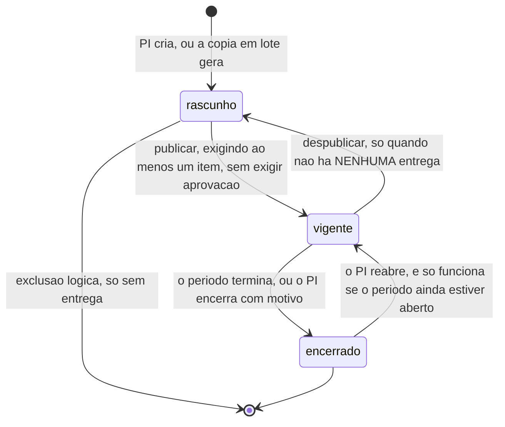
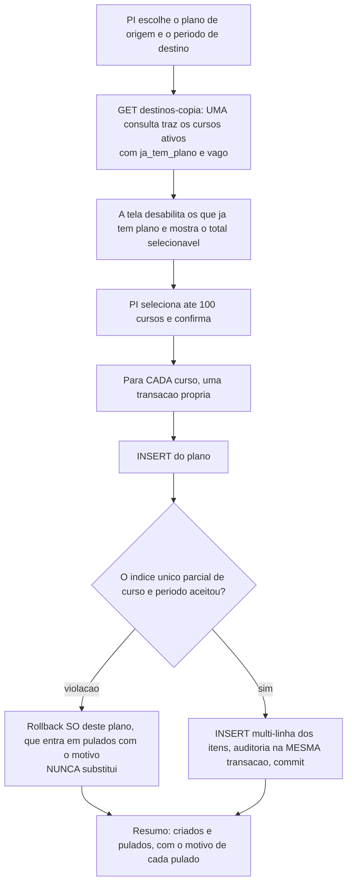
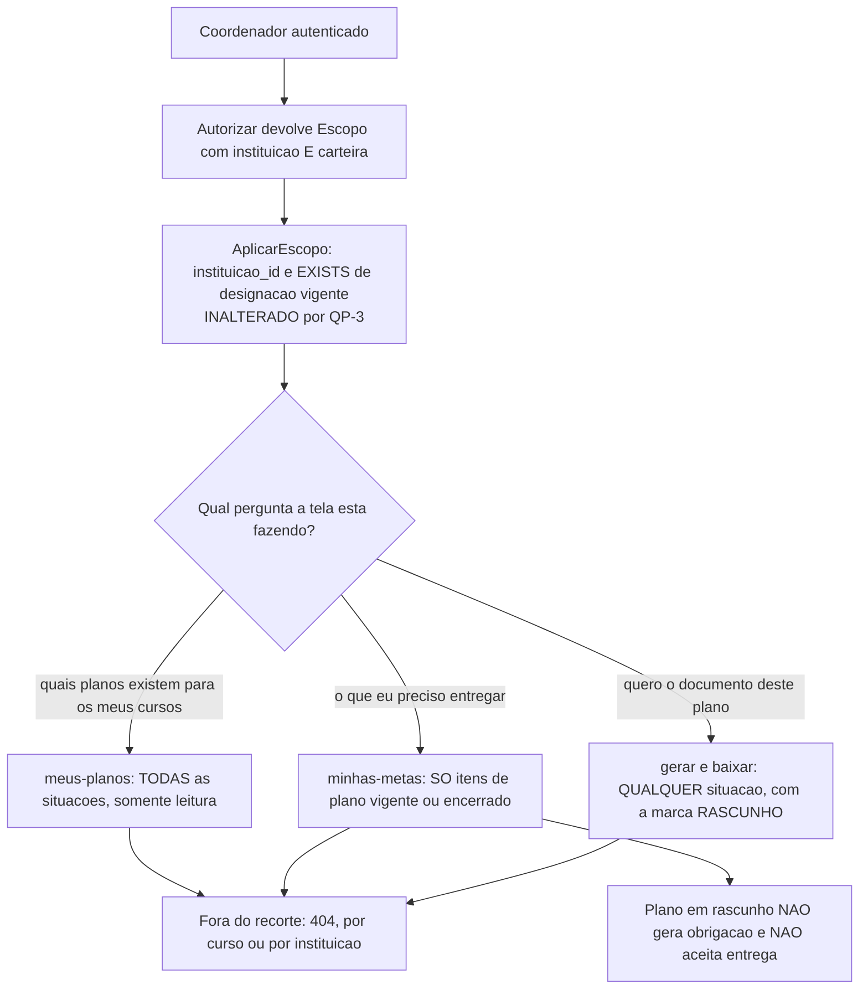

# Design: plano-acao

**Data:** 28/09/2026 (revisão 2 — QP-3 respondida) · **Status:** proposto —
aguarda aprovação do dono
**Entradas:** `spec.md` · `ux.md` · `specs/_fundacao-metas.md` ·
`specs/indicadores/design.md` · `specs/cursos/design.md` ·
`specs/autenticacao-usuarios/design.md` (rev. 6) · `project.config.md` ·
`CLAUDE.md`

> **Lê-se depois de `specs/_fundacao-metas.md`** (isolamento generalizado,
> carteira no `Escopo`, `DataLocal`, permissões, alcances, MinIO) e de
> `specs/cursos/design.md` (`Vigencia`, `FragmentoDesignacaoVigente`). Nada
> disso é redefinido aqui.
>
> **Revisão 2.** O dono respondeu **QP-3**: o coordenador gera o documento em
> **qualquer** situação do plano, inclusive rascunho. A mudança é menor do que
> parece no lugar onde foi pedida e **maior do que parece duas portas adiante**
> — ver **§5.4**, **§11.1** e a questão aberta **QP-6**. Saiu
> `plano.documento_id` (**P-11**), porque a decisão criou um caminho de escrita
> que ele não suportava.

---

## 1. Sumário das decisões

| # | Decisão | Motivo curto |
|---|---|---|
| P-01 | **`Periodo` reusa o Value Object `Vigencia` de `cursos`** | "O dia da data de fim entra inteiro" é a mesma regra; duas cópias divergem na primeira correção |
| P-02 | **A coluna armazenada chama-se `situacao_publicacao` (`rascunho`/`vigente`); `encerrado` nunca é gravado** | Nomear a coluna com o nome do conceito derivado é como o defeito entra — §3.3 |
| P-03 | **A API expõe uma `situacao` com três valores: a efetiva** | O cliente nunca aplica regra de domínio (condição 3 da decisão 3 do dono) |
| P-04 | **Edição de item bloqueada com o plano encerrado por qualquer motivo**, não só por período vencido | Reconciliação 2 do dono; divergência do `ux.md` resolvida a favor da regra mais restritiva — §11.2 |
| P-05 | **A cópia em lote não confia na pré-verificação: a garantia é o índice único** | A corrida de `CP-05` só fecha no `INSERT` |
| P-06 | **Uma transação por plano copiado; falha em um não desfaz os demais** | Atomicidade por plano, não por lote (3.6) |
| P-07 | **O `.docx` é modelo com marcadores, substituídos por código sobre `archive/zip`** — sem biblioteca, sem container | §7; o Gotenberg foi removido e não volta |
| P-08 | **O gerador falha alto quando um marcador declarado não é encontrado** | Marcador vazado para dentro do documento é o defeito silencioso da técnica |
| P-09 | **MinIO entra no ambiente nesta feature**, antes dos anexos | O documento chega primeiro; a infraestrutura vem com ele |
| **P-10** | **O coordenador lê os planos da carteira em qualquer situação; o que continua filtrado é a lista de obrigações, não a de planos** | QP-3. *"Não cobra"* permanece; *"não aparece"* cai — §5.4 |
| **P-11** | **`plano.documento_id` deixa de existir** | A decisão de QP-3 criou um caminho em que o coordenador escreveria numa coluna do plano. Uma lateral de um registro custa menos que a regra especial que isso exigiria — §7.4 |

---

## 2. Diagramas

### 2.1 Situação do plano — o que é armazenado e o que é derivado



`rascunho` e `vigente` são **armazenados** em `situacao_publicacao`.
`encerrado` é **derivado**: `encerrado_em` preenchido **ou** período encerrado
na data de referência. **A aprovação não aparece no diagrama porque não é
estado** — é um dado que pode ser preenchido em qualquer das três situações.

### 2.2 Cópia em lote — onde a garantia realmente está



**A verificação de `B` não é a garantia — é conforto de tela.** Entre abrir e
confirmar, alguém pode criar o plano. A garantia é a **violação do índice
único** em `G`, e é por isso que o caminho de erro do `INSERT` é tratado como
resultado esperado, não como exceção.

### 2.3 O que o coordenador alcança depois de QP-3



**A figura separa duas perguntas que a spec tratava como uma só:** *quais
planos existem para os meus cursos* e *o que eu preciso entregar*. A resposta
do dono a QP-3 mudou a primeira e **não tocou na segunda**.

---

## 3. Domínio

### 3.1 Value Objects

| VO | Regras |
|---|---|
| **`Vigencia`** | **Reusado de `cursos`** (P-01). `Periodo` o carrega; `SituacaoEm` devolve `nao_iniciado` / `aberto` / `encerrado` com o mesmo mapeamento de `futura`/`vigente`/`encerrada` |
| **`OrgaoDeAprovacao`** | `nde` \| `colegiado_curso` → 400 `VALOR_INVALIDO` (PP-4) |
| **`Aprovacao`** | Par `{data DataLocal, orgao OrgaoDeAprovacao}`, **os dois ou nenhum** → 400 `APROVACAO_INCOMPLETA`. Invariante de par, logo VO e não dois campos soltos |
| **`Quantidade`** | Inteiro ≥ 1 → 400 `QUANTIDADE_INVALIDA`. Existe como VO porque é **o número que a feature inteira existe para proteger**: um tipo próprio impede que ele seja somado, dividido ou multiplicado por acidente em qualquer camada |
| **`SituacaoPlano`** | `rascunho` \| `vigente` \| `encerrado`. **Só o terceiro não é persistível** — o tipo o carrega porque é o que a API expõe |

`Aprovacao` como Value Object é o que faz `PL-03` cair de graça: não há como
construir um plano com data sem órgão, porque não há construtor que aceite.

### 3.2 Entidades

```go
type Periodo struct {
    ID, InstituicaoID uuid.UUID
    Nome              valueobject.NomeCatalogo
    Vigencia          valueobject.Vigencia   // sem coluna de situação
    // campos base
}

type Plano struct {
    ID, InstituicaoID, CursoID, PeriodoID uuid.UUID
    Descricao, ObjetivoGeral, ResultadosEsperados string
    AlinhamentoPDI, AlinhamentoPPC               string
    Aprovacao          *valueobject.Aprovacao
    SituacaoPublicacao valueobject.SituacaoPlano // rascunho | vigente, nunca encerrado
    EncerradoEm        *time.Time
    EncerramentoMotivo string
    // campos base
}

// A única função que decide a situação efetiva do plano.
func (p *Plano) SituacaoEfetiva(periodo Periodo, hoje valueobject.DataLocal) valueobject.SituacaoPlano
func (p *Plano) SemAprovacao(periodo Periodo, hoje valueobject.DataLocal) bool
```

`SituacaoEfetiva` é chamada na serialização e em toda regra que dependa dela.
**Nenhum adapter escreve `situacao = 'encerrado'` em `WHERE`**, porque o valor
não existe no banco; filtros por situação efetiva são traduzidos para o par
(`situacao_publicacao`, predicado de data) no adapter, em uma função só.

`SemAprovacao` devolve verdadeiro apenas quando a situação efetiva é `vigente`
ou `encerrado` **e** `Aprovacao == nil` — plano em rascunho sem aprovação é o
estado normal de quem está montando, e não recebe aviso nenhum (`SI-07`).

**`Plano` não tem `DocumentoID`** (P-11, §7.4).

```go
type ItemDoPlano struct {
    ID, PlanoID, CursoID, InstituicaoID, MetaID uuid.UUID
    Quantidade valueobject.Quantidade
    // campos base
}
```

**`CursoID` e `InstituicaoID` denormalizados com FK composta** — fundação §3.5.
É o que permite o filtro de carteira ser um predicado de linha, sem junção.

---

## 4. Banco de dados

### 4.1 Tabelas

```sql
CREATE TABLE periodo (
    id             UUID        PRIMARY KEY,
    instituicao_id UUID        NOT NULL REFERENCES instituicao (id),
    nome           TEXT        NOT NULL,
    data_inicio    DATE        NOT NULL,
    data_fim       DATE        NOT NULL,
    criado_em      TIMESTAMPTZ NOT NULL DEFAULT now(),
    atualizado_em  TIMESTAMPTZ,
    excluido_em    TIMESTAMPTZ,
    versao         INT         NOT NULL DEFAULT 1,
    CONSTRAINT ck_periodo_datas CHECK (data_fim >= data_inicio),
    CONSTRAINT ck_periodo_nome  CHECK (btrim(nome) <> '' AND length(nome) <= 100)
);
CREATE UNIQUE INDEX uq_periodo_instituicao_nome
    ON periodo (instituicao_id, lower(btrim(nome))) WHERE excluido_em IS NULL;

CREATE TABLE plano (
    id                   UUID        PRIMARY KEY,
    instituicao_id       UUID        NOT NULL,
    curso_id             UUID        NOT NULL,
    periodo_id           UUID        NOT NULL REFERENCES periodo (id),
    descricao            TEXT        NOT NULL,
    objetivo_geral       TEXT        NOT NULL,
    resultados_esperados TEXT        NOT NULL,
    alinhamento_pdi      TEXT        NOT NULL DEFAULT '',
    alinhamento_ppc      TEXT        NOT NULL DEFAULT '',
    aprovacao_data       DATE,
    aprovacao_orgao      TEXT,
    situacao_publicacao  TEXT        NOT NULL DEFAULT 'rascunho',
    encerrado_em         TIMESTAMPTZ,
    encerramento_motivo  TEXT,
    criado_em            TIMESTAMPTZ NOT NULL DEFAULT now(),
    atualizado_em        TIMESTAMPTZ,
    excluido_em          TIMESTAMPTZ,
    versao               INT         NOT NULL DEFAULT 1,

    CONSTRAINT ck_plano_situacao CHECK (situacao_publicacao IN ('rascunho','vigente')),
    CONSTRAINT ck_plano_orgao    CHECK (aprovacao_orgao IS NULL
                                     OR aprovacao_orgao IN ('nde','colegiado_curso')),
    -- PL-03: os dois ou nenhum, garantido pelo banco também
    CONSTRAINT ck_plano_aprovacao CHECK ((aprovacao_data IS NULL) = (aprovacao_orgao IS NULL)),
    CONSTRAINT ck_plano_encerramento CHECK (encerrado_em IS NULL
                                         OR btrim(coalesce(encerramento_motivo,'')) <> ''),
    CONSTRAINT ck_plano_textos CHECK (btrim(descricao) <> ''
                                  AND btrim(objetivo_geral) <> ''
                                  AND btrim(resultados_esperados) <> ''),
    CONSTRAINT fk_plano_curso
        FOREIGN KEY (curso_id, instituicao_id) REFERENCES curso (id, instituicao_id)
);

-- PP-1 / PL-02 / a corrida de CP-05: a garantia está AQUI
CREATE UNIQUE INDEX uq_plano_curso_periodo
    ON plano (curso_id, periodo_id) WHERE excluido_em IS NULL;

CREATE UNIQUE INDEX uq_plano_id_curso ON plano (id, curso_id);
CREATE INDEX idx_plano_listagem
    ON plano (instituicao_id, periodo_id, curso_id) WHERE excluido_em IS NULL;

CREATE TABLE item_plano (
    id             UUID        PRIMARY KEY,
    plano_id       UUID        NOT NULL,
    curso_id       UUID        NOT NULL,
    instituicao_id UUID        NOT NULL,
    meta_id        UUID        NOT NULL REFERENCES meta (id),
    quantidade     INT         NOT NULL,
    criado_em      TIMESTAMPTZ NOT NULL DEFAULT now(),
    atualizado_em  TIMESTAMPTZ,
    excluido_em    TIMESTAMPTZ,
    versao         INT         NOT NULL DEFAULT 1,
    CONSTRAINT ck_item_quantidade CHECK (quantidade >= 1),
    CONSTRAINT fk_item_plano
        FOREIGN KEY (plano_id, curso_id) REFERENCES plano (id, curso_id)
);
CREATE UNIQUE INDEX uq_item_plano_meta
    ON item_plano (plano_id, meta_id) WHERE excluido_em IS NULL;   -- IT-05
CREATE UNIQUE INDEX uq_item_id_curso ON item_plano (id, curso_id);
CREATE INDEX idx_item_plano ON item_plano (plano_id) WHERE excluido_em IS NULL;
CREATE INDEX idx_item_meta  ON item_plano (meta_id)  WHERE excluido_em IS NULL;

CREATE TABLE documento (
    id             UUID        PRIMARY KEY,
    plano_id       UUID        NOT NULL,
    curso_id       UUID        NOT NULL,
    instituicao_id UUID        NOT NULL,
    chave_objeto   TEXT        NOT NULL,
    nome_arquivo   TEXT        NOT NULL,
    situacao_no_ato TEXT       NOT NULL,
    gerado_por     UUID        NOT NULL REFERENCES usuario (id),
    gerado_em      TIMESTAMPTZ NOT NULL DEFAULT now(),
    criado_em      TIMESTAMPTZ NOT NULL DEFAULT now(),
    excluido_em    TIMESTAMPTZ,
    CONSTRAINT fk_documento_plano
        FOREIGN KEY (plano_id, curso_id) REFERENCES plano (id, curso_id)
);
-- sustenta a lateral de "último documento" que substituiu plano.documento_id (P-11)
CREATE INDEX idx_documento_plano ON documento (plano_id, gerado_em DESC);
```

**`documento` não tem `versao`** — é imutável por natureza: cada geração cria
um objeto novo (PP-8), e o anterior não é sobrescrito. **`situacao_no_ato`
guarda a situação efetiva do plano no instante da emissão**, e é o que permite
saber depois por que aquele arquivo saiu marcado como RASCUNHO.

**`item_plano` tem `versao` mas `meta_indicador` não** (`indicadores`, I-08): o
item é editável independentemente (a quantidade), a associação da meta não —
é reescrita inteira dentro da transação da meta.

### 4.2 O que o `dba` valida

| # | Propriedade | O que reprova |
|---|---|---|
| V-1 | O banco recusa o **segundo** plano do mesmo curso e período, inclusive em transações concorrentes | o segundo `INSERT` ser aceito |
| V-2 | O banco recusa `aprovacao_data` sem `aprovacao_orgao` e o inverso | qualquer um dos dois aceito |
| V-3 | O banco recusa `encerrado_em` sem motivo | aceito |
| V-4 | Listagem de planos sem varredura sequencial em `plano`, p95 < 300 ms | `Seq Scan` |
| V-5 | **`destinos-copia` é uma consulta, não uma por curso** | mais de uma ida ao banco |
| V-6 | Cópia de 100 cursos com ~10 itens abaixo de 10 s, com **um** `INSERT` multi-linha de itens por plano | 10 `INSERT` por plano |
| V-7 | `meus-planos` p95 < 200 ms, sem varredura sequencial | `Seq Scan` |
| V-8 | Seed idempotente, compatível com `uq_plano_curso_periodo` | reexecução falhar |
| **V-9** | **A lateral de "último documento" resolve um registro por plano, sem varredura sequencial em `documento`** | `Seq Scan` em `documento` — é o custo que substituiu `plano.documento_id` |

---

## 5. Use cases e regras

```
command/ periodo/ criar · atualizar · excluir
         plano/   criar · atualizar · excluir · publicar · despublicar
                  encerrar · reabrir · registrar_aprovacao · copiar_em_lote
         item/    criar · atualizar · excluir
         documento/ gerar
query/   periodo/ listar · buscar
         plano/   listar · buscar · listar_meus_planos · listar_destinos_de_copia
         documento/ baixar
```

### 5.1 Publicar, despublicar, encerrar

| Operação | Pré-condições verificadas **no use case, dentro da transação** |
|---|---|
| Publicar | pelo menos um item → 400 `PLANO_SEM_ITEM`; período não encerrado → 409 `PERIODO_ENCERRADO`; **curso vago é permitido**, com aviso; **sem aprovação é permitido**, com aviso |
| Despublicar | **nenhuma** entrega no plano → 409 `PLANO_COM_ENTREGA` |
| Encerrar | motivo obrigatório → 400 `MOTIVO_OBRIGATORIO` |
| Reabrir | limpa `encerrado_em`; **se o período já encerrou, o plano permanece encerrado**, porque a situação é derivada (`SI-13`) — e isso não é erro, é a resposta correta |
| Excluir | só em `rascunho` e sem entrega → 409 `PLANO_VIGENTE_NAO_EXCLUIVEL` / `PLANO_COM_ENTREGA` |

**"Nenhuma entrega" é verificado com `SELECT ... FOR UPDATE` na linha do plano
antes do `EXISTS`**, pela mesma razão de `cursos` §5.4: sem serializar, uma
entrega criada entre a verificação e o `UPDATE` sobreviveria a um plano
despublicado, e a cobrança dela desapareceria sem deixar rastro.

**`SI-13` merece o registro explícito** porque parece bug e não é: reabrir um
plano cujo período já encerrou responde 200, limpa `encerrado_em`, e o plano
continua aparecendo como `encerrado`. A situação é derivada de **duas** fontes,
e limpar uma não anula a outra. A tela diz isso antes de confirmar.

### 5.2 Itens — onde a quantidade mora, e onde ela congela

- `quantidade` é do **item**, nunca da meta, **nunca dividida entre cursos**,
  **nunca multiplicada pelo número de indicadores** da meta. O tipo
  `Quantidade` existe para que nenhuma camada a some ou multiplique por
  acidente.
- `meta_id` de outra instituição → **404** (o repositório de meta é consultado
  com `Escopo`).
- Meta inativa em item novo → 400 `META_INATIVA`. **Meta inativada depois
  continua no item e continua cobrando** (`IT-06`, `MC-10`).
- **Alterar quantidade, acrescentar ou remover item é bloqueado com o plano
  encerrado — por qualquer motivo** (P-04) → 409
  `PLANO_ENCERRADO_PARA_EDICAO`. Alterar `descricao` e os demais textos do
  plano continua permitido (`IT-09`).
- Remover item que já tem entrega → 409 `ITEM_COM_ENTREGA`. A saída é reduzir
  a quantidade, nunca apagar histórico.

### 5.3 Cópia em lote

```go
for _, cursoID := range in.Cursos {                 // até 100 (PP-6)
    err := uc.uow.Executar(ctx, func(ctx) error {
        novo := plano.CopiarPara(origem, cursoID, in.PeriodoDestinoID) // nasce rascunho
        if err := uc.repo.Inserir(ctx, esc, novo); err != nil {
            return err                               // pode ser violação do índice único
        }
        if err := uc.repo.InserirItens(ctx, esc, novo.ID, itensDaOrigem); err != nil {
            return err                               // UM insert multi-linha
        }
        return uc.audit.Registrar(ctx, eventoCopia(origem.ID, cursoID)) // mesma transação
    })
    if errors.Is(err, domain.ErrPlanoDuplicado) {
        pulados = append(pulados, Pulado{cursoID, "já tem plano neste período"})
        continue                                     // CP-05: pula, NUNCA substitui
    }
    if err != nil {
        pulados = append(pulados, Pulado{cursoID, "falha ao criar"})
        continue                                     // CP-07: os demais permanecem
    }
    criados++
}
```

**O que a cópia leva e o que não leva** (3.6): leva descrição, objetivo,
resultados, alinhamentos e **os itens com as quantidades**. **Não leva**
entregas, anexos, avaliações, prazos, **os dados de aprovação** e a situação —
todo plano copiado **nasce em rascunho**.

**Copiar a aprovação seria o pior defeito possível desta feature**, e é
silencioso: atribuiria a nove planos uma aprovação institucional que não
aconteceu, e o documento gerado deles circularia dizendo isso. `CP-02` está no
obrigatório de testes por causa disso, não por completude.

**Resposta `200` com resumo**, nunca `207` — o projeto não usa multi-status, e
sucesso parcial é o resultado **esperado**, não uma anomalia de protocolo.

**Um registro de auditoria por plano criado**, na transação daquele plano
(`CP-12`). Plano que falhou não deixa registro — nada aconteceu. Um registro
único do lote seria uma segunda descrição do que as N transações já descrevem.

### 5.4 Visibilidade depois de QP-3 — o que mudou e o que não podia mudar

> **Primeiro, a confirmação que você pediu: o recorte de acesso não afrouxou, e
> não podia afrouxar.** O isolamento — instituição **e** carteira de cursos —
> mora em `AplicarEscopo`, e **QP-3 não o toca**. O filtro de situação nunca
> esteve lá: ele foi deliberadamente mantido fora, como regra de negócio, em
> §5.4 da revisão 1. É por isso que esta mudança de requisito é uma linha num
> use case de consulta, e **não** cirurgia na função de que toda a segurança
> depende. Se os dois estivessem misturados, responder QP-3 significaria mexer
> no isolamento para atender a uma regra de produto.

**O que a decisão do dono implica, e que não está no parágrafo que ele mudou.**
Gerar o documento de um plano **divulga o plano inteiro**: descrição, objetivo,
resultados, alinhamentos e a lista de metas com as quantidades. Logo:

> **Manter `GET /planos/{id}` em 404 para o rascunho deixa de proteger
> qualquer coisa** — é o mesmo dado atrás de duas portas, com uma trancada. E
> filtro que não protege é pior que filtro nenhum, porque cria a crença de que
> algo está protegido.

E há o lado prático: se o plano em rascunho não aparece em lugar nenhum para o
coordenador, ele não tem como chegar ao botão, e a decisão do dono **não teria
efeito nenhum**.

**Decisão (P-10), separando duas perguntas que a spec tratava como uma só:**

| Pergunta da tela | Rota | Depois de QP-3 |
|---|---|---|
| *Quais planos existem para os meus cursos?* | `GET /meus-planos`, `GET /planos/{id}` | **Todas as situações**, somente leitura |
| *O que eu preciso entregar?* | `GET /minhas-metas` | **Só itens de plano vigente ou encerrado** — inalterado |
| *Quero o documento deste plano* | `POST /planos/{id}/documentos`, `GET /documentos/{id}/conteudo` | **Qualquer situação**, com a marca RASCUNHO |

**Em uma frase: *"não cobra"* permanece; *"não aparece"* cai.** Um plano em
rascunho continua sem gerar obrigação, sem entrar no relatório e sem aceitar
entrega — o que 3.3 chama de "não cobra nada" é verdade e não foi tocado. O que
deixa de valer é a metade seguinte da mesma frase.

**O `SomenteVigentes` muda de lugar, não some.** Ele sai da consulta de
**planos** e passa a viver na consulta de **obrigações** (`minhas-metas`),
derivado do alcance e nunca de parâmetro do cliente. É um lugar melhor do que
o anterior: "obrigação" é um conceito de negócio, e item de plano em rascunho
não é uma.

**Três consequências que atravessam, e que o `analista-requisitos` precisa
fechar** — ver `QP-6` em §11.1:

1. **`EN-03` de `metas-coordenacao` muda de código.** Registrar entrega em
   plano rascunho respondia **404** *"para ela o plano ainda não existe"*;
   passa a responder **409 `PLANO_NAO_VIGENTE`**, porque já não há existência a
   esconder e 404 mentiria sobre um plano que ele acabou de ler.
2. **`SI-01`, `DO-05` e `VI-01` deixam de descrever o comportamento**, e o
   bloco de teste *"Rascunho não cobra, e não vaza"* perde metade do nome.
3. **A tela precisa dizer por que aquele plano não tem ações.** Um plano em
   rascunho na lista do coordenador sem explicação é um item que parece
   quebrado. Texto, não mecanismo.

### 5.5 Quem administra

| Quem pede | Alcance | Resultado |
|---|---|---|
| PI | `PlanosDaInstituicao` | tudo da instituição, leitura e escrita |
| Coordenador | `PlanosDaCarteira` | só cursos da carteira, **somente leitura**, todas as situações |

Escrita pelo coordenador → **403 `PERMISSAO_NEGADA`** em criar, editar,
publicar, despublicar, encerrar, copiar e mexer em item (`VI-04`). Fora da
carteira ou de outra instituição → **404**, pelo `Escopo`.

---

## 6. Contrato de API

Rotas da seção 9 da spec, sem acréscimo. Precisões:

```json
// GET /api/v1/planos — linha
{ "id": "...", "curso": { "id": "...", "nome": "Sistemas de Informação", "vago": false },
  "periodo": { "id": "...", "nome": "2026.1" },
  "situacao": "vigente",
  "metas": 2, "total_exigido": 3,
  "aprovacao": null, "sem_aprovacao": true,
  "tem_entrega": false,
  "ultimo_documento": { "id": "...", "gerado_em": "2026-03-10T14:02:00-03:00" },
  "versao": 1 }
```

- **`situacao` é a efetiva, com três valores** (P-03). O cliente nunca aplica a
  regra de derivação. O filtro `?situacao=encerrado` é traduzido no adapter
  para o par (`situacao_publicacao = 'vigente'`, predicado de encerramento).
- **`ultimo_documento` substitui o antigo `documento_id`** (P-11): vem da
  lateral, é `null` quando nunca houve geração, e aparece **só no detalhe** —
  a listagem não o traz, porque nenhuma tela dela o usa.
- **`sem_aprovacao` e `aprovacao` convivem, e isso não viola "um campo por
  fato"**: são dois fatos. `aprovacao` é *o dado* (data e órgão, ou nulo);
  `sem_aprovacao` é *a pendência*, que é falsa num rascunho sem aprovação e
  verdadeira num vigente sem aprovação — exatamente a distinção de `SI-07` que
  o cliente não pode derivar de `aprovacao == null` sozinho, porque depende da
  situação efetiva.
- **`tem_entrega`** (pedido do `ux.md`): `EXISTS`, habilita ou desabilita
  `[⏸]` e `[✗]` com o motivo certo. Também por item, na resposta de detalhe.
- **`total_exigido`** é `SUM(quantidade)` **dos itens** — o único `SUM`
  legítimo desta feature. Nunca soma de entregas, nunca multiplicado por
  indicador.
- **Nenhum campo de INEP no plano.** A informação chega pela meta, via
  indicadores. Coluna ou campo de INEP em `plano` é achado de revisão.
- **Sem `/cursos/sugestoes` dedicado.** O autocomplete de curso do
  formulário de plano reusa `GET /api/v1/cursos?situacao=ativo&page_size=50`
  (specs/cursos) — o volume (PP-9: centenas de cursos por instituição)
  cabe numa única página, sem endpoint próprio.
- **`POST /api/v1/planos/{id}/copias` responde 200** com
  `{ criados, pulados: [{curso, motivo}] }`.
- **`GET /api/v1/documentos/{id}/conteudo`** devolve o `.docx` com
  `Content-Disposition`. **Nenhuma resposta da API expõe a URL do bucket**,
  assinada ou não, em nenhum campo — teste confere que o DTO não contém o
  endereço do armazenamento.

**Códigos criados aqui:** `PERIODO_DATAS_INVALIDAS`, `NOME_PERIODO_DUPLICADO`,
`PERIODO_COM_PLANO`, `PLANO_DUPLICADO`, `APROVACAO_INCOMPLETA`,
`PLANO_SEM_ITEM`, `PERIODO_ENCERRADO`, `PLANO_COM_ENTREGA`,
`MOTIVO_OBRIGATORIO`, `PLANO_VIGENTE_NAO_EXCLUIVEL`, `QUANTIDADE_INVALIDA`,
`META_DUPLICADA_NO_PLANO`, `META_INATIVA`, `PLANO_ENCERRADO_PARA_EDICAO`,
`ITEM_COM_ENTREGA`, `CURSOS_OBRIGATORIOS`, `LOTE_ACIMA_DO_LIMITE`,
`CURSO_INATIVO`.

**Ordenação:** períodos `nome`, `data_inicio`, `data_fim` (padrão
`data_inicio desc`); planos `curso`, `periodo`, `situacao`, `criado_em`
(padrão `curso asc`). Fora da lista → 400.

---

## 7. O documento `.docx`

### 7.1 A decisão, e o que as alternativas custam

| Caminho | Custo |
|---|---|
| **Gotenberg ou LibreOffice em container** | Serviço novo, imagem de centenas de megabytes e um salto de rede para produzir um documento cujos dados o sistema já tem inteiros. **Removido do projeto por decisão, e não volta por isto** |
| **Gerar do zero com biblioteca OOXML** | Perde a formatação institucional. O PI receberia um documento que não se parece com o da instituição dele, e é ele quem vai levá-lo a uma avaliação |
| **Modelo `.docx` com marcadores** ✅ | `.docx` é um ZIP de XML: substituir `{{curso_nome}}` em `word/document.xml` preserva estilo, cabeçalho, rodapé e logotipo que a instituição pôs lá |

Escolhido o modelo, resta decidir **biblioteca ou código próprio**. A escada do
`CLAUDE.md`: a `stdlib` resolve — `archive/zip` mais `encoding/xml` fazem o
trabalho inteiro. As bibliotecas disponíveis são invólucros finos com **as
mesmas armadilhas** de §7.2, e cada uma vira dependência a verificar licença e
a atualizar para sempre (§15.19 herdada). **Decisão: `stdlib`**, em um adapter
único atrás de `port.GeradorDeDocumento`.

**Gatilho para revisitar:** se o modelo passar a precisar de seções
condicionais ou de repetição aninhada. Repetição simples de linha de tabela
(§7.2, item 3) cabe; aninhada não.

### 7.2 As três armadilhas, nomeadas porque a implementação ingênua cai nas três

1. **O Word parte o marcador em `runs`.** `{{curso_nome}}` digitado no editor
   pode virar `<w:t>{{curso</w:t>…<w:t>_nome}}</w:t>` se a formatação mudou no
   meio. A substituição ingênua **não encontra nada e não reclama**.
   **Mitigação em duas pontas:** o marcador entra no modelo como **um único
   `run` sem formatação**, e o gerador **falha alto** (P-08) quando um marcador
   declarado pelo modelo não é encontrado — `500` genérico ao cliente, erro
   completo no log. Um teste renderiza o modelo versionado e afirma que **zero
   `{{` sobraram** no resultado.
2. **Escape de XML.** Descrição, objetivo e resultados são texto do usuário.
   Um `&` ou um `<` não escapado produz um `.docx` que o Word **recusa abrir** —
   defeito que só aparece na mão de quem recebeu o documento. Toda substituição
   passa por `xml.EscapeText`, sem exceção. E **quebra de linha vira `<w:br/>`**:
   um `\n` dentro de `<w:t>` é descartado pelo Word, e o documento sai com os
   parágrafos colados, plausível e errado.
3. **A tabela de metas é repetição de linha, não substituição.** O modelo traz
   uma linha-modelo entre `{{#itens}}` e `{{/itens}}`; o gerador clona o
   `<w:tr>` por item. É a única parte que mexe na árvore e não no texto.

### 7.3 Quem gera, quem baixa — sem ramificação por situação

**Depois de QP-3:**

| Ator | Gerar e baixar |
|---|---|
| **PI** | qualquer plano da instituição, em qualquer situação |
| **Coordenador** | qualquer plano **dos cursos da carteira**, em **qualquer situação**, inclusive rascunho |
| Demais perfis | 403 |

**Nenhum dos dois ramifica por `situacao`.** O único recorte é o `Escopo` —
instituição para o PI, instituição **e** carteira para o coordenador —, e ele
já produz **404** para plano de outro curso ou de outra instituição.

**A simplificação que você previu, medida:** sai uma condição do use case, sai
o parâmetro `SomenteVigentes` da consulta de documento, e **saem dois caminhos
de teste** — a metade de `DO-05` que exigia 404 no rascunho, e a ramificação
por perfil dentro do use case de geração. O que **não** sai é o teste de
autorização: `DO-04` continua obrigatório, e ganha um caso novo (coordenador de
outro curso pedindo o documento → 404), porque com uma porta a menos a porta
que resta carrega mais peso.

**O arquivo sai marcado como RASCUNHO de todo modo** (PP-7) — é o que impede
uma minuta de circular parecendo compromisso, e continua sendo escrito pelo
backend, nunca pela tela.

**Toda geração e todo download são auditados**, com quem gerou. Com o
coordenador agora entre os geradores, `gerado_por` deixa de ser sempre o PI —
e é exatamente por isso que a coluna existe.

### 7.4 Por que `plano.documento_id` saiu (P-11)

Na revisão 1 o plano apontava para o documento mais recente, para evitar uma
subconsulta em toda leitura. **QP-3 quebrou isso**, e o efeito colateral não
estava no pedido:

> Gerar documento passou a ser uma ação do **coordenador**. Com
> `plano.documento_id`, gerar um documento seria o coordenador **escrevendo
> numa coluna do plano** — um plano que ele não pode editar.

E o estrago seria concreto, não teórico: se esse `UPDATE` tocasse `versao`, o
PI que abriu o plano para editar levaria **409 `CONFLITO_DE_VERSAO`** porque
um coordenador gerou um documento do outro lado do país. Manter a coluna
exigiria a regra especial *"este `UPDATE` não incrementa `versao` nem
`atualizado_em`"* — e regra especial sobre o token de concorrência é
precisamente o tipo de coisa que a próxima pessoa não sabe que existe.

**Decisão: a coluna sai.** O "último documento" vira `LEFT JOIN LATERAL` de um
registro, **só no detalhe do plano**, sustentada pelo índice
`(plano_id, gerado_em DESC)` que já estava declarado. Custo: uma busca de um
registro por plano aberto. Benefício: some um caminho de escrita, some uma
coluna, some a regra especial e some a classe inteira de 409 espúrio.

**Gerar documento passa a não escrever em `plano` nenhuma vez** — é `INSERT`
em `documento` e nada mais. Um teste fixa isso: PI abre o plano na `versao` 1,
coordenador gera o documento, PI salva → **200, nunca 409**.

### 7.5 Conteúdo, marcação e armazenamento

Conteúdo conforme 3.5 da spec. Os três pontos com decisão:

- **Marca de situação:** `RASCUNHO` em rascunho; `ENCERRADO — período
  encerrado em DD/MM/AAAA` em encerrado; **nada** em vigente (PP-7).
- **Aprovação:** data e órgão, ou `Não aprovado`; **com a observação
  "Aprovação ainda não registrada" apenas quando o plano está vigente**
  (`SI-05`, `SI-07`). É o que impede o documento de circular dando a entender
  que houve aprovação.
- **Coordenador responsável na data de emissão**, com a portaria da designação
  vigente — ou **"Sem responsável"** (`DO-03`). Vem de
  `FragmentoDesignacaoVigente` na data de referência, como tudo o mais.

**Armazenamento:** MinIO, chave
`documento-plano/{instituicao_id}/{plano_id}/{gerado_em}-{documento_id}.docx`.
Cada geração é um objeto novo (PP-8), o anterior nunca é sobrescrito.

**Ordem da gravação, e o dilema que ela resolve:** grava-se o **objeto
primeiro, a linha depois**, dentro da transação. Se a transação falhar, sobra
um objeto órfão — invisível, reclamado pela rotina de retenção. A ordem
inversa deixaria uma **linha órfã**, que é um download quebrado visível ao
usuário. **Prefere-se objeto órfão a linha órfã**, e a exclusão compensatória
do objeto é *best-effort*, nunca garantia.

---

## 8. Auditoria

Conforme a seção 10 da spec. Os dois pontos com decisão:

- **`tinha_aprovacao` no registro de publicação.** Guarda se o plano estava
  aprovado no instante em que passou a cobrar. **Não é dedutível da data de
  aprovação sozinha**, porque esta pode ter sido registrada depois — e é
  exatamente a pergunta que alguém faz meses depois.
- **Alteração registra quais campos mudaram, não os valores — com duas
  exceções:** a **quantidade do item** e as **datas do período**, antes e
  depois, porque as duas mudam retroativamente o resultado de uma apuração.

**`gerar_documento` e `baixar_documento` registram quem foi** — e depois de
QP-3 isso deixa de ser formalidade: o gerador pode ser o PI **ou** o
coordenador, e distinguir os dois é o que responde "quem tirou esta minuta e
quando".

**Métricas:** planos publicados por período; cópias em lote com criados e
pulados; gauge de **planos em rascunho com período já aberto** (o plano
esquecido antes de publicar); gauge de **planos vigentes sem aprovação
registrada** — a pendência de 3.3 virando alerta em vez de descoberta na
véspera da avaliação.

---

## 9. Infraestrutura — MinIO entra aqui

Fundação §9. O que esta feature precisa do `dev-docker-compose`:

- serviço `minio` no `docker-compose.dev.yml` (9000 API, 9001 console), com
  volume nomeado e **sem publicar o console em produção**;
- criação do *bucket* na subida (serviço de inicialização de um tiro, com
  `depends_on ... service_completed_successfully`, como o `migrate`);
- `S3_ENDPOINT`, `S3_BUCKET`, `S3_ACCESS_KEY`, `S3_SECRET_KEY` no
  `.env.example` **sem valores**, e no compose de desenvolvimento;
- `/readyz` passa a verificar o MinIO, **sem devolver mensagem de driver**.

---

## 10. Testes

### 10.1 Escritos agora

| Bloco | Cenários | Natureza |
|---|---|---|
| **A quantidade mora no item, e não se divide nem multiplica** | `IT-01`, `IT-02` | integridade — o princípio que o dono confirmou duas vezes |
| **Um plano por curso e período** | `PL-02` | integridade, **banco real** — só o índice garante |
| **Cópia: o que não vai junto** | `CP-02`, `CP-03` | integridade — copiar aprovação atribui aprovação que não houve, em silêncio |
| **Cópia: nunca substituir, e a corrida** | `CP-05`, `CP-06`, `CP-07`, `CP-12` | integridade + corrida, **escritas concorrentes reais** |
| **Situação derivada no tempo** | `SI-11`, `PE-04` | integridade — `PE-04` é a virada no fuso e **falha com o servidor em UTC** |
| **Aprovação não bloqueia, e a falta aparece** | `SI-04`, `SI-05` | integridade — sem `SI-05` um plano circula como aprovado sem estar |
| **Rascunho não cobra** | `SI-01` **reescrito**, `VI-01` **reescrito** | integridade — a metade que sobreviveu a QP-3: não gera obrigação, não entra no relatório, não aceita entrega |
| **Publicar e despublicar** | `SI-02`, `SI-09`, `SI-10` | integridade — despublicar com entregas apaga trabalho feito |
| **Integridade dos itens** | `IT-05`, `IT-09`, `IT-10` | integridade, banco real |
| **Isolamento e autorização** | `VI-02` a `VI-07`, `IT-07` | segurança — inclui quem acumula perfis |
| **Documento: carteira é o único recorte** | `DO-04` **ampliado** | segurança — coordenador de outro curso pedindo o documento → 404; sem URL de bucket em campo nenhum |
| **Gerar documento não escreve em `plano`** | §7.4 | integridade — PI na `versao` 1, coordenador gera, PI salva → **200, nunca 409** |
| **Gerador: zero marcadores vazados e XML escapado** | §7.2 | integridade — mecanismo, permanente |
| **Concorrência** | `PL-07` | corrida — permanente |
| **Smoke** | cada rota | — |

**O que saiu desta lista por causa de QP-3:** a metade de `DO-05` que exigia
404 no rascunho, e o bloco antigo *"Rascunho não cobra, e não vaza"*, cuja
segunda metade deixou de existir.

**Unitários com o relógio injetado** para situação, itens e o que a cópia leva.
**Integração obrigatória** para `PL-02`, a corrida de `CP-05`, o isolamento e a
concorrência.

### 10.2 Adiados

`specs/plano-acao/testes-pendentes.md`: `PE-01`, `PL-01`, `IT-08`;
filtros, ordenação, paginação e estado de tela; `PE-02`, `PL-03` a `PL-06`,
`IT-04`, `IT-06`, `SI-12`, `CP-11`; `PE-06`, `SI-03`, `SI-06`, `SI-07`,
`SI-08`, `SI-13`, `SI-14`, `CP-01`, `CP-04`, `CP-08`, `CP-09`, `CP-10`,
`DO-01`, `DO-02`, `DO-03`, `DO-06`, `IT-03`, **`DO-05` reescrito** (o
coordenador gera a minuta e o arquivo sai marcado).

**Encabeçam a prioridade:** `SI-06`, `CP-08`, `SI-08`, `DO-01`, `DO-03`.

### 10.3 E2E recomendado

**Fluxo crítico: a cópia em lote.** A própria spec a nomeia como a operação com
maior potencial de estrago, e é a única em que um defeito destrói trabalho de
outra pessoa.

```
e2e/copia-em-lote.spec.ts
  1. PI abre a cópia de um plano com 3 itens, destino 2026.1
  2. O curso que já tem plano aparece marcado e NÃO selecionável
  3. Seleciona os demais, confirma, e o resumo mostra criados e pulados
     com o motivo de cada pulado
  4. Abre um plano criado: mesmos 3 itens, mesmas quantidades,
     em RASCUNHO, sem aprovação e sem entrega
  5. O plano de origem permanece inalterado
```

O passo 4 é o que falha se alguém copiar a aprovação ou a situação — e é
exatamente o defeito que passaria despercebido em revisão de código.

**Acréscimo por QP-3, no fluxo de `cursos` ou em arquivo próprio:** o
coordenador abre um plano em rascunho do curso dele, gera o documento, e o
arquivo sai marcado como RASCUNHO; o mesmo coordenador pedindo o documento de
um plano de curso que não coordena recebe não encontrado.

### 10.4 Critério de aceitação

`A ∪ B = C`, `A ∩ B = ∅`, todo cenário de 10.1 em `A`. **Com `C` recalculado
depois que o `analista-requisitos` fechar `QP-6`** — `SI-01`, `DO-05` e
`VI-01` mudam de texto, e o critério é mecânico sobre a lista vigente.

---

## 11. Divergências e questões abertas

### 11.1 `QP-6` — a resposta a QP-3 contradiz sete passagens que não foram alteradas

**Questão aberta para o `analista-requisitos`, registrada em vez de resolvida
por conta própria.** §3.5 da `spec.md` foi corrigido; as passagens abaixo
continuam dizendo o contrário, e **o documento está internamente
contraditório**:

| Onde | O que ainda diz |
|---|---|
| `spec.md` 3.3, linha 149 | rascunho *"não aparece para o coordenador"* |
| `spec.md` 3.7, linha 336 | *"Plano em rascunho, pedido pelo coordenador → 404"* |
| `spec.md` §5, linha 432 | idem, na tabela de erros |
| `spec.md` `SI-01` e `VI-01` | *"pedir o plano pela API responde 404 para ela"*, *"NÃO vê os planos em rascunho deles — 404"* |
| `spec.md` `DO-05` | *"Quando ela tenta gerar o documento → 404"* — **o cenário diz exatamente o oposto da decisão** |
| `spec.md` §13.1 e §18 | o bloco *"Rascunho não cobra, e não vaza"* e a decisão *"Plano em rascunho responde 404 ao coordenador"* |
| `metas-coordenacao/spec.md` `EN-03` | entrega em plano rascunho → **404**, *"para ela o plano ainda não existe"* |

**O que implementei enquanto isso**, e por quê: a parte inequívoca (documento
em qualquer situação) mais o mínimo que a torna **alcançável** — sem o plano
aparecer em algum lugar, o botão não existe e a decisão do dono não produz
efeito. Registro que **escolhi a leitura mais ampla** (`P-10`), pelo argumento
de §5.4 de que o documento divulga o plano inteiro e a porta trancada ao lado
não protege nada. **Se o dono quiser a leitura estreita** — o coordenador gera
o documento mas não lê o plano pela API —, é uma linha no use case de consulta,
e eu a implemento; mas o `security-reviewer` deve saber que, nesse caso, o
recorte de leitura do plano é **aparência**, não proteção.

### 11.2 Divergências já reconciliadas

1. **`ux.md`, item 3 — itens somente leitura com o plano encerrado por
   qualquer motivo.** Decidido a favor da interface (P-04): o motivo pelo qual
   a spec congela a quantidade vale igual para encerramento antecipado. **O
   backend reforça**, conforme a reconciliação 2 do dono. Texto já corrigido
   pelo `analista-requisitos`.
2. **`ux.md`, item 4 — `tem_entrega` por plano e por item.** Aprovado, nas três
   condições da decisão 3.
3. **`destinos-copia` sem paginação própria.** Correto para o volume declarado.
   **Gatilho nomeado:** acima de ~500 cursos ativos por instituição, a tela
   passa a paginar.
4. **`ux.md` diz *"em rascunho o documento é material de trabalho do PI"***
   (seção do documento `.docx`). **Obsoleto por QP-3** — cabe ao
   `ux-designer` reescrever a nota contextual do botão, que agora também é
   exibida ao coordenador.

---

## 12. Alternativas rejeitadas

| Alternativa | Por quê |
|---|---|
| **Container de conversão (Gotenberg/LibreOffice)** | Serviço novo e salto de rede para dados que o sistema já tem. Removido por decisão |
| **Gerar o `.docx` do zero** | Perde a formatação institucional, que é a razão de o documento existir |
| **Biblioteca de `.docx`** | Invólucro fino com as mesmas armadilhas, mais uma dependência para sempre |
| **Coluna `situacao` com três valores** | Alguém precisaria atualizá-la quando o período vence — e não há escrita naquele instante |
| **Nomear a coluna `situacao`** | `WHERE situacao = 'vigente'` esperando o valor efetivo é exatamente o defeito |
| **Derivar a situação no cliente** | Regra de domínio em dois lugares |
| **`207 Multi-Status` na cópia** | O projeto não usa multi-status, e sucesso parcial é o resultado esperado |
| **Recusar o lote inteiro quando um curso já tem plano** | Pune onze cursos pelo décimo segundo |
| **Substituir o plano existente** | Destrói trabalho alheio sem avisar |
| **Pré-verificação como garantia da cópia** | Entre abrir a tela e confirmar, alguém cria o plano. A garantia é a violação do índice |
| **Filtro de rascunho dentro de `AplicarEscopo`** | Faria a única função de que toda a segurança depende falar também de estado de negócio — e QP-3 mostrou o valor disso: a mudança de requisito **não tocou** no isolamento |
| **`VIEW` para o plano com itens e indicadores** | A situação efetiva depende da data de referência, e `VIEW` não recebe parâmetro |
| **Linha de documento antes do objeto** | Download quebrado visível ao usuário, em vez de objeto órfão invisível |
| **Manter `plano.documento_id` com a regra *"este `UPDATE` não incrementa `versao`"*** | Regra especial sobre o token de concorrência é o que a próxima pessoa não sabe que existe — e o sintoma seria 409 espúrio no PI, causado por um coordenador gerando documento (§7.4) |
| **Gerar documento pelo coordenador sem ele enxergar o plano** | O documento **é** o plano inteiro. A porta trancada ao lado da porta aberta não protege — só cria a crença de que protege |
