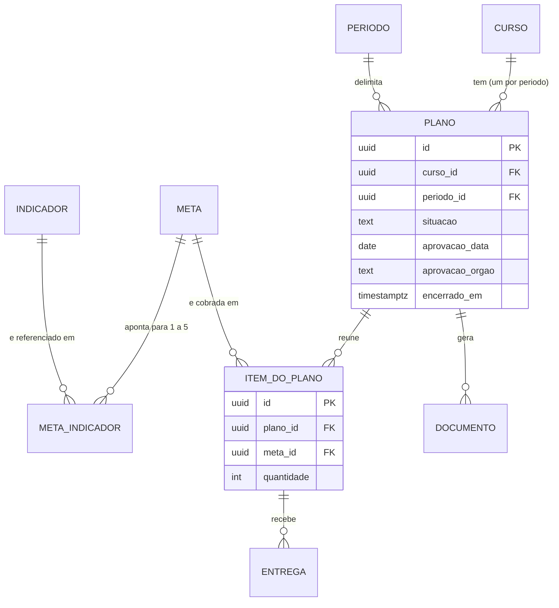
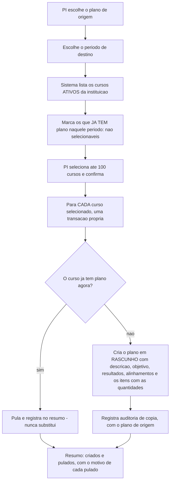

# Spec: plano-acao

**Data desta versão:** 28/09/2026 · **2ª versão — aprovação posterior e visível, itens com indicadores em lista**
**Status:** em validação pelo dono do produto
**Contexto:** `specs/00-visao-produto.md` · `specs/autenticacao-usuarios/spec.md` ·
`specs/cursos/spec.md` · `specs/indicadores/spec.md` · Stack: `project.config.md`
**Nível de rigor:** completo (`ux.md`, `design.md`, `tasks.md`, `evidence.md`)

> Cobre: **Período**, **Plano de Ação Curso/Coordenador**, os **itens do plano** (meta e
> quantidade), a **situação** do plano, o **documento DOCX** e a **cópia em lote**
> para vários cursos.
>
> **Não repete** o contexto de `autenticacao-usuarios` (perfis múltiplos,
> isolamento, 404 de outra instituição, padrão de CRUD, campos base, concorrência
> otimista, deleção lógica, paginação, formato de erro), de `cursos` (curso,
> designação por portaria, coordenador derivado, curso vago e inativo, acúmulo de
> papéis) nem de `indicadores` (Indicador e Meta como catálogos, **meta com um ou
> mais indicadores**). **Referencia.**
>
> **Entrega, avaliação e relatório de desempenho estão em
> `specs/metas-coordenacao/`.**

---

## 0. O que mudou nesta versão

| Antes | Agora |
|---|---|
| A aprovação já era posterior à publicação, sem estar dito como decisão | **Decisão do dono registrada** (3.3), e **plano vigente sem aprovação fica visível** no grid, na página e no documento |
| O item exibia "o indicador" da meta | **Lista de indicadores** — a meta pode ter de um a cinco (`indicadores`, 3.2) |
| O formulário de período não explicava por que a situação não é editável | **Situação calculada exibida como informação** no formulário, ao lado das datas, atualizada a cada tecla (3.1, `ux.md`) — o modelo não mudou, só a explicação na tela |

---

## 1. O modelo, e onde este arquivo entra

```
Indicador — escopo PLATAFORMA (catálogo do INEP)   ┐
Indicador — escopo INSTITUIÇÃO (próprio da IES)    ┘ N:N, pelo menos um
        ↑
      Meta (catálogo da instituição)
        ↑
Curso + Período ──> Plano de Ação Curso/Coordenador ──> Item do plano (meta + quantidade)
   ↑                    ↑                            │
specs/cursos/      ESTE ARQUIVO                      └─> Entrega ─> Anexos
                        │                                  specs/metas-coordenacao/
                        └─> Documento DOCX
```

Nas palavras do dono:

> "Quero adicionar o item Plano de Ação Curso/Coordenador e as metas então passam a
> pertencer ao plano de ação curso/coordenador. (...) Como teremos uma entidade meta
> separada, então um plano de ação tem várias metas e uma meta pode estar em
> vários planos, com quantidades diferentes de entregas."

**O plano é de um curso e de um período.** É ele que transforma o catálogo — que
não sabe de curso nem de quantidade — em cobrança concreta.

**A quantidade é do item do plano.** Nunca da meta, **nunca dividida entre cursos**
e **nunca multiplicada pelo número de indicadores** da meta (`indicadores`, 3.3).

---

## 2. Premissas declaradas

| # | Premissa | Se for rejeitada |
|---|---|---|
| **PP-1** | **Um plano por (curso, período)** — o segundo responde 409 `PLANO_DUPLICADO` (3.2) | Dois planos do mesmo curso no mesmo período, e o relatório soma duas cobranças do mesmo indicador sem que ninguém saiba qual vale |
| **PP-2** | **`encerrado` é derivado**: plano vigente cujo período já terminou, ou que o PI encerrou antecipadamente. **`rascunho` e `vigente` são armazenados** (3.3) | Coluna de situação com três valores, e a pergunta do que fazer quando ela diz "vigente" e o período acabou |
| **PP-3** | **Despublicar é permitido só enquanto não houver nenhuma entrega no plano** (3.3) | Ou nunca se despublica — e um plano publicado por engano fica cobrando —, ou se despublica com entregas, e trabalho já feito deixa de contar |
| **PP-4** | **O órgão de aprovação é lista fechada: NDE ou Colegiado de curso** (3.2) | Vira texto livre, e a prestação de contas perde a padronização que o campo existe para dar |
| **PP-5** | **A cópia em lote não permite ajustar quantidades durante a operação** (3.6) | A tela vira planilha de cursos × metas, e a operação deixa de ser rápida — que é a razão de existir |
| **PP-6** | **Limite de 100 cursos de destino por lote** (3.6) | Sem limite, um lote de trezentos cursos vira requisição longa e um resumo que ninguém lê |
| **PP-7** | **O documento é marcado quando o plano não está vigente**: **RASCUNHO** em rascunho, **ENCERRADO** em encerrado (3.5) | Uma marca só para os dois casos, e o documento de um plano concluído parece preliminar |
| **PP-8** | **Cada geração do documento cria um objeto novo**, com data e hora; o plano guarda a referência da última. O histórico **não** tem tela na v1 | Sobrescrever o anterior, e perde-se o documento que circulou antes de uma correção |
| **PP-9** | **Volume:** centenas de cursos, ~1 plano por curso e período, ~10 itens por plano (12) | Rever índices, paginação e o dimensionamento do relatório em `metas-coordenacao` |

---

## 3. Decisões de comportamento

### 3.1 Período

Entidade da instituição, com **nome, data de início e data de fim**, mais os campos
base. **Sem coluna de situação:** ela é derivada das datas, no fuso
`America/Sao_Paulo`.

| Situação derivada | Condição | Efeito |
|---|---|---|
| `não iniciado` | hoje < `data_inicio` | Planos não aceitam entrega |
| `aberto` | `data_inicio` ≤ hoje ≤ `data_fim` | Planos vigentes aceitam entrega |
| `encerrado` | hoje > `data_fim` | Não aceita entrega, e **encerra os planos daquele período** (3.3) |

**O dia da data de fim entra inteiro.** "O período encerra em 30 de julho" significa
que uma entrega em **30/07/2026 às 23h58 (Brasília) é aceita** e uma em
**31/07/2026 às 00h02 é recusada**. Com o servidor em UTC e a comparação sem fuso,
as entregas das 21h às 24h do dia 30 caem do lado errado da virada — e **o
resultado tem de ser o mesmo com o servidor em UTC**.

- `data_inicio`/`data_fim` são **data pura** (`DATE`); o instante da entrega é
  `TIMESTAMPTZ`, convertido para a data do fuso antes de comparar.
- **Antecipar ou prorrogar é editar `data_fim`.** Prorrogar reabre o período e os
  planos dele.
- **Períodos podem se sobrepor.** Cada plano aponta para **um** período.
- **Nome único por instituição**, entre não excluídos, **comparado por forma normalizada** (sem diferenciar maiúsculas nem espaços nas pontas: `"Engenharia Civil"`, `"engenharia civil"` e `" Engenharia Civil "` são o mesmo nome). **A unicidade é garantida por índice do banco sobre a forma normalizada** — verificação só na aplicação não sobrevive a duas telas salvando ao mesmo tempo.
- **Período com plano não é excluído** → 409 `PERIODO_COM_PLANO`.
- **A situação nunca é um campo do formulário — decisão confirmada, não
  esquecimento.** O dono do produto estranhou, ao editar um período, não
  conseguir alterar a situação nem entender por quê. A causa era falta de
  explicação na tela, não o modelo: a situação já era, e continua sendo,
  só derivada. A correção é de UX (`ux.md`, "Situação — informação
  calculada, não campo"): o formulário mostra a situação calculada como
  informação, ao lado das datas, atualizada a cada tecla — nunca como
  campo editável, para não criar uma segunda fonte de verdade sobre o
  mesmo fato que as próprias datas já determinam.

### 3.2 Plano de Ação Curso/Coordenador

| Campo | Regra |
|---|---|
| `curso_id` | obrigatório, **ativo**, da instituição da sessão |
| `periodo_id` | obrigatório, da instituição da sessão |
| `descricao` | obrigatória, texto simples multilinha |
| `objetivo_geral` | obrigatório, texto simples multilinha |
| `resultados_esperados` | obrigatório, texto simples multilinha |
| `aprovacao_data` | **opcional** — o plano existe, e **vige**, antes de ser aprovado (3.3) |
| `aprovacao_orgao` | **opcional**, lista fechada: **NDE** ou **Colegiado de curso** (PP-4). Se um dos dois vier, o outro é obrigatório → 400 `APROVACAO_INCOMPLETA` |
| `alinhamento_pdi` | opcional, texto simples multilinha |
| `alinhamento_ppc` | opcional, texto simples multilinha |
| `situacao` | **rascunho / vigente** (armazenada) — ver 3.3 |
| `encerrado_em`, `encerramento_motivo` | opcionais — encerramento antecipado (3.3) |
| campos base | `id` UUIDv7 gerado no domínio, `criado_em`, `atualizado_em`, `excluido_em`, `versao` |

**Um plano por (curso, período)** (PP-1) — índice único parcial sobre os não
excluídos; o segundo responde **409 `PLANO_DUPLICADO`**.

**Alinhamento com PDI e PPC são texto livre** porque **nem o PDI nem o PPC são
entidades do sistema**. Registrado para ninguém tentar transformá-los em referência
depois: hoje não há para onde apontar.

#### O que deliberadamente **não** é campo do plano

**O vínculo com o instrumento do INEP.** Decisão do dono: ele **chega pela meta, via
indicador** (`indicadores`, 3.2.2). A cadeia é

```
plano → item → meta → indicador(es) → (quando do INEP) referência do instrumento
```

Um campo de INEP no plano criaria a mesma informação em dois lugares. **O
`code-reviewer` deve tratar como achado qualquer coluna de INEP na tabela de
plano.**

### 3.3 Situação: rascunho → vigente → encerrado, e a aprovação que não bloqueia

| Situação | Como se obtém | O que significa |
|---|---|---|
| **rascunho** | armazenada; é como todo plano nasce | O PI monta. **Não cobra nada e não aceita entrega.** O coordenador **vê** o plano do curso dele, em somente leitura e com a marca de rascunho, mas ele **não aparece em "Minhas metas"** — essa é a lista de obrigações, e rascunho não é obrigação |
| **vigente** | armazenada; o PI **publica** | **A partir daqui o curso é cobrado** e as entregas são possíveis |
| **encerrado** | **derivada** (PP-2): `encerrado_em` preenchido **ou** período encerrado | Não aceita entrega nova. **Continua no relatório** e continua sendo avaliado |

**Por que `encerrado` é derivado:** o período vence sozinho, e uma coluna que
precisasse ser atualizada por alguém criaria uma janela em que o banco diz
"vigente" e o calendário diz o contrário. É a mesma decisão que `cursos` tomou para
o perfil do coordenador.

#### A aprovação é posterior à publicação — e fica visível quando falta

**Decisão do dono.** O PI publica o plano e **o coordenador já começa a
trabalhar**; os dados da aprovação são registrados **quando a reunião acontecer**.
Reflete a prática: o plano costuma começar a valer antes de a ata do NDE ser
lavrada, e travar a publicação até lá paralisaria o semestre por uma formalidade
que virá.

**A aprovação não é condição para publicar, nem para cobrar, nem para entregar.**

**Mas a ausência dela é informação que o próprio PI vai querer cobrar de si
mesmo**, e por isso aparece em três lugares:

1. **No grid de planos:** a linha de um plano **vigente ou encerrado sem aprovação
   registrada** traz **"⚠ sem aprovação"** na coluna de Aprovação, e o filtro de
   Aprovação permite listar exatamente esses.
2. **Na página do plano:** aviso persistente no topo — *"Este plano está vigente e
   ainda não tem aprovação registrada. Informe a data e o órgão quando a reunião
   acontecer."* — que some sozinho quando os dois campos forem preenchidos.
3. **No documento DOCX** (3.5): o campo de aprovação traz **"Não aprovado"**, e o
   documento de um plano **vigente** sem aprovação ganha a observação **"Aprovação
   ainda não registrada"** junto a esse campo. É o que impede o documento de
   circular dando a entender que houve aprovação.

**Plano em rascunho sem aprovação não recebe nenhum aviso** — é o estado normal de
quem está montando.

#### Publicar, despublicar, encerrar

**Publicar (rascunho → vigente):** exige **pelo menos um item** → 400
`PLANO_SEM_ITEM`; **recusado se o período já estiver encerrado** → 409
`PERIODO_ENCERRADO`; **permitido com o curso vago**, com aviso — o plano é do curso,
não da pessoa, e passa a aparecer como **"Sem responsável"** no relatório
(`cursos`, 3.3); **permitido sem aprovação**, com o aviso acima. A partir da
publicação o plano **aparece em `Minhas metas`** do coordenador designado.

**Despublicar (vigente → rascunho):** permitido **só enquanto não houver nenhuma
entrega no plano** (PP-3) → depois, **409 `PLANO_COM_ENTREGA`**. Despublicar com
entregas apagaria da cobrança um trabalho já feito.

**Encerrar antecipadamente:** o PI informa `encerrado_em` e um **motivo
obrigatório**. **Reabrir** é limpar o encerramento, e só funciona se o período ainda
estiver aberto.

**O que continua valendo com o plano encerrado:** avaliar entregas pendentes,
corrigir recusa dentro do prazo, gerar o documento e aparecer no relatório. **O
encerramento fecha a janela de enviar, não a de julgar.**

**Excluir plano:** lógico, e **só em rascunho e sem nenhuma entrega**.

### 3.4 Itens do plano — onde mora a quantidade

| Campo | Regra |
|---|---|
| `plano_id` | obrigatório |
| `meta_id` | obrigatório, meta **ativa** da mesma instituição; de outra → **404** |
| `quantidade` | obrigatória, **inteiro ≥ 1** → 400 `QUANTIDADE_INVALIDA` |
| campos base | idem plano |

- **A mesma meta não se repete no mesmo plano** → 409 `META_DUPLICADA_NO_PLANO`.
- **A quantidade nunca é dividida** entre cursos, e **nunca é multiplicada pelo
  número de indicadores** da meta. Uma meta que aponta para 1.4 e 1.5 com
  quantidade 4 exige **quatro entregas**, e cada uma atende os dois indicadores
  (`indicadores`, 3.3).
- **O item exibe os indicadores da meta, em lista**, com a origem de cada um — é o
  que permite ao PI ver o que está cobrindo enquanto monta o plano. **Os
  indicadores não são escolhidos aqui**: vêm da meta.
- **Acrescentar item a plano vigente é permitido**, e a meta nova passa a ser
  cobrada dali em diante, com aviso de que o coordenador a verá na próxima visita.
- **Alterar a quantidade** é permitido enquanto o **plano não estiver encerrado**, por qualquer motivo — período vencido **ou** encerramento antecipado pelo PI. A razão para congelar a quantidade é a mesma nos dois casos: o plano deixou de ser compromisso em curso, e mexer no que foi cobrado desfaz a base do que já foi entregue;
  depois, 409 `PLANO_ENCERRADO_PARA_EDICAO` — alterar depois muda retroativamente o
  resultado de um período apurado.
- **Remover item que já tem entrega** → 409 `ITEM_COM_ENTREGA`. A saída é reduzir a
  quantidade, nunca apagar o histórico.
- **Meta inativada** continua no item e continua cobrando (`indicadores`, 3.6).

### 3.5 Documento DOCX

**Decisão do dono: o documento do plano é um arquivo `.docx`.**

- **Gerado a qualquer momento, em qualquer situação** — inclusive em rascunho, para
  circular antes da aprovação.
- **Marcado visivelmente quando o plano não está vigente** (PP-7): **RASCUNHO** em
  rascunho, **ENCERRADO — período encerrado em DD/MM/AAAA** em encerrado.

**Conteúdo:**

1. Identificação da **instituição** (nome e sigla) e do **curso** (nome, grau,
   modalidade, código e-MEC quando houver)
2. **Coordenador responsável na data de emissão**, com a portaria da designação
   vigente — ou **"Sem responsável"** quando o curso estiver vago
3. **Período**, com início e fim
4. **Descrição**, **objetivo geral** e **resultados esperados**
5. **Alinhamento com o PDI** e **com o PPC**
6. **Lista de metas**: nome da meta, **os indicadores dela** (código, nome e origem)
   e a **quantidade**
7. **Dados de aprovação**: data e órgão — ou **"Não aprovado"**, com a observação
   **"Aprovação ainda não registrada"** quando o plano estiver vigente (3.3)
8. Data e hora de emissão, e a marca de situação quando não vigente

**Recomendação técnica ao `arquiteto` — recomendação, não decisão do analista:**
modelo `.docx` com marcadores substituídos por biblioteca, em vez de container de
conversão. Mantém a formatação institucional, não acrescenta serviço ao ambiente e
é reversível. **O Gotenberg foi removido do projeto e não deve voltar por causa
disto.**

**Armazenamento e acesso:** o arquivo vai para o **MinIO**, nunca para o disco do
container; **o download passa por rota autenticada**, e **a URL do bucket nunca é
exposta**; **cada geração cria um objeto novo** (PP-8); **quem pode gerar e
baixar:** o PI sempre, e o **coordenador do curso em qualquer situação do
plano, inclusive rascunho** — decisão do dono: ele enxerga o que será cobrado
antes de virar compromisso e pode apontar erro cedo, porque o curso tem
informação que o PI não tem; o arquivo sai marcado como **RASCUNHO** de todo
modo (PP-7); **toda geração e todo download são auditados**.

### 3.6 Cópia de plano para vários cursos, em lote

**Substitui** qualquer cópia um a um. **Destino: um conjunto de cursos e um
período** — o mesmo do plano de origem (replicar para outros cursos) ou outro
(ciclo seguinte). **É uma operação só.**

| Vai na cópia | **Não** vai na cópia |
|---|---|
| Descrição | **Entregas**, de qualquer situação |
| Objetivo geral | **Anexos** |
| Resultados esperados | **Avaliações, pareceres e prazos** |
| Alinhamento com PDI e com PPC | **Dados de aprovação** — a aprovação é do plano de origem; o novo precisa da sua |
| **Os itens**: meta e quantidade | **A situação** — todo plano copiado **nasce em rascunho** |
| — | O documento gerado, e qualquer vínculo com o plano de origem |

**Todo plano copiado nasce em rascunho**, para o PI revisar antes de publicar, e é
**independente da origem**. As **metas continuam compartilhadas**, porque são
catálogo — o que se copia é o **item**, com a quantidade.

**Quantidades (PP-5):** a cópia leva as mesmas, e o PI ajusta depois, plano a
plano. Ajustar durante a cópia transformaria a tela numa planilha de cursos ×
metas; como os planos nascem em rascunho, o ajuste posterior não tem custo.

**Curso de destino que já tem plano naquele período: é pulado, e o PI sabe antes.**

| Saída | Por que não |
|---|---|
| Recusar o lote inteiro | Pune onze cursos pelo décimo segundo |
| **Substituir** | **Destrói trabalho alheio sem avisar** — é o acidente típico de operação em lote |
| **Pular e informar** ✅ | Preserva o que existe, entrega o que faltava, e diz o que fez |

- **Antes de confirmar**, a tela marca cada curso que já tem plano, **não deixa
  selecioná-lo** e mostra o total de selecionáveis.
- **No servidor a verificação é refeita**, porque entre abrir a tela e confirmar
  alguém pode ter criado o plano. O curso é pulado e entra no resumo.
- **Cursos inativos não são oferecidos.** **Curso vago é oferecido**, marcado com
  **"Vago ⚠"** — o plano é do curso, é cobrado, e aparece como "Sem responsável".
- **O curso de origem** é destino válido **quando o período de destino é outro**.
- **Limite de 100 cursos por lote** (PP-6).

**Atomicidade: por plano, não por lote.** Falha em um **não desfaz** os demais.

**Resposta: `200` com o resumo** — `{ criados, pulados: [{curso, motivo}] }` — e na
tela **"9 planos criados · 3 cursos pulados"**, com a lista e o motivo de cada um.
Operação em lote que responde só "sucesso" é a que produz o chamado de suporte.

**Auditoria: um registro por plano criado** (10), cada um identificando o **plano de
origem**.

### 3.7 Quem enxerga o quê

| Quem | Plano |
|---|---|
| **Pesquisador Institucional** | Tudo da instituição: cria, edita, publica, despublica, encerra, copia em lote, gera o documento |
| **Coordenador de Curso** | **Só os planos dos cursos que ele coordena**, em **qualquer situação, inclusive rascunho** — somente leitura, com a marca de rascunho visível, e geração do documento. **"Minhas metas" é outra coisa:** lista só o que é obrigação, e portanto só o vigente (3.3) |
| Quem só tem **Professor** e/ou **Aluno** | Nada — 403 |
| **Administrador do Sistema** | Nada — **403**, nunca 404 |

| Situação | Código |
|---|---|
| Perfil sem a permissão | **403** `PERMISSAO_NEGADA` |
| Recurso de **outra instituição** | **404** `NAO_ENCONTRADO` |
| Plano de **curso que o ator não coordena** | **404** `NAO_ENCONTRADO` |
| **Plano em rascunho**, pedido pelo coordenador do curso | **200** — ele vê, em somente leitura, com a marca de rascunho (3.3) |

**A última linha mudou, e o motivo precisa sobreviver à mudança.** A regra
anterior respondia 404 ao coordenador para esconder que havia um plano sendo
preparado. Ela caiu porque **gerar o documento divulga o plano inteiro** —
descrição, objetivo, resultados, alinhamentos e as metas com quantidades. Manter
o plano como "não encontrado" na tela enquanto o documento entrega tudo seria o
mesmo dado atrás de duas portas, com uma trancada. **Filtro que não protege é
pior que filtro nenhum**, porque cria a crença de que algo está protegido.

**O que não caiu:** rascunho continua **não cobrando**. O filtro de "somente
vigentes" **não desapareceu — mudou de lugar**: saiu da consulta de planos e
ficou na de **obrigações** ("Minhas metas", `metas-coordenacao`). Apagá-lo dos
dois faria a tela oferecer "Prestar contas" numa rota que responde 409.

**Quem acumula PI e Coordenador enxerga pelos dois recortes, somados** — administra
todos os planos como PI, e continua vendo os cursos dele em `Minhas metas`.

### 3.8 Grids

Padrão obrigatório do `CLAUDE.md`, **sem exceção**.

**Planos** — `/app/planos`

| Item | Definição |
|---|---|
| **Filtros** | Período (pré-selecionado com o aberto mais recente); Curso; Situação (Rascunho / Vigente / Encerrado / Todas, padrão **Todas**); **Aprovação** (Aprovados / **Sem aprovação** / Todos) |
| **Colunas** | Curso · Período · Situação · Metas (nº de itens) · Total exigido · **Aprovação** · Ações |
| **Ordenáveis** | Curso, Período, Situação, Cadastrado em · **Padrão Curso crescente**, página **20** |
| **Ações** | `[✎]` abrir · `[⧉]` copiar em lote · `[⤓]` documento · `[▶]` publicar · `[⏸]` despublicar · `[✗]` excluir |

A coluna **Aprovação** traz a data e o órgão, ou **"⚠ sem aprovação"** quando o
plano está vigente ou encerrado sem os dados (3.3). O filtro "Sem aprovação" é o
caminho direto para a pendência.

**Períodos** — `/app/periodos`: filtros Nome e Situação; colunas Nome, Início, Fim,
Situação (derivada), Planos; ordenação padrão **Início decrescente**; página 20.

---

## 4. Fluxos

**Fluxo 1 — Cadastrar período (PI).** Menu "Metas → Períodos"; "Novo" pede nome,
início e fim. A situação aparece derivada das datas.

**Fluxo 2 — Montar o plano (PI).** Menu "Metas → Planos"; "Novo" pede curso,
período, descrição, objetivo geral, resultados esperados, alinhamentos e, **se já
houver**, os dados de aprovação. Salva em **rascunho**.

**Fluxo 3 — Acrescentar metas (PI).** Na página do plano, "Adicionar meta":
autocomplete de metas ativas e a quantidade. A linha mostra **os indicadores da
meta**, com a origem de cada um.

**Fluxo 4 — Publicar (PI).** "Publicar"; a confirmação informa quantas metas e o
total exigido, avisa se o curso está vago e **avisa se ainda não há aprovação
registrada** — sem impedir.

**Fluxo 5 — Registrar a aprovação depois (PI).** Quando a reunião acontece, abre o
plano e preenche data e órgão. O aviso de pendência some.

**Fluxo 6 — Copiar para vários cursos (PI).** `[⧉]`; escolhe o período de destino e
marca os cursos; os que já têm plano aparecem **não selecionáveis**; confirma e
recebe o resumo. Os planos novos nascem em **rascunho**.

**Fluxo 7 — Gerar o documento.** `[⤓]`; o `.docx` é gerado e baixado, **marcado
como RASCUNHO** se o plano não estiver vigente, e com **"Aprovação ainda não
registrada"** quando for o caso.

**Fluxo 8 — Encerrar antecipadamente (PI).** Com motivo obrigatório.

**Fluxo 9 — O período vence sozinho.** Os planos daquele período passam a aparecer
como **Encerrados**, e param de aceitar entregas novas.

---

## 5. Fluxos alternativos e de erro

| Condição | Comportamento |
|---|---|
| Período com fim anterior ao início | 400 `PERIODO_DATAS_INVALIDAS` |
| Nome de período repetido na instituição | 409 `NOME_PERIODO_DUPLICADO` |
| Excluir período que tem plano | 409 `PERIODO_COM_PLANO` |
| **Segundo plano para o mesmo curso e período** | **409 `PLANO_DUPLICADO`** (PP-1) |
| Descrição, objetivo geral ou resultados esperados vazios | 400 · mensagem junto ao campo |
| Data de aprovação sem órgão, ou órgão sem data | 400 `APROVACAO_INCOMPLETA` |
| Órgão de aprovação fora da lista | 400 `VALOR_INVALIDO` |
| **Publicar sem aprovação registrada** | **Permitido**, com aviso (3.3) |
| Curso **inativo** como destino de plano | 400 `CURSO_INATIVO` |
| Curso ou período de outra instituição | **404** `NAO_ENCONTRADO` |
| Publicar plano sem nenhum item | 400 `PLANO_SEM_ITEM` |
| Publicar plano de período já encerrado | 409 `PERIODO_ENCERRADO` |
| Publicar plano de curso vago | **Permitido**, com aviso (3.3) |
| Despublicar plano com entrega | 409 `PLANO_COM_ENTREGA` (PP-3) |
| Encerrar antecipadamente sem motivo | 400 `MOTIVO_OBRIGATORIO` |
| Excluir plano vigente ou encerrado | 409 `PLANO_VIGENTE_NAO_EXCLUIVEL` |
| Excluir plano com entrega | 409 `PLANO_COM_ENTREGA` |
| Quantidade zero, negativa ou não inteira | 400 `QUANTIDADE_INVALIDA` |
| Mesma meta duas vezes no mesmo plano | 409 `META_DUPLICADA_NO_PLANO` |
| Meta **inativa** em item novo | 400 `META_INATIVA` |
| Meta de outra instituição | **404** `NAO_ENCONTRADO` |
| Alterar quantidade com o plano encerrado (período vencido ou encerramento antecipado) | 409 `PLANO_ENCERRADO_PARA_EDICAO` |
| Remover item que já tem entrega | 409 `ITEM_COM_ENTREGA` |
| Cópia em lote sem nenhum curso selecionado | 400 `CURSOS_OBRIGATORIOS` |
| Cópia em lote acima de 100 cursos | 400 `LOTE_ACIMA_DO_LIMITE` (PP-6) |
| Curso de destino que já tem plano no período | **Pulado**, e listado no resumo — **nunca** substituído (3.6) |
| Falha ao criar um plano do lote | Os demais **permanecem**; o curso entra nos pulados com o motivo |
| Coordenador pedindo plano em rascunho do curso dele | **200**, somente leitura, com a marca de rascunho (3.3, 3.7) |
| Coordenador pedindo plano de curso que não coordena | **404** `NAO_ENCONTRADO` |
| Coordenador tentando criar, editar, publicar ou copiar | 403 `PERMISSAO_NEGADA` |
| Professor, Aluno ou Administrador do Sistema | 403 `PERMISSAO_NEGADA` |
| Dois PIs no mesmo plano, período ou item | 409 `CONFLITO_DE_VERSAO` · **nunca** salvar por cima |
| Falha ao gravar o documento no armazenamento | 500 genérico · nenhuma referência é registrada |
| `sort` fora da lista fechada | 400 — nunca ignorado em silêncio |

---

## 6. Critérios de aceite (Given/When/Then)

> Dados na seção 7. Famílias: `PE` período, `PL` plano, `IT` item, `SI` situação e
> aprovação, `CP` cópia em lote, `DO` documento, `VI` visibilidade.

### 6.1 Período

```gherkin
Cenário PE-01: cadastro de período
  Dado Maria Souza autenticada como Pesquisadora Institucional da FSA
  Quando ela cadastra "2026.1", de 01/01/2026 a 30/07/2026
  Então responde 201, com UUIDv7, criado_em, excluido_em nulo e versao = 1
    E nenhuma coluna de situação é gravada

Cenário PE-02: nome repetido e datas invertidas
  Quando Maria tenta cadastrar outro "2026.1" na FSA
  Então responde 409 "NOME_PERIODO_DUPLICADO"
    E Renata pode cadastrar "2026.1" no IVV sem conflito
  Quando o fim é anterior ao início
  Então responde 400 "PERIODO_DATAS_INVALIDAS"

Cenário PE-03: a situação é derivada das datas
  Dado hoje 15/03/2026 no fuso de Brasília
  Então "2026.1" aparece como Aberto
    E 01/08/2026 a 20/12/2026 aparece como Não iniciado
    E 01/08/2025 a 20/12/2025 aparece como Encerrado

Cenário PE-04: o dia da data de fim entra inteiro
  Dado "2026.1" terminando em 30/07/2026 e um plano vigente de Ana
  Quando ela registra entrega em 30/07/2026 as 23h58 de Brasilia
  Então a entrega é aceita
  Quando registra outra em 31/07/2026 as 00h02 de Brasilia
  Então responde 409 "PERIODO_ENCERRADO"
    E o resultado é o mesmo com o servidor em UTC

Cenário PE-05: período com plano não é excluído
  Quando Maria tenta excluir "2026.1", que tem planos
  Então responde 409 "PERIODO_COM_PLANO"

Cenário PE-06: prorrogar reabre o período e os planos dele
  Dado "2026.1" encerrado em 30/07/2026 e hoje 05/08/2026
  Quando Maria altera a data de fim para 31/08/2026
  Então os planos daquele período voltam a aparecer como Vigentes
    E voltam a aceitar entrega
```

### 6.2 Plano

```gherkin
Cenário PL-01: cadastro de plano
  Quando Maria cadastra o plano de "Engenharia de Software" no período
        "2026.1", com descrição, objetivo geral e resultados esperados
  Então responde 201 em situação RASCUNHO
    E a instituição vem da sessão, nunca do formulário
    E o plano NÃO tem nenhum campo apontando para o INEP

Cenário PL-02: um plano por curso e período
  Dado o plano de "Engenharia de Software" em "2026.1"
  Quando Maria tenta cadastrar outro para o mesmo curso e período
  Então responde 409 "PLANO_DUPLICADO"
    E cadastrar para o mesmo curso em "2026.2" responde 201
    E cadastrar para outro curso em "2026.1" responde 201

Cenário PL-03: aprovação é par, ou nenhum
  Quando Maria informa a data de aprovação sem o órgão
  Então responde 400 "APROVACAO_INCOMPLETA"
  Quando informa o órgão sem a data
  Então responde 400 "APROVACAO_INCOMPLETA"
  Quando não informa nenhum dos dois
  Então responde 201 - o plano existe antes de ser aprovado

Cenário PL-04: órgão de aprovação é lista fechada
  Quando a API recebe órgão "Reitoria"
  Então responde 400 "VALOR_INVALIDO"
    E os valores aceitos são NDE e Colegiado de curso

Cenário PL-05: curso inativo não recebe plano
  Quando Maria escolhe "Nutrição", inativo
  Então responde 400 "CURSO_INATIVO"

Cenário PL-06: alinhamento com PDI e PPC é texto livre
  Então os dois campos aceitam texto, são opcionais e NÃO apontam para
        nenhuma entidade

Cenário PL-07: dois PIs no mesmo plano
  Quando Maria e Beatriz salvam o mesmo plano a partir da versao 1
  Então a segunda recebe 409 "CONFLITO_DE_VERSAO"
```

### 6.3 Itens

```gherkin
Cenário IT-01: a quantidade mora no item
  Dado a meta de catálogo "Registrar reuniões de NDE em ata"
  Quando Maria a acrescenta ao plano de Engenharia exigindo 4
    E a acrescenta ao plano de Pedagogia exigindo 2
  Então os dois itens coexistem, com quantidades independentes
    E a meta de catálogo NÃO tem quantidade
    E em nenhum lugar 4 é dividido entre cursos

Cenário IT-02: a quantidade não é multiplicada pelos indicadores
  Dado a meta "Registrar reuniões de NDE em ata", que aponta para 1.4 e 1.5
  Quando Maria a acrescenta ao plano exigindo 4
  Então o total exigido do item é 4, não 8
    E a tela informa que uma entrega atende os dois indicadores

Cenário IT-03: o item exibe os indicadores da meta, em lista
  Então a linha do item mostra 1.4 e 1.5, com a origem de cada um
    E os indicadores NÃO são escolhidos no item - vêm da meta

Cenário IT-04: quantidade inválida
  Quando a quantidade é 0, -1 ou "quatro"
  Então responde 400 "QUANTIDADE_INVALIDA"

Cenário IT-05: a mesma meta não se repete no plano
  Quando Maria acrescenta ao mesmo plano uma meta que já está nele
  Então responde 409 "META_DUPLICADA_NO_PLANO"

Cenário IT-06: meta inativa não entra em item novo
  Dado a meta "Painel de indicadores do curso" inativada
  Quando Maria tenta acrescentá-la a um plano
  Então responde 400 "META_INATIVA"
    E os itens que já a usam continuam cobrando normalmente

Cenário IT-07: meta de outra instituição
  Quando Maria envia uma meta do IVV
  Então responde 404 "NAO_ENCONTRADO", nunca 403 nem 400

Cenário IT-08: acrescentar meta a plano vigente
  Dado o plano de Engenharia vigente, com 2 metas
  Quando Maria acrescenta uma terceira exigindo 1
  Então responde 201
    E a tela avisou que o coordenador verá a meta nova na próxima visita
    E o total exigido do plano sobe

Cenário IT-09: quantidade congela com o plano encerrado, por qualquer motivo
  Dado "2026.1" encerrado
  Quando Maria tenta alterar a quantidade de um item de 4 para 3
  Então responde 409 "PLANO_ENCERRADO_PARA_EDICAO"
    E alterar a descrição do plano continua permitido

Cenário IT-10: remover item com entrega
  Dado um item com 2 entregas registradas
  Quando Maria tenta removê-lo
  Então responde 409 "ITEM_COM_ENTREGA"
    E a tela sugere reduzir a quantidade em vez de remover
```

### 6.4 Situação e aprovação

```gherkin
Cenário SI-01: rascunho não cobra, mas não se esconde
  Dado o plano de Engenharia em rascunho, com 3 metas
  Então Ana, coordenadora do curso, NÃO o vê em Minhas metas
    E nenhuma entrega é possível
    E pedir o plano pela API responde 200, em somente leitura
    E a tela mostra a marca de rascunho
    E o filtro de somente vigentes está na consulta de obrigações, nunca na
      de planos (3.7)

Cenário SI-02: publicar exige pelo menos um item
  Quando Maria publica um plano sem nenhuma meta
  Então responde 400 "PLANO_SEM_ITEM"

Cenário SI-03: publicar torna o plano cobrável
  Quando Maria publica o plano de Engenharia
  Então responde 200 em situação VIGENTE
    E a confirmação informou 3 metas e o total exigido
    E Ana passa a ver o plano em Minhas metas
    E as entregas passam a ser possíveis

Cenário SI-04: a aprovação NÃO bloqueia a publicação
  Dado o plano de Engenharia sem data nem órgão de aprovação
  Quando Maria o publica
  Então responde 200 - a publicação é PERMITIDA
    E a confirmação avisou que ainda não há aprovação registrada
    E o coordenador já pode começar a trabalhar
    E NÃO existe erro de "plano não aprovado" em lugar nenhum

Cenário SI-05: a falta de aprovação fica visível em três lugares
  Dado o plano vigente sem aprovação registrada
  Então o grid mostra "sem aprovação" na coluna Aprovação
    E o filtro "Sem aprovação" lista exatamente esse plano
    E a página do plano mostra aviso persistente no topo
    E o documento gerado traz "Não aprovado" com a observação "Aprovação
      ainda não registrada"

Cenário SI-06: registrar a aprovação depois faz o aviso sumir
  Quando Maria informa 10/02/2026 e NDE no plano já vigente
  Então responde 200
    E o aviso da página some
    E o grid passa a mostrar "10/02 · NDE"
    E o documento gerado a partir de então traz os dados de aprovação

Cenário SI-07: plano em rascunho sem aprovação não recebe aviso
  Dado um plano em rascunho sem aprovação
  Então nenhum aviso de pendência de aprovação aparece
    E o documento traz "Não aprovado", sem a observação de pendência

Cenário SI-08: publicar plano de curso vago é permitido, com aviso
  Dado "Pedagogia" sem designação vigente
  Quando Maria publica o plano dele
  Então responde 200
    E a confirmação avisou que ninguém poderá registrar entrega enquanto o
      curso estiver vago, e que as metas continuam sendo cobradas
    E o relatório mostra o curso como "Sem responsável"

Cenário SI-09: não se publica em período encerrado
  Dado "2025.2" encerrado
  Quando Maria tenta publicar um plano daquele período
  Então responde 409 "PERIODO_ENCERRADO"

Cenário SI-10: despublicar só sem entrega
  Dado o plano vigente sem nenhuma entrega
  Quando Maria despublica
  Então responde 200 e o plano volta a RASCUNHO
    E Ana deixa de vê-lo em Minhas metas
  Dado o mesmo plano com 1 entrega registrada
  Quando Maria tenta despublicar
  Então responde 409 "PLANO_COM_ENTREGA"

Cenário SI-11: encerrado é derivado do período
  Dado o plano vigente de "2026.1", que termina em 30/07/2026
  Quando o relógio passa para 31/07/2026, no fuso de Brasília
  Então o plano aparece como ENCERRADO, sem ninguém executar nada
    E não aceita entrega nova
    E continua no relatório e continua aceitando avaliação das pendentes

Cenário SI-12: encerramento antecipado exige motivo
  Quando Maria encerra um plano vigente sem informar motivo
  Então responde 400 "MOTIVO_OBRIGATORIO"
  Quando informa o motivo
  Então responde 200 e a auditoria registra o motivo

Cenário SI-13: reabrir só com o período aberto
  Dado um plano encerrado antecipadamente e o período ainda aberto
  Quando Maria limpa o encerramento
  Então responde 200 e o plano volta a VIGENTE
  Dado o período já encerrado
  Quando ela tenta reabrir
  Então o plano permanece ENCERRADO, porque a situação é derivada

Cenário SI-14: exclusão só em rascunho e sem entrega
  Quando Maria exclui um plano em rascunho sem entregas
  Então responde 204, com exclusão lógica
  Quando tenta excluir um plano vigente
  Então responde 409 "PLANO_VIGENTE_NAO_EXCLUIVEL"
```

### 6.5 Cópia em lote

```gherkin
Cenário CP-01: copiar para vários cursos de uma vez
  Dado o plano de "Engenharia de Software" em "2026.1", com 3 itens
  Quando Maria o copia para Sistemas de Informação, Análise e Desenvolvimento
        e Biomedicina, no período "2026.1"
  Então responde 200 com 3 planos criados
    E cada um tem os MESMOS 3 itens, com as MESMAS quantidades
    E descrição, objetivo geral, resultados esperados e alinhamentos foram
      copiados
    E cada plano copiado nasce em RASCUNHO

Cenário CP-02: o que a cópia não leva
  Dado o plano de origem com 5 entregas, 12 anexos, avaliações e aprovação
        registrada em 10/02/2026 pelo NDE
  Quando Maria o copia
  Então os planos criados têm ZERO entregas e ZERO anexos
    E NENHUMA avaliação, parecer ou prazo é copiado
    E os dados de aprovação ficam VAZIOS nos planos novos
    E nenhum deles nasce vigente
    E o documento gerado do plano de origem não é copiado

Cenário CP-03: origem e cópia são independentes
  Quando Maria altera a descrição e a quantidade de um item do plano de
        origem, depois da cópia
  Então os planos copiados permanecem como estavam
    E a meta continua sendo a MESMA do catálogo, compartilhada

Cenário CP-04: mesmo período ou outro, uma operação só
  Quando Maria copia para outros cursos no MESMO período "2026.1"
  Então responde 200
  Quando copia para os MESMOS cursos no período "2026.2"
  Então responde 200
    E é a mesma operação, sem tela nem caminho diferente

Cenário CP-05: curso que já tem plano é pulado, e o PI sabe ANTES
  Dado que "Sistemas de Informação" já tem plano em "2026.1"
  Quando Maria abre a tela de cópia com destino "2026.1"
  Então "Sistemas de Informação" aparece marcado como "Já tem plano"
    E NÃO é selecionável
    E o total de cursos selecionáveis é exibido antes de confirmar
  Quando alguém cria o plano de "Biomedicina" entre abrir a tela e confirmar
  Então o servidor refaz a verificação
    E "Biomedicina" é PULADO, nunca substituído
    E entra no resumo com o motivo

Cenário CP-06: o resumo diz o que aconteceu
  Quando Maria copia para 12 cursos e 3 já tinham plano
  Então responde 200 com 9 criados e 3 pulados
    E a tela mostra "9 planos criados · 3 cursos pulados", com a lista e o
      motivo de cada um
    E NÃO responde apenas "sucesso"

Cenário CP-07: falha em um não desfaz os demais
  Dado uma falha ao criar o plano do sétimo curso do lote
  Então os seis anteriores permanecem criados
    E o sétimo entra nos pulados, com o motivo
    E os seguintes continuam sendo processados

Cenário CP-08: curso vago é destino válido, e aparece marcado
  Dado "Pedagogia" sem designação vigente
  Quando Maria o inclui no lote
  Então ele aparece marcado com "Vago" na seleção
    E o plano é criado normalmente
    E, publicado, o curso aparece como "Sem responsável" no relatório

Cenário CP-09: curso inativo não é oferecido
  Então "Nutrição", inativo, não aparece na lista de destinos

Cenário CP-10: o curso de origem como destino
  Quando o período de destino é "2026.2"
  Então "Engenharia de Software" aparece selecionável
  Quando o período de destino é "2026.1", o mesmo da origem
  Então ele aparece marcado como "Já tem plano"

Cenário CP-11: limites do lote
  Quando nenhum curso é selecionado
  Então responde 400 "CURSOS_OBRIGATORIOS"
  Quando são selecionados mais de 100
  Então responde 400 "LOTE_ACIMA_DO_LIMITE"

Cenário CP-12: um registro de auditoria por plano criado
  Quando Maria copia para 12 cursos e 9 são criados
  Então a auditoria tem NOVE registros de "copiar_plano"
    E cada um identifica o plano de origem e o curso de destino
    E NÃO existe um único registro representando o lote inteiro
```

### 6.6 Documento

```gherkin
Cenário DO-01: documento gerado em qualquer situação
  Quando Maria gera o documento de um plano em rascunho
  Então responde 200 com um arquivo .docx
    E o documento traz a marca "RASCUNHO" de forma visível
  Quando gera o de um plano vigente
  Então o documento NÃO traz marca de situação
  Quando gera o de um plano encerrado
  Então traz "ENCERRADO - período encerrado em 30/07/2026"

Cenário DO-02: conteúdo do documento
  Então o documento traz instituição, curso, período, descrição, objetivo
        geral, resultados esperados, alinhamento com PDI e com PPC, e os
        dados de aprovação
    E a lista de metas traz, por linha, o nome da meta, TODOS os indicadores
      dela com código, nome e origem, e a quantidade
    E traz o coordenador responsável na data de emissão, com a portaria
    E traz a data e a hora de emissão

Cenário DO-03: curso vago no documento
  Dado "Pedagogia" sem designação vigente
  Quando o documento é gerado
  Então o campo de coordenador traz "Sem responsável"
    E o documento é gerado normalmente

Cenário DO-04: o arquivo nunca sai por URL de bucket
  Quando Maria baixa o documento
  Então responde 200 com o conteúdo, por rota autenticada da aplicação
    E nenhuma resposta da API expõe a URL do armazenamento, assinada ou não
    E o download é registrado na auditoria

Cenário DO-05: o coordenador gera o documento em qualquer situação
  Dado o plano do curso de Ana em rascunho
  Quando ela gera o documento
  Então responde 201
    E o documento sai marcado como RASCUNHO (3.5)
  Dado o mesmo plano vigente
  Quando ela gera
  Então responde 201, sem a marca

Cenário DO-06: cada geração cria um objeto novo
  Quando o documento é gerado duas vezes
  Então existem dois objetos no armazenamento, com data e hora distintas
    E o plano referencia o mais recente
    E o anterior NÃO é sobrescrito
```

### 6.7 Visibilidade e autorização

```gherkin
Cenário VI-01: o coordenador vê os planos dos cursos dele, em qualquer situação
  Dado Ana coordenando Engenharia de Software e Sistemas de Informação
  Então ela vê os planos desses dois cursos em rascunho, vigentes e encerrados
    E os em rascunho vêm em somente leitura, com a marca de rascunho
    E NÃO vê plano nenhum de outro curso - 404
    E em Minhas metas aparecem apenas os vigentes

Cenário VI-02: quem acumula perfis enxerga pelos dois recortes
  Dado Beatriz com os perfis Pesquisador Institucional e Coordenador
  Então ela administra todos os planos da FSA, como PI
    E vê Biomedicina em Minhas metas, como coordenadora
    E os dois recortes se somam

Cenário VI-03: plano de outra instituição
  Quando Maria pede, edita ou copia um plano do IVV
  Então cada operação responde 404 "NAO_ENCONTRADO", nunca 403

Cenário VI-04: coordenador não administra plano
  Quando Ana tenta criar, editar, publicar, encerrar ou copiar
  Então cada operação responde 403 "PERMISSAO_NEGADA"

Cenário VI-05: professor, aluno e Administrador do Sistema
  Quando qualquer um deles chama qualquer rota daqui
  Então responde 403 "PERMISSAO_NEGADA"
    E o Administrador do Sistema NÃO recebe 404 - a negação é de perfil

Cenário VI-06: permissão antes de isolamento
  Quando Ávila, professor da FSA, pede um plano do IVV
  Então responde 403 "PERMISSAO_NEGADA", não 404

Cenário VI-07: as listagens respeitam a instituição
  Quando Maria pesquisa sem filtro
  Então vê apenas planos da FSA, e o total conta só os dela
```

---

## 7. Exemplos concretos com dados reais

Pessoas de `autenticacao-usuarios`; cursos e designações de `cursos`; catálogos de
`indicadores`.

**Períodos da FSA** — hoje é **15/03/2026**: 2025.2 (01/08 a 20/12/2025,
encerrado), **2026.1 (01/01 a 30/07/2026, aberto)**, 2026.2 (01/08 a 20/12/2026,
não iniciado).

**Planos da FSA em 2026.1**

| Curso | Situação | Itens (meta → indicadores → quantidade) | Total | Aprovação |
|---|---|---|---|---|
| **Engenharia de Software** | **Vigente** | Registrar reuniões de NDE em ata → 1.4 · 1.5 → **4** · Relatório de acompanhamento → 1.5 → **1** · Reunião com repres. discentes → 1.4 · GEST-01 → **2** | **7** | 10/02/2026, NDE |
| **Sistemas de Informação** | **Vigente** | Registrar reuniões de NDE em ata → 1.4 · 1.5 → **2** · Relatório de acompanhamento → 1.5 → **1** | **3** | **⚠ sem aprovação** — `SI-05` |
| **Pedagogia** | **Vigente** | Registrar reuniões de NDE em ata → 1.4 · 1.5 → **2** · Plano de ensino revisado → 2.1 → **1** | **3** | ⚠ sem aprovação |
| **Biomedicina** | **Vigente** | Registrar reuniões de NDE em ata → 1.4 · 1.5 → **2** | **2** | 20/02/2026, Colegiado |
| **Análise e Desenvolvimento** | **Rascunho** | Registrar reuniões de NDE em ata → 1.4 · 1.5 → **4** | 4 | *(vazia, sem aviso)* — `SI-07` |

**A mesma meta, quantidades diferentes:** 4 em Engenharia, **2** em Sistemas de
Informação, **2** em Pedagogia e **2** em Biomedicina. **Nunca 4 ÷ 4 cursos**, e
**nunca 4 × 2 indicadores**.

**Pedagogia está vaga** (`cursos`, seção 7): o plano é vigente e cobrado, e o curso
aparece como **"Sem responsável"** no relatório — `SI-08`, `CP-08`.
**Biomedicina é coordenada por Beatriz Andrade**, que também é PI — é o caso de
`VI-02`.

| Cenário | Entrada | Resultado |
|---|---|---|
| `PL-02` | Segundo plano de Engenharia em 2026.1 | **409** `PLANO_DUPLICADO` |
| `IT-01` · `IT-02` | A meta de NDE em quatro planos, com 2 indicadores | 4, 2, 2 e 2 — independentes, e **nunca 8** |
| `SI-04` · `SI-05` | Publicar Sistemas de Informação sem aprovação | **200**; "⚠ sem aprovação" no grid, aviso na página e observação no documento |
| `SI-06` | Registrar 10/02/2026 · NDE depois | avisos somem; documento passa a trazer os dados |
| `SI-11` | Relógio passa para 31/07/2026 | os planos de 2026.1 aparecem **Encerrados**, sem ninguém executar nada |
| `CP-01` | Copiar o plano de Engenharia para 3 cursos em 2026.1 | 3 planos em **rascunho**, com os mesmos itens |
| `CP-05` | Sistemas de Informação entre os destinos, em 2026.1 | marcado **"Já tem plano"**, não selecionável |
| `CP-06` | Lote de 12 com 3 já com plano | **"9 planos criados · 3 cursos pulados"** |
| `DO-01` | Documento de Análise e Desenvolvimento | `.docx` com a marca **RASCUNHO** |
| `DO-03` | Documento de Pedagogia | coordenador: **"Sem responsável"** |

---

## 8. LGPD

O plano **não acrescenta campo pessoal de cadastro**. O dado pessoal que aparece é
**o nome do coordenador responsável no documento gerado**, vindo da designação
vigente (`cursos`).

| Campo / conteúdo | Faixa | Finalidade | Retenção |
|---|---|---|---|
| Coordenador responsável impresso no documento | comum | identificar quem responde pelo plano no ato da emissão | 5 anos após o fim do período |
| Data e órgão de aprovação | **não é dado pessoal** — é ato colegiado | comprovar a aprovação institucional | idem |
| Auditoria (inclui endereço de origem) | comum — endereço é dado pessoal **indireto** | rastrear quem montou, publicou, copiou, gerou e baixou | idem |

- **Descrição, objetivo geral, resultados esperados e alinhamentos são texto livre
  institucional.** A tela avisa, no formulário, para **não incluir nome de pessoa**
  nesses campos: eles vão para um documento que circula.
- **Minimização:** reprovou responsável pela elaboração, lista de participantes da
  reunião de aprovação e número da ata de aprovação — os três criariam dado pessoal
  de terceiros sem finalidade declarada.
- **Sem dado sensível e sem identificador forte.**
- **O documento gerado é objeto no armazenamento externo**, com download auditado e
  **nunca** por URL de bucket (3.5).
- **Ambiente não-produtivo nunca recebe dado real.**

---

## 9. Ações e respostas esperadas

| Ação | Caminho esperado | Sucesso | Erros |
|---|---|---|---|
| Listar / buscar período | `GET /api/v1/periodos?...` · `GET /api/v1/periodos/{id}` | 200 com a situação derivada | 400 · 401 · 403 · **404** |
| Criar / atualizar / excluir período | `POST` · `PUT` (`versao`) · `DELETE /api/v1/periodos/{id}` | 201 · 200 · 204 | 400 · 401 · 403 · 404 · 409 `NOME_PERIODO_DUPLICADO` / `CONFLITO_DE_VERSAO` / `PERIODO_COM_PLANO` |
| Listar planos | `GET /api/v1/planos?periodo_id=&curso_id=&situacao=&aprovacao=&...` | 200 `{ data, meta }` com situação derivada, nº de itens, total exigido e **`sem_aprovacao`** por linha | 400 · 401 · 403 |
| Buscar plano | `GET /api/v1/planos/{id}` | 200 com `versao`, itens, meta e **os indicadores de cada meta** | 401 · 403 · **404** |
| Criar / atualizar plano | `POST /api/v1/planos` · `PUT /api/v1/planos/{id}` (`versao`) | 201 · 200 | 400 `APROVACAO_INCOMPLETA` / `VALOR_INVALIDO` / `CURSO_INATIVO` · 401 · 403 · **404** · 409 `PLANO_DUPLICADO` / `CONFLITO_DE_VERSAO` |
| Excluir plano | `DELETE /api/v1/planos/{id}` | 204 | 401 · 403 · 404 · 409 `PLANO_VIGENTE_NAO_EXCLUIVEL` / `PLANO_COM_ENTREGA` |
| **Publicar** | `POST /api/v1/planos/{id}/publicacao` (`versao`) | 200, situação VIGENTE — **mesmo sem aprovação** | 400 `PLANO_SEM_ITEM` · 401 · 403 · 404 · 409 `PERIODO_ENCERRADO` / `CONFLITO_DE_VERSAO` |
| **Despublicar** | `DELETE /api/v1/planos/{id}/publicacao` (`versao`) | 200, situação RASCUNHO | 401 · 403 · 404 · 409 `PLANO_COM_ENTREGA` / `CONFLITO_DE_VERSAO` |
| **Encerrar / reabrir** | `POST` · `DELETE /api/v1/planos/{id}/encerramento` (`motivo`, `versao`) | 200 | 400 `MOTIVO_OBRIGATORIO` · 401 · 403 · 404 · 409 |
| Itens do plano | `POST /api/v1/planos/{id}/itens` · `PUT` · `DELETE /api/v1/itens/{itemId}` (`versao`) | 201 · 200 · 204 | 400 `QUANTIDADE_INVALIDA` / `META_INATIVA` · 401 · 403 · **404** · 409 `META_DUPLICADA_NO_PLANO` / `PLANO_ENCERRADO_PARA_EDICAO` / `ITEM_COM_ENTREGA` |
| **Cursos disponíveis para cópia** | `GET /api/v1/planos/{id}/destinos-copia?periodo_destino_id=&busca=` | 200 — cursos **ativos**, cada um com `ja_tem_plano` e `vago` | 400 · 401 · 403 · **404** |
| **Copiar em lote** | `POST /api/v1/planos/{id}/copias` (`periodo_destino_id`, `cursos[]`) | **200** `{ criados, pulados: [{curso, motivo}] }` | 400 `CURSOS_OBRIGATORIOS` / `LOTE_ACIMA_DO_LIMITE` · 401 · 403 · **404** |
| **Gerar documento** | `POST /api/v1/planos/{id}/documentos` | 201 com a referência do documento | 401 · 403 · **404** · 500 |
| **Baixar documento** | `GET /api/v1/documentos/{id}/conteudo` | 200 `.docx` com `Content-Disposition` | 401 · 403 · **404**. **Nunca** devolve URL de bucket |
| **Planos dos meus cursos** | `GET /api/v1/meus-planos?periodo_id=` | 200 — planos **vigentes e encerrados** dos cursos que o ator coordena | 400 · 401 · 403 |

**A cópia em lote responde 200, nunca 207** — sucesso parcial é o resultado
esperado, e o projeto não usa multi-status.

**Paginação:** `page` (padrão 1), `page_size` (padrão **20**, máximo **100**).
**Listas fechadas de `sort`** — períodos: `nome`, `data_inicio`, `data_fim` (padrão
`data_inicio desc`); planos: `curso`, `periodo`, `situacao`, `criado_em` (padrão
`curso asc`). Valor fora da lista é **400**. **A instituição nunca é parâmetro.**

---

## 10. Auditoria

| Ação | Resultados | Quem | Sobre quem | Syslog |
|---|---|---|---|---|
| `criar_periodo` · `atualizar_periodo` · `excluir_periodo` | `sucesso` · `negado` · `erro` | o PI | o período | ✅ quando as datas mudam e em `excluir` |
| `criar_plano` · `atualizar_plano` · `excluir_plano` | `sucesso` · `negado` · `erro` | o PI | o plano | ✅ em `excluir` |
| **`publicar_plano`** / **`despublicar_plano`** | `sucesso` · `negado` · `erro` | o PI | o plano, **com `tinha_aprovacao`** no instante da publicação | ✅ |
| **`encerrar_plano`** / `reabrir_plano` | `sucesso` · `negado` | o PI | o plano, **com o motivo** | ✅ |
| **`registrar_aprovacao`** | `sucesso` · `negado` | o PI | o plano, com data e órgão | — |
| `criar_item` · `atualizar_item` · `excluir_item` | `sucesso` · `negado` · `erro` | o PI | o item, com meta e quantidade | ✅ quando a **quantidade** muda |
| **`copiar_plano`** | `sucesso` · `erro` | o PI | **um registro por plano criado**, com o **plano de origem** e o curso de destino | — |
| **`gerar_documento`** / **`baixar_documento`** | `sucesso` · `negado` · `erro` | quem gerou ou baixou | o plano e o documento | ✅ em `baixar` negado |
| `acesso_negado` | `negado` | o autenticado | o recurso pretendido | ✅ |

- **`tinha_aprovacao` no registro de publicação** guarda se o plano estava aprovado
  no instante em que passou a cobrar. É a informação que responde, meses depois, se
  a cobrança começou antes da aprovação — e ela não pode ser deduzida da data de
  aprovação sozinha, porque esta pode ter sido registrada depois.
- **Um registro por plano criado na cópia em lote** (`CP-12`).
- **Alteração registra quais campos mudaram, não os valores — com duas exceções:**
  a **quantidade do item** e as **datas do período**, que registram antes e depois.
- **Métricas Prometheus:** contador de planos publicados por período; contador de
  **cópias em lote**, com criados e pulados; gauge de **planos em rascunho com
  período já aberto** (o plano esquecido antes de publicar); e gauge de **planos
  vigentes sem aprovação registrada** — a pendência de 3.3 virando alerta em vez de
  descoberta na véspera da avaliação.

---

## 11. Dependências

| # | Dependência | Situação |
|---|---|---|
| **DP-1** | **`autenticacao-usuarios`** — perfis múltiplos, instituição, sessão, autorização, AppShell, menu | **Em reescrita** |
| **DP-2** | **`cursos`** — curso, designação por portaria, coordenador derivado, curso vago e inativo | **Pré-requisito** |
| **DP-3** | **`indicadores`** — Meta e Indicador; **toda meta tem de um a cinco indicadores**, exibidos em lista no item e no documento | **Pré-requisito** |
| **DP-4** | **`metas-coordenacao`** — a entrega se vincula ao **item do plano** | Consome |
| **DP-5** | **MinIO** para o documento gerado | Já previsto |
| **DP-6** | **Biblioteca de geração de `.docx`** a partir de modelo com marcadores — recomendação ao `arquiteto` (3.5). **O Gotenberg foi removido e não volta** | Decisão técnica do `arquiteto` |
| **DP-7** | **Menu:** grupo **Metas**, com **Períodos** e **Planos** para o PI | Mecanismo declarativo já previsto |
| **DP-8** | **Seed:** os três períodos e os cinco planos da seção 7 | Sem o plano em rascunho, `SI-01`, `SI-07` e `DO-01` não são observáveis; sem os dois sem aprovação, `SI-05` não é; sem o de Pedagogia, `SI-08` e `DO-03` não são |

---

## 12. Volume e requisitos não-funcionais

**Volume (PP-9):** centenas de cursos, ~1 plano por curso e período, ~10 itens por
plano → **~3.000 itens por período**, que é o universo cruzado pelo relatório
(`metas-coordenacao`, 11).

**O modelo reduziu o problema em vez de aumentá-lo:** antes, uma meta destinada a
"todos os cursos" se multiplicava por todos na apuração; agora cada curso tem o seu
plano, com os itens que realmente lhe cabem.

- Paginação por página e deslocamento nos dois grids.
- **Índices:** instituição como primeira coluna; **único parcial em `(curso_id,
  periodo_id)` para não excluídos**, que garante PP-1 sob concorrência — verificação
  na aplicação não segura duas telas salvando ao mesmo tempo; `periodo_id` em plano;
  `plano_id` e `meta_id` em item. Decisão do `dba`.
- **A cópia em lote é a operação mais pesada:** até 100 planos com ~10 itens, em
  transações independentes. Precisa ser **uma consulta para descobrir os cursos que
  já têm plano**, não uma por curso dentro de um laço.
- **A lista de indicadores por item** vem de uma junção que **não pode multiplicar
  as linhas do plano** — mesma armadilha que o relatório enfrenta.
- **Sem cache.** Situação de plano é derivada do relógio e o catálogo muda durante a
  montagem.
- **Sem mensageria.** A geração do documento é síncrona.

**Performance:** listagens **p95 < 300 ms**; `meus-planos` **p95 < 200 ms**;
geração do documento **p95 < 2 s**; cópia em lote de 100 cursos **abaixo de 10 s**,
com `LoadingButton` e texto no gerúndio. **Teste de carga: não necessário.**

**Acessibilidade (WCAG 2.2 AA):** a seleção de cursos da cópia usa **caixas de
seleção reais**, com os já-com-plano **desabilitados e com o motivo em texto**
(`aria-describedby`); o total de selecionados é anunciado a cada mudança;
**"Rascunho", "Vigente", "Encerrado", "Vago", "Já tem plano" e "sem aprovação" são
texto**, nunca só cor; o aviso de aprovação pendente é **informativo**, com papel de
status e não de alerta de erro; o resumo da cópia é anunciado com papel de alerta;
o botão de gerar documento usa `aria-busy`.

**Locale:** datas em `dd/MM/aaaa`, fuso `America/Sao_Paulo` — **inclusive na
derivação da situação** (3.1, 3.3); ordenação com collation do português.

---

## 13. Estratégia de testes e critério de aceitação

Mesma regra de custo: **mínimo necessário agora**, o resto **anotado** em
`specs/plano-acao/testes-pendentes.md`. **E2E antecipado: não.**

### 13.1 Coberto agora (obrigatório)

| Bloco | Cenários | Por quê |
|---|---|---|
| **A quantidade mora no item, e não se divide nem multiplica** | `IT-01`, `IT-02` | É o princípio que o dono confirmou duas vezes. Se vazar para o catálogo, dois planos interferem um no outro; se for dividida ou multiplicada, o relatório fica plausível e falso |
| **Um plano por curso e período** | `PL-02` | Só o banco garante. Dois planos fazem o relatório somar duas vezes |
| **Cópia em lote — o que não vai junto** | `CP-02`, `CP-03` | Copiar entregas ou aprovação infla um período inteiro e **atribui aprovação que não houve**. Defeito **silencioso** |
| **Cópia em lote — nunca substituir** | `CP-05`, `CP-06`, `CP-07`, `CP-12` | É o ponto em que operação em lote destrói trabalho alheio. Inclui a **corrida** entre abrir a tela e confirmar |
| **Situação derivada no tempo** | `SI-11`, `PE-04` | O plano encerra sozinho. `PE-04` é a virada no fuso e **falha com o servidor em UTC** |
| **Aprovação não bloqueia, e a falta aparece** | `SI-04`, `SI-05` | A decisão do dono **e** a contrapartida. Sem `SI-05`, um plano circula como aprovado sem estar — e o documento é o que vai à avaliação |
| **Rascunho não cobra, e o filtro fica no lugar certo** | `SI-01`, `DO-05`, `VI-01` | O coordenador **vê** o rascunho e **gera o documento**; o que ele não tem é **obrigação**. O teste precisa provar que o filtro de somente vigentes está na consulta de **obrigações** e **não** na de planos — apagá-lo dos dois faz a tela oferecer "Prestar contas" numa rota que responde 409 |
| **Publicar e despublicar** | `SI-02`, `SI-09`, `SI-10` | Despublicar com entregas apaga da cobrança trabalho já feito |
| **Integridade dos itens** | `IT-05`, `IT-09`, `IT-10` | Meta repetida, quantidade alterada depois do período e remoção de item com entrega mexem em resultado apurado |
| **Isolamento e autorização** | `VI-02` a `VI-07`, `IT-07` | Plano de uma instituição visível a outra é vazamento entre clientes; `VI-02` cobre quem acumula perfis |
| **Documento sem URL de bucket** | `DO-04` | O arquivo traz nome de coordenador e a cobrança inteira do curso |
| **Concorrência** | `PL-07` | Duas escritas concorrentes reais |
| **Smoke dos endpoints** | — | Cada rota da seção 9 |

### 13.2 Adiado

Caminho feliz de período, plano e item (`PE-01`, `PL-01`, `IT-08`); filtros,
ordenação, paginação e persistência de estado; validações de formulário (`PE-02`,
`PL-03` a `PL-06`, `IT-04`, `IT-06`, `SI-12`, `CP-11`); `PE-06`, `SI-03`, `SI-06`,
`SI-07`, `SI-08`, `SI-13`, `SI-14`, `CP-01`, `CP-04`, `CP-08`, `CP-09`, `CP-10`,
`DO-01`, `DO-02`, `DO-03`, `DO-06`, `IT-03` como caminho feliz e apresentação.

**Encabeçam a prioridade:** `SI-06` (registrar a aprovação depois e o aviso sumir —
sem isso a pendência vira ruído permanente), `CP-08` e `SI-08` (o plano de curso
vago), `DO-01` e `DO-03`.

### 13.3 Critério de aceitação

```
C = identificadores da seção 6 (famílias PE, PL, IT, SI, CP, DO, VI)
A = cobertos por teste automatizado
B = listados em testes-pendentes.md

A ∪ B = C        nenhum cenário fora das duas listas
A ∩ B = ∅        nenhum cenário nas duas ao mesmo tempo
todo teste de A passa
todo cenário de 13.1 está em A, nunca em B
```

Verificação **mecânica** pelo `qa-tester`, registrada em `evidence.md` como
`C \ (A ∪ B)` e `A ∩ B`. **Ambas vazias, aceita.**

### 13.4 Pirâmide

**Unitário** para as regras de situação, itens e o que a cópia leva — **com o
relógio injetado**. **Integração obrigatória** para `PL-02` (só o índice único
garante), a corrida de `CP-05`, a junção com indicadores sem multiplicar linhas,
isolamento e concorrência. **Componente** adiado. **E2E** na Release, com a cópia
em lote entre os primeiros fluxos — é a operação com maior potencial de estrago.

---

## 14. Roadmap (não implementar agora)

| Item | O que é | Gatilho |
|---|---|---|
| **Cobertura de indicadores** | Tela mostrando quais indicadores estão cobertos pelos planos vigentes e quais ficaram de fora | planos reais em uso |
| **Histórico de documentos gerados** | Tela listando as gerações (PP-8 já guarda os objetos) | pedido concreto |
| **Modelo de plano** | Plano-modelo institucional do qual se parte | uso mostrar que existe um "plano padrão" de fato |
| **Ajustar quantidades durante a cópia** | O que PP-5 recusou | pedido concreto |
| **Lembrete de aprovação pendente** | "Três planos vigentes estão sem aprovação registrada" por e-mail | infraestrutura de e-mail no ar |
| **PDI e PPC como entidades** | Hoje são texto livre (3.2) | quando o escopo avançar para eles |

---

## 15. Questões abertas

Nenhuma bloqueia a construção. **QP-1** bloqueia a implementação.

| # | Questão | O que vale enquanto não há resposta |
|---|---|---|
| **QP-1** | **Confirma PP-1 a PP-9**, em especial **PP-1** (um plano por curso e período), **PP-3** (despublicar só sem entrega) e **PP-5** (sem ajustar quantidades durante a cópia)? | as próprias premissas |
| **QP-2** | **Órgão de aprovação:** NDE e Colegiado de curso bastam, ou há um terceiro (CPA, congregação, conselho de centro)? | PP-4 |
| **QP-4** | **A observação "Aprovação ainda não registrada" no documento** (3.3) tem o tom certo? É informação para o próprio PI, mas o documento circula — e quem o recebe pode lê-la como ressalva | 3.3, 3.5 |
| **QP-5** | **Como os planos de ação são feitos hoje**, antes do sistema? Documento no Word, planilha, ata do NDE? É o que diz se o modelo `.docx` deve reproduzir um formulário existente | — |

---

## 16. Wireframes

> Esboço de validação. Conteúdo **alinhado à esquerda**. **Página própria** para o
> plano e para a cópia em lote; **modal** para período e para acrescentar item.

### 16.1 Planos — `/app/planos` (PI)

```
│ Início → Metas → Planos                                                  │
│ ──────────────────────────────────────────────────────────────────────── │
│ Planos de Metas do Curso                                     [ + Novo ]  │
│ Período: [▼ 2026.1   ]  Curso: [▼ Todos        ]                         │
│ Situação: [▼ Todas   ]  Aprovação: [▼ Todas    ]     [ 🔍 Pesquisar ]    │
│ ──────────────────────────────────────────────────────────────────────── │
│ ┌──────────────────────┬──────────┬────────────┬───────┬─────────┬──────────────────┬──────────────────┐│
│ │ Curso             ▲  │ Período ⇅│ Situação ⇅ │ Metas │ Exigido │ Aprovação        │ Ações            ││
│ ├──────────────────────┼──────────┼────────────┼───────┼─────────┼──────────────────┼──────────────────┤│
│ │ Análise e Desenvol...│ 2026.1   │ Rascunho   │   1   │    4    │ —                │[✎][⧉][⤓][▶][✗]  ││
│ │ Biomedicina          │ 2026.1   │ Vigente    │   1   │    2    │ 20/02 · Colegiado│[✎][⧉][⤓][⏸]     ││
│ │ Engenharia de Soft...│ 2026.1   │ Vigente    │   3   │    7    │ 10/02 · NDE      │[✎][⧉][⤓][⏸]     ││
│ │ Pedagogia ⚠ vago     │ 2026.1   │ Vigente    │   2   │    3    │ ⚠ sem aprovação  │[✎][⧉][⤓][⏸]     ││
│ │ Sistemas de Inform...│ 2026.1   │ Vigente    │   2   │    3    │ ⚠ sem aprovação  │[✎][⧉][⤓][⏸]     ││
│ └──────────────────────┴──────────┴────────────┴───────┴─────────┴──────────────────┴──────────────────┘│
│ ℹ "Exigido" é a soma das quantidades dos itens — sempre por curso, nunca     │
│   dividida entre cursos nem multiplicada pelo número de indicadores.        │
│ ⚠ "sem aprovação" indica plano que já está cobrando e ainda não teve a       │
│   aprovação registrada. Publicar sem aprovação é permitido.                 │
│ Exibindo 1-5 de 5   Por página: [▼ 20 ]   ← Ant.  Página 1 de 1  Próx. →    │
```

### 16.2 Plano — `/app/planos/{id}` (PI)

```
│ Início → Metas → Planos → Sistemas de Informação · 2026.1                │
│ ──────────────────────────────────────────────────────────────────────── │
│ Sistemas de Informação · 2026.1 · VIGENTE                                │
│ Coordenador: Ana Lima (Portaria 47/2026, até 31/12/2026)                  │
│                            [⧉ Copiar]  [⤓ Documento]  [⏸ Despublicar]   │
│ ⚠ Este plano está vigente e ainda não tem aprovação registrada. Informe   │
│   a data e o órgão quando a reunião acontecer.                            │
│ ──────────────────────────────────────────────────────────────────────── │
│ Descrição *                                                              │
│ [Plano de ação do curso para o primeiro semestre de 2026.             ]  │
│ Objetivo geral *                                                         │
│ [Consolidar as evidências de funcionamento do NDE e da coordenação.   ]  │
│ Resultados esperados *                                                   │
│ [Registro documental completo das reuniões e do acompanhamento.       ]  │
│ Alinhamento com o PDI          Alinhamento com o PPC                     │
│ [Eixo 3 do PDI 2024-2028.  ]   [Item 4.2 do PPC do curso.            ]   │
│ Aprovação:  Data [          ]   Órgão [▼ Selecione…                 ]   │
│ ℹ Informe os dois ou nenhum. O plano vige antes de ser aprovado.         │
│ ──────────────────────────────────────────────────────────────────────── │
│ Metas do plano                                        [ + Adicionar ]    │
│ ┌────────────────────────────────────┬─────────────────────────────┬──────┬────────┐│
│ │ Meta                               │ Indicadores                 │ Qtd. │ Ações  ││
│ ├────────────────────────────────────┼─────────────────────────────┼──────┼────────┤│
│ │ Registrar reuniões de NDE em ata   │ 1.4 · 1.5  (Do INEP)        │  2   │[✎][✗] ││
│ │ Relatório de acompanhamento do c...│ 1.5  (Do INEP)              │  1   │[✎]    ││
│ └────────────────────────────────────┴─────────────────────────────┴──────┴────────┘│
│ Total exigido deste curso: 3 entregas aceitas                            │
│ ℹ Os indicadores vêm da meta — não se escolhem aqui. Uma entrega atende   │
│   todos os indicadores da meta.                                          │
│ ℹ [✗] some quando o item já tem entrega.                                 │
│ ──────────────────────────────────────────────────────────────────────── │
│                                      [Cancelar]  [   Salvar   ]          │
```

### 16.3 Cópia em lote — `/app/planos/{id}/copiar` (PI)

```
│ Início → Metas → Planos → Engenharia de Software · 2026.1 → Copiar       │
│ ──────────────────────────────────────────────────────────────────────── │
│ Copiar plano para outros cursos                                          │
│ Origem: Engenharia de Software · 2026.1 · 3 metas · 7 entregas exigidas  │
│                                                                          │
│ Período de destino *  [▼ 2026.2                                      ]  │
│ Buscar curso: [                    ]                                     │
│ ──────────────────────────────────────────────────────────────────────── │
│ [ ] Selecionar todos os selecionáveis (4)                                │
│ ┌───┬──────────────────────────────────┬───────────────┬────────────────┐│
│ │[x]│ Análise e Desenvolvimento de S...│ Paulo Tavares │ —              ││
│ │[x]│ Biomedicina                      │ Beatriz A.    │ —              ││
│ │[x]│ Engenharia de Software           │ Ana Lima      │ —              ││
│ │[x]│ Pedagogia                        │ Vago ⚠        │ —              ││
│ │[ ]│ Sistemas de Informação           │ Ana Lima      │ Já tem plano   ││
│ └───┴──────────────────────────────────┴───────────────┴────────────────┘│
│ ℹ Cursos com "Já tem plano" neste período não podem ser selecionados —   │
│   nada é substituído.                                                    │
│ ⚠ Curso sem coordenador recebe o plano normalmente e aparece como        │
│   "Sem responsável" no relatório até alguém ser designado.               │
│ ──────────────────────────────────────────────────────────────────────── │
│ O que vai junto: descrição, objetivo geral, resultados esperados,        │
│ alinhamentos e as 3 metas com as quantidades (4, 1 e 2).                 │
│ ⚠ NÃO vão junto: entregas, anexos, avaliações e os dados de aprovação.   │
│ ⚠ Cada plano copiado nasce em RASCUNHO, para você revisar antes de       │
│   publicar. Ajuste as quantidades depois, em cada plano.                 │
│ ──────────────────────────────────────────────────────────────────────── │
│ 4 cursos selecionados            [Cancelar]  [  Copiar para 4 cursos  ] │
```

**Resultado:**

```
      ╔════════════════════════════════════════════════════╗
      ║ Cópia concluída                              [✗]  ║
      ╠════════════════════════════════════════════════════╣
      ║ ✓ 9 planos criados, em rascunho.                   ║
      ║ ⚠ 3 cursos pulados:                                ║
      ║   · Sistemas de Informação — já tem plano em 2026.2║
      ║   · Pedagogia — já tem plano em 2026.2             ║
      ║   · Direito — já tem plano em 2026.2               ║
      ║                          [ Ver planos criados ]    ║
      ╚════════════════════════════════════════════════════╝
```

### 16.4 Modais

```
╔══════════════════════════════════════════════════════════╗
║ Adicionar meta ao plano                            [✗]  ║
╠══════════════════════════════════════════════════════════╣
║ Meta *       [Buscar meta...                         ▼]  ║
║   ├ Registrar reuniões de NDE em ata (1.4 · 1.5)         ║
║   └ Relatório de acompanhamento do curso (1.5)           ║
║ ┌──────────────────────────────────────────────────────┐ ║
║ │ Indicadores da meta:                                 │ ║
║ │ 1.4 — Núcleo Docente Estruturante · Do INEP          │ ║
║ │ 1.5 — Coordenação de curso · Do INEP                 │ ║
║ └──────────────────────────────────────────────────────┘ ║
║ Quantidade * [ 2 ] entregas aceitas deste curso          ║
║ ℹ Uma entrega atende os DOIS indicadores. A quantidade   ║
║   não é multiplicada por eles.                           ║
║ ℹ A quantidade é deste plano. A mesma meta pode exigir   ║
║   outro número em outro curso.                           ║
║ ──────────────────────────────────────────────────────── ║
║                            [Cancelar]  [   Salvar   ]   ║
╚══════════════════════════════════════════════════════════╝

      ╔════════════════════════════════════════════════════╗
      ║ Publicar plano                               [✗]  ║
      ╠════════════════════════════════════════════════════╣
      ║ Publicar o plano de Sistemas de Informação em      ║
      ║ 2026.1? 2 metas · 3 entregas exigidas.             ║
      ║                                                    ║
      ║ ℹ Este plano ainda não tem aprovação registrada.   ║
      ║   Publicar é permitido: o coordenador já começa a  ║
      ║   trabalhar, e você informa a data e o órgão       ║
      ║   quando a reunião acontecer.                      ║
      ║          [Cancelar]  [   Publicar   ]             ║
      ╚════════════════════════════════════════════════════╝
```

---

## 17. Diagramas

### 17.1 O modelo



**A quantidade aparece uma única vez no modelo**, em `ITEM_DO_PLANO`. A entrega
pende do item, e por isso já sabe curso, meta e quanto se exige — e **os
indicadores chegam pela meta**, sem multiplicar nada.

### 17.2 Situação do plano

```mermaid
stateDiagram-v2
    [*] --> rascunho: PI cria, ou a copia em lote gera
    rascunho --> vigente: publicar (exige ao menos um item; aprovacao NAO e exigida)
    vigente --> rascunho: despublicar (so sem nenhuma entrega)
    vigente --> encerrado: o periodo termina, ou o PI encerra com motivo
    encerrado --> vigente: o PI reabre, se o periodo ainda estiver aberto
    rascunho --> [*]: exclusao logica, so sem entrega
    encerrado --> [*]
```



**`encerrado` é derivado** (PP-2): o plano chega lá sozinho quando o período vence.
**A aprovação não aparece neste diagrama porque não é estado** — é um dado que pode
ser preenchido em qualquer das três situações (3.3).

### 17.3 Cópia em lote



A verificação de `G` acontece **duas vezes** — ao montar a tela e ao executar —
porque entre abrir e confirmar alguém pode ter criado o plano (`CP-05`).

---

## 18. Decisões já tomadas (não re-discutir)

- **O plano é de um curso e de um período** (1) — decisão do dono.
- **A quantidade é atributo do item do plano**, **nunca dividida entre cursos** e
  **nunca multiplicada pelo número de indicadores** da meta (3.4) — decisão do dono.
- **Um plano por curso e período** (PP-1).
- **Campos do plano:** descrição, objetivo geral, resultados esperados, aprovação
  (data e órgão) e alinhamento com PDI e PPC — decisão do dono.
- **O plano não tem campo de INEP**: ele chega pela meta, via indicadores (3.2) —
  decisão do dono.
- **Situação rascunho → vigente → encerrado**, com **`encerrado` derivado** (3.3).
- **A aprovação não bloqueia a publicação** — o coordenador já começa a trabalhar, e
  a aprovação é registrada quando a reunião acontecer (3.3) — decisão do dono. **A
  falta dela fica visível no grid, na página e no documento.**
- **O documento é `.docx`, gerado a qualquer momento e marcado quando o plano não
  está vigente** (3.5) — decisão do dono. **O Gotenberg foi removido e não volta.**
- **A cópia é em lote, para vários cursos e um período** (3.6) — decisão do dono.
- **Curso que já tem plano é pulado, nunca substituído**, e o PI vê isso **antes**
  de confirmar (3.6).
- **Todo plano copiado nasce em rascunho**, sem entregas, sem aprovação e
  independente da origem (3.6).
- **Um registro de auditoria por plano criado na cópia** (10).
- **Curso vago recebe plano e é cobrado**, aparecendo como "Sem responsável" (3.3).
- **Plano em rascunho é visível ao coordenador do curso**, em somente leitura e
  com a marca de rascunho, e o documento pode ser gerado marcado como RASCUNHO.
  **O que rascunho não faz é cobrar:** não aparece em "Minhas metas" e não
  aceita entrega (3.3, 3.7).
- **Grids no padrão obrigatório do `CLAUDE.md`, sem exceção** (3.8).
- Campos base, deleção lógica, concorrência otimista com `versao` → 409, lista
  fechada de ordenação e auditoria obrigatória — herdados.
