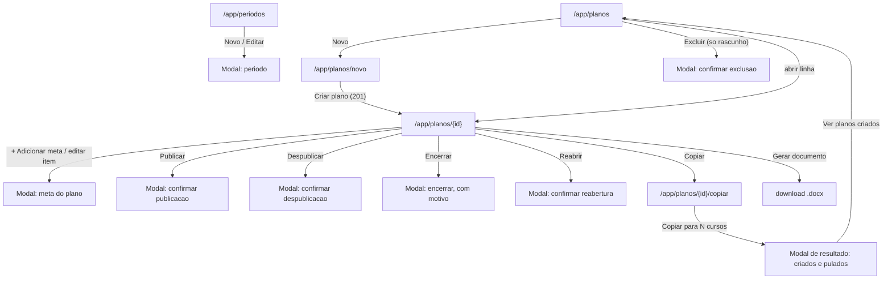

# UX: plano-acao

> Este documento **não repete** o que já está resolvido em `spec.md`: os
> cenários Given/When/Then, os wireframes ASCII (seção 16) e os diagramas
> Mermaid (seção 17) são a referência visual e comportamental oficial —
> releia-os junto com este arquivo. Aqui ficam as decisões que a spec
> deliberadamente deixa em aberto: componente shadcn/ui exato (sobre
> **Base UI**, não Radix — ver nota de implementação abaixo), estados de
> tela, foco de teclado, responsividade tela a tela, dirty state e
> microcópia.
>
> Sistema **não** é DSGOV/portal público — eMAG não se aplica. WCAG 2.2 AA
> se aplica integralmente (`.claude/skills/accessibility/SKILL.md`).
>
> **Nota de implementação (Base UI, não Radix):** o `shadcn` deste projeto
> usa `@base-ui/react` por baixo (`components/ui/*`), não Radix nem `cmdk`.
> Onde este documento menciona `Combobox`, é composição de
> `Combobox`/`ComboboxInput`/`ComboboxContent`/`ComboboxList`/`ComboboxItem`
> etc. de `components/ui/combobox.tsx`, normalmente através do wrapper já
> pronto `ComboboxEntidade` (`components/shared/forms/combobox-entidade.tsx`)
> — **não recriar a composição do zero**, e não presumir paridade com a
> API do Radix/`cmdk` usada em outros projetos: a composição errada desses
> primitivos já quebrou em runtime três vezes nesta implementação.

---

## Fluxo de telas

1. **Grid de Períodos** (`/app/periodos`) — propósito: o PI cadastra e
   mantém os períodos letivos da instituição. Único acesso: PI.
2. **Formulário de Período** (modal, dentro de `/app/periodos`) — criar ou
   editar nome/início/fim.
3. **Grid de Planos** (`/app/planos`) — propósito: o PI pesquisa os planos
   de metas da instituição; o Coordenador (leitura) chega à mesma rota, mas
   só enxerga os planos vigentes/encerrados dos cursos que coordena.
4. **Novo Plano** (`/app/planos/novo`, página) — propósito: escolher curso e
   período e preencher os campos textuais do plano; salva em rascunho e
   encaminha para a tela de detalhe, onde as metas são adicionadas.
5. **Plano** (`/app/planos/{id}`, página) — propósito: é o documento vivo —
   dados do plano, aprovação, lista de metas com indicador de cada uma, e as
   ações de ciclo de vida (publicar, despublicar, encerrar, reabrir, copiar,
   gerar documento).
6. **Modal: Adicionar/editar meta do plano** — dentro da tela de detalhe.
7. **Modais de confirmação de ciclo de vida** — Publicar, Despublicar,
   Encerrar (com motivo), Reabrir, Excluir.
8. **Cópia em lote** (`/app/planos/{id}/copiar`, página) — propósito:
   replicar um plano para até 100 cursos, num período igual ou diferente.

---

## Mapa de navegação



---

## Regra de "ação sem permissão": escondida vs. desabilitada

Aplicação da regra já formalizada em `autenticacao-usuarios/ux.md` a esta
feature — mesma lógica, novos exemplos:

| Situação | Tratamento | Motivo |
|---|---|---|
| Grupo de menu "Metas" e itens "Períodos"/"Planos" para quem não é PI nem Coordenador | **Escondida** | Estruturalmente impossível |
| Coordenador tentando abrir `/app/planos/novo`, editar campos do plano, publicar/despublicar/encerrar/copiar | **Escondida** — os botões de ação de PI não aparecem na tela dele; ele só vê os botões `[⤓ Documento]` (a partir de vigente) | O perfil dele não tem a permissão em nenhum caso, não é restrição pontual |
| `[▶ Publicar]` num plano em rascunho **sem nenhum item** | **Desabilitado**, com `aria-describedby` "Adicione pelo menos uma meta antes de publicar." | O PI está autorizado a publicar; a condição que falta é local e se resolve ali mesmo |
| `[⏸ Despublicar]` num plano vigente **com entrega registrada** | **Desabilitado**, com `aria-describedby` "Não é possível despublicar: este plano já tem entregas registradas." | Mesma lógica — ação normalmente disponível ao PI, bloqueada por uma condição do dado |
| `[✗]` de item do plano **com entrega** | **Escondido** (o próprio wireframe 16.2 já define isso: "some quando o item já tem entrega") | Aqui a spec já decidiu por "some", não por desabilitar — mantido como está |
| `[✗ Excluir]` na linha do grid de planos | **Escondido** para qualquer situação diferente de rascunho | Rascunho nunca tem entrega (3.3: rascunho não aceita entrega), então não existe o caso "rascunho com entrega" que precisaria de desabilitar em vez de esconder |
| Editar quantidade de um item com o **período encerrado** | **Desabilitado** no ícone de editar da linha, com `aria-describedby` "Alteração bloqueada: o período deste plano já encerrou." | Situação pontual e explicável, não estrutural |

**Campos que a API precisa expor para a UI decidir sem adivinhar** (ver
"O que o `arquiteto` precisa saber" ao final): `tem_entrega: boolean` por
plano (grid e detalhe) para o `[⏸]`; a contagem de itens (`Metas`, já
prevista na spec) cobre o `[▶]`; `tem_entrega` por item (já citado no
wireframe, precisa ser campo real) cobre o `[✗]` do item.

---

## Componentes shadcn/ui (Base UI) — mapeamento e organização de pastas

Estrutura conforme `.claude/skills/frontend-nextjs-shadcn/SKILL.md`.
**Nenhum componente novo em `shared/` é necessário para esta feature** —
tudo o que ela precisa já existe, reutilizado do catálogo criado em
`autenticacao-usuarios`.

### `shared/ui/` (reutilizado, nada novo)

| Componente | Onde é usado aqui |
|---|---|
| `LoadingButton` | Todo botão assíncrono: Pesquisar, Salvar, Criar plano, Publicar, Despublicar, Encerrar, Reabrir, Copiar, Gerar documento, Excluir |
| `SkeletonTable` | Grid de períodos e grid de planos, carregando |
| `EmptyState` | Grids sem resultado; "Metas do plano" vazio |
| `ErrorState` | Falha de pesquisa nos dois grids; falha ao carregar o plano |
| `ConfirmDialog` | Excluir período, excluir plano, despublicar, reabrir — confirmações simples sem campo próprio |
| `StatusBadge` | Situação do período (Não iniciado/Aberto/Encerrado) e do plano (Rascunho/Vigente/Encerrado) |
| `TopProgressBar` / `Toaster` | Padrão universal do shell |
| `cabecalho-ordenavel.tsx` | Cabeçalhos clicáveis dos dois grids |
| `paginacao.tsx` | Paginação dos dois grids |

### `shared/forms/` (reutilizado, nada novo)

| Componente | Onde é usado aqui |
|---|---|
| `ComboboxEntidade` | Campo "Curso" e "Período" em Novo Plano e na Cópia em lote; campo "Meta" no modal de adicionar item — **sem criação inline** em nenhum dos três: curso e período são cadastros de outra tela/feature, e meta vem do catálogo de `indicadores`, que a spec explicitamente reserva a outra tela ("os indicadores não são escolhidos aqui — vêm da meta"; a meta em si também não se cria aqui) |

### `features/periodo/` (novo, específico da entidade)

`periodo-filtro.tsx`, `periodo-table.tsx`, `periodo-card-mobile.tsx`,
`periodo-form-modal.tsx` (`Dialog` `max-w-md`, `Form`, `Input` nome, dois
campos de data).

### `features/plano/` (novo, específico da entidade)

| Componente | Uso |
|---|---|
| `plano-filtro.tsx` | `ComboboxEntidade` período, `Select` curso¹, `Select` situação, `Select` aprovação, `LoadingButton` |
| `plano-table.tsx` | `Table` family, sem `@tanstack/react-table` (mesma decisão de `autenticacao-usuarios`), `StatusBadge` |
| `plano-card-mobile.tsx` | `Card`, para 360px |
| `plano-cabecalho.tsx` | Título, badges de situação, linha do coordenador, barra de ações do plano |
| `plano-aviso-aprovacao.tsx` | O aviso persistente de "sem aprovação" (`Alert` variante informativa, `role="status"`) |
| `plano-dados-form.tsx` | `Form`, `Textarea` ×5 (descrição, objetivo, resultados, PDI, PPC), `Input` data de aprovação, `Select` órgão |
| `plano-itens-tabela.tsx` | Tabela de metas do plano, com a lista de indicadores por linha |
| `item-plano-form-modal.tsx` | `Dialog` `max-w-md`, `ComboboxEntidade` meta (só em criação), `Input` quantidade numérico |
| `publicar-dialog.tsx`, `encerrar-dialog.tsx` | `AlertDialog`/`Dialog` de confirmação, com corpo específico por ação |
| `selecao-cursos-lote.tsx` | Lista de cursos com `Checkbox` real por linha, busca, contador ao vivo — específico o bastante desta tela (não reaproveitado em nenhuma outra feature hoje) para ficar em `features/plano/`, não em `shared/` |
| `resultado-copia-dialog.tsx` | `Dialog` com o resumo "N criados · M pulados" |

¹ Filtro "Curso" no grid de planos: `Select` simples (não `Combobox`) é
aceitável aqui porque o universo é só os cursos **ativos** da instituição
que já têm ao menos um plano no filtro corrente — lista curta e sem
necessidade de criação; se o volume real de cursos ativos ultrapassar a
faixa confortável de um `Select` (~30-40 itens visíveis sem busca),
promover para `ComboboxEntidade` é a migração natural, mesmo raciocínio
já registrado para o combo de instituições no login.

### Hooks (`features/*/hooks/`)

`usePeriodos`, `usePeriodo`, `useCriarPeriodo`, `useAtualizarPeriodo`,
`useExcluirPeriodo`; `usePlanos`, `usePlano`, `useCriarPlano`,
`useAtualizarPlano`, `useExcluirPlano`, `usePublicarPlano`,
`useDespublicarPlano`, `useEncerrarPlano`, `useReabrirPlano`,
`useItensDoPlano`, `useCriarItem`, `useAtualizarItem`, `useExcluirItem`,
`useCursosParaCopia`, `useCopiarPlanoEmLote`, `useGerarDocumento`.
Todos expõem `{ data, isLoading, error }` ou equivalente.

---

## Tela: Grid de Períodos (`/app/periodos`)

- **Ação primária:** Novo
- **Ações secundárias:** Pesquisar, Editar, Excluir, ordenar, paginar
- **Loading:** `SkeletonTable`; botão "Pesquisar" vira `LoadingButton`
  "Pesquisando..."
- **Error:** `ErrorState` com "Tentar novamente"
- **Empty:** antes da 1ª pesquisa (instrutivo) e pesquisa sem resultado
  (`EmptyState` com ícone) — padrão universal
- **Data:** grid com ordenação e paginação

### Grid

- **Filtros:** Nome (`Input` texto livre) · Situação (`Select`: Todas /
  Não iniciado / Aberto / Encerrado, padrão **Todas**)
- **Colunas:** Nome · Início · Fim · Situação (derivada) · Planos · Ações
- **Ordenáveis:** Nome, Início, Fim. **Não ordenável:** Situação (derivada
  do relógio, não da linha) e Planos (contagem)
- **Padrão:** Início, **decrescente** — conforme `spec.md` 3.8
- **Página:** 20

A coluna **Planos** é um número **e** um link: clicar nele navega para
`/app/planos` com o filtro Período já pré-preenchido com este período —
atalho que evita reconfigurar o filtro manualmente. Não é requisito da
spec; é uma decisão de conveniência de baixo custo, registrada aqui.

### Ações por linha

`[✎]` abrir modal de edição · `[✗]` excluir. **Sem publicar/despublicar
aqui** — situação de período não é um estado que se aciona, é derivada.

### Acessibilidade

- Situação sempre em texto (`StatusBadge` com rótulo, nunca só cor).
- Resultado anunciado via `aria-live="polite"` fora da tabela: "6 períodos
  encontrados."
- `aria-sort` nos cabeçalhos ordenáveis; cabeçalho de "Situação" e "Planos"
  sem `<button>`, texto simples.

### Microcópia

| Elemento | Texto |
|---|---|
| Título | "Períodos" |
| Botão novo | "+ Novo" |
| Antes da 1ª pesquisa | "Use os filtros acima e clique em Pesquisar para ver os períodos." |
| Sem resultado | "Nenhum período encontrado." |
| Erro | "Não foi possível carregar os períodos agora." |
| Confirmação de exclusão | "Excluir o período {nome}? Esta ação não pode ser desfeita." |
| Exclusão bloqueada (409) | "Este período tem planos vinculados e não pode ser excluído." (toast erro) |
| Toast criação/edição/exclusão | "Período cadastrado." / "Período atualizado." / "Período excluído." |

---

## Tela: Formulário de Período (página — Novo / Editar)

**Convertida de modal para página em `specs/_padrao-formularios.md`**
(aprovado 29/09/2026, §10): `/app/periodos/novo` e `/app/periodos/[id]`,
componente `PeriodoForm` autônomo (recebe `periodo`, `onSalvo`,
`onCancelar`, `onDirtyChange`, `onConflito`, `criarOutro` — não sabe se
está em página ou modal). Segue a estrutura comum do padrão: `Trilha` +
`<h1>` + formulário em `max-w-3xl`, grid `md:grid-cols-2`, botões no
rodapé à direita; dirty state via `useGuardaDeSaida` (não o guarda de
senha provisória — este pergunta antes de sair, não bloqueia).

- **Ação primária:** Salvar · **Secundária:** Cancelar · **Criação
  também tem:** "Salvar e cadastrar outro" (§7.2 do padrão — período é
  cadastro de catálogo, mesma categoria de indicador e curso)
- **Loading:** campos desabilitados + `LoadingButton` "Salvando..."
- **Error:** erro de campo (`FieldError` via `aria-describedby`); conflito
  de versão (editar) via `Alert` destrutivo + botão "Recarregar dados",
  que refaz o `GET` e repopula o formulário sem sair da página
- **Data:** campos vazios (novo) ou preenchidos (editar); skeleton com a
  forma dos campos enquanto o `GET /periodos/{id}` carrega

**Campos:** Nome, Data de início, Data de fim — 3 campos. Um quarto
bloco, **Situação**, aparece abaixo da data de fim — não é campo (ver
seção seguinte).

### Situação — informação calculada, não campo

**Decisão do dono do produto (29/09):** a situação do período (Não
iniciado / Aberto / Encerrado) nunca foi um campo editável — é derivada
comparando hoje com o intervalo de datas (`Periodo.SituacaoEm`, mesma
regra de `Vigencia.SituacaoEm` usada em designação). O formulário estava
correto em não ter um campo de situação, mas não explicava por quê: ao
editar, o usuário via a situação na lista, abria o formulário, não
encontrava onde alterá-la, e não havia nada na tela dizendo que aquilo é
derivado, não esquecido.

**Correção:** o formulário mostra a situação como informação — `StatusBadge`
(mesmo rótulo/variante do grid) + texto explicando a origem — logo abaixo
do campo "Data de fim". **Atualiza a cada tecla**, não só ao salvar: o
valor é recalculado a partir de `data_inicio`/`data_fim` do próprio
formulário (estado local, não o registro salvo), comparado com "hoje" no
fuso de exibição (`America/Sao_Paulo` — nunca a data do navegador em UTC,
mesma armadilha já corrigida no relê e na exibição de datas). Isso deixa
visível, antes de confirmar, que mudar a data de fim para ontem encerra o
período.

**Recusado explicitamente:** tornar a situação um campo editável. Um
campo editável ao lado de um valor sempre recalculado das mesmas datas
cria duas fontes de verdade sobre o mesmo fato — a segunda poderia
divergir da primeira a qualquer alteração de data, sem nenhum evento que
force a sincronização.

**Convivência com o aviso de reabertura (abaixo):** os dois blocos nunca
competem por atenção porque têm pesos visuais diferentes — a situação é
um `Field` neutro (badge + legenda em `text-muted-foreground`), o aviso de
reabertura é um `Alert` de verdade. Quando os dois aparecem juntos
(período encerrado sendo prorrogado), a leitura é "isto é o que a
situação será → isto é o efeito colateral de chegar lá", não uma pilha de
avisos repetindo a mesma informação.

### O cuidado da data de fim inclusiva

Abaixo do campo "Data de fim", um texto de apoio fixo (não é erro, não
desaparece):

> "O dia inteiro da data de fim conta — entregas são aceitas até 23h59 desse
> dia, no horário de Brasília."

Isso existe porque é exatamente o ponto que a spec marca como armadilha
(`PE-04`, `X7`): sem esse aviso, quem cadastra o período tende a supor
que "termina em 30/07" significa que o dia 30 já está fora.

**Ao editar um período já encerrado** (data de fim no passado), um segundo
aviso informativo aparece acima do campo de data de fim quando o valor é
alterado para uma data futura: "Prorrogar reabre este período e os planos
vigentes dele, que voltam a aceitar entrega." — confirma o efeito de
`PE-06` antes de salvar, sem bloquear.

### Validação client-side (espelha os erros 400 do backend)

| Situação | Mensagem |
|---|---|
| Nome vazio | "Informe um nome para o período." |
| Data de fim anterior à de início | "A data de fim precisa ser igual ou posterior à data de início." |
| Nome duplicado (409, só se detectado no submit) | "Já existe um período com este nome nesta instituição." |

### Foco, teclado, dirty state, responsividade

Foco inicial em Nome; ordem de tabulação segue a grade (linha a linha);
`Ctrl+S` salva. Dirty state via `useGuardaDeSaida` (§5.2 do padrão): link
de menu/trilha, botão Voltar do navegador e "Cancelar" disparam
`ConfirmDialog` de descarte quando há dados sujos; `beforeunload` nativo
cobre F5/fechar aba. `Esc` não tem ação nesta tela (diferente do modal
antigo — página não fecha com `Esc`). Erro de validação ao submeter leva
o foco ao primeiro campo com erro. Coluna única `< md`, duas colunas
`≥ md` (grade de `PeriodoForm`, igual aos demais formulários do padrão).

### Microcópia

| Elemento | Novo | Editar |
|---|---|---|
| Título | "Novo período" | "Editar período" |
| Botão salvar | "Salvar" → "Salvando..." | idem |
| Conflito de versão | — | "Este registro foi alterado por outro usuário enquanto você editava." + "Recarregar dados" |

---

## Tela: Grid de Planos (`/app/planos`)

- **Ação primária:** Novo (só PI)
- **Ações secundárias:** Pesquisar, abrir, copiar, gerar documento,
  publicar, despublicar, excluir, ordenar, paginar
- **Loading:** `SkeletonTable`, 6 colunas
- **Error:** `ErrorState` "Tentar novamente"
- **Empty:** antes da 1ª pesquisa; sem resultado
- **Data:** grid conforme wireframe 16.1

### Grid (conforme `spec.md` 3.8, sem redefinir)

- **Filtros:** Período (`ComboboxEntidade`, pré-selecionado com o **aberto
  mais recente** apenas quando não há estado salvo em `localStorage` — ver
  nota abaixo) · Curso (`Select`, ver nota¹ acima) · Situação (`Select`:
  Todas / Rascunho / Vigente / Encerrado, padrão **Todas**) · Aprovação
  (`Select`: Todos / Aprovados / Sem aprovação, padrão **Todos**)
- **Colunas:** Curso · Período · Situação · Metas · Exigido · Aprovação ·
  Ações
- **Ordenáveis:** Curso, Período, Situação, Cadastrado em. **Não
  ordenáveis:** Metas, Exigido, Aprovação (todos computados)
- **Padrão:** Curso, **crescente** · **Página:** 20

**Precedência do padrão universal sobre o pré-selecionado:** o padrão
universal do CLAUDE.md (filtro restaurado do `localStorage` na visita
seguinte) prevalece sobre "Período pré-selecionado com o aberto mais
recente" assim que existe um valor salvo — o pré-selecionamento do período
aberto só se aplica **na primeira visita de sempre** a esta tela (sem
chave `grid-state:planos` ainda gravada). Isso evita a estranheza de o PI
escolher deliberadamente "2025.2" para investigar algo, sair da tela, e
voltar vendo "2026.1" de novo.

**Perfil Coordenador nesta mesma rota:** vê a mesma grade, mas sem o
botão "+ Novo", sem `[⧉]`/`[▶]`/`[⏸]`/`[✗]` em nenhuma linha (regra de
"escondido" da seção acima) — só `[✎]` (abre em leitura) e `[⤓]`. O
filtro "Curso" dele é restrito aos cursos que coordena (a API já filtra;
o `Select` do filtro mostra só os dele).

### Coluna Aprovação — texto, nunca cor isolada

"{data} · {órgão}" · "—" (rascunho sem dados, sem aviso) · "⚠ sem
aprovação" (vigente/encerrado sem dados) — exatamente como a spec descreve
em 3.3 e no wireframe 16.1.

### Acessibilidade

- Resultado anunciado (`aria-live="polite"`): "5 planos encontrados."
- Ícones de ação com `aria-label` específico: "Abrir plano de {curso} em
  {período}", "Copiar plano de {curso}", "Baixar documento de {curso}",
  "Publicar plano de {curso}", "Despublicar plano de {curso}", "Excluir
  plano de {curso}".
- "Vago ⚠" e "sem aprovação" são texto, nunca só ícone/cor.

### Responsividade

| Largura | Colunas visíveis | Filtro |
|---|---|---|
| 1440px | todas | uma linha |
| 768px | Curso, Situação, Aprovação, Ações (oculta Período e Metas/Exigido — ficam no card ao clicar/expandir a linha, ou em segunda linha da célula) | quebra em duas linhas |
| 360px | Vira card por plano: Curso + Período, `StatusBadge` de Situação, linha "Metas: N · Exigido: M", Aprovação em texto, ações em ícone | filtros empilhados |

### Microcópia

| Elemento | Texto |
|---|---|
| Título | "Planos de Metas do Curso" |
| Botão novo | "+ Novo" |
| Antes da 1ª pesquisa | "Use os filtros acima e clique em Pesquisar para ver os planos." |
| Sem resultado | "Nenhum plano encontrado." |
| Nota de rodapé do grid | "«Exigido» é a soma das quantidades dos itens — sempre por curso, nunca dividida entre cursos nem multiplicada pelo número de indicadores." |
| Nota de rodapé (aprovação) | "«sem aprovação» indica plano que já está cobrando e ainda não teve a aprovação registrada. Publicar sem aprovação é permitido." |
| Toast excluir | "Plano excluído." |
| Excluir bloqueado (409, defensivo — não deveria ocorrer dado o botão escondido) | "Este plano não pode ser excluído nesta situação." |

---

## Tela: Novo Plano (`/app/planos/novo`, página)

**Por que página, não modal:** o formulário tem 7 campos (curso, período,
descrição, objetivo geral, resultados esperados, alinhamento PDI,
alinhamento PPC) mais os dois campos opcionais de aprovação — acima do
teto de ~6 campos do CLAUDE.md para modal — e é o primeiro passo de uma
tela que, na sequência, ganha uma lista interna (as metas). Cai
diretamente na regra "formulário com 7+ campos ou lista interna → página
nova".

- **Ação primária:** Criar plano
- **Loading:** campos desabilitados + `LoadingButton` "Criando..."
- **Error:** erro de campo; 400 `CURSO_INATIVO`; 409 `PLANO_DUPLICADO`
  (ver abaixo); 404 se curso/período pertencerem a outra instituição
  (defensivo — o combo só lista os da própria instituição)
- **Data:** formulário vazio

### Campos

Curso* (`ComboboxEntidade`, só cursos ativos) · Período*
(`ComboboxEntidade`) · Descrição* (`Textarea`) · Objetivo geral*
(`Textarea`) · Resultados esperados* (`Textarea`) · Alinhamento com o PDI
(`Textarea`, opcional) · Alinhamento com o PPC (`Textarea`, opcional) ·
Aprovação — Data + Órgão (opcionais, par-ou-nenhum, `Select` de órgão
fechado NDE/Colegiado de curso). Grid responsivo `md:grid-cols-2` para os
campos curtos, `col-span-full` para os `Textarea` — regra padrão do
CLAUDE.md para formulário.

Acima de cada `Textarea` de texto livre institucional, uma nota fixa (não
erro): "Não inclua nome de pessoa neste campo — ele vai para um documento
que circula." (reflexo direto de `spec.md`, seção 8, LGPD).

### PLANO_DUPLICADO — erro de campo com saída

Quando o back-end responde 409 `PLANO_DUPLICADO`, o erro aparece junto ao
campo Período (não como toast solto), porque é ali que a combinação
curso+período se resolve: **"Já existe um plano para {curso} em
{período}."** com um link/botão discreto **"Abrir esse plano"** que
navega direto para `/app/planos/{id}` existente — poupa o PI de voltar ao
grid e procurar.

### Depois de criar

201 → toast "Plano criado em rascunho." → redireciona para
`/app/planos/{id}`, onde a seção "Metas do plano" aparece vazia com aviso
"Adicione pelo menos uma meta para poder publicar este plano." até o
primeiro item ser criado.

### Foco, teclado, dirty state, responsividade

Foco inicial em Curso; `Ctrl+S` salva; ao tentar sair com dados
preenchidos (navegar para outra rota, fechar aba) — `ConfirmDialog` de
descarte / `beforeunload`, mesmo padrão universal. 360/768: coluna única;
1440: `md:grid-cols-2` nos campos curtos.

---

## Tela: Plano (`/app/planos/{id}`, página) — o documento vivo

**Por que página, e por que a tela precisa "parecer um plano":** é o
artefato central do produto — vai virar o `.docx` que circula na
instituição. Uma pilha genérica de campos empilhados comunica "formulário
de sistema"; o objetivo aqui é que a tela leia como o próprio documento,
em seções com identidade visual clara (título de seção real, `<h2>`, não
só peso de fonte), na mesma ordem em que aparecem no `.docx` gerado
(spec.md 3.5): identificação → dados do plano → aprovação → metas.

```
┌ Cabeçalho ─────────────────────────────────────────────────┐
│ {Curso} · {Período} · [Situação]           [Copiar][⤓ Doc] │
│ Coordenador: {nome} (Portaria N, até DD/MM) ou "Sem resp."  │
│                                        [Despublicar/Publicar]│
├ Aviso (condicional) ──────────────────────────────────────── │
│ ⚠ role=status: aprovação pendente                            │
├ Dados do plano ────────────────────────────────────────────┤
│ Descrição / Objetivo geral / Resultados esperados            │
│ Alinhamento PDI · Alinhamento PPC                             │
├ Aprovação ─────────────────────────────────────────────────┤
│ Data · Órgão                                                  │
│                                    [Cancelar] [Salvar]         │
├ Metas do plano ────────────────────────────────────────────┤
│ tabela: Meta · Indicadores · Qtd · Ações      [+ Adicionar]   │
│ Total exigido: N entregas aceitas                              │
└──────────────────────────────────────────────────────────────┘
```

- **Ação primária:** Salvar (seção "Dados do plano" + "Aprovação")
- **Ações secundárias:** Publicar/Despublicar, Encerrar/Reabrir, Copiar,
  Gerar documento, Adicionar/editar/remover meta
- **Loading:** skeleton de página inteira na 1ª carga (cabeçalho + 3
  blocos de texto + tabela vazia, mesma estrutura do estado com dado);
  cada ação (Publicar, Copiar, Gerar documento etc.) tem seu próprio
  `LoadingButton`
- **Error:** `ErrorState` de página inteira se o plano não carregar
  (`404` redireciona — ver nota) ou "Tentar novamente" para falha de rede
- **Empty:** não se aplica à página; a seção "Metas do plano" tem seu
  próprio vazio (ver abaixo)
- **Data:** conteúdo pleno, conforme wireframe 16.2

**404 do plano (rascunho pedido pelo coordenador, ou de outra
instituição):** a página mostra o mesmo `ErrorState` visualmente, mas com
o texto "Este plano não existe ou você não tem acesso a ele." e botão
"Voltar para Planos" — nunca um texto que sugira "existe, mas está
escondido", coerente com a decisão da spec de que 404 aqui é deliberado
(3.7).

### Situação: o que muda visualmente em cada uma

| Situação | `StatusBadge` | O que a tela reforça |
|---|---|---|
| **Rascunho** | cinza/neutro, "Rascunho" | Botão principal é `[▶ Publicar]`; seção "Metas do plano" plenamente editável; sem aviso de aprovação (nunca, mesmo sem dados — spec 3.3, `SI-07`) |
| **Vigente** | verde, "Vigente" | Botão principal é `[⏸ Despublicar]`; "Metas do plano" aceita adicionar/editar enquanto o período estiver aberto; aviso de aprovação aparece se faltar |
| **Encerrado** | cinza escuro, "Encerrado" + texto complementar "— período encerrado em DD/MM/AAAA" ou "— encerrado em DD/MM/AAAA: {motivo}" quando antecipado | Sem `[▶]`/`[⏸]`; aparece `[↺ Reabrir]` **só se o período ainda estiver aberto** (encerramento antecipado reabrível); "Metas do plano" fica **somente leitura** — sem "+ Adicionar meta" nem ícones de editar/excluir linha |

**Nota de divergência/confirmação pendente ao `arquiteto`:** a spec
(3.4) só amarra o bloqueio de edição de quantidade ao **período**
encerrado (`PLANO_ENCERRADO_PARA_EDICAO`), não explicitamente ao plano
encerrado **antecipadamente** com período ainda aberto. Esta tela adota,
por consistência de produto, a regra mais simples e defensável — "Metas
do plano" vira somente leitura sempre que a situação do plano (derivada)
é Encerrado, qualquer que seja o motivo — porque um plano que já não está
"vigente" não deveria ganhar meta nova enquanto nessa condição. **Peço
confirmação do backend refletir a mesma regra** (bloquear
`criar_item`/`atualizar_item`/`excluir_item` também quando
`encerrado_em` está preenchido, não só quando o período está encerrado) —
senão a UI escondendo os botões cria uma falsa sensação de trava que a
API não reforça.

### Aviso persistente de aprovação pendente

Componente `PlanoAvisoAprovacao` (`features/plano/components/`). `Alert`
variante informativa (não destrutiva), `role="status"`, logo abaixo do
cabeçalho, presente **somente** quando: situação ∈ {Vigente, Encerrado}
**e** (`aprovacao_data` ou `aprovacao_orgao`) estão vazios — nunca em
Rascunho, mesmo sem os dois dados, porque é o estado normal de quem ainda
está montando o plano. Texto exatamente o da spec 3.3: **"Este plano está vigente e
ainda não tem aprovação registrada. Informe a data e o órgão quando a
reunião acontecer."** (variante para Encerrado: "Este plano foi encerrado
sem aprovação registrada." — mesmo tom, mesmo papel). Some **sem reload de
página** assim que os dois campos são salvos com sucesso (atualização
otimista do estado local, sem esperar refetch).

### Seção "Dados do plano" + "Aprovação"

`Textarea` para os cinco campos de texto (mesma nota de LGPD da tela de
criação); `Input` tipo data + `Select` de órgão para aprovação, com a
mesma regra par-ou-nenhum validada no cliente antes do submit. Botão
"Salvar" só desta seção — a tabela de itens não faz parte deste "Salvar"
(cada linha de item se salva por conta própria, ver abaixo). Dirty state
rastreado **só** nestes campos.

### Seção "Metas do plano"

- **Empty:** ícone + "Nenhuma meta adicionada ainda." + "+ Adicionar
  meta" em destaque — texto distinto de "carregando".
- **Data:** tabela Meta · Indicadores (lista, com origem: "1.4 · 1.5 (Do
  INEP)") · Qtd · Ações. Rodapé "Total exigido deste curso: N entregas
  aceitas".
- Ícone `[✎]` de cada linha abre o mesmo modal de item, com o campo Meta
  fixo (texto, não `Combobox`) e só Quantidade editável — a meta de um
  item já criado não é trocável (é a identidade do vínculo).
- `[✗]` **escondido** quando o item tem entrega (regra já registrada
  acima); quando visível, abre `ConfirmDialog` "Remover {meta} deste
  plano?".
- **Acrescentar item a plano vigente:** ao salvar com sucesso, toast de
  sucesso **mais** um segundo toast/nota informativa (não bloqueante):
  "O coordenador verá esta meta na próxima visita a Minhas metas." — é o
  aviso que a spec pede em `IT-08`, entregue como reforço textual, não
  como confirmação extra (a ação em si não precisa de confirmação, só de
  contexto pós-fato).

### Barra de ações do cabeçalho

`[⧉ Copiar]` (navega para `/app/planos/{id}/copiar`) · `[⤓ Documento]`
(`LoadingButton`, ver seção própria) · `[▶ Publicar]` **ou**
`[⏸ Despublicar]` conforme situação · `[⏹ Encerrar]` (só quando vigente)
**ou** `[↺ Reabrir]` (só quando encerrado e período aberto).

### Modais de confirmação de ciclo de vida

**Publicar** — `Dialog` `max-w-md` (wireframe 16.4): resume "N metas · M
entregas exigidas", avisa se curso vago, avisa se falta aprovação — texto
exato já definido na spec (3.3, `SI-04`). Foco inicial em "Cancelar".

**Despublicar** — `ConfirmDialog` `max-w-sm`: "Despublicar o plano de
{curso}? O coordenador deixará de vê-lo em Minhas metas, e as entregas
deixam de ser possíveis." Só chega a esta ação quando `tem_entrega=false`
(botão desabilitado no caso contrário, ver seção de permissão).

**Encerrar** — `Dialog` `max-w-md`, com `Textarea` de motivo **obrigatório**
(`aria-required`, erro "Informe o motivo do encerramento." se vazio):
"Encerrar antecipadamente o plano de {curso}? A partir de agora, nenhuma
entrega nova é aceita — avaliar as pendentes continua possível." Foco
inicial no campo de motivo (é o campo que precisa preenchimento, não em
"Cancelar" aqui, porque a ação em si — abrir o modal — já é a intenção
declarada; o cuidado fica em não deixar submeter vazio).

**Reabrir** — `ConfirmDialog` `max-w-sm`: "Reabrir o plano de {curso}? Ele
volta a vigente e a aceitar entrega." Só aparece quando o período ainda
está aberto (regra já registrada); se por uma corrida o período encerrar
entre o carregamento da tela e o clique, o 200 esperado vira o plano
permanecer Encerrado — nesse caso toast informativo "O período já
encerrou; o plano continua encerrado." em vez de erro genérico.

**Excluir plano** — mesma estrutura do `ConfirmDialog` de excluir usuário
em `autenticacao-usuarios`: "Excluir o plano de {curso} em {período}?
Esta ação não pode ser desfeita." Só alcançável a partir do grid (rascunho
sem entrega, já coberto pela regra de esconder acima).

### Modal: Adicionar/editar meta do plano

`Dialog` `max-w-md` (wireframe 16.4). Ao escolher uma meta no
`ComboboxEntidade`, a área "Indicadores da meta" abaixo do combo se
preenche automaticamente (somente leitura, vem do catálogo — não é
seleção) com código, nome e origem de cada indicador. Campo Quantidade:
`Input type="number"` `min={1}` `step={1}`, com validação client-side
imediata ("Informe uma quantidade de 1 ou mais.") antes mesmo do submit —
mensagem de erro de validação aparece sem animação, conforme o padrão
universal de motion. Nota fixa abaixo do campo, sempre visível: "Uma
entrega atende todos os indicadores desta meta — a quantidade não é
multiplicada por eles." e "A quantidade é deste plano; a mesma meta pode
exigir outro número em outro curso."

**META_DUPLICADA_NO_PLANO (409):** erro de campo junto ao `Combobox` de
meta: "Esta meta já está neste plano." — só ocorre em modo criação (em
edição o combo nem aparece).

---

## Tela: Cópia em lote (`/app/planos/{id}/copiar`, página)

**Por que página:** tem lista interna (os cursos de destino, potencialmente
dezenas a centenas) com seleção — cai direto na regra "lista interna →
página nova", e é reforçado pelo próprio critério de velocidade que a
spec pede: uma operação que precisa ser rápida não deveria competir por
espaço com um `max-h-[85vh]` de modal.

- **Ação primária:** Copiar para N cursos
- **Loading:** campos desabilitados durante a busca de cursos
  (`SkeletonTable` na lista); botão final vira `LoadingButton`
  "Copiando..." (a operação pode levar até ~10s com 100 cursos — o
  `LoadingButton` sozinho não basta: ver nota de motion abaixo)
- **Error:** `ErrorState` se a lista de cursos falhar ao carregar
- **Empty:** "Nenhum curso ativo encontrado para {busca}." dentro da
  lista, se a busca não achar nada
- **Data:** conforme wireframe 16.3

### Campos e comportamento

Resumo da origem (fixo, não editável) · Período de destino*
(`ComboboxEntidade`, recarrega a lista de cursos ao trocar) · Busca de
curso (`Input`, `useDebounce` 300ms, filtra a lista via `busca=` no
endpoint `GET /planos/{id}/destinos-copia`) · Lista com `Checkbox` real
por linha (nunca `div` clicável fingindo checkbox — WCAG 4.1.2 e a
exigência explícita da spec em "Volume e requisitos não-funcionais"):

- Curso selecionável: `Checkbox` habilitado, coluna Coordenador (ou "Vago
  ⚠" em texto), coluna de status "—".
- Curso já com plano no período de destino: `Checkbox` **desabilitado**
  (`disabled` + `aria-describedby` apontando para o texto "Já tem plano"
  na própria linha) — nunca escondido da lista, porque o PI precisa ver
  que o curso existe e por que não pode ser escolhido.
- "Selecionar todos os selecionáveis (N)" — checkbox mestre com estado
  `indeterminate` quando a seleção é parcial.

### O limite de 100, ao vivo

Contador fixo acima da lista: **"{N} de 100 selecionados"**, atualizado
via `aria-live="polite"` a cada mudança de seleção (texto curto, não a
lista inteira, para não sobrecarregar o leitor de tela a cada clique).
Ao atingir 100, os `Checkbox` ainda não marcados ficam **desabilitados**
com `aria-describedby` "Limite de 100 cursos por lote atingido. Remova
algum curso selecionado para escolher outro." — impede ultrapassar o
limite pela interface, mesmo que o servidor também valide (`LOTE_ACIMA_DO_LIMITE`
como rede de segurança, nunca como único controle).

### Rodapé fixo (conforme wireframe 16.3)

Bloco estático "O que vai junto" / "O que NÃO vai junto" — texto fixo,
sem interatividade, reforça a decisão de produto antes da confirmação.
Botão final: `[Copiar para N cursos]`, texto do botão **atualiza com o N
corrente**, desabilitado quando N = 0.

### Enquanto a cópia roda (até ~10s)

Além do `LoadingButton` "Copiando..." no botão, a `TopProgressBar` do
shell já dispara (é uma chamada HTTP). **Sem barra de progresso
determinística por curso** — o endpoint responde uma vez, no fim, com o
resumo completo; não há como reportar progresso parcial sem mudar o
contrato para streaming, o que a spec não pede. Para não deixar a espera
de ~10s parecendo travada, o botão mantém o spinner girando e o texto
"Copiando..." — suficiente, dado que 10s é o teto documentado, não a
média.

### Resultado

`Dialog` de resultado (wireframe 16.3): "✓ N planos criados, em rascunho."
+ lista "⚠ M cursos pulados", cada um com curso e motivo. Botão "Ver
planos criados" navega para `/app/planos` com filtro Período = destino e
Situação = Rascunho pré-aplicados. **Nunca fecha silenciosamente em
sucesso puro** — mesmo com 0 pulados, o resumo aparece (a spec é
explícita: "não responde apenas sucesso").

### Acessibilidade

- Cada linha desabilitada: `aria-disabled` no `Checkbox` + texto do
  motivo dentro da própria linha (não só tooltip).
- Contador de selecionados: `aria-live="polite"`.
- Resultado final: `Dialog` com `role="alertdialog"` ou o resumo com
  `role="status"` interno — o resumo é informação importante mas não é
  erro; segue o mesmo critério de "informativo, não bloqueante" já usado
  no aviso de aprovação.

### Responsividade

| Largura | Comportamento |
|---|---|
| 1440px | tabela de cursos em largura total, colunas Curso/Coordenador/Status |
| 768px | mesma tabela, coluna Coordenador pode truncar com tooltip |
| 360px | lista vira cartões empilhados: `Checkbox` + nome do curso + coordenador/vago + motivo (se desabilitado) |

---

## Documento `.docx`

**Onde fica o botão:** `[⤓ Documento]` aparece em dois lugares —
cabeçalho da tela de detalhe do plano, e ícone `[⤓]` na linha do grid de
planos. Os dois disparam o mesmo fluxo.

**O que acontece enquanto gera:** `LoadingButton` com `loadingText`
"Gerando..." (`aria-busy="true"`), `TopProgressBar` também dispara (é
requisição HTTP). É síncrono (spec 12: p95 < 2s) — sem toast de "iniciado
em segundo plano", porque não é assíncrono. Ao concluir: o navegador
inicia o download do `.docx` (blob a partir da resposta,
`Content-Disposition` do backend nomeia o arquivo) e um toast de sucesso
confirma: **"Documento gerado e baixado."** Em falha (500 genérico):
toast erro **"Não foi possível gerar o documento agora. Tente
novamente."**

**Como o rascunho é marcado — o que a tela avisa antes de gerar:** a
marca em si (RASCUNHO / ENCERRADO — período encerrado em DD/MM/AAAA) é
escrita dentro do arquivo pelo backend, não pela tela. Mas para o PI não
ser surpreendido ao abrir o Word, uma nota contextual aparece **ao lado
do botão** (não um modal — não precisa de confirmação, é só contexto),
condicional à situação:

| Situação do plano | Nota ao lado do botão |
|---|---|
| Rascunho | "O documento trará a marca «RASCUNHO» visível, porque este plano ainda não foi publicado." |
| Vigente, sem aprovação | "O documento trará a observação «Aprovação ainda não registrada»." |
| Encerrado | "O documento trará a marca «ENCERRADO — período encerrado em DD/MM/AAAA»." |
| Vigente, com aprovação | (nenhuma nota — documento "limpo") |

---

## Atalhos de teclado desta feature

| Atalho | Ação | Escopo |
|---|---|---|
| `Ctrl+N` / `Cmd+N` | Abre "Novo período" (modal) | `/app/periodos` |
| `Ctrl+N` / `Cmd+N` | Navega para `/app/planos/novo` | `/app/planos` (só PI) |
| `Ctrl+S` / `Cmd+S` | Salva o formulário atual | Modal de período, Novo Plano, seção "Dados do plano", modal de item |
| `Ctrl+F` / `Cmd+F` | Foca o campo de busca | `/app/periodos` (Nome), `/app/planos` (nenhum campo de texto livre — foca o `Combobox` de Período), `/app/planos/{id}/copiar` (Buscar curso) |
| `Esc` | Fecha modal aberto, respeitando dirty state | Todos os modais desta feature |
| `?` | Abre o modal de atalhos de teclado | Shell autenticado (herdado) |

---

## Acessibilidade transversal (resumo executável)

| Aspecto | Regra aplicada nesta feature |
|---|---|
| Contraste | 4.5:1 texto, 3:1 componentes/foco |
| Situação (período, plano) | Sempre texto no `StatusBadge`, nunca só cor |
| "Vago", "sem aprovação", "Já tem plano" | Sempre texto, nunca só ícone |
| `aria-live` de resultado de grid | `polite`, texto-resumo fora da tabela |
| `aria-live` do contador de seleção (cópia em lote) | `polite`, texto curto |
| Aviso de aprovação pendente | `role="status"`, nunca `role="alert"` — é informativo, não erro |
| Confirmação de encerrar/excluir | `role="alertdialog"` (destrutivo/irreversível) |
| `Checkbox` da cópia em lote | elemento real, nunca `div` — `aria-describedby` no motivo de desabilitado |
| Botões de ação sem texto (grid) | `aria-label` específico, nunca genérico "editar"/"excluir" |
| `aria-busy` | `<form>` durante submit; container do grid durante pesquisa; botão de gerar documento |
| Ordem de tabulação | Corresponde à ordem visual em todas as telas |
| Motion | Parâmetros padrão do CLAUDE.md; `prefers-reduced-motion` respeitado; nenhuma animação decorativa nova criada por esta feature (nem pulso, nem bounce) |

---

## Decisões de fluxo / divergências

1. **Precedência do `localStorage` sobre o pré-selecionamento de período
   no grid de Planos** — registrada acima, na tela de Grid de Planos. Não
   é contradição da spec, é a aplicação do padrão universal (que a
   `spec.md` desta feature não menciona explicitamente) combinada com a
   regra específica dela ("Período pré-selecionado com o aberto mais
   recente").

2. **"Novo Plano" é fluxo em duas etapas** (criar cabeçalho → adicionar
   itens na tela de detalhe), não descrito com esse nível de detalhe
   mecânico pela spec (que só diz "Novo pede curso, período, descrição...
   Salva em rascunho"). É a leitura natural, já que item depende de
   `plano_id` existir.

3. **Divergência a confirmar com o `arquiteto`/backend:** "Metas do
   plano" vira somente leitura quando o plano está Encerrado por qualquer
   motivo (incluindo encerramento antecipado com período ainda aberto),
   ainda que a spec só amarre `PLANO_ENCERRADO_PARA_EDICAO` ao período
   encerrado. Ver detalhamento na seção "Situação" da tela de Plano.
   **Enquanto não confirmado:** a UI aplica a regra mais restritiva (mais
   segura) descrita acima.

4. **Campos computados que a API precisa expor, além dos já citados em
   `spec.md`:** `tem_entrega: boolean` por plano (habilita/desabilita
   `[⏸]` corretamente) e por item (habilita/desabilita `[✗]` da linha) —
   sem eles a tela teria que inferir a partir de uma segunda consulta ou
   assumir estado, o que quebra a regra de "desabilitar com motivo certo".

5. **Filtro "Curso" do grid de Planos como `Select` em vez de
   `ComboboxEntidade`** — decisão registrada na nota de rodapé da seção
   de componentes, com gatilho explícito de migração por volume.

Nenhum outro ponto foi alterado, reinterpretado ou contestado.

---

## O que o `arquiteto` precisa saber ao ler este documento

- `tem_entrega: boolean` precisa vir na resposta de listagem e detalhe de
  plano, e por item — ver "Decisões de fluxo", item 4.
- Confirmar se `criar_item`/`atualizar_item`/`excluir_item` também
  respondem 409 quando o **plano** está encerrado (não só quando o
  período está) — ver "Decisões de fluxo", item 3.
- O endpoint `GET /api/v1/planos/{id}/destinos-copia` precisa suportar
  `busca=` com debounce do lado do cliente (já previsto na spec, seção 9)
  — sem paginação própria descrita; assumindo que a lista completa de
  cursos ativos da instituição (centenas, PP-9) cabe numa resposta única,
  sem paginação adicional na tela de cópia.
- Nenhum componente novo em `shared/` — toda a reutilização está mapeada
  na seção de componentes.
